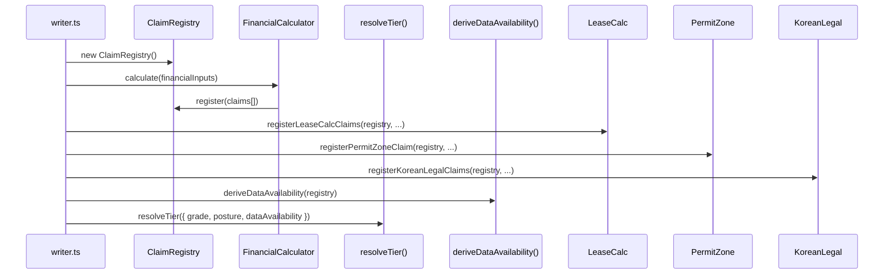

# 모바일 IM 스펙 — 데이터 생성 · LLM Writer · 뷰어 렌더링 · im-core 연동

> **문서 버전**: v6.0 (D37 Claim/Tier/Gate 고도화)
> **최종 갱신**: 2026-08-28
> **대상 커밋**: `450b58b`
> **선행**: D30~D37 전량 완료

---

## 1. 개요

모바일 IM(Investment Memorandum Lite)은 브로커 딜카드 데이터를 기반으로 **투자자 대상 웹 뷰어용 마크다운 투자설명서**를 AI + 결정론적 렌더러 조합으로 생성하는 엔진입니다.

### 1.1 핵심 설계 원칙

| 원칙 | 설명 |
|---|---|
| **위상 정렬 4단계 생성** | 섹션 간 의존성 해결 (독립→재무→리스크→논거) |
| **Claim 기반 데이터 흐름** (D37) | ClaimRegistry로 증거 관리, 하드코딩 제거 |
| **Fail-Closed 안전** | LLM 실패 시 `passed: false` 반환, 무검증 배포 원천 차단 |
| **수치 앵커 일관성** | NumericalAnchors로 섹션 간 가격/면적/수익률 기준점 고정 |
| **결정론적 계산 우선** (D37) | FinancialCalculator 1회 실행 → LLM은 설명만 |
| **타임아웃 방어** | Soft 90s → Hard 105s → Kill 120s, 미완 섹션 체크리스트 이관 |
| **5종 포스처 분화** | 동일 건물도 투자 목적에 따라 완전히 다른 서사 생성 |
| **5종 발행 등급** (D37) | ResolveTier → 재무 허용 범위 제어 |

---

## 2. 생성 파이프라인

> 📁 [`writer.ts`](file:///c:/Users/User/cre-dealcard/src/domain/building/mobile-im/writer.ts)

### 2.1 `generateMobileIM()` 10단계 파이프라인

| Stage | 단계 | 핵심 함수 | 설명 |
|:---:|---|---|---|
| 1 | 타이머 초기화 | `StageTimer(90, 105, 120)` | Soft/Hard/Kill 3단계 |
| 2 | 컨텍스트 빌드 | `buildIMContext(input)` | 3축 식별자 + 재무 + 섹션 플랜 |
| 3 | 수치 앵커 | `new NumericalAnchors(...)` | 전 섹션 수치 불변성 보장 |
| 4 | **결정론적 계산** (D37) | `ClaimRegistry` + `FinancialCalculator.calculate()` | 1회 실행, Claim 등록 |
| 5 | **DA 파생** (D37) | `deriveDataAvailability()` | 실데이터 기반 가용성 플래그 |
| 6 | 4-Stage 위상정렬 | `getActiveStagePlan()` → `generateSingleSection()` | 병렬 Stage 1 → 순차 2~4 |
| 7 | 품질 게이트 | `runPublishGates(gateCtx)` | G01~G53 (49종) |
| 8 | 교차 검증 | `runCrossValidation()` | 섹션 간 수치 모순 탐지 |
| 9 | RAG 인덱싱 | `indexIMSections()` | 비동기 임베딩 |
| 10 | 정본 순서 정렬 | YAML/STAGE_PLANS 기준 재정렬 | 최종 순서 확정 |

### 2.2 Stage 구조

```
Stage 1 (병렬) — property_overview, location_access, next_steps, [decision_snapshot]
    ↓ Promise.allSettled
Stage 2 (순차, 의존: askingPriceKrw, totalAreaSqm) — lease_status, income_analysis
    ↓
Stage 3 (순차) — market_rent_gap, value_add_plan, stabilized_scenario
    ↓
Stage 4 (순차) — risk_check, investment_thesis
```

- 최대 2회 멱등키 재시도 (`MAX_RETRIES = 2`)
- 타임아웃 도달 시 미완성 섹션 → `checklist` 안전 이관

---

## 3. im-core 연동 (D37 핵심)

### 3.1 Writer ← im-core 연동 흐름



### 3.2 Claim 기반 데이터 확보 상태

| ClaimStatus | 의미 | 뷰어 표시 |
|---|---|---|
| `confirmed` | 공부/계약서 확인 | 🟢 확인됨 |
| `needs_check` | 중개인 현장확인 필요 | 🟡 확인필요 |
| `inferred` | AI 추정/계산값 | 🔵 추정값 |
| `not_available` | 미확인/미입력 | ⚪ 미확인 |

---

## 4. 섹션 타입 체계

### 4.1 MobileIMSectionType (25종)

> 📁 [`types.ts`](file:///c:/Users/User/cre-dealcard/src/domain/building/mobile-im/types.ts)

#### 기본 7종 (`MOBILE_IM_SECTIONS_7`)
| 섹션 | 한국어 | 역할 |
|---|---|---|
| `property_overview` | 물건 개요 | 소재지, 면적, 용도, 준공연도 |
| `location_access` | 입지 분석 | 교통, 상권, 개발 호재 |
| `lease_status` | 임대 현황 | 렌트롤, 공실, 임차인 |
| `income_analysis` | 수익 분석 | NOI, Cap Rate, 수익률 |
| `risk_check` | 리스크 점검 | 법적, 물리적, 시장 리스크 |
| `investment_thesis` | 투자 논거 | 4대 핵심 투자 포인트 |
| `next_steps` | 진행 절차 | LOI, 실사, 계약, 잔금 |

#### 비수익형 8종 (포스처별)
| 섹션 | 포스처 | 역할 |
|---|---|---|
| `occupancy_fit` | owner_occupied | 사옥 적합성 |
| `cost_comparison` | owner_occupied | 매입 vs 임차 비교 |
| `site_analysis` | development | 부지 분석 |
| `development_feasibility` | development | 개발 사업성 |
| `operation_overview` | operating | 운영 현황 |
| `gop_analysis` | operating | 영업이익 분석 |
| `market_position` | trading | 시장 포지셔닝 |
| `comparable_analysis` | trading | 비교사례 분석 |

#### D37 확장 10종
| 섹션 | 용도 | 비고 |
|---|---|---|
| `title_rights` | 권리관계 | 공통 |
| `land_detail` | 토지 상세 | 공통 |
| `comparables` | 비교사례 | 공통 |
| `decision_snapshot` | 의사결정 요약 | income 15면 |
| `market_rent_gap` | 시장임대료 갭 | income 15면 |
| `value_add_plan` | Value-Add 전략 | income 15면 |
| `stabilized_scenario` | 안정화 시나리오 | income 15면 |
| `evidence_status` | 자료 현황 | income 15면 |
| `checklist` | 체크리스트 | 구조 |
| `closing` | 면책/마감 | 구조 |

### 4.2 섹션 확장 시 연쇄 수정 (AGENTS.md §11)

```
□ types.ts MOBILE_IM_SECTIONS 배열
□ section-alias-resolver.ts SECTION_ALIAS_MAP
□ section-alias-resolver.ts displayNames
□ premium-template-engine.ts getSectionTitle()
□ data-binder.ts SECTION_TYPE_TO_DATA_KEY (선택)
□ data-binder.ts DATA_KEY_ARCHETYPE (선택)
```

---

## 5. 포스처별 Stage 계획

> 📁 [`stage-plans.ts`](file:///c:/Users/User/cre-dealcard/src/domain/building/mobile-im/stage-plans.ts)

### 5.1 income (5 Stage)
| Stage | 섹션 | 의존 |
|:---:|---|---|
| 1 (병렬) | property_overview, decision_snapshot, location_access, next_steps | — |
| 2 | lease_status, income_analysis | askingPriceKrw, totalAreaSqm |
| 3 | market_rent_gap, value_add_plan, stabilized_scenario | Stage 2 |
| 4 | risk_check | Stage 3 |
| 5 | investment_thesis | Stage 4 |

### 5.2 development (4 Stage)
| Stage | 섹션 | 의존 |
|:---:|---|---|
| 1 (병렬) | property_overview, location_access, next_steps | — |
| 2 | site_analysis, development_feasibility | askingPriceKrw, landAreaSqm |
| 3 | risk_check | Stage 2 |
| 4 | investment_thesis | Stage 3 |

### 5.3 operating / owner_occupied / trading
동일 4-Stage 구조, Stage 2에서 포스처별 강조 섹션만 다름

---

## 6. Section Catalog

> 📁 [`section-catalog.ts`](file:///c:/Users/User/cre-dealcard/src/domain/building/mobile-im/section-catalog.ts)

| 포스처 | 총 섹션 | 필수 섹션 | 강조 섹션 |
|---|:---:|---|---|
| income | 12 | property_overview, lease_status, income_analysis, checklist | lease_status, income_analysis |
| owner_occupied | 9 | property_overview, occupancy_fit, checklist | occupancy_fit, cost_comparison |
| development | 10 | property_overview, site_analysis, development_feasibility, checklist | site_analysis, development_feasibility |
| operating | 10 | property_overview, operation_overview, gop_analysis, risk_check, checklist | operation_overview, gop_analysis |
| trading | 8 | property_overview, market_position, risk_check, checklist | market_position, comparable_analysis |

---

## 7. 품질 게이트 (49종)

> 📁 [`quality-gates-v02.ts`](file:///c:/Users/User/cre-dealcard/src/domain/building/mobile-im/quality-gates-v02.ts)

### 7.1 블록 게이트 (block) — 38종
| 범위 | ID | 검사 |
|---|---|---|
| 필수 데이터 | G01~G04 | 매각가, 면적, 주소, D등급 |
| 교차 검증 | G05, G24, G41 | 수치 교차, 면간 일치, 서술어 모순 |
| 안전 | G06~G08 | 할루시네이션, PII, 위험 표현 |
| 분류 | G10 | 3축 분류 확정 |
| 이미지 | G17~G18, G20, G26~G27, G31~G32, G36~G37 | DPI, EXIF, PII, 사진수, 마스킹, 크로핑, 왜곡 |
| 섹션 | G21~G23, G25, G28~G30 | 필수섹션, 면적라벨, 렌트롤, 가정표기 |
| 텍스트 | G33, G35, G42 | 넘침, 이탈, 폴백중복 |
| 수익률 | G38, G40 | basis정합, 역레버리지 |
| **D37 Claim** | **G48~G52** | **Conflict, 미증거, asOf, 재현성, 면수** |

### 7.2 경고 게이트 (warn) — 11종
G34, G39, G43~G45, G50, G53, QG09, QG11~QG16

### 7.3 GateContext 인터페이스 (D37 확장)
```typescript
interface GateContext {
  // 기본 (G01~G08)
  salePrice?: number;
  area?: number;
  address?: string;
  dataGrade?: string;
  crossValidationPassed?: boolean;
  hasHallucination?: boolean;
  piiRemoved?: boolean;
  hasRiskExpression?: boolean;

  // D37 Claim 기반
  unresolvedConflictCount?: number;       // G48
  unevidencedClaimCount?: number;         // G49
  asOfMissingCount?: number;              // G50
  calculationNotReproducible?: boolean;   // G51
  pageCountExceeded?: boolean;            // G52
  permitZoneNotDisplayed?: boolean;       // G53

  // 이미지 물리
  maxCropRatio?: number;                  // G31
  minEffectiveDpi?: number;               // G32
  textOverflowCount?: number;             // G33
  overlapMaxInches?: number;              // G34
  bleedCount?: number;                    // G35
  aspectDistortionMaxPct?: number;        // G36
  foreignPhotoCount?: number;             // G37

  // 수익률
  yieldBasisConsistent?: boolean;         // G38
  negativeLeverageWarned?: boolean;       // G40
  vacancyNarrativeContradiction?: boolean; // G41

  // ... (총 40+ 필드)
}
```

---

## 8. 교차 검증

> 📁 [`cross-validator.ts`](file:///c:/Users/User/cre-dealcard/src/domain/building/mobile-im/cross-validator.ts)

| 검증 항목 | 설명 |
|---|---|
| 가격 일관성 | 전 섹션 동일 매각가 참조 확인 |
| 면적 일관성 | 전용/임대/대지 면적 상호 정합 |
| 수익률 basis | Cap Rate 산출 기준 동일성 |
| 공실/임대 모순 | 서술어와 수치 불일치 탐지 |
| 렌트롤 합산 | 층별 합산 vs 총액 일치 |

---

## 9. 뷰어 렌더링

> 📁 [`mobile-im-viewer.tsx`](file:///c:/Users/User/cre-dealcard/src/app/(public)/im-lite/[buildingId]/mobile-im-viewer.tsx)

### 9.1 주요 UI 컴포넌트

| 영역 | 기능 | D37 변경 |
|---|---|---|
| HeroCard | 제목, 가격, 수익률, CTA | — |
| Section Cards | 마크다운 → React 렌더 | confidence 3상태 뱃지 추가 |
| **Provenance 뱃지** | 데이터 출처 표시 | 4종 하드코딩 → **8종 DISPLAY_LABEL_MAP** |
| **Confidence 뱃지** | 데이터 확인 상태 | 🆕 confirmed/needs_check/inferred |
| 사진 갤러리 | 슬라이드 뷰어 | — |
| 면책 조항 | 법적 고지 | — |
| 공유/다운로드 | 링크 복사, PPTX 다운로드 | — |

### 9.2 displayLabel 8종 연동 (D37)
```typescript
import { DISPLAY_LABEL_MAP } from '@/domain/building/im-core';

// 프로베넌스 뱃지 렌더링
const config = DISPLAY_LABEL_MAP[provenanceKind];
// → { label: '공부확인', icon: '✓', trustWeight: 5 }
// trustWeight 기반 색상: 5→green, 4→blue, 3→amber, 2→gray, 1→yellow, 0→red
```

---

## 10. Handler 파이프라인

> 📁 [`handler.ts`](file:///c:/Users/User/cre-dealcard/src/app/api/broker/im-lite/generate/handler.ts)

### 10.1 11단계 오케스트레이션
| # | 단계 | 설명 |
|:---:|---|---|
| 1 | 3축 조합 검증 | `validateCombination(assetType, posture)` |
| 2 | SSoT 조회 | `readWithMigration(buildingId)` |
| 3 | Readiness 점수 | 주소 25 + 권역 10 + 매각가 20 + 임대료 20 + 사진 10 + 공실 5 |
| 4 | **등급 판정** | `computeDataGrade()` → A/B/C/D |
| 5 | 최소 데이터 가드 | `hasMinimumBasicData()` |
| 6 | 재무 검증 | `calculateNOI()`, `calculateCapRate()` |
| 7 | 공공데이터 수집 | PNU → 9개 API 병렬 |
| 8 | **AI IM 생성** | `generateMobileIM()` |
| 9 | 가드레일 정제 | `sanitizeComplianceText()`, 마스킹 |
| 10 | **발행 등급** (D37) | `resolveTier()` → 5종 |
| 11 | **DB 영속화** | `document_objects.body` + releaseTier |

---

## 11. 발행/승인 (D37)

### 11.1 ReleaseTier 5종 전구간 연결
```
resolveTier() → handler.ts → DB body.releaseTier
  → pptx-renderer.ts (sequenceInput.releaseTier)
  → im-management-panel.tsx (뱃지)
  → im-data-bottom-sheet.tsx (targetTier)
```

### 11.2 ApprovalGate
```typescript
// approve/route.ts
const gateResult = runApprovalGate(registry, tier);
if (!gateResult.passed) {
  return NextResponse.json({ blockers: gateResult.blockers }, { status: 422 });
}
```

---

## 12. 테스트 구조

| 계층 | 파일 | 건수 | 대상 |
|---|---|:---:|---|
| L1 | `l1-calculations.test.ts` | 14 | 순수 재무 계산 |
| L2 | `l2-gate-judgments.test.ts` | 25+ | 게이트 판정 로직 |
| L3 | `l3-composition.test.ts` | 33 | 면 편성/시퀀스 |
| L4 | `l4-output-assertions-d34.test.ts` | 15+ | 산출물 게이트 결과 |
| L5 | `l5-pipeline-e2e.test.ts` | 25 | 풀 파이프라인 종단 |

---

## 13. 코드 맵

| 파일 | 행 | 역할 |
|---|:---:|---|
| `writer.ts` | ~530 | 10단계 파이프라인 코어 |
| `im-section-generator.ts` | ~800 | 섹션별 LLM 프롬프트 + 마크다운 |
| `stage-plans.ts` | ~185 | 5포스처 Stage 계획 |
| `section-catalog.ts` | ~130 | 섹션 카탈로그 + 강조/필수 |
| `types.ts` | ~70 | MobileIMSectionType 25종 |
| `quality-gates-v02.ts` | ~280 | 49종 게이트 레지스트리 |
| `cross-validator.ts` | ~200 | 교차 검증 엔진 |
| `text-budget.ts` | ~120 | 텍스트 버짓 검증 |
| `handler.ts` | ~550 | 11단계 API 오케스트레이션 |
| `im-core/` | 13파일 | 순수 도메인 9모듈 |
