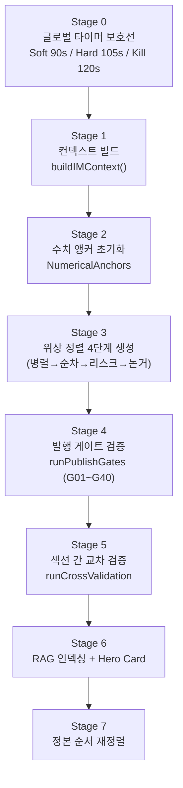

# 모바일 IM 스펙 — 데이터 생성 · LLM Writer · 품질 게이트 · 뷰어 렌더링

> **문서 버전**: v4.0 (골디락스 파이프라인)
> **최종 갱신**: 2026-08-27
> **대상 커밋**: `dadd09f`

---

## 1. 개요

모바일 IM(Investment Memorandum Lite)은 브로커 딜카드 데이터를 기반으로 **투자자 대상 웹 뷰어용 마크다운 투자설명서**를 AI + 결정론적 렌더러 조합으로 생성하는 엔진입니다.

### 1.1 핵심 설계 원칙

| 원칙 | 설명 |
|---|---|
| **위상 정렬 4단계 생성** | 섹션 간 의존성 해결 (독립→재무→리스크→논거) |
| **Fail-Closed 안전** | LLM 실패 시 `passed: false` 반환, 무검증 배포 원천 차단 |
| **수치 앵커 일관성** | NumericalAnchors로 섹션 간 가격/면적/수익률 기준점 고정 |
| **타임아웃 방어** | Soft 90s → Hard 105s → Kill 120s, 미완 섹션 체크리스트 이관 |
| **5종 포스처 분화** | 동일 건물도 투자 목적에 따라 완전히 다른 서사 생성 |

---

## 2. 생성 파이프라인

> 📁 [`writer.ts`](file:///c:/Users/User/cre-dealcard/src/domain/building/mobile-im/writer.ts)

### 2.1 입력/출력 인터페이스

```typescript
interface MobileIMWriterInput {
  building_ssot_lite: BuildingSSoTLite;
  supplemental: MobileIMSupplementalInput;  // 렌트롤, 사진, 대출 등
  readiness: { can_generate: boolean; score: number; missing: string[] };
  external_data: ExternalDataEnrichmentResult | null;
  dcfEligible?: boolean;
  dataGrade?: string;  // 'A' | 'B' | 'C' | 'D'
  identity?: { buildingUse?; assetType?; investmentPosture?; };
  onProgress?: (progress: number, currentSection: string) => void;
}

interface MobileIMWriterOutput {
  sections: MobileIMSection[];
  boundary_note: string;
  generated_at: string;
  ai_used: boolean;
  heroCard: HeroCardData;
  photos?: TransformedPhoto[];
  dcf10Year?: Record<string, unknown>;
  financials?: { equityRequired?; totalDepositBil?; loanAmountBil?; leveragedYield?; wacc?; };
  publishBlocked: boolean;
  publishBlockReasons: string[];
  dataFreshnessWarning?: string | null;
}
```

### 2.2 8단계 파이프라인



### 2.3 위상 정렬 4단계 (Stage 3 상세)

| 단계 | 병렬/순차 | 대상 섹션 | 의존성 |
|:---:|:---:|---|---|
| **Stage 1** | 병렬 (`Promise.allSettled`) | `property_overview`, `location_access`, `lease_status`, `next_steps` | 없음 |
| **Stage 2** | 순차 | `income_analysis`, `site_analysis`, `gop_analysis` 등 | 앵커 확정 (매각가, 면적) |
| **Stage 3** | 순차 | `risk_check` | Stage 1~2 완료 |
| **Stage 4** | 순차 | `investment_thesis`, `checklist` | 전체 완료 |

> **타임아웃 방어**: 105초 초과 시 비필수 섹션은 체크리스트로 이관. 필수 섹션(`property_overview`, `checklist`, `closing`) 미완 시 발행 차단.

---

## 3. 섹션 카탈로그

> 📁 [`section-catalog.ts`](file:///c:/Users/User/cre-dealcard/src/domain/building/mobile-im/section-catalog.ts)

### 3.1 포스처별 섹션 편성

| 포스처 | 섹션 수 | 구성 | 강조 섹션 |
|---|:---:|---|---|
| **income** | 12 | overview, location, title_rights, land_detail, lease_status, income_analysis, risk_check, comparables, investment_thesis, checklist, next_steps, closing | `lease_status`, `income_analysis` |
| **owner_occupied** | 9 | overview, location, title_rights, occupancy_fit, cost_comparison, risk_check, investment_thesis, checklist, next_steps | `occupancy_fit`, `cost_comparison` |
| **development** | 10 | overview, location, title_rights, land_detail, site_analysis, development_feasibility, risk_check, investment_thesis, checklist, next_steps | `site_analysis`, `development_feasibility` |
| **operating** | 10 | overview, location, title_rights, land_detail, operation_overview, gop_analysis, risk_check, investment_thesis, checklist, next_steps | `operation_overview`, `gop_analysis` |
| **trading** | 8 | overview, location, title_rights, market_position, comparable_analysis, risk_check, checklist, next_steps | `market_position`, `comparable_analysis` |

### 3.2 아키타입 레지스트리 (25종)

| 계열 | 코드 범위 | 주요 아키타입 |
|---|---|---|
| 수익형 | R-INC-01~09 | 임대안정, 가치상승, 개발준비, 임대료정상화, 공실해소, 리모델링 |
| 사옥형 | R-OWN-01~04 | 즉시입주, 본사브랜딩, 임대겸용, 가성비분할 |
| 개발형 | R-DEV-01~04 | 신축개발, 증축리모델링, 용도변경, 토지분할 |
| 운영형 | R-OPR-01~04 | 직영운영, 마스터리스, 공간컨텐츠, **용도리스크(경고)** |
| 매매형 | R-TRD-01~04 | 시세차익, 급매매수, 지분분할, **출구제약(경고)** |

---

## 4. LLM Writer 계층

> 📁 [`im-section-generator.ts`](file:///c:/Users/User/cre-dealcard/src/domain/building/mobile-im/im-section-generator.ts)

### 4.1 단일 섹션 생성 파이프라인 (11단계)

```
1. 포스처별 재무 사전 계산
2. 골든 Few-shot 주입 (buildIMFewShotBlock)
3. 프롬프트 조립 (system + user + postureOverlay)
4. callLLM 호출 (temperature: 0.3, 30~90초)
5. 수치 환각 검사 (detectHallucination)
6. LLM-as-Judge 5차원 품질 심사 (3.0 미만 → 폴백)
7. 결정론적 렌트롤 테이블 강제 치환
8. 용어 정규화 (normalizeTerminologyAsync)
9. 임차인 마스킹 ([임차인A], [임차인B])
10. Cap Rate 표준 라벨 교정
11. riskBoundary → CREQualityGate → DisclosureGuard
```

### 4.2 LLM-as-Judge 5차원 평가

| 차원 | 가중치 | 설명 |
|---|:---:|---|
| `factual_accuracy` | 0.25 | 사실 정확도 |
| `financial_soundness` | 0.20 | 재무 건전성 |
| `regulatory_compliance` | 0.25 | 규제 준수 |
| `investor_value` | 0.15 | 투자자 가치 |
| `data_grounding` | 0.15 | 데이터 근거 |

- **< 3.0**: 품질 미달 → 템플릿 폴백
- **≥ 4.5**: 고품질 → Few-shot 골든셋 후보 자동 등록

### 4.3 결정론적 섹션 렌더러 (3종)

| 렌더러 | 파일 | 입력 |
|---|---|---|
| 등기부/권리관계 | `title-rights-renderer.ts` | `RegistryData` |
| 토지이용계획/대지 | `land-detail-renderer.ts` | `LandUsePlanData` + `LandPriceData` |
| 실거래가 비교표 | `comparables-renderer.ts` | `ComparableTransaction[]` |

### 4.4 용어 정규화 규칙

| ❌ 외래어 직역 | ✅ 한국 CRE 실무 표준 |
|---|---|
| 네이밍 라이츠 | 사옥 단독 명칭 표기(간판 설치권) |
| 캡레이트 | 연 순수익률 (Cap Rate) |
| GOP | 실질 영업이익 (GOP) |
| TI / Rent Free | 인테리어 지원금(TI) / 렌트프리(무상임대) |

---

## 5. CRE 시맨틱 Quality Gate

> 📁 [`cre-quality-gate.ts`](file:///c:/Users/User/cre-dealcard/src/domain/building/mobile-im/cre-quality-gate.ts)

### 5.1 6대 위반 유형

| 유형 | 설명 | 예시 |
|---|---|---|
| `investment_guarantee` | 투자 추천/수익 보장 | "놓치면 후회", "수익 보장" |
| `fabricated_data` | 데이터 창작 | SSoT에 없는 시세/통계 |
| `legal_assertion` | 법적 효력 확정 | "법적 문제 없음" |
| `misleading_comparison` | 검증 불가 비교 | "주변보다 저렴" |
| `ungrounded_market_claim` | 무근거 시장 주장 | 공공데이터 인용 없는 단정 |
| `price_opinion_prohibition` | 가격 평가 금지 | "적정가", "투자 적기" |

---

## 6. 체크리스트 렌더러

> 📁 [`checklist-renderer.ts`](file:///c:/Users/User/cre-dealcard/src/domain/building/mobile-im/checklist-renderer.ts)

### 6.1 6대 카테고리

| 카테고리 | 설명 |
|---|---|
| `missing_data` | 공부·원장 확인 필요 항목 |
| `gate_warning` | 품질·규제 유의사항 |
| `assumption` | AI 추정 및 시장 기본값 가정 |
| `locked_metric` | 미입력 잠금 지표 |
| `timeout_redirect` | 105초 초과 이관 항목 |
| `data_deficit` | 결손 수치 점검 항목 |

> **불변조건 준수**: 확인사항은 마스킹되지 않으며(`masking: false`), 결손 수치는 생략 없이 전량 이관(`truncation: 'never'`).

---

## 7. 모바일 IM 뷰어

### 7.1 컴포넌트 계층

```
mobile-im-viewer.tsx (메인 클라이언트 뷰어)
│
├── Sticky Top Bar
│   └── 뒤로가기 / 권역·유형 배지 / 공유 버튼
│
├── Data Grade Banners (D차단 / C제한 / B안내)
│
├── HeroCard (hero-card.tsx)
│   └── 2×2 메트릭 그리드 + 핵심 투자포인트 3종
│
├── Section List (아코디언 카드)
│   └── SectionCard
│       ├── Header (번호, 아이콘, 타이틀, Provenance 배지)
│       ├── MarkdownRenderer (표/강조/불릿 렌더링)
│       └── Boundary Note (면책 주기)
│
├── Financial Visualizations (A등급 한정)
│   ├── DCFHeatmap
│   ├── LeverageChart
│   └── PriceTrendChart
│
├── FlatProfileCard (담당 중개인)
│
├── Sticky Action Bar
│   └── 비밀 상담 / PDF / PPTX / 링크 공유
│
└── IMInquiryBottomSheet (상담 신청 모달)
```

### 7.2 뷰어 데이터 모델

```typescript
interface MobileIMDocument {
  id: string;
  buildingId: string;
  blindName: string;
  fullName: string;
  assetType: string;
  areaSignal: string;
  priceBand: string;
  broker: BrokerProfileData;
  sections: Array<{
    sectionId: string;
    title: string;
    content: string;           // markdown
    dataSource: string;
    aiRole: "auto" | "ai_generated" | "static";
    confidence: "confirmed" | "inferred" | "needs_check";
    provenance?: DataPointProvenance[];
  }>;
  photos?: Array<{ url; type; label; caption?; }>;
  heroCard?: HeroCardData;
  dcf10Year?: Record<string, unknown>;
  financials?: { equityRequiredBil?; leveragedYieldPct?; waccPct?; };
  dataQualityBadge?: DataQualityBadgeResult;
  status: 'draft' | 'broker_reviewed' | 'published';
  disclaimer: string;
}
```

---

## 8. DB 저장 스키마 (`document_objects.body`)

생성 완료 후 Supabase `document_objects` 테이블에 저장되는 JSON 구조:

```json
{
  "im_type": "mobile_im_lite",
  "investmentPosture": "income",
  "heroTitle": "영등포구 양평동 근린생활시설 매각",
  "ogTitle": "...",
  "ogDescription": "...",
  "sections": [
    {
      "section_type": "property_overview",
      "section_order": 1,
      "title": "물건 개요",
      "markdown": "...",
      "confidence": "confirmed",
      "boundary_note": "...",
      "provenance": [{ "fieldKey": "total_area_sqm", "value": 1420.5, "source": "public_data" }],
      "judge_score": 4.6
    }
  ],
  "heroCard": { "capRateBase": 4.5, "keyPoints": [...] },
  "enrichment": { "landUsePlan": {}, "buildingRegister": {}, "cadastralMapImage": null },
  "coordinates": { "lat": 37.534, "lng": 126.897 },
  "mapImageUrl": "https://...",
  "dataGrade": "A",
  "dcfEligible": true,
  "dataCompleteness": { "qualityGrade": "A", "pptxExportAllowed": true }
}
```

---

## 9. 테스트 구조 (38개 파일)

### 9.1 계층별 테스트 분류

| 계층 | 파일 수 | 주요 테스트 |
|---|:---:|---|
| L1 순수 계산 | 3 | financials, lease-math, wale-calculator |
| L2 게이트/판정 | 4 | deterministic-gates, l2-gate-judgments, guardrails, v05-gates-suite |
| L3 조합/시퀀싱 | 3 | l3-composition, data-pipeline-edge, posture-pipeline |
| L4 레이아웃/물리 | 3 | l4-layout-physics, l4-output-artifacts, l4-d32-yield-leverage |
| L5 E2E 파이프라인 | 2 | l5-pipeline-e2e, e2e-real-property |
| 모듈 단위 | 23 | 개별 모듈별 (hallucination, persona, hero-card 등) |

### 9.2 핵심 E2E 테스트

| 테스트 | 케이스 수 | 검증 |
|---|:---:|---|
| `e2e-real-property.test.ts` | 20+ | 양평동·당산동 실물건 end-to-end (등급, IM 생성, 수익률, 렌트롤) |
| `l5-pipeline-e2e.test.ts` | 25 | 전체 파이프라인 불변조건 검증 |
| `posture-pipeline.test.ts` | 66 | 섹션 카탈로그, 아키타입, 시퀀서, 배지, 브릿지 통합 |
