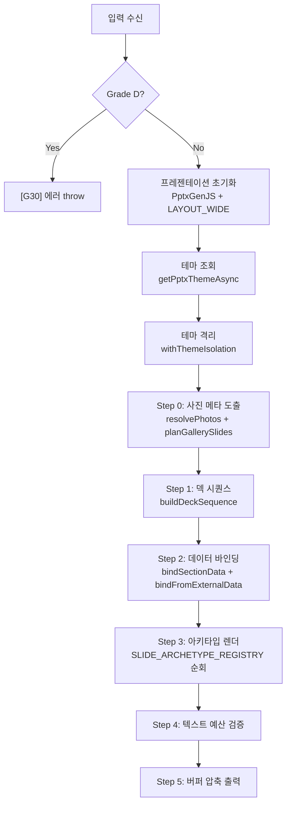

# PPTX IM 스펙 — 데이터 바인딩 · 렌더링 · 아키타입 명세

> **문서 버전**: v4.0 (골디락스 파이프라인)
> **최종 갱신**: 2026-08-27
> **대상 커밋**: `dadd09f`

---

## 1. 개요

PPTX IM은 모바일 IM JSON 데이터를 **PowerPoint 2016+ (.pptx)** 형식의 투자설명서로 변환하는 서버사이드 렌더링 엔진입니다.

### 1.1 핵심 설계 원칙

| 원칙 | 설명 |
|---|---|
| **골디락스 단일 시퀀스** | Basic/Pro 이중 분기 폐지 → 12p 필수 + 동적 12→20p 스케일링 |
| **데이터 가용성 기반 동적 편성** | `DataAvailability` 플래그에 따라 슬라이드 자동 추가/제외 |
| **Grade 기반 재무 확장** | A등급 풀 재무(6종) → B등급 축소(2종) → C등급 없음 |
| **테마 격리** | `withThemeIsolation()` — 동시 렌더링 시 전역 상태 오염 방지 |
| **Graceful Degradation** | 데이터 결손 시 슬라이드 생략 + 경고, 에러 없음 |

---

## 2. 렌더러 코어

### 2.1 입력 인터페이스

> 📁 [`pptx-renderer.ts`](file:///c:/Users/User/cre-dealcard/src/domain/building/mobile-im/pptx/pptx-renderer.ts#L236-L277)

```typescript
interface MobileImPptxInput {
  buildingId: string;
  tier?: PptxTier;          // @deprecated — 골디락스에서 무시됨
  preset?: string;          // 프리셋 ID (5대 내장 또는 Supabase UUID)
  posture?: InvestmentPosture;  // income | owner_occupied | development | operating | trading
  grade?: 'A' | 'B' | 'C' | 'D';
  incomeArchetype?: 'R-INC-01' | 'R-INC-02' | 'R-INC-03' | 'R-INC-04';
  hasViolation?: boolean;
  hasJointCollateral?: boolean;
  docno?: string;
  doc: {
    title?: string;
    body: Record<string, any>;   // enrichment, heroCard, coordinates, mapImageUrl, photos 등
    sections?: Array<{ title: string; markdown: string; }>;
  };
  building?: { area_signal?; asset_type?; price_band?; owner_id?; };
  broker?: { display_name?; company_name?; phone?; specialty?; };
  watermark?: { requesterName: string; phoneLast4: string; timestamp: string; };
  provenance?: Record<string, ProvenanceKind>;
  supabase?: SupabaseClient;
  logoUrl?: string;
}
```

### 2.2 출력 인터페이스

```typescript
interface MobileImPptxOutput {
  buffer: Buffer;           // .pptx 파일 바이너리
  slideCount: number;
  fileSizeBytes: number;
  generatedAt: string;      // ISO 8601
  warnings: string[];
}
```

### 2.3 렌더 파이프라인 (10단계)



---

## 3. 골디락스 시퀀서

> 📁 [`deck-sequencer.ts`](file:///c:/Users/User/cre-dealcard/src/domain/building/mobile-im/pptx/deck-sequencer.ts)

### 3.1 핵심 타입

```typescript
type Grade = 'A' | 'B' | 'C' | 'D';

interface DataAvailability {
  hasLandUsePlan?: boolean;
  hasLandPrice?: boolean;
  hasBuildingRegister?: boolean;
  hasRegistryData?: boolean;
  hasComparables?: boolean;
  hasCommercialDistrict?: boolean;
  hasCadastralMap?: boolean;
  hasFloorPlan?: boolean;
}

interface SlideSpec {
  archetype: string;    // A01~A18
  kicker: string;       // 슬라이드 상단 카테고리
  title: string;        // 슬라이드 제목
  dataKey: string;      // dataMap 바인딩 키
  suppress?: boolean;   // true면 active에서 제외
}
```

### 3.2 시퀀스 편성 규칙

#### 3.2.1 골디락스 필수 구성 (항상 포함)

| 순서 | Archetype | dataKey | 제목 |
|:---:|:---:|---|---|
| 1 | A01 | `cover` | 표지 |
| 2 | A14 | `gallery` | 건물 사진 (사진 있을 때) |
| 3 | A02 | `summary` | 핵심 투자 지표 요약 |
| 4 | A06 | `location` | 입지 분석 |
| 5 | A04 | `land` | 토지 현황 |
| 6 | A04 | `building` | 건물 개요 |

#### 3.2.2 포스처별 본문 슬라이드

| 포스처 | 슬라이드 구성 |
|---|---|
| **income** (R-INC-01) | rentRoll(A03) → stability(A04) → profit(A05) → comps(A03) |
| **income** (R-INC-02) | rentRoll(A03) → valueAdd(A05) → farUpside(A04) → comps(A03) |
| **income** (R-INC-04) | rentRoll(A03) → rentGap(A05) → upside(A05) → comps(A03) |
| **income** (R-INC-05) | rentRoll(A03) → vacancy(A04) → leasing(A05) → comps(A03) |
| **income** (R-INC-06) | rentRoll(A03) → current(A04) → remodel(A05) → comps(A03) |
| **owner_occupied** | plan(A04) → vsLease(A08) → commute(A06) → value(A04) |
| **development** | land(A04) → scale(A05) → eviction(A04) → cost(A08) → stacking(A17) → feasibility(A05) |
| **operating** | kpi(A13) → revenue(A05) → seasonality(A05) → operator(A04) |
| **trading** | comps(A03) → trend(A05) → turnover(A04) → price(A04) |

#### 3.2.3 Grade 기반 재무 확장

| Grade | 추가 슬라이드 |
|:---:|---|
| **A** | capital(A16), dcf(A05), sensitivity(A05), totalReturn(A05), loan(A08)*, tax(A08) |
| **B** | capital(A16), totalReturn(A05) |
| **C** | (없음) |
| **D** | `[G30]` 에러 — 발행 불가 |

> \* `hasViolation=true` 시 loan 슬라이드 `suppress=true`

#### 3.2.4 DataAvailability 기반 동적 추가

| 조건 | dataKey | Archetype | 제목 |
|---|---|:---:|---|
| `hasBuildingRegister && hasLandUsePlan` | `publicRecords` | A04 | 공부 발췌 |
| `hasRegistryData` | `titleRights` | A04 | 권리관계 |
| `hasCadastralMap` | `cadastralMap` | A06 | 지적도 |
| `hasCommercialDistrict` | `commercialDistrict` | A04 | 상권 분석 |

#### 3.2.5 공통 마감 (항상 마지막)

| 순서 | Archetype | dataKey | 제목 |
|:---:|:---:|---|---|
| N-4 | A15 | `thesis` | 투자 논거 |
| N-3 | A07 | `risk` | 리스크 |
| N-2 | A12 | `checklist` | 실사 체크리스트 |
| N-1 | A09 | `process` | 진행 절차 |
| N | A10 | `closing` | 마감 |

### 3.3 면 절삭

| 상수 | 값 | 설명 |
|---|:---:|---|
| `PAGE_RECOMMENDED` | 16 | 권장 상한 — 초과 시 optional 슬라이드 뒤에서부터 절삭 |
| `PAGE_HARD_LIMIT` | 20 | 절대 상한 — 강제 슬라이스 |

**보호 키 (절삭 방지)**: `cover`, `summary`, `closing`, `risk`, `checklist`, `process`, `thesis`, `titleRights`

> 절삭 시 **원래 순서를 유지**하며, removedSet을 구성하여 active 배열을 필터링합니다.

---

## 4. 데이터 바인더

> 📁 [`data-binder.ts`](file:///c:/Users/User/cre-dealcard/src/domain/building/mobile-im/pptx/data-binder.ts)

### 4.1 섹션 타입 → dataKey 매핑

| section_type | dataKey |
|---|---|
| `property_overview` | `building` |
| `location_access` | `location` |
| `lease_status` | `rentRoll` |
| `income_analysis` | `profit` |
| `risk_check` | `risk` |
| `investment_thesis` | `thesis` |
| `next_steps` | `process` |
| `capital_structure` | `capital` |
| `public_records` | `publicRecords` |
| `title_rights` | `titleRights` |
| `comparable_analysis` | `comps` |
| `commercial_analysis` | `commercialDistrict` |

### 4.2 dataKey → Archetype 매핑 (DATA_KEY_ARCHETYPE)

| dataKey | Archetype | 설명 |
|---|:---:|---|
| `summary` | A02 | 핵심 요약 스탯 그리드 |
| `location` | A06 | 입지/지도 다이어그램 |
| `land` / `building` | A04 | 7:5 비대칭 제원 |
| `rentRoll` / `comps` | A03 | 대형 테이블 |
| `stability` / `vacancy` | A04 | 비대칭 분석 |
| `profit` / `dcf` / `sensitivity` / `totalReturn` | A05 | KPI 차트 |
| `capital` | A16 | 자본구조도 |
| `risk` | A07 | 리스크 3블록 |
| `process` | A09 | 타임라인 |
| `thesis` | A15 | 4-Pillar 논거 |
| `closing` | A10 | 마감 면책 |
| `checklist` | A12 | 실사 체크리스트 |
| `publicRecords` / `titleRights` / `commercialDistrict` | A04 | 공부/권리/상권 |
| `cadastralMap` | A06 | 지적도 |
| `stacking` | A17 | 스태킹 다이어그램 |
| `kpi` | A13 | 운영 KPI |
| `loan` / `tax` | A08 | 이중 테이블 |

### 4.3 bindFromExternalData() — V-World 6종 바인딩

| # | dataKey | 소스 | `_source` 태그 | 바인딩 내용 |
|:---:|---|---|---|---|
| 1 | `land` | `enrichment.landUsePlan` + `landPrice` | `vworld_api` | 용도지역, 건폐율/용적률 상한, 공시지가, 대지면적 |
| 2 | `publicRecords` | `buildingRegister` + `landUsePlan` | `public_api` | 건축물대장 표제부 + 토지이용규제 |
| 3 | `titleRights` | `registryData` | `registry_api` | 소유형태, 근저당, 압류, 전세권 |
| 4 | `comps` | `comparableTransactions` | `rtms_api` | 인근 거래 사례 (최대 5건) |
| 5 | `commercialDistrict` | `commercialDistrict` | `semas_api` | 상권명, 유동인구, 매출지수, 개폐업률 |
| 6 | `cadastralMap` | `cadastralMapImage` | `vworld_wms` | 지적도 PNG (base64), 필지 요약 |

### 4.4 BL-6 결손 문구 소독

- **검사 패턴**: `건축물대장 조회 미완료`, `임대차 상세 미확보`, `확인 필요`, `자료 없음` 등
- **처리**: 본문에서 제거 → `_deficiencies` 배열에 수집 → 체크리스트 슬라이드(A18)로 이관
- **`_source` 폴백 보호**: 외부 정형 데이터(`_source: 'vworld_api'` 등)가 존재하면 마크다운 파싱 데이터로 덮어쓰지 않음

---

## 5. 아키타입 레지스트리 (19종)

> 📁 [`archetypes/`](file:///c:/Users/User/cre-dealcard/src/domain/building/mobile-im/pptx/archetypes)

| ID | 파일 | 빌더 함수 | 레이아웃 | 용도 |
|:---:|---|---|---|---|
| **A01** | `a01-cover.ts` | `buildA01Cover` | 표지 (5대 커버 스타일) | 투자설명서 표지 |
| **A02** | `a02-stat-grid.ts` | `buildA02StatGrid` | 리드문 + 4~8 스탯 카드 | 핵심 요약 |
| **A03** | `a03-large-table.ts` | `buildA03LargeTable` | 대형 테이블 + 콜아웃 | 렌트롤, 비교사례 |
| **A04** | `a04-asymmetric-7-5.ts` | `buildA04Asymmetric75` | 7:5 비대칭 (좌:rows, 우:사진/콜아웃) | 제원, 토지, 권리 |
| **A05** | `a05-asymmetric-7-4.ts` | `buildA05Asymmetric74` | 7:4 비대칭 / KPI 카드 | 수익분석, DCF |
| **A06** | `a06-diagram.ts` | `buildA06Diagram` | 지도/지적도 + 입지 rows | 입지, 지적도 |
| **A07** | `a07-three-block.ts` | `buildA07ThreeBlock` | 3~5 리스크 진단 블록 | 리스크 점검 |
| **A08** | `a08-dual-table.ts` | `buildA08DualTable` | 2단 분할 테이블 | 자본구조, 대출, 세금 |
| **A09** | `a09-process.ts` | `buildA09Process` | 타임라인 스텝 카드 | 매수 진행 절차 |
| **A10** | `a10-closing.ts` | `buildA10Closing` | 면책/출처 배지 | 마감 고지 |
| **A11** | `a11-room-spec.ts` | `buildA11RoomSpec` | 호실별 면적/용도 | 호실 스펙 |
| **A12** | `a12-ownership.ts` | `buildA12Ownership` | 소유권/권리관계 | 실사 체크리스트 |
| **A13** | `a13-operating.ts` | `buildA13Operating` | KPI 지표/매출 분석 | 운영형 KPI |
| **A14** | `a14-gallery.ts` | `buildA14Gallery` | 1/2/3/4컷 동적 그리드 | 사진 갤러리 |
| **A15** | `a15-thesis.ts` | `buildA15Thesis` | 4-Pillar Grid + Takeaway | 투자 논거 |
| **A16** | `a16-investment-structure.ts` | `buildA16InvestmentStructure` | 자본조달 구조도 | LTV/에쿼티/금리 |
| **A17** | `a17-pre-completion-marketing.ts` | `buildA17PreCompletionMarketing` | 스태킹 다이어그램 | 개발 층별 구성 |
| **A18** | `a18-checklist.ts` | `buildA18Checklist` | 결손 항목 체크리스트 | BL-6 이관 목록 |

### 5.1 A06 지적도 분기 로직

```
1차: enrichment.cadastralMapImage (V-World WMS)
  → slide.addImage(base64 직접 삽입)
2차: 카카오 정적 지도 URL
  → fetchKakaoMapImage() + sharp 최적화
3차: OSM 타일 합성 플레이스홀더
  → generateStaticMapPlaceholder()
4차: 모두 실패 → [BL-2] 경고 + 슬라이드 생략
```

---

## 6. 테마 & 프리셋

> 📁 [`pptx-theme.ts`](file:///c:/Users/User/cre-dealcard/src/domain/building/mobile-im/pptx/pptx-theme.ts)

### 6.1 5대 내장 프리셋

| ID | 명칭 | 메인 액센트 | 커버 스타일 | 레이아웃 | 제목 폰트 |
|---|---|---|---|---|---|
| `golden_institutional` | Golden Institutional | `#B98A2E` 황동 | `institutional_masses` | `classic` | Pretendard |
| `credeal_signature` | CREDEAL Signature | `#6B8E00` 라임 | `split` | `modern` | Pretendard |
| `executive_gold` | Executive Gold | `#B8862D` 골드 | `hero_dark` | `executive` | Noto Serif KR |
| `corporate_clean` | Corporate Clean | `#059669` 에메랄드 | `corporate_card` | `minimal` | Pretendard |
| `pro_dark_obsidian` | Pro Dark Obsidian | `#0284A8` 시안 | `obsidian_glow` | `dramatic` | Pretendard |

### 6.2 PptxThemeTokens 구조

- **무채색 11종**: `ink`, `ink2`, `ink3`, `slate`, `body`, `mute`, `mute2`, `line`, `line2`, `bg`, `tint`
- **액센트 4종**: `accent`, `accentD`, `accentL`, `accentT`
- **의미색 10종**: `green/L`, `red/L`, `amber/L`, `blue/L`, `violet/L`
- **다크 전용 9종**: `darkCard`, `darkBlock`, `darkBorder`, `darkBody`, `darkMute`, `darkFaint`, `darkAccentBg/Border/Text`
- **타이포**: `titleFont`, `bodyFont`
- **브랜딩**: `companyName`, `companyTagline`, `logoUrl?`

### 6.3 커스텀 프리셋 (Supabase)

UUID 프리셋 ID → `pptx_custom_presets` 테이블 비동기 로딩 → 내장 프리셋 토큰에 머지 → WCAG AA 자동 검증

### 6.4 워터마크

- **문구**: `${requesterName} · ${phoneLast4} · ${timestamp}`
- **스타일**: 36pt bold, 회전 -30°, 투명도 85%
- **위치**: 슬라이드 중앙 (x:1.5, y:2.5, w:10, h:2.5)

---

## 7. 렌더링 인프라 (imlib.ts)

### 7.1 기하 상수

| 상수 | 값 | 설명 |
|---|:---:|---|
| `W` | 13.333" | 캔버스 폭 (16:9 와이드) |
| `H` | 7.5" | 캔버스 높이 |
| `M` | 0.62" | 좌우 마진 |
| `CW` | 12.093" | 콘텐츠 폭 (W - M×2) |

### 7.2 주요 렌더링 함수

| 함수 | 역할 |
|---|---|
| `light(pres)` / `dark(pres)` | 라이트/다크 배경 슬라이드 생성 |
| `head(s, num, kicker, title)` | layoutStyle 분기 슬라이드 헤더 |
| `foot(s, page, docno)` | layoutStyle 분기 푸터 |
| `stat(s, x, y, w, label, value, unit)` | 스탯 카드 (layout-physics 연동) |
| `rows(s, x, y, w, list)` | 키-값 행 목록 + 출처 배지 |
| `table(s, x, y, w, head, body)` | 테마 연동 테이블 |
| `callout(s, x, y, w, h, kind, title, body)` | info/good/warn/bad/brass 박스 |
| `waterfall()` / `stack()` / `locmap()` | 차트/스택/개념도 |

### 7.3 출처 표기 체계 (ProvenanceKind 9종)

| 종류 | 라벨 | 신뢰도 |
|---|---|:---:|
| `registry` | 등기부등본 | ★★★★★ |
| `public_api` | 공공 API | ★★★★☆ |
| `broker_aug` | 중개보강 | ★★★☆☆ |
| `expert` | 전문가 | ★★★★☆ |
| `ledger` | 건축물대장 | ★★★★★ |
| `seller` | 매도인 제공 | ★★☆☆☆ |
| `broker` | 중개사 | ★★★☆☆ |
| `derived` | 산출값 | ★★★☆☆ |
| `assumed` | 추정 | ★☆☆☆☆ |

---

## 8. V-World WMS 지적도

> 📁 [`vworld-wms-cadastral.ts`](file:///c:/Users/User/cre-dealcard/src/lib/external/vworld-wms-cadastral.ts)

### 8.1 API 호출 사양

| 항목 | 값 |
|---|---|
| **엔드포인트** | `http://api.vworld.kr/req/wms` |
| **CRS** | EPSG:3857 (Web Mercator) |
| **레이어** | `lp_pa_cbnd_bonbun,lp_pa_cbnd_bubun` |
| **포맷** | `image/png`, `TRANSPARENT=TRUE` |
| **좌표변환** | `toEpsg3857()` — WGS84 → Web Mercator |
| **타임아웃** | 10초 |
| **반환 타입** | `CadastralMapResult { buffer, base64, width, height, bbox, _source }` |

---

## 9. E2E 테스트 매트릭스

### 9.1 골디락스 시퀀스 테스트 (20케이스)

| 그룹 | 테스트 수 | 검증 내용 |
|---|:---:|---|
| G-01 포스처별 필수 구성 | 5 | 5개 포스처 × 최소 10p, 필수 dataKey 존재 |
| G-02 Grade별 동적 면 수 | 3 | A:16~20p, B:13~16p, C:12~14p |
| G-03 D등급 차단 | 1 | [G30] 에러 throw |
| G-04 A등급 재무 확장 | 3 | A≥B≥C, A에만 dcf, B에 dcf 없음 |
| G-05 V-World 면 추가 | 5 | publicRecords, titleRights, cadastralMap, commercialDistrict |
| G-06 면 절삭 | 2 | 20p 이하, 보호 키 유지 |
| G-07 위반건물 suppress | 1 | loan suppress 확인 |

### 9.2 기타 E2E 테스트

| 파일 | 검증 |
|---|---|
| `p0-graceful-degradation.test.ts` | 데이터 결손 시 graceful 처리 |
| `p0-numeric-pipeline.test.ts` | 숫자 파이프라인 무결성 |
| `p0-pii-persona-scrub.test.ts` | 개인정보/페르소나 노출 차단 |
| `p0-preset-cross-render.test.ts` | 5대 프리셋 교차 렌더링 |
| `p1-theme-preset.test.ts` | 테마 토큰 + 커스텀 프리셋 |
| `p2-accessibility.test.ts` | WCAG 명도대비 검증 |
| `p2-gallery-photos.test.ts` | 갤러리 플래너 + 사진 바인딩 |
| `ai-visual-e2e-runner.ts` | 150 DPI PNG 캡처 + AI 시각 무결성 |
