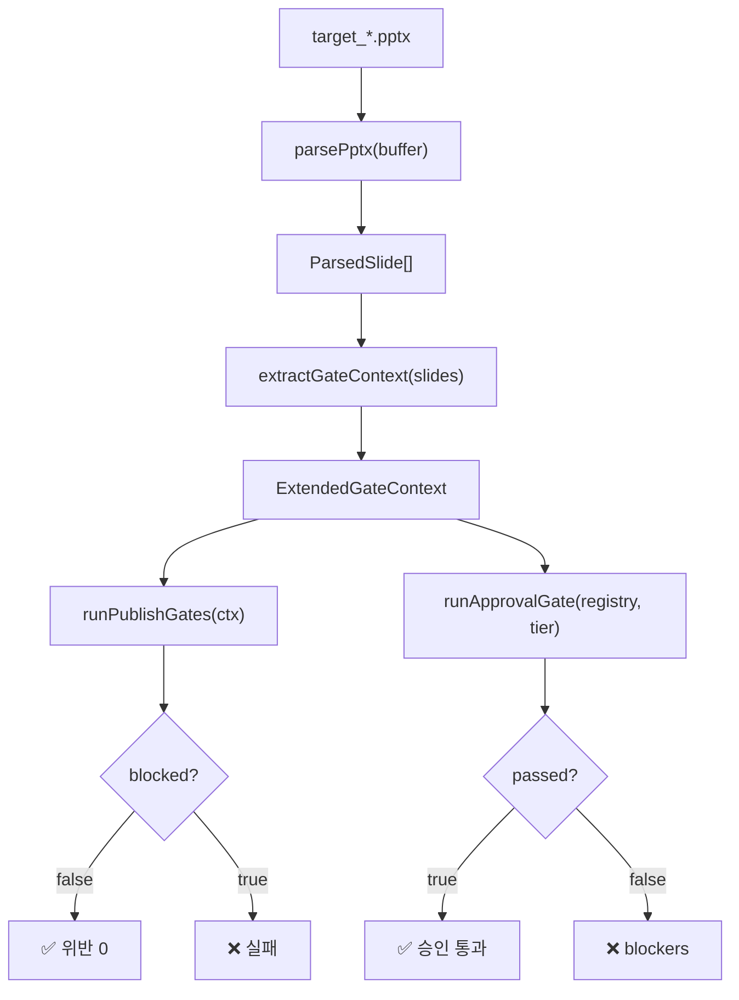
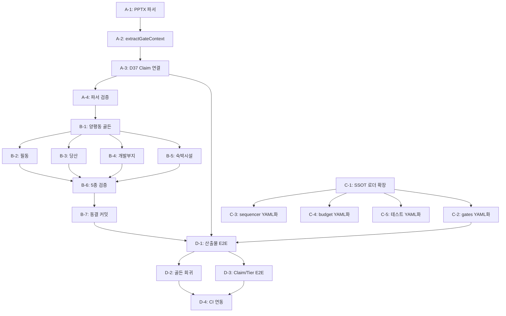

# D37 모델 골든 IM 생성 및 종단 검증 요구서 v2

> **선행** D33 렌더 수렴 · D34 테스트 재편 · D37 Claim/Tier/Gate 고도화
> **소유** CREDEAL 렌더 팀
> **목적** "산출물이 옳다"를 기계적으로 증명할 수 있는 종단 검증 체계 구축
> **버전** v2.0 (2026-08-28, D37 반영)

---

## 0. 문제 정의 — D37 이후 무엇이 달라졌는가

### 0.1 D35 원본 (v1)에서 제기된 문제

```
현재 L4 테스트가 하는 것:
  runPublishGates({ vacancyNarrativeContradiction: true })
  → G41 차단됨 ✅

현재 L4 테스트가 하지 않는 것:
  .pptx를 열어서 → 3면 왼쪽 텍스트에 "만실" → 5면 표에 공실률 8%
  → G41이 걸리는지 확인
```

### 0.2 D37 이후 개선된 것

| 계층 | D35 상태 | D37 이후 |
|---|---|---|
| **SSOT** | 14 YAML, 코드 미연결 | `ssot-loader.ts` 연결, `loadPageOrder()` 구현 |
| **대조군** | v3·v4 3종 + expected.json | ✅ 유지 (파서 여전히 필요) |
| **게이트** | 39종 (하드코딩 잔존) | **49종** (G48~G53 Claim 기반 추가) |
| **im-core** | ❌ 없음 | **9모듈**: Claim, Tier, ApprovalGate, displayLabel, LeaseCalc 등 |
| **교차 검증** | 기본 교차 | `cap_rate_narrative`, `noi_narrative`, `vacancy_narrative` 추가 |
| **발행 등급** | A/B/C/D only | **5종 ReleaseTier** + 전구간 연결 |
| **승인 게이트** | ❌ 없음 | `runApprovalGate()` → 422+blockers |

### 0.3 여전히 빠진 것

| 항목 | 상태 | 위험도 |
|---|---|:---:|
| **PPTX 바이너리 파서** | ❌ 미구현 | 🔴 |
| **모델 골든 IM 3종** | ❌ 미생성 | 🔴 |
| **`extractGateContext(slides)`** | ❌ 미구현 | 🔴 |
| **종단 산출물 테스트** | ❌ 미구현 | 🔴 |
| **일부 SSOT → 코드 하드코딩** | ⚠️ 잔존 | 🟡 |

---

## 1. SSOT YAML 체계

### 1.1 14개 YAML 정본

```
credeal/ssot/
├── im.pages.yaml        ← 면 순서·등급별 기대 분량·편성 규칙
├── im.gating.yaml       ← 49필드·51블록·L축/P축 2단 게이팅
├── im.invariants.yaml   ← 21대 불변조건 + 검사기 매핑
├── im.image.yaml        ← 사진 DPI·슬롯·크기 규격 (14종 슬롯)
├── im.format.yaml       ← 금액/면적/비율 표기 규격
├── im.lexicon.yaml      ← CRE 용어 정규화 사전
├── im.masking.yaml      ← public/nda/pro 마스킹 규칙
├── im.assumptions.yaml  ← 재무 가정 레지스트리 (법정·시장통상)
├── im.bindings.yaml     ← 필드→블록→페이지 바인딩 (49+51+15)
├── im.budget.yaml       ← 면수 버짓 (기본12, 최대16, 증빙18)
├── im.errors.yaml       ← 에러 코드 네임스페이스 소유
├── im.ontology.yaml     ← 온톨로지 보완 요구서
├── im.parcel.yaml       ← 다필지·제척·유효면적 규칙
└── im.tokens.yaml       ← 60개 디자인 컬러 토큰
```

### 1.2 코드 연결 현황

| 경로 | D35 | D37 | 비고 |
|---|:---:|:---:|---|
| `ssot-loader.ts` → YAML 파싱 | ⚠️ 기본 | ✅ 개선 | `loadPageOrder()` 구현 |
| `quality-gates-v02.ts` 임계값 | 🔴 하드코딩 | 🟡 부분 | G31~G36 상수 잔존 |
| `deck-sequencer.ts` PAGE_HARD_LIMIT | 🔴 하드코딩 | 🟡 상수 | YAML 미참조 |
| `text-budget.ts` TEXT_LIMITS | 🟡 상수 | 🟡 상수 | YAML 미참조 |

### 1.3 해야 할 것

| # | 작업 | 설명 |
|:---:|---|---|
| S-1 | **TypeScript YAML 로더 확장** | 전 YAML 타입 안전 파싱 |
| S-2 | **코드 임계값 YAML화** | gates, sequencer, budget 하드코딩 → YAML |
| S-3 | **테스트 임계값 YAML화** | 리터럴 → YAML 참조 |
| S-4 | **불변조건 검사기** | `runInvariantChecks()` 21개 조건 실행 |
| S-5 | **CI 연동** | YAML → 코드 → 테스트 일관성 보장 |

---

## 2. 대조군 체계

### 2.1 현재 상태

```
tests/corpus/
├── v3_gold.pptx        ← 음성 대조군 (위반 12·주의 7)  ✅ 있음
├── v3_obsidian.pptx    ← 음성 대조군 (위반 13·주의 6)  ✅ 있음
├── v4_goldilocks.pptx  ← 음성 대조군 (위반 20·주의 6)  ✅ 있음
├── expected.json       ← 기대 위반 건수               ✅ 있음
├── target_yangpyeong.pptx  ← 양성 대조군 (위반 0)     ❌ 없음
├── target_pildong.pptx     ← 양성 대조군 (위반 0)     ❌ 없음
└── target_dangsan.pptx     ← 양성 대조군 (위반 0)     ❌ 없음
```

### 2.2 D37 기반 검수 체크리스트 (v2)

```yaml
layout_check:
  crop_ratio_max: 0.40
  effective_dpi_min_photo: 180
  effective_dpi_min_capture: 150
  text_overflow: 0
  aspect_distortion_max_pct: 5
  bleed_count: 0
  overlap_max_inches: 0

standard_check:
  vacancy_contradiction: false       # G41
  fallback_duplicate: 0              # G42
  highlight_spec_duplicate: false    # G43
  unclosed_bracket: 0                # G44
  static_text_qg: true              # G45

# ▼ D37 신설
claim_check:
  unresolved_conflict: 0             # G48
  unevidenced_claim: 0              # G49
  as_of_missing: 0                   # G50
  calculation_not_reproducible: false # G51
  permit_zone_displayed: true        # G53

page_check:
  page_count_min: 12
  page_count_max: 16
  required_keys_present: true    # cover, summary, closing, risk, checklist, process, thesis

yield_check:
  basis_consistent: true             # G38
  negative_leverage_warned: true     # G40

tier_check:                          # D37 신설
  release_tier_valid: true           # 5종 중 하나
  tier_sections_consistent: true     # 허용 섹션과 실제 섹션 일치
  approval_gate_passed: true         # runApprovalGate() 통과

invariants:
  all_21_passed: true
```

---

## 3. 모델 골든 IM 생성 요구서 (v2)

### 3.1 정의

> **모델 골든 IM**은 모든 SSOT 불변조건·게이트·편성규칙·물리규격·**D37 Claim/Tier 검증**을 만족하는 PPTX 파일로, 사람이 검수하여 "이것이 정답이다"라고 확인한 산출물입니다.

### 3.2 필요 표본 5종 (v2 확장)

| 파일명 | 물건 | 등급 | 포스처 | Tier | 기대 면수 | 목적 |
|---|---|:---:|---|---|:---:|---|
| `target_yangpyeong.pptx` | 양평동 더레드빌딩 | A | income | decision_im | 15p | 풀데이터 기준선 |
| `target_pildong.pptx` | 필동 | C | income | fact_om | 11p | 결손 처리 기준선 |
| `target_dangsan.pptx` | 당산 | B | owner_occupied | analysis_im | 13p | 포스처 분기 기준선 |
| `target_dev.pptx` | 개발 부지 (가상) | B | development | analysis_im | 12p | 개발형 기준선 |
| `target_hotel.pptx` | 숙박시설 (가상) | A | operating | decision_im | 14p | 운영형 기준선 |

### 3.3 생성 절차

```
Step 1. 코드 렌더
    현재 렌더 엔진으로 5종을 생성합니다.

Step 2. 위반 목록 추출
    PPTX 파서(§4)로 산출물을 열어 위반 건수를 수집합니다.

Step 3. Claim 검증 (D37 신설)
    ClaimRegistry → runApprovalGate() → blockers 확인
    displayLabel 8종 정합성 확인
    ReleaseTier ↔ 실제 면 구성 일치 확인

Step 4. 수작업 정정
    PowerPoint/LibreOffice에서 위반을 직접 수정합니다.

Step 5. 재검증
    수정된 PPTX를 파서+검사기+Claim검증으로 재검증합니다.
    위반 0 · 주의 0 · Claim blockers 0이 확인되면 동결합니다.

Step 6. 동결
    tests/corpus/target_*.pptx로 커밋합니다.
```

---

## 4. PPTX 파서 요구서

### 4.1 구현 방법

```typescript
// pptx-parser.ts (신규)
interface ParsedSlide {
  index: number;
  shapes: ParsedShape[];
  texts: string[];
  images: ParsedImage[];
}

interface ParsedShape {
  name: string;
  type: 'text' | 'image' | 'table' | 'chart' | 'group';
  position: { x: number; y: number; cx: number; cy: number }; // EMU
  text?: string;
}

interface ParsedImage {
  slotName: string;
  widthPx: number;
  heightPx: number;
  boxWidthInches: number;
  boxHeightInches: number;
  effectiveDpi: number;
  cropRatio: number;
  aspectDistortionPct: number;
}

export async function parsePptx(buffer: Buffer): Promise<ParsedSlide[]>;
```

### 4.2 D37 확장: Claim 검증 연결

```typescript
// extractGateContext 확장
interface ExtendedGateContext extends GateContext {
  // D37 Claim 기반 검증
  unresolvedConflictCount: number;    // G48
  unevidencedClaimCount: number;      // G49
  asOfMissingCount: number;           // G50
  calculationNotReproducible: boolean; // G51
  pageCountExceeded: boolean;          // G52
  permitZoneNotDisplayed: boolean;     // G53

  // ReleaseTier 정합성
  actualTier: ReleaseTier;
  expectedSections: string[];
  actualSections: string[];
  tierSectionsMatch: boolean;
}
```

### 4.3 종단 검사 흐름 (v2)



---

## 5. 전체 작업 목록 (v2)

### Phase A: PPTX 파서 (선행)

| # | 작업 | 의존 | 산출물 |
|:---:|---|---|---|
| A-1 | `pptx-parser.ts` 구현 | jszip, xml2js | `ParsedSlide[]` |
| A-2 | `extractGateContext(slides)` 구현 | A-1 | `ExtendedGateContext` |
| A-3 | D37 Claim 검증 연결 | A-2, im-core | G48~G53 연동 |
| A-4 | 기존 v3/v4 PPTX로 파서 검증 | A-1~A-3 | 위반 건수 확인 |

### Phase B: 모델 골든 IM 생성

| # | 작업 | 의존 | 산출물 |
|:---:|---|---|---|
| B-1 | 양평동 A등급 income (decision_im) | A-4 | `target_yangpyeong.pptx` |
| B-2 | 필동 C등급 income (fact_om) | B-1 | `target_pildong.pptx` |
| B-3 | 당산 B등급 owner_occupied (analysis_im) | B-1 | `target_dangsan.pptx` |
| B-4 | 개발부지 B등급 development (analysis_im) | B-1 | `target_dev.pptx` |
| B-5 | 숙박시설 A등급 operating (decision_im) | B-1 | `target_hotel.pptx` |
| B-6 | 5종 파서+검사기+Claim 검증 → 위반 0 | A-4, B-1~B-5 | expected.json 갱신 |
| B-7 | 동결 커밋 | B-6 | `tests/corpus/target_*.pptx` |

### Phase C: SSOT 코드 연결

| # | 작업 | 의존 | 산출물 |
|:---:|---|---|---|
| C-1 | `ssot-loader.ts` 확장 — 전 YAML 타입 정의 | — | 타입 안전 로더 |
| C-2 | `quality-gates-v02.ts` 임계값 → YAML | C-1 | 하드코딩 제거 |
| C-3 | `deck-sequencer.ts` PAGE_HARD_LIMIT → YAML | C-1 | 하드코딩 제거 |
| C-4 | `text-budget.ts` TEXT_LIMITS → YAML | C-1 | 하드코딩 제거 |
| C-5 | 테스트 리터럴 → YAML | C-1 | 테스트 하드코딩 제거 |

### Phase D: 종단 산출물 테스트

| # | 작업 | 의존 | 산출물 |
|:---:|---|---|---|
| D-1 | `l4-artifact-e2e.test.ts` | A-3, B-7 | target 통과 · v3/v4 기대 실패 |
| D-2 | `l5-golden-regression.test.ts` | D-1 | 렌더 → 파서 → 검사 → 판정 |
| D-3 | `l5-claim-tier-e2e.test.ts` (D37) | D-1 | Claim + Tier 종단 검증 |
| D-4 | CI 연동 (`npm test`에 포함) | D-1~D-3 | 자동 회귀 방지 |

---

## 6. 의존 관계



---

## 7. 수용 기준 (v2)

모든 작업이 완료되었을 때 다음이 성립해야 합니다:

```
□ target_yangpyeong.pptx → parsePptx → extractGateContext → runPublishGates
  → blocked=false · failedBlocks=[] · failedWarns=[]

□ target_yangpyeong.pptx → ClaimRegistry → runApprovalGate(registry, 'decision_im')
  → passed=true · blockers=[]

□ v4_goldilocks.pptx → 같은 경로
  → blocked=true · failedBlocks.length === expected.json.layout_violations

□ 코드에 DPI 180, PAGE 16, CROP 0.40 등 리터럴이 0건
  → 전부 credeal/ssot/*.yaml에서 읽힘

□ CI에서 npm test 실행 시 target 통과 · v3/v4 기대 실패 자동 검증

□ 모델 골든 IM 5종이 사람 검수를 거쳐 동결됨

□ D37 im-core 모듈 9종이 종단 테스트에서 검증됨
  → ClaimRegistry, FinancialCalculator, resolveTier, runApprovalGate,
     displayLabel, LeaseCalc, PermitZone, KoreanLegal, ActionCard
```

---

## 8. 현재 코드 자산 현황 (D37 갱신)

### 8.1 이미 있는 것

| 파일 | 역할 | 비고 |
|---|---|---|
| `credeal/ssot/*.yaml` (14개) | SSOT 원천 | `loadPageOrder()` 연결 |
| `tests/corpus/v3_*.pptx` (2개) | 음성 대조군 | 파서 미구현 |
| `tests/corpus/v4_*.pptx` (1개) | 음성 대조군 | 파서 미구현 |
| `tests/corpus/expected.json` | 기대 위반 | 종단 테스트 미구현 |
| `ssot-loader.ts` (432행) | YAML 로더 | `loadPageOrder()` 구현 |
| `quality-gates-v02.ts` (280행) | 게이트 **49종** | G48~G53 Claim 기반 |
| `im-core/` (13파일) | **순수 도메인 9모듈** | D37 P0+P1+P2 |
| `l4-output-assertions-d34.test.ts` | L4 15+건 | 함수 단언 (PPTX 미파싱) |
| 58개 테스트 (L1~L5) | 전 계층 | 전량 통과 |

### 8.2 아직 없는 것

| 항목 | 상태 | 우선순위 |
|---|---|:---:|
| **PPTX 바이너리 파서** | ❌ 미구현 | 🔴 P0 |
| **모델 골든 IM 5종** | ❌ 미생성 | 🔴 P0 |
| **`extractGateContext(slides)`** | ❌ 미구현 | 🔴 P0 |
| **종단 산출물 테스트** | ❌ 미구현 | 🔴 P1 |
| **SSOT → 코드 완전 연결** | ⚠️ 부분 | 🟡 P2 |

---

## 9. 우선순위 판단

> [!IMPORTANT]
> **Phase A (PPTX 파서)가 모든 것의 선행**입니다.
> 파서 없이는 모델 골든을 검증할 수 없고, 대조군 falsifiability를 증명할 수 없습니다.
> D37 im-core 덕분에 Claim/Tier 검증이 가능해졌으나, PPTX 레벨에서 이를 확인하려면 파서가 필수입니다.

추천 실행 순서:

```
Week 1:  Phase A (파서 + D37 Claim 연결) + Phase C (SSOT 연결)  ← 병행
Week 2:  Phase B (모델 골든 5종 생성 + 수작업 검수)
Week 3:  Phase D (종단 테스트 + Claim/Tier E2E + CI)
```
