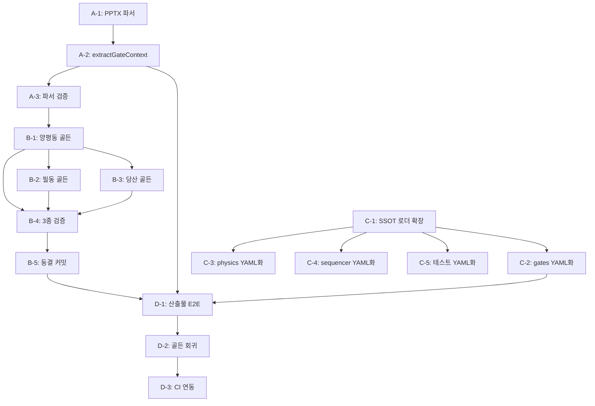

# D35 모델 골든 IM 생성 및 SSOT/대조군 연결 요구서

> **선행** D33 렌더 수렴 · D34 테스트 재편
> **소유** CREDEAL 렌더 팀
> **목적** "산출물이 옳다"를 기계적으로 증명할 수 있는 종단 검증 체계 구축

---

## 0. 문제 정의 — 지금 무엇이 빠져 있는가

D34에서 105개 테스트를 구축했습니다. 모두 통과합니다.
그런데 **이 테스트는 산출물을 열지 않습니다.**

```
현재 L4 테스트가 하는 것:
  runPublishGates({ vacancyNarrativeContradiction: true })
  → G41 차단됨 ✅

현재 L4 테스트가 하지 않는 것:
  .pptx를 열어서 → 3면 왼쪽 텍스트에 "만실" → 5면 표에 공실률 8%
  → G41이 걸리는지 확인
```

| 계층 | 지금 있는 것 | 빠진 것 |
|---|---|---|
| **SSOT** | `credeal/ssot/*.yaml` 14개 파일 | 코드 경로 연결 (loader → 렌더 → 테스트) |
| **대조군** | v3·v4 PPTX 3종 + expected.json | **모델 골든 IM** (위반 0 표본) |
| **검사기** | `runPublishGates(ctx)` | **PPTX 파서** (바이너리 → 도형·텍스트·좌표) |
| **종단 테스트** | L4 함수 단언 27건 | **산출물 → 파서 → 검사기 → 판정** |

---

## 1. SSOT YAML 해설

### 1.1 SSOT란 무엇인가

**Single Source of Truth** — 모든 임계값·규칙·편성 정보가 한 곳에 존재하고,
코드와 테스트가 그 한 곳만 참조하는 구조입니다.

```
credeal/ssot/
├── im.pages.yaml       ← 면 순서·등급별 기대 분량·편성 규칙
├── im.gating.yaml      ← 49개 입력 필드·등급 엔진·2축(L·P)
├── im.invariants.yaml  ← 불변조건 21개 + 검사 매핑
├── im.image.yaml       ← 사진 DPI·슬롯·크기·크로핑 규격
├── im.format.yaml      ← 숫자 형식·통화·퍼센트·면적 단위
├── im.lexicon.yaml     ← CRE 용어 정규화 사전
├── im.masking.yaml     ← 개인정보·임차인 마스킹 규칙
├── im.assumptions.yaml ← 기본 가정값 (운영비율·공실률 등)
├── im.bindings.yaml    ← 데이터 필드→슬라이드 바인딩 매핑
├── im.budget.yaml      ← 텍스트 버짓·글자수 상한
├── im.errors.yaml      ← 에러 코드·메시지·심각도 정의
├── im.ontology.yaml    ← 포스처·아키타입·분류 체계
├── im.parcel.yaml      ← 필지·제척·유효 면적 규칙
└── im.tokens.yaml      ← 디자인 토큰 (색상·폰트·여백)
```

### 1.2 현재 상태

```
코드 경로:
  quality-gates-v02.ts  ── G01~G45 임계값 하드코딩 ──→ runPublishGates()
  layout-physics.ts     ── CROP/DPI/OVERFLOW 상수 ──→ fitBox(), checkCropRatio()
  deck-sequencer.ts     ── PAGE_HARD_LIMIT=16 하드코딩 ──→ buildDeckSequence()

있어야 할 경로:
  credeal/ssot/*.yaml ──→ ssot-loader.ts ──→ 모든 코드 + 테스트
```

### 1.3 해야 할 것

| # | 작업 | 설명 |
|:---:|---|---|
| S-1 | **TypeScript YAML 로더** | `credeal/ssot/*.yaml`을 파싱하여 타입 안전 객체 반환. `js-yaml` 사용. |
| S-2 | **코드 임계값 제거** | `quality-gates-v02.ts`, `layout-physics.ts`, `deck-sequencer.ts`에서 하드코딩 상수를 YAML 로더 호출로 교체 |
| S-3 | **테스트 임계값 제거** | 테스트에서 `16`, `0.40`, `150` 등 리터럴을 YAML에서 읽도록 교체 |
| S-4 | **불변조건 검사기** | `im.invariants.yaml`의 21개 조건을 코드로 실행하는 `runInvariantChecks()` |
| S-5 | **CI 연동** | `build_ssot.py` → YAML 생성 → 코드 로더 → 테스트 — 일관성 보장 |

---

## 2. 대조군 해설

### 2.1 대조군이란 무엇인가

D34 §3이 요구한 **거짓양성 방지 체계**입니다.

```
대조군 = "이 검사가 맞다"는 것을 증명하는 두 짝:

  target_*.pptx   — 위반 0 · 검사 전량 통과해야 함 (양성 대조군)
  v3_*/v4_*.pptx  — 위반 N건 · 검사 N건 실패해야 함 (음성 대조군)

둘 다 같은 검사기를 통과합니다.
```

### 2.2 현재 상태

```
tests/corpus/
├── v3_gold.pptx        ← 음성 대조군 (위반 12·주의 7)  ✅ 있음
├── v3_obsidian.pptx    ← 음성 대조군 (위반 13·주의 6)  ✅ 있음
├── v4_goldilocks.pptx  ← 음성 대조군 (위반 20·주의 6)  ✅ 있음
├── expected.json       ← 기대 위반 건수               ✅ 있음
├── target_yangpyeong.pptx  ← 양성 대조군 (위반 0)     ❌ 없음
├── target_pildong.pptx     ← 양성 대조군 (위반 0)     ❌ 없음
└── target_dangsan.pptx     ← 양성 대조군 (위반 0)     ❌ 없음
```

### 2.3 왜 모델 골든 IM이 필요한가

| 검사 | target 없이 | target 있으면 |
|---|---|---|
| "G41이 모순을 잡는다" | ✅ 함수 단언 | ✅ 실제 PPTX에서 검증 |
| "G41이 정상 문서를 통과시킨다" | ❌ 불가 | ✅ target에서 통과 확인 |
| "검사기가 과잉 탐지하지 않는다" | ❌ 불가 | ✅ 거짓양성 0 확인 |

**target 없이는 "이 검사가 정상 문서를 통과시키는가"를 증명할 수 없습니다.**

---

## 3. 모델 골든 IM 생성 요구서

### 3.1 정의

> **모델 골든 IM**은 모든 SSOT 불변조건·게이트·편성규칙·물리규격을 만족하는
> PPTX 파일로, 사람이 검수하여 "이것이 정답이다"라고 확인한 산출물입니다.

### 3.2 필요 표본 3종

| 파일명 | 물건 | 등급 | 포스처 | 기대 면수 | 목적 |
|---|---|:---:|---|:---:|---|
| `target_yangpyeong.pptx` | 양평동 더레드빌딩 | A | income | 15p | 풀데이터 기준선 |
| `target_pildong.pptx` | 필동 (가상/실재) | C | income | 11p | 결손 처리 기준선 |
| `target_dangsan.pptx` | 당산 (가상/실재) | B | owner_occupied | 13p | 포스처 분기 기준선 |

### 3.3 생성 절차

현재 렌더 엔진이 불완전하므로, **코드 자동 생성 후 수작업 정정** 방식을 사용합니다:

```
Step 1. 코드 렌더
    현재 렌더 엔진으로 3종을 생성합니다.
    이 산출물에는 위반이 있을 것입니다.

Step 2. 위반 목록 추출
    PPTX 파서(§4)로 산출물을 열어 위반 건수를 수집합니다.

Step 3. 수작업 정정
    PowerPoint/LibreOffice에서 위반을 직접 수정합니다:
    - 종횡비 왜곡 사진 → 원본 비율로 교체
    - DPI 미달 사진 → 고해상도 원본으로 교체
    - 텍스트 넘침 → 폰트 크기 또는 텍스트 축약
    - 서술어 모순 → 문구 수정
    - 중복 문단 → 삭제

Step 4. 검수
    수정된 PPTX를 파서+검사기로 재검증합니다.
    위반 0 · 주의 0이 확인되면 동결합니다.

Step 5. 동결
    tests/corpus/target_*.pptx로 커밋합니다.
    이 파일은 수정 금지 — 테스트가 이 파일을 열어 검사합니다.
```

### 3.4 검수 체크리스트

target_*.pptx 각 파일이 만족해야 할 조건:

```yaml
layout_check:
  crop_ratio_max: 0.40          # im.image.yaml §min_dpi
  effective_dpi_min_photo: 180  # im.image.yaml §min_dpi.photo
  effective_dpi_min_capture: 150 # im.image.yaml §min_dpi.capture
  text_overflow: 0
  aspect_distortion_max_pct: 5
  bleed_count: 0
  overlap_max_inches: 0

standard_check:
  vacancy_contradiction: false   # G41
  fallback_duplicate: 0          # G42
  highlight_spec_duplicate: false # G43
  unclosed_bracket: 0            # G44
  static_text_qg: true           # G45

page_check:
  page_count_min: 12             # im.pages.yaml §rules.min_pages
  page_count_max: 16             # deck-sequencer PAGE_HARD_LIMIT
  required_keys_present: true    # cover, summary, closing, risk, checklist, process, thesis

yield_check:
  basis_consistent: true         # G38 — 전 면 동일 basis
  negative_leverage_warned: true # G40

invariants:
  all_21_passed: true            # im.invariants.yaml
```

---

## 4. PPTX 파서 요구서

### 4.1 왜 필요한가

모델 골든 IM과 대조군을 검사하려면 **PPTX 바이너리를 열어 도형·텍스트·좌표를 추출**해야 합니다.

### 4.2 구현 방법

```typescript
// pptx-parser.ts (신규)
interface ParsedSlide {
  index: number;
  shapes: ParsedShape[];
  texts: string[];        // 전 텍스트 조각
  images: ParsedImage[];
}

interface ParsedShape {
  name: string;
  type: 'text' | 'image' | 'table' | 'chart' | 'group';
  position: { x: number; y: number; cx: number; cy: number }; // EMU
  text?: string;
}

interface ParsedImage {
  slotName: string;
  widthPx: number;
  heightPx: number;
  boxWidthInches: number;
  boxHeightInches: number;
  effectiveDpi: number;
  cropRatio: number;
  aspectDistortionPct: number;
}

// 파싱 라이브러리: jszip + xml2js
// .pptx = ZIP → ppt/slides/slide*.xml 파싱
export async function parsePptx(buffer: Buffer): Promise<ParsedSlide[]>;
```

### 4.3 종단 검사 흐름

```
target_yangpyeong.pptx
  → parsePptx(buffer)
  → ParsedSlide[]
  → extractGateContext(slides)  // 도형 좌표 → DPI/크로핑/넘침 계산
  → runPublishGates(ctx)
  → GateReport { blocked: false, failedBlocks: [], failedWarns: [] }
  → ✅ 위반 0 확인

v4_goldilocks.pptx
  → 같은 경로
  → GateReport { blocked: true, failedBlocks: [...20건...] }
  → ✅ 기대 건수 일치 확인
```

---

## 5. 전체 작업 목록

### Phase A: PPTX 파서 (선행)

| # | 작업 | 의존 | 산출물 |
|:---:|---|---|---|
| A-1 | `pptx-parser.ts` 구현 | jszip, xml2js | `ParsedSlide[]` |
| A-2 | `extractGateContext(slides)` 구현 | A-1 | `GateContext` |
| A-3 | 기존 v3/v4 PPTX로 파서 검증 | A-1, A-2 | 위반 건수 확인 |

### Phase B: 모델 골든 IM 생성

| # | 작업 | 의존 | 산출물 |
|:---:|---|---|---|
| B-1 | 양평동 A등급 렌더 → 수작업 정정 | 현재 렌더 엔진 | `target_yangpyeong.pptx` |
| B-2 | 필동 C등급 렌더 → 수작업 정정 | B-1 절차 확립 | `target_pildong.pptx` |
| B-3 | 당산 B등급 렌더 → 수작업 정정 | B-1 절차 확립 | `target_dangsan.pptx` |
| B-4 | 3종 파서+검사기 검증 → 위반 0 확인 | A-3, B-1~B-3 | expected.json 갱신 |
| B-5 | 동결 커밋 | B-4 | `tests/corpus/target_*.pptx` |

### Phase C: SSOT 코드 연결

| # | 작업 | 의존 | 산출물 |
|:---:|---|---|---|
| C-1 | `ssot-loader.ts` 확장 — 전 YAML 타입 정의 | — | 타입 안전 로더 |
| C-2 | `quality-gates-v02.ts` 임계값 → YAML | C-1 | 하드코딩 제거 |
| C-3 | `layout-physics.ts` 상수 → YAML | C-1 | 하드코딩 제거 |
| C-4 | `deck-sequencer.ts` PAGE_HARD_LIMIT → YAML | C-1 | 하드코딩 제거 |
| C-5 | 테스트 리터럴 → YAML | C-1 | 테스트 하드코딩 제거 |

### Phase D: 종단 산출물 테스트

| # | 작업 | 의존 | 산출물 |
|:---:|---|---|---|
| D-1 | `l4-artifact-e2e.test.ts` | A-2, B-5 | target 통과 · v3/v4 기대 실패 |
| D-2 | `l5-golden-regression.test.ts` | D-1 | 렌더 결과 → 파서 → 검사 → 판정 |
| D-3 | CI 연동 (`npm test`에 포함) | D-1, D-2 | 자동 회귀 방지 |

---

## 6. 의존 관계



---

## 7. 수용 기준

모든 작업이 완료되었을 때 다음이 성립해야 합니다:

```
□ target_yangpyeong.pptx → parsePptx → extractGateContext → runPublishGates
  → blocked=false · failedBlocks=[] · failedWarns=[]

□ v4_goldilocks.pptx → 같은 경로
  → blocked=true · failedBlocks.length === expected.json.layout_violations

□ 코드에 DPI 180, PAGE 16, CROP 0.40 등 리터럴이 0건
  → 전부 credeal/ssot/*.yaml에서 읽힘

□ CI에서 npm test 실행 시 target 통과 · v3/v4 기대 실패 자동 검증

□ 모델 골든 IM 3종이 사람 검수를 거쳐 동결됨
```

---

## 8. 현재 코드 자산 현황

### 8.1 이미 있는 것 (D34 산출물)

| 파일 | 역할 | 비고 |
|---|---|---|
| `credeal/ssot/*.yaml` (14개) | SSOT 원천 | 코드 미연결 |
| `tests/corpus/v3_*.pptx` (2개) | 음성 대조군 | 파서 미구현 |
| `tests/corpus/v4_*.pptx` (1개) | 음성 대조군 | 파서 미구현 |
| `tests/corpus/expected.json` | 기대 위반 | 종단 테스트 미구현 |
| `ssot-loader.ts` | YAML 로더 초안 | `loadSsot()` 기본 구현 |
| `quality-gates-v02.ts` | 게이트 39개 (G01~G45+QG) | 하드코딩 잔존 |
| `l4-output-assertions-d34.test.ts` | L4 27건 | 함수 단언 (PPTX 미파싱) |

### 8.2 아직 없는 것

| 항목 | 상태 |
|---|---|
| **PPTX 바이너리 파서** | ❌ 미구현 |
| **모델 골든 IM 3종** | ❌ 미생성 |
| **`extractGateContext(slides)`** | ❌ 미구현 |
| **종단 산출물 테스트** | ❌ 미구현 |
| **SSOT → 코드 경로 연결** | ❌ 미연결 (로더만 존재) |

---

## 9. 우선순위 판단

> [!IMPORTANT]
> **Phase A (PPTX 파서)가 모든 것의 선행**입니다.
> 파서 없이는 모델 골든을 검증할 수 없고, 대조군 falsifiability를 증명할 수 없습니다.
> Phase C (SSOT 연결)는 독립적이므로 병행 가능합니다.

추천 실행 순서:

```
Week 1:  Phase A (파서) + Phase C (SSOT 연결)  ← 병행
Week 2:  Phase B (모델 골든 생성 + 수작업 검수)
Week 3:  Phase D (종단 테스트 + CI)
```
