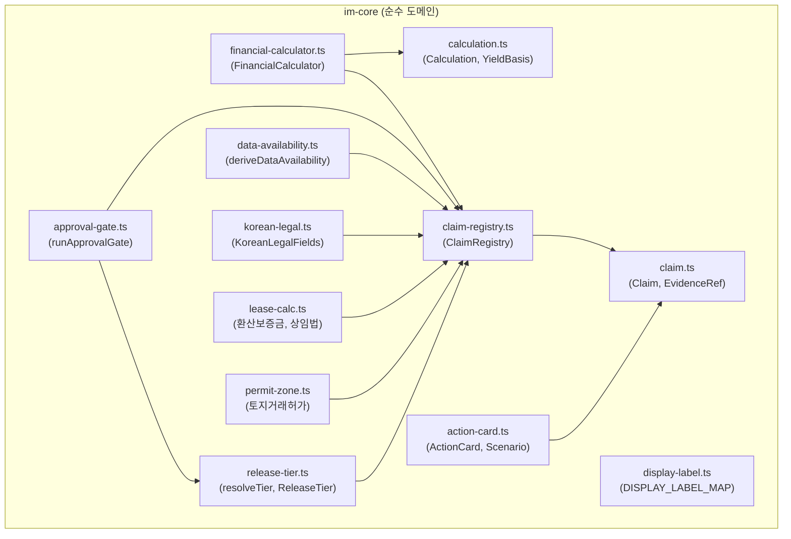

# im-core 도메인 계층 상세 명세 (D37)

> **문서 버전**: v1.0
> **최종 갱신**: 2026-08-28
> **대상**: `src/domain/building/im-core/` (13파일, 총 48,252 bytes)
> **의존 방향**: im-core는 순수 도메인 → React/Next.js/Supabase 무의존

---

## 1. 아키텍처 개요



---

## 2. 모듈별 상세

### 2.1 claim.ts (5,007 bytes)

**핵심 타입**:
```typescript
type ClaimStatus = 'confirmed' | 'needs_check' | 'inferred' | 'not_available';

interface Claim {
  subject: string;       // 주제 (예: 'noi', 'asking_price')
  value: unknown;        // 값 (숫자, 문자열, 객체)
  status: ClaimStatus;   // 확인 상태
  evidence: EvidenceRef[];   // 증거 참조 배열
  asOf?: string;         // 기준일 (ISO 8601)
  displayLabel?: string; // 표시 라벨
}

interface EvidenceRef {
  source: string;     // 출처 (예: 'building_register')
  field: string;      // 필드 (예: 'total_area_sqm')
  retrievedAt: string; // 조회 시각
  rawValue?: unknown;  // 원시값
}
```

### 2.2 claim-registry.ts (4,885 bytes)

**ClaimRegistry 클래스** — 증거 기반 Claim 중앙 저장소:
```typescript
class ClaimRegistry {
  register(claim: Claim): void;
  get(subject: string): Claim | undefined;
  getAll(): Claim[];
  getBySubject(subject: string): Claim[];
  getLatestBySubject(subject: string): Claim | undefined;
  findUnevidenced(): Claim[];       // 증거 없는 Claim
  findUnapproved(): Claim[];        // 미확인 Claim
  findConflicted(): Claim[];        // 충돌 Claim
  findStale(): Claim[];             // 기준일 누락
  getStatusSummary(): StatusSummary;
  validateAll(): ValidationResult;
}
```

### 2.3 financial-calculator.ts (8,548 bytes)

**FinancialCalculator** — 결정론적 재무 계산 엔진:
- **1회만 실행** → 결과를 ClaimRegistry에 등록
- NOI, Cap Rate, IRR, 환산보증금, 실효임대료 계산
- `calculate(inputs): { claims, outputs, violations }`

### 2.4 release-tier.ts (5,333 bytes)

**ReleaseTier 5종 판정**:
```typescript
type ReleaseTier = 'internal_only' | 'fact_om' | 'analysis_im' | 'decision_im' | 'expert_required';

function resolveTier(input: ResolveTierInput): ReleaseTier;
// input: { grade, posture, dataAvailability, hasExpertReview?, hasScenario?, hasAsOf? }

// 허용 섹션 제어
function getTierAllowedSections(tier: ReleaseTier): {
  allowFinancials: boolean;
  allowScenario: boolean;
  allowValueAdd: boolean;
  allowRentGap: boolean;
  maxBodyPages: number;
};

const TIER_DISPLAY_NAME: Record<ReleaseTier, string>;
const TIER_MIN_GRADE: Record<ReleaseTier, string>;
```

### 2.5 display-label.ts (2,657 bytes)

**8종 프로베넌스 책임 표시**:
```typescript
const DISPLAY_LABEL_MAP: Record<ProvenanceKind, {
  label: string;
  icon: string;
  trustWeight: number;  // 5(최고)~0(최저)
}> = {
  registry:            { label: '공부확인',        icon: '✓', trustWeight: 5 },
  public_api:          { label: '공부확인',        icon: '✓', trustWeight: 5 },
  public_api_identified: { label: '공부확인(특정)', icon: '✓', trustWeight: 5 },
  ledger:              { label: '계약서확인',      icon: '✓', trustWeight: 4 },
  seller:              { label: '매도인고지',      icon: '▲', trustWeight: 3 },
  broker:              { label: '중개인현장확인',  icon: '●', trustWeight: 3 },
  broker_opinion:      { label: '중개인의견',      icon: '●', trustWeight: 2 },
  derived:             { label: '계산값',          icon: '=', trustWeight: 2 },
  assumed:             { label: '분석가정',        icon: '◇', trustWeight: 1 },
  not_available:       { label: '미확인',          icon: '?', trustWeight: 0 },
};
```

### 2.6 approval-gate.ts (3,206 bytes)

**승인 게이트**:
```typescript
function runApprovalGate(
  registry: ClaimRegistry,
  tier: ReleaseTier,
  options?: { allowPartialEvidence?: boolean }
): ApprovalGateResult;

interface ApprovalGateResult {
  level: ApprovalLevel;       // 'auto' | 'review' | 'expert'
  passed: boolean;            // ⚠️ NOT 'approved'
  blockers: ApprovalBlocker[];
  fullAdvisoryNote: string;
}
```

### 2.7 korean-legal.ts (4,412 bytes)

**한국법 12종 필수 항목**:
```typescript
interface KoreanLegalFields {
  violation_registered: boolean;          // 위반건축물 등재
  transaction_structure: TransactionStructure; // 거래구조 (개인/법인 등)
  mgmt_fee_structure: MgmtFeeStructure;      // 관리비 구조
  redevelopment_zone: boolean;            // 정비구역 지정
  fund_source_report_required: boolean;   // 자금조달계획서 의무
  brokerage_fee_rate: number;             // 중개보수율
  pretrial_reconciliation: boolean;       // 제소전화해
  fire_safety_certificate: boolean;       // 소방안전증명서
  septic_tank_capacity: number;           // 정화조 용량
  building_energy_grade: string;          // 에너지효율등급
  asbestos_survey: boolean;               // 석면조사
  elevator_inspection: boolean;           // 승강기 검사
}
```

### 2.8 action-card.ts (2,759 bytes)

**Value-Add 3시나리오**:
```typescript
interface ActionCard {
  cardOrder: number;
  currentStateSummary: string;
  scenarios: Scenario[];
  involvesTenantRelocation: boolean;
  relatedClaimIds: string[];
}

interface Scenario {
  type: ScenarioType; // 'base' | 'upside' | 'downside'
  stabilizedMonthlyRent: number;
  stabilizedNOI: number;
  stabilizedCapRate: number;
  estimatedValue: number;
  totalReturn: number;
  actions: ActionItem[];
}
```

### 2.9 lease-calc.ts (5,542 bytes)

**환산보증금/상임법 보호 판정**:
```typescript
const COMMERCIAL_LEASE_ACT_THRESHOLDS = {
  서울: 900_000_000,
  과밀: 690_000_000,
  광역: 540_000_000,
  기타: 370_000_000,
};

function calculateConvertedDeposit(input: ConvertedDepositInput): ConvertedDepositResult;
function calculateEffectiveRent(input: EffectiveRentInput): EffectiveRentResult;
function registerLeaseCalcClaims(registry, converted, effective, asOf): void;
```

### 2.10 permit-zone.ts (3,297 bytes)

**토지거래허가구역 판정**:
```typescript
interface PermitZoneResult {
  isPermitZone: boolean;
  thresholdSqm: number;
  permitRequired: null;  // 단정 금지 — 실무 확인 필요
}

function parsePermitZoneResponse(raw, landSqm): PermitZoneResult;
function registerPermitZoneClaim(registry, result): void;
```

---

## 3. 연동 패턴

### 3.1 Writer → ClaimRegistry
```typescript
// writer.ts
const registry = new ClaimRegistry();
const calc = new FinancialCalculator(financialInputs);
const { claims, outputs, violations } = calc.calculate();
claims.forEach(c => registry.register(c));
registerLeaseCalcClaims(registry, converted, effective, asOf);
registerPermitZoneClaim(registry, permitResult);
registerKoreanLegalClaims(registry, legalFields, asOf);
```

### 3.2 Handler → ReleaseTier → DB
```typescript
// handler.ts
const tier = resolveTier({ grade, posture, dataAvailability });
// DB 영속화
body.releaseTier = tier;
```

### 3.3 Approve API → ApprovalGate
```typescript
// approve/route.ts
const gateResult = runApprovalGate(registry, tier);
if (!gateResult.passed) {
  return NextResponse.json({ blockers: gateResult.blockers }, { status: 422 });
}
```

### 3.4 Viewer → displayLabel
```typescript
// mobile-im-viewer.tsx
import { DISPLAY_LABEL_MAP } from '@/domain/building/im-core';
const config = DISPLAY_LABEL_MAP[provenanceKind];
// config.label, config.icon, config.trustWeight
```

---

## 4. 확장 시 체크리스트

새 im-core 모듈을 추가할 때:

```
□ 1. im-core/{module}.ts 작성 (순수 도메인, 외부 의존 없음)
□ 2. im-core/index.ts에 re-export
□ 3. writer.ts에서 호출 + ClaimRegistry 등록
□ 4. handler.ts에서 DB body에 영속화
□ 5. viewer/editor UI에 표시
□ 6. approve/route.ts에 검증 연동
□ 7. PPTX renderer/data-binder에 매핑
□ 8. 테스트 L2+L4에 positive/negative 짝 추가
```
