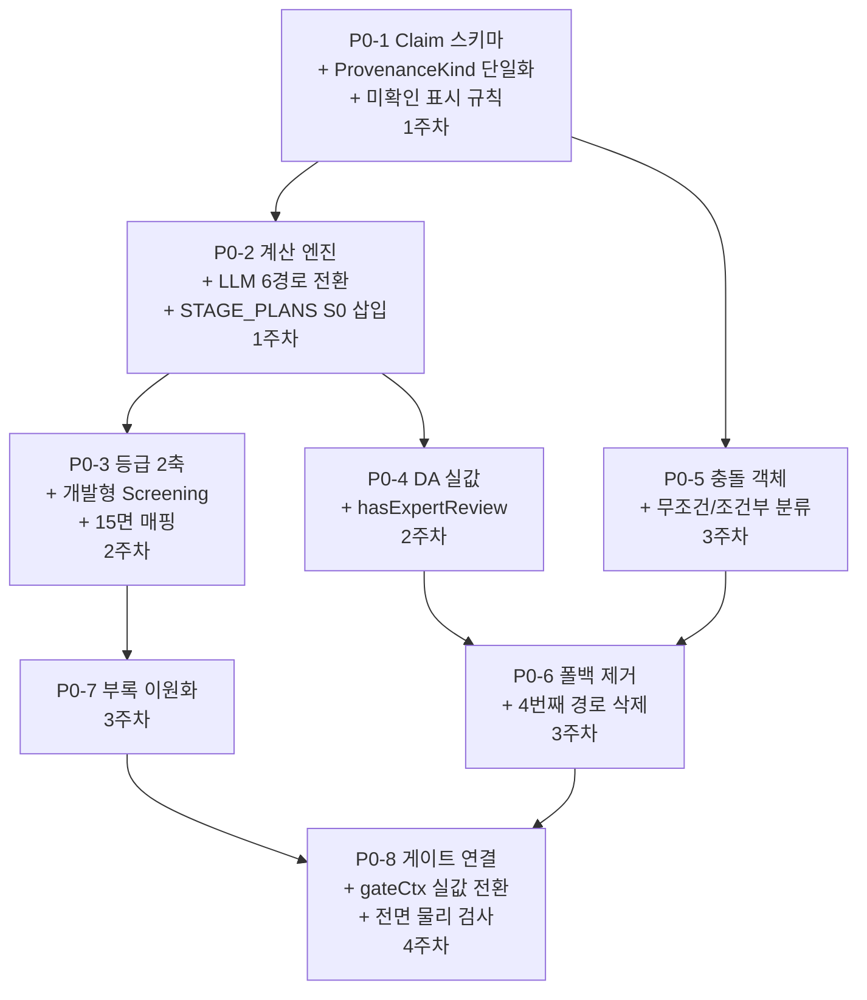

# D37 P0 — 기반 구현 계획 v2 (감사 반영)

> **근거** D36 `IM_BROKER_SPEC_UPGRADE.md` · D37 `IM_BROKER_PIPELINE_ORDER.md` · 07 `BROKER_GOLDILOCKS_IM_PRODUCT_SPEC.md` (1,323행)
> **착수** 1주차 P0-1·P0-2 → 2주차 P0-3·P0-4 → 3주차 P0-5·P0-6·P0-7 → 4주차 P0-8
> **핵심** `사람이 승인 → 엔진이 계산 → LLM이 설명`

> [!IMPORTANT]
> **v2 변경점 (v1 감사 결과 10건 반영)**
> 1. 🔴 `gateCtx` 하드코딩 발견 — `writer.ts` L287~313에서 `crossValidationPassed: true`, `piiRemoved: true` 등 **14개 필드가 상수**. 게이트가 사실상 장식
> 2. 🔴 `writer.ts` L140~155 병렬 실패 시 **3번째 폴백 경로** 발견 — `"> 해당 섹션은 자동 생성에 실패했습니다"` 인라인 마크다운
> 3. 🔴 `_source` 덮어쓰기가 **조건부(guarded) 3곳 + 무조건 2곳**으로 구분 — P0-5 충돌 객체 설계 정밀화
> 4. 🔴 D36 §1.9 개발형 Screening 전환 — P0 계획에서 **누락**
> 5. 🟡 D36 §1.5 미확인 좋은/나쁜 예 표시 규칙 — P0 계획에서 **누락**
> 6. 🟡 `STAGE_PLANS` 4단계 병렬/순차 구조 — P0-2 파이프라인 변경에 미반영
> 7. 🟡 D36 §4.2 income 15면 구성과 현행 `deck-sequencer` 면 매핑 — **미정의**
> 8. 🟡 `ProvenanceKind` 이중 정의 (`imlib.ts` 9종 + `ontology/provenance.ts` 10종) — 단일화 필요
> 9. 🟡 `addFallbackContent` 발동 조건 정밀화 — `!hasBodyShapes` 판정 로직 상세
> 10. 🟡 LLM 프롬프트 숫자 주입 **6경로** 정밀 식별

---

## P0-1 · Claim / Evidence 스키마 신설 (1주차)

### 현행 문제 — 코드 정밀 참조

| 위치 | 문제 |
|---|---|
| [`data-binder.ts`](file:///c:/Users/User/cre-dealcard/src/domain/building/mobile-im/pptx/data-binder.ts) L102~285 `bindSectionData()` | LLM 마크다운 → 정규식 파싱 → SectionData |
| [`data-binder.ts`](file:///c:/Users/User/cre-dealcard/src/domain/building/mobile-im/pptx/data-binder.ts) L1501~1781 `bindFromIMCore()` | 구조화된 IMCore → SectionData (이미 Claim 방향과 유사하나 증거·기준일 없음) |
| [`data-binder.ts`](file:///c:/Users/User/cre-dealcard/src/domain/building/mobile-im/pptx/data-binder.ts) L1784~1971 `bindFromExternalData()` | 공공 API → SectionData. `_source` 문자열 1개뿐 |
| [`imlib.ts`](file:///c:/Users/User/cre-dealcard/src/domain/building/mobile-im/pptx/imlib.ts) L216~225 `ProvenanceKind` | 9종 정의 |
| [`ontology/provenance.ts`](file:///c:/Users/User/cre-dealcard/src/domain/ontology/provenance.ts) `ProvenanceTier` | **10종** 정의 (+ `public` 레거시). 🔴 **이중 정의** |

### v2 추가: ProvenanceKind 단일화

```
현행: imlib.ts 9종 + ontology/provenance.ts 10종 (+ 'public' 레거시)
개선: ontology/provenance.ts를 유일 정본으로 승격
      imlib.ts는 re-export만
      D36 §4.3 신설: 'public_api_identified' 추가 (07 S2b)
```

### 신설 파일 (변경 없음)

| 파일 | 역할 |
|---|---|
| **[NEW]** `src/domain/building/im-core/claim.ts` | `Claim`, `EvidenceRef`, `ClaimStatus` |
| **[NEW]** `src/domain/building/im-core/calculation.ts` | `Calculation`, `YieldBasis` |
| **[NEW]** `src/domain/building/im-core/claim-registry.ts` | `ClaimRegistry` |

### v2 추가: Claim.status='not_available' 표시 규칙 (D36 §1.5)

```
좋은 예: "정상화 순수익은 운영비 내역 미제출로 확정하지 않았습니다"
나쁜 예: "자세한 내용은 추후 확인이 필요합니다"

→ Claim.value === null && Claim.status === 'not_available' 이면:
  displayText = `${Claim.subject}은(는) ${Claim.evidence[0]?.excerpt ?? '자료 미제출'}로 확정하지 않았습니다`
  ❌ 일반적 안내 문구 생성 금지
```

### 수정 대상 (v1에서 보강)

| 파일 | 변경 | v2 보강 |
|---|---|---|
| [`imlib.ts`](file:///c:/Users/User/cre-dealcard/src/domain/building/mobile-im/pptx/imlib.ts) L216~225 | `ProvenanceKind` | 🔴 `ontology/provenance.ts`로 통합. `'public_api_identified'` 신설 |
| [`data-binder.ts`](file:///c:/Users/User/cre-dealcard/src/domain/building/mobile-im/pptx/data-binder.ts) L102~285 | `bindSectionData()` | `@deprecated` → `bindFromClaims()` 유일 경로 |
| [`data-binder.ts`](file:///c:/Users/User/cre-dealcard/src/domain/building/mobile-im/pptx/data-binder.ts) L1501~1781 | `bindFromIMCore()` | Claim 어댑터로 전환 — `metricsData`, `_yield`, `negativeLeverage` 필드를 Claim 참조로 |
| 아키타입 빌더 18파일 | `claimId` 참조 | 🟡 `a03-large-table.ts` 렌트롤 행별 Claim 필요 (P1-3 환산보증금 선행) |

---

## P0-2 · 계산 엔진을 LLM 밖으로 (1주차)

### v2 보강: LLM 프롬프트 숫자 주입 6경로 정밀 식별

> 감사 결과 `im-section-generator.ts` L200~280에서 **6가지 경로**로 숫자가 LLM에 직접 들어감

| # | 경로 | 위치 | 내용 |
|:---:|---|---|---|
| 1 | `normalizedForProvenance` | `buildNarrativeUserPrompt()` | `physical_fact`(면적, 층수), `buyer_fit`(매매가) JSON |
| 2 | `externalData` | `buildNarrativeUserPrompt()` | 건축물대장, 공시지가, 실거래가 JSON |
| 3 | `supplemental` | `buildNarrativeUserPrompt()` | 보증금, 월임대료, 공실률, 관리비 JSON |
| 4 | `financialsMarkdown` | `buildNarrativeUserPrompt()` | 사전 계산된 재무 마크다운 표 (NOI, Cap Rate 등) |
| 5 | `numericalAnchors` | `buildNarrativeUserPrompt()` | 앞 섹션 확정 수치 (askingPriceKrw 등) JSON |
| 6 | `fewShotBlock` | `buildNarrativeUserPrompt()` | Golden IM 예시 내 수치 |

### v2 개선 설계: 6경로 → Claim 참조 전환

```
경로 1~3: 원시 입력 → FinancialCalculator가 Claim 생성 → 프롬프트에 Claim 요약만
경로 4:   financialsMarkdown → Claim 참조 마크다운으로 교체 (숫자 = Claim.id 태그)
경로 5:   numericalAnchors → ClaimRegistry.getBySubject() 로 전환
경로 6:   fewShotBlock → 유지 (참고용, 새 수치 생성 금지 지시 강화)
```

### v2 보강: STAGE_PLANS 4단계 반영

> 감사 결과 `stage-plans.ts`에서 income은 4단계(S1 병렬 → S2 순차 → S3 순차 → S4 순차)

```
현행 파이프라인:
  S1(병렬): property_overview, location_access, lease_status, next_steps
  S2(순차, depends askingPriceKrw+totalAreaSqm): income_analysis
  S3(순차): risk_check
  S4(순차): investment_thesis

개선 파이프라인:
  S0(신설): FinancialCalculator → ClaimRegistry 구성 (전 단계 선행)
  S1(병렬): 기존 유지 — LLM은 Claim 참조 설명만
  S2(순차): income_analysis — Claim 참조, 새 숫자 차단
  S3(순차): risk_check — Claim.status 기반 위험 정리
  S4(순차): investment_thesis — 전 Claim 종합
```

#### [MODIFY] `writer.ts` L78~120 — S0 단계 삽입

| 현행 (L78) | 개선 |
|---|---|
| `const stagePlan = getActiveStagePlan(...)` | `const registry = new ClaimRegistry()` → `new FinancialCalculator(registry).calculate(inputs)` → `const stagePlan = ...` |
| L140~155 병렬 실패 시 인라인 폴백 | 🔴 **삭제**. 실패 → `warnings[]` + 면 미개방 (P0-6과 연동) |

### v2 보강: LLM 출력 숫자 차단 강화

```
현행: L280~284에서 detectHallucination으로 사후 검증 (매매가, 연면적만)
개선: Claim 미참조 숫자 정규식 탐지 → 전량 차단 (매매가뿐 아니라 모든 수치)
```

---

## P0-3 · 발행 등급 2축 (2주차)

### v2 보강: D36 §1.9 개발형 Screening 전환

> 🔴 **v1에서 누락됨.** D36 §1.9: "이론적 상한 계산에 필수 경고문, 실제 건축 가능 연면적 확정 금지"

```typescript
function resolveTier(da: DataAvailability, grade: Grade, posture: InvestmentPosture): ReleaseTier {
  if (grade === 'D') return 'internal_only';
  if (posture === 'development') {
    // 🔴 D36 §1.9: development는 Feasibility가 아니라 Screening
    // 실제 건축 가능 연면적 확정 금지 — 이론적 상한만
    // expert_required 아닌 한 analysis_im까지만 허용
    if (!da.hasExpertReview) return 'analysis_im';  // decision_im 금지
  }
  if (!da.hasRentRoll && posture === 'income') return 'fact_om';
  if (!da.hasComparables && !da.hasRentRoll) return 'fact_om';
  if (!da.hasAsOf || !da.hasScenario) return 'analysis_im';
  return 'decision_im';
}
```

#### [MODIFY] `section-catalog.ts` development 정의

```
현행: emphasize: ['site_analysis', 'development_feasibility']
개선: emphasize: ['site_analysis', 'development_screening']  // 명칭 변경
     → development_feasibility → development_screening (전 프로젝트)
     → 렌더 시 필수 경고문: "본 분석은 개발 가능성 스크리닝이며, 실제 건축 가능 연면적은
       건축사 검토를 통해 확정해야 합니다. 용적률 일괄 적용은 위험합니다."
```

### v2 보강: D36 §4.2 income 15면 ↔ 현행 deck-sequencer 매핑

| D36 §4.2 면 | 현행 deck-sequencer dataKey | 필요 변경 |
|:---:|---|---|
| 1 Cover | `cover` | — |
| 2 Broker Decision Snapshot | **없음** | 🔴 **신설** `decision_snapshot` (A02 변형) |
| 3 Evidence Status | **없음** | 🔴 **신설** `evidence_status` (BG 전용) |
| 4 Property & Public Records | `building` + `land` + `titleRights` | 통합 면 필요 |
| 5 Building Photos | `gallery` | — |
| 6 Location & Rental Market | `location` | — |
| 7 Rent Roll (요약) | `rentRoll` | — |
| 8 Lease Expiry & Vacancy | `stability` (R-INC-01) | 아키타입 분기 |
| 9 Current Income | `profit` | — |
| 10 Market Rent Gap | **없음** / `comps` | 🔴 **신설** `rentGap` |
| 11 Broker Value-add Plan | **없음** | 🔴 **신설** `valueAddPlan` (Action Card) |
| 12 Stabilized Scenario | **없음** | 🔴 **신설** `stabilizedScenario` |
| 13 Price Position | **없음** / `capital` | 개명 + 확장 |
| 14 Risks & Unknowns | `risk` | — |
| 15 DD & LOI + Action Plan + Disclosure | `checklist` + `process` + `closing` | 통합 가능 |
| A-1~ 부록 | **없음** | 🔴 **신설** (P0-7) |

> [!WARNING]
> 15면 중 **5면이 신설** 필요. deck-sequencer 대규모 리팩터의 범위를 P0-3에서 결정하고,
> 실제 구현은 P1 단계에서 아키타입과 함께 진행합니다.

---

## P0-4 · `DataAvailability` 실값 검사 (2주차)

### v2 보강: 신설 필드 추가

| 필드 | v1 | v2 추가 |
|---|---|---|
| `hasOpex` | ✅ | — |
| `hasAsOf` | ✅ | — |
| `hasScenario` | ✅ | — |
| `hasExpertReview` | ❌ | 🔴 **신설** — D36 §1.9 Screening 분기용 |
| `hasPermitZone` | ✅ | — |

---

## P0-5 · 충돌 객체 — 덮어쓰기 금지 (3주차)

### v2 보강: `_source` 덮어쓰기 조건분류 정밀화

> 감사 결과 `bindFromExternalData()`의 덮어쓰기는 **무조건 2곳 + 조건부 3곳**

| 필드 | 행 | 현행 | 충돌 객체 전환 |
|---|:---:|---|---|
| `land` | L1822~1831 | 🔴 **무조건** `_source: 'vworld_api'` | → 기존 값과 다르면 `Conflict` 생성 |
| `publicRecords` | L1861~1869 | 🔴 **무조건** `_source: 'public_api'` | → 기존 값과 다르면 `Conflict` 생성 |
| `commercialDistrict` | L1941~1949 | 🔴 **무조건** `_source: 'semas_api'` | → 기존 값과 다르면 `Conflict` 생성 |
| `titleRights` | L1891~1899 | 🟢 **가드** `if (!_source)` | → 두 값 공존 시 `Conflict` 생성 |
| `comps` | L1906~1924 | 🟢 **가드** `if (!_source)` | → 두 값 공존 시 `Conflict` 생성 |

### v2 추가: 충돌 9종 (07 §5.3 그대로 채택)

```
address · area · use · rentroll_sum · lease_terms
occupancy_narrative · unit_price · comp_identity · yield_basis
```

---

## P0-6 · 폴백 제거 (3주차)

### v2 보강: 폴백 경로 3곳 정밀 식별

> 감사 결과 폴백이 **3곳**에서 발생. v1은 2곳만 식별.

| # | 위치 | 조건 | v1 | v2 |
|:---:|---|---|:---:|:---:|
| 1 | [`pptx-renderer.ts`](file:///c:/Users/User/cre-dealcard/src/domain/building/mobile-im/pptx/pptx-renderer.ts) L49~97 `addFallbackContent()` | `!hasBodyShapes` (아키타입이 본문 렌더 실패) | ✅ 삭제 | ✅ |
| 2 | [`im-section-generator.ts`](file:///c:/Users/User/cre-dealcard/src/domain/building/mobile-im/im-section-generator.ts) L332~344 | `!generatedByAi` (LLM 실패/judge<3.0) → `generatePremiumTemplate()` | ✅ 삭제 | ✅ |
| 3 | [`im-section-generator.ts`](file:///c:/Users/User/cre-dealcard/src/domain/building/mobile-im/im-section-generator.ts) L453~467 | `riskLevel==='high'` → `generatePremiumTemplate()` | ✅ 삭제 | ✅ |
| **4** | [`writer.ts`](file:///c:/Users/User/cre-dealcard/src/domain/building/mobile-im/writer.ts) **L140~155** | **병렬 실패 시 인라인 마크다운** `"> 해당 섹션은 자동 생성에 실패했습니다"` | 🔴 **누락** | 🔴 **삭제** |

#### [MODIFY] `writer.ts` L140~155 병렬 실패 처리

```typescript
// 현행 (L140~155):
} else {
  sections.push({
    markdown: `> 해당 섹션은 자동 생성에 실패했습니다...`,
    confidence: 'needs_check',
    ...
  });
}

// 개선:
} else {
  // 🔴 폴백 마크다운 생성 금지 — 면 미개방 + warnings + DD 이관
  console.warn(`[writer] Section ${sectionType} failed — 면 미개방`);
  warnings.push(`[P0-6] ${sectionType} 생성 실패 — DD 체크리스트에 이관`);
  deficiencies.push({ section: sectionType, reason: result.reason });
  // sections.push() 하지 않음 — 면이 열리지 않음
}
```

### v2 추가: `addFallbackContent` 발동 조건 정밀화

```
발동 조건 (L49~97):
  1. data.content가 존재해야 함
  2. G42: 동일 content 해시 중복 차단 (_fallbackContentHashes)
  3. 핵심 트리거: !hasBodyShapes
     - 테이블 없음 (table _type)
     - y >= 1.7 && y < 6.5 범위의 본문 shape 없음
     - 즉, 아키타입 빌더가 렌더 실패한 빈 슬라이드
  4. A03(Large Table) 폴백 시 → return false (슬라이드 제거)

삭제 후 동작:
  !hasBodyShapes → 슬라이드를 추가하지 않음 + warnings 기록
```

---

## P0-7 · 절삭 폐기 → 부록 이원화 (3주차)

변경 없음 (v1 유지)

---

## P0-8 · 게이트를 산출물 검사로 연결 (4주차)

### 🔴 v2 추가: gateCtx 하드코딩 해소

> **v1에서 완전 누락.** `writer.ts` L287~313의 `gateCtx` 구성에서 **14개 필드가 상수**:

```typescript
// 현행 (L287~313) — 게이트가 사실상 장식
const gateCtx = {
  crossValidationPassed: true,      // 🔴 항상 true
  hasHallucination: false,           // 🔴 항상 false
  piiRemoved: true,                  // 🔴 항상 true
  hasRiskExpression: false,          // 🔴 항상 false
  imJudgeScore: 4.0,                 // 🔴 항상 4.0
  leaseActConfirmed: true,           // 🔴 항상 true
  renewalRightConfirmed: true,       // 🔴 항상 true
  mixedUseConfirmed: true,           // 🔴 항상 true
  illegalArchitectureConfirmed: true, // 🔴 항상 true
  capRateResults: [],                // 🔴 항상 빈 배열
  effectiveLandArea: 0,              // 🔴 항상 0
  effectiveFAR: 0,                   // 🔴 항상 0
  calculatedEffectiveFAR: 0,         // 🔴 항상 0
  ...
};
```

> **이 상태에서는 G05(교차검증), G06(할루시네이션), G07(PII), QG09(Judge) 등이 절대 실패하지 않습니다.**

#### [MODIFY] `writer.ts` L287~313 — 실값 기반 gateCtx 구성

```typescript
const gateCtx: GateContext = {
  salePrice: ctx.purchasePriceKrw,
  area: ctx.totalAreaSqm,
  address: String(ctx.assetIdentity.area_signal ?? ''),
  dataGrade: String(input.dataGrade ?? 'C'),
  // 🔴 실값으로 전환
  crossValidationPassed: crossValResult?.passed ?? false,     // S3 교차검증 결과
  hasHallucination: hallucinationDetected,                     // LLM 검출 결과
  piiRemoved: piiScanResult?.clean ?? false,                   // PII 스캔 결과
  hasRiskExpression: riskExpressionFound,                       // 위험 표현 검출
  imJudgeScore: avgJudgeScore,                                 // 실제 평균 점수
  threeAxisConfirmed: !!(ctx.assetIdentity.asset_type),
  dcfGradeGatePassed: input.dcfEligible ?? false,
  leaseActConfirmed: registry.getBySubject('lease_act')?.status === 'broker_checked',
  renewalRightConfirmed: registry.getBySubject('renewal_right')?.status === 'broker_checked',
  // ... 모든 필드를 파이프라인 실행 결과에서 수집
};
```

> [!CAUTION]
> 이 변경은 **기존에 통과하던 산출물이 대량 실패**합니다. 이것이 **정상**입니다.
> P0-3(등급 2축)과 P0-6(폴백 제거)이 먼저 완료되어야 실패를 올바르게 처리할 수 있습니다.

### v2 보강: artifact-inspector 검사 범위

```
본문 전 면 + 부록 전 면에 대해:
  G31: 크로핑률 (D36 §2.4 "전 면 적용")
  G32: DPI (D36 §2.4 "전 면 적용")
  G33: 텍스트 넘침
  G34: 겹침
  G35: 이탈
  G36: 종횡비 왜곡
  G41: 만실↔공실 (산출물 텍스트 검사)
  G42: 폴백 중복 (해시)
  G44: 괄호 균형
```

---

## 의존 관계 (DAG) — v2


