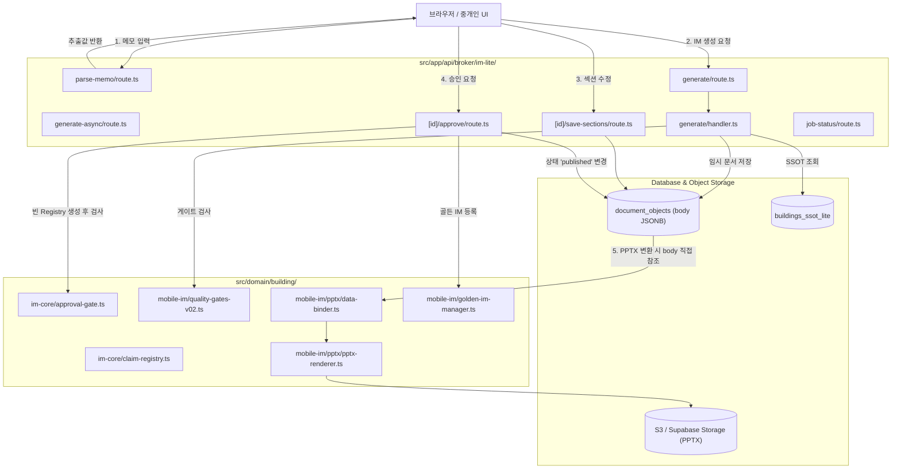

# 01. 현행 시스템 계통도 및 데이터 흐름 감사 보고서 (Lineage Audit)

> **문서 식별자**: `CIM-M0-LINEAGE-v1.0`  
> **감사 일자**: 2026-09-03  
> **상태**: 동결 (Baseline Frozen)  

## 1. 현행 엔드포인트 및 모듈 호출 맵

## 2. 현행 데이터 흐름 결함 감사 요약
1. **단일 거대 JSONB 의존**: 모든 중간 상태가 `document_objects.body`에 덮어써지며 단계별 불변 스냅샷이 부재함.
2. **비동기 큐의 멱등성 결여**: `generate-async` 및 `job-status`가 단순 상태 폴링에 의존하며, 작업자 크래시 시 복구(Resumability) 체크포인트가 없음.
3. **승인과 렌더의 결속 부재**: `ApproveRoute`에서 승인된 이후 사용자가 `save-sections`를 호출하면 `published` 상태인 채로 본문이 수정되는 승인 표류(Approval Drift)가 발생함.
