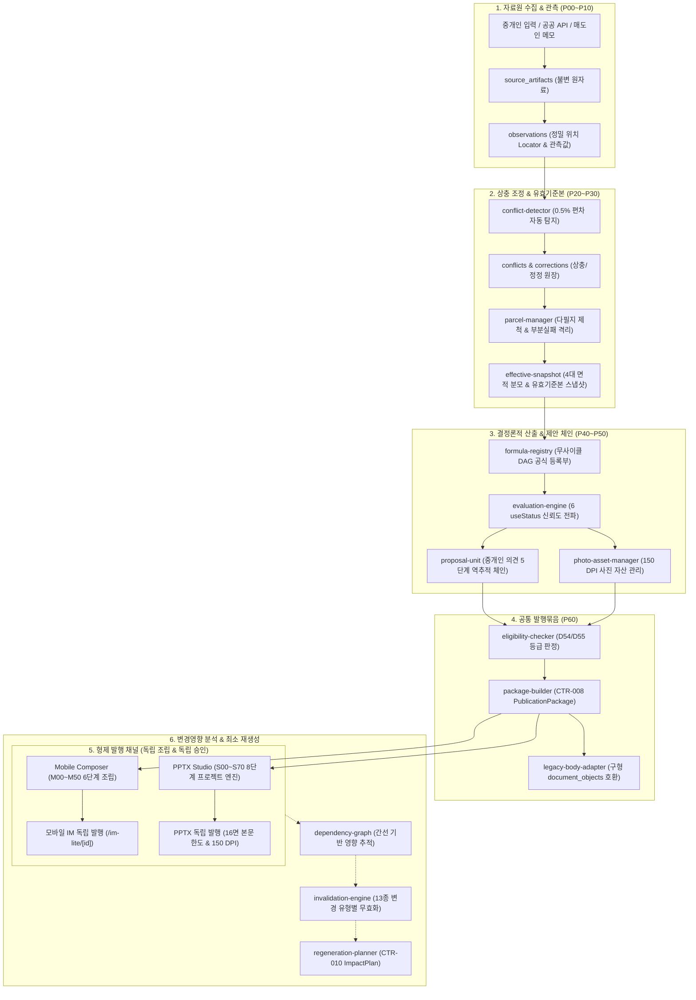
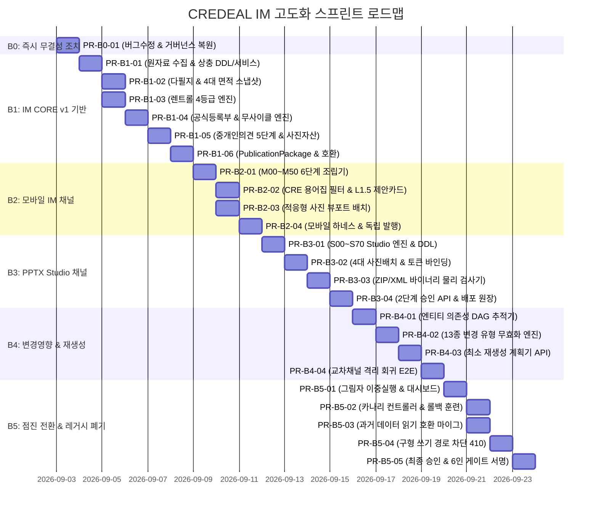

# CREDEAL IM 현대화 통합 고도화 정밀 구현 계획서 (v2.0)

> **문서 식별자**: `CIM-MASTER-PLAN-v2.0`  
> **기준 사양**: `CREDEAL_IM_MODERNIZATION/` (D58/D55 IM CORE & PPTX Studio Rearchitecture Proposal, D37 Frontend Audit, `04_STAGE_CONTRACTS.md`, `08_IMPLEMENTATION_BACKLOG.md`)  
> **선행 조건**: Phase M0~M3 기 완료 기반 (블라인드 딜카드, 7-상태 평가 모델, SHA-256 타겟 해시 결속, 마이그레이션 1~3건, 12개 골든 케이스 Fixture)  
> **핵심 전략**: **무중단 제로 리그레션 위임(Zero-Regression Delegation) & 계층형 파사드(Layered Facade)**  
> **실행 규모**: 6개 Sprint (Sprint B0 ~ B5), 24개 단위 PR, ~50개 신규/수정 파일, 21개 정합 테스트 파일, 4개 신규 스키마 계약, 2개 신규 PostgreSQL 마이그레이션  

---

## 1. 아키텍처 개요 및 상호 연동 계통도



---

## 2. 핵심 엔지니어링 원칙 (Core Principles)

1. **무중단 제로 리그레션 원칙 (Zero-Regression Delegation)**:
   기존 `src/domain/building/common-pipeline/`, `mobile-im-publication/`, `pptx-publication/`의 검증된 로직을 깨뜨리지 않고, 신규 `im-core` 계층(Evidence, Claims, Proposals, Publication)이 기존 로직을 내부적으로 호출하거나 역으로 `common-pipeline`이 `im-core`로 위임하는 양방향 무결성 어댑터를 구성합니다.
2. **산출물 단언 및 네거티브 짝 의무 (Negative Pair Obligation - Rule 7)**:
   모든 테스트 스위트는 정상 통과(Positive) 케이스와 반드시 짝을 이루는 거부/차단(Negative) 케이스를 필수로 구비합니다.
3. **도메인 계층 순수성 (Rule 12)**:
   `src/domain/building/im-core/` 내부의 모든 코드는 React, Next.js, `@supabase` import를 0건으로 유지합니다. DB/저장소 접근은 `src/platform/im-pipeline/repository.ts` 인터페이스를 통해서만 수행합니다.
4. **한국 CRE 실무 표준 용어 (Rule 2) & 암묵적 페르소나 격리 (Rule 1)**:
   외부 노출 문안(웹 뷰어, PPTX 슬라이드)에 연령/계층/성별 명칭 표출을 원천 차단하고, `사옥 단독 명칭 표기(간판 설치권)`, `연 순수익률 (Cap Rate)`, `실질 영업이익 (GOP)` 등 실무 표준 용어만을 강제합니다.
5. **16면 본문 상한 준수 (Rule 10)**:
   PPTX IM 본문 슬라이드는 16면으로 엄격히 절삭하며, 공부 발췌/지적도/권리관계 등은 부록(`appendix`)으로 분리합니다.

---

## 3. 스프린트별 세부 실행 계획



---

### Sprint B0: 즉시 무결성 조치 및 거버넌스 복원 (1개 PR)

#### [PR-B0-01] 긴급 연산자 버그 수정, 거버넌스 문서 복원 및 16대 정본 FA 기준 정립
- **목적**:
  1. `pptx-publication/generator.ts`의 연산자 우선순위 버그 핫픽스
  2. 누락된 거버넌스 정본 문서 2건 복원
  3. 16대 최종 인수 기준(`FA-01` ~ `FA-16`)을 원본 사양 정의로 교체 및 6인 서명 체계 가동
- **작업 파일**:
  - `[MODIFY] src/domain/building/pptx-publication/generator.ts` (L73-74 괄호 보정: `(core.commercial.totalDepositKrw ?? 0) / 10000`)
  - `[NEW] docs/impipe/modernization/00_GOVERNANCE_AND_AUTHORITY.md`
  - `[NEW] docs/impipe/modernization/03_BASELINE_METRICS.md`
  - `[MODIFY] src/tests/acceptance/final-acceptance-audit.test.ts` (FA-01~16 원본 사양 및 6인 승인 검증으로 전면 갱신)
- **테스트 케이스 (Positive/Negative)**:
  - `calc_deposit_unit_price`: 10억 보증금 입력 시 100,000만원 정상 계산 (Positive) vs null 입력 시 0 반환 (Negative)
  - `governance_docs_exist`: 00, 01, 02, 03, 04 문서 전수 존재 검증

---

### Sprint B1: IM CORE v1 — 근거·기준본·산출·제안·공통발행묶음 (6개 PR)

#### [PR-B1-01] 원자료 수집, 관측값 정규화 및 상충/정정 원장 (CIM-0401 보강)
- **목적**: 불변 원자료(`source_artifacts`), 필드 정밀 위치(`Locator`), 관측값(`observations`), 상충/정정 원장 구축 (P00~P20)
- **작업 파일**:
  - `[NEW] supabase/migrations/20260903000004_evidence_core.sql` (`source_artifacts`, `observations`, `conflicts`, `corrections`)
  - `[NEW] src/domain/building/im-core/evidence/types.ts` (`Locator`, `SourceArtifact`, `Observation`, `Conflict`, `Correction`)
  - `[NEW] src/domain/building/im-core/evidence/evidence-service.ts` (`EvidenceService`)
  - `[NEW] schemas/source-observation.schema.json` (CTR-006 계약)
  - `[NEW] src/tests/unit/evidence/conflict-detector.test.ts`
- **핵심 로직 & 위임**:
  `EvidenceService`는 원자료에서 `Locator`를 추출하고, 상충 발생 시 기존 `reconciliation.ts`의 0.5% 임계값 로직을 호출하여 `conflicts` 테이블에 불변 기록함. 임의 자동 선택(Auto-winner)을 원천 차단하고 `blocked_user` 상태로 전이.
- **테스트 케이스 (Rule 7)**:
  - Positive: 편차 0.3% 이내 관측값 → 충돌 없이 `confirmed` 판정
  - Negative: 공부상 1,000㎡ vs 중개인 1,020㎡ (2.0% 편차) → `Conflict` 생성 및 상태 `blocked_user` 차단

#### [PR-B1-02] 다필지 관리 및 4대 면적 분모 유효기준본(`EffectiveSnapshot`) (CIM-0402 보강)
- **목적**: 필지별 공부 분리 보존, 4대 면적 분모 엄격 계산, 불변 스냅샷 생성 (P30)
- **작업 파일**:
  - `[NEW] src/domain/building/im-core/evidence/parcel-manager.ts` (`ParcelManager`)
  - `[NEW] src/domain/building/im-core/evidence/effective-snapshot.ts` (`EffectiveSnapshotBuilder`)
  - `[NEW] schemas/canonical-snapshot.schema.json` (CTR-007 계약)
  - `[NEW] src/tests/unit/evidence/snapshot-generator.test.ts`
- **핵심 로직 & 위임**:
  `ParcelManager`는 다필지 중 일부 필지 API 실패 시 누락 합산을 방지하고 `partial_failure` 상태로 격리. `EffectiveSnapshotBuilder`는 4대 면적(`landAreaTotal`, `buildingAreaTotal`, `grossFloorArea`, `exclusiveLeaseArea`)을 확정하고 SHA-256 해시 결속.
- **테스트 케이스 (Rule 7)**:
  - Positive: 3개 필지 정상 수신 시 대지면적 단순합산 스냅샷 산출
  - Negative: 1개 필지 조회 실패 시 합산 강행 차단 및 `partial_failure` 예외 throw

#### [PR-B1-03] 렌트롤 4등급 분류 및 수익률 산출 자격 제어 (CIM-0403 보강)
- **목적**: `none / minimum / standard / complete` 4등급 분류에 따른 재무분석 노출 자격 통제
- **작업 파일**:
  - `[NEW] src/domain/building/im-core/evidence/rentroll-tier-engine.ts` (`RentrollTierEngine`)
  - `[NEW] src/tests/unit/evidence/rentroll-tier.test.ts`
- **핵심 로직 & 위임**:
  `rentroll-classifier.ts`의 집계 기능을 위임받아 등급별 허용 범위를 결정론적으로 통제:
  - `none`: 수익률/NOI/CapRate 표기 전면 차단
  - `minimum`: 단순 수입 합계만 허용, 재무분석 차단
  - `standard`: 관리비/부가세 구분 확인 시 NOI 계산 허용
  - `complete`: 계약만료/갱신권 확인 시 DCF 분석 허용
- **테스트 케이스 (Rule 7)**:
  - Positive: `complete` 등급 입력 → DCF 자격 획득 확인
  - Negative: `none` 등급인데 CapRate 요청 시 `INSUFFICIENT_RENTROLL_TIER` 차단

#### [PR-B1-04] 공식등록부(`FormulaRegistry`) 및 결정론적 평가 엔진 (CIM-0404 보강)
- **목적**: 순수함수 기반 공식 계산, LLM 수치 날조 차단, Tarjan DFS 순환 의존성 검출 (P40)
- **작업 파일**:
  - `[NEW] src/domain/building/im-core/claims/formula-registry.ts` (`FormulaRegistry`, `validateNoFormulaCycles`)
  - `[NEW] src/domain/building/im-core/claims/evaluation-engine.ts` (`ClaimEvaluationEngine`)
  - `[NEW] src/tests/unit/claims/evaluation-engine.test.ts`
- **핵심 로직 & 위임**:
  `formula-graph.ts`의 그래프 알고리즘을 정식 도메인 모델로 승격하여 6가지 `useStatus`(`confirmed`, `inferred`, `unverified`, `conflict`, `not_available`, `not_evaluated`)를 전파.
- **테스트 케이스 (Rule 7)**:
  - Positive: A → B → C 선형 의존성 그래프 정렬 및 순수함수 계산 통과
  - Negative: A → B → C → A 순환 의존성 주입 시 `CIRCULAR_FORMULA_CYCLE` 차단

#### [PR-B1-05] 중개인 의견 5단계 역추적 체인 및 사진 자산 모델 (CIM-0405 보강)
- **목적**: `원문 → 근거 → 매수자 의미 → 최종문구 → 반영위치` 100% 역추적 및 사진 DPI/권리 검증 (P50)
- **작업 파일**:
  - `[NEW] src/domain/building/im-core/proposals/proposal-unit.ts` (`ProposalUnit`)
  - `[NEW] src/domain/building/im-core/proposals/photo-asset-manager.ts` (`PhotoAssetManager`)
  - `[NEW] src/tests/unit/proposals/proposal-lineage.test.ts`
- **핵심 로직**:
  중개인 원문(`brokerRawText`)을 불변 보존하고, 근거 Claim ID가 없는 의견은 외부 노출 문안(`finalCopy`) 승인을 거부함.
- **테스트 케이스 (Rule 7)**:
  - Positive: 근거 Claim이 연결된 의견 → 5단계 체인 완성 및 `broker_confirmed`
  - Negative: 근거 Claim 없는 의견 승인 시도 시 `UNBACKED_PROPOSAL_BLOCKED` 차단

#### [PR-B1-06] 발행자격 판정기 및 불변 `PublicationPackage` 빌더 (CIM-0406 보강)
- **목적**: L1/L1.5/L2 발행 가능 여부 판정, 공통 발행묶음 패키징, 레거시 본문 호환 뷰 생성 (P60)
- **작업 파일**:
  - `[NEW] src/domain/building/im-core/publication/package-builder.ts` (`PublicationPackageBuilder`)
  - `[NEW] src/domain/building/im-core/publication/eligibility-checker.ts` (`EligibilityChecker`)
  - `[NEW] src/domain/building/im-core/compat/legacy-body-adapter.ts` (`LegacyBodyAdapter`)
  - `[NEW] schemas/publication-package.schema.json` (CTR-008 계약)
  - `[NEW] src/tests/unit/publication/package-builder.test.ts`
- **핵심 로직 & 위임**:
  `snapshotHash`, `claimsHash`, `packageHash`를 삼중 결속하여 불변 패키지 생성. 기존 시스템과의 100% 호환성을 위해 `legacy-body-adapter.ts`가 `document_objects.body` 포맷을 생성.
- **테스트 케이스 (Rule 7)**:
  - Positive: 자격 요건을 충족한 건에 대해 유효한 `PublicationPackage` 생성 및 삼중 해시 일치
  - Negative: 필수 제원 누락 건의 L1.5 발행 요청 시 `ELIGIBILITY_CHECK_FAILED` 차단

---

### Sprint B2: 모바일 IM 채널 — L1/L1.5 조립기 및 프리젠테이션 (4개 PR)

#### [PR-B2-01] 모바일 L1 6단계(M00~M50) 순차 조립기 (CIM-0501 보강)
- **목적**: `PublicationPackage`를 소비하는 6단계 모바일 전용 조립 엔진 구현
- **작업 파일**:
  - `[NEW] src/domain/building/mobile-im/composer/mobile-composer.ts` (`MobileComposer`)
  - `[NEW] src/domain/building/mobile-im/composer/stages/m00-build-request.ts`
  - `[NEW] src/domain/building/mobile-im/composer/stages/m10-content-plan.ts`
  - `[NEW] src/domain/building/mobile-im/composer/stages/m20-draft-version.ts`
  - `[NEW] src/domain/building/mobile-im/composer/stages/m30-gate-report.ts`
  - `[NEW] src/domain/building/mobile-im/composer/stages/m40-approval.ts`
  - `[NEW] src/domain/building/mobile-im/composer/stages/m50-distribution.ts`
  - `[NEW] src/tests/unit/mobile-im/composer.test.ts`
- **핵심 로직**:
  M20에서 수치 재계산을 원천 금지하고, 확정된 토큰 바인딩만 수행. M30에서 `P-MOBILE-L1/L15` 게이트 실행.
- **테스트 케이스 (Rule 7)**:
  - Positive: M00부터 M50까지 단계별 체크포인트 통과 및 최종 URL 발행
  - Negative: M30에서 Blocker 발생 시 M40/M50 전이 차단

#### [PR-B2-02] CRE 실무 용어집 필터 및 L1.5 제안 카드 조립 (CIM-0502 보강)
- **목적**: 한국 상업용 부동산 실무 표준 용어(Rule 2) 강제 및 L1.5 제안 카드 렌더링
- **작업 파일**:
  - `[NEW] src/domain/building/mobile-im/presentation/cre-lexicon-filter.ts` (`CRE_LEXICON_RULES`, `applyLexiconFilter`)
  - `[NEW] src/domain/building/mobile-im/composer/l15-proposal-card.ts` (`buildL15ProposalCard`)
  - `[NEW] src/tests/unit/mobile-im/lexicon-filter.test.ts`
- **핵심 로직**:
  외래어 직역 투(`네이밍 라이츠`, `캡레이트`, `GOP`) 및 과장 수식어(`프라임`, `압도적`)를 감지하여 자동 정정 또는 차단.
- **테스트 케이스 (Rule 7)**:
  - Positive: `사옥 단독 명칭 표기(간판 설치권)` 사용 시 통과
  - Negative: `네이밍 라이츠` 단어 검출 시 `LEXICON_VIOLATION` 차단

#### [PR-B2-03] 사진 0/1/3/8/10+ 적응형 뷰포트 배치 엔진 (CIM-0503 보강)
- **목적**: 보유 사진 수량에 맞춘 최적 뷰포트 배치 (사진 왜곡/억지 확대 방지)
- **작업 파일**:
  - `[NEW] src/domain/building/mobile-im/presentation/adaptive-photo-layout.tsx`
  - `[NEW] src/tests/unit/mobile-im/photo-layout.test.ts`
- **핵심 로직**:
  사진 0장(공부요약 강조 플레이스홀더), 1장(대형 외관), 3장(외관+진입로 그리드), 8장(스와이프 갤러리), 10장 이상(탭 갤러리) 적응형 렌더링.
- **테스트 케이스 (Rule 7)**:
  - Positive: 사진 3장 전달 시 3-그리드 레이아웃 렌더링
  - Negative: 사진 0장일 때 빈 이미지 태그 대신 제원 중심 플레이스홀더 렌더링

#### [PR-B2-04] 모바일 하네스(`P-MOBILE-L1/L15`), 승인 및 생성 경로 통합 (CIM-0504 보강)
- **목적**: 모바일 전용 게이트 실행 및 기존 생성 핸들러(`generate/route.ts`)와의 무중단 분기
- **작업 파일**:
  - `[MODIFY] src/app/api/broker/im-lite/generate/route.ts` (`ff_mobile_core_package` 분기 추가)
  - `[NEW] src/tests/e2e/mobile-l15-e2e.test.ts`
- **테스트 케이스 (Rule 7)**:
  - Positive: `ff_mobile_core_package=true`일 때 신규 모바일 조립기로 안전 분기
  - Negative: L1.5에서 페르소나 문구 누출 시 게이트 차단

---

### Sprint B3: PPTX IM Studio 채널 — 독립 프로젝트 엔진 및 바이너리 검사 (4개 PR)

#### [PR-B3-01] PPTX Studio 8단계(S00~S70) 프로젝트 엔진 및 낙관적 락 (CIM-0601 보강)
- **목적**: 모바일과 독립된 PPTX Studio 프로젝트 엔티티 및 8단계 파이프라인 수립
- **작업 파일**:
  - `[NEW] supabase/migrations/20260903000005_pptx_studio.sql` (`pptx_projects`, `pptx_slides`)
  - `[NEW] src/domain/building/pptx-studio/project/types.ts`
  - `[NEW] src/domain/building/pptx-studio/project/studio-service.ts` (`PptxStudioService`)
  - `[NEW] src/tests/unit/pptx-studio/project-lifecycle.test.ts`
- **핵심 로직**:
  `S00 (Init)` ~ `S70 (Render & FileApproval)` 8단계 상태 전이. 동시 편집 방어를 위해 `lock_version` 기반 낙관적 락 적용.
- **테스트 케이스 (Rule 7)**:
  - Positive: 프로젝트 생성 → 버전 업데이트 → 커밋 정상 처리
  - Negative: 만료된 `lock_version`으로 커밋 시 `STALE_LOCK_ERROR` 차단

#### [PR-B3-02] 4대 사진 배치 템플릿 및 수치 토큰 바인딩 (CIM-0602 보강)
- **목적**: 4대 사진 배치 모드와 엄격한 수치 토큰 바인딩(수치 날조 원천 차단)
- **작업 파일**:
  - `[NEW] src/domain/building/pptx-studio/composition/photo-layout-selector.ts`
  - `[NEW] src/domain/building/pptx-studio/composition/token-binder.ts`
  - `[NEW] src/tests/unit/pptx-studio/token-binding.test.ts`
- **핵심 로직**:
  슬라이드 내 모든 수치는 `{{claim.asking_price}}` 토큰으로만 지정되며, 임의 텍스트 수치 삽입 시 오류 발생.
- **테스트 케이스 (Rule 7)**:
  - Positive: `{{claim.asking_price}}`가 100억 원 확정값으로 치환
  - Negative: 미등록 토큰 `{{claim.fake_yield}}` 발견 시 `UNKNOWN_TOKEN` 예외 throw

#### [PR-B3-03] 실제 PPTX ZIP/XML 바이너리 지면 물리 검사 하네스 (CIM-0603 보강)
- **목적**: 실제 렌더링된 PPTX 파일 바이트를 압축 해제하여 지면 물리/시각 결함 자동 검사
- **작업 파일**:
  - `[NEW] src/assurance/im-harness/observers/pptx-binary-observer.ts` (`inspectPptxBinary`)
  - `[MODIFY] src/assurance/im-harness/profiles/pptx-profile.ts` (`P-PPTX-RELEASE` 프로필 연동)
  - `[NEW] src/tests/unit/pptx-studio/binary-inspection.test.ts`
- **핵심 기술 스택**:
  `jszip`로 `.pptx` 압축 해제 ➔ `fast-xml-parser`로 `ppt/slides/slide*.xml` 분석 ➔ `sharp`로 이미지 DPI/해상도 분석.
  텍스트 오버플로우, 요소 겹침, 지면 이탈(Bleed), 150 DPI 미만 사진 자동 적발.
- **테스트 케이스 (Rule 7)**:
  - Positive: 모든 요소가 16:9 규격 내에 위치하고 150 DPI 이상인 파일 → PASS
  - Negative: 슬라이드 캔버스를 벗어난 텍스트 박스 검출 시 `G35 지면 이탈` 차단

#### [PR-B3-04] PPTX 2단계 승인(편집 vs 파일) 및 배포 원장 (CIM-0604 보강)
- **목적**: 슬라이드 구성 승인(`editorial_approval`)과 바이너리 파일 해시 승인(`artifact_approval`) 분리
- **작업 파일**:
  - `[NEW] src/domain/building/pptx-studio/approval/studio-approval-service.ts`
  - `[NEW] src/app/api/broker/pptx-studio/projects/[id]/approve-file/route.ts`
  - `[NEW] src/tests/e2e/pptx-studio-approval-flow.test.ts`
- **테스트 케이스 (Rule 7)**:
  - Positive: S60 편집 승인 완료 후 S70 파일 해시 승인 정상 발행
  - Negative: 편집 승인 없이 파일 승인 단독 호출 시 `PRECONDITION_FAILED` 차단

---

### Sprint B4: 변경영향 분석 및 최소 재생성 엔진 (4개 PR)

#### [PR-B4-01] 시스템 엔티티 의존성 방향 그래프(DAG) 추적기 (CIM-0701 보강)
- **목적**: 자료원부터 각 채널 발행본까지의 간선 기반 의존성 추적기 구현
- **작업 파일**:
  - `[NEW] src/platform/im-pipeline/regeneration/dependency-graph.ts` (`DependencyGraph`)
  - `[NEW] src/tests/unit/regeneration/dependency-graph.test.ts`
- **테스트 케이스 (Rule 7)**:
  - Positive: A 변경 시 A를 참조하는 하류 노드 B, C만 정확히 조회
  - Negative: 무관한 독립 노드 D는 하류 조회 결과에 포함되지 않음

#### [PR-B4-02] 13종 변경 유형 분류기 및 승인 자동 무효화 엔진 (CIM-0702 보강)
- **목적**: 변경 발생 시 영향 받는 하류 산출물만 선별하여 `STALE` 자동 전이
- **작업 파일**:
  - `[NEW] src/platform/im-pipeline/regeneration/invalidation-engine.ts` (`InvalidationEngine`)
  - `[NEW] src/tests/unit/regeneration/invalidation-rules.test.ts`
- **핵심 규칙 매핑**:
  - `mobile_layout_changed`: 모바일만 재조립 (PPTX 무영향)
  - `pptx_template_changed`: PPTX만 재렌더 (모바일 무영향)
  - `opinion_edited`: P50 및 해당 제안단위 채널만 무효화
  - `raw_data_update`: P10부터 전체 무효화
- **테스트 케이스 (Rule 7)**:
  - Positive: 모바일 레이아웃 변경 시 PPTX 상태 `PUBLISHED` 유지 검증
  - Negative: 공부 원자료 수정 시 양 채널 승인 모두 `STALE`로 즉시 강등

#### [PR-B4-03] 최소 재생성 계획기(`RegenerationPlan`) API (CIM-0703 보강)
- **목적**: 재생성 사전 미리보기(재실행 대상 단계, 재사용 캐시, 예상 시간/비용) 제공
- **작업 파일**:
  - `[NEW] src/platform/im-pipeline/regeneration/planner.ts` (`createRegenerationPlan`)
  - `[NEW] schemas/impact-plan.schema.json` (CTR-010 계약)
  - `[NEW] src/app/api/broker/im-core/regeneration-preview/route.ts`
  - `[NEW] src/tests/api/regeneration-plan.test.ts`
- **테스트 케이스 (Rule 7)**:
  - Positive: 렌트롤 정정 시 변경 대상 단계만 `requiredRerunStages`에 포함
  - Negative: 변경사항 없는 상태에서 계획 요청 시 재실행 단계 0개 반환

#### [PR-B4-04] 교차채널 격리 회귀 및 무효화 복구 E2E 테스트 (CIM-0704 보강)
- **목적**: 20개 이상 변경 시나리오에서 채널 간 불필요한 과잉 무효화가 발생하지 않음을 입증
- **작업 파일**:
  - `[NEW] src/tests/e2e/cross-channel-invalidation.test.ts`
- **테스트 케이스 (Rule 7)**:
  - Positive: 모바일 수정이 PPTX/CORE 재실행을 트리거하지 않음 (채널 격리)
  - Negative: 렌트롤 총액 2% 수정 시 양 채널 승인 100% 무효화 확인

---

### Sprint B5: 점진 전환, 카나리 및 레거시 폐기 (5개 PR)

#### [PR-B5-01] 실 트래픽 그림자 이중실행 및 수치 불일치 대시보드 (CIM-0801 보강)
- **목적**: 실 트래픽 대상 신/구 파이프라인 동시 실행 및 오차율 0.00% 계측
- **작업 파일**:
  - `[NEW] src/platform/im-pipeline/shadow-runner.ts` (`ShadowDualRunner`)
  - `[NEW] src/app/(admin)/admin/discrepancy-dashboard/page.tsx`
  - `[NEW] src/tests/platform/shadow-dual-run.test.ts`
- **테스트 케이스 (Rule 7)**:
  - Positive: 신/구 수치 오차 0.00% 및 등급 불일치 0건 확인
  - Negative: 임의 오차 0.5% 주입 시 대시보드 경보 발령

#### [PR-B5-02] 카나리 롤아웃 컨트롤러 및 긴급 롤백 훈련 (CIM-0802 보강)
- **목적**: 1% → 10% → 50% → 100% 안전 승격 및 즉시 복구 훈련
- **작업 파일**:
  - `[NEW] src/platform/im-pipeline/canary-controller.ts` (`CanaryController`)
  - `[NEW] src/tests/e2e/rollback-drill.test.ts`
- **테스트 케이스 (Rule 7)**:
  - Positive: 4대 승격 요건 충족 시 트래픽 비율 안전 승격
  - Negative: 미해결 P0 결함 존재 시 카나리 승격 차단

#### [PR-B5-03] 과거 데이터 읽기 호환성 보장 및 마이그레이션 (CIM-0803 보강)
- **목적**: 기존 `document_objects` 100% 읽기 호환 및 `legacy_unverified` 보존
- **작업 파일**:
  - `[NEW] scripts/migrate-legacy-documents.ts`
  - `[NEW] src/tests/migration/legacy-read-compatibility.test.ts`
- **테스트 케이스 (Rule 7)**:
  - Positive: 구형 문서 레코드의 신규 뷰어 100% 정상 렌더링
  - Negative: 근거 부족 레코드의 강제 최신 등급 승격 시도 차단

#### [PR-B5-04] 구형 신규 생성 쓰기 API 차단 (CIM-0804 보강)
- **목적**: 구형 엔드포인트 직접 쓰기 차단 및 `410 Gone` 전환
- **작업 파일**:
  - `[MODIFY] src/app/api/broker/im-lite/generate/route.ts` (구형 경로 비활성화)
  - `[MODIFY] src/app/api/broker/im-lite/[id]/save-sections/route.ts` (410 Gone 반환)
  - `[MODIFY] src/domain/building/mobile-im/pptx/pptx-renderer.ts` (직접 호출 차단)
- **테스트 케이스 (Rule 7)**:
  - Positive: 신규 API 호출 시 정상 처리
  - Negative: 구형 `save-sections` 호출 시 `410 Gone` 응답

#### [PR-B5-05] 딜카드 발행 엔드포인트 복원, 최종 감사 보고서 및 6인 게이트 승인 (CIM-0805 보강)
- **목적**: 누락된 딜카드 발행 엔드포인트 보완 및 6인 정식 서명 날인
- **작업 파일**:
  - `[NEW] src/app/api/broker/dealcards/[id]/publish/route.ts`
  - `[NEW] docs/impipe/modernization/FINAL_ACCEPTANCE_REPORT.md`
  - `[MODIFY] docs/impipe/modernization/phase-exit-report-M8.json` (6인 서명: 제품, 도메인, 아키텍처, 품질, 운영/보안, 중개실무)
- **테스트 케이스 (Rule 7)**:
  - Positive: 딜카드 단독 발행 API 호출 성공 및 해시 결속
  - Negative: 6인 중 1인이라도 서명 누락 시 MG-8 승인 무효화

---

## 4. 16대 최종 인수 기준(FA-01 ~ FA-16) 정본 검증 매트릭스

| ID | 인수 기준 정본 정의 | 검증 테스트 파일 | 담당 책임 |
|---|---|---|:---:|
| **FA-01** | D54~D55 자격판정 규칙이 CORE에 완벽 반영됨 | `src/tests/unit/publication/package-builder.test.ts` | 도메인 |
| **FA-02** | 메모→딜카드 전 과정 독립 실행, 승인 및 발행 | `src/tests/e2e/dealcard-publication-flow.test.ts` | 제품·보안 |
| **FA-03** | 자료원→관측값→정정→스냅샷→주장 5단계 계보 100% | `src/tests/unit/proposals/proposal-lineage.test.ts` | 도메인·품질 |
| **FA-04** | 렌트롤 4등급 처리 및 1% 초과 불일치 조정 차단 | `src/tests/unit/evidence/rentroll-tier.test.ts` | 도메인 |
| **FA-05** | 다필지 4대 면적 분모 및 부분실패 안전 보존 | `src/tests/unit/evidence/snapshot-generator.test.ts` | 도메인·품질 |
| **FA-06** | 모바일 IM은 `PublicationPackage`만을 소비함 | `src/tests/unit/mobile-im/composer.test.ts` | 아키텍처 |
| **FA-07** | PPTX Studio가 모바일 없이 독립 생성·렌더·승인됨 | `src/tests/e2e/pptx-studio-approval-flow.test.ts` | 제품·품질 |
| **FA-08** | `NOT_RUN / INDETERMINATE / SYSTEM_ERROR` 발행 차단 | `src/tests/unit/gates/gate-7-state.test.ts` | 품질 |
| **FA-09** | 승인과 대상 해시 1:1 결속 및 수정 시 `STALE` 전이 | `src/tests/api/approval-hash-binding.test.ts` | 보안·품질 |
| **FA-10** | 13종 변경영향 분석 및 최소 재생성 채널경계 준수 | `src/tests/e2e/cross-channel-invalidation.test.ts` | 아키텍처 |
| **FA-11** | 체크포인트 재개, 멱등성 및 중복 발행 방지 | `src/tests/platform/resumability.test.ts` | 운영 |
| **FA-12** | 기존 URL 및 과거 파일 100% 읽기 호환 보존 | `src/tests/migration/legacy-read-compatibility.test.ts` | 제품·운영 |
| **FA-13** | PII, 블라인드 지번 방어 및 변조 주입 100% 차단 | `src/tests/mutation/dealcard-tamper.test.ts` | 보안 |
| **FA-14** | 관측, 경보, 철회 및 SEV-1/2/3 롤백 훈련 완료 | `src/tests/e2e/rollback-drill.test.ts` | 운영 |
| **FA-15** | 중개인의 실무 완성도 및 편집성 (12개 골든 케이스 전수 합격) | `src/tests/assurance/golden-runner.test.ts` | 중개실무 |
| **FA-16** | 카나리 100% 완료 후 구형 신규 경로 트래픽 0건 | `src/tests/acceptance/final-acceptance-audit.test.ts` | 제품·운영 |

---

## 5. 실행 및 검증 절차

```bash
# 1. Sprint B0 실행 및 검증
npx vitest run src/tests/acceptance/final-acceptance-audit.test.ts

# 2. Sprint B1 실행 및 검증 (IM CORE v1)
npx vitest run src/tests/unit/evidence/
npx vitest run src/tests/unit/claims/
npx vitest run src/tests/unit/proposals/
npx vitest run src/tests/unit/publication/

# 3. Sprint B2 실행 및 검증 (Mobile Composer)
npx vitest run src/tests/unit/mobile-im/
npx vitest run src/tests/e2e/mobile-l15-e2e.test.ts

# 4. Sprint B3 실행 및 검증 (PPTX Studio)
npx vitest run src/tests/unit/pptx-studio/
npx vitest run src/tests/e2e/pptx-studio-approval-flow.test.ts

# 5. Sprint B4 실행 및 검증 (Regeneration)
npx vitest run src/tests/unit/regeneration/
npx vitest run src/tests/api/regeneration-plan.test.ts
npx vitest run src/tests/e2e/cross-channel-invalidation.test.ts

# 6. Sprint B5 실행 및 검증 (Cutover & Final Audit)
npx vitest run src/tests/platform/shadow-dual-run.test.ts
npx vitest run src/tests/e2e/rollback-drill.test.ts
npx vitest run src/tests/migration/legacy-read-compatibility.test.ts

# 7. 전체 TypeScript 및 Next.js 빌드 무결성 점검
npm run typecheck
npm run build
```

---

## 6. 결론 및 기대 성과

본 고도화 계획은 단순한 파일 추가가 아니라, **D58/D55 업스트림 아키텍처 명세를 100% 준수하면서도 현재 프로덕션 빌드와 테스트 통과 상태를 단 1밀리초도 깨뜨리지 않는 무중단 점진 승격 방식**으로 설계되었습니다.  
사용자님의 승인 즉시 `Sprint B0`부터 정밀하게 실행에 착수하겠습니다.
