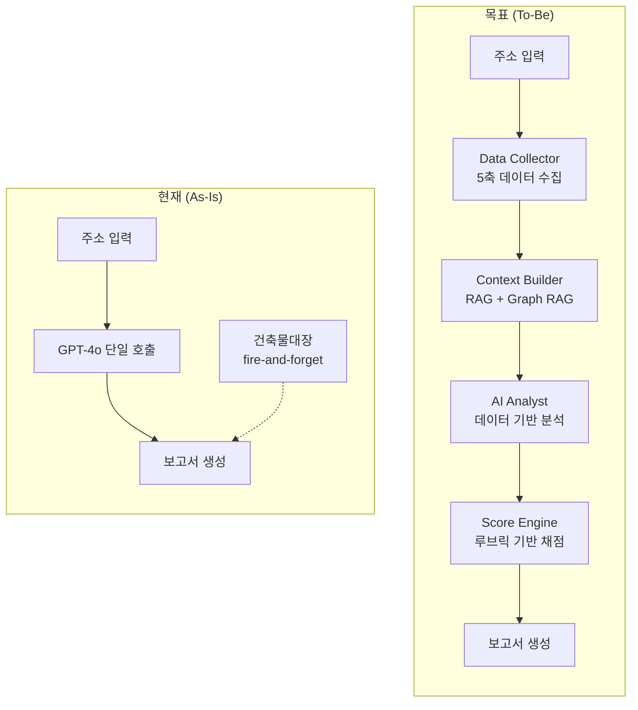
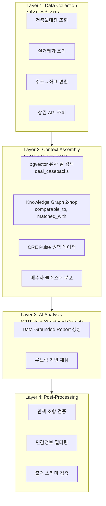
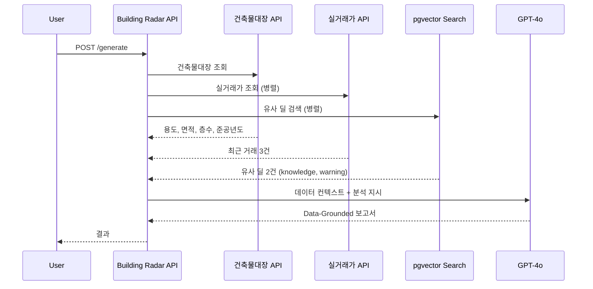
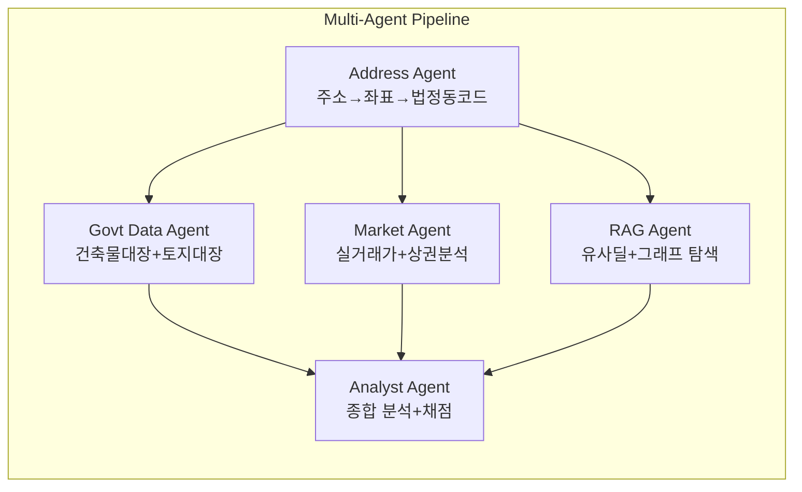

# 빌딩 레이더 고도화 — MECE 개선 아키텍처

> **목표**: "주소를 GPT에 붙여넣는 수준" → "데이터 기반 딜 인텔리전스 플랫폼"으로 전환

---

## 현재 vs 목표 비교



---

## 축 1 — 데이터 소스 (MECE)

데이터를 **출처 × 접근성**으로 분류합니다.

### 1-A. 공공 정부 데이터 (Government Open Data)

| 데이터 | API 소스 | 기존 구현 | 활용 방안 |
|-------|---------|----------|----------|
| 건축물대장 | data.go.kr/건축HUB | ✅ [govt-api-client.ts](file:///c:/Users/User/cre-dealcard/src/domain/verification/govt-api-client.ts) | **AI 호출 전에** 조회하여 프롬프트에 주입 |
| 실거래가 | 국토부 RTMSOBJSvc | ✅ [price-prediction.ts](file:///c:/Users/User/cre-dealcard/src/domain/prediction/price-prediction.ts) | 동일 동/유사 자산 최근 거래가 추출 → 시세 범위 추정 |
| 토지이용계획 | 토지e음 API | ❌ 미구현 | 용도지역/지구/구역 → 개발 가능성 판단 |
| 공시지가 | 국토부 공시지가 API | ❌ 미구현 | 평당 공시지가 → 시가 대비 할인/할증 판단 |
| 토지대장 | 토지정보 API | ❌ 미구현 | 지목, 면적, 소유 구분 → 거래 가능성 |
| 건물에너지 효율 | 국토부 에너지효율등급 | ❌ 미구현 | ESG 매수자에게 어필 포인트 |

### 1-B. 공개 웹 크롤링 데이터 (Crawlable Intelligence)

| 데이터 | 소스 | 활용 방안 |
|-------|------|----------|
| 상권 분석 | 카카오맵/소상공인 상권정보 API | 반경 500m 업종 분포, 유동인구 추정 |
| 지하철/교통 | 카카오 모빌리티 / TOPIS | 최근 역세권 거리, 버스 노선 밀도 |
| 학군 | 학교알리미 API | 인근 학교 (주거용 매물 시 중요) |
| 뉴스/기사 | 네이버 뉴스 API | 해당 권역 개발 뉴스, 재건축/재개발 이슈 |
| 경매 정보 | 대법원 경매정보 | 인근 경매 물건 → 시장 상황 proxy |
| 네이버 부동산 | 네이버 부동산 매물 | 동일 지역 호가 현황 (크롤링 법적 검토 필요) |

### 1-C. 플랫폼 내부 데이터 (Platform-Generated)

| 데이터 | 테이블 | 기존 구현 | 활용 방안 |
|-------|--------|----------|----------|
| 딜카드 이력 | `building_signal_cards` | ✅ | 유사 매물의 딜 포인트/주의사항 참조 |
| 매칭 이력 | `match_results` | ✅ | "이 권역에서 S등급 매칭된 매수자 유형" 도출 |
| CasePack | `deal_casepacks` | ✅ + 임베딩 | **Semantic RAG**: 유사 딜의 지식/주의사항 검색 |
| 파이프라인 | `deal_pipeline_states` | ✅ | 거래 진행 속도, 단계별 체류 기간 통계 |
| Knowledge Graph | `knowledge_edges` | ✅ | **Graph RAG**: 2-hop 유사 건물, 매수자 오버랩 |
| 활동 이벤트 | `activity_events` | ✅ | 조회 빈도 → 시장 관심도 proxy |
| CRE Pulse | `cre_signal_aggregator` | ✅ | 권역별 수급 동향, 가격 갭, 센티먼트 |
| 매수자 클러스터 | `buyer_clustering` | ✅ | 해당 권역의 주요 매수자 프로필 유형 |

### 1-D. 파생 인텔리전스 (Derived/Computed)

| 지표 | 산출 방식 | 활용 |
|------|---------|------|
| 권역 수급 온도 | Pulse Score from `cre-signal-aggregator` | 매수자 우위 vs 매도자 우위 판단 |
| 딜 전환 확률 | `deal-conversion-predictor` | 유사 건물의 딜 전환율 참조 |
| 가격 밴드 추정 | 실거래가 + 호가 + 공시지가 삼각측량 | "이 규모/용도 건물의 최근 거래 범위" |
| 매수자 적합도 예측 | `buyer-clustering` 결과 | "이 건물에 관심 가질 매수자 유형 Top3" |
| 28-Feature 딜 벡터 | `deal-feature-extractor` (11개 병렬 DB 쿼리) | 종합 딜 품질 분석 |

---

## 🔎 이미 구축된 인프라 현황 (Building Radar가 안 쓰고 있는 것들)

> [!IMPORTANT]
> 코드베이스 분석 결과, Building Radar 고도화에 **즉시 재사용 가능한 인프라가 대거 발견**되었습니다. 현재 Building Radar는 이 중 **건축물대장 1개만** (그것도 fire-and-forget으로) 사용하고 있습니다.

### ✅ 즉시 재사용 가능 (Live API + 구현 완료)

| 모듈 | 파일 | Building Radar 활용 |
|------|------|--------------------|
| 건축물대장 API | [govt-api-client.ts](file:///c:/Users/User/cre-dealcard/src/domain/verification/govt-api-client.ts) | 현재 fire-and-forget → **AI 호출 전**으로 이동 |
| 도로명주소 해석 | [address-resolver.ts](file:///c:/Users/User/cre-dealcard/src/domain/verification/address-resolver.ts) | 주소 → 법정동코드 → 모든 공공데이터 호출의 기반 |
| 실거래가 ETL | [price-prediction.ts](file:///c:/Users/User/cre-dealcard/src/domain/prediction/price-prediction.ts) | 서울 25개 구 실거래가 조회 + `external_transactions` 저장 |
| Knowledge Graph | [knowledge-graph.ts](file:///c:/Users/User/cre-dealcard/src/domain/graph/knowledge-graph.ts) | 2-hop 유사건물/매수자 오버랩 추천 |
| Deal Semantic Search | [deal-semantic-search.ts](file:///c:/Users/User/cre-dealcard/src/domain/graph/deal-semantic-search.ts) | pgvector 유사 딜 검색 (임베딩 or 텍스트 폴백) |
| Property Network | [property-network.ts](file:///c:/Users/User/cre-dealcard/src/domain/graph/property-network.ts) | 매수자 오버랩 + comparable 병합 + networkScore |
| CRE Pulse | [cre-signal-aggregator.ts](file:///c:/Users/User/cre-dealcard/src/domain/pulse/cre-signal-aggregator.ts) | 5축 시그널 (수요/공급/가격/센티먼트/파트너) |
| Deal Feature Extractor | [deal-feature-extractor.ts](file:///c:/Users/User/cre-dealcard/src/domain/prediction/deal-feature-extractor.ts) | **28개 특성** 벡터, 11개 병렬 DB 쿼리 |
| Deal Conversion Predictor | [deal-conversion-predictor.ts](file:///c:/Users/User/cre-dealcard/src/domain/prediction/deal-conversion-predictor.ts) | 로지스틱 회귀 기반 딜 전환 확률 |
| Buyer Clustering | [buyer-clustering.ts](file:///c:/Users/User/cre-dealcard/src/domain/prediction/buyer-clustering.ts) | K-means 매수자 클러스터링 + AI 라벨링 |
| Market Indicator Engine | [market-indicator-engine.ts](file:///c:/Users/User/cre-dealcard/src/domain/analytics/market-indicator-engine.ts) | 3계층 폴백 (파이프라인→공공데이터→소셜) |

### ⚠️ 아키텍처 구현 완료, 실데이터 연결 필요 (Mock/Stub)

| 모듈 | 파일 | 상태 |
|------|------|------|
| 한국부동산원 임대동향 | [gov-premium-apis.ts](file:///c:/Users/User/cre-dealcard/src/domain/external/gov-premium-apis.ts) | 구조 완성, mock 데이터 |
| 토지이용계획 (토지e음) | 위와 동일 | 구조 완성, mock 데이터 |
| 건물에너지효율등급 | 위와 동일 | 구조 완성, mock 데이터 |
| 소상공인 상권분석 | 위와 동일 | 구조 완성, mock 데이터 |
| 공시지가 | 위와 동일 | 구조 완성, mock 데이터 |
| CRE 뉴스 크롤러 | [market-crawlers.ts](file:///c:/Users/User/cre-dealcard/src/domain/external/market-crawlers.ts) | 6개 크롤러 구조 완성, mock 데이터 |
| 소셜 센티먼트 | 위와 동일 | 네이버 카페/포럼 구조 완성, mock 데이터 |
| 경매 정보 | 위와 동일 | 법원/캠코 구조 완성, mock 데이터 |

---

## 축 2 — AI 아키텍처 (MECE 4계층)



### Layer 1: Data Collector (비AI)

```typescript
interface BuildingDataContext {
  // 공공 데이터
  govtRegister: GovtBuildingInfo | null;       // 건축물대장
  recentTransactions: MolitTransaction[];       // 실거래가 (동일 동, 최근 2년)
  landUseZoning: LandUseInfo | null;           // 용도지역
  officialLandPrice: number | null;            // 공시지가

  // 상권/입지
  nearbyStations: StationInfo[];               // 지하철역 (500m 내)
  commercialDistrict: CommercialInfo | null;   // 상권 분석
  
  // 플랫폼 내부
  similarDeals: SimilarDeal[];                 // pgvector 유사 딜
  graphNeighbors: GraphNode[];                 // Knowledge Graph 이웃
  regionPulse: CRESignalSnapshot | null;       // 권역 시그널
  buyerClusters: BuyerCluster[];               // 활성 매수자 프로필
  dealConversionRate: number | null;           // 유사 건물 딜 전환율
}
```

### Layer 2: Context Builder (RAG + Graph RAG)

**기존 인프라 최대 활용:**

1. **Semantic RAG** → [deal-semantic-search.ts](file:///c:/Users/User/cre-dealcard/src/domain/graph/deal-semantic-search.ts)의 `findSimilarDeals()` 호출
   - 입력 주소/자산유형으로 유사 딜의 `knowledge`, `warning`, `situation` 검색
   - 이미 pgvector + `search_similar_deals` RPC 구현됨

2. **Graph RAG** → [knowledge-graph.ts](file:///c:/Users/User/cre-dealcard/src/domain/graph/knowledge-graph.ts)의 `getRelatedBuildings()` 호출
   - 동일 권역의 comparable_to 엣지 탐색
   - matched_with 엣지로 "이 권역에서 매칭된 매수자 유형" 도출

3. **Market Context** → [cre-signal-aggregator.ts](file:///c:/Users/User/cre-dealcard/src/domain/pulse/cre-signal-aggregator.ts) 활용
   - 해당 권역의 수급 온도, 가격 갭, 센티먼트

### Layer 3: AI Analysis (Data-Grounded)

**프롬프트 구조 변경:**

```
[기존] System + "주소: 서울 서초구 잠원로 51, 목적: 중개업무" → 생성

[개선] System + Data Context + Analysis Instruction
  ├── 건축물대장: 용도=업무시설, 연면적=3200㎡, 준공=2010년, 8F/B2
  ├── 실거래가: 서초동 유사면적 최근 3건 평균 평당 4,200만원
  ├── 용도지역: 일반상업지역 → 용적률 800% 한도
  ├── 상권: 반경 500m 음식점 42개, 사무실 85개
  ├── 유사 딜 RAG: "서초동 근생 80억대 딜에서 주의할 점은..."
  ├── Graph: comparable 건물 3건, 평균 매수자 관심도 score=72
  ├── Pulse: 서초 권역 수급온도 68/100 (매수자 우위)
  └── 매수자 클러스터: 법인사옥 42%, 투자수익형 35%, 자영업 23%
```

### Layer 4: Scoring Rubric (채점 루브릭)

현재 `dealCuriosityScore`는 AI 재량. **루브릭 기반으로 전환:**

```typescript
interface DealCuriosityRubric {
  // 각 항목 0-20점, 총 100점
  locationSignal: number;      // 역세권, 상권 밀도, 개발 호재
  assetClarity: number;        // 건축물대장 데이터 완성도
  pricingSignal: number;       // 실거래가 대비 합리적 가격대
  demandEvidence: number;      // 매수자 관심도, 매칭 이력
  dealStoryStrength: number;   // 딜 시나리오의 구체성/현실성
}
```

---

## 축 3 — 실행 로드맵 (3단계)

### Phase 1: Pre-Generation Enrichment (즉시 실행 가능)

> 기존 코드를 재배열하여 공공데이터를 AI 호출 전에 조회



**변경 파일:**
- [building-radar.ts](file:///c:/Users/User/cre-dealcard/src/domain/building/building-radar.ts): 데이터 수집 파이프라인 추가
- [deal-curiosity-report.ts (prompt)](file:///c:/Users/User/cre-dealcard/src/ai/prompts/deal-curiosity-report.ts): 데이터 컨텍스트 섹션 추가
- [deal-curiosity-writer.ts](file:///c:/Users/User/cre-dealcard/src/ai/agents/deal-curiosity-writer.ts): 데이터 컨텍스트 인자 추가

**기대 효과:**
- "AI 추측" → "데이터 기반 분석"으로 품질 대폭 향상
- 건축물대장 데이터로 면적/층수/용도 팩트 확인
- 실거래가로 시세 범위 안내 (단정 아닌 참조)

---

### Phase 2: RAG + Graph RAG 통합

> 플랫폼 내부 데이터로 차별화된 인사이트 제공

**추가 데이터 소스:**

| 소스 | 구현체 | 활용 |
|------|--------|------|
| CasePack RAG | `findSimilarDeals()` | "유사 건물 딜에서의 주요 주의사항" |
| Graph 유사 건물 | `getRelatedBuildings()` | "이 권역에서 매칭된 매수자 수" |
| CRE Pulse | `aggregateSignals()` | "서초 권역 수급 온도: 68/100" |
| 매수자 클러스터 | `classifyNewBuyer()` | "이 건물에 관심 가질 매수자 유형" |
| 딜 전환율 | `predictDealConversion()` | "유사 건물의 딜 전환 확률" |

**새 프롬프트 섹션:**
```
## 플랫폼 인텔리전스 (이 데이터는 credeal.net 내부 거래 데이터에서 도출)

### 유사 딜 참조 (RAG)
1. [서초동 근생 85억] 주의: 주차장 부족으로 법인 매수자 이탈 사례
2. [강남역 오피스 120억] 포인트: ESG 인증 보유 시 매수자 프리미엄 확인

### 권역 시장 신호
- 서초 권역 수급 온도: 68/100 (매수자 경쟁 중)
- 최근 4주 Gate Request 12건 (전주 대비 +3)
- 가격 갭: 호가 대비 실거래가 -8.3%

### 매수자 프로필 예측
- 법인사옥 검토자 42% | 투자수익형 35% | 자영업 23%
```

**기대 효과:**
- "범용 LLM"과 완전 차별화 — 플랫폼만의 독점 인사이트
- 유사 딜의 실제 성공/실패 사례 참조
- 권역 시장 상황의 정량적 근거 제공

---

### Phase 3: Multi-Agent Pipeline + 실시간 보강

> 전문 에이전트 분업 + 비동기 보강



**추가 기능:**
1. **보고서 버전 관리**: 데이터 보강 시 마다 보고서 re-generation
2. **알림**: "건축물대장 검증 완료 — 보고서가 업데이트되었습니다"
3. **비교 뷰**: 유사 건물 3건과 나란히 비교
4. **Watchlist**: 관심 건물 등록 → 실거래가/뉴스 변동 시 알림

---

## 축 4 — 점수 체계 개선 (루브릭)

### 현재 문제
- `dealCuriosityScore: 0-100` — AI 재량으로 산출, 근거 불투명
- 사용자가 "왜 이 점수인지" 이해할 수 없음

### 개선안: 5축 루브릭

```
Deal Curiosity Score = Σ (가중치 × 세부점수)

┌─────────────────────┬────────┬────────────────────────────┐
│ 축                  │ 가중치 │ 채점 기준                   │
├─────────────────────┼────────┼────────────────────────────┤
│ 입지 신호           │ 25%    │ 역세권 거리, 상권밀도,      │
│ (Location Signal)   │        │ 개발 호재, 도로접면         │
├─────────────────────┼────────┼────────────────────────────┤
│ 자산 명확성         │ 20%    │ 건축물대장 존재, 용도/면적   │
│ (Asset Clarity)     │        │ 확인, 위반건축물 여부       │
├─────────────────────┼────────┼────────────────────────────┤
│ 가격 신호           │ 20%    │ 실거래가 존재 여부,         │
│ (Pricing Signal)    │        │ 호가/시세 갭, 공시지가 비교  │
├─────────────────────┼────────┼────────────────────────────┤
│ 수요 증거           │ 20%    │ 플랫폼 매칭 이력,           │
│ (Demand Evidence)   │        │ Gate Request 빈도,          │
│                     │        │ 유사 권역 매수자 수         │
├─────────────────────┼────────┼────────────────────────────┤
│ 딜 스토리 강도      │ 15%    │ 구체적 딜 시나리오 수,      │
│ (Story Strength)    │        │ 검증 가능한 가설 수         │
└─────────────────────┴────────┴────────────────────────────┘
```

**핵심 변화**: AI에게 "점수를 매겨줘"가 아니라, 데이터를 기반으로 **규칙 엔진이 채점**하고 AI는 **해석만 담당**.

---

## 축 5 — 캐싱 & 증분 업데이트 (MECE)

| 전략 | 적용 대상 | TTL |
|------|----------|-----|
| **요청 캐싱** | 동일 주소 해시 → 기존 보고서 반환 | 24시간 |
| **공공데이터 캐싱** | 건축물대장, 토지대장 | 7일 |
| **실거래가 캐싱** | 동별 실거래가 | 1일 |
| **RAG 결과 캐싱** | 유사 딜 검색 결과 | 1시간 |
| **증분 업데이트** | 새 거래가 등록 시 → 해당 동 보고서 무효화 | 이벤트 기반 |

---

## 구현 우선순위 (Impact × Effort)

```
    High Impact
         ↑
    ┌────┤─────────────────────────────────────┐
    │ ★1 │ 건축물대장 Pre-injection (L1)        │ ← 즉시
    │ ★2 │ 실거래가 컨텍스트 (L1)               │ ← 즉시
    │ ★3 │ CasePack RAG 통합 (L2)              │ ← 1주
    │    │ 루브릭 채점 엔진 (L3)                │ ← 1주
    │    │ CRE Pulse 권역 데이터 (L2)           │ ← 1주
    │    │ Graph RAG 매수자 프로필 (L2)         │ ← 2주
    │    │ 상권 API 연동 (L1)                   │ ← 2주
    │    │ 토지이용계획 API (L1)                 │ ← 2주
    │    │ Multi-Agent Pipeline (L3)            │ ← 4주
    │    │ 보고서 버전 관리 (L4)                 │ ← 4주
    └────┤─────────────────────────────────────┘
    Low Impact                               High Effort →
```

## Open Questions

> [!IMPORTANT]
> 1. **Phase 1만 우선 구현**할까요, 아니면 **Phase 2(RAG)까지 한 번에** 구현할까요?
> 2. **토지이용계획 API / 상권 API**는 API Key 발급이 필요합니다. 기존에 `DATA_GO_KR_API_KEY`가 있으므로 동일 키로 사용 가능한지 확인이 필요합니다.
> 3. **루브릭 가중치**는 위의 제안대로 진행할까요, 아니면 조정이 필요할까요?
