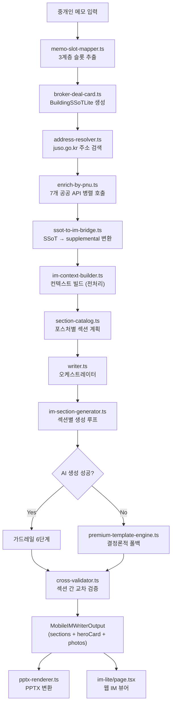

# Mobile IM Basic 섹션 아키텍처 총괄 (Architecture Overview)

> **문서 목적**: 모바일 투자설명서(IM) Basic의 **섹션 구성**, **생성 파이프라인**, 각 섹션별 **방법론**(공공 API, 로직, 프롬프트, 온톨로지 SSoT, 골든셋)을 상세히 기록한 기술 내부 감사 문서입니다.
> **감사 일시**: 2026-08-23 | **감사 범위**: `src/domain/building/mobile-im/` 전체 55개 파일 + PPTX 모듈 9개 파일

---

## 1. 전체 시스템 아키텍처 (End-to-End)



### 핵심 파일 인덱스

| 모듈 | 파일 | 줄 수 | 역할 |
|:---|:---|:---:|:---|
| **타입 정의** | [`types.ts`](file:///c:/Users/User/cre-dealcard/src/domain/building/mobile-im/types.ts) | 391 | 7섹션 타입, PhotoMeta, HeroCard, ExternalDataSnapshot |
| **섹션 카탈로그** | [`section-catalog.ts`](file:///c:/Users/User/cre-dealcard/src/domain/building/mobile-im/section-catalog.ts) | 57 | 5 posture × 7 섹션 매핑 |
| **오케스트레이터** | [`writer.ts`](file:///c:/Users/User/cre-dealcard/src/domain/building/mobile-im/writer.ts) | 234 | 메인 `generateMobileIM()` 함수 |
| **전처리** | [`im-context-builder.ts`](file:///c:/Users/User/cre-dealcard/src/domain/building/mobile-im/im-context-builder.ts) | 324 | SSoT 정규화, 가격 파싱, 할루시네이션 가드 |
| **섹션 생성기** | [`im-section-generator.ts`](file:///c:/Users/User/cre-dealcard/src/domain/building/mobile-im/im-section-generator.ts) | 465 | AI 생성 + 가드레일 + 폴백 |
| **프롬프트** | [`narrative-prompt.ts`](file:///c:/Users/User/cre-dealcard/src/domain/building/mobile-im/narrative-prompt.ts) | 344 | 시스템 프롬프트 코어 + 섹션 미션 + 렉시콘 |
| **포스처 오버레이** | [`posture-prompts.ts`](file:///c:/Users/User/cre-dealcard/src/domain/building/mobile-im/posture-prompts.ts) | 152 | 5 posture별 섹션 프롬프트 오버레이 |
| **골든셋 관리** | [`golden-im-manager.ts`](file:///c:/Users/User/cre-dealcard/src/domain/building/mobile-im/golden-im-manager.ts) | 386 | Few-shot 자동 진화 파이프라인 |
| **데이터 등급** | [`data-quality-badge.ts`](file:///c:/Users/User/cre-dealcard/src/domain/building/mobile-im/data-quality-badge.ts) | 201 | posture별 A/B/C/D 등급 산출 |
| **SSoT 브릿지** | [`ssot-to-im-bridge.ts`](file:///c:/Users/User/cre-dealcard/src/domain/building/mobile-im/ssot-to-im-bridge.ts) | 223 | 딜카드 SSoT → IM supplemental 변환 |
| **공공 API** | [`enrich-by-pnu.ts`](file:///c:/Users/User/cre-dealcard/src/lib/external/enrich-by-pnu.ts) | 310 | 7개 API 병렬 호출 코어 |
| **PPTX 렌더러** | [`pptx/pptx-renderer.ts`](file:///c:/Users/User/cre-dealcard/src/domain/building/mobile-im/pptx/pptx-renderer.ts) | — | PPTX 슬라이드 생성기 |
| **덱 시퀀서** | [`pptx/deck-sequencer.ts`](file:///c:/Users/User/cre-dealcard/src/domain/building/mobile-im/pptx/deck-sequencer.ts) | 232 | posture×grade×tier 기반 슬라이드 시퀀스 |
| **데이터 바인더** | [`pptx/data-binder.ts`](file:///c:/Users/User/cre-dealcard/src/domain/building/mobile-im/pptx/data-binder.ts) | — | 섹션 마크다운 → 슬라이드 데이터 매핑 |

---

## 2. 섹션 구성 (5 Posture × 7 Sections)

### 2.1 포스처별 섹션 매핑 매트릭스

| # | income (수익형) | development (개발형) | owner_occupied (사옥형) | operating (운영형) | trading (매매형) |
|:---:|:---|:---|:---|:---|:---|
| 1 | property_overview | property_overview | property_overview | property_overview | property_overview |
| 2 | location_access | location_access | location_access | location_access | location_access |
| 3 | **lease_status** | **site_analysis** | **occupancy_fit** | **operation_overview** | **market_position** |
| 4 | **income_analysis** | **development_feasibility** | **cost_comparison** | **gop_analysis** | **comparable_analysis** |
| 5 | risk_check | risk_check | risk_check | risk_check | risk_check |
| 6 | investment_thesis | investment_thesis | investment_thesis | investment_thesis | investment_thesis |
| 7 | next_steps | next_steps | next_steps | next_steps | next_steps |

> **규칙**: 섹션 1, 2, 5, 6, 7은 전 포스처 공통. 섹션 3, 4만 포스처에 따라 교체됩니다.

### 2.2 `suppress` / `emphasize` 규칙

| 포스처 | suppress (비노출) | emphasize (상세 프롬프트 × 2배 토큰) |
|:---|:---|:---|
| income | — | lease_status, income_analysis |
| development | lease_status, income_analysis | site_analysis, development_feasibility |
| owner_occupied | lease_status | occupancy_fit, cost_comparison |
| operating | lease_status | operation_overview, gop_analysis |
| trading | — | market_position, comparable_analysis |

> **소스**: [`section-catalog.ts`](file:///c:/Users/User/cre-dealcard/src/domain/building/mobile-im/section-catalog.ts) L15–51

---

## 3. 섹션별 생성 방법론 상세

→ 각 섹션의 상세 방법론은 개별 파일로 분리합니다:
- [01_property_overview.md](file:///c:/Users/User/cre-dealcard/docs/imsection/01_property_overview.md)
- [02_location_access.md](file:///c:/Users/User/cre-dealcard/docs/imsection/02_location_access.md)
- [03_income_sections.md](file:///c:/Users/User/cre-dealcard/docs/imsection/03_income_sections.md)
- [04_risk_thesis_next.md](file:///c:/Users/User/cre-dealcard/docs/imsection/04_risk_thesis_next.md)
- [05_data_pipeline.md](file:///c:/Users/User/cre-dealcard/docs/imsection/05_data_pipeline.md)
- [06_pptx_mapping.md](file:///c:/Users/User/cre-dealcard/docs/imsection/06_pptx_mapping.md)
- [07_guardrails_quality.md](file:///c:/Users/User/cre-dealcard/docs/imsection/07_guardrails_quality.md)

---

## 4. 생성 파이프라인 6단계 가드레일 요약

```
AI LLM 응답
  │
  ├─① 할루시네이션 탐지 (im-context-builder.ts)
  │     매매가·면적의 20배 이상/이하 수치 이상 감지
  │
  ├─② LLM-as-Judge (im-judge.ts)
  │     3.0점 미만 → 템플릿 폴백, 4.5점 이상 → Golden 후보 승격
  │
  ├─③ Deterministic Rent Roll 주입 (lease-adapter.ts)
  │     LLM 생성 테이블을 floor_leases 기반 정확 테이블로 교체
  │
  ├─④ 용어 정규화 (terminology-normalizer.ts)
  │     '캡레이트'→'연 순수익률(Cap Rate)', '네이밍 라이츠'→'사옥 단독 명칭 표기'
  │
  ├─⑤ Risk Boundary + CRE Quality Gate (guardrails.ts, cre-quality-gate.ts)
  │     투자유도·보장·과장 표현 제거, 수치 경계 체크
  │
  └─⑥ Disclosure Guard (guardrails.ts)
        면책 조항·출처 표기·PII 제거 최종 검사
```

> **소스**: [`im-section-generator.ts`](file:///c:/Users/User/cre-dealcard/src/domain/building/mobile-im/im-section-generator.ts) L82–464

---

## 5. SSoT (Single Source of Truth) 구조

### 5.1 BuildingSSoTLite 4축 정규화

```typescript
// im-context-builder.ts L27-69
{
  assetIdentity: {
    area_signal,    // "당산권역(당산역)"
    asset_type,     // "근린생활시설(메디컬빌딩)"
    price_band,     // "115억"
    size_signal,    // "연면적 436평"
    price_band_krw  // 11500000000
  },
  physicalFact: {
    size_signal,    // "연면적 436평"
    vacancy_signal, // "만실"
    total_area_sqm, // 1441.15
    current_use     // "제2종근린생활시설"
  },
  marketLocation: {
    location_analysis, // "당산역 도보 5분"
    address            // "서울특별시 영등포구 당산동5가 11-47"
  },
  buyerFit: {
    fit_summary,    // 핵심 투자 포인트 서사
    caution_summary, // 핵심 리스크 서사
    fit_points      // 3대 핵심 포인트 배열
  }
}
```

### 5.2 MobileIMSupplementalInput (브로커 보강 데이터)

| 필드 그룹 | 주요 필드 | 역할 |
|:---|:---|:---|
| **기본 재무** | `monthly_rent_total_krw`, `asking_price_manwon`, `total_deposit_manwon` | Cap Rate 산출 기반 |
| **층별 임대차** | `floor_leases[]` (FloorLeaseInput) | Rent Roll 결정론적 테이블 |
| **추가 금액** | `loan_amount_manwon`, `mgmt_fee_total_manwon` | 레버리지 수익률, NCF 계산 |
| **사진 v2** | `photos_v2[]` (PhotoMeta) | 17종 카테고리 + 캡션 + Hero 지정 |
| **포스처** | `investmentPosture`, `archetype_override` | 섹션 카탈로그 분기 |
| **물류 전용** | `logistics{}` | 천장고, 도크, 냉장 면적 등 |
| **비임대 수입** | `ancillary_incomes[]` | 통신장비, 주차, 간판 수입 |

> **소스**: [`types.ts`](file:///c:/Users/User/cre-dealcard/src/domain/building/mobile-im/types.ts) L159–225

---

## 6. 골든 레퍼런스 시스템

### 6.1 하드코딩 Golden IM 예시 (포스처별)

[`narrative-prompt.ts`](file:///c:/Users/User/cre-dealcard/src/domain/building/mobile-im/narrative-prompt.ts) L62–122에 5개 포스처별 Golden IM 예시가 정의되어 있습니다:

| 포스처 | 골든 예시 핵심 지표 |
|:---|:---|
| **income** | NOI, Cap Rate, 실투자금, 자기자본수익률, WALE, 땅값 비중 |
| **development** | 토지 평당가, 용적률/건폐율, 총 사업비, 개발 이익률, PF 조건 |
| **operating** | ADR, OCC, RevPAR, 연간 GOP, GOP 마진율, GOP Cap Rate |
| **owner_occupied** | 임차 대비 절감액, 자가전환 손익분기, 평당 점유비용 |
| **trading** | 평당 매매가, 시세 할인율, 목표 시세차익, HPR |

### 6.2 동적 Golden Set 자동 진화 (DB 기반)

[`golden-im-manager.ts`](file:///c:/Users/User/cre-dealcard/src/domain/building/mobile-im/golden-im-manager.ts) — Supabase `im_golden_sets` 테이블:

1. **자동 등록 조건**: Judge 점수 ≥ 3.5, 마크다운 ≥ 100자, confidence ≠ `needs_check`
2. **브로커 수정본 우선**: 편집된 최종본이 있으면 원본 대신 등록
3. **Few-shot 블록 생성**: `buildIMFewShotBlock(assetType, priceBand, sectionType)` — DB에서 유사 자산 유형·가격대의 승인된 Golden 예시를 검색하여 LLM 프롬프트에 주입
4. **자동 승격**: Judge 점수 ≥ 4.5 → `promoteToGoldenCandidate()` 호출

---

## 7. 공공 API 통합 (External Data Enrichment)

### 7.1 7개 API 병렬 호출 (`enrichBuildingDataCore`)

| # | API | 소스 파일 | 반환 데이터 | 환경변수 |
|:---:|:---|:---|:---|:---|
| 1 | 건축물대장 (표제부+총괄표제부) | `building-register-api.ts` | 연면적, 대지면적, 용적률, 건폐율, 층수, 주차, 승강기, 난방 | `BUILDING_REGISTER_KEY` |
| 2 | 공시지가 | `land-price-api.ts` | ㎡당 공시지가, 기준연도 | `LAND_PRICE_KEY` |
| 3 | 토지이용계획 | `land-use-api.ts` | 용도지역, 중첩지역, 법정 건폐율·용적률 상한 | `LAND_USE_KEY` |
| 4 | 실거래가 비교사례 | `real-transaction-api.ts` | 인근 평당 거래가, 주소, 거래년월 | `REAL_TRANSACTION_KEY` |
| 5 | 카카오맵 POI | `kakao-map-api.ts` | 최근접 역(거리·도보분), 주변 POI(카페·식당·편의점 수) | `KAKAO_REST_API_KEY` |
| 6 | 등기정보광장 | `registry-api.ts` | 소유권, 근저당, 가압류 등기 사항 | `REGISTRY_API_KEY` |
| 7 | 상권정보(SEMAS) | `semas-commercial-api.ts` | 상권 유형, 업종 밀도, 유동인구, 매출 추정 | `SEMAS_KEY` |

### 7.2 캐시 전략

- **Supabase `external_data_cache` 테이블**: `buildingSsotLiteId` 기준 캐싱
- **TTL**: 30일 기본, API별 개별 TTL 설정 가능 (`CACHE_TTL_BY_SOURCE`)
- **Stale 체크**: 캐시 존재 시 오래된 소스만 선별적으로 재호출

### 7.3 카카오 지오코딩 + Static Map

- **지오코딩**: `geocodeAddress()` → `dapi.kakao.com/v2/local/search/address.json`
- **Static Map**: `buildKakaoStaticMapUrl()` → 1280×960 마커 포함 지도 이미지 URL

> **소스**: [`enrich-by-pnu.ts`](file:///c:/Users/User/cre-dealcard/src/lib/external/enrich-by-pnu.ts) L22–98

---

## 8. 데이터 등급 시스템 (Data Quality Badge)

### 8.1 포스처별 A등급 기준

| 포스처 | A등급 조건 (verified) | 핵심 데이터 |
|:---|:---|:---|
| **income** | 주소 ✅ + 공공데이터 ✅ + 월임대료 ✅ + 매매가 ✅ | 재무 중심 |
| **development** | 주소 ✅ + 공공데이터 ✅ + 대지면적 ✅ + 용도지역 ✅ + 매매가 ✅ | 토지 중심 |
| **owner_occupied** | 주소 ✅ + 공공데이터 ✅ + 매매가 ✅ + 연면적 ✅ | 건물 규모 중심 |
| **operating** | 주소 ✅ + 공공데이터 ✅ + 월매출/수입 ✅ + 매매가 ✅ | 운영 수익 중심 |
| **trading** | 주소 ✅ + 공공데이터 ✅ + 매매가 ✅ | 비교사례 중심 |

### 8.2 등급→Tier 게이트

| 등급 | Basic IM | Pro IM |
|:---:|:---:|:---:|
| A (verified) | ✅ | ✅ |
| B (partial) | ✅ | ❌ |
| C (reference) | ✅ | ❌ |
| D (draft) | ⚠️ (최소 3슬라이드) | ❌ (차단) |

> **소스**: [`data-quality-badge.ts`](file:///c:/Users/User/cre-dealcard/src/domain/building/mobile-im/data-quality-badge.ts) L1–201

---

## 9. 프롬프트 아키텍처

### 9.1 프롬프트 조립 구조

```
시스템 프롬프트 (효과적 적층)
├── MOBILE_IM_NARRATIVE_CORE (코어: 13개 작성 규칙)
├── 포스처별 Golden IM 예시 (narrative-prompt.ts)
├── 포스처별 전문 용어집 (POSTURE_LEXICONS)
├── CrePromptRegistry 섹션별 커스텀 프롬프트 (있을 경우)
└── getPosturePromptOverlay() (posture-prompts.ts)

유저 프롬프트 (buildNarrativeUserPrompt)
├── [1] 섹션 작성 미션 (sectionMission[sectionType])
├── [2] SSoT 데이터 (JSON)
├── [3] 공공데이터 & 마켓 현황 (JSON 또는 부재 경고)
├── [4] 추가 수집 데이터 (supplemental JSON)
├── [5] 사전 계산된 재무 마크다운 (financialsMarkdown)
├── [6] 이전 섹션 맥락 (keyFacts + numericalAnchors)
├── [7] RAG 컨텍스트 (시장 조항/법률)
├── [8] 섹션 맞춤 퓨샷 예시 (fewShotBlock)
└── [9] 작성 요청
```

### 9.2 코어 작성 규칙 13개 (`MOBILE_IM_NARRATIVE_CORE`)

| # | 규칙 | 핵심 내용 |
|:---:|:---|:---|
| 1 | 글자 수 | 각 섹션 **2~4문장** 자연스러운 줄글 |
| 2 | 어조 | 전문적·객관적 + 자산 가치 **자신감 있게 강조** |
| 3 | 근거 | SSoT·공공데이터 수치에 정확히 기초, 창작 금지 |
| 4 | 금융 경계 | "무조건", "100% 보장" 등 투자유도 표현 금지 |
| 5 | 마크다운 | 줄글 위주, 핵심 키워드 **볼드** |
| 6 | 언어 | 반드시 한국어 |
| 7 | 테이블 | 데이터 섹션은 마크다운 테이블 필수 포함 |
| 8 | 데이터 경계 | 없는 정보는 "실사 단계에서 확인 필요" 표기 |
| 9 | 출처 표기 | "건축물대장 기준", "(AI 추정)" 등 병기 |
| 10 | 교차 검증 | 이전 섹션 수치와 일관성 유지 |
| 11 | 전문 용어 | 한글 먼저 + 괄호 내 영문 약어 |
| 12 | 결론 우선 | 첫 문장은 **So What?**으로 시작 |
| 13 | 금액 표기 | 억 단위: "약 75억 원", 만원 단위: "월 1,200만 원" |

### 9.3 핵심 금지 사항

> ❌ **페르소나 직접 지칭**: '60대 자산가를 위한', '법인 대표 맞춤', '초보 투자자용' 등
> ❌ **외래어 직역**: '네이밍 라이츠' → ✅ '사옥 단독 명칭 표기(간판 설치권)'
> ❌ **수동적 표현**: "검토할 수 있습니다" → ✅ "~입니다", "~됩니다"

> **소스**: [`narrative-prompt.ts`](file:///c:/Users/User/cre-dealcard/src/domain/building/mobile-im/narrative-prompt.ts) L128–156

---

## 10. PPTX 매핑 (Basic Tier)

### 10.1 Basic 슬라이드 시퀀스 (income 기준, 10장)

| # | Archetype | Kicker | Title | Data Key | 데이터 소스 |
|:---:|:---:|:---|:---|:---|:---|
| 1 | A01 | BASIC IM | 표지 | cover | SSoT 타이틀, 중개사 정보, 사진 |
| 2 | A14 | Gallery | 건물 사진 | gallery | photos_v2 (사진 있을 때만) |
| 3 | A02 | Summary | 핵심요약 | summary | HeroCard + 3대 핵심 포인트 |
| 4 | A06 | Location | 입지 | location | location_access 섹션 + 카카오맵 |
| 5 | A04 | Building | 물건 개요 | building | property_overview 섹션 |
| 6 | A03 | Rent Roll | 임대차 현황 | rentRoll | lease_status 섹션 |
| 7 | A05 | Profit | 수익성 분석 | profit | income_analysis 섹션 |
| 8 | A07 | Risk | 리스크 | risk | risk_check 섹션 |
| 9 | A15 | Thesis | 종합 가치 제안 | thesis | investment_thesis 섹션 |
| 10 | A09 | Process | 향후 매각 일정 | process | next_steps 섹션 |
| — | A10 | Disclaimer | 표기 기준 및 면책 | closing | 데이터 출처 5단계 + 면책 |

### 10.2 포스처별 슬라이드 교체 (섹션 5~7)

| 포스처 | 슬라이드 5 | 슬라이드 6 | 슬라이드 7 |
|:---|:---|:---|:---|
| income | A04 Building 물건 개요 | A03 Rent Roll 렌트롤 | A05 Profit 수익성 |
| development | A04 Building 물건 + A04 Land 토지상세 | A05 Feasibility 개발 개요 | — |
| owner_occupied | A04 Building 물건 + A04 Plan 사용계획 | A08 Vs Lease 자가비교 | — |
| operating | A04 Building 물건 | A13 KPI 운영지표 | A05 Revenue 매출 |
| trading | A04 Building 물건 + A04 Market 시장 포지션 | A03 Comps 비교사례 | — |

> **소스**: [`deck-sequencer.ts`](file:///c:/Users/User/cre-dealcard/src/domain/building/mobile-im/pptx/deck-sequencer.ts) L50–132

---

## 부록: 파일별 줄 수 및 바이트 통계 (상위 20)

| 파일 | 바이트 | 역할 |
|:---|---:|:---|
| `pptx/data-binder.ts` | 61,438 | 섹션→슬라이드 데이터 매핑 |
| `pptx/imlib.ts` | 39,251 | PPTX XML 생성 라이브러리 |
| `premium-template-engine.ts` | 35,778 | AI 실패 시 결정론적 폴백 템플릿 |
| `financials.ts` | 29,889 | Cap Rate, NOI, DCF 등 재무 계산 |
| `cross-validator.ts` | 26,555 | 섹션 간 수치 교차 검증 |
| `pptx/pptx-renderer.ts` | 23,942 | PPTX 렌더링 오케스트레이터 |
| `narrative-prompt.ts` | 21,402 | AI 프롬프트 시스템 코어 |
| `im-section-generator.ts` | 17,418 | 섹션별 생성 + 가드레일 |
| `guardrails.ts` | 17,526 | Risk Boundary + Disclosure Guard |
| `terminology-normalizer.ts` | 16,857 | CRE 용어 정규화 엔진 |
