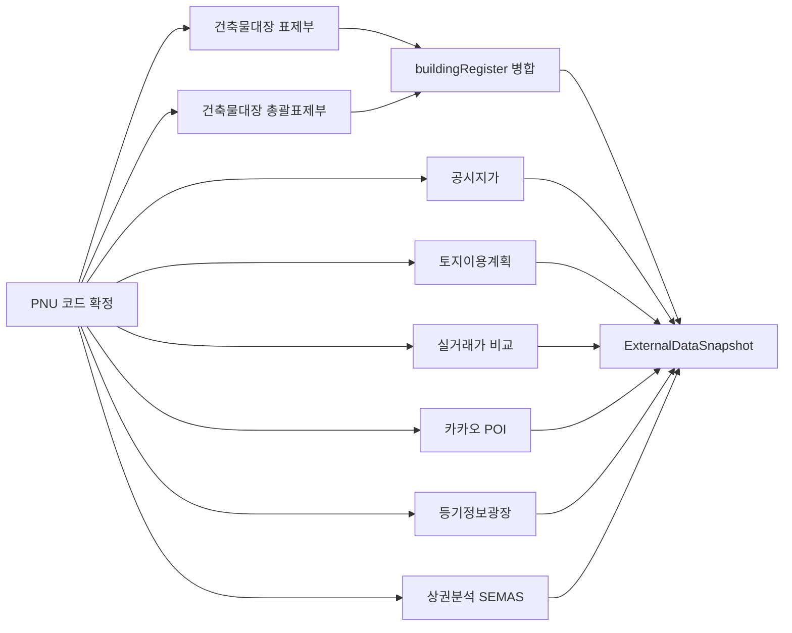

# 데이터 파이프라인: 메모 → SSoT → 공공 API → IM 생성

> **범위**: 중개인 메모 입력 → 슬롯 추출 → SSoT 생성 → 주소 확정 → 공공 API 조회 → IM 생성 입력 데이터 조립

---

## 1. 메모 슬롯 추출 (`memo-slot-mapper.ts`)

[`memo-slot-mapper.ts`](file:///c:/Users/User/cre-dealcard/src/domain/building/memo-slot-mapper.ts) — 3계층 계층적 추출:

### 1.1 3단계 추출 구조

| 단계 | 메모 길이 | 추출 대상 | 방법 |
|:---:|:---|:---|:---|
| **최소** | 한 줄 | 간단 키워드 | 정규식 패턴 매칭 |
| **표준** | 3~6줄 | 매매가, 보증금, 월세, 면적, 층수 | 정규식 + AI 파서 |
| **충분** | 전문 실사 메모 | 대지면적, 용적률, 법적 사항 | AI 전문 분석 |

### 1.2 AI 프롬프트 (`prompt_memo_parser_v1`)

[`broker-deal-card.ts`](file:///c:/Users/User/cre-dealcard/src/ai/prompts/broker-deal-card.ts) — L정의:

```
메모에서 아래 슬롯을 JSON 형태로 추출하세요:
- askingPriceKrw: 매매 희망가 (원)
- totalDepositKrw: 보증금 합계 (원)
- monthlyRentKrw: 월 임대료 합계 (원)
- totalFloorAreaPyung: 연면적 (평)
- landAreaPyung: 대지면적 (평)
- floorsAboveGround: 지상 층수
- floorsUnderGround: 지하 층수
- farPct: 용적률 (%)
- bcrPct: 건폐율 (%)
```

### 1.3 추출 결과 예시 (당산동 메모)

```json
{
  "askingPriceKrw": 11500000000,
  "totalDepositKrw": 290000000,
  "totalFloorAreaPyung": 436,
  "floorsAboveGround": 5,
  "floorsUnderGround": 1,
  "landAreaPyung": 153.31,
  "farPct": 400
}
```

---

## 2. BuildingSSoTLite 생성 (`broker-deal-card.ts`)

[`broker-deal-card.ts`](file:///c:/Users/User/cre-dealcard/src/domain/building/broker-deal-card.ts) — 427줄:

### 2.1 `brokerDealCardFromMemo()` 파이프라인

```
메모 텍스트
  → extractSlotsFromMemo() (슬롯 추출)
  → prompt_building_mini_truth_v1 (SSoT 생성 AI 프롬프트)
  → BuildingSSoTLite 레코드 생성
  → layers 구조 (location, financial, lease_summary 등) 조립
  → Supabase building_ssot_lite 테이블 upsert
```

### 2.2 SSoT layers 구조

| 레이어 | 필드 예시 | 용도 |
|:---|:---|:---|
| `layers.location` | `address`, `pnu`, `neighborhood` | 주소·위치 |
| `layers.financial` | `askingPriceKrw`, `capRate` | 재무 |
| `layers.lease_summary` | `monthly_rent_total_krw`, `total_deposit_manwon`, `floor_leases[]` | 임대차 |
| `layers.physical` | `totalFloorAreaPyung`, `landAreaPyung`, `floorsAbove` | 물리적 스펙 |

---

## 3. 주소 확정 (`address-resolver.ts`)

[`address-resolver.ts`](file:///c:/Users/User/cre-dealcard/src/domain/verification/address-resolver.ts) — 346줄:

### 3.1 주소 검색 3단계

| 순서 | API | 환경변수 | 반환 |
|:---:|:---|:---|:---|
| **1순위** | juso.go.kr 주소검색 | `JUSO_CONFIRM_KEY` | 도로명주소, 지번, PNU, 시군구코드, 법정동코드, 본번, 부번 |
| **2순위** | 카카오 지오코딩 | `KAKAO_REST_API_KEY` | lat, lng, 도로명, 지번 |
| **3순위** | 정규식 패턴 폴백 | — | 서울/경기 등 시도 추출 |

### 3.2 PNU 코드 구조

```
PNU = 시군구코드(5자리) + 법정동코드(5자리) + 대지구분(1자리) + 본번(4자리) + 부번(4자리)
예: 1156011300 1 0011 0047 → 서울시 영등포구 당산동5가 11-47
```

### 3.3 `resolveAddressToComponents()` 출력

```typescript
interface ResolvedAddress {
  sigunguCd: string;    // "11560"
  bjdongCd: string;     // "11300"
  bun: string;          // "0011"
  ji: string;           // "0047"
  pnu: string;          // "1156011300100110047"
  lat: number;          // 37.534...
  lng: number;          // 126.902...
  roadAddress?: string; // "서울특별시 영등포구 당산로 15"
}
```

---

## 4. 공공 API 병렬 호출 (`enrich-by-pnu.ts`)

[`enrich-by-pnu.ts`](file:///c:/Users/User/cre-dealcard/src/lib/external/enrich-by-pnu.ts) — `enrichBuildingDataCore()`:

### 4.1 API 호출 흐름



### 4.2 API별 상세

| API | 엔드포인트 | 입력 | 출력 |
|:---|:---|:---|:---|
| 건축물대장 표제부 | `apis.data.go.kr/1613000/BldRgstService` | sigunguCd, bjdongCd, bun, ji | 연면적, 용적률, 건폐율, 준공일, 구조 |
| 건축물대장 총괄표제부 | 동일 API (recapTotalInfo) | 동일 | 승강기, 주차, 난방, 건축면적 |
| 공시지가 | `apis.data.go.kr/1611000/nsdi/IndvdLandPriceService` | pnu | ㎡당 공시지가, 기준연도 |
| 토지이용계획 | `apis.data.go.kr/1611000/nsdi/LandUsePlanService` | pnu | 용도지역, 법정 건폐율·용적률 상한 |
| 실거래가 | `apis.data.go.kr/1613000/RTMSDataSvcSHRent` | sigunguCd | 인근 거래 사례 (평당가) |
| 카카오 POI | `dapi.kakao.com/v2/local/search/category.json` | lat, lng | 역·카페·식당·편의점 수, 최근접 역 |
| 등기정보광장 | `registryinfo.go.kr` | 주소, pnu | 소유권, 근저당, 가압류 |
| 상권분석 | SEMAS API | pnu | 상권 유형, 업종, 유동인구 |

### 4.3 캐시 아키텍처

```sql
-- Supabase external_data_cache 테이블
CREATE TABLE external_data_cache (
  building_ssot_lite_id UUID PRIMARY KEY,
  building_register JSONB,
  official_land_price JSONB,
  land_use_plan JSONB,
  comparable_transactions JSONB,
  location_poi JSONB,
  registry_data JSONB,
  commercial_district JSONB,
  map_image_url TEXT,
  enriched_at TIMESTAMPTZ,
  source_freshness JSONB  -- 소스별 마지막 갱신 시각
);
```

---

## 5. SSoT → IM 브릿지 (`ssot-to-im-bridge.ts`)

[`ssot-to-im-bridge.ts`](file:///c:/Users/User/cre-dealcard/src/domain/building/mobile-im/ssot-to-im-bridge.ts) — 223줄:

### 5.1 변환 흐름

```
DealCardToIMBridgeInput {
  ssot (BuildingSSoTLite layers)
  teaserView (블라인드 티저 데이터)
  blindTeaser (AI 생성 티저)
}
  ↓ bridgeDealCardToIM()
DealCardToIMBridgeOutput {
  supplemental (MobileIMSupplementalInput)
  prefillData (UI 프리필 데이터)
  currentGrade (현재 등급)
  gradeUpItems (등급 상향 필요 항목)
}
```

### 5.2 핵심 매핑

| SSoT 소스 | IM supplemental 대상 |
|:---|:---|
| `layers.location.address` | `resolved_address` |
| `layers.lease_summary.monthly_rent_total_krw` | `monthly_rent_total_krw` |
| `layers.lease_summary.total_deposit_manwon` | `total_deposit_manwon` |
| `layers.lease_summary.floor_leases[]` | `floor_leases[]` |
| `layers.lease_summary.loan_amount_manwon` | `loan_amount_manwon` |
| `layers.lease_summary.asking_price_manwon` | `asking_price_manwon` |
| `ssot.vacancy_signal` | `vacancy_pct` (파싱) |
| `ssot.ancillary_incomes[]` | `ancillary_incomes[]` (직접 전달) |

---

## 6. IM 컨텍스트 빌드 (`im-context-builder.ts`)

[`im-context-builder.ts`](file:///c:/Users/User/cre-dealcard/src/domain/building/mobile-im/im-context-builder.ts) — 324줄:

### 6.1 `buildIMContext()` 출력 (`IMGenerationContext`)

| 필드 | 역할 |
|:---|:---|
| `assetIdentity` | 4축 정규화된 자산 식별자 |
| `physicalFact` | 물리적 사실 (면적, 공실, 용도) |
| `marketLocation` | 시장·입지 (주소, 분석) |
| `buyerFit` | 매수 적합성 (서사, 리스크) |
| `purchasePriceKrw` | 매매가 (원, `parsePriceBandKrw` 변환) |
| `totalAreaSqm` | 연면적 (㎡) |
| `vacancyPct` | 공실률 (%) |
| `sectionPlan` | 포스처별 섹션 계획 (section-catalog) |
| `archetype` | 아키타입 코드 (suggestArchetype) |
| `sysPromptText` | 포스처별 시스템 프롬프트 |
| `provenanceMap` | 데이터 출처 맵 |
| `ragCtx` | RAG 컨텍스트 |
| `cachedFinancials` | 사전 계산 재무 (있을 경우) |
| `valueAddMarkdown` | 밸류업 시나리오 마크다운 |
| `sectionCtx` | 섹션 간 맥락 전파용 |
| `generationId` | 생성 추적 ID |
