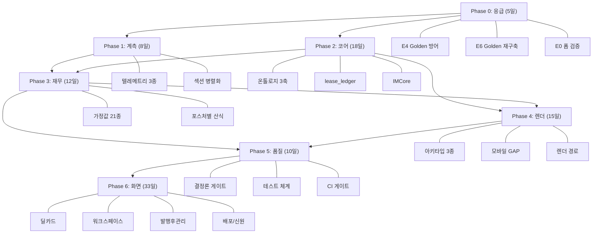

# CREDEAL IM 시스템 고도화 — 멀티페이스 구현 계획

> 작성일: 2026-08-23
> 근거: `docs/imup/` 83개 명세 문서 정밀 분석 종합
> 총 공수: **101일** (15단계), 5개월 이관 로드맵
> 최상위 정본: [IM_SYSTEM_SSOT.md](file:///c:/Users/User/cre-dealcard/docs/imup/IM_SYSTEM_SSOT.md)

---

## 목차

1. [현행 시스템 진단 요약](#1-현행-시스템-진단-요약)
2. [아키텍처 전환 핵심 원칙](#2-아키텍처-전환-핵심-원칙)
3. [페이스 0: 응급 조치 (5.0일)](#페이스-0-응급-조치-50일)
4. [페이스 1: 계측 기반 구축 (8.0일)](#페이스-1-계측-기반-구축-80일)
5. [페이스 2: 코어 아키텍처 전환 (18.0일)](#페이스-2-코어-아키텍처-전환-180일)
6. [페이스 3: 재무 엔진 재설계 (12.0일)](#페이스-3-재무-엔진-재설계-120일)
7. [페이스 4: 렌더링 파이프라인 통합 (15.0일)](#페이스-4-렌더링-파이프라인-통합-150일)
8. [페이스 5: 품질 게이트 & 테스트 (10.0일)](#페이스-5-품질-게이트--테스트-100일)
9. [페이스 6: 화면 확장 (33.0일)](#페이스-6-화면-확장-330일)
10. [의존성 그래프](#의존성-그래프)
11. [롤백 & 안전장치](#롤백--안전장치)
12. [검증 계획](#검증-계획)

---

## 1. 현행 시스템 진단 요약

### DB 실측 데이터 (2026-08-23 기준)

| 항목 | 현행 값 | 목표 |
|---|---|---|
| IM 생성 평균 소요 | **104.3초** (p95: 148.9초) | **≤70초** (p95 ≤100초) |
| 생성 성공률 | **59.1%** (26/44) | **≥95%** |
| 실패 원인 | 입력 검증 미비 (14/18건) | E0 폼 사전 검증으로 0건 |
| Golden Set 오염률 | **93.9%** (154/164건) | **0%** (S/A급 8건 재구축) |
| RAG 인덱스 | **테이블 미존재** (미작동) | 정상 구축 |
| 비용 추적 | **테이블 미존재** | `im_generation_metrics` 신설 |
| 포스처 분포 | income 100% (62건) | 5대 포스처 실운영 |
| 실거래가 커버리지 | 20억 미만 하드코딩 제외 | 커버리지 확장 |

### 핵심 구조적 문제 (명세 문서 기반)

| # | 문제 | 근거 문서 |
|---|---|---|
| 1 | 마크다운 `split('|')` 재파싱 → PPTX 데이터 손실 | [README §1.1](file:///c:/Users/User/cre-dealcard/docs/imup/README.md), [SSOT §8.2](file:///c:/Users/User/cre-dealcard/docs/imup/IM_SYSTEM_SSOT.md) |
| 2 | 7섹션 순차 LLM 호출 → 104초 병목 | [GENERATION_PERF_SPEC §2.2](file:///c:/Users/User/cre-dealcard/docs/imup/01_spec_new/GENERATION_PERF_SPEC.md) |
| 3 | NOI 0.85 계수 등 근거 없는 하드코딩 6종 | [ASSUMPTION_REGISTRY §5](file:///c:/Users/User/cre-dealcard/docs/imup/01_spec_new/ASSUMPTION_REGISTRY.md) |
| 4 | `lease_spaces` + `lease_units` 이중 테이블 | [SSOT §4.1](file:///c:/Users/User/cre-dealcard/docs/imup/IM_SYSTEM_SSOT.md) |
| 5 | Basic/Pro 이원화 → 4벌 분리 생성 | [IM_UNIFIED_ARCHITECTURE §2.3](file:///c:/Users/User/cre-dealcard/docs/imup/07_reference/IM_UNIFIED_ARCHITECTURE.md) |
| 6 | 온톨로지 단일 `AssetClass` → 3축 분리 필요 | [ONTOLOGY_V0.4 §1](file:///c:/Users/User/cre-dealcard/docs/imup/02_ontology/ONTOLOGY_V0.4_SPEC.md) |

---

## 2. 아키텍처 전환 핵심 원칙

[IM_SYSTEM_SSOT.md](file:///c:/Users/User/cre-dealcard/docs/imup/IM_SYSTEM_SSOT.md) 및 [README.md](file:///c:/Users/User/cre-dealcard/docs/imup/README.md)에서 규정한 불변 원칙:

> [!IMPORTANT]
> 1. **마크다운을 경유하지 않습니다** — IMCore 단일 자료구조에서 PPTX/모바일 직결 렌더링
> 2. **결손을 숨기지 않습니다** — 확인 안 된 항목은 DeficiencyLedger로 이관하여 명시
> 3. **가정을 숨기지 않습니다** — Assumption의 basis(근거)를 9pt 이상 노출
> 4. **엑셀-DB-TS 3계층 동시 변경** — 타입 불일치 원천 차단
> 5. **21개 출시 불변조건** — 모든 릴리스에서 CI 게이트 통과 필수

---

## 페이스 0: 응급 조치 (5.0일)

> **목표**: 현행 시스템의 즉시 위험 3건을 72시간 내 해소

### 0-1. Golden Set 오염 차단 (E4 파이프라인) — 0.5일

**근거**: [GOLDEN_CLEANUP_GUIDE §4.1](file:///c:/Users/User/cre-dealcard/docs/imup/01_spec_new/GOLDEN_CLEANUP_GUIDE.md)

| 작업 | 대상 파일 | 변경 내용 |
|---|---|---|
| `promoteGolden` 핸들러 정제 삽입 | `src/domain/building/mobile-im/` 내 승격 경로 | `stripMarkdown(sanitizePersona(cand.markdown))` 강제 실행 |
| 정규식 `lastIndex` 초기화 | 정제 함수 내부 | `/g` 플래그 사용 시 `lastIndex = 0` 강제 |
| `im_golden_sets` 백업 컬럼 추가 | DB 마이그레이션 | `markdown_raw`, `is_active`, `grade` 컬럼 신설 |

### 0-2. Golden Set 재구축 (E6) — 2.0일

**근거**: [GOLDEN_REBUILD_SPEC §6](file:///c:/Users/User/cre-dealcard/docs/imup/01_spec_new/GOLDEN_REBUILD_SPEC.md)

| 작업 | 내용 |
|---|---|
| 기존 164건 격리 | `grade = 'C'` 마킹, 퓨샷 조회에서 `grade IN ('S','A')` 조건 추가 |
| 신규 Golden 8건 적재 | G01~G08 ([05_data/golden/](file:///c:/Users/User/cre-dealcard/docs/imup/05_data/golden/)) 기반 S/A급 데이터 |
| 인접 밴드 매칭 제한 | `adjacentBands()` 헬퍼 — 타깃 PriceBand ±1단계만 허용 |
| 결손 보존 원칙 | 용적률 미기재 등 원본 결손 상태 그대로 주입 |

### 0-3. E0 폼 사전 검증 — 2.5일

**근거**: [SSOT §3.0](file:///c:/Users/User/cre-dealcard/docs/imup/IM_SYSTEM_SSOT.md), [MOBILE_GAP_SPEC §2.3](file:///c:/Users/User/cre-dealcard/docs/imup/01_spec_new/MOBILE_GAP_SPEC.md)

| 작업 | 대상 파일 | 변경 내용 |
|---|---|---|
| 포스처별 필수값 검증 | 프론트엔드 입력 폼 | 매각 희망가/월 임대료 미입력 시 제출 버튼 비활성 (`canSubmit`) |
| 서버 게이트 이중 검증 | `/api/im/validate` 엔드포인트 | [API_TYPE_CONTRACT §8.2](file:///c:/Users/User/cre-dealcard/docs/imup/01_spec_new/API_TYPE_CONTRACT.md) |
| 즉시 피드백 UI | 입력 폼 컴포넌트 | 2분 대기 없이 즉각적 오류 표시 |

> **페이스 0 완료 기준**: 입력 실패율 0%, Golden 오염 신규 유입 0건

---

## 페이스 1: 계측 기반 구축 (8.0일)

> **목표**: 개선 효과를 측정할 텔레메트리 인프라 확보 + 생성 시간 40% 단축

### 1-1. 텔레메트리 3종 테이블 신설 — 3.0일

**근거**: [TELEMETRY_SPEC §1](file:///c:/Users/User/cre-dealcard/docs/imup/01_spec_new/TELEMETRY_SPEC.md)

| 테이블 | 용도 |
|---|---|
| `im_generation_metrics` | 생성 결과 4분할 집계 (`completed` / `intended_block` / `input_missing` / `system_error`) |
| `im_edit_events` | 중개인 수동 수정 `before_md` / `after_md` 기록 (개인정보 제외) |
| `im_public_api_log` | 외부 API 호출 성공률/지연 시간 |

**추가 구현**:
- `classifyOutcome()` 함수 — `instanceof` 패턴 매칭으로 에러 4분할
- `withStage()` 래퍼 — LLM/API/Judge 구간별 Latency 분리 측정
- `cost-tracker.ts` → `im_generation_metrics` 테이블 대상 변경

### 1-2. 섹션 병렬화 — 5.0일

**근거**: [GENERATION_PERF_SPEC §2.2](file:///c:/Users/User/cre-dealcard/docs/imup/01_spec_new/GENERATION_PERF_SPEC.md)

```
기존: S1 → S2 → S3 → S4 → S5 → S6 → S7  (순차 14회 LLM, ~104초)
                    ↓
신규: ┌─ S1(개요) ──────┐
      │  S2(입지)       │
      │  S3(임대현황)   │ Stage 1 (병렬)
      │  S4(수익분석)   │
      └─────────────────┘
           ↓ numericalAnchors 전파
      ┌─ S5(리스크) ────┐
      │  S6(투자논거)   │ Stage 2 (병렬)
      └─────────────────┘
           ↓
      S7(진행절차)        Stage 3 (순차)
```

| 작업 | 대상 파일 | 변경 내용 |
|---|---|---|
| `generateSectionsStaged()` 신설 | `writer.ts` | 의존성 그래프 기반 위상 정렬 → 4단계 실행 |
| `mergeAnchors()` 함수 | 신규 | 마크다운 전문이 아닌 `NumericalAnchors` 데이터만 전파 |
| `Promise.allSettled` 부분 실패 | `writer.ts` | 실패 섹션 → 폴백 템플릿 렌더 |
| 롤백 플래그 | `.env` | `IM_SECTION_CONCURRENCY=1` → 즉시 순차 모드 복원 |

> **목표**: 평균 104.3초 → **≤63초**, p95 148.9초 → **≤100초**

---

## 페이스 2: 코어 아키텍처 전환 (18.0일)

> **목표**: 3축 온톨로지, 단일 렌트롤 원장, IMCore 자료구조 확립

### 2-1. 온톨로지 v0.4 3축 모델 적용 — 5.0일

**근거**: [ONTOLOGY_V0.4_SPEC §1](file:///c:/Users/User/cre-dealcard/docs/imup/02_ontology/ONTOLOGY_V0.4_SPEC.md)

```
기존: AssetClass (단일 분류)
       ↓
신규: buildingUse (법정 용도, 29종)
      × assetType (시장 유형, 17종)
      × investmentPosture (투자 관점, 5종)
```

| 작업 | 내용 |
|---|---|
| 3축 타입 정의 | `src/types/ontology.ts` — [CATALOG_ASSET_TYPES](file:///c:/Users/User/cre-dealcard/docs/imup/02_ontology/CATALOG_ASSET_TYPES.md) 기반 |
| 조합 제약 매트릭스 | 불가능한 조합 원천 차단 (§4 MATRIX) |
| 임대차 분기 | T-C(상가) / T-R(주택) 판정 — 대항력·갱신요구권 분리 |
| Lexicon 엔진 | [CATALOG_LEXICON](file:///c:/Users/User/cre-dealcard/docs/imup/02_ontology/CATALOG_LEXICON.md) — canonical/proLabel/b2cLabel/alias 42항목 |

### 2-2. `lease_ledger` 단일 원장 통합 — 5.0일

**근거**: [SSOT §4.1](file:///c:/Users/User/cre-dealcard/docs/imup/IM_SYSTEM_SSOT.md)

| 작업 | 내용 |
|---|---|
| `lease_ledger` 테이블 신설 | `lease_spaces` + `lease_units` 통합, 누락 필드(적용법령/최초계약일/갱신요구권) 추가 |
| 구 테이블 보존 | DROP하지 않고 읽기 플래그 유지 (2분기 이상) |
| 마이그레이션 스크립트 | [MIGRATION_RUNBOOK §2.6](file:///c:/Users/User/cre-dealcard/docs/imup/01_spec_new/MIGRATION_RUNBOOK.md) 절차 준수 |
| 렌트롤 v1.2 엑셀 양식 | `CREDEAL_렌트롤_표준양식_v1.2.xlsx` 적용 |

### 2-3. IMCore 단일 자료구조 — 5.0일

**근거**: [IM_UNIFIED_ARCHITECTURE §2.3](file:///c:/Users/User/cre-dealcard/docs/imup/07_reference/IM_UNIFIED_ARCHITECTURE.md)

```
기존: Basic PPTX ──┐
      Pro PPTX   ──┤──  4벌 분리 생성
      모바일 Basic ─┤
      모바일 Pro  ──┘

신규: IMCore (단일) → applyMask('public') → 모바일 티저
                    → applyMask('full')   → PPTX 전문
```

| 작업 | 대상 파일 | 변경 내용 |
|---|---|---|
| `IMCore` 인터페이스 정의 | `src/types/im-core.ts` (신규) | 섹션별 구조화 데이터 + numericalAnchors |
| `applyMask()` 함수 | `src/domain/building/mobile-im/render/` (신규) | `public`/`full` 레벨 노출 통제 |
| 마크다운 파싱 폐지 | `data-binder.ts` | `split('|')` 재파싱 로직 제거 → IMCore 직결 |
| DeficiencyLedger | `src/domain/building/mobile-im/deficiency-ledger.ts` (신규) | 결손 항목 자동 이관 |

### 2-4. API/타입 계약 적용 — 3.0일

**근거**: [API_TYPE_CONTRACT §3.2](file:///c:/Users/User/cre-dealcard/docs/imup/01_spec_new/API_TYPE_CONTRACT.md)

| 작업 | 내용 |
|---|---|
| 3중 매핑표 적용 | 엑셀 15개 입력 필드 ↔ DB 컬럼 ↔ TypeScript 타입 1:1 고정 |
| 6개 파생값 분리 | DB에 저장하지 않고 런타임 계산만 허용 |
| 포스처 기본값 제거 | `posture` 필드 기본값 삭제 → 사용자 명시 선택 강제 |
| `CapRateBasis` 7종 정의 | 0.85 계수 단일 산식 폐기 → `YieldValue` 객체 반환 |

---

## 페이스 3: 재무 엔진 재설계 (12.0일)

> **목표**: 하드코딩 상수 전면 폐기, 가정값 레지스트리 외재화, 포스처별 산식 분기

### 3-1. 가정값 레지스트리 — 5.0일

**근거**: [ASSUMPTION_REGISTRY](file:///c:/Users/User/cre-dealcard/docs/imup/01_spec_new/ASSUMPTION_REGISTRY.md)

| 유형 | 폐기 상수 | 대체 |
|---|---|---|
| 🔴 폐기 | NOI 0.85 계수 | **완전 삭제** — 입력값 기반 직접 계산 |
| 🔴 폐기 | 개발형 공사비 800만/평 | **완전 삭제** — 사용자 입력 필수 |
| 🔴 폐기 | 300억 초과 comps 상한 | `manualComps` 필수로 전환 |
| 🔴 폐기 | 호텔 Opex 35% | **완전 삭제** — 실데이터 필수 |
| 🔴 폐기 | GOP 마진 35% | **완전 삭제** |
| 🔴 폐기 | 용적률 기본값 400% | **완전 삭제** — 법정 조회 실패 시 null 반환 |

**`Assumption<T>` 제네릭 레지스트리** 21종 구현:
- `legal` 계층: 조회 실패 시 기본값 대입 금지 → `null` 반환
- `regulationExpiry`: 한시적 법령 잔여 일수 표기
- 연 1회(매년 1월) `market_default` 갱신 절차 확립

### 3-2. 포스처별 재무 산식 — 5.0일

**근거**: [POSTURE_IMPL_GUIDE](file:///c:/Users/User/cre-dealcard/docs/imup/01_spec_new/POSTURE_IMPL_GUIDE.md)

| 포스처 | 핵심 구현 사항 |
|---|---|
| **income** (수익형) | 총취득원가(취득세 4.6% + 중개보수 0.9%) 강제 산출, 역레버리지 경고 |
| **owner_occupied** (사옥형) | 임대수익률 대신 자가사용 가치 산출, 명도 시점 확보 로직 |
| **development** (개발형) | `manualComps` 없으면 매각가 산출 금지, PF 필요 자기자본, 용적률 완화 시한 |
| **operating** (운영형) | 객실당 단가 벤치마크, 실 운영비 필수 |
| **trading** (매매형) | 보유기간별 세후 차익 제시, 단기 양도세 경고 |

### 3-3. 명도·갱신요구권 산식 분리 — 2.0일

**근거**: [API_TYPE_CONTRACT §3.3](file:///c:/Users/User/cre-dealcard/docs/imup/01_spec_new/API_TYPE_CONTRACT.md)

| 구분 | 상가 (T-C) | 주택 (T-R) |
|---|---|---|
| 갱신요구권 | 최초계약일 기준 10년 | 갱신권 1회 2년 |
| 산식 미확정 시 | `unknown` 반환 (강제 적용 금지) | 동일 |

---

## 페이스 4: 렌더링 파이프라인 통합 (15.0일)

> **목표**: IMCore → 모바일/PPTX 직결 렌더, 아키타입 3종 신설, 모바일 GAP 5건 해소

### 4-1. PPTX 아키타입 개편 — 8.0일

**근거**: [PPTX_ARCHETYPE_SPEC](file:///c:/Users/User/cre-dealcard/docs/imup/01_spec_new/PPTX_ARCHETYPE_SPEC.md)

| 작업 | 내용 |
|---|---|
| **A16 신설** (투자 구조) | 포스처별 수익성 표 + 총취득원가/실투자금/레버리지 구조 |
| **A17 신설** (준공 전 마케팅) | 개발형 타임라인 + 규제 시한 경고 |
| **A03 분할 렌더** | `A03_ROWS_PER_SLIDE = 12` — "별첨 참조" 전면 금지 |
| **A07 3구획 재편** | 확인된 리스크 / 미확인 사항(Deficiency) / 해당 없음 |
| **절대 좌표 검증** | 우측 이탈 ≤12.713in, 하단 침범 ≤6.75in CI 단위 테스트 |
| **타이포 하한선** | 본문 KR ≥11pt, 캡션 ≥9pt 강제 |

### 4-2. 모바일 IM GAP 해소 — 5.0일

**근거**: [MOBILE_GAP_SPEC](file:///c:/Users/User/cre-dealcard/docs/imup/01_spec_new/MOBILE_GAP_SPEC.md), [MOBILE_IM_BASIC_PLAN](file:///c:/Users/User/cre-dealcard/docs/imup/04_screen/MOBILE_IM_BASIC_PLAN.md)

| GAP | 해결 방안 |
|---|---|
| Hero 지표 불일치 | 2×2 그리드(매매가, 평당가, 월 임대료, 확인 필요 건수)로 A02와 일치 |
| 전화 CTA 부재 | 하단 바 최상단에 `tel:` 링크 버튼 편입 |
| 접근성 미비 | `aria-expanded`, `onError` 이미지 폴백, 스크린 리더 대응 |
| 면책 10px 오용 | `text-[10px]` 본문 인라인 사용 전면 금지 |
| 노출 구조 | 3문 노출 + 4접기(details), 실투자금 최상단 배치 |

### 4-3. 렌더 경로 재작성 — 2.0일

| 작업 | 내용 |
|---|---|
| IMCore → PPTX 직결 | `data-binder.ts`의 `split('|')` 파싱 제거, IMCore 직결 바인딩 |
| IMCore → 모바일 직결 | `MarkdownRenderer` 교체 → IMCore 섹션 구조 직접 렌더 |
| B2C 어휘 노출 | `b2cLabel` 존재하는 `public` 슬롯만 외부 노출 |

---

## 페이스 5: 품질 게이트 & 테스트 (10.0일)

> **목표**: 21개 불변조건 자동 검증, 결정론 게이트 구현, CI 게이트 통합

### 5-1. 결정론 게이트 — 3.0일

**근거**: [SSOT §6.1](file:///c:/Users/User/cre-dealcard/docs/imup/IM_SYSTEM_SSOT.md), [IM_SECTION_SPEC_평가 §5.4](file:///c:/Users/User/cre-dealcard/docs/imup/07_reference/IM_SECTION_SPEC_평가.md)

| 게이트 코드 | 차단 조건 |
|---|---|
| **G19** | 표지 요약 ↔ 렌트롤 합계 불일치 |
| **C19** | 층별 면적합 ↔ 표기 연면적 불일치 |
| **G21** | 첨부 공부 소재지 ↔ 입력 주소 불일치 |
| **G15** | 위반건축물 정합성 위반 |
| **G16** | 공동담보 그룹 불일치 |

### 5-2. 테스트 체계 구축 — 5.0일

**근거**: [TEST_PLAN](file:///c:/Users/User/cre-dealcard/docs/imup/01_spec_new/TEST_PLAN.md), [E2E_TEST_GUIDE](file:///c:/Users/User/cre-dealcard/docs/imup/01_spec_new/E2E_TEST_GUIDE.md), [UNIT_TEST_GUIDE](file:///c:/Users/User/cre-dealcard/docs/imup/01_spec_new/UNIT_TEST_GUIDE.md)

| 계층 | 내용 |
|---|---|
| 단위 테스트 | Vitest — `UT-YIELD-01` 등 재무 산식 58개 픽스처 검증 |
| 게이트 테스트 | `GT-G19-01` — 참양성/거짓양성 양방향 케이스 |
| E2E 테스트 | 실매물 5건(양평/당산/역삼/삼성/잠원) 기대값 기반 렌더링 무결성 |
| PPTX 시각 검증 | 좌표 이탈, 폰트 9pt 미달 자동 스캔 |
| LLM 단언 규칙 | 문장 구조가 아닌 숫자 앵커 포함/금지어 여부만 확인 |

**커버리지 목표**: `financials/` 100%, `gates/` 100%, 전체 ≥95%

### 5-3. CI 게이트 통합 — 2.0일

**근거**: [MIGRATION_RUNBOOK §5](file:///c:/Users/User/cre-dealcard/docs/imup/01_spec_new/MIGRATION_RUNBOOK.md)

| CI 단계 | 확인 사항 |
|---|---|
| 스키마-코드 정합성 | 6줄 쉘 스크립트 대조 |
| 21개 불변조건 | 전 단계 차단 게이트 |
| 롤백 플래그 | 8종 플래그 정상 동작 확인 |
| Python 검증 | `build_fixtures.py` 등 4종 종료 코드 0 |

---

## 페이스 6: 화면 확장 (33.0일)

> **목표**: 딜카드, 중개인 워크스페이스, 발행 후 관리, 배포/신원 체계

### 6-1. 딜카드(블라인드 티저) — 8.0일

**근거**: [DEAL_CARD_SPEC](file:///c:/Users/User/cre-dealcard/docs/imup/04_screen/DEAL_CARD_SPEC.md)

| 작업 | 내용 |
|---|---|
| B2C 어휘 전용 노출 | 내부 등급 표기 배제 |
| 포스처별 히어로 전환 | 수익형 ↔ 사옥형 ↔ 개발형 히어로 동적 전환 |
| 밴딩 정책 | 매각가·수익률 범위 표기 + 수익률 기준 강제 |
| 3단 CTA | 질문 → 관심 → 상세 요청 무마찰 전환 |
| 성능 | 1.2초 내 첫 화면 표시 (3G 기준) |

### 6-2. 중개인 워크스페이스 — 10.0일

**근거**: [BROKER_WORKSPACE_SPEC](file:///c:/Users/User/cre-dealcard/docs/imup/04_screen/BROKER_WORKSPACE_SPEC.md)

| 작업 | 내용 |
|---|---|
| 자료등급(A~D) ↔ 딜 준비도 분리 | 중복 표기 해소 |
| 준비도 7축 패널 | 축1(자료등급 연동), 축4(공동담보 그룹) |
| IM 탭 variant 관리 | 하나의 딜에서 복수 관점(variant) IM 발행 |
| 해상도 등급 표시 | [IM_RESOLUTION_TIERS](file:///c:/Users/User/cre-dealcard/docs/imup/03_standard/IM_RESOLUTION_TIERS.md) R0~R3 연동 |
| `nextBestField` 안내 | 입력 폼에 "다음 한 칸" 완성도 안내 |

### 6-3. 발행 후 관리 (F/S 엔진) — 10.0일

**근거**: [POST_PUBLISH_SPEC](file:///c:/Users/User/cre-dealcard/docs/imup/04_screen/POST_PUBLISH_SPEC.md)

| 계층 | 작업 |
|---|---|
| **F 엔진** (신선도 10종) | 규칙 기반 판정(Verdict) — 등기부 변동, 공시지가 변경 등 |
| **S 엔진** (반응 8종) | 조회수, 체류시간, CTA 전환 — 최소 표본 미달 시 억제 |
| **AI 호출 계약** | 가설(Hypothesis)만 도출, 법령·시세 언급 차단 |
| **재발행 연동** | Critical 알림 → 새 스냅샷 자동 diff 생성 |

### 6-4. 배포/신원 체계 — 5.0일

**근거**: [DISTRIBUTION_AND_IDENTITY](file:///c:/Users/User/cre-dealcard/docs/imup/04_screen/DISTRIBUTION_AND_IDENTITY.md)

| 작업 | 내용 |
|---|---|
| 3층 신원 모델 | Viewer → Recipient → Party 분리 |
| 전달 오염 탐지 | 3개 초과 기기 열람 시 조건 반영 차단 |
| 무마찰 게이트 | 매칭 축 단일 탭(enum) 제한 |
| RLS 정책 | 매칭 시 매수자 식별정보 반환 차단 |

---

## 의존성 그래프



---

## 롤백 & 안전장치

**근거**: [MIGRATION_RUNBOOK §4](file:///c:/Users/User/cre-dealcard/docs/imup/01_spec_new/MIGRATION_RUNBOOK.md)

| 플래그 | 기능 | 기본값 |
|---|---|---|
| `IM_SECTION_CONCURRENCY` | 1=순차, 4=병렬 | `4` |
| `FORM_PREVALIDATE` | E0 폼 검증 on/off | `true` |
| `RENDER_PATH` | `imcore` / `legacy_md` | `imcore` |
| `GOLDEN_GRADE_FILTER` | `S,A` / `S,A,C` | `S,A` |
| `LEASE_TABLE` | `ledger` / `legacy_dual` | `ledger` |
| `GATE_ENFORCEMENT` | `block` / `warn` / `off` | `block` |
| `TELEMETRY_ENABLED` | 계측 on/off | `true` |
| `ASSUMPTION_SOURCE` | `registry` / `hardcode` | `registry` |

> [!WARNING]
> 구 테이블(`lease_spaces`, `lease_units`)은 최소 **2분기** 동안 DROP하지 않고 읽기 전용 보존합니다 ([MIGRATION_RUNBOOK §2.6](file:///c:/Users/User/cre-dealcard/docs/imup/01_spec_new/MIGRATION_RUNBOOK.md)).

---

## 검증 계획

### 페이스별 완료 기준

| 페이스 | 수치 목표 | 검증 방법 |
|---|---|---|
| **0** | 입력 실패율 0%, Golden 신규 오염 0건 | DB 쿼리 + E4 로그 확인 |
| **1** | 평균 ≤70초, p95 ≤100초, 텔레메트리 정상 수집 | `im_generation_metrics` 30일 기준선 |
| **2** | 3축 분류 정합, lease_ledger 무손실 이관 | 마이그레이션 스크립트 + 검증 쿼리 |
| **3** | 하드코딩 0건, 가정값 근거 100% 명시 | `selfcheck.py` 통과 + 코드 grep |
| **4** | PPTX 좌표 이탈 0건, 모바일 1.5초 로딩 | AI 시각 E2E + Lighthouse |
| **5** | 불변조건 21/21 통과, 커버리지 ≥95% | CI 게이트 결과 |
| **6** | 딜카드 1.2초, 전환율 ≥기준선 | A/B 테스트 + 성능 모니터링 |

### 실매물 E2E 검증 5건

| # | 매물 | 포스처 | 핵심 검증 포인트 |
|---|---|---|---|
| G01 | 양평동 250억 | income | 렌트롤 12행 분할, 원장-표지 합계 일치(G19) |
| G02 | 당산동 115억 | income | 면적 300㎡ 자기모순 탐지(C19), 자가사용분 처리 |
| G03 | 역삼동 사옥 120억 | owner_occupied | 임대수익률 미산출, 명도 시점 경고 |
| G06 | 잠원동 332억 | development | 취득세 11억 강제 편입, 용적률 완화 시한(634일) |
| G07 | 대치동 150억 | trading | Comps 부재 시 매각가 창작 금지, 양도세 50% 경고 |

---

## 일정 요약 (101일 / 15단계)

```
Day    Phase       핵심 마일스톤
─────────────────────────────────────────────────
1-5    Phase 0     🔴 E4 방어 + E6 재구축 + E0 폼 검증
6-13   Phase 1     📊 텔레메트리 + ⚡ 병렬화 (≤70초)
14-31  Phase 2     🏗️ 3축 온톨로지 + lease_ledger + IMCore
32-43  Phase 3     💰 가정값 레지스트리 + 포스처 산식
44-58  Phase 4     🖥️ 아키타입 A16/A17 + 모바일 GAP + 렌더 통합
59-68  Phase 5     ✅ 게이트 5종 + 테스트 체계 + CI 게이트
69-101 Phase 6     📱 딜카드 + 워크스페이스 + F/S 엔진 + 신원체계
─────────────────────────────────────────────────
```

> [!CAUTION]
> **첫 달(Day 21) 내 필수 달성 목표**: 입력 실패율 0%, 생성 평균 ≤70초, Golden 오염 0건, 텔레메트리 수집 정상화
