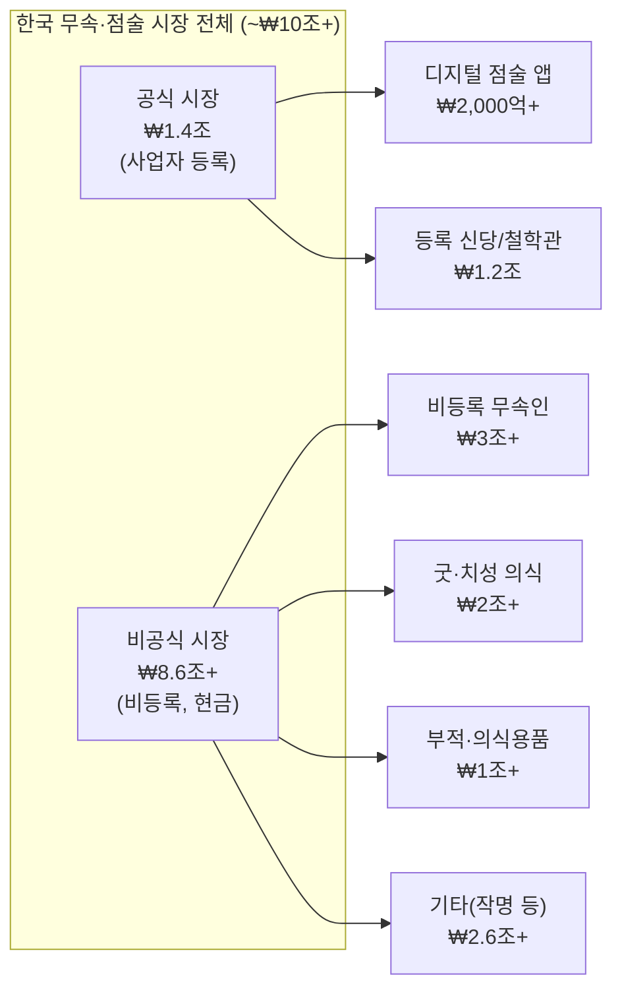
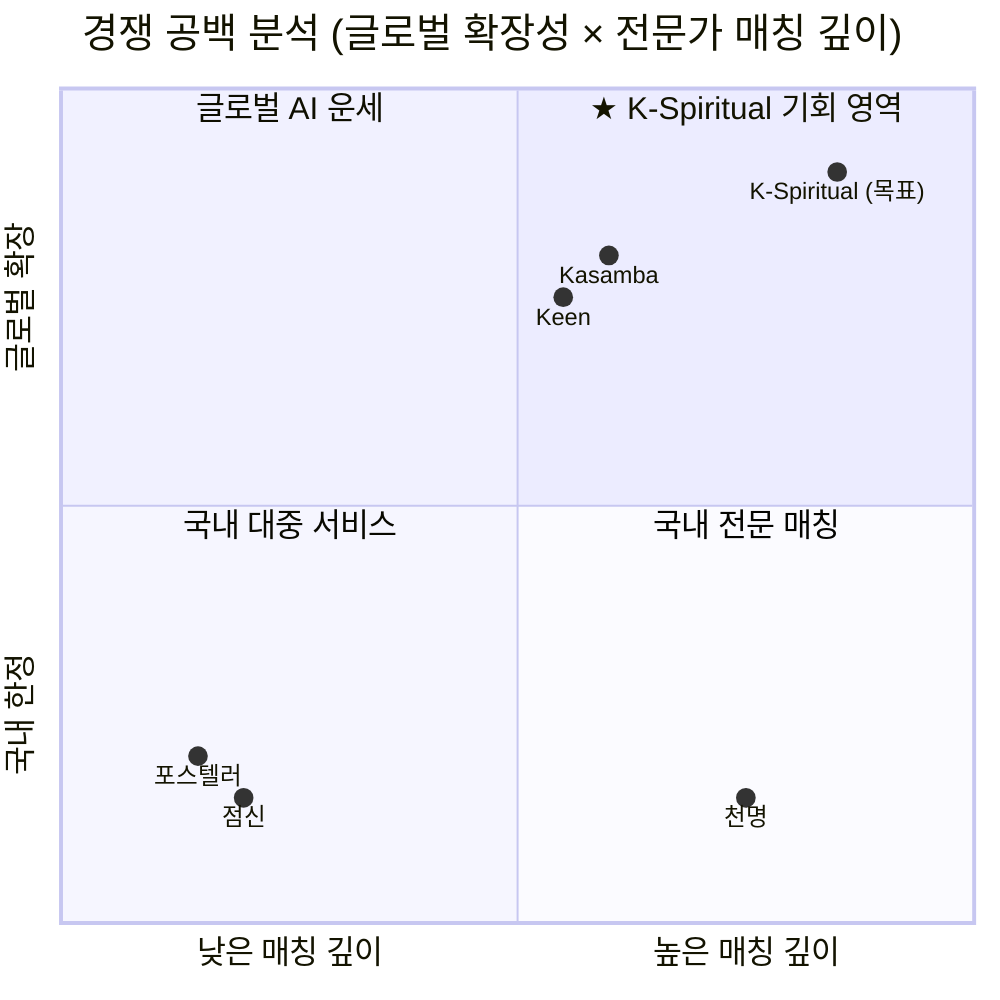
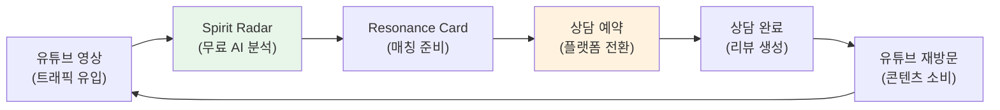

# K-Spiritual 글로벌 매칭 플랫폼 — 시장 조사 및 분석

> **문서 버전:** v1.0  
> **작성일:** 2026-05-31  
> **분석 범위:** 한국 무속 시장 + 글로벌 영적 상담 시장 + K-Culture 트렌드

---

## 1. Executive Summary

한국 무속·점술 시장은 공식 ₩1.4조, 비공식 포함 ₩10조 이상의 거대 시장이다. 동시에 글로벌 영적 서비스 시장은 $376B(2024)에서 $787B(2035)로 성장이 예상된다. 그러나 **한국 무속인과 글로벌 고객을 연결하는 플랫폼은 세계에 단 하나도 존재하지 않는다.**

2024년 영화 『파묘(Exhuma)』의 글로벌 흥행, K-pop/K-drama/K-beauty에 이은 K-Culture 확산, MZ세대의 '점테크' 트렌드 폭발은 **K-Spiritual이라는 새로운 한류 카테고리**의 탄생을 예고한다.

### 핵심 기회 요약

| 지표 | 수치 | 출처 |
|------|------|------|
| 한국 무속 시장 (공식) | ₩1.4조/년 | 통계청 |
| 한국 무속 시장 (비공식 포함) | ₩10조+/년 | 업계 추산 |
| 활동 중 무속인 수 | ~80만 명 | 업계 추정 (공식 1만+) |
| 글로벌 영적 서비스 시장 | $376B (2024) | TMR |
| 온라인 사이킥 리딩 시장 | $863M~$3.6B (2024) | Credence/SkyQuest |
| 유튜브 한국 무속인 채널 | 1,000+ (구독 1만+ = 200+) | YouTube 분석 |
| 글로벌 시장 CAGR | 7.0% (2024~2035) | OpenPR/TMR |
| **크로스보더 매칭 플랫폼** | **0개 (공백)** | 경쟁 분석 |

> **결론:** ₩10조 국내 시장 + $376B 글로벌 시장의 교집합에 **완전한 공백(White Space)**이 존재한다. DealCard의 검증된 기술 패턴(Trust Vector, PII-First AI, Progressive Disclosure)으로 이 공백을 선점할 수 있다.

---

## 2. 한국 무속 시장 심층 분석

### 2.1 시장 규모 및 구조

#### 공식 vs 비공식 시장



| 세그먼트 | 규모 (추정) | 디지털화 수준 | 플랫폼화 가능성 |
|----------|------------|-------------|---------------|
| 사주명리/역학 | ₩3조+ | 높음 (앱 활성) | ★★★★★ |
| 신점/무속 상담 | ₩2.5조+ | 낮음 (대면 중심) | ★★★★☆ |
| 타로/오라클 | ₩1조+ | 높음 (온라인 활성) | ★★★★★ |
| 굿/치성 의식 | ₩2조+ | 매우 낮음 | ★★☆☆☆ |
| 부적/의식용품 | ₩1조+ | 중간 | ★★★☆☆ |
| 작명/풍수 | ₩0.5조+ | 중간 | ★★★★☆ |

#### 종사자 구조

| 구분 | 인원 | 특성 |
|------|------|------|
| 공식 등록 점술사업자 | ~1만 명 | 사업자등록, 세금 납부 |
| 실제 활동 무속인 | ~80만 명 | 대다수 비등록, 현금 거래 |
| 유튜브 활동 무속인 | ~1,000+ 채널 | 디지털 네이티브, 플랫폼 친화적 |
| 유튜브 10K+ 구독자 | ~200+ 채널 | 1차 타겟 세그먼트 |

> **핵심 인사이트:** 80만 종사자 중 디지털 전환에 적극적인 유튜브 활동 무속인 1,000+명이 **초기 공급 측 타겟**이다. 이들은 이미 자신의 콘텐츠를 만들고, 글로벌 노출에 대한 욕구가 있다.

### 2.2 주요 플레이어 경쟁 분석

#### 국내 주요 플랫폼 상세 비교

| 항목 | 점신 (테크랩스) | 포스텔러 (운칠기삼) | 천명 (천명앤컴퍼니) |
|------|---------------|-------------------|-------------------|
| **포지셔닝** | 대중형 AI 운세 | MZ 캐릭터 IP 운세 | 전문가 중개 O2O |
| **핵심 BM** | 광고 + 부적 판매 + 인앱 | 유료 콘텐츠 + IP 협업 | 상담 중개 수수료 |
| **타겟** | 전 연령 대중 | MZ세대 | 심층 상담 필요 고객 |
| **다운로드** | 1,900만+ | N/A (높은 MAU) | N/A |
| **연 매출** | 높음 (비공개, 다각화) | ₩100억+ (2024) | N/A (안정적) |
| **AI 활용** | AI 기반 운세 생성 | 캐릭터 스토리텔링 | AI 상담 노트 |
| **전문가 매칭** | ❌ (AI only) | ❌ (콘텐츠 only) | ✅ (핵심 기능) |
| **글로벌 서비스** | ❌ | ❌ | ❌ |
| **실시간 상담** | ❌ | ❌ | ✅ (국내 한정) |
| **Trust 정량화** | ❌ | ❌ | △ (리뷰 기반) |
| **PII 보호** | 기본 | 기본 | 기본 |

#### 경쟁 공백 (Competitive Whitespace)



> **핵심 발견:** "높은 매칭 깊이 + 글로벌 확장" 사분면은 **완전 공백**이다. Kasamba/Keen은 글로벌이지만 한국 무속 전문성이 없고, 천명은 전문가 매칭이 있지만 국내 한정이다. K-Spiritual은 이 교차점을 독점할 수 있다.

### 2.3 유튜브 무속인 생태계

#### 채널 유형 분류 (5가지)

| 유형 | 비율 | 특성 | 수익 모델 | 플랫폼 적합도 |
|------|------|------|----------|-------------|
| **엔터테인먼트형** | 35% | 연예인 사주, 궁합, 예능적 콘텐츠 | 광고 + 슈퍼챗 | ★★★☆☆ |
| **교육/학술형** | 20% | 사주명리 강의, 역학 이론 해설 | 강의료 + 서적 | ★★☆☆☆ |
| **실전 상담형** | 25% | 실시간 신점, 라이브 상담 | 상담료 + 슈퍼챗 | ★★★★★ |
| **일상/브이로그형** | 10% | 무속인의 일상, 신당 투어 | 광고 | ★★★☆☆ |
| **의식/굿 중계형** | 10% | 굿 진행 중계, 의식 기록 | 의식 의뢰 | ★★★★☆ |

#### 유튜브 무속인의 수익 구조

```
유튜브 광고 수입 (30%)
├── 조회수 기반 AdSense
└── 브랜드 협찬/PPL

오프라인 상담 전환 (50%)
├── 유튜브 → 카카오톡 DM → 예약
├── 건당 ₩5만~₩50만
└── 평균 월 20~50건

라이브 수입 (15%)
├── 슈퍼챗
└── 실시간 간이 상담

기타 (5%)
├── 부적/의식용품 판매
└── 출판/강의
```

> **플랫폼 기회:** 현재 유튜브 → 카톡 DM → 오프라인 상담 경로에서 **예약 관리, 결제, 고객 관리, 글로벌 접근이 모두 수동**이다. 이 과정을 자동화하면 무속인의 업무 효율이 2배 이상 향상된다.

#### 유튜브-플랫폼 시너지 모델



### 2.4 규제 환경 및 법적 리스크

| 법률/규제 | 리스크 | 영향 | 대응 전략 |
|----------|--------|------|----------|
| **의료법 제27조** | 무면허 의료행위 금지 | 높음 | "건강 상담"이 아닌 "영적 가이드" 포지셔닝. AI Safe Language Guard로 의료 표현 자동 차단 |
| **소비자보호법** | 환불/취소 규정 | 중간 | 7일 이내 환불 정책 명시. 에스크로 결제 도입 |
| **공정거래법** | 허위/과대 광고 | 중간 | "100% 적중" 등 표현 AI 자동 필터링. Safe Language Guard 적용 |
| **개인정보보호법 (PIPA)** | 민감정보 처리 | 높음 | PII-First 아키텍처. 상담 내용 E2E 암호화 |
| **GDPR (EU)** | 글로벌 데이터 처리 | 높음 | 데이터 최소 수집. 동의 관리. DPO 지정 |
| **미국 주별 규제** | 일부 주 점술업 면허 | 중간 | "문화 체험/엔터테인먼트" 포지셔닝. 주별 법률 사전 검토 |
| **일본 특정상거래법** | 전화 권유 판매 규제 | 낮음 | 이용약관 명시. 냉각기간 설정 |

> **핵심 대응 원칙:** 모든 서비스를 **"점술 서비스"가 아닌 "영적 웰니스 체험 및 문화 콘텐츠"**로 포지셔닝한다. DealCard의 Safe Language Guard(14개 CRE 금지 패턴)를 16개 영적 상담 금지 패턴으로 확장 적용한다.

### 2.5 소비자 트렌드

#### MZ세대 '점테크' 현상

| 트렌드 | 설명 | 데이터 포인트 |
|--------|------|-------------|
| **점술의 대중화** | 무겁고 미신적 → 가볍고 재미있는 자기이해 도구 | 2024 DAU 30%↑ |
| **불안 카운슬링** | 취업·주거·연애 불안 → 영적 위안 수요 | 20-30대 사용자 비중 60%+ |
| **MBTI化** | "나는 OO사주" = "나는 ENTJ" 같은 정체성 표현 | SNS 공유율 높음 |
| **커플 궁합** | 데이트 필수 코스로 자리잡음 | 궁합 서비스 수요 YoY 45%↑ |
| **K-Culture 스필오버** | K-drama 속 무속 소재 → 실제 체험 수요 | 파묘 1,200만 관객 |

#### 소비자 여정 현재 vs 미래

```
현재 여정 (Pain Points 가득):
유튜브 발견 → 카톡 DM 문의 → 일정 조율(수동) → 계좌이체(신뢰?) 
→ 대면/영상 상담 → 후기 없음 → 재방문 불확실

미래 여정 (K-Spiritual):
유튜브 발견 → Spirit Radar(AI 즉시 분석) → Resonance Card(매칭) 
→ 원클릭 예약(결제 포함) → AI 통역 실시간 상담 
→ AI 요약 + 후기 → 푸시 알림 재방문
```

---

## 3. 글로벌 영적 상담 시장 분석

### 3.1 시장 규모 및 성장 전망

| 세그먼트 | 2024 규모 | 2030 전망 | CAGR | 핵심 동인 |
|----------|----------|----------|------|----------|
| 전체 영적 서비스 | $376B | $540B+ | 7.0% | 웰니스 트렌드, 정신건강 관심 |
| 온라인 사이킹 리딩 | $863M~$3.6B | $1.5B~$6B | 5.3~8.5% | 디지털 전환, AI 도입 |
| 명상/마인드풀니스 앱 | $4.2B | $9B+ | 12% | 구독 모델, B2B 확장 |
| 점성술/타로 콘텐츠 | $2.1B | $4B+ | 10% | SNS 바이럴, Gen Z 유입 |
| 대체 힐링 | $80B+ | $120B+ | 6% | 보완의학 인정 확대 |

#### 지역별 분포

| 지역 | 시장 점유율 | 특성 |
|------|-----------|------|
| 북미 | 35~38% | 성숙 시장, 높은 ARPU, 디지털 친화적 |
| 유럽 | 22~25% | GDPR 규제, 다국어 수요 |
| 아시아태평양 | 20~23% | 최고 성장률, 문화적 뿌리 깊음 |
| 중남미 | 8~10% | 영매 문화 강함, 성장 잠재력 |
| 중동/아프리카 | 5~7% | 종교적 제약, 니치 시장 |

### 3.2 주요 글로벌 플랫폼 비교

| 플랫폼 | 본사 | MAU (추정) | 가격대 | 강점 | 약점 |
|--------|------|-----------|--------|------|------|
| **Kasamba** | 이스라엘 | 300만+ | $1.99~$30/분 | 30년 역사, 신뢰도 | 비쌈, 문화 단일 |
| **Keen** | 미국 | 200만+ | $1.99~$10/분 | 전화 상담 전문 | UI 구식, 앱 부실 |
| **Purple Garden** | 미국 | 100만+ | $0.99~$15/분 | 모바일 UX 우수 | 전문가 검증 약함 |
| **Mysticsense** | 미국 | 50만+ | $1~$5/분 | 무료 5분 체험 | 마케팅 약함 |
| **California Psychics** | 미국 | 150만+ | $1~$15/분 | TV 광고, 브랜드 | 고가, 젊은층 부족 |

> **공통 약점:** 서양 점술(타로, 점성술, 미디엄) 중심. **한국 무속/사주명리는 어디에도 없다.** 이것이 K-Spiritual의 Blue Ocean이다.

### 3.3 크로스보더 영적 상담의 미충족 수요

| 미충족 수요 | 현재 상태 | K-Spiritual 솔루션 |
|------------|----------|-------------------|
| **언어 장벽** | 영어권 플랫폼만 존재 | AI 실시간 문화 번역 (굿→ritual, 사주→four pillars) |
| **문화적 맥락** | 서양식 해석만 가능 | 한국 무속 전문 문화 컨텍스트 엔진 |
| **신뢰 검증** | 리뷰만 존재 | 7D Trust Vector 정량화 |
| **가격 투명성** | 분당 과금 (예측 불가) | 세션 기반 고정가 |
| **개인정보 보호** | 기본 수준 | PII-First AI (LLM이 개인정보 미접근) |
| **사후 관리** | 1회성 | AI 요약 + 팔로업 추천 + 구독 관리 |

### 3.4 K-Culture 수혜와 K-Spiritual 트렌드

#### K-Culture 확산 타임라인

```
2012: 강남스타일 → K-Pop 글로벌화
2019: 기생충 → K-Movie 아카데미
2020: BTS 빌보드 1위 → K-Pop 정점
2021: 오징어게임 → K-Drama 넷플릭스 1위
2023: K-Beauty 글로벌 시장 $12B 돌파
2024: 파묘(Exhuma) → ★ K-Spiritual 인지도 폭발 ★
2025+: K-Spiritual 플랫폼화 → 새로운 한류 카테고리
```

#### K-Spiritual 콘텐츠 성장 지표

| 지표 | 2022 | 2023 | 2024 | YoY 성장 |
|------|------|------|------|---------|
| "Korean shaman" YouTube 검색량 | 기준 | +25% | +120% | 파묘 효과 |
| "사주" 영어 콘텐츠 | 적음 | 증가 | 급증 | — |
| K-spiritual TikTok 해시태그 | 1M views | 5M | 20M+ | 300% |
| 한국 무속 관련 영문 기사 | 12건 | 28건 | 75건+ | 168% |
| 한국 무속 체험 관광 예약 | — | 시작 | 서울관광공사 공식 | 공식화 |

---

## 4. TAM/SAM/SOM 분석

### Phase별 시장 규모

| Phase | 기간 | 대상 시장 | TAM | SAM | SOM |
|-------|------|----------|-----|-----|-----|
| **Phase 1** | M0~M6 | 한국 내 디지털 점술 | ₩2,000억 | ₩500억 | ₩5억 |
| **Phase 2** | M6~M12 | 재외동포 + 한국어권 | ₩5,000억 | ₩1,000억 | ₩20억 |
| **Phase 3** | Y1~Y2 | 글로벌 영어권 | $3.6B | $500M | $5M |
| **Phase 4** | Y2~Y3 | 멀티내셔널 영적 상담 | $376B | $2B | $50M |

### SOM 산출 근거

| Phase | SOM | 산출 근거 |
|-------|-----|----------|
| Phase 1 ₩5억 | 무속인 100명 × 월 상담 20건 × 건당 ₩5만 × 수수료 20% × 6개월 | ₩1.2억/월 → 연 ₩5억 가능 |
| Phase 2 ₩20억 | 무속인 300명 × 월 30건 × 건당 ₩7만 × 20% × 12개월 | 재외동포 프리미엄 가격 |
| Phase 3 $5M | 무속인 500명 × 월 40건 × 건당 $50 × 20% × 12개월 | AI 통역으로 글로벌 접근 |
| Phase 4 $50M | 전문가 2,000명 × 월 50건 × 건당 $60 × 20% × 12개월 | 멀티내셔널 확장 |

---

## 5. 사용자 페르소나

### 무속인(공급 측) 페르소나

#### P1. 조수미 (43세) — 유튜브 스타 무당

| 항목 | 내용 |
|------|------|
| **배경** | 15년 경력 신점 무속인. 유튜브 구독자 8만. 주 3회 라이브 |
| **현재 상황** | 유튜브로 유입되는 상담 의뢰를 카톡으로 수동 관리. 월 40건 상담 |
| **핵심 니즈** | 해외 팬 상담 요청이 많지만 영어 소통 불가. 예약/결제 자동화 |
| **사용 시나리오** | 유튜브 URL 입력 → AI 프로필 자동 생성 → 글로벌 고객 매칭 → AI 통역 상담 |
| **기대 월수입** | 현재 ₩200만 → 목표 ₩500만+ |
| **플랫폼 진입 동기** | "해외 팬이 상담 받고 싶다는데 방법이 없었어요" |

#### P2. 박영수 (62세) — 전통 신당 운영자

| 항목 | 내용 |
|------|------|
| **배경** | 30년 경력 무속인. 서울 은평구 신당 운영. 오프라인 중심 |
| **현재 상황** | 고정 단골 위주. 신규 고객 유입 감소. 디지털 전환 필요성 절감 |
| **핵심 니즈** | 온라인 상담 시스템 도입. 신규 고객 확보 채널 |
| **사용 시나리오** | 사진 업로드 → Resonance Card 생성 → 온라인 상담 예약 수신 |
| **기대 월수입** | 현재 ₩300만 → 안정적 ₩400만 |
| **플랫폼 진입 동기** | "젊은 분들이 온라인으로만 찾으시니까" |

#### P3. 김지훈 (31세) — 사주/타로 전문가

| 항목 | 내용 |
|------|------|
| **배경** | 대학에서 동양철학 전공. 사주명리 + 서양 타로 결합. 인스타 활동 |
| **현재 상황** | 카페/공유오피스에서 대면 상담. 온라인은 줌으로 진행 |
| **핵심 니즈** | 체계적 고객 관리 + 해외 고객 확장 |
| **사용 시나리오** | 프로필 등록 → 사주+타로 복합 상담 → AI 보고서 자동 생성 |
| **기대 월수입** | 현재 ₩150만 → 목표 ₩350만 |
| **플랫폼 진입 동기** | "글로벌 고객이 사주를 Four Pillars라고 부르더라고요" |

#### P4. 이예진 (27세) — 신규 무속인

| 항목 | 내용 |
|------|------|
| **배경** | 2년 전 신내림. 스승 밑에서 수련 중. 소규모 개인 상담 시작 |
| **현재 상황** | 고객 확보 어려움. 신뢰 구축 방법 모름 |
| **핵심 니즈** | 초기 고객 확보 + 신뢰도 증명 + 포트폴리오 구축 |
| **사용 시나리오** | Shock & Awe 온보딩 → 무료 체험 상담 제공 → Trust Vector 축적 |
| **기대 월수입** | 현재 ₩50만 → 목표 ₩200만 |
| **플랫폼 진입 동기** | "리뷰가 쌓이면 신뢰를 얻을 수 있을 것 같아요" |

### 내담자(수요 측) 페르소나

#### C1. 박서연 (29세) — 한국 MZ세대

| 항목 | 내용 |
|------|------|
| **배경** | 대기업 마케터. 이직 고민 + 연애 고민 |
| **현재 상황** | 포스텔러에서 AI 운세 확인 → 진짜 전문가 상담 갈망 |
| **핵심 니즈** | 신뢰할 수 있는 전문가에게 깊은 상담. "MBTI처럼 나를 알고 싶다" |
| **사용 시나리오** | Spirit Radar(무료) → 7D 프로필 → 전문가 매칭 → 30분 영상 상담 |
| **월 지불 의향** | ₩3만~₩10만 |
| **전환 트리거** | "AI 분석이 놀랍도록 정확해서, 전문가 상담까지 해보고 싶었다" |

#### C2. Sarah Kim (35세) — 재미동포 2세

| 항목 | 내용 |
|------|------|
| **배경** | LA 거주 한인 2세. 한국어 일상 소통 가능, 전문 용어 어려움 |
| **현재 상황** | 할머니가 돌아가신 후 무속 상담 필요성 절감. 미국에서 한국 무당 찾기 불가능 |
| **핵심 니즈** | 한국 무속 전통 연결 + 언어 보조 |
| **사용 시나리오** | 고민 영어로 입력 → AI 한국어 변환 → 무속인 매칭 → 이중언어 상담 |
| **월 지불 의향** | $50~$200 |
| **전환 트리거** | "한국에 가지 않고도 할머니 천도를 상담할 수 있다니" |

#### C3. Emily Chen (24세) — K-Culture 팬

| 항목 | 내용 |
|------|------|
| **배경** | 영국 대학생. K-drama 광팬. 파묘 보고 한국 무속에 관심 |
| **현재 상황** | YouTube에서 한국 무당 영상을 자막으로 시청. 직접 체험하고 싶음 |
| **핵심 니즈** | "진짜 한국 무당에게 나의 사주를 봐보고 싶다" |
| **사용 시나리오** | Spirit Radar(영어) → K-Spiritual Card → AI 실시간 통역 상담 |
| **월 지불 의향** | £20~£50 |
| **전환 트리거** | "Netflix에서 보던 것을 실제로 경험할 수 있다!" |

#### C4. James Wilson (42세) — 영적 탐구자

| 항목 | 내용 |
|------|------|
| **배경** | 미국 뉴욕 IT 엔지니어. 명상·요가 수련 10년. 다양한 영적 전통 탐구 |
| **현재 상황** | Kasamba에서 서양 사이킥 이용 중. 동양 전통에 관심 전환 |
| **핵심 니즈** | "서양 타로와 다른 체계인 사주명리를 체험하고 싶다" |
| **사용 시나리오** | 사주 분석 리포트(AI) → 전문가 심층 해석 → 정기 구독 |
| **월 지불 의향** | $100~$300 |
| **전환 트리거** | "4,000년 역사의 동양 시스템이라니, Kasamba와는 차원이 다르다" |

---

## 6. SWOT 분석

| | **긍정적** | **부정적** |
|---|---|---|
| **내부** | **Strengths (강점)** | **Weaknesses (약점)** |
| | • DealCard 검증 기술 패턴 70%+ 재사용 | • 무속 도메인 전문성 부족 (CRE에서 전환) |
| | • Trust Vector/PII-First/Progressive Disclosure 특허 | • 단일 파운더 리스크 |
| | • AI 3중 가드레일 (입력격리/환각감지/안전언어) | • 초기 자금 부족 |
| | • 10-stage Shock & Awe 온보딩 즉시 적용 가능 | • 무속인 네트워크 0에서 시작 |
| | • 인프로세스 ML (Python 불필요) | • 브랜드 인지도 0 |
| **외부** | **Opportunities (기회)** | **Threats (위협)** |
| | • ₩10조 국내 + $376B 글로벌 시장 | • 점신/포스텔러의 글로벌 확장 가능성 |
| | • K-Culture 글로벌 물결 (K-Spiritual 카테고리 부재) | • 무속에 대한 사회적 편견/stigma |
| | • 크로스보더 매칭 플랫폼 0개 (완전 공백) | • 규제 강화 (의료법, 소비자보호) |
| | • 2024 파묘 효과 → K-Spiritual 인지도 급상승 | • AI 통역 품질 리스크 |
| | • MZ세대 '점테크' 폭발 (DAU 30%↑) | • 문화 전유(appropriation) 비판 가능성 |
| | • 50% 플랫폼이 2030까지 AI 도입 전망 | • 경쟁사의 AI 기능 강화 |

---

## 7. 핵심 기회 및 리스크

### Blue Ocean 영역 3대 식별

| # | Blue Ocean | 근거 | 선점 전략 |
|---|-----------|------|----------|
| **BO-1** | 한국 무속인 × 글로벌 고객 매칭 | 플랫폼 0개. 완전 공백 | AI 통역 + Trust Vector로 1번째 진입 |
| **BO-2** | 영적 상담의 Trust 정량화 | 모든 플랫폼이 리뷰에만 의존 | 7D Resonance Vector 특허 출원 |
| **BO-3** | K-Spiritual as K-Culture | K-pop/K-drama 후 다음 한류 없음 | 서울관광공사/한국관광공사 파트너십 |

### 법적/윤리적 리스크 대응 매트릭스

| 리스크 | 확률 | 영향 | 대응 | 비용 |
|--------|------|------|------|------|
| 의료법 위반 | 중 | 높음 | Safe Language Guard + 면책조항 + "문화 체험" 포지셔닝 | 법률 자문 ₩500만/년 |
| 사기/가스라이팅 | 중 | 높음 | Trust Vector + 신고 시스템 + AI 모니터링 + 환불 정책 | 모니터링 인건비 |
| 문화 전유 비판 | 낮 | 중 | 무속인 주체성 강조 + 문화자문위 + 교육 콘텐츠 | ₩200만/년 |
| 개인정보 유출 | 낮 | 매우 높음 | PII-First + E2E 암호화 + 정기 보안감사 | 보안감사 ₩1,000만/년 |

### 문화적 민감성 가이드라인

1. **무속인 존중**: "콘텐츠 생산자"가 아닌 "전문 파트너"로 대우
2. **전통 보존**: 상업화로 인한 전통 왜곡 방지. 문화자문위 운영
3. **다양성 인정**: 무속 내 다양한 전통(경기굿, 호남굿, 동해안별신굿 등) 인정
4. **선택적 공개**: 신성한 의식은 무속인의 동의 없이 공개하지 않음
5. **교육 병행**: 엔터테인먼트와 함께 무속의 문화적 가치를 교육하는 콘텐츠 제공

---

> **문서 끝 | K-Spiritual 시장 조사 및 분석 v1.0**
