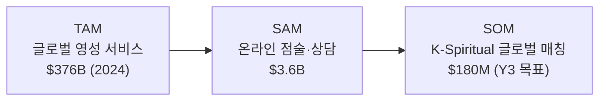
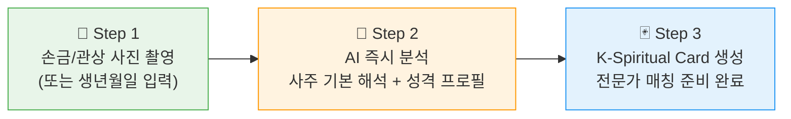
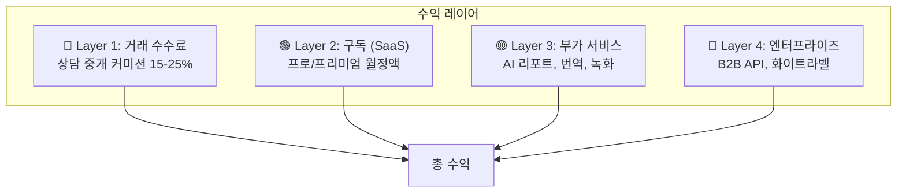
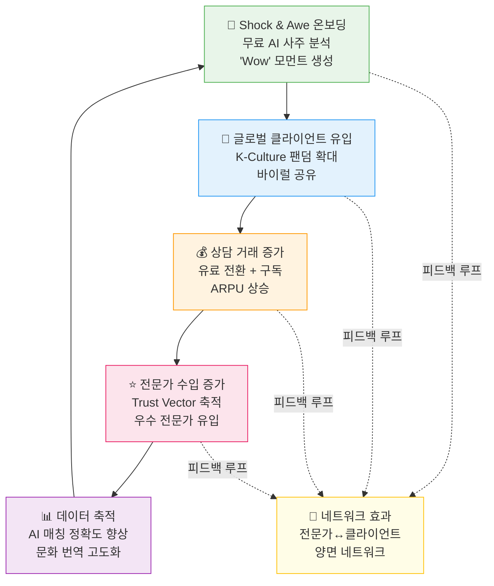
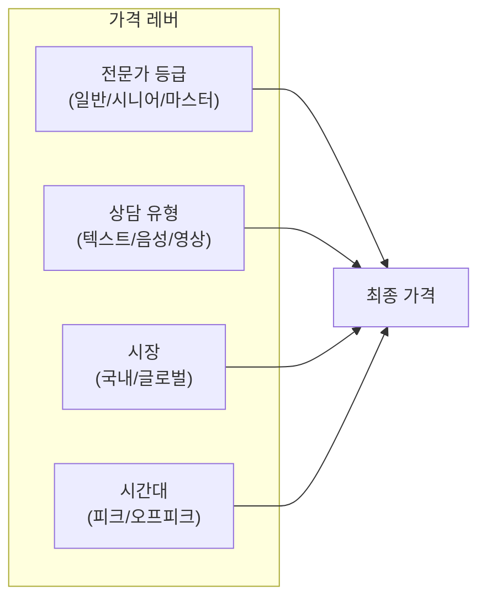
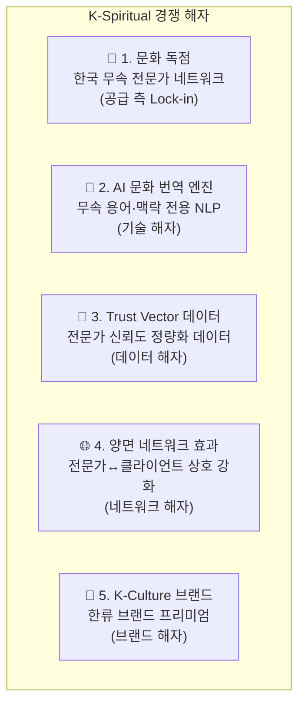
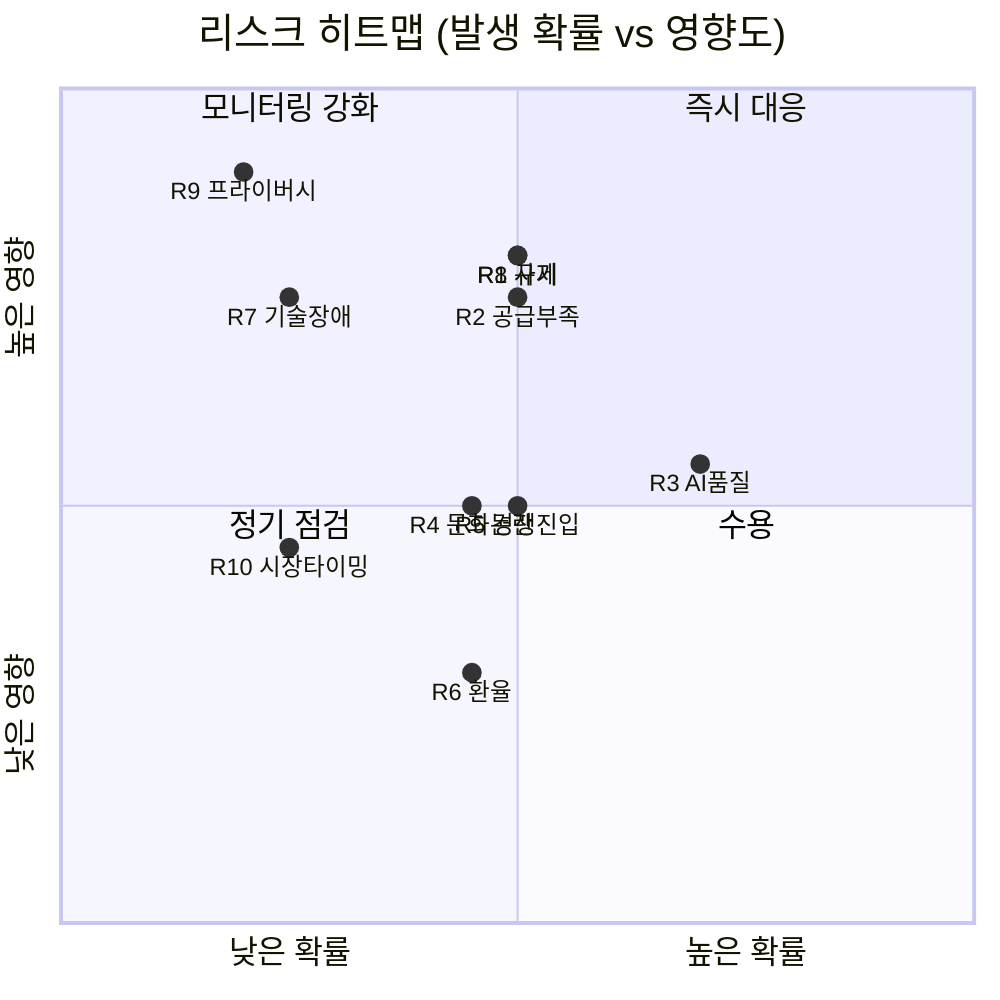

# K-Spiritual 글로벌 매칭 플랫폼 — 비즈니스 모델 & 전략

> **문서 버전:** v1.0  
> **최종 수정:** 2025-01  
> **상위 문서:** [DealCard 범용 플랫폼 아키텍처](../universal_dealcard_platform.md)  
> **도메인:** K-Spiritual (무속·사주·타로 글로벌 매칭)

---

## 목차

1. [비전 & 미션](#1-비전--미션)
2. [가치 제안 (Value Proposition Canvas)](#2-가치-제안-value-proposition-canvas)
3. [수익 모델 (Revenue Model)](#3-수익-모델-revenue-model)
4. [유닛 이코노믹스 (Unit Economics)](#4-유닛-이코노믹스-unit-economics)
5. [GTM 전략 (Go-To-Market)](#5-gtm-전략-go-to-market)
6. [성장 플라이휠 (Growth Flywheel)](#6-성장-플라이휠-growth-flywheel)
7. [가격 전략 (Pricing Strategy)](#7-가격-전략-pricing-strategy)
8. [경쟁 해자 (Competitive Moat)](#8-경쟁-해자-competitive-moat)
9. [재무 전망 (Financial Projections)](#9-재무-전망-financial-projections)
10. [리스크 매트릭스 (Risk Matrix)](#10-리스크-매트릭스-risk-matrix)

---

## 1. 비전 & 미션

### 1.1 비전 (Vision)

> **"K-Spiritual을 글로벌 웰니스의 새로운 카테고리로 정립하고, 세계 어디서든 한국 무속·영성 전문가와 즉시 연결되는 신뢰 기반 매칭 플랫폼을 구축한다."**

K-Pop, K-Drama, K-Beauty가 문화 한류를 이끌었다면, **K-Spiritual**은 **영성(靈性) 한류**의 시작점이다. 전 세계적으로 명상·점술·타로·에너지 힐링에 대한 수요가 폭발적으로 증가하고 있으며, 한국의 무속(巫俗)·사주명리·관상·타로는 수천 년의 역사와 독자적 체계를 가진 고유 자산이다. 그러나 언어 장벽, 신뢰 부재, 표준화 부족으로 글로벌 시장 진출이 막혀 있었다.

K-Spiritual 플랫폼은 DealCard의 **Trust Vector**, **PII-First AI**, **Progressive Disclosure**, **Anti-Fragile LLM Ops** 패턴을 활용하여 이 문제를 근본적으로 해결한다.

### 1.2 미션 (Mission)

> **"무속인의 전문성을 데이터로 증명하고, AI 통역·문화 번역을 통해 글로벌 고객과 실시간 매칭하여, 양쪽 모두에게 최고의 영성 경험을 제공한다."**

### 1.3 핵심 원칙 (Core Principles)

| # | 원칙 | 설명 |
|---|------|------|
| 1 | **신뢰 우선 (Trust-First)** | Trust Vector 기반으로 무속인의 전문성·경력·후기를 정량화. 가짜 전문가 필터링 |
| 2 | **문화 번역 (Cultural Translation)** | 단순 언어 번역이 아닌, 무속 용어·의식·맥락을 해당 문화권에 맞게 변환 |
| 3 | **프라이버시 최우선 (PII-First)** | 민감한 영성 상담 데이터를 암호화·익명화하여 보호 |
| 4 | **전문가 존중 (Expert Dignity)** | 무속인을 "콘텐츠 생산자"가 아닌 "전문 파트너"로 대우. 공정한 수익 배분 |
| 5. | **점진적 공개 (Progressive Disclosure)** | 사용자에게 정보를 단계적으로 제공하여 신뢰를 쌓아가는 UX |

### 1.4 목표 시장 규모 (TAM → SAM → SOM)



| 구분 | 규모 | 산출 근거 |
|------|------|-----------|
| **TAM** | $376B | 글로벌 영성·웰니스 서비스 전체 (명상, 점술, 힐링, 대체의학 포함) |
| **SAM** | $3.6B | 온라인 점술·사이킥 리딩 시장 (Kasamba, Purple Garden, Keen 등) |
| **SOM** | $180M | SAM의 5% × K-Culture 프리미엄 계수 1.0x (3년차 목표) |

---

## 2. 가치 제안 (Value Proposition Canvas)

### 2.1 고객 세그먼트별 가치 제안

#### A. 글로벌 클라이언트 (수요자)

| 고객 과업 (Jobs) | 고통 (Pains) | 가치 제안 (Gains) |
|------------------|-------------|-------------------|
| K-Culture에 대한 깊은 체험을 원함 | 한국어 장벽, 어디서 찾아야 할지 모름 | AI 실시간 문화 번역 + 큐레이션 매칭 |
| 인생 중요 결정에 영성적 가이드 필요 | 온라인 점술 서비스의 낮은 신뢰도 | Trust Vector 기반 검증된 전문가 매칭 |
| 개인화된 영성 경험 원함 | 대량생산형 AI 운세의 피상적 결과 | 실제 전문가의 1:1 심층 상담 + AI 보조 레포트 |
| 정기적 영성 관리 (월운, 신년운 등) | 일회성 소비 후 후속 관리 없음 | 구독 기반 지속적 영성 케어 시스템 |

#### B. 한국 무속인·전문가 (공급자)

| 전문가 과업 (Jobs) | 고통 (Pains) | 가치 제안 (Gains) |
|--------------------|--------------|--------------------|
| 안정적 고객 확보 | 입소문·오프라인 의존, 수입 불안정 | 글로벌 고객 풀 + AI 매칭으로 안정적 수요 |
| 전문성 인정 받기 | "사기꾼" 편견, 전문성 증명 어려움 | Trust Vector로 경력·후기·정확도 정량화 |
| 해외 고객 상담 | 언어 장벽, 문화 차이 소통 어려움 | 실시간 AI 통역 + 문화 맥락 변환 엔진 |
| 디지털 전환 | 기술 역량 부족, 플랫폼 운영 어려움 | 원클릭 프로필 생성 (Shock & Awe 온보딩) |

### 2.2 Shock & Awe 온보딩 — K-Spiritual 적용

DealCard의 "Shock & Awe" 온보딩 패턴을 K-Spiritual 도메인에 최적화한다.

**클라이언트 온보딩 (3-Step, < 90초):**



| 단계 | 입력 | AI 출력 | 목적 |
|------|------|---------|------|
| 1. 초기 입력 | 손금 사진 / 관상 사진 / 생년월일시 | — | 최소 마찰로 데이터 획득 |
| 2. 즉시 분석 | — | 사주 오행 분석, 성격 키워드 5개, 올해 운세 요약 | "Wow" 모먼트 → 전환율 극대화 |
| 3. 카드 생성 | 선호 상담 분야 선택 | K-Spiritual Card (Archetype Card 변형) | 매칭 엔진 투입 준비 |

**전문가 온보딩 (5-Step, < 5분):**

| 단계 | 내용 | DealCard 패턴 매핑 |
|------|------|---------------------|
| 1. 본인 인증 | 신분증 + 활동 증빙 (자격증, 방송 출연, 온라인 후기 등) | Trust Vector — 신원 검증 |
| 2. 전문 분야 | 사주, 타로, 관상, 신점, 작명, 풍수 등 선택 | Domain Rule Pack — 카테고리 |
| 3. 상담 스타일 | AI가 기존 콘텐츠 분석 → 스타일 프로필 자동 생성 | Archetype Card 자동 구축 |
| 4. 가격 설정 | 추천 가격대 제시 → 전문가가 최종 결정 | Pricing Engine |
| 5. 샘플 상담 | AI 더미 고객과 연습 상담 1회 → 품질 검증 | Trust Vector — 초기 스코어 |

---

## 3. 수익 모델 (Revenue Model)

### 3.1 수익 구조 개요

K-Spiritual 플랫폼은 **4개 수익 레이어**로 구성된 복합 수익 모델을 채택한다.



### 3.2 Layer 1: 거래 수수료 (Transaction Fee)

모든 1:1 상담 거래에서 플랫폼 수수료를 징수한다.

| 항목 | 상세 |
|------|------|
| **기본 수수료율** | 20% (업계 평균 15-30% 내 경쟁력 있는 수준) |
| **신규 전문가 프로모션** | 첫 3개월 15% (온보딩 인센티브) |
| **Top Tier 전문가** | 18% (월 상담 50건 이상 시 우대) |
| **적용 대상** | 실시간 영상/음성 상담, 텍스트 상담, 녹음 상담 |

### 3.3 Layer 2: 구독 모델 (Subscription)

#### 클라이언트 구독

| 플랜 | 월 요금 | 포함 내용 |
|------|---------|-----------|
| **Free** | ₩0 | 기본 사주 분석 1회, 전문가 프로필 열람, 후기 열람 |
| **Pro** | ₩19,900/월 | 월 1회 무료 상담(30분), AI 월운 리포트, 전문가 즐겨찾기 무제한, 상담 녹화 열람 |
| **Premium** | ₩49,900/월 | Pro 전체 + 월 3회 무료 상담, VIP 전문가 우선 예약, 심층 AI 사주 분석 리포트, 1:1 전담 매니저 |

#### 전문가 구독

| 플랜 | 월 요금 | 포함 내용 |
|------|---------|-----------|
| **Basic** | ₩0 | 프로필 등록, 기본 매칭, 월 10건 상담 |
| **Professional** | ₩29,900/월 | 무제한 상담, AI 통역 서비스, 상담 기록 관리, 정산 대시보드 |
| **Master** | ₩99,900/월 | Professional 전체 + 프리미엄 노출, 글로벌 고객 우선 매칭, AI 마케팅 도구, 브랜딩 페이지 |

### 3.4 Layer 3: 부가 서비스 (Value-Added Services)

| 서비스 | 가격 | 설명 |
|--------|------|------|
| **AI 심층 사주 리포트** | ₩9,900/건 | 20페이지 분량의 개인 맞춤 사주 분석 PDF |
| **실시간 AI 통역** | ₩5,000/30분 | 상담 중 실시간 한↔영/중/일 AI 통역 |
| **상담 녹화 & 번역** | ₩3,000/건 | 상담 내용 녹화 + 자동 자막 + 번역본 제공 |
| **작명 서비스 (AI+전문가)** | ₩49,000/건 | AI 초안 + 전문가 최종 감수의 하이브리드 작명 |
| **풍수 컨설팅 리포트** | ₩29,000/건 | 사진 기반 AI 풍수 분석 + 전문가 코멘트 |
| **커플 궁합 리포트** | ₩14,900/건 | 두 사람의 사주 궁합 AI 분석 + 전문가 해석 |

### 3.5 Layer 4: 엔터프라이즈 (B2B)

| 상품 | 대상 | 가격 모델 |
|------|------|-----------|
| **K-Spiritual API** | 글로벌 웰니스 앱, 명상 앱 | API 호출당 과금 ($0.05-$0.50/call) |
| **화이트라벨 솔루션** | 한류 콘텐츠 기업, 여행사 | 월 ₩500만~ + 수익 쉐어 |
| **기업 복지 프로그램** | HR 부서, 직원 웰니스 | 연간 라이선스 ₩1,200만~/100명 |
| **콘텐츠 라이선스** | 방송사, OTT | 건별 협상 |

---

## 4. 유닛 이코노믹스 (Unit Economics)

### 4.1 핵심 지표 정의

| 지표 | 약어 | 목표 (Y1) | 목표 (Y3) | 산출 방식 |
|------|------|-----------|-----------|-----------|
| 고객 획득 비용 | **CAC** | ₩15,000 | ₩8,000 | 총 마케팅비 ÷ 신규 유료 전환 수 |
| 고객 생애 가치 | **LTV** | ₩120,000 | ₩360,000 | ARPU × 평균 이용 기간(월) |
| 월 평균 객단가 | **ARPU** | ₩12,000 | ₩20,000 | 총 수익 ÷ MAU |
| LTV/CAC 비율 | **LTV:CAC** | 8:1 | 45:1 | — |
| 월간 이탈율 | **Churn** | 8% | 4% | 이탈 유료 회원 ÷ 전월 유료 회원 |
| 유료 전환율 | **CVR** | 5% | 12% | 유료 전환 수 ÷ 가입자 수 |
| 전문가 1인당 월 매출 | **RPE** | ₩800,000 | ₩3,000,000 | 전문가별 월 총 거래액 |

### 4.2 거래당 유닛 이코노믹스 (Per-Transaction)

**기준:** 30분 실시간 영상 상담 1건 (글로벌 고객 → 한국 전문가)

| 항목 | 금액 | 비율 |
|------|------|------|
| 고객 결제액 | ₩50,000 | 100% |
| (-) 결제 수수료 (PG) | ₩1,500 | 3% |
| (-) AI 통역 비용 | ₩2,000 | 4% |
| (-) 서버/인프라 비용 | ₩500 | 1% |
| (-) 전문가 정산 | ₩36,000 | 72% |
| **= 플랫폼 순수익** | **₩10,000** | **20%** |
| (-) 고객지원·운영 | ₩1,500 | 3% |
| **= 거래당 공헌이익** | **₩8,500** | **17%** |

### 4.3 LTV 시나리오 분석

| 시나리오 | ARPU/월 | 평균 이용 기간 | LTV | CAC | LTV:CAC |
|----------|---------|----------------|-----|-----|---------|
| **보수적** | ₩10,000 | 8개월 | ₩80,000 | ₩15,000 | 5.3:1 |
| **기본** | ₩15,000 | 12개월 | ₩180,000 | ₩12,000 | 15:1 |
| **낙관적** | ₩25,000 | 18개월 | ₩450,000 | ₩8,000 | 56:1 |

### 4.4 공급 측 이코노믹스 (전문가)

| 항목 | 수치 |
|------|------|
| 전문가 월 평균 상담 건수 (Y1) | 20건 |
| 건당 평균 상담료 | ₩50,000 |
| 전문가 월 총 거래액 | ₩1,000,000 |
| 플랫폼 수수료 공제 후 | ₩800,000 |
| 전문가 목표 월 수입 (Y3) | ₩3,000,000+ |
| 전문가 이탈율 목표 | 월 3% 이하 |

---

## 5. GTM 전략 (Go-To-Market)

### 5.1 시장 진입 단계 (Phase Strategy)

```mermaid
gantt
    title K-Spiritual GTM 로드맵
    dateFormat YYYY-Q
    axisFormat %Y-Q

    section Phase 1: 국내 검증
    국내 MVP 런칭           :p1a, 2025-Q1, 2025-Q2
    초기 전문가 50명 온보딩   :p1b, 2025-Q1, 2025-Q2
    Shock & Awe 온보딩 최적화 :p1c, 2025-Q2, 2025-Q3

    section Phase 2: 글로벌 확장
    영어권 진출 (미국/영국)    :p2a, 2025-Q3, 2025-Q4
    일본어권 진출             :p2b, 2025-Q4, 2026-Q1
    AI 통역 엔진 고도화       :p2c, 2025-Q3, 2026-Q1

    section Phase 3: 스케일업
    동남아·중화권 진출         :p3a, 2026-Q1, 2026-Q3
    B2B API 런칭             :p3b, 2026-Q2, 2026-Q3
    엔터프라이즈 세일즈        :p3c, 2026-Q3, 2026-Q4
```

### 5.2 Phase 1: 국내 검증 (Q1-Q2 2025)

**목표:** PMF(Product-Market Fit) 검증 + 초기 전문가 풀 구축

| 전략 | 실행 내용 | KPI |
|------|-----------|-----|
| **전문가 시딩** | 유명 무속인·사주 전문가 50명 직접 영업 + 온보딩 | 전문가 50명 확보 |
| **한류 팬덤 타겟** | 트위터/인스타 K-Culture 커뮤니티 바이럴 | 가입자 10,000명 |
| **콘텐츠 마케팅** | 유튜브 "사주로 보는 K-Pop 아이돌 궁합" 시리즈 | 조회수 100만+ |
| **Shock & Awe 전환** | 무료 AI 사주 분석 → 유료 전문가 상담 연결 | CVR 5%+ |
| **리텐션 루프** | 월운 알림, 절기별 푸시, 커뮤니티 | MAU 리텐션 40%+ |

### 5.3 Phase 2: 글로벌 확장 (Q3 2025 - Q1 2026)

**목표:** 영어권·일본어권 시장 진입 + AI 통역 상용화

| 전략 | 실행 내용 | KPI |
|------|-----------|-----|
| **K-Culture 연계** | K-Pop 팬덤, K-Drama 커뮤니티와 콜라보 | 해외 가입자 50,000명 |
| **인플루언서 마케팅** | 영미권 타로·점술 인플루언서 파트너십 | CPI $2.0 이하 |
| **AI 통역 런칭** | 한↔영 실시간 상담 통역 서비스 | 통역 만족도 4.5/5.0 |
| **앱스토어 최적화** | "Korean Fortune", "K-Spiritual" ASO | 앱스토어 카테고리 Top 50 |
| **PR·미디어** | CNN, Vice, Dazed 등 K-Culture 관련 기사 | 미디어 노출 20건+ |

### 5.4 Phase 3: 스케일업 (Q1-Q4 2026)

**목표:** 다국어 확장 + B2B 수익 다각화

| 전략 | 실행 내용 | KPI |
|------|-----------|-----|
| **다국어 확장** | 일본어, 중국어(번체/간체), 동남아 주요 언어 | 지원 언어 8개 |
| **B2B API** | 명상 앱, 웰니스 앱에 K-Spiritual API 제공 | API 파트너 10사 |
| **엔터프라이즈** | 기업 복지·HR 프로그램, 방송사 콘텐츠 | 연간 계약 ₩5억+ |
| **오프라인 연계** | K-Tour 연계 "무속 체험 투어" 상품 | 월 100건+ 예약 |

### 5.5 채널 전략 매트릭스

| 채널 | Phase 1 | Phase 2 | Phase 3 | 비용 효율 |
|------|---------|---------|---------|-----------|
| 오가닉 소셜 (TikTok, IG) | ★★★ | ★★★ | ★★ | 매우 높음 |
| 유튜브 콘텐츠 | ★★★ | ★★★ | ★★★ | 높음 |
| K-Culture 커뮤니티 | ★★ | ★★★ | ★★ | 높음 |
| 유료 광고 (Meta, Google) | ★ | ★★ | ★★★ | 보통 |
| 인플루언서 파트너십 | ★ | ★★★ | ★★ | 보통 |
| B2B 세일즈 | — | ★ | ★★★ | 높음 |
| PR/미디어 | ★ | ★★★ | ★★ | 매우 높음 |

---

## 6. 성장 플라이휠 (Growth Flywheel)

### 6.1 핵심 플라이휠 구조

K-Spiritual 플랫폼의 성장은 **4개 엔진이 상호 강화하는 플라이휠** 구조로 작동한다.



### 6.2 플라이휠 단계별 핵심 메트릭

| 플라이휠 단계 | 핵심 메트릭 | Y1 목표 | Y3 목표 |
|---------------|------------|---------|---------|
| **Shock & Awe 유입** | 일 신규 가입자 수 | 100명/일 | 1,000명/일 |
| **글로벌 확산** | 해외 사용자 비율 | 10% | 60% |
| **거래 전환** | 유료 전환율 (CVR) | 5% | 12% |
| **전문가 만족** | 전문가 월 수입 증가율 | +20% QoQ | +10% QoQ |
| **데이터 고도화** | 매칭 만족도 | 3.8/5.0 | 4.6/5.0 |

### 6.3 바이럴 성장 엔진

| 바이럴 메커니즘 | 설명 | 기대 K-factor |
|-----------------|------|---------------|
| **AI 사주 카드 공유** | 개인 사주 카드를 SNS에 공유 (인스타 스토리 최적화) | 0.3 |
| **궁합 결과 공유** | 친구/커플 궁합 분석 → 상대방 초대 | 0.5 |
| **전문가 추천** | 상담 후 "이 전문가 추천" 링크 공유 | 0.2 |
| **결합 K-factor** | — | **1.0+** (바이럴 임계점) |

### 6.4 Anti-Fragile 성장 전략

DealCard의 **Anti-Fragile LLM Ops** 패턴을 성장 전략에 적용한다.

| 원칙 | 적용 |
|------|------|
| **Graceful Degradation** | AI 통역 장애 시 → 텍스트 채팅 + 후속 번역 제공 (서비스 중단 없음) |
| **Multi-Model Redundancy** | GPT-4o, Claude, Gemini 중 최적 모델 자동 선택 (비용·품질 최적화) |
| **Human-in-the-Loop** | AI 번역 품질 낮은 상담 → 전문 통역사 개입 옵션 |
| **Canary Deployment** | 신규 기능을 5% 사용자에게 먼저 배포 → 검증 후 전체 롤아웃 |

---

## 7. 가격 전략 (Pricing Strategy)

### 7.1 가격 책정 철학

> **"전문가의 가치를 존중하면서, 글로벌 시장의 지불 의향(WTP)에 맞추는 동적 가격 체계"**

### 7.2 상담 가격 체계

#### 기본 가격 (한국 시장)

| 상담 유형 | 시간 | 가격대 | 비고 |
|-----------|------|--------|------|
| **텍스트 상담** | 질문 3개 | ₩10,000-30,000 | 비동기, 24시간 내 답변 |
| **음성 상담** | 20분 | ₩30,000-50,000 | 실시간 |
| **영상 상담** | 30분 | ₩50,000-100,000 | 실시간, 프리미엄 |
| **대면 예약 (O2O)** | 60분 | ₩100,000-300,000 | 오프라인 방문 중개 |

#### 글로벌 가격 (영어권)

| 상담 유형 | 시간 | 가격대 (USD) | 비교 (Kasamba 등) |
|-----------|------|-------------|-------------------|
| **텍스트 상담** | 질문 3개 | $15-$30 | 경쟁사 $20-50 |
| **음성 상담** | 20분 | $30-$60 | 경쟁사 $40-80 |
| **영상 상담** | 30분 | $50-$100 | 경쟁사 $60-120 |
| **프리미엄 세션** | 60분 | $100-$250 | K-Culture 프리미엄 |

### 7.3 가격 차별화 전략



| 전략 | 설명 | 적용 방식 |
|------|------|-----------|
| **전문가 등급별 차등** | 마스터 등급 전문가는 2-3배 프리미엄 | Trust Vector 점수 기반 자동 등급 |
| **지역별 PPP 조정** | 구매력 평가(PPP) 기반 지역별 가격 조정 | 동남아 30-50% 할인, 유럽 10-20% 할증 |
| **피크타임 서지 가격** | 신년·설날·추석 등 수요 폭증 시기 | 수요 대비 공급 비율로 자동 조정 (1.2-1.5배) |
| **번들 할인** | 3회/5회/10회 패키지 | 10-25% 할인 |
| **첫 상담 할인** | 신규 유저 첫 유료 상담 50% 할인 | CAC 최적화용 프로모션 |

### 7.4 전문가 수익 보장 체계

| 등급 | 수수료율 | 최저 보장 | 인센티브 |
|------|---------|-----------|----------|
| **일반** | 20% | 없음 | 월 30건 달성 시 다음 달 18% |
| **시니어** | 18% | 월 ₩500,000 | 만족도 4.5+ 시 보너스 ₩100,000 |
| **마스터** | 15% | 월 ₩1,000,000 | 글로벌 고객 매칭 우선권 + 브랜딩 지원 |

---

## 8. 경쟁 해자 (Competitive Moat)

### 8.1 경쟁사 비교 매트릭스

| 기능/역량 | K-Spiritual | 점신 | 포스텔러 | 천명 | Kasamba (US) |
|-----------|-------------|------|---------|------|-------------|
| **글로벌 매칭** | ✅ 핵심 | ❌ | ❌ | ❌ | ✅ 영어만 |
| **AI 문화 번역** | ✅ 독자 기술 | ❌ | ❌ | ❌ | ❌ |
| **실시간 통역 상담** | ✅ | ❌ | ❌ | ❌ | ❌ |
| **한국 무속 전문가** | ✅ 핵심 공급 | ❌ AI만 | △ 캐릭터 | ✅ 국내만 | ❌ |
| **Trust Vector** | ✅ 정량화 | ❌ | ❌ | △ 리뷰만 | △ 리뷰만 |
| **Shock & Awe 온보딩** | ✅ | △ AI 한정 | ✅ | ❌ | ❌ |
| **구독 모델** | ✅ 다층 | ❌ | ✅ | ❌ | ✅ |
| **B2B API** | ✅ 계획 | ❌ | ❌ | ❌ | ❌ |
| **월간 사용자 (추정)** | 목표 50만(Y3) | 1,900만 DL | 200만+ | 50만 | 300만 |
| **주요 수익** | 수수료+구독+부가 | 광고+인앱 | 구독+IP | 수수료 | 수수료 |

### 8.2 5대 경쟁 해자



#### 해자 1: 문화 독점 (Cultural Monopoly)

한국 최고 수준의 무속인·사주·타로 전문가를 독점 계약으로 확보한다. 이 전문가 네트워크는 단기간에 복제 불가능한 핵심 자산이다.

- **독점 계약:** 상위 100명 전문가와 2년 독점 플랫폼 계약
- **커뮤니티:** 전문가 전용 커뮤니티 + 교육 프로그램 제공
- **전환 비용:** 축적된 리뷰·고객 관계가 전문가의 이탈 비용을 높임

#### 해자 2: AI 문화 번역 엔진 (AI Cultural Translation Engine)

단순 언어 번역이 아닌, 무속·영성 도메인 특화 NLP 엔진이다.

- **도메인 용어 사전:** 무속 전문 용어 10,000+ 항목의 다국어 사전
- **문화 맥락 변환:** "사주팔자" → 서양 점성술 용어로 문맥 변환
- **의식·의례 설명:** 한국 무속 의식을 해당 문화권의 유사 개념으로 설명
- **데이터 축적:** 상담 건수 증가 → 번역 품질 개선 → 경쟁사 추격 불가

#### 해자 3: Trust Vector 데이터

- **정량화된 신뢰:** 상담 정확도, 재방문율, 고객 만족도를 수치화
- **시계열 데이터:** 시간이 지날수록 풍부해지는 데이터 자산
- **위조 불가:** 실거래 기반 데이터로 조작 불가능

#### 해자 4: 양면 네트워크 효과

- **수요 측:** 클라이언트가 많을수록 → 전문가 수입 증가 → 더 많은 전문가 유입
- **공급 측:** 전문가가 많을수록 → 매칭 품질 향상 → 더 많은 클라이언트 유입
- **크로스 네트워크:** 양면이 동시에 성장하는 자기 강화 구조

#### 해자 5: K-Culture 브랜드 프리미엄

- **한류 후광:** K-Pop, K-Drama, K-Beauty와 연계한 브랜드 포지셔닝
- **문화 정통성:** "진짜 한국 무속"이라는 원산지 프리미엄
- **체험 경제:** K-Spiritual을 하나의 "K-Culture 체험 상품"으로 포지셔닝

### 8.3 해자 강도 평가

| 해자 | 구축 난이도 | 복제 난이도 | 시간 가치 | 종합 등급 |
|------|------------|------------|-----------|-----------|
| 문화 독점 | ★★★★ | ★★★★★ | ★★★★★ | **S** |
| AI 문화 번역 | ★★★★★ | ★★★★ | ★★★★ | **A+** |
| Trust Vector | ★★★ | ★★★★ | ★★★★★ | **A** |
| 양면 네트워크 | ★★★★ | ★★★★★ | ★★★★★ | **S** |
| K-Culture 브랜드 | ★★★ | ★★★ | ★★★ | **B+** |

---

## 9. 재무 전망 (Financial Projections)

### 9.1 3개년 재무 전망 요약

| 항목 | Y1 (2025) | Y2 (2026) | Y3 (2027) |
|------|-----------|-----------|-----------|
| **MAU** | 50,000 | 300,000 | 1,200,000 |
| **유료 사용자** | 2,500 | 36,000 | 144,000 |
| **유료 전환율** | 5% | 12% | 12% |
| **등록 전문가** | 200 | 800 | 2,500 |
| **활성 전문가** | 100 | 500 | 1,500 |
| **월 평균 상담 건수** | 3,000 | 30,000 | 150,000 |
| **연간 GMV** | ₩18억 | ₩180억 | ₩900억 |
| **연간 매출 (수수료+구독+부가)** | ₩5.4억 | ₩54억 | ₩270억 |
| **영업이익** | -₩8억 | ₩5억 | ₩81억 |
| **영업이익률** | -148% | 9.3% | 30% |

### 9.2 매출 구성 비율 (Revenue Mix)

| 수익 레이어 | Y1 | Y2 | Y3 |
|------------|-----|-----|-----|
| 거래 수수료 | 70% | 55% | 40% |
| 구독 수익 | 15% | 25% | 30% |
| 부가 서비스 | 15% | 15% | 20% |
| 엔터프라이즈 | 0% | 5% | 10% |
| **합계** | **100%** | **100%** | **100%** |

### 9.3 비용 구조

| 비용 항목 | Y1 | Y2 | Y3 | 비고 |
|-----------|-----|-----|-----|------|
| **인건비** | ₩6억 | ₩18억 | ₩42억 | 개발·운영·CS 인력 |
| **서버/인프라** | ₩1.2억 | ₩6억 | ₩18억 | AWS/GCP, AI API 비용 |
| **마케팅** | ₩4억 | ₩15억 | ₩36억 | 디지털 광고, 인플루언서, PR |
| **AI/ML 개발** | ₩1.5억 | ₩5억 | ₩12억 | 문화 번역 엔진, 매칭 AI |
| **결제/PG 수수료** | ₩0.5억 | ₩5억 | ₩27억 | GMV 대비 3% |
| **관리/기타** | ₩0.2억 | ₩0.5억 | ₩2억 | 법무, 회계, 사무실 |
| **총 비용** | **₩13.4억** | **₩49.5억** | **₩137억** |

### 9.4 투자 라운드 계획

| 라운드 | 시기 | 금액 | 용도 | 주요 마일스톤 |
|--------|------|------|------|-------------|
| **Pre-Seed** | 2025 Q1 | ₩5억 | MVP 개발, 초기 팀 구성 | 전문가 50명, MAU 5,000 |
| **Seed** | 2025 Q3 | ₩20억 | 글로벌 확장, AI 엔진 개발 | 해외 진출, MAU 50,000 |
| **Series A** | 2026 Q2 | ₩100억 | 스케일업, B2B, 다국어 | MAU 300,000, BEP 달성 |
| **Series B** | 2027 Q2 | ₩300억 | 시장 지배력 확보, M&A | MAU 1,200,000, 영업이익 30% |

### 9.5 손익분기점 (BEP) 분석

| 항목 | 수치 |
|------|------|
| **월 고정비** | ₩2.5억 (Y2 기준) |
| **건당 공헌이익** | ₩8,500 |
| **BEP 월 상담 건수** | 29,412건 |
| **예상 BEP 달성 시점** | Y2 Q3 (2026년 3분기) |
| **BEP 달성 시 MAU** | 약 250,000명 |

### 9.6 주요 재무 KPI 대시보드

| KPI | Y1 | Y2 | Y3 | 벤치마크 |
|-----|-----|-----|-----|----------|
| GMV 성장률 | — | 900% | 400% | 하이퍼그로스 기준 200%+ |
| 매출 성장률 | — | 900% | 400% | SaaS 기준 T2D3 |
| 매출총이익률 | 45% | 55% | 65% | 플랫폼 목표 60%+ |
| 영업이익률 | -148% | 9.3% | 30% | 성숙 플랫폼 목표 25%+ |
| CAC 회수 기간 | 2개월 | 1개월 | < 1개월 | 목표 < 12개월 |
| 번레이트 (월) | ₩1.1억 | — | — | 시드 이후 18개월 런웨이 |

---

## 10. 리스크 매트릭스 (Risk Matrix)

### 10.1 리스크 식별 및 대응 전략

| # | 리스크 | 발생 확률 | 영향도 | 종합 등급 | 대응 전략 |
|---|--------|-----------|--------|-----------|-----------|
| R1 | **규제 리스크:** 점술·무속 관련 법적 규제 강화 | 중 | 높음 | 🔴 **높음** | "엔터테인먼트/문화 체험"으로 서비스 포지셔닝. 법률 자문단 상시 운영. 국가별 규제 사전 조사 |
| R2 | **전문가 공급 부족:** 우수 무속인 확보 실패 | 중 | 높음 | 🔴 **높음** | 독점 계약 + 최저 수입 보장. 전문가 커뮤니티 구축. 추천 인센티브 |
| R3 | **AI 통역 품질:** 문화 번역 오류로 인한 불만 | 높음 | 중 | 🟡 **중상** | Human-in-the-Loop 이중 검증. 도메인 특화 파인튜닝. 품질 피드백 루프 |
| R4 | **문화적 논란:** 무속에 대한 부정적 인식, 문화 전유 비판 | 중 | 중 | 🟡 **중** | 문화 전문가 자문위원회. 교육 콘텐츠 병행. 무속인 주체성 강조 |
| R5 | **경쟁자 진입:** 점신·포스텔러의 글로벌 확장 | 중 | 중 | 🟡 **중** | 선점 효과 극대화. 전문가 독점 계약. 기술 해자 강화 |
| R6 | **환율 리스크:** 글로벌 결제 시 환율 변동 | 중 | 낮음 | 🟢 **낮음** | 다중 통화 결제. 환헤지. 실시간 환율 적용 |
| R7 | **기술 장애:** AI/서버 다운타임 | 낮음 | 높음 | 🟡 **중** | Anti-Fragile 아키텍처. 멀티 클라우드. 99.9% SLA 목표 |
| R8 | **사기/악용:** 가짜 전문가, 사기 상담 | 중 | 높음 | 🔴 **높음** | Trust Vector 검증. 본인 인증 필수. AI 모니터링. 환불 정책 |
| R9 | **프라이버시 침해:** 민감 상담 데이터 유출 | 낮음 | 매우 높음 | 🔴 **높음** | PII-First 아키텍처. E2E 암호화. GDPR/PIPA 준수. 정기 보안 감사 |
| R10 | **시장 타이밍:** K-Culture 열풍 둔화 | 낮음 | 중 | 🟢 **낮음** | K-Culture 의존도를 점진적으로 낮추고 "글로벌 영성 플랫폼"으로 확장 |

### 10.2 리스크 히트맵



### 10.3 리스크별 상세 대응 계획

#### R1. 규제 리스크 — 상세 대응

| 시나리오 | 대응 | 책임 | 시점 |
|----------|------|------|------|
| 국내 점술업 신고제 도입 | 전문가 자격 요건 사전 정비, 법무팀 상시 모니터링 | 법무 | 사전 |
| 해외 국가별 점술 규제 | 국가별 법률 리서치 + 서비스 약관 현지화 | 법무+해외사업 | 진출 전 |
| "의료 행위" 혼동 | 면책 조항 명시, 의료 관련 상담 금지 정책 | 운영 | 상시 |

#### R8. 사기/악용 리스크 — 상세 대응

| 시나리오 | 대응 | 책임 | 시점 |
|----------|------|------|------|
| 가짜 전문가 등록 | 3단계 본인 인증 (신분증 + 활동 증빙 + AI 면접) | Trust팀 | 온보딩 |
| 과도한 비용 청구 | 가격 상한선 + AI 이상 거래 탐지 | 운영 | 실시간 |
| 고객 정보 악용 | PII-First 암호화 + 전문가 접근 제한 + 감사 로그 | 보안 | 상시 |

#### R9. 프라이버시 침해 리스크 — 상세 대응

| 시나리오 | 대응 | 책임 | 시점 |
|----------|------|------|------|
| 상담 녹화 유출 | E2E 암호화 + DRM + 다운로드 불가 정책 | 보안 | 설계 |
| 개인정보 유출 | PII-First 아키텍처: 데이터 최소 수집, 분리 저장, 접근 감사 | 보안 | 설계 |
| GDPR/PIPA 위반 | DPO(Data Protection Officer) 지정, 정기 컴플라이언스 감사 | 법무+보안 | 분기별 |

---

## 부록: 핵심 용어 정의

| 용어 | 정의 |
|------|------|
| **Trust Vector** | 전문가의 신뢰도를 다차원 벡터로 정량화하는 DealCard 핵심 기술. 경력, 후기, 정확도, 재방문율 등을 종합 |
| **PII-First AI** | 개인 식별 정보(PII)를 최우선으로 보호하는 AI 아키텍처. 데이터 최소 수집, 암호화, 익명 처리 |
| **Progressive Disclosure** | 사용자에게 정보를 단계적으로 공개하여 신뢰를 점진적으로 구축하는 UX 패턴 |
| **Anti-Fragile LLM Ops** | LLM 장애·품질 저하에도 서비스가 중단되지 않고 오히려 강해지는 운영 체계 |
| **Shock & Awe** | 최소 입력으로 즉각적인 "놀라운" 결과를 제공하여 사용자 전환을 극대화하는 온보딩 패턴 |
| **K-Spiritual Card** | 사용자의 사주·성향·선호를 담은 개인화 카드. DealCard의 Archetype Card를 K-Spiritual 도메인에 특화 |
| **Domain Rule Pack** | 도메인별 비즈니스 규칙을 격리하는 DealCard 모듈. K-Spiritual 전용 규칙 팩 |
| **GMV** | Gross Merchandise Volume. 플랫폼을 통해 거래된 총 거래액 |
| **BEP** | Break-Even Point. 손익분기점 |

---

> **문서 끝 | K-Spiritual 비즈니스 모델 & 전략 v1.0**
