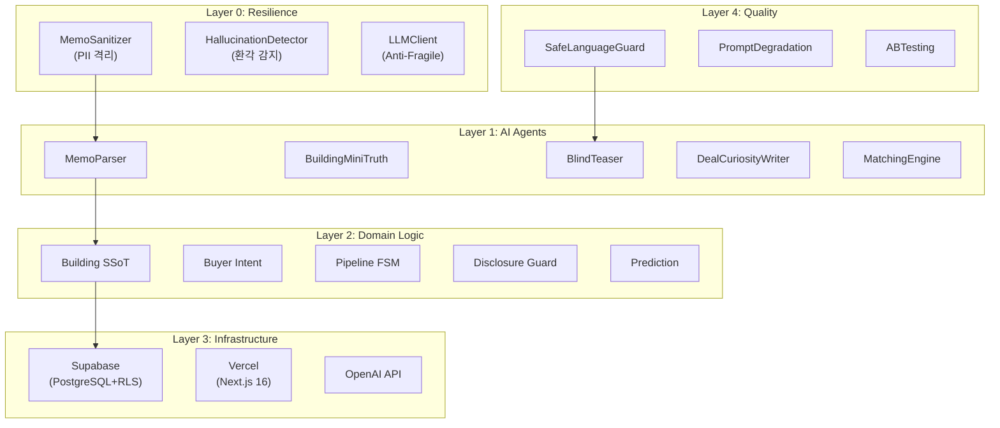
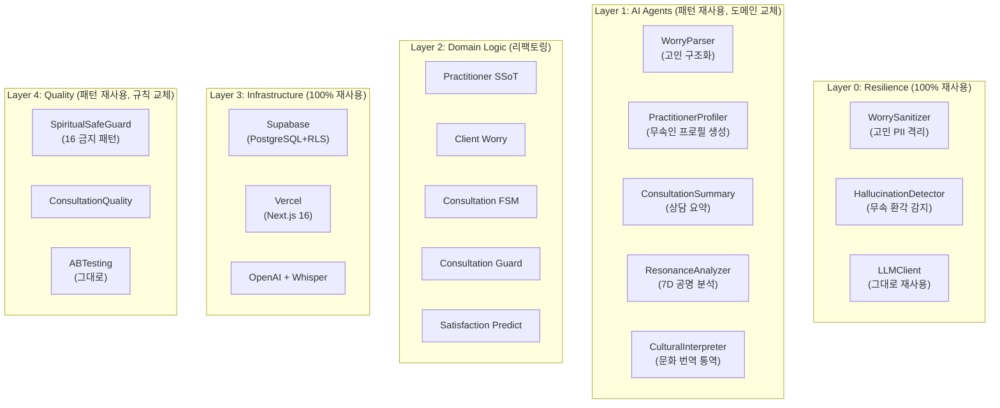
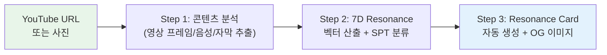
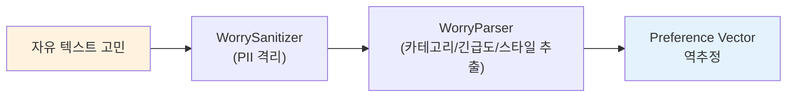
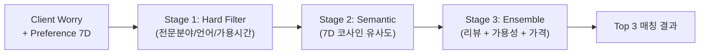
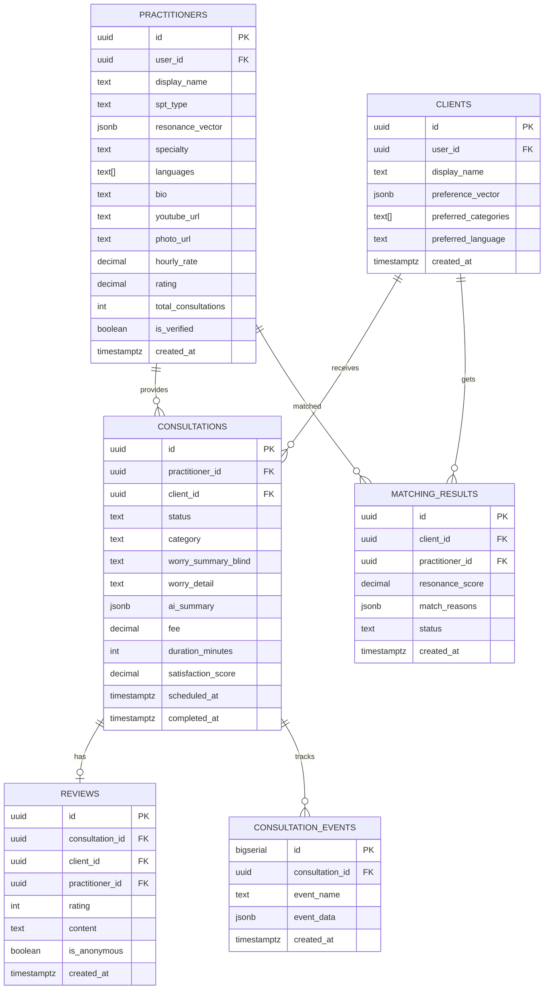

# K-Spiritual 플랫폼 — 기술 아키텍처 및 코드 재사용 계획

> **문서 버전:** v1.0  
> **작성일:** 2026-05-31  
> **원본 코드베이스:** CRE DealCard (40+ 라우트, 50+ API, 15 AI 에이전트, 28 도메인 모듈, 36 DB 테이블)

---

## 1. 아키텍처 개요

### 1.1 DealCard 원본 5-Layer 아키텍처



### 1.2 K-Spiritual 변환 5-Layer 아키텍처



### 1.3 공유 코어 vs 도메인 특화 계층 분리

| 계층 | 공유 코어 (변경 없이 재사용) | 도메인 특화 (교체/신규) |
|------|------------------------|---------------------|
| **L0 Resilience** | LLMClient, 기본 Sanitizer 구조 | 무속 PII 패턴 (건강/가족/비밀) |
| **L1 AI Agents** | 3-step chain 패턴, Zod 스키마 구조 | 프롬프트, 도메인 어휘, 출력 포맷 |
| **L2 Domain** | FSM 엔진, Matching 알고리즘 구조 | 도메인 엔티티, 비즈니스 규칙 |
| **L3 Infra** | Supabase 클라이언트, RLS 패턴, Auth | 테이블 스키마, 버킷 구조 |
| **L4 Quality** | AB 테스팅, 이벤트 트래킹 | 금지 표현 사전, 품질 기준 |

---

## 2. 기술 블록 매핑 (T1~T10)

### T1: Small Input → Rich Output

| 항목 | CRE DealCard | K-Spiritual |
|------|-------------|-------------|
| **원본 코드** | `BrokerDealCardAgent` (3-step chain) | `PractitionerProfileAgent` |
| **입력** | 카카오톡 메모 (자연어 텍스트) | YouTube URL 또는 사진 |
| **파이프라인** | MemoParser → BuildingMiniTruth → BlindTeaser | YouTubeAnalyzer → PractitionerSSoT → ResonanceCard |
| **출력** | 구조화된 딜카드 + 블라인드 티저 | 무속인 프로필 + Resonance Card |
| **변경 범위** | 파이프라인 구조 재사용 / 프롬프트+스키마 교체 | |

```typescript
// K-Spiritual 변환 예시
// 원본: src/ai/agents/broker-deal-card-agent.ts 패턴

export async function generatePractitionerProfile(input: {
  youtubeUrl?: string;
  photoUrl?: string;
  selfDescription?: string;
}) {
  // Step 1: YouTube/Photo Analysis → 기본 정보 추출
  const rawProfile = await runAI('practitioner-analyzer', {
    schema: practitionerRawSchema, // Zod v4
    prompt: PRACTITIONER_ANALYZE_PROMPT,
    input,
  });

  // Step 2: 7D Resonance Vector 산출
  const resonance = computeResonance7D(rawProfile.visualFeatures);
  const spt = classifySPT(resonance); // Spiritual Practitioner Type

  // Step 3: Resonance Card 생성 (= BlindTeaser 패턴)
  const card = await runAI('resonance-card-writer', {
    schema: resonanceCardSchema,
    prompt: RESONANCE_CARD_PROMPT,
    input: { ...rawProfile, resonance, spt },
  });

  return { rawProfile, resonance, spt, card };
}
```

### T2: 7D Trust/Affect Vector → Spiritual Resonance7D

| 항목 | CRE Vibe7D | K-Spiritual Resonance7D |
|------|-----------|------------------------|
| **파일** | `vibe-vector.ts` (157줄) | `resonance-vector.ts` |
| **Dim 1** | warmth (따뜻함) | spiritual_depth (영적 깊이) |
| **Dim 2** | energy (활력) | energy (에너지) — **유지** |
| **Dim 3** | polish (세련됨) | expressiveness (표현력) |
| **Dim 4** | authentic (진정성) | authenticity (진정성) — **유지** |
| **Dim 5** | heritage (전통성) | tradition (전통성) — **유지** |
| **Dim 6** | futuristic (혁신성) | modernity (현대성) — **유지** |
| **Dim 7** | playful (유쾌함) | charisma (카리스마) |
| **VTI** | 7 archetypes | **SPT** 7 archetypes |
| **Templates** | 32 presets | 28 spiritual presets |
| **변경 범위** | 파라미터명 변경 + 프리셋 교체 | |

```typescript
// resonance-vector.ts — vibe-vector.ts에서 파생
export interface Resonance7D {
  spiritual_depth: number; // 0~1, 영적 깊이/통찰력
  energy: number;          // 0~1, 에너지/기운의 강도
  expressiveness: number;  // 0~1, 표현력/전달력
  authenticity: number;    // 0~1, 진정성/진실됨
  tradition: number;       // 0~1, 전통 의식/의례 충실도
  modernity: number;       // 0~1, 현대적 접근/디지털 친화
  charisma: number;        // 0~1, 카리스마/존재감
}

// SPT: Spiritual Practitioner Type (VTI 대응)
export type SptType =
  | 'traditional_shrine'    // 전통신당형 — 정통 의식, 깊은 영적 전통
  | 'modern_urban'          // 현대도시형 — 카페/공유공간, 세련된 접근
  | 'youtube_star'          // 유튜브스타형 — 높은 표현력, 엔터테인먼트
  | 'scholar'               // 학자형 — 사주명리 이론, 학술적 접근
  | 'healer'                // 힐러형 — 공감, 치유, 심리 상담 성향
  | 'artist'                // 예술가형 — 의식을 예술로 승화
  | 'cosmopolitan';         // 코스모폴리탄형 — 다문화, 글로벌 지향
```

### T3: PII-First AI → WorrySanitizer

| 항목 | CRE | K-Spiritual |
|------|-----|-------------|
| **원본** | `MemoSanitizer` | `WorrySanitizer` |
| **보호 대상** | 전화번호, 이메일, 주민번호, 주소, 건물주/임차인명 | 건강상태, 가족관계, 재산정보, 주소, 실명 |
| **변경 범위** | 정규식 패턴 교체 + 카테고리 추가 | |

```typescript
// worry-sanitizer.ts
const SPIRITUAL_PII_PATTERNS = [
  { category: 'HEALTH', patterns: [/암|당뇨|우울증|불안장애|공황/g] },
  { category: 'FAMILY', patterns: [/남편|아내|시어머니|며느리|아들|딸.*이름/g] },
  { category: 'FINANCIAL', patterns: [/연봉\s*\d|대출.*\d|빚.*\d|자산.*\d/g] },
  { category: 'ADDRESS', patterns: [/[가-힣]+(시|도)\s*[가-힣]+(구|군)/g] },
  { category: 'IDENTITY', patterns: [/\d{6}[-\s]?\d{7}/g] }, // 주민번호
  { category: 'PHONE', patterns: [/01[0-9][-\s]?\d{3,4}[-\s]?\d{4}/g] },
];
```

### T4: Progressive Disclosure → Consultation Disclosure

| Level | CRE | K-Spiritual |
|-------|-----|-------------|
| L1 | broker_internal | blind_worry (블라인드 고민 요약) |
| L2 | owner_visible | practitioner_preview (무속인에게 미리보기) |
| L3 | public_blind | consultation_active (상담 진행 중) |
| L4 | public_named | follow_up (팔로업 내역) |
| L5 | blocked | blocked (차단) |

**변경 범위:** 열거형 값 교체만. Gate System (G1/G2/G3) 구조 그대로 재사용.

### T5: In-Process ML → ConsultationSatisfactionPredictor

| 항목 | CRE | K-Spiritual |
|------|-----|-------------|
| **모델** | Logistic Regression (TS) | Logistic Regression (TS) — **동일** |
| **피처** | 18D deal feature vector | 15D consultation feature vector |
| **예측 대상** | 거래 성사 확률 | 상담 만족도 예측 |
| **콜드스타트** | 휴리스틱 → 80샘플 후 전환 | 동일 패턴 |
| **변경 범위** | 피처 정의 교체. 추론 코드 100% 재사용 | |

### T6: Anti-Fragile LLM Ops → **100% 재사용**

`llm-client.ts` 전체 재사용. 멀티 프로바이더 폴백, 인메모리 캐시, 타임아웃 — 도메인 독립적 인프라.

### T7: Failure-as-Signal → Consultation Mismatch Tracker

| 항목 | CRE | K-Spiritual |
|------|-----|-------------|
| **추적 대상** | 매칭 실패, 파이프라인 정체 | 상담 불만족, 매칭 미스매치, 취소 |
| **분석 출력** | 불발 거래 선행 지표 | 어떤 유형 매칭이 실패하는지 |
| **변경 범위** | 이벤트명 + 분석 로직 교체 | |

### T8: Cold-Start Seeding → Ghost Testimonial Seeder

| 항목 | CRE | K-Spiritual |
|------|-----|-------------|
| **원본** | `ghost-demand-seeder.ts` | `ghost-testimonial-seeder.ts` |
| **시딩 내용** | 5명의 가상 매수인 | 10개의 가상 상담 후기 |
| **목적** | 즉시 매칭 데모 가능 | 신규 무속인의 초기 신뢰 구축 |
| **변경 범위** | 데이터 템플릿 교체 | |

### T9: Safe Language Guard → Spiritual SafeGuard

| # | CRE 금지 표현 (14개) | K-Spiritual 금지 표현 (16개) |
|---|---------------------|---------------------------|
| 1 | "수익률 보장" | "병이 낫습니다" (의료법 위반) |
| 2 | "확정 수익" | "100% 효과 보장" (허위 광고) |
| 3 | "무조건 상승" | "굿을 안 하면 큰일" (공포 마케팅) |
| 4 | "세금 혜택 보장" | "부적 없으면 죽습니다" (협박) |
| 5 | "규제 회피" | "전생에 ~였습니다" (검증 불가 단정) |
| 6 | "원금 보장" | "저주가 걸렸습니다" (공포 유발) |
| 7 | "세전 수익" | "반드시 굿을 해야" (강매) |
| 8 | ... (14개) | "약을 끊으세요" (의료 개입) |
| 9 | | "○○ 신이 말씀하시길" (권위 사칭) |
| 10 | | "돈을 더 내야 효과" (추가 과금 유도) |
| 11-16 | | 기타 6개 패턴 |

**변경 범위:** 금지 표현 사전 교체만. 탐지→리라이팅 메커니즘 100% 재사용.

### T10: Knowledge Graph → Practitioner-Client Graph

| 항목 | CRE | K-Spiritual |
|------|-----|-------------|
| **노드** | Building, Buyer, Deal | Practitioner, Client, Consultation |
| **엣지** | matched_with, has_deal, comparable_to, viewed | consulted_with, matched_to, referred_by, reviewed |
| **2-hop 추천** | "이 건물을 본 사람이 본 다른 건물" | "이 무속인과 상담한 사람이 찾은 다른 무속인" |
| **변경 범위** | 노드/엣지 타입 교체. 그래프 순회 알고리즘 재사용 | |

---

## 3. 도메인 벡터 재설계

### 3.1 SPT 7 Archetypes 정의

| SPT | 코드 | 한국어 | Resonance7D 특성 | 대표 이미지 |
|-----|------|--------|-----------------|-----------|
| 전통신당형 | `traditional_shrine` | 정통 의식 전문가 | tradition↑↑ spiritual_depth↑↑ | 전통 무복, 신당 배경 |
| 현대도시형 | `modern_urban` | 도시형 세련된 상담가 | modernity↑↑ expressiveness↑ | 카페/모던 공간, 캐주얼 |
| 유튜브스타형 | `youtube_star` | 미디어 크리에이터 | charisma↑↑ energy↑↑ | 스튜디오, 조명, 마이크 |
| 학자형 | `scholar` | 사주명리 학술 전문가 | spiritual_depth↑↑ authenticity↑ | 서재, 명리학 서적 |
| 힐러형 | `healer` | 치유 상담 전문가 | authenticity↑↑ energy↑ | 자연, 따뜻한 공간 |
| 예술가형 | `artist` | 의식의 예술적 승화 | expressiveness↑↑ charisma↑ | 예술 작품, 의식 도구 |
| 코스모폴리탄형 | `cosmopolitan` | 글로벌 지향 전문가 | modernity↑↑ charisma↑ | 다문화, 영어 자막 |

### 3.2 Complementary Vector 알고리즘 재사용

`vibe-complement.ts`의 보상 벡터 계산을 그대로 적용:
- 내담자 고민 유형에서 **선호 벡터 역추정**
- 결손축 식별 → 보상 벡터 합성
- Trust + Valence composite score → **Resonance Score**

```typescript
// resonance-complement.ts — vibe-complement.ts에서 파생
export function computeComplementaryResonance(
  practitionerVector: Resonance7D,
  clientPreference: Resonance7D,
): CompositeScores {
  // 코사인 유사도 + 유클리드 거리 결합 (기존 코드 그대로)
  const similarity = cosineSimilarity(
    Object.values(practitionerVector),
    Object.values(clientPreference),
  );
  const distance = euclideanDistance(
    Object.values(practitionerVector),
    Object.values(clientPreference),
  );
  return {
    resonanceScore: similarity * 0.6 + (1 - distance) * 0.4,
    trust: computeTrust(practitionerVector, clientPreference),
    valence: computeValence(practitionerVector, clientPreference),
  };
}
```

---

## 4. AI 파이프라인 설계

### 4.1 무속인 프로필 생성 파이프라인



- **재사용:** BrokerDealCardAgent 3-step chain 패턴
- **신규:** YouTube API 연동, Whisper 음성 분석

### 4.2 내담자 고민 구조화 파이프라인



- **재사용:** MemoParser 패턴 100%
- **변경:** 프롬프트 + Zod 스키마 교체

### 4.3 매칭 엔진



- **재사용:** `matching-engine.ts` 3-stage 패턴 100%
- **변경:** 필터 조건 + 가중치 교체

### 4.4 상담 요약 파이프라인 (신규)

```
상담 녹음/채팅 로그 → Whisper STT → AI 요약 
→ 핵심 인사이트 3개 + 팔로업 추천 + 주의사항
```

- **신규 개발 필요** (기존 패턴 참조하되 새로운 프롬프트)

### 4.5 AI 실시간 통역 파이프라인 (신규)

```
한국어 음성 → Whisper STT → GPT-4o 문화 번역 → TTS → 영어 음성
                                    ↕
                         문화 용어 사전 참조
                   (굿→ritual, 사주→four pillars 등)
```

- **부분 신규:** `llm-client.ts` 재사용 + Whisper/TTS 신규 연동

---

## 5. 가드레일 재설계

### 5.1 PII Guard 확장

| 카테고리 | CRE 원본 | K-Spiritual 추가 |
|----------|---------|-----------------|
| 전화번호 | ✅ | ✅ (유지) |
| 이메일 | ✅ | ✅ (유지) |
| 주민번호 | ✅ | ✅ (유지) |
| 주소 | ✅ | ✅ (유지) |
| 건물주/임차인명 | ✅ | → 가족 이름/관계 |
| 건물명 | ✅ | → 직장/학교명 |
| **건강 상태** | — | ✅ (신규) |
| **재산/부채 구체** | — | ✅ (신규) |
| **트라우마 상세** | — | ✅ (신규) |

### 5.2 Hallucination Detector 적용

| CRE 원본 | K-Spiritual |
|---------|-------------|
| 가격 이상치 감지 | 상담료 이상치 감지 (₩100만 이상 경고) |
| 면적 이상치 감지 | 상담 시간 이상치 (5시간 이상 경고) |
| 지역 환각 체크 | 전문 분야 환각 체크 (사주 전문가가 풍수 답변 등) |
| 7일 롤링 실패율 | 동일 패턴 적용 |

---

## 6. 데이터 모델 설계

### 6.1 ERD



### 6.2 DealCard 테이블 재사용 매핑

| DealCard 테이블 | K-Spiritual 대응 | 변경 수준 |
|----------------|-----------------|----------|
| profiles | profiles | 컬럼 추가 |
| broker_profiles | practitioners | 리팩토링 |
| building_ssot_lite | — (해당 없음) | — |
| building_signal_cards | resonance_cards | 리팩토링 |
| buyer_intent_lite | client_worries | 리팩토링 |
| match_results | matching_results | 컬럼 교체 |
| gate_requests | consultation_gates | 컬럼 교체 |
| activity_events | consultation_events | 컬럼 교체 |
| ai_runs | ai_runs | **100% 재사용** |
| agora_threads | testimonial_threads | 컬럼 교체 |
| vendor_profiles | vendor_profiles | **100% 재사용** |
| cre_pulses | spiritual_pulses | 컬럼 교체 |
| onboarding_sessions | onboarding_sessions | 컬럼 교체 |

---

## 7. 코드 재사용률 분석

### 카테고리별 재사용률

| 카테고리 | 파일 수 (추정) | 100% 재사용 | 파라미터 변경 | 리팩토링 | 신규 개발 | 재사용률 |
|----------|-------------|-----------|-------------|---------|----------|---------|
| **L0 Resilience** | 5 | 3 (60%) | 2 (40%) | 0 | 0 | **100%** |
| **L1 AI Agents** | 15 | 0 | 5 (33%) | 5 (33%) | 5 (33%) | **67%** |
| **L2 Domain** | 28 | 5 (18%) | 8 (29%) | 10 (36%) | 5 (18%) | **82%** |
| **L3 Infrastructure** | 10 | 8 (80%) | 2 (20%) | 0 | 0 | **100%** |
| **L4 Quality** | 8 | 4 (50%) | 3 (38%) | 1 (12%) | 0 | **100%** |
| **UI Components** | 30 | 10 (33%) | 10 (33%) | 5 (17%) | 5 (17%) | **83%** |
| **Pages/Routes** | 40 | 0 | 5 (13%) | 15 (38%) | 20 (50%) | **50%** |
| **합계** | **136** | **30 (22%)** | **35 (26%)** | **36 (26%)** | **35 (26%)** | **~74%** |

### 개발 공수 절감 효과

| 항목 | 처음부터 개발 | DealCard 기반 | 절감 |
|------|------------|-------------|------|
| 개발 기간 | 24주 (6개월) | **8주 (2개월)** | 67% 절감 |
| 개발자 수 | 3~4명 | 1~2명 | 50% 절감 |
| AI 파이프라인 | 8주 | 3주 | 63% 절감 |
| 인프라 구축 | 4주 | 0.5주 | 88% 절감 |
| 가드레일 | 4주 | 1주 | 75% 절감 |

> **핵심 결론:** DealCard 코드베이스의 **74%를 재사용**하여, 풀스크래치 대비 **67% 개발 기간 단축**이 가능하다.

---

## 8. 인프라 계획

### 8.1 프로젝트 구성

| 항목 | 결정 | 근거 |
|------|------|------|
| Supabase | **별도 프로젝트** | 데이터 격리, 독립 스케일링 |
| Vercel | 별도 프로젝트 | 독립 배포, 도메인 분리 |
| OpenAI | **공유 API 키** | 비용 효율, 통합 모니터링 |
| 코드 저장소 | **모노레포** | 공유 코어 라이브러리 import |

### 8.2 AI 비용 추정 (건당)

| 기능 | 모델 | 토큰/건 | 비용/건 |
|------|------|---------|--------|
| 무속인 프로필 생성 | GPT-4o | ~3,000 | ~$0.05 |
| 고민 구조화 | GPT-4o | ~1,500 | ~$0.03 |
| 매칭 (임베딩) | text-embedding-3-small | ~500 | ~$0.001 |
| 상담 요약 | GPT-4o | ~4,000 | ~$0.08 |
| 실시간 통역 (30분) | Whisper + GPT-4o + TTS | ~20,000 | ~$0.50 |
| **상담 1건 총합** | | | **~$0.66** |

### 8.3 월 인프라 비용 추정

| 항목 | M1 (100건/월) | M6 (1,000건/월) | M12 (5,000건/월) |
|------|-------------|----------------|-----------------|
| Supabase Pro | ₩30,000 | ₩30,000 | ₩300,000 |
| Vercel Pro | ₩25,000 | ₩25,000 | ₩100,000 |
| OpenAI API | ₩90,000 | ₩900,000 | ₩4,500,000 |
| Storage | ₩10,000 | ₩50,000 | ₩200,000 |
| **월 합계** | **₩155,000** | **₩1,005,000** | **₩5,100,000** |

---

## 9. 기술 리스크 및 완화

| 리스크 | 확률 | 영향 | 완화 전략 |
|--------|------|------|----------|
| AI 통역 품질 (latency) | 높음 | 높음 | 텍스트 채팅 폴백 + 사후 번역. Whisper streaming 도입 |
| YouTube API 일일 할당량 | 중간 | 중간 | 배치 처리 + 캐싱. 자체 크롤러 백업 |
| 동시 상담 100건+ | 낮음 | 높음 | Supabase Realtime + WebRTC SFU (Livekit) |
| GDPR 준수 | 중간 | 높음 | PII-First 아키텍처 (이미 구현). DPO 지정 |
| WebRTC 브라우저 호환 | 낮음 | 중간 | Livekit SDK. 폴백: 전화 PSTN |

---

> **문서 끝 | K-Spiritual 기술 아키텍처 및 코드 재사용 계획 v1.0**
