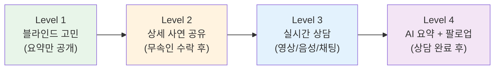
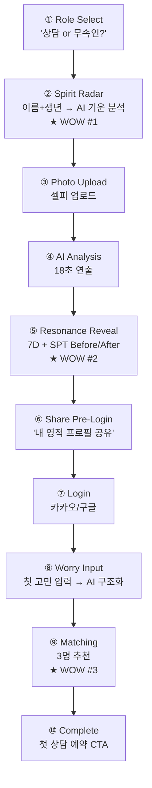
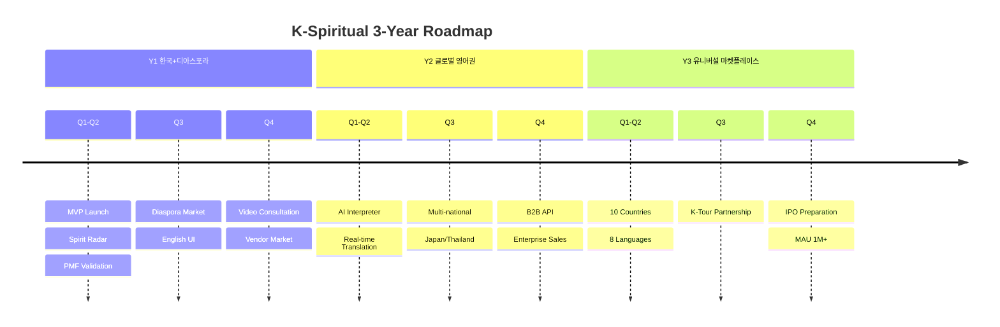

# K-Spiritual 플랫폼 — 제품 명세 및 구현 로드맵

> **문서 버전:** v1.0  
> **작성일:** 2026-05-31  
> **기술 스택:** Next.js 16 · React 19 · TypeScript · Supabase · OpenAI · Whisper · motion 12 · Tailwind 4

---

## 1. 제품 비전 및 원칙

### 1.1 제품 비전

> **"한국 무속의 4,000년 지혜를 AI로 연결하여, 세계 누구나 자신에게 맞는 영적 안내자를 즉시 만나는 경험을 제공한다."**

### 1.2 5대 제품 원칙

| # | 원칙 | 설명 | DealCard 대응 |
|---|------|------|-------------|
| 1 | **Small Input Rule** | 최소 입력(이름+생년월일 or 사진 1장)으로 최대 가치 | BrokerDealCard (메모→딜카드) |
| 2 | **Wow-Before-Login** | 가입 전에 놀라운 AI 분석 결과를 경험 | VibeCard Before/After |
| 3 | **Trust-First** | 모든 인터랙션의 기반은 정량화된 신뢰 | Trust Vector / Vibe7D |
| 4 | **Cultural Bridge** | AI가 언어뿐 아니라 문화적 맥락까지 번역 | (신규 원칙) |
| 5 | **Privacy-by-Design** | 민감한 영적 고민은 시스템적으로 보호 | PII-First AI |

---

## 2. 핵심 기능 명세 (F1~F10)

### F1. Spiritual Resonance Card (영적 공명 카드)

| 항목 | 명세 |
|------|------|
| **목적** | 무속인의 전문성과 영적 성향을 7D 벡터로 정량화한 프로필 카드 |
| **입력** | YouTube URL, 사진, 자기소개 (1개 이상) |
| **처리** | GPT-4o 비전 분석 → Resonance7D 벡터 산출 → SPT 분류 |
| **출력** | Resonance Card (이름, SPT 뱃지, 7D 레이더, 전문분야, 한줄 소개, OG 이미지) |
| **재사용** | VibeCard 컴포넌트 (VibeBackground, VibePhotoRing) |
| **특이사항** | 무속인 동의 없이 카드 외부 공유 불가. Progressive Disclosure 적용 |

```typescript
// ResonanceCard 데이터 구조
interface ResonanceCard {
  practitionerId: string;
  displayName: string;
  sptType: SptType;      // 7개 유형 중 1개
  resonance: Resonance7D; // 7D 벡터
  specialty: string[];    // ['사주', '신점', '관상']
  languages: string[];    // ['ko', 'en']
  bio: string;            // AI 생성 한줄 소개
  photoUrl: string;
  videoPreviewUrl?: string;
  rating: number;         // 4.8/5.0
  totalConsultations: number;
  ogImageUrl: string;     // 공유용 OG 이미지
}
```

### F2. Worry Structurer (고민 구조화 AI)

| 항목 | 명세 |
|------|------|
| **목적** | 내담자의 자유 텍스트 고민을 AI가 구조화하여 매칭에 활용 |
| **입력** | 자연어 텍스트 (최소 20자, 최대 2,000자) |
| **처리** | WorrySanitizer(PII 격리) → WorryParser(Zod 스키마) → Preference Vector 역추정 |
| **출력 스키마** | |

```typescript
const worrySchema = z.object({
  categories: z.array(z.enum([
    'wealth',       // 재물/사업
    'health',       // 건강
    'relationship', // 관계/궁합
    'career',       // 직업/이직
    'ancestors',    // 조상/천도
    'direction',    // 방위/풍수
    'moving',       // 이사/이전
    'naming',       // 작명
    'general',      // 종합운
  ])),
  urgency: z.enum(['low', 'medium', 'high', 'critical']),
  preferredStyle: z.enum([
    'gentle_healing',    // 부드러운 치유형
    'direct_honest',     // 직설적 솔직형
    'scholarly_deep',    // 학술적 심층형
    'spiritual_mystical', // 영적 신비형
    'practical_action',  // 실용적 행동형
  ]),
  blindSummary: z.string(), // PII 제거된 요약 (무속인에게 보여줄 용)
  estimatedDuration: z.enum(['15min', '30min', '45min', '60min']),
});
```

| **재사용** | MemoParser 패턴 100% (프롬프트+스키마 교체) |

### F3. Resonance Matching Engine (공명 매칭 엔진)

| 단계 | 입력 | 처리 | 출력 |
|------|------|------|------|
| **Stage 1: Hard Filter** | 고민 카테고리, 언어, 가용시간 | SQL WHERE 필터링 | 후보 50명 |
| **Stage 2: Semantic** | Client Preference 7D + Practitioner Resonance 7D | 코사인 유사도 + 유클리드 거리 | 상위 10명 |
| **Stage 3: Ensemble** | 리뷰 점수, 가격대, 응답률, 가용성 | 가중합 재순위 | **Top 3 추천** |

| **재사용** | `matching-engine.ts` 3-stage 패턴 100% |

### F4. Progressive Consultation Flow (점진적 상담 플로우)



| Level | 공개 범위 | 내담자 행동 | 무속인 행동 |
|-------|---------|-----------|-----------|
| **L1** | 블라인드 고민 요약 (PII 제거) | 고민 입력 | 수락/거절 결정 |
| **L2** | 상세 사연 + 생년월일시 | 결제 | 상담 준비 |
| **L3** | 실시간 소통 (AI 통역) | 상담 참여 | 상담 제공 |
| **L4** | AI 요약 + 다음 상담 추천 | 리뷰 작성 | 팔로업 메모 |

### F5. AI Real-Time Interpreter (AI 실시간 통역)

| 항목 | 명세 |
|------|------|
| **목적** | 한국어↔외국어 실시간 문화 맥락 번역 |
| **기술** | Whisper STT → GPT-4o cultural translation → TTS (ElevenLabs/Azure) |
| **지연 시간 목표** | < 3초 (발화 종료 → 번역 재생) |
| **모드** | 자막 모드 (텍스트만) / 음성 모드 (TTS 재생) / 하이브리드 |

#### 문화 용어 사전 (Core Dictionary)

| 한국어 | 영어 번역 | 문화 컨텍스트 설명 |
|--------|---------|-----------------|
| 굿 | Ritual Ceremony (Gut) | A shamanistic ritual for healing, purification, or communion with spirits |
| 사주팔자 | Four Pillars of Destiny | A divination system using birth year, month, day, and hour |
| 신점 | Spirit Reading | Divination through communication with spiritual entities |
| 무당 | Mudang (Shaman) | A Korean spiritual practitioner who mediates between human and spirit worlds |
| 살풀이 | Salpuri (Exorcism Ritual) | Ritual to dissolve negative spiritual energy |
| 천도재 | Ancestral Liberation Rite | Ceremony to guide deceased ancestors to peace |
| 부적 | Bujeok (Talisman) | A sacred paper charm inscribed with spiritual symbols |
| 관상 | Face Reading (Gwansang) | Divination based on facial features |
| 오행 | Five Elements (Oheng) | Wood, Fire, Earth, Metal, Water - cosmic forces |
| 음양 | Yin-Yang (Eumyang) | Dual cosmic principle of complementary opposites |
| 신내림 | Spirit Descent | The calling to become a shaman, often through illness |
| 몸주신 | Main Spirit Guardian | The primary spirit that guides a shaman |
| 점괘 | Divination Result | The outcome of a divination reading |
| 택일 | Auspicious Date Selection | Choosing fortunate dates for events |
| 풍수 | Feng Shui (Pungsu) | Geomancy - reading energy flows in spaces |

### F6. Consultation SafeGuard (상담 안전 가드레일)

| 가드레일 | 탐지 대상 | 조치 |
|----------|---------|------|
| **PII Guard** | 건강상태, 가족정보, 재산, 주소 | AI가 상담 전 PII 마스킹 |
| **Medical Guard** | "병이 낫습니다", "약을 끊으세요" | 실시간 경고 + 면책 고지 삽입 |
| **Fear Guard** | "굿 안 하면 큰일", "저주가 걸림" | 경고 후 3회 시 상담 중단 |
| **Price Guard** | 상담 중 추가 비용 청구 시도 | 차단 + 관리자 알림 |
| **Report System** | 내담자가 불쾌감 신고 | 즉시 상담 종료 옵션 + 환불 |

### F7. Spirit Radar (기운 레이더) — 공개 무료 도구

| 항목 | 명세 |
|------|------|
| **목적** | 비로그인 사용자에게 즉각적인 AI 분석 → Wow 모먼트 → 온보딩 전환 |
| **입력** | 이름 + 생년월일(시 선택) |
| **출력** | 기운 레이더 차트 (5대 운세: 재물/건강/관계/사업/전반), 올해 키워드 3개, 맞는 상담 유형 추천 |
| **재사용** | Building Radar 패턴 (주소→건물분석 → 이름+생년→기운분석) |
| **전환 CTA** | "더 정확한 분석을 원하시면 → 전문가 상담 받아보세요" |

### F8. Spiritual Pulse (영적 펄스)

| 항목 | 명세 |
|------|------|
| **목적** | 주간/월간 AI 생성 영적 트렌드 리포트 |
| **콘텐츠** | 이번 주 운세 트렌드, 인기 상담 카테고리, 절기별 길흉, 명언 |
| **생성 주기** | 주 1회 (월요일 자동 생성) |
| **재사용** | CRE Pulse 엔진 100% (데이터 소스 교체) |

### F9. Testimonial Agora (후기 아고라)

| 항목 | 명세 |
|------|------|
| **목적** | 상담 후기 커뮤니티 + 질의응답 |
| **구조** | 7개 카테고리(재물/건강/관계/사업/조상/풍수/종합) × AI 답변 |
| **익명 옵션** | 닉네임/완전익명 선택 가능 |
| **QIS 시딩** | 8개 페르소나 기반 시드 후기 자동 생성 |
| **재사용** | CRE Agora 100% (카테고리 + 시드 교체) |

### F10. Vendor Marketplace (부적/의식 상품)

| 항목 | 명세 |
|------|------|
| **목적** | 부적, 의식 도구, 인센스, 영적 아이템 마켓 |
| **판매자** | 무속인 직접 등록 + 검증된 공급자 |
| **카테고리** | 부적, 의식용품, 인센스/향, 크리스탈, 서적 |
| **재사용** | CRE Vendor/Services 80% (카테고리 교체) |

---

## 3. Shock & Awe 온보딩 설계 (10단계)

### 전체 플로우



### 단계별 상세 명세

| # | 단계 | 입력 | 출력 | 애니메이션 | 트래킹 |
|---|------|------|------|----------|--------|
| 1 | Role Select | 탭 선택 | role 설정 | 카드 스케일업 | `onboard_role_select` |
| 2 | Spirit Radar | 이름 + 생년월일 | 5대 기운 차트 + 키워드 | 레이더 차트 드로잉, 파티클 | `onboard_radar_done` |
| 3 | Photo Upload | 사진 파일 | 미리보기 | 원형 영역 펄스 | `onboard_photo_upload` |
| 4 | AI Analysis | — | — (18초 대기) | 체크리스트 순차 완료, 프로그레스바 | `onboard_analysis_start/done` |
| 5 | Resonance Reveal | — | 7D 벡터 + SPT + Before/After | 배경 크로스페이드, 숫자 카운트업, 뱃지 등장 | `onboard_reveal_view` |
| 6 | Share Pre-Login | — | 공유 링크 | SNS 버튼 슬라이드인 | `onboard_share_pre_login` |
| 7 | Login | 소셜 계정 | 인증 토큰 | 부드러운 전환 | `onboard_login_done` |
| 8 | Worry Input | 자유 텍스트 | 구조화된 고민 | AI 타이핑 효과 | `onboard_worry_done` |
| 9 | Matching | — | Top 3 무속인 카드 | 카드 순차 등장 (stagger) | `onboard_matching_done` |
| 10 | Complete | — | 축하 + 예약 CTA | 컨페티/파티클 + 성공 진동 | `onboard_complete` |

---

## 4. UI/UX 설계 방향

### 4.1 디자인 테마

```
Dark Mystical
├── Background: deep purple → indigo gradient (#1a0a2e → #0d1137)
├── Accent: gold (#d4af37) + soft purple glow (#8b5cf6)
├── Text: white (#fafafa) + muted (#a1a1aa)
├── Cards: glassmorphism (backdrop-blur-xl, bg-white/5)
├── Borders: subtle gold or purple gradient borders
└── Particles: floating stars, soft aura effects
```

### 4.2 타이포그래피

| 용도 | 폰트 | 굵기 | 사이즈 |
|------|------|------|--------|
| 한국어 본문 | Pretendard | 400/500 | 14~16px |
| 한국어 제목 | Pretendard | 700/800 | 24~48px |
| 영문 제목 | Cormorant Garamond | 500/600 | 24~48px |
| 숫자/데이터 | Outfit | 500 | 18~36px |

### 4.3 아이콘 시스템

| 아이콘 | 의미 | 사용처 |
|--------|------|--------|
| 🌙 | 영성/직관 | Spirit Radar |
| ⭐ | 기운/에너지 | Resonance Score |
| 🧭 | 방향/가이드 | 매칭/상담 |
| 🔮 | 점술/예측 | 사주/타로 카테고리 |
| 🪬 | 보호/부적 | SafeGuard |
| 🕯️ | 의식/치유 | 상담 진행 중 |
| 🌿 | 자연/힐링 | 힐링 카테고리 |

### 4.4 마이크로 애니메이션

| 효과 | 사용처 | 구현 |
|------|--------|------|
| Floating particles | 전역 배경 | CSS @keyframes + requestAnimationFrame |
| Aura glow | Resonance Card | box-shadow animation, hue-rotate |
| Constellation connections | 매칭 시 | SVG line draw animation |
| Count-up numbers | Score reveal | requestAnimationFrame + easeOutExpo |
| Card stagger | 매칭 결과 | motion/react stagger animation |
| Haptic feedback | 주요 전환 | navigator.vibrate() API |

---

## 5. 페이지 라우트 설계

### 5.1 Public Routes

```
/                       → 랜딩 페이지 (Spirit Radar CTA)
/explore                → 무속인 탐색 (필터: 전문분야/SPT/언어/가격)
/practitioners/[slug]   → 무속인 프로필 상세 (Resonance Card + 리뷰)
/spirit-radar           → Spirit Radar (무료 AI 기운 분석)
/pulse                  → Spiritual Pulse (주간 트렌드)
/agora                  → Testimonial Agora (후기 커뮤니티)
/services               → Vendor Marketplace (부적/용품)
/about                  → 서비스 소개
```

### 5.2 Client Routes (로그인 필요)

```
/client/dashboard       → 내 대시보드 (예약 현황, 추천)
/client/consultations   → 상담 목록 (예정/진행중/완료)
/client/consultations/[id] → 상담 상세 (채팅/영상/AI요약)
/client/history         → 상담 이력 + AI 인사이트
/client/profile         → 프로필 설정
```

### 5.3 Practitioner Routes (무속인 전용)

```
/practitioner/dashboard     → 무속인 대시보드 (수입/예약/리뷰)
/practitioner/profile       → 프로필 편집 (Resonance Card 프리뷰)
/practitioner/schedule      → 상담 일정 관리
/practitioner/consultations → 상담 관리 (수락/거절/진행)
/practitioner/analytics     → 통계 (만족도/수입/매칭률)
/practitioner/products      → 상품 등록/관리 (Vendor)
```

### 5.4 Auth Routes

```
/login                  → 소셜 로그인 (카카오/구글/애플)
/onboarding             → Shock & Awe 10단계 온보딩
```

### 5.5 API Routes

```
/api/practitioner/profile       → 무속인 프로필 CRUD
/api/practitioner/resonance     → Resonance Card 생성/조회
/api/consultation/create        → 상담 생성
/api/consultation/[id]/accept   → 무속인 수락
/api/consultation/[id]/summary  → AI 상담 요약
/api/matching/compute           → 매칭 엔진 실행
/api/matching/preferences       → 선호도 역추정
/api/pulse/generate             → Spiritual Pulse 생성
/api/pulse/latest               → 최신 Pulse 조회
/api/spirit-radar/analyze       → Spirit Radar AI 분석
/api/onboarding/analyze-photo   → 온보딩 사진 분석
/api/onboarding/save-profile    → 프로필 저장
/api/onboarding/track           → 이벤트 트래킹
/api/interpreter/session        → 통역 세션 관리
/api/agora/threads              → 후기 CRUD
/api/vendor/products            → 상품 CRUD
```

---

## 6. MVP 스코프 (Phase 1 — 8주)

### 우선순위 분류

| 등급 | 기능 | 근거 |
|------|------|------|
| **P0 (Must)** | Spirit Radar | 비로그인 유입 + Wow 모먼트 |
| **P0** | Resonance Card | 무속인 프로필 핵심 |
| **P0** | Worry Structurer | 매칭의 입력 |
| **P0** | Matching Engine | 핵심 가치 |
| **P0** | Consultation Flow (채팅 only) | MVP 상담 경로 |
| **P0** | Onboarding (10단계) | 전환 퍼널 |
| **P1 (Should)** | Spiritual Pulse | SEO + 리텐션 |
| **P1** | Testimonial Agora | 사회적 증거 |
| **P1** | Reviews | 신뢰 구축 |
| **P2 (Nice)** | AI Interpreter | 글로벌 필수 (Phase 2) |
| **P2** | Video Consultation | Phase 2 |
| **P2** | Vendor Marketplace | Phase 2 |

### Anti-Scope-Creep 규칙

1. MVP에서 영상 통화 **제외** (채팅 only)
2. 결제는 Toss Payments 단일 (글로벌 Stripe는 Phase 2)
3. 언어는 한국어 단일 (영어 UI는 Phase 2)
4. 무속인 최대 100명 (수동 온보딩)

---

## 7. 개발 스프린트 계획 (8주)

### Week 1~2: Foundation

| 항목 | 산출물 | 수용 기준 |
|------|--------|----------|
| DB 스키마 | 8개 핵심 테이블 마이그레이션 | Supabase에서 RLS 동작 확인 |
| Auth | 카카오/구글 소셜 로그인 | 로그인→대시보드 이동 확인 |
| Core Types | Resonance7D, SPT, Worry 스키마 | TypeScript 컴파일 성공 |
| API 기본 | 프로필 CRUD, Spirit Radar | curl 테스트 통과 |
| 디자인 시스템 | 색상, 타이포, 카드, 버튼 | Storybook or 데모 페이지 |

### Week 3~4: Spirit Radar + Resonance Card + Matching

| 항목 | 산출물 | 수용 기준 |
|------|--------|----------|
| Spirit Radar | 이름+생년 → AI 분석 → 레이더 차트 | 10초 내 결과 반환 |
| Resonance Card | 사진→7D 벡터→SPT→카드 | Before/After 애니메이션 동작 |
| Matching Engine | 3-stage 매칭 → Top 3 결과 | 더미 데이터로 매칭 확인 |
| Worry Structurer | 텍스트→구조화 | Zod 스키마 검증 통과 |

### Week 5~6: Consultation Flow + Onboarding

| 항목 | 산출물 | 수용 기준 |
|------|--------|----------|
| Consultation FSM | 생성→수락→진행→완료 상태 전이 | 상태 전이 테스트 통과 |
| 채팅 | Supabase Realtime 기반 1:1 채팅 | 메시지 송수신 <1초 |
| SafeGuard | 16 금지 패턴 탐지 | 테스트 케이스 100% 통과 |
| Onboarding 10단계 | 전체 플로우 | 비로그인→Spirit Radar→사진→분석→Reveal→로그인→매칭→완료 |

### Week 7: Pulse + Agora + Reviews

| 항목 | 산출물 | 수용 기준 |
|------|--------|----------|
| Spiritual Pulse | 주간 AI 리포트 자동 생성 | 콘텐츠 품질 확인 |
| Agora | 7 카테고리 후기 커뮤니티 | CRUD + QIS 시딩 5개 |
| Reviews | 상담 완료 후 리뷰 | 별점 + 텍스트 + 익명 옵션 |

### Week 8: Polish + Testing + Soft Launch

| 항목 | 산출물 | 수용 기준 |
|------|--------|----------|
| 반응형 | 375px ~ 1440px 대응 | iPhone SE에서 깨짐 없음 |
| 성능 최적화 | LCP < 2초, FID < 100ms | Lighthouse 90+ |
| E2E 테스트 | 핵심 플로우 5개 | 자동화 테스트 통과 |
| Soft Launch | 무속인 10명 + 내담자 50명 | 상담 10건 완료 |
| 피드백 수집 | 설문 + 인터뷰 | 만족도 4.0/5.0 이상 |

---

## 8. 기술 스택 상세

| 영역 | 기술 | 버전 | 용도 |
|------|------|------|------|
| **프레임워크** | Next.js | 16 | App Router, RSC, Server Actions |
| **UI** | React | 19 | UI 컴포넌트 |
| **언어** | TypeScript | 5.8+ | 타입 안전성 |
| **스타일링** | Tailwind CSS | 4 | 유틸리티 CSS |
| **애니메이션** | motion | 12 | 마이크로 애니메이션 |
| **검증** | Zod | 4 | 스키마 검증 |
| **DB** | Supabase (PostgreSQL) | - | RLS, Realtime, Auth, Storage |
| **인증** | Supabase Auth | - | 카카오/구글/애플 소셜 |
| **AI (LLM)** | OpenAI GPT-4o | - | 분석, 매칭, 번역, 요약 |
| **AI (STT)** | Whisper | v3 | 음성→텍스트 (통역) |
| **AI (Embedding)** | text-embedding-3-small | - | 의미 검색, 매칭 |
| **실시간** | Supabase Realtime | - | 채팅 |
| **영상통화** | WebRTC (Livekit) | - | Phase 2 영상 상담 |
| **결제 (국내)** | Toss Payments | - | 카드/카카오페이/네이버페이 |
| **결제 (글로벌)** | Stripe | - | Phase 2 해외 결제 |
| **분석** | Custom Events | - | DealCard 이벤트 트래킹 패턴 재사용 |
| **모니터링** | Sentry | - | 에러 추적 |

---

## 9. KPI 및 성공 지표

### 단계별 목표

| KPI | M1 | M3 | M6 | 비고 |
|-----|-----|-----|-----|------|
| **등록 무속인** | 10 | 30 | 100 | 직접 영업 → 바이럴 |
| **Spirit Radar 사용** | 50 | 500 | 5,000 | SEO + SNS 유입 |
| **가입자** | 100 | 1,000 | 10,000 | 온보딩 전환 |
| **상담 건수** | 10 | 100 | 1,000 | 핵심 거래 |
| **WAU** | — | 35% | 40% | 리텐션 |
| **MRR** | ₩50만 | ₩200만 | ₩500만 | 수수료+구독 |
| **상담 만족도** | 4.0 | 4.3 | 4.5 | /5.0 |
| **매칭→예약 전환율** | 20% | 30% | 40% | Match-to-Booking |
| **무속인 월수입** | ₩100만 | ₩200만 | ₩300만 | 상위 10% 기준 |

### 핵심 비율 (North Star Metrics)

| 지표 | 정의 | 목표 |
|------|------|------|
| **Wow-to-Login** | Spirit Radar 사용 → 가입 전환율 | 30%+ |
| **Login-to-First-Consultation** | 가입 → 첫 상담 전환율 | 10%+ |
| **Consultation-Satisfaction** | 상담 후 만족도 평균 | 4.5/5.0 |
| **Practitioner-Retention** | 무속인 월간 활성 유지율 | 80%+ |
| **Client-Repeat-Rate** | 재상담률 (3개월 내) | 40%+ |

---

## 10. 확장 로드맵 (Y1~Y3)

### Y1: Korea + Diaspora (한국어)

| Q | 마일스톤 | 핵심 기능 |
|---|---------|----------|
| Q1~Q2 | MVP 런칭 + PMF 검증 | Spirit Radar, Matching, Chat 상담 |
| Q3 | 재외동포 진출 | 영어 UI + 한국어 상담 + 영어 요약 |
| Q4 | 영상 상담 + Vendor | WebRTC 영상, 부적/용품 마켓 |

### Y2: Global English + AI Interpreter

| Q | 마일스톤 | 핵심 기능 |
|---|---------|----------|
| Q1~Q2 | AI 실시간 통역 런칭 | Whisper+GPT-4o+TTS 파이프라인 |
| Q3 | 일본·태국 무속인 온보딩 | 멀티내셔널 공급 확장 |
| Q4 | B2B API 출시 | Trust Vector API, PII Guard API 라이선싱 |

### Y3: Universal Spiritual Marketplace

| Q | 마일스톤 | 핵심 기능 |
|---|---------|----------|
| Q1~Q2 | 10개국 8개 언어 지원 | 인도 점성술사, 중국 풍수사 온보딩 |
| Q3 | K-Spiritual Tour 연계 | 서울관광공사 파트너십, 체험 관광 상품 |
| Q4 | IPO/Exit 준비 | MAU 100만+, 영업이익률 30%+ |



---

> **문서 끝 | K-Spiritual 제품 명세 및 구현 로드맵 v1.0**
