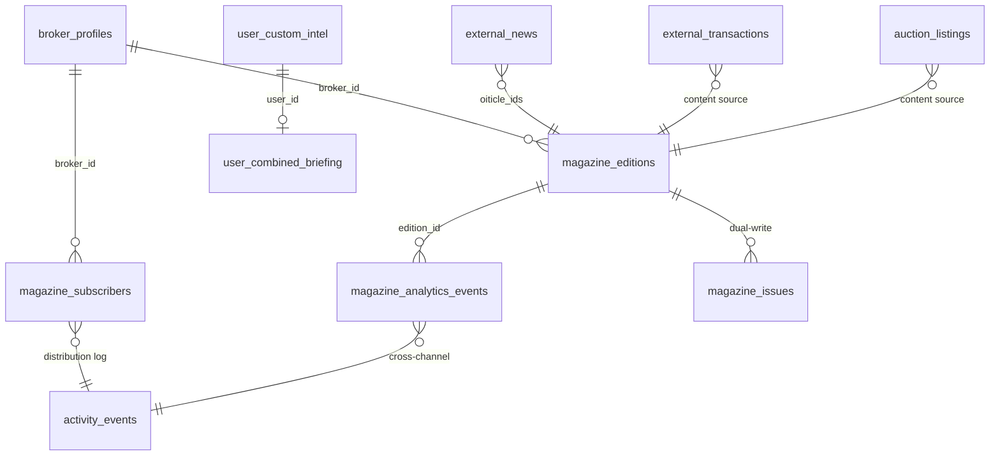

# 04. 데이터베이스 스키마 (Database Schema)

> **감사 일시**: 2026-08-28 | **감사 범위**: supabase/migrations 중 인텔리전스 & 매거진 관련 테이블

---

## 1. 마이그레이션 이력

| 마이그레이션 파일 | 주요 내용 |
|-----------------|----------|
| [`00034_poc_features.sql`](file:///c:/Users/User/cre-dealcard/supabase/migrations/00034_poc_features.sql) | 외부 데이터 수집 테이블 (뉴스, 실거래, 경매, 임대, 소셜, 유튜브) |
| [`20260622_news_pipeline_upgrade.sql`](file:///c:/Users/User/cre-dealcard/supabase/migrations/20260622_news_pipeline_upgrade.sql) | 뉴스 파이프라인 고도화 (스코어링, 토픽, 권역 컬럼 추가) |
| [`00054_magazine_issues.sql`](file:///c:/Users/User/cre-dealcard/supabase/migrations/00054_magazine_issues.sql) | 레거시 매거진 이슈 캐시 테이블 |
| [`00063_weekly_magazine.sql`](file:///c:/Users/User/cre-dealcard/supabase/migrations/00063_weekly_magazine.sql) | 매거진 에디션, 분석 이벤트, 브로커 프로필 확장 |
| [`00065_magazine_subscribers.sql`](file:///c:/Users/User/cre-dealcard/supabase/migrations/00065_magazine_subscribers.sql) | 구독자 관리, 딜 스니펫 RPC |
| [`0220_magazine_upgrade.sql`](file:///c:/Users/User/cre-dealcard/supabase/migrations/0220_magazine_upgrade.sql) | Phase 3 업그레이드 (client_id, segment, featured_teaser_ids) |

---

## 2. 모닝 인텔리전스 데이터 테이블

### 2.1 `external_news` — 시장 뉴스

| 컬럼 | 타입 | 설명 |
|------|------|------|
| `id` | UUID (PK) | |
| `title` | TEXT | 뉴스 제목 |
| `url` | TEXT (UNIQUE) | 원문 URL (중복 방지) |
| `source` | TEXT | 출처 (한경, 매경, BigKinds 등) |
| `summary` | TEXT | AI 요약 |
| `content` | TEXT | 원문 본문 |
| `sentiment` | VARCHAR | `bullish` \| `bearish` \| `neutral` |
| `importance_score` | INTEGER | CRE 적합도 (1~10) |
| `regions` | TEXT[] | 관련 권역 배열 |
| `topic` | VARCHAR | 토픽 분류 (8종) |
| `created_at` | TIMESTAMPTZ | 수집 시각 |

### 2.2 `external_transactions` — 실거래

| 컬럼 | 타입 | 설명 |
|------|------|------|
| `id` | UUID (PK) | |
| `address` | TEXT | 소재지 |
| `dong` | TEXT | 동 |
| `district` | TEXT | 구 (인덱스) |
| `usage_type` | TEXT | 용도 (인덱스) |
| `transaction_price` | BIGINT | 거래가 (인덱스) |
| `building_area` | NUMERIC | 건축면적 |
| `transaction_date` | DATE | 거래일 (인덱스) |

### 2.3 `auction_listings` — 경매 신건

| 컬럼 | 타입 | 설명 |
|------|------|------|
| `id` | UUID (PK) | |
| `case_number` | TEXT (UNIQUE) | 사건번호 |
| `court` | TEXT | 관할 법원 |
| `address` | TEXT | 소재지 |
| `appraised_value` | BIGINT | 감정가 |
| `minimum_bid` | BIGINT | 최저 입찰가 |
| `status` | TEXT | 진행 상태 |
| `auction_date` | DATE | 경매일 |
| `created_at` | TIMESTAMPTZ | 수집일 |

### 2.4 `rental_market_data` — 임대 시세 (크롤링 기반)

| 컬럼 | 타입 | 설명 |
|------|------|------|
| `id` | UUID (PK) | |
| `region` | TEXT | 권역 |
| `building_type` | TEXT | 건물 유형 |
| `deposit_avg` | BIGINT | 평균 보증금 |
| `monthly_rent_avg` | BIGINT | 평균 월세 |
| `vacancy_rate` | NUMERIC | 공실률 |
| `source` | TEXT | 데이터 출처 |
| `updated_at` | TIMESTAMPTZ | 갱신일 |

### 2.5 `rental_trend_data` — 임대 동향 (한국부동산원)

| 컬럼 | 타입 | 설명 |
|------|------|------|
| `id` | UUID (PK) | |
| `region` | TEXT | 권역 |
| `quarter` | TEXT | 분기 |
| `vacancy_rate` | NUMERIC | 공실률 |
| `rental_index` | NUMERIC | 임대 지수 |
| `created_at` | TIMESTAMPTZ | 수집일 |

### 2.6 `official_land_prices` — 공시지가

| 컬럼 | 타입 | 설명 |
|------|------|------|
| `pnu` | TEXT | 필지고유번호 (복합 PK) |
| `year` | INTEGER | 기준 연도 (복합 PK) |
| `price_per_sqm` | BIGINT | ㎡당 공시지가 |

### 2.7 `commercial_district` — 상권 분석

| 컬럼 | 타입 | 설명 |
|------|------|------|
| `id` | UUID (PK) | |
| `district_code` | TEXT (UNIQUE) | 상권 코드 |
| `district_name` | TEXT | 상권명 |
| `sales_volume_index` | NUMERIC | 외식업 매출 지수 |
| `footfall_index` | NUMERIC | 유동인구 지수 |
| `updated_at` | TIMESTAMPTZ | 갱신일 |

### 2.8 `construction_permits` — 인허가

| 컬럼 | 타입 | 설명 |
|------|------|------|
| `id` | UUID (PK) | |
| `text` | TEXT (UNIQUE) | 허가 내용 |
| `detail` | TEXT | 상세 내용 |
| `district` | TEXT | 구 |
| `region` | TEXT | 권역 |
| `created_at` | TIMESTAMPTZ | 수집일 |

### 2.9 기타 인텔리전스 테이블

| 테이블 | 주요 컬럼 | 설명 |
|--------|----------|------|
| `social_sentiment` | `keyword`, `source`, `sentiment_score`, `mention_count` | 네이버 카페/SNS 감성 지수 |
| `youtube_trends` | `video_id` (UNIQUE), `title`, `channel_title`, `view_count`, `summary` | 유튜브 CRE 트렌드 |
| `energy_ratings` | `building_id`, `rating`, `annual_energy_consumption` | 건물 에너지 효율 등급 |
| `external_reports` | `institution`, `title`, `url` (UNIQUE), `summary`, `structured_data` | CBRE/쿠시먼/알스퀘어 리포트 |
| `user_custom_intel` | `user_id`, `region`, `raw_inputs` (JSONB), `ai_summary` (JSONB) | 마이 인텔리전스 저장소 |
| `user_combined_briefing` | `user_id`, `hq_items` (JSONB), `my_items` (JSONB), `combined_briefing` | HQ+마이 결합 브리핑 |

---

## 3. 매거진 데이터 테이블

### 3.1 `magazine_issues` — 레거시 이슈 캐시

| 컬럼 | 타입 | 설명 |
|------|------|------|
| `id` | UUID (PK) | |
| `broker_id` | TEXT | 브로커 식별자 |
| `issue_date` | DATE | 발행일 |
| `content` | JSONB | 이슈 전체 콘텐츠 |

- UNIQUE 제약: `(broker_id, issue_date)`
- RLS 활성화

### 3.2 `magazine_editions` — 에디션 (주요 테이블)

| 컬럼 | 타입 | 설명 |
|------|------|------|
| `id` | UUID (PK) | |
| `broker_id` | TEXT | 브로커 식별자 |
| `edition_type` | TEXT | `daily` \| `weekly` \| `monthly` \| `special` |
| `edition_label` | TEXT | ISO 주간 라벨 (예: `W35-2026`) |
| `title` | TEXT | 에디션 제목 |
| **커버** | | |
| `market_temp` | TEXT | 시장 온도 (5종) |
| `cover_keywords` | TEXT[] | 커버 키워드 |
| `cover_image_url` | TEXT | 커버 이미지 URL |
| `theme_color` | TEXT | 테마 색상 |
| **필드노트** | | |
| `field_note` | JSONB | 브로커 5필드 현장 노트 |
| **테마** | | |
| `theme_title` | TEXT | 주간 테마 제목 |
| `theme_body_md` | TEXT | 테마 본문 (마크다운) |
| `theme_asset_types` | TEXT[] | 관련 자산 유형 |
| **콘텐츠** | | |
| `content` | JSONB | 전체 콘텐츠 (섹션별, draft_blocks 포함) |
| `oiticle_ids` | TEXT[] | 큐레이션 기사 ID |
| `featured_deal_ids` | TEXT[] | 추천 딜 ID |
| **타겟팅** | | |
| `target_segments` | TEXT[] | 타겟 세그먼트 |
| **Phase 3 확장** | | |
| `deal_id` | UUID | 연결 딜 |
| `asset_id` | UUID | 연결 자산 |
| `featured_teaser_ids` | UUID[] | 추천 티저 ID |
| **상태** | | |
| `status` | TEXT | `draft` → `published` → `archived` |
| `scheduled_at` | TIMESTAMPTZ | 예약 발행 시각 |
| `published_at` | TIMESTAMPTZ | 실제 발행 시각 |
| **성과** | | |
| `view_count` | INTEGER | 총 조회수 |
| `share_count` | INTEGER | 총 공유수 |
| **메타** | | |
| `version` | INTEGER | 에디션 버전 |
| `created_at` | TIMESTAMPTZ | 생성일 |
| `updated_at` | TIMESTAMPTZ | 수정일 |

### 3.3 `magazine_analytics_events` — 독자 분석 이벤트

| 컬럼 | 타입 | 설명 |
|------|------|------|
| `id` | UUID (PK) | |
| `edition_id` | UUID (FK) | 에디션 참조 |
| `visitor_id` | TEXT | 익명 방문자 ID |
| `visitor_fp` | TEXT | 브라우저 핑거프린트 (Phase 3) |
| `event_type` | TEXT | `page_view` \| `section_view` \| `click` \| `scroll_depth` \| `dwell` |
| `section_id` | TEXT | 섹션 식별자 |
| `target_url` | TEXT | 클릭 대상 URL |
| `dwell_seconds` | NUMERIC | 체류 시간(초) |
| `scroll_pct` | NUMERIC | 스크롤 비율(%) |
| `metadata` | JSONB | 추가 메타데이터 |
| `target_param` | TEXT | 타겟 파라미터 |
| `created_at` | TIMESTAMPTZ | 이벤트 시각 |

### 3.4 `magazine_subscribers` — 구독자

| 컬럼 | 타입 | 설명 |
|------|------|------|
| `id` | UUID (PK) | |
| `broker_id` | TEXT | 브로커 슬러그 |
| `subscriber_phone` | TEXT | 전화번호 |
| `subscriber_email` | TEXT | 이메일 |
| `subscriber_name` | TEXT | 구독자명 |
| `channel` | TEXT | `kakao` \| `email` \| `both` |
| `status` | TEXT | `active` \| `paused` \| `unsubscribed` |
| `source` | TEXT | `manual` \| `vibe_card` \| `magazine` \| `im` |
| `subscribed_at` | TIMESTAMPTZ | 구독 시작일 |
| `unsubscribed_at` | TIMESTAMPTZ | 구독 해지일 |
| `metadata` | JSONB | 추가 메타 |
| **Phase 3 확장** | | |
| `client_id` | UUID | 고객 CRM 연동 |
| `segment` | TEXT | 세그먼트 (기본: `investor`) |
| `interest_profile` | JSONB | 관심 프로필 |

- UNIQUE 제약: `(broker_id, subscriber_phone)`

### 3.5 `broker_profiles` 확장 컬럼

| 컬럼 | 추가 마이그레이션 | 설명 |
|------|--------------------|------|
| `magazine_cover_image` | `00063` | 매거진 커버 기본 이미지 |
| `pending_magazine_deals` | `00065` | IM → 매거진 대기 딜 스니펫 (JSONB) |

### 3.6 RPC 함수

| 함수 | 파라미터 | 설명 |
|------|---------|------|
| `increment_edition_views()` | `edition_id` | 에디션 조회수 원자적 증가 |
| `append_magazine_deal_snippet()` | `p_user_id`, `p_snippet` (JSONB) | IM 스니펫을 `pending_magazine_deals`에 추가 |

---

## 4. ER 다이어그램 (핵심 관계)

---

## 5. 인덱스 전략

| 테이블 | 인덱스 대상 | 용도 |
|--------|-----------|------|
| `external_transactions` | `district`, `transaction_price`, `transaction_date`, `usage_type` | 권역별·기간별 실거래 필터링 |
| `external_news` | `url` (UNIQUE) | 중복 뉴스 방지 |
| `auction_listings` | `case_number` (UNIQUE) | 중복 경매 방지 |
| `magazine_editions` | `broker_id` + `edition_label` | 브로커별 에디션 조회 |
| `magazine_subscribers` | `(broker_id, subscriber_phone)` (UNIQUE) | 중복 구독 방지 |
| `magazine_analytics_events` | `edition_id` + `created_at` | 시계열 분석 쿼리 |
