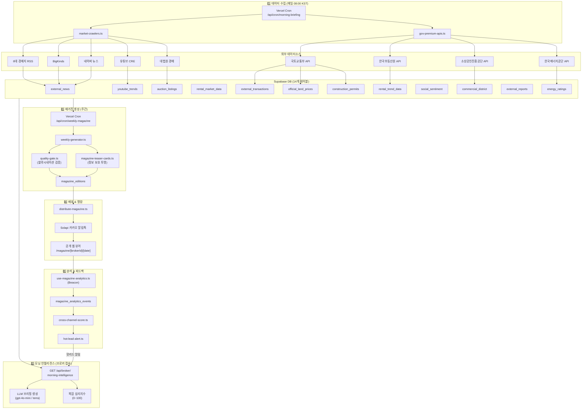
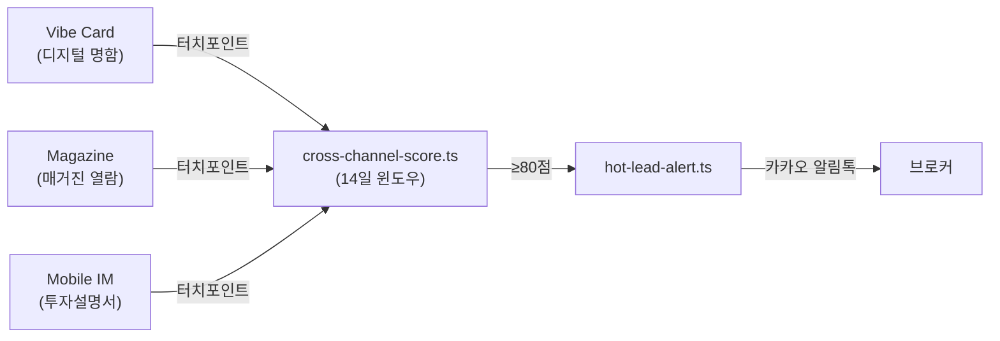
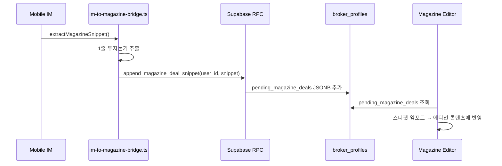
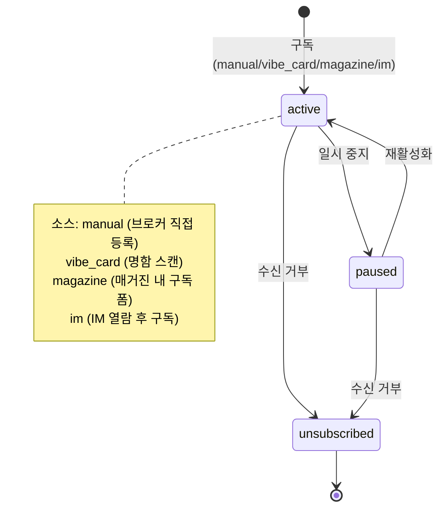
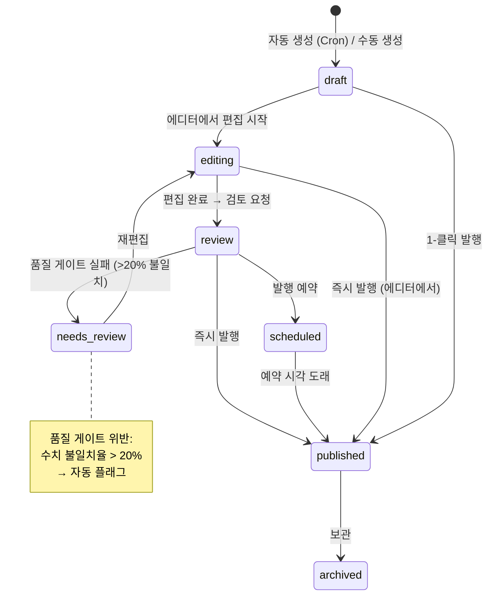

# 05. 데이터 플로우 & 통합 아키텍처 (Data Flow & Integration)

> **감사 일시**: 2026-08-28 | **감사 범위**: 전체 파이프라인 흐름, 크로스채널 분석, 피드백 루프

---

## 1. 전체 시스템 데이터 플로우



---

## 2. 모닝 인텔리전스 → 매거진 통합 플로우

```
┌──────────────────────────────────────────────────────────────────┐
│ 모닝 인텔리전스 대시보드 (MorningIntelligence.tsx)                │
│                                                                  │
│  [실거래 카드] ──── [📰 매거진 추가] ──┐                          │
│  [경매 카드] ─────  [📰 매거진 추가] ──┤                          │
│  [커스텀 브리핑] ── [📰 매거진 추가] ──┤                          │
│                                        │                         │
│                                        ▼                         │
│                             useMagazineDraft 훅                  │
│                             (5초 디바운스 자동저장)               │
│                                        │                         │
│                                        ▼                         │
│                       magazine_editions.content.draft_blocks      │
│                                        │                         │
│                                        ▼                         │
│                       매거진 에디터 (/broker/magazine-editor)     │
│                       (8탭 스튜디오)                              │
│                                        │                         │
│                                        ▼                         │
│                       발행 → 카카오 배포 → 공개 뷰어             │
└──────────────────────────────────────────────────────────────────┘
```

### useMagazineDraft 훅 상세

> 파일: [useMagazineDraft.ts](file:///c:/Users/User/cre-dealcard/src/hooks/useMagazineDraft.ts) (173 lines)

- 싱글톤 동기화 패턴
- 블록 유형: `news`, `deal`, `briefing`, `custom`
- 5초 디바운스 자동저장 → `magazine_editions.content.draft_blocks`
- 크로스뷰 동기화 (인텔리전스 ↔ 에디터)

---

## 3. 크로스채널 리드 스코어링 시스템

### 3.1 아키텍처



### 3.2 점수 가중치

> 파일: [cross-channel-score.ts](file:///c:/Users/User/cre-dealcard/src/domain/analytics/cross-channel-score.ts)

| 터치포인트 | 점수 |
|-----------|------|
| `magazine_view` (매거진 열람) | +10 |
| `magazine_subscribe` (매거진 구독) | +20 |
| `magazine_to_im_click` (매거진→IM 클릭) | +25 |
| Vibe Card 열람 | +10 |
| Vibe Card 전화 클릭 | +15 |
| Mobile IM 열람 | +15 |
| Mobile IM 다운로드 | +20 |
| **멀티채널 보너스** (3채널 모두 터치) | **+30** |

### 3.3 핫리드 판정 기준

- **기준**: 14일 윈도우 내 점수 합계 ≥ 80
- **알림**: 24시간 방문자별 중복 제거
- **채널**: 카카오 알림톡 `TPL_HOT_LEAD`
- **내용**: 점수, 터치포인트 이력, 매물 조회수

### 3.4 이벤트 수집 메커니즘

> 파일: [use-magazine-analytics.ts](file:///c:/Users/User/cre-dealcard/src/hooks/use-magazine-analytics.ts)

| 기능 | 구현 |
|------|------|
| 방문자 식별 | `btoa(UA + screen resolution)` 익명 핑거프린트 |
| 페이지뷰 | 마운트 시 자동 `page_view` 이벤트 |
| 스크롤 추적 | 25%, 50%, 75%, 100% 임계값 `scroll_depth` 이벤트 |
| 체류 시간 | `beforeunload` 시 총 `dwell` 초 계산 |
| 전송 방식 | `navigator.sendBeacon()` — UI 블로킹 없는 안정적 전송 |
| 엔드포인트 | `POST /api/public/magazine/analytics` |

---

## 4. Mobile IM ↔ 매거진 브릿지



---

## 5. 구독자 생명주기



### 구독자 자동 등록 경로

| 경로 | 트리거 |
|------|--------|
| 브로커 수동 | `/api/broker/magazine/subscribers` POST |
| 고객 신규 등록 | `/broker/clients/new` 체크박스 "주간 매거진 자동 구독" |
| 공개 구독 폼 | `/api/public/magazine/subscribe` POST |
| Vibe Card 스캔 | 명함 열람 후 구독 CTA |
| Mobile IM 열람 | IM 뷰어 내 구독 CTA |

---

## 6. 매거진 에디션 상태 머신



---

## 7. 피드백 루프 (Closed-Loop Intelligence Flywheel)

```
                    ┌─────────────────────────────┐
                    │     데이터 수집              │
                    │ (Cron + 크롤러 + 공공API)   │
                    └─────────────┬───────────────┘
                                  │
                                  ▼
                    ┌─────────────────────────────┐
                    │     모닝 인텔리전스          │
                    │ (AI 브리핑 + 개인화 액션)    │
                    └─────────────┬───────────────┘
                                  │
                                  ▼
                    ┌─────────────────────────────┐
                    │     매거진 에디터 & 발행     │
                    │ (8탭 스튜디오 + 품질 게이트) │
                    └─────────────┬───────────────┘
                                  │
                                  ▼
                    ┌─────────────────────────────┐
                    │     배포 & 열람              │
                    │ (카카오톡 + 웹 뷰어)         │
                    └─────────────┬───────────────┘
                                  │
                                  ▼
                    ┌─────────────────────────────┐
                    │     독자 분석                │
                    │ (체류, 스크롤, 클릭 추적)    │
                    └─────────────┬───────────────┘
                                  │
                                  ▼
                    ┌─────────────────────────────┐
                    │     핫리드 감지              │
                    │ (크로스채널 ≥80점)           │
                    └─────────────┬───────────────┘
                                  │
                                  ▼
                    ┌─────────────────────────────┐
                    │     브로커 알림 & CRM        │
                    │ (카카오 알림 + 액션 리스트)  │
                    └─────────────┬───────────────┘
                                  │
                  ────────────────┘
                 │ 매거진 성과가 다음 모닝 인텔리전스에
                 │ 피드백 카드(MagazineInsightCard)로 반영
                 │
                 └──────────► 데이터 수집 (순환)
```

### 피드백 포인트

| 피드백 소스 | 소비자 | 데이터 |
|------------|--------|--------|
| `magazine_analytics_events` | 모닝 인텔리전스 API | 평균 조회수, 구독자 수, 최근 발행일 |
| `MagazineInsightCard` | 브로커 대시보드 | 매거진 성과 요약 위젯 |
| `RoiCard` | 브로커 대시보드 | 비용 절감 효과 (매거진 1건당 1.5시간 절감) |
| `cross-channel-score` | 핫리드 알림 | 투자자 참여 점수 및 터치포인트 |
| `subscriber-profile` | 매수자 의향 자동 생성 | 열람 패턴 → `AutoIntent` |

---

## 8. 외부 시스템 연동 맵

| 외부 시스템 | 프로토콜 | 용도 | 관련 파일 |
|-----------|---------|------|----------|
| 국토교통부 | REST API (XML) | 실거래, 공시지가, 건축허가 | `gov-premium-apis.ts` |
| 한국부동산원 | REST API | 임대동향 | `gov-premium-apis.ts` |
| SEMAS (소상공인진흥공단) | REST API | 상권분석 | `gov-premium-apis.ts` |
| 한국에너지공단 | REST API | 에너지효율등급 | `gov-premium-apis.ts` |
| BigKinds | REST API | 빅데이터 뉴스 검색 | `market-crawlers.ts` |
| 네이버 | 뉴스 검색 API | CRE 뉴스, 감성 분석 | `market-crawlers.ts` |
| YouTube | Data API | CRE 트렌드 영상 | `market-crawlers.ts` |
| 6대 경제지 | RSS XML | 실시간 뉴스 수집 | `market-crawlers.ts` |
| OpenAI | REST API | LLM 브리핑/요약/스코어링 | `llm-client.ts` |
| Solapi | REST API (HMAC-SHA256) | 카카오 알림톡 발송 | `notification-service.ts` |
| KakaoTalk | JS SDK | 피드 카드 공유 | `MorningIntelligence.tsx` |
| Vercel | Cron, OG Image | 스케줄링, 동적 OG 이미지 | `vercel.json`, `og/magazine` |
