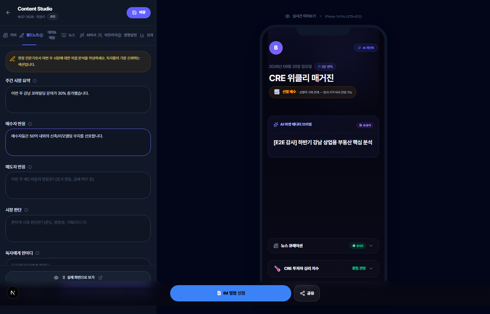
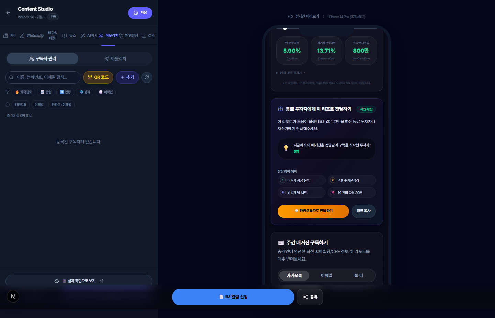

# 📘 따라하기 튜토리얼 Part 1 — 내 매거진 만들기 & 편집하기

> **대상**: 제이에스부동산중개(주) 소속 꼬마빌딩 중개인님  
> **소요 시간**: 약 30분  
> **준비물**: PC(노트북 또는 데스크톱), 인터넷 연결, 크롬 브라우저  
> **접속 주소**: [https://credeal.net](https://credeal.net)

---

## 🎯 이 튜토리얼에서 배우는 것

이 튜토리얼을 마치시면, 다음을 직접 하실 수 있게 됩니다:

1. ✅ 매거진 에디터에 접속하기
2. ✅ 시장 온도와 키워드를 설정하여 커버 꾸미기
3. ✅ 현장 노트(필드노트) 작성하기
4. ✅ 금주의 테마와 추천 매물 연결하기
5. ✅ 뉴스 큐레이션 관리하기
6. ✅ AI 비서로 전문 코멘터리 만들기
7. ✅ 구독자 관리 및 QR 코드 만들기
8. ✅ 매거진 발행하기
9. ✅ 발행 후 성과 확인하기

> 💡 **처음이시라도 걱정 마세요!** 모든 단계를 화면 그대로 따라하시면 됩니다. 천천히 한 단계씩 진행하세요.

---

## 📋 사전 준비

### 1단계. 크롬 브라우저 열기

1. 바탕화면 또는 작업 표시줄에서 **크롬(Chrome)** 아이콘을 **더블클릭** 하세요.
2. 크롬이 아직 없으시면, 인터넷 익스플로러나 엣지에서 "크롬 다운로드"를 검색하여 설치하세요.

### 2단계. CREDEAL 사이트에 로그인하기

1. 주소창에 **`credeal.net`** 을 입력하고 **Enter** 를 누르세요.
2. 화면 오른쪽 위의 **"로그인"** 버튼을 클릭하세요.
3. 가입하신 **이메일 주소**와 **비밀번호**를 입력하세요.
4. **"로그인"** 버튼을 클릭하세요.

> ⚠️ **비밀번호를 잊으셨나요?** 로그인 화면의 "비밀번호 찾기"를 클릭하시면 이메일로 재설정 링크를 받으실 수 있습니다.

---

## 실습 1. 매거진 에디터에 접속하기

### 1단계. 에디터 페이지 열기

1. 로그인 후, 주소창에 **`credeal.net/broker/magazine-editor`** 를 입력하고 **Enter** 를 누르세요.
2. 아래와 같은 화면이 나타납니다:


*▲ 매거진 에디터 첫 화면 — 왼쪽이 편집 공간, 오른쪽이 휴대폰 미리보기 화면입니다*

### 2단계. 화면 구성 이해하기

에디터는 크게 **두 영역**으로 나뉩니다:

| 위치 | 역할 | 설명 |
|------|------|------|
| **왼쪽** | 편집 패널 | 내용을 입력하고 수정하는 곳 |
| **오른쪽** | 휴대폰 미리보기 | 독자에게 보이는 모습을 실시간으로 확인 |

상단에 **8개 탭**(아이콘 버튼)이 보입니다:

| 순서 | 탭 이름 | 하는 일 |
|------|---------|---------|
| 1️⃣ | **커버** | 매거진 표지 꾸미기 |
| 2️⃣ | **필드노트** | 이번 주 현장 이야기 쓰기 |
| 3️⃣ | **테마&매물** | 금주의 테마와 추천 매물 연결 |
| 4️⃣ | **뉴스** | 부동산 뉴스 선택하기 |
| 5️⃣ | **AI비서** | AI가 전문 문장으로 바꿔주기 |
| 6️⃣ | **아웃리치** | 구독자 관리, QR코드 만들기 |
| 7️⃣ | **발행설정** | 발행 전 최종 설정 |
| 8️⃣ | **성과** | 발행 후 독자 반응 확인 |

> 💡 **왼쪽에서 뭔가 바꾸면, 오른쪽 휴대폰 화면이 바로 바뀝니다.** 실시간으로 결과를 확인하실 수 있어요!

---

## 실습 2. 커버(표지) 꾸미기

### 1단계. 커버 탭 선택하기

1. 상단 탭에서 첫 번째 아이콘인 **커버** 탭을 클릭하세요.

### 2단계. 시장 온도 선택하기

화면에 **5개 버튼**이 보입니다. 이번 주 시장 분위기에 맞는 것을 하나 클릭하세요:

| 버튼 | 의미 | 언제 선택하나요? |
|------|------|-----------------|
| 🔴 **적극 매수** | 시장이 매우 뜨겁다 | 매수 문의가 폭주할 때 |
| 🟢 **선별 매수** | 좋은 물건은 사볼 만하다 | 괜찮은 물건에만 관심이 몰릴 때 |
| 🟡 **관망** | 지켜보자는 분위기 | 매수·매도 모두 눈치보기 중일 때 |
| ⚪ **조정 대기** | 가격이 내려올 수 있다 | 호가 조정 움직임이 보일 때 |
| 🔵 **위기 경계** | 주의가 필요하다 | 금리 인상, 규제 등 악재 시 |

**실습 예시**: 이번 주가 "좋은 물건은 검토할 만한 시장"이라면, **🟢 선별 매수** 버튼을 클릭하세요.

> 👉 오른쪽 미리보기에서 커버 상단의 온도 뱃지가 바뀌는 것을 확인하세요!

### 3단계. 키워드 3개 입력하기

키워드는 이번 주 매거진의 **핵심 주제 3가지**입니다.

- **첫 번째 칸**: `금리 동결` 입력
- **두 번째 칸**: `공실률 최저` 입력  
- **세 번째 칸**: `선별 매수` 입력

> 💡 **키워드 정하기 어려우시면?** 이번 주 가장 많이 들은 단어 3개를 적으시면 됩니다. 예: "경매 증가", "역세권 강세", "금리 인하"

### 4단계. 헤드라인(제목) 입력하기

헤드라인 입력란에 이번 주 매거진의 **큰 제목**을 적으세요.

**실습 예시**:
```
하반기 금리 인하 기대 속, 강남 투자 기회 분석
```

> 👉 입력하시면 오른쪽 미리보기의 커버에 제목이 바로 나타납니다!

### 5단계. AI 브리핑 확인하기

커버 탭 하단에 **AI가 자동으로 작성한 시장 브리핑**이 있습니다.
- 내용을 읽어보시고, 수정하고 싶은 부분이 있으면 직접 고치실 수 있습니다.
- 그대로 두셔도 괜찮습니다.


*▲ 시장 온도(선별 매수)와 헤드라인을 입력한 모습*

---

## 실습 3. 필드노트(현장 이야기) 작성하기

### 1단계. 필드노트 탭으로 이동하기

1. 상단에서 두 번째 아이콘인 **필드노트** 탭을 클릭하세요.
2. **5개의 입력 칸**이 나타납니다.

### 2단계. 각 칸에 이번 주 이야기 적기

아래 예시를 참고하여, **각 칸에 직접 이번 주 내용을 적어보세요**:

---

**💬 주간 시장 요약** (첫 번째 칸)

```
이번 주 강남 꼬마빌딩 시장은 어떤 분위기인가요?
```

> 💡 여기에는 "이번 주 시장이 어땠는지"를 한 줄로 적으시면 됩니다.

---

**📈 매수자 반응** (두 번째 칸)

```
금리 인하 기대감으로 매수 문의가 전주 대비 30% 증가했습니다. 
특히 역삼·삼성 권역 50억 이하 물건에 집중됩니다.
```

> 💡 이번 주 매수 희망자들의 반응을 적어주세요. "문의가 많았다/적었다", "어떤 물건에 관심이 많았다" 등

---

**📉 매도자 반응** (세 번째 칸)

```
아직 호가 조정 의사가 낮습니다. 
매도자 대부분이 '급할 이유 없다'는 입장입니다.
```

---

**🌡️ 시장 판단** (네 번째 칸)

```
선별적 매수 기회. Cap Rate 4% 이상 물건 우선 검토 권장.
```

> 💡 Cap Rate(캡레이트)란 **수익률**이라고 생각하시면 됩니다. 숫자가 높을수록 수익이 좋은 물건이에요.

---

**💡 독자에게 한마디** (다섯 번째 칸)

```
이번 주 눈여겨볼 매물은 역삼동 5층 코너 건물입니다. 
리모델링 후 임대료 상승 여력이 큽니다.
```


*▲ 필드노트 탭 — 5개 항목에 현장 이야기를 적는 모습*

> 👉 오른쪽 미리보기를 아래로 스크롤하시면, 적으신 내용이 예쁘게 정리되어 표시됩니다!

---

## 실습 4. 테마 & 추천 매물 연결하기

### 1단계. 테마&매물 탭으로 이동하기

1. 상단에서 세 번째 아이콘 **테마&매물** 탭을 클릭하세요.

### 2단계. 이번 주 테마 입력하기

**테마 제목** 칸에 입력:
```
하반기 강남 역세권 투자 기회
```

**테마 본문** 칸에 입력 (간단하게 200자 이상):
```
최근 한국은행의 금리 동결 결정에도 불구하고, 하반기 인하 기대감이 높아지면서 
강남 역세권 꼬마빌딩에 대한 관심이 크게 증가하고 있습니다.

특히 역삼역, 삼성역 인근의 캡레이트 4% 이상 물건들은 
리모델링을 통한 가치 상승 잠재력이 높아 투자 매력이 돋보입니다.

다만 매도자들의 호가 조정 여지가 제한적이어서, 
인내심을 갖고 선별적으로 접근하시는 것이 바람직합니다.
```

### 3단계. 추천 매물 체크하기

- 테마 아래에 **보유하신 매물 목록**이 나타납니다.
- 이번 주 테마와 관련된 매물의 **체크박스(□)** 를 클릭하여 ✅ 표시하세요.
- 체크한 매물은 매거진의 "금주의 테마" 섹션에 자동으로 연결됩니다.


*▲ 테마 제목과 본문을 입력하고, 관련 매물을 체크하는 화면*

> 💡 **매물이 안 보이시나요?** CREDEAL에 매물을 등록하셔야 여기에 표시됩니다. 매물 등록은 별도 메뉴에서 하실 수 있습니다.

---

## 실습 5. 뉴스 큐레이션 관리하기

### 1단계. 뉴스 탭으로 이동하기

1. 상단에서 네 번째 아이콘 **뉴스** 탭을 클릭하세요.

### 2단계. 뉴스 카드 확인하기

- AI가 이번 주 **부동산 관련 주요 뉴스**를 자동으로 수집해 놓았습니다.
- 각 뉴스 카드에는:
  - 📰 **제목**: 뉴스 헤드라인
  - 📝 **AI 요약**: AI가 핵심만 정리한 요약문
  - ⭐ **중요도**: 별점이 높을수록 중요한 뉴스
  - 🟢/🔴/⚪ **시장 영향**: 초록(호재) / 빨강(악재) / 흰색(중립)

### 3단계. 포함할 뉴스 선택하기

- 각 뉴스 카드 옆에 **토글 스위치**(켜기/끄기 버튼)가 있습니다.
- 매거진에 **넣고 싶은 뉴스** → 토글 **켜기(파란색)**
- 매거진에서 **빼고 싶은 뉴스** → 토글 **끄기(회색)**
- 최대 **6개**까지 매거진에 포함됩니다.


*▲ 뉴스 탭 — AI가 수집한 부동산 뉴스 목록, 중요도와 시장 영향 표시*

> 💡 **뉴스를 직접 추가할 수는 없나요?** 현재는 AI가 자동 수집한 뉴스만 사용합니다. 켜기/끄기로 원하시는 뉴스를 골라주세요.

---

## 실습 6. AI 비서 활용하기

### 1단계. AI비서 탭으로 이동하기

1. 상단에서 다섯 번째 아이콘 **AI비서** 탭을 클릭하세요.

### 2단계. 간단한 메모 입력하기

AI 비서는 **거칠게 적은 현장 메모**를 **전문적인 문장**으로 바꿔줍니다.

입력 칸에 아래처럼 편하게 적어보세요:

```
이번주 역삼동 물건 좋다. 캡레이트 4.2% 리모델링하면 더 올라갈듯. 
투자자한테 추천할만함.
```

### 3단계. AI 변환 버튼 클릭하기

1. **"AI 변환"** 버튼을 클릭하세요.
2. 잠시 기다리시면(5~10초), AI가 아래처럼 전문적인 문장으로 바꿔줍니다:

> *"금주 주목할 역삼동 소재 빌딩은 현 Cap Rate 4.2%로 안정적인 수익률을 기록하고 있습니다. 리모델링을 통한 임대료 상향 조정 시 추가 수익률 개선이 기대되어, 중장기 투자자분들께 적극 검토를 권해드립니다."*

### 4단계. 변환된 문장 복사하기

1. **"복사"** 버튼을 클릭하세요.
2. 복사된 문장을 **필드노트**나 **테마 본문**에 붙여넣기(`Ctrl+V`)하실 수 있습니다.


*▲ AI 비서 탭 — 거친 메모를 넣으면 전문적인 코멘터리로 변환*

> 💡 **AI가 바꿔준 문장이 마음에 안 드시면?** 원본 메모를 수정하고 다시 변환 버튼을 눌러보세요. 또는 변환된 문장을 직접 수정하셔도 됩니다.

---

## 실습 7. 구독자 관리 & QR 코드 만들기

### 1단계. 아웃리치 탭으로 이동하기

1. 상단에서 여섯 번째 아이콘 **아웃리치** 탭을 클릭하세요.

### 2단계. 구독자 목록 확인하기

- 현재 매거진을 받아보는 **구독자 명단**이 표시됩니다.
- 각 구독자 옆에는 **매수 온도** 표시가 있습니다:
  - 🔥 적극검토 — 매수 의향이 매우 강한 분
  - 📈 관심 — 관심을 보이고 계신 분
  - ⏸️ 관망 — 지켜보고 계신 분
  - ❄️ 냉각 — 한동안 반응이 없으신 분
  - ⚪ 미확인 — 아직 매거진을 안 열어보신 분

### 3단계. 구독자 직접 추가하기 (선택사항)

명함 교환한 고객을 수동으로 추가하실 수 있습니다:

1. **"구독자 추가"** 버튼을 클릭하세요.
2. 이름: `김투자` 입력
3. 전화번호: `01012345678` 입력
4. **"추가"** 버튼 클릭
5. 목록에 새 구독자가 ⚪ 미확인 상태로 추가됩니다.

### 4단계. 구독 QR 코드 만들기 ⭐

**QR 코드**는 명함이나 현장에서 고객이 스마트폰으로 찍어서 바로 구독할 수 있는 코드입니다.

1. 아웃리치 탭 상단의 **QR 아이콘**(격자 모양) 버튼을 클릭하세요.
2. QR 코드 모달(팝업 창)이 열립니다.


*▲ QR 코드 생성 팝업 — 명함에 인쇄하거나, 현장에 비치할 수 있는 고해상도 QR 코드*

3. **"PNG 다운로드"** 버튼 클릭 → 고화질(300DPI) QR 코드 이미지가 내 PC에 저장됩니다.
4. 이 이미지를 **명함**, **브로슈어**, **임장 안내판**에 인쇄하시면 됩니다!

> 💡 **QR 코드를 찍으면 무슨 일이 생기나요?** 고객의 스마트폰에서 바로 **구독 신청 페이지**가 열립니다. 이름과 전화번호만 입력하면 매주 매거진을 받아보실 수 있어요.


*▲ 구독자 관리 화면 — 매수 온도별 필터링과 구독자 CRM*

---

## 실습 8. 발행 설정하기

### 1단계. 발행설정 탭으로 이동하기

1. 상단에서 일곱 번째 아이콘 **발행설정** 탭을 클릭하세요.

### 2단계. 기본 설정 확인하기

- **에디션 라벨**: 자동으로 `W38-2026` 같은 주차가 표시됩니다. 수정할 필요 없습니다.
- **테마 컬러**: 매거진의 대표 색상을 바꾸실 수 있습니다. 기본값 그대로 두셔도 좋습니다.

### 3단계. 타겟 독자 선택하기

매거진을 받는 독자의 성격에 따라 내용 순서가 달라집니다:

| 타겟 | 의미 | 섹션 순서 특징 |
|------|------|---------------|
| **전체(all)** | 모든 독자 대상 | 기본 순서 (권장) |
| **매수자(buyer)** | 투자/매수 관심 독자 | 추천 매물이 앞에 나옴 |
| **매도자(seller)** | 매도 관심 독자 | 시장 데이터가 앞에 나옴 |

> 💡 **처음에는 "전체"를 선택하시는 것을 권장합니다.**

### 4단계. 인터랙티브 설문 설정하기

독자에게 **1-클릭 설문**을 보내실 수 있습니다!

**설문 질문** 칸에 입력:
```
올해 하반기, 가장 관심 있는 투자 전략은?
```

**선택지 3개**:
- 선택지 1: `적극적으로 매수 검토 중`
- 선택지 2: `좋은 매물이 나오면 검토`
- 선택지 3: `보유 건물 매각을 우선 고려`

> 💡 **이 설문의 숨은 기능!** 독자가 3번(매각)을 선택하면, 시스템이 자동으로 그 독자를 "매도 관심자"로 분류합니다. 매도 물건을 접수하셨을 때 먼저 연락할 수 있어요!

### 5단계. 스토리 이미지 다운로드 (선택사항)

- **"스토리 이미지 다운로드"** 버튼을 클릭하시면
- 인스타그램 스토리용 이미지(세로형)가 자동 생성되어 다운로드됩니다.
- 이 이미지를 인스타그램 스토리에 올리시면 매거진 홍보가 됩니다!


*▲ 발행 설정 탭 — 에디션 정보, 타겟 세그먼트 및 설문 설정*

---

## 실습 9. 매거진 발행하기 🎉

### 1단계. 최종 확인

발행 전에 오른쪽 미리보기에서 전체 내용을 **위에서 아래로 스크롤**하며 확인하세요:

- [ ] 커버 제목이 올바른가?
- [ ] 시장 온도가 이번 주에 맞는가?
- [ ] 필드노트에 오타는 없는가?
- [ ] 뉴스가 적절히 선택되었는가?

### 2단계. 초안 저장 (안전하게!)

아직 확신이 없으시면 **"초안 저장"** 버튼을 먼저 클릭하세요.
- 저장이 완료되면 "저장 완료" 표시가 나타납니다.
- 나중에 다시 와서 수정하실 수 있습니다.

> 💡 **자동 저장 기능**: 편집 중 30초 동안 아무 작업을 안 하시면 자동으로 초안이 저장됩니다. 브라우저를 실수로 닫아도 내용이 사라지지 않아요!

### 3단계. 발행 & 공유

모든 내용이 확인되셨으면:

1. **"발행 & 공유"** 버튼을 클릭하세요.
2. 🎉 축하 팝업이 나타납니다!
3. 구독자들에게 **카카오톡 알림**과 **이메일**이 자동 발송됩니다.

팝업에서 추가 공유도 가능합니다:
- **"카카오톡으로 공유"** → 카카오톡 친구에게 직접 보내기
- **"링크 복사"** → 복사된 링크를 문자나 밴드에 붙여넣기

> ⚠️ **한번 발행하면 되돌릴 수 없습니다.** 꼼꼼히 확인 후 발행하세요!

---

## 실습 10. 성과 확인하기

### 1단계. 성과 탭으로 이동하기

발행 후 하루 정도 지나면, 독자들의 반응을 확인하실 수 있습니다.

1. 상단에서 여덟 번째(마지막) 아이콘 **성과** 탭을 클릭하세요.

### 2단계. 4가지 핵심 수치(KPI) 확인하기

| KPI | 의미 | 좋은 기준 |
|-----|------|----------|
| **조회수** | 매거진을 열어본 사람 수 | 구독자의 50% 이상이면 좋음 |
| **체류 시간** | 평균 몇 초 읽었는가 | 120초(2분) 이상이면 좋음 |
| **완독률** | 끝까지 읽은 비율 | 30% 이상이면 좋음 |
| **구독자 수** | 현재 활성 구독자 수 | 매주 조금씩 늘어나면 좋음 |

### 3단계. 핫리드(적극 관심 고객) 확인하기

- **🔥 적극검토** 필터를 클릭하시면
- 매거진을 자주 읽고, 매물까지 클릭해본 **가장 적극적인 독자** 목록이 나옵니다.
- 이 분들에게 먼저 전화하시면 계약 확률이 높습니다!

### 4단계. 전화 오프닝 치트시트 활용하기 (프로 팁!)

핫리드 목록에서 특정 고객의 **"전화 준비"** 버튼을 클릭하시면:
- AI가 그 고객의 **관심 매물**, **열람 패턴**을 분석하여
- **전화할 때 꺼낼 이야기 스크립트**를 만들어줍니다!

예시:
> *"김 대표님, 지난 주 보내드린 매거진에서 역삼동 캡레이트 4.2% 물건에 관심을 보여주셨는데요, 이번 주 매도자와 미팅을 했는데..."*


*▲ 성과 탭 — 독자 분석 대시보드, 핵심 수치와 매수 온도 분포*

---

## 🏆 실습 완료! 다음 단계는?

축하드립니다! 🎉 매거진 만들기의 전 과정을 마치셨습니다!

### 이번 튜토리얼에서 배우신 것:
- ✅ 에디터에 접속하여 8개 탭을 모두 둘러보기
- ✅ 커버, 필드노트, 테마, 뉴스를 직접 편집하기
- ✅ AI 비서로 전문 문장 만들기
- ✅ QR 코드 만들어서 오프라인에서 구독자 모으기
- ✅ 매거진 발행하고 성과 확인하기

### 다음 튜토리얼:
- 📗 **[Part 2: 구독자 모으기 & 바이럴 확산](./TUTORIAL_PART2_SUBSCRIBE_VIRAL.md)** — 구독 페이지 활용, 레퍼럴(전달) 시스템으로 독자를 늘리는 방법
- 📙 **[Part 3: 독자 반응 분석 & 마케팅 활용](./TUTORIAL_PART3_VIEWER_ANALYTICS.md)** — 독자가 보는 화면 이해, 수지분석 계산기, SNS 마케팅 에셋 활용

---

## ❓ 자주 묻는 질문

**Q. 매거진은 매주 꼭 만들어야 하나요?**
> 시스템이 매주 월요일 아침 7시에 자동으로 기본 매거진을 만들어줍니다. 에디터에서 필드노트와 커버만 수정하시면 됩니다. 바쁘실 때는 자동 생성본 그대로 발행하셔도 괜찮습니다.

**Q. 작성 중에 브라우저를 닫아도 괜찮나요?**
> 네, 30초마다 자동 저장됩니다. 다시 에디터에 접속하시면 마지막 작업 상태가 복원됩니다.

**Q. 발행 후 내용을 수정하고 싶으면?**
> 발행 후에는 직접 수정이 제한됩니다. 다음 주 매거진에서 수정하시거나, 긴급한 경우 관리자에게 문의해주세요.

**Q. 구독자가 하나도 없는데 발행해도 되나요?**
> 물론입니다! 먼저 매거진을 발행하고, QR 코드나 링크를 명함에 넣어 고객에게 알려주세요. 구독자는 점점 늘어납니다.
