# 📘 따라하기 튜토리얼 Part 1 — 내 매거진 만들기 & 편집하기

> **대상**: 매거진을 처음 만드는 중개사님
> **소요 시간**: 약 30분
> **준비물**: PC(노트북·데스크톱), 크롬 브라우저
> **접속 주소**: [https://credeal.net](https://credeal.net)

> [!NOTE]
> 이 문서의 각 "실습 N"은 자동 검증 스펙 [`e2e/magazine-tutorial-part1-golden.auth.spec.ts`](../../e2e/magazine-tutorial-part1-golden.auth.spec.ts)의 `test.step('실습 N …')`과 1:1로 대응합니다. 스크린샷은 모두 그 스펙이 실제 화면에서 찍은 것입니다(`p1_NN_*.png`).
> 화면 속 `E2E 테스트 브로커`, `E2E_TUT1_김투자`는 **자동 검증용 테스트 계정·테스트 구독자** 표시입니다. 실제로는 중개사님 이름과 고객 이름이 보입니다. 주소창의 `localhost:3201`도 실제 서비스에서는 `credeal.net`입니다.

---

## 🎯 이 튜토리얼에서 배우는 것

1. 매거진 에디터에 접속하고 화면 구성 이해하기
2. 시장 온도·키워드·헤드라인으로 커버 꾸미기
3. 필드노트(현장 이야기) 쓰기
4. 주간 테마와 추천 매물 연결하기
5. 뉴스 고르기(최대 6개)
6. AI 비서로 메모를 문장으로 다듬기
7. 구독자 추가·관심사 태그·QR 코드 만들기
8. 발행 설정(발송 대상·투표·섹션 노출)
9. 자동 저장 확인 → 발행 → 정정 발행
10. 성과(열람·매수 온도·핫리드) 확인하기

---

## 📋 사전 준비 — 로그인

1. 크롬 주소창에 **`credeal.net/login`** 을 입력하고 Enter를 누르세요.
2. 가입한 **이메일**과 **비밀번호**를 입력하고 **"로그인"** 을 누르세요.

> ⚠️ 로그인 화면의 **"비밀번호를 잊으셨나요?"** 링크를 누르면 비밀번호 재설정 화면(`/reset-password`)으로 이동합니다.

---

## 실습 1. 매거진 에디터에 접속하기

1. 로그인한 뒤 주소창에 **`credeal.net/broker/magazine-editor`** 를 입력하세요.
2. 상단에 **"Content Studio"** 제목과 **"내 매거진: (내 매거진 주소)"** 배지가 보입니다. 배지 옆 **"주소 복사"** 를 누르면 내 매거진 주소가 복사됩니다.
   - 매거진 주소(슬러그)는 계정마다 정해져 있고 에디터에서 바꿀 수 없습니다(발행설정 탭에서는 읽기 전용으로만 보입니다).

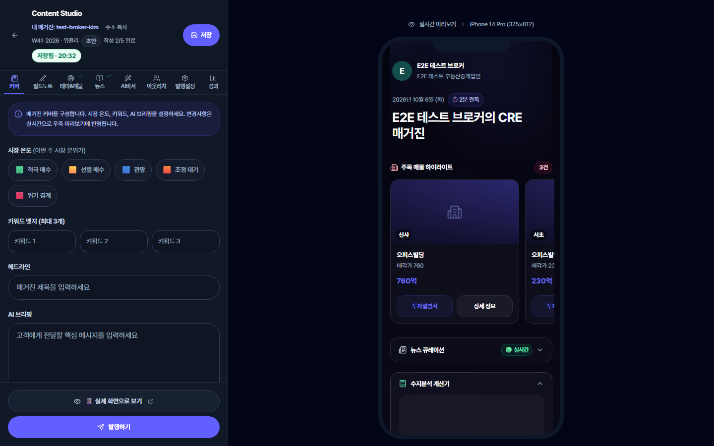
*▲ 에디터 첫 화면. 왼쪽은 편집 패널, 오른쪽은 독자가 보게 될 휴대폰 미리보기입니다.*

### 화면 구성

| 위치 | 내용 |
|------|------|
| 상단 헤더 | `W41-2026 · 위클리` 같은 **이번 주 호수 라벨**, 상태 배지(**초안**/**발행됨**), **"작성 n/5 완료"**, 저장 상태 배지, **"저장"** 버튼 |
| 탭 8개 | **커버 / 필드노트 / 테마&매물 / 뉴스 / AI비서 / 아웃리치 / 발행설정 / 성과** |
| 오른쪽 | **실시간 미리보기**. 입력 내용이 바로 반영됩니다. 미리보기 화면은 독자 통계에 집계되지 않습니다. |
| 하단 | **"📱 실제 화면으로 보기"**(오늘 날짜의 내 매거진 공개 주소를 새 창으로 엶), **"발행하기"** 버튼 |

- **"작성 n/5 완료"** 는 작성할 내용이 있는 5개 탭(커버·필드노트·테마&매물·뉴스·발행설정)만 셉니다. 다 쓴 탭에는 ✓ 표시가 붙습니다. AI비서·아웃리치·성과 탭은 개수에 들어가지 않습니다.
- 커버 탭은 **헤드라인과 AI 브리핑을 둘 다** 써야 완료로 표시됩니다.

- 1440px 화면에서도 탭 이름은 한 줄로 표시되고 옆 탭 아이콘과 겹치지 않습니다(자동 검증 항목).

---

## 실습 2. 커버(표지) 꾸미기

1. **커버** 탭을 누르세요.
2. **시장 온도 (이번 주 시장 분위기)** 에서 하나를 고르세요.

| 버튼 | 선택하면 아래에 나오는 설명 |
|------|------|
| 🟩 적극 매수 | 강한 매수 신호 — 거래량 급증, 매물 소진 빠름 |
| 🟨 선별 매수 | 선별적 기회 존재 — 입지·가격 따져 진입 가능 |
| 🟦 관망 | 관망 국면 — 뚜렷한 방향 없이 거래 위축 |
| 🟧 조정 대기 | 조정 진행 중 — 급매 나올 수 있으나 하락 리스크 상존 |
| 🟥 위기 경계 | 시장 위기 경계 — 금리·경기 악재 집중, 신규 투자 보류 권고 |

3. **키워드 벳지 (최대 3개)** 의 **키워드 1~3** 칸에 키워드를 입력하세요(칸마다 최대 12자). 예: `금리 동결`, `공실률 최저`, `선별 매수`
4. **헤드라인** 칸("매거진 제목을 입력하세요")에 제목을 입력하세요. 예: `하반기 금리 인하 기대 속, 강남 투자 기회 분석`
   - 비워 두면 표지 큰 제목에 "(내 이름)의 CRE 매거진"이 대신 표시됩니다.
5. **AI 브리핑** 칸("고객에게 전달할 핵심 메시지를 입력하세요")에 이번 주 핵심 메시지를 2~3문장으로 쓰세요.
   - 새 호수에서는 이 칸이 **비어 있습니다**. 직접 쓰셔야 합니다(자동 초안 생성은 관리자가 켠 경우에만 동작합니다 — 맨 아래 "관리자 설정" 참고).

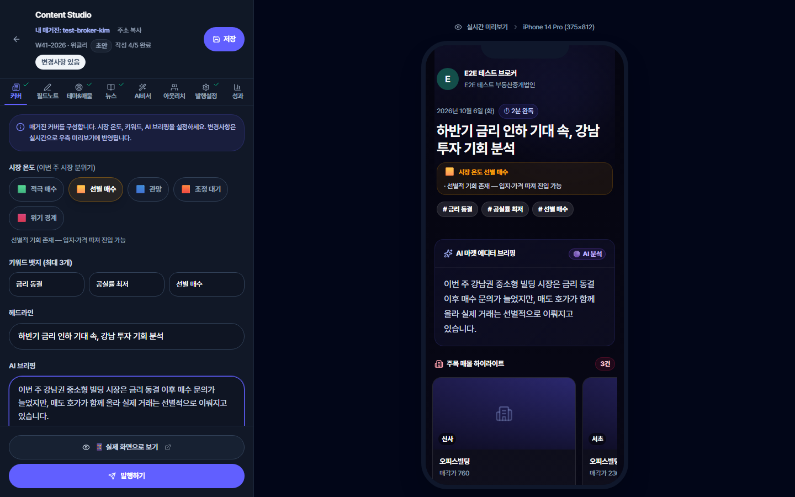
*▲ "선별 매수"를 고르고 키워드·헤드라인·브리핑을 입력한 모습. 미리보기 표지의 큰 제목에 헤드라인이, `#` 뱃지에 키워드가 바로 나타납니다.*

> 💡 **출처 표시 안내**: 공개 매거진에서 **"(이름)의 현장 노트"** 는 중개사님이 직접 쓴 글이라 "AI 분석" 표시가 붙지 않습니다. 반면 **AI 마켓 에디터 브리핑**과 **금주의 테마**에는 AI 초안이 섞일 수 있어 "🟣 AI 분석" 표시가 붙습니다. 직접 고쳐 쓰셨어도 이 표시는 그대로 남습니다.

---

## 실습 3. 필드노트(현장 이야기) 작성하기

1. **필드노트** 탭을 누르세요.
2. 5개 칸을 채우세요. 칸 이름 옆 **ⓘ("작성 도움말")** 를 누르면 작성 요령이 펼쳐집니다.

| 칸 이름 | 예시 |
|---------|------|
| **주간 시장 요약** | 이번 주 강남 꼬마빌딩 시장은 어떤 분위기인가요? |
| **매수자 반응** | 금리 인하 기대감으로 매수 문의가 전주보다 늘었습니다. 특히 역삼·삼성 권역 50억 이하 물건에 집중됩니다. |
| **매도자 반응** | 아직 호가 조정 의사가 낮습니다. 매도자 대부분이 '급할 이유 없다'는 입장입니다. |
| **시장 판단** | 선별적 매수 기회. Cap Rate 4% 이상 물건 우선 검토 권장. |
| **독자에게 한마디** | 이번 주 눈여겨볼 매물은 역삼동 5층 코너 건물입니다. 리모델링 후 임대료 상승 여력이 큽니다. |

- 한 칸이라도 쓰면 필드노트 탭이 완료(✓)로 표시됩니다.

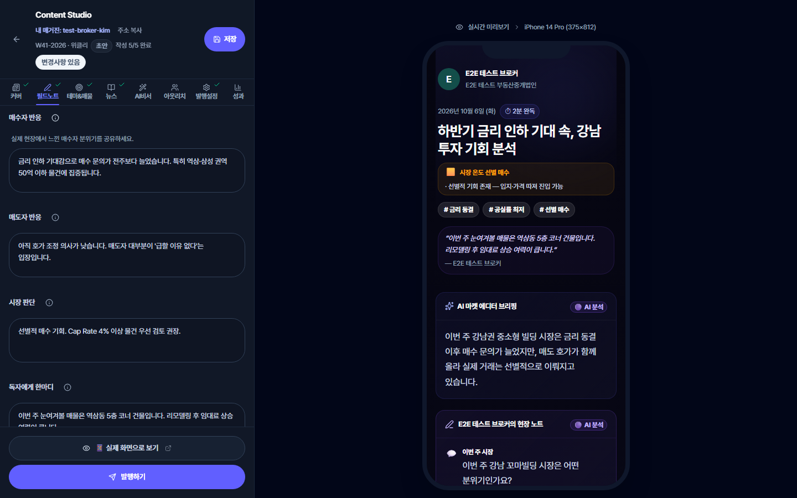
*▲ 필드노트 입력 화면. "독자에게 한마디"는 미리보기에서 인용문으로, 나머지는 "(이름)의 현장 노트"로 나타납니다.*

---

## 실습 4. 테마 & 추천 매물 연결하기

1. **테마&매물** 탭을 누르세요.
2. **테마 제목**과 **테마 본문 (마크다운)** 을 쓰세요. 예: 제목 `하반기 강남 역세권 투자 기회`
3. 아래 **주목 매물 (선택 수/전체 수)** 목록에서 매물 카드를 눌러 선택하거나 해제하세요.
   - **새 호수에서는 최근 매물 3개가 미리 선택되어 있습니다.** 필요 없는 매물은 눌러서 해제하세요. 문서 예시대로 1개를 더 고르면 4개가 됩니다.

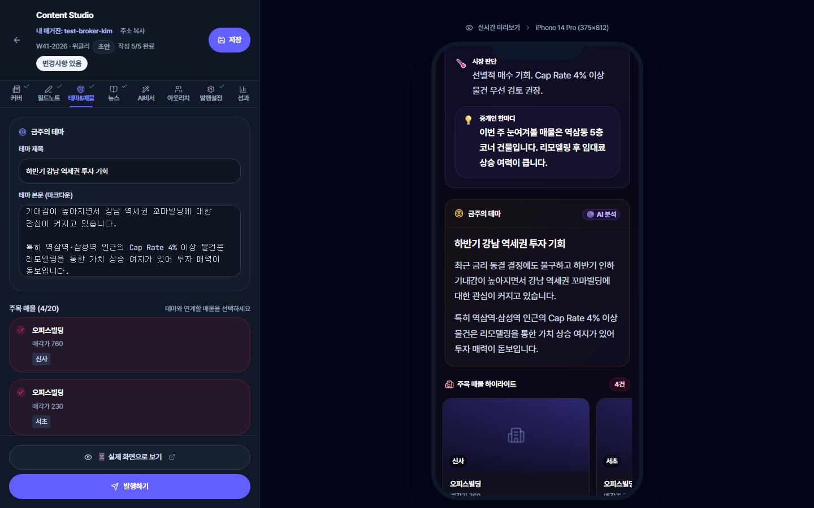
*▲ 테마 제목·본문 입력과 매물 선택. 미리보기의 "금주의 테마" 영역에 테마 제목과 본문이 나타납니다.*

---

## 실습 5. 뉴스 큐레이션 관리하기

1. **뉴스** 탭을 누르세요. 상단에 **뉴스 큐레이션 (n/6 선택)** 이 보입니다.
2. **새 호수에서는 중요도가 높은 뉴스 4개가 미리 선택되어 있습니다.**
3. 뉴스 카드를 눌러 선택·해제하세요. 카드에는 ☆ 중요도 숫자, 한글 토픽(예: 거래·매매, 기타), 출처, 논조(긍정/중립/부정)가 표시됩니다.
4. **최대 6개**까지 고를 수 있습니다. 7번째를 누르면 *"뉴스는 최대 6개까지 선택할 수 있습니다. 다른 뉴스를 먼저 해제해 주세요."* 안내가 뜨고 선택되지 않습니다.

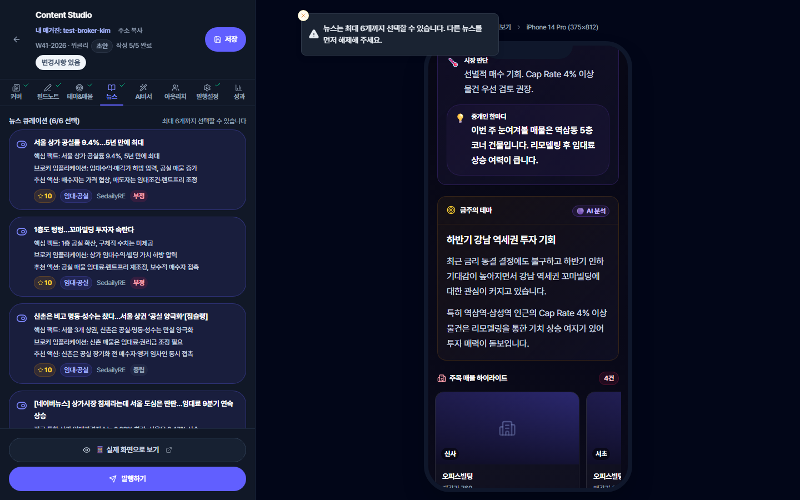
*▲ 6개를 고른 상태에서 7번째를 눌렀을 때의 안내.*

- 뉴스 제목의 따옴표·& 같은 기호는 깨지지 않고 그대로 표시됩니다(자동 검증 항목).

---

## 실습 6. AI 비서 활용하기

1. **AI비서** 탭을 누르세요.
2. 메모 칸에 짧게 적으세요. 예: `이번주 역삼동 물건 좋다. 캡레이트 4.2% 리모델링하면 더 올라갈듯. 투자자한테 추천할만함.`
3. **"✨ AI 말투 생성하기"** 를 누르세요.
4. **AI 추천 화법 (수정 가능)** 칸에 다듬어진 문장이 나옵니다. 이 칸에서 바로 고칠 수 있습니다.
5. **"복사"** 를 누르면 (고친) 문장이 복사되고, **"필드노트에 넣기"** 를 누르면 필드노트의 **독자에게 한마디** 칸에 들어가면서 필드노트 탭으로 이동합니다.

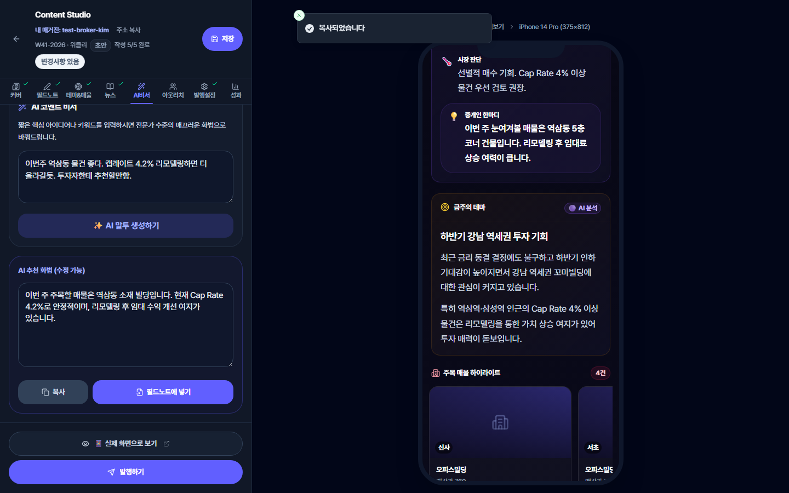
*▲ 메모 → AI 추천 화법(직접 수정한 상태) → "복사"/"필드노트에 넣기".*

**AI가 응답하지 못할 때**: *"AI 서비스를 일시적으로 사용할 수 없습니다. 잠시 후 다시 시도해주세요."* 안내가 뜹니다. 적어 둔 메모와 이전 결과는 지워지지 않으니 잠시 뒤 다시 누르세요.

*▲ AI 서비스 오류 시 안내. 메모와 이전 결과가 그대로 남아 있습니다.*

> 💡 AI비서 탭의 메모는 **다른 탭으로 옮기면 비워집니다**. 필요한 결과는 "필드노트에 넣기"나 "복사"로 먼저 옮겨 두세요.

---

## 실습 7. 구독자 관리 & QR 코드

1. **아웃리치** 탭 → **구독자 관리**를 누르세요.
2. 맨 위 안내를 확인하세요.
   - 발송이 꺼져 있으면: *"현재 발송 기능이 꺼져 있어요. 구독자를 추가해도 매주 화요일에도 매거진이 발송되지 않습니다."*
   - 켜져 있으면: *"발송 일정: 매주 화요일 오전 · 수신 동의가 확인된 구독자에게만 발송돼요."*
3. 목록 위 **매수 온도 필터**: 🔥 적극검토 / 📈 관심 / ⏸️ 관망 / ❄️ 냉각 / ⚪ 미확인

### 구독자 추가

1. **"추가"** 버튼을 누르면 **새 구독자 추가** 창이 열립니다.
2. **이름 \***, **휴대폰 번호 \*** 를 입력하세요. 번호는 숫자만 쳐도 `010-0000-1234`처럼 자동으로 하이픈이 들어갑니다.
3. **수신 채널**(카카오톡/이메일/둘 다)을 고르고, 이메일은 선택 입력입니다.
4. **"고객이 수신에 동의했음을 확인합니다"** 에 체크하세요. 체크하지 않으면 *"수신 동의 확인에 체크해 주세요."* 안내가 뜨고 추가되지 않습니다.
5. **"구독자 추가"** 를 누르세요. 새 구독자는 목록에 **⚪ 미확인** 온도로 나타납니다.

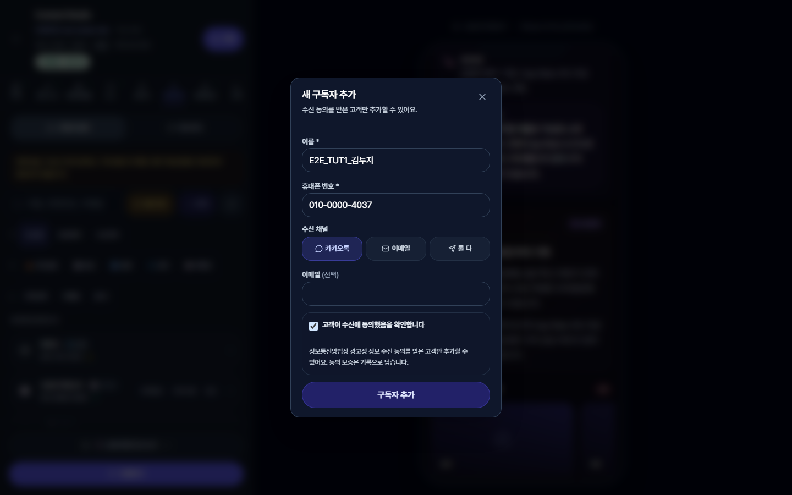
*▲ 새 구독자 추가 창(예시 번호 010-0000-xxxx).*

> [!IMPORTANT]
> **동의 기록(데이터베이스 업데이트 필요)**: 동의 이력을 저장하는 데이터베이스 업데이트가 아직 적용되지 않은 환경에서는 추가는 되지만 *"구독자를 추가했어요. 단, 동의 기록 저장 기능이 아직 준비되지 않아 동의 이력은 남지 않았어요."* 라고 안내됩니다. 이 경우 고객 동의 증빙은 별도로 보관하세요.

### 관심사 태그

1. 목록에서 구독자를 누르면 **구독자 상세** 창이 열립니다.
2. **관심사 태그**의 **관심 권역**(예: `+ 강남·서초`), **자산 유형**(예: `+ 꼬마빌딩`), **관심 토픽**, **취미**에서 버튼을 눌러 태그를 추가하세요.
3. **"변경사항 저장"** 을 누르면 *"변경사항을 저장했어요."* 가 뜹니다.

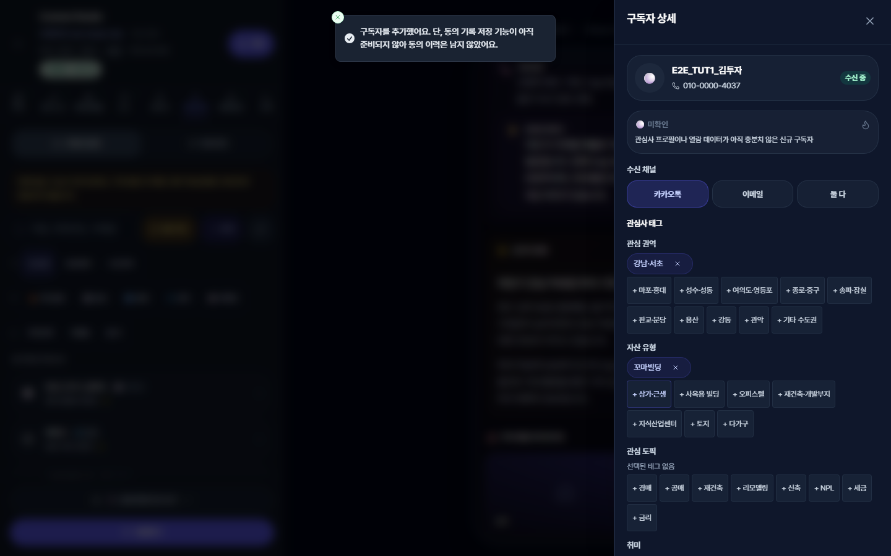
*▲ 구독자 상세에서 "강남·서초", "꼬마빌딩" 태그를 추가한 모습. 위쪽 안내는 동의 기록 미적용 환경의 실제 안내입니다.*

### QR 코드

1. **"QR 코드"** 버튼을 누르면 **오프라인 구독 QR 코드** 창이 열립니다. QR은 내 구독 페이지(`credeal.net/magazine/(내 주소)/subscribe?source=qr_card`)로 연결됩니다.
2. **"인쇄용 QR (8cm · 300DPI)"** 을 누르면 **2400×2400px, 300DPI** PNG가 내려받아집니다(8cm 인쇄용).
3. **명함 뒷면 인쇄 추천 문구**: *"스마트폰 카메라로 비추시면, 매주 화요일 (내 이름)의 시장 리포트를 받아보실 수 있습니다."*
4. **"구독 링크 복사"** 로 링크만 복사할 수도 있습니다.

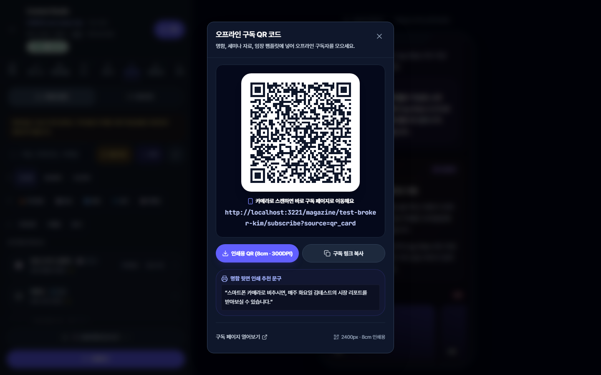
*▲ 오프라인 구독 QR 코드 창.*

---

## 실습 8. 발행 설정하기

1. **발행설정** 탭을 누르세요.
2. 확인·설정할 항목:

| 항목 | 설명 |
|------|------|
| 호수 라벨 | 이번 주(ISO 주차, 예: `W41-2026`)로 자동 표시 |
| 테마 컬러 | 색 동그라미를 누르면 선택(눌림 표시) |
| 매거진 주소 | 읽기 전용(바꿀 수 없음) |
| **발송 대상** | **전체 구독자**(기본) / **매수 관심** / **매도 관심** |
| **1-Click 투표 (선택)** | **투표 질문**과 선택지(2개 이상 채우면 게시, **"+ 선택지 추가"**). 매도 의사를 묻는 선택지에는 **"판매자 의도"** 체크 → 그 선택지를 고른 독자는 매도 관심 구독자로 분류 |
| 세무 클리닉 | 질문·답변·출처 |
| **섹션 순서·노출** | 12개 섹션(🤖 AI 브리핑, 🏗️ 필드노트, 🎯 주간 테마, 🏢 추천 매물, 📊 투표, 📈 시장 데이터, 📰 뉴스, 💰 세무 클리닉, ⚖️ 경매, 🌡️ 심리지수, 🧮 수지분석 계산기, 🎁 추천 레퍼럴). 체크를 끄면 숨겨지고 ▲▼로 순서를 바꿉니다 |
| 원페이지 이미지 (1080x1920) | **"⬇️ 이미지 다운로드"**, **"🔗 URL 복사"** — 발행한 뒤에만 누를 수 있습니다 |

예시 투표: 질문 `올해 하반기, 가장 관심 있는 투자 전략은?` / 선택지 `적극적으로 매수 검토 중`, `좋은 매물이 나오면 검토`, `보유 건물 매각을 우선 고려`(← "판매자 의도" 체크)

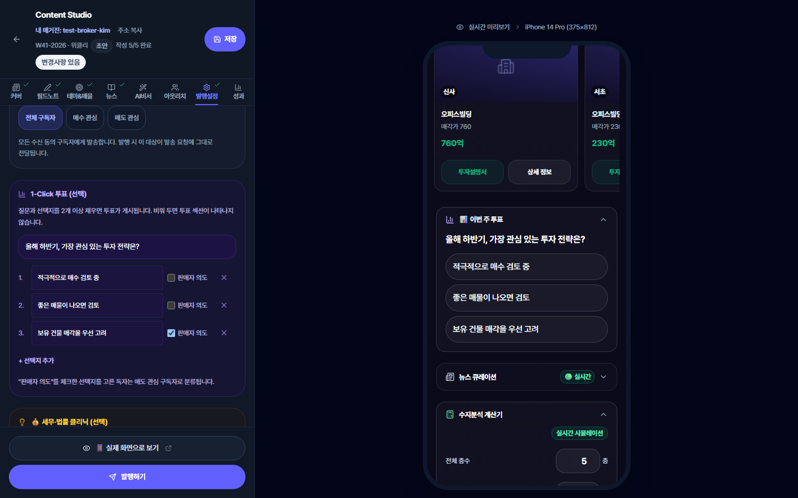
*▲ 발송 대상과 1-Click 투표 설정. 미리보기에 투표가 나타납니다.*

> [!IMPORTANT]
> **투표 집계(데이터베이스 업데이트 필요)**: 투표 결과 저장용 데이터베이스 업데이트가 적용되지 않은 환경에서는 성과 탭에 *"독자 투표 집계를 사용하려면 데이터베이스 업데이트가 필요합니다. 관리자에게 문의해 주세요."* 가 표시됩니다.

---

## 실습 9. 저장하고 발행하기

### 자동 저장

- 입력을 멈추고 **약 3초 뒤** 자동으로 저장되고, 저장 안 된 변경이 남아 있으면 **30초마다** 한 번 더 저장합니다.
- 헤더의 저장 상태 배지:

| 배지 | 뜻 |
|------|----|
| 자동 저장 켜짐 | 아직 바뀐 내용 없음 |
| 변경사항 있음 | 저장 대기 중(3초 뒤 저장) |
| 저장 중… | 저장하는 중 |
| **저장됨 · HH:MM** | 마지막 저장 시각 |
| **저장 실패** + **다시 시도** | 저장 실패. *"저장에 실패했습니다. 잠시 후 다시 시도해 주세요."* |
| 다른 곳에서 수정됨 + **새로고침** / **내 변경으로 덮어쓰기** | 다른 창에서 같은 호수를 고친 경우 |

- 헤더 **"저장"** 버튼을 누르면 바로 저장되고 *"저장되었습니다"* 가 뜹니다.
- 저장되지 않은 변경이 있을 때 창을 닫으려 하면 브라우저가 경고합니다. 다시 접속하면 헤드라인·키워드·시장 온도·필드노트·테마·매물·뉴스·투표·섹션 노출이 모두 복원됩니다.
- 임시 저장은 **공개 페이지를 바꾸지 않습니다.** 독자에게는 발행해야 보입니다.

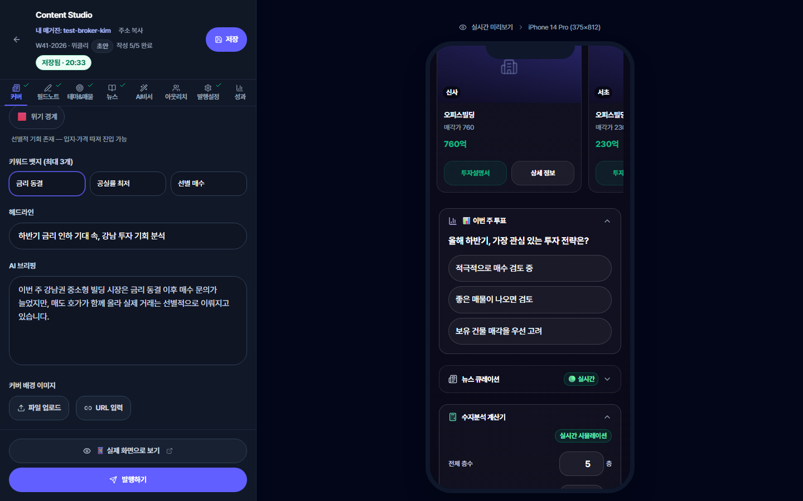
*▲ 자동 저장 후 "저장됨 · 09:38" 배지.*

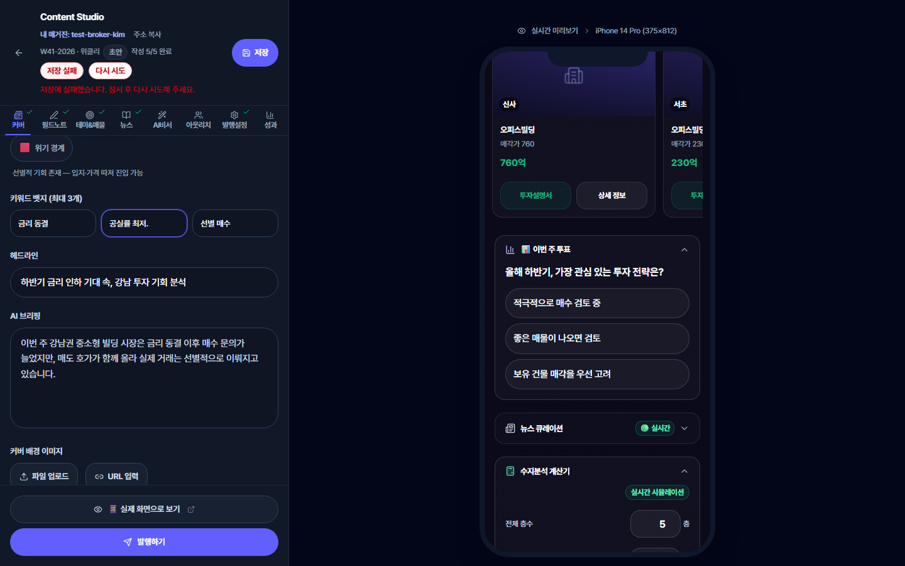
*▲ 저장 실패 시 빨간 배지와 "다시 시도". 누르면 다시 저장됩니다. 실패 뒤 내용을 직전 저장본과 똑같이 되돌려도 "다시 시도"를 누르면 배지가 풀립니다.*

### 발행

1. 하단 **"발행하기"** 를 누르면 먼저 **발행 확인** 창이 뜹니다: **발행 날짜**(오늘), **발송 대상**, **수신자 수**, **발송** 여부.
   - **"발행 후 구독자에게 발송 요청하기"** 체크 상자가 있습니다.
   - 발송이 꺼져 있으면 *"발행만 되고 구독자 발송은 중지 상태입니다(관리자 설정)"* 라고 표시됩니다.
2. 창의 **"발행하기"** 를 누르면 발행됩니다. 발송이 꺼져 있으면 *"발행은 완료되었습니다. 발송은 중지 상태입니다(관리자 설정)."* 가 뜹니다.

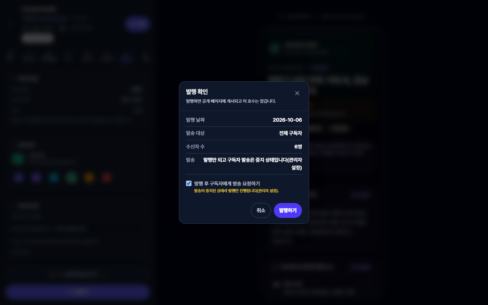
*▲ 발행 확인 창. 날짜·대상·수신자 수가 읽기 쉬운 색(대비 4.5:1 이상)으로 표시됩니다.*

3. **매거진 발행 완료!** 창에서:
   - 발송이 꺼져 있으면 *"발송은 현재 중지됨. 구독자에게는 발송되지 않았어요. 아래 링크를 직접 공유해 주세요."*
   - **"카카오톡으로 1:1 수동 공유"**, **"개인화 매거진 링크 복사하기"**(오늘 날짜의 내 매거진 주소가 복사됨)

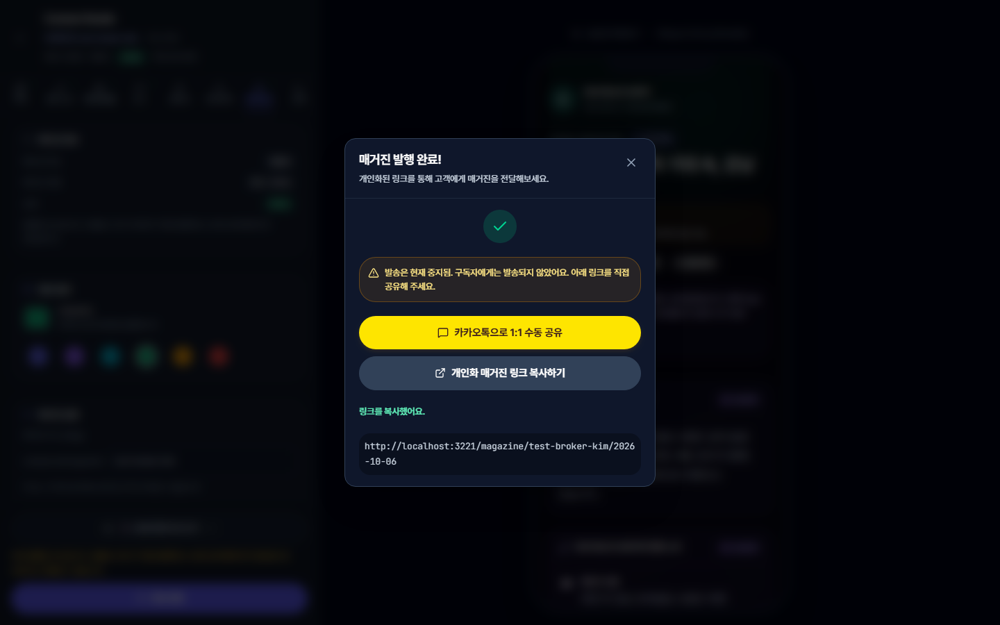
*▲ 발행 완료 창. 발송 중지 안내와 공유 버튼.*

> [!NOTE]
> 플랜에 따라 발송 채널이 다릅니다. **카카오 알림은 유료 플랜에서만** 발송되고, 무료(free) 플랜은 **이메일로만** 발송됩니다(이메일 주소가 있는 구독자). 실제 발송은 관리자가 발송 기능을 켠 뒤에만 이뤄집니다.

### 발행 후 — 정정 발행

- 발행되면 상태가 **발행됨**으로 바뀌고 헤더의 **"저장"** 버튼이 사라집니다. 발행된 호수는 **자동 저장되지 않습니다.**
- 하단 안내: *"이미 발행된 호수입니다. 내용을 고친 뒤 "정정 발행"을 누르면 공개 페이지가 갱신됩니다. 초안으로 되돌릴 수 없습니다."*
- 내용을 고치고 **"정정 발행"** → **정정 발행 확인** 창(*"정정 발행은 공개 페이지만 갱신하며 이메일을 다시 보내지 않습니다"*) → 확인.
- 발행 후에는 발행설정 탭의 **"⬇️ 이미지 다운로드"**, **"🔗 URL 복사"** 가 활성화됩니다.

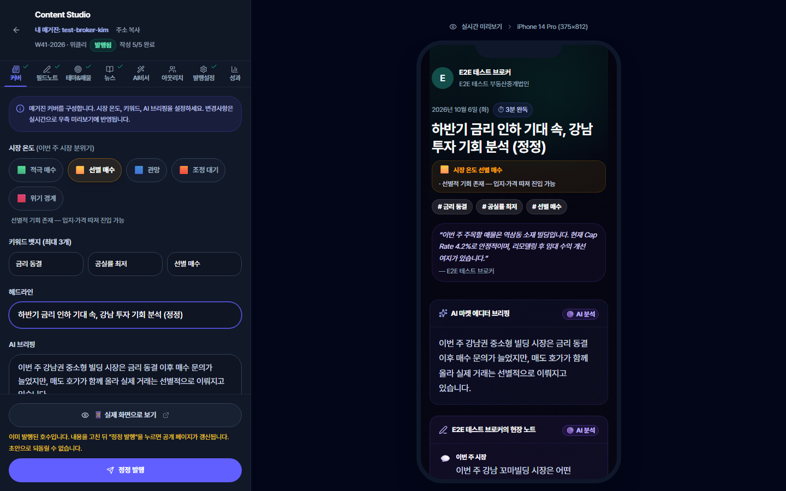
*▲ 발행된 호수. 헤드라인을 고친 뒤 "정정 발행"으로 공개 페이지를 갱신합니다.*

---

## 실습 10. 성과 확인하기

1. **성과** 탭을 누르세요(**독자 인텔리전스 & 성과 대시보드**). **"새로고침"** 으로 최신 수치를 불러옵니다.
2. **KPI 4종** — 각 카드의 ⓘ(**"… 기준 보기"**)를 누르면 정의가 펼쳐집니다.

| KPI | "기준 보기" 정의(화면 문구) |
|-----|------|
| **30일 총 열람** | 최근 30일 동안 발행된 호수를 연 횟수입니다. 같은 방문자가 30분 안에 다시 열면 1회로 셉니다. (아래 "고유 방문자"는 열람한 브라우저 수라 사람 수와 다를 수 있습니다) |
| **평균 체류시간** | 한 번 방문할 때 화면을 보고 있던 시간(초)의 평균입니다. 탭을 숨기거나 앱을 전환한 시간은 제외합니다. |
| **완독률** | 열람한 방문자 중 페이지 끝(100%)까지 스크롤한 방문자의 비율입니다. |
| **활성 구독자** | 현재 수신 중(활성) 상태인 구독자 수입니다. 수신 거부·보류는 제외합니다. |

3. **매수 온도** — 화면 안내: *"관심사·읽은 이력(40%)과 최근 열람·클릭 행동(60%)… 6개월 이상 열람이 없으면 냉각입니다."*
   - 점수(0~100) = 관심사·읽은 이력 점수 × 0.4 + 최근 행동 점수 × 0.6
   - 단계: **🔥 적극검토 80+** / **📈 관심 60+** / **⏸️ 관망 40+** / **❄️ 냉각 20+** / **⚪ 미확인 20 미만**
   - 최근 행동 점수(항목별 상한, 합계 최대 100):

| 행동 | 1회 점수 | 상한 |
|------|---------|------|
| 매거진 열람 | +5 | 30 |
| 섹션 열람 | +1 | 10 |
| 30초 이상 체류 | +5 | 10 |
| 끝까지 스크롤 | +5 | 5 |
| 투표 참여 | +15 | 15 |
| 수지분석 계산기 사용 | +10 | 10 |
| 매물 클릭 | +20 | 40 |
| IM 요청 | +30 | 30 |
| 전화 클릭 | +25 | 25 |
| 문의(카톡·연락·상담 클릭) | +20 | 20 |

   - 최근 14일 안에 **IM 요청**이나 **전화 클릭**이 있으면 최소 📈 관심(60)으로 올립니다.
   - 마지막 열람 후 183일(약 6개월)이 지나면 점수와 관계없이 ❄️ 냉각입니다.
4. **매수 온도 단계별 구독자 수**(🔥 적극검토 · 📈 관심 · ⏸️ 관망 · ❄️ 냉각 · ⚪ 미확인 5단계)로 고객 분포를 한눈에 봅니다.
5. **지금 연락해야 할 핫리드** — 반응 점수 상위 10명입니다. **핫리드 선별 기준**(관심 이상 / 적극검토만 / 반응 있는 전체)을 바꿔 범위를 조절할 수 있고, 열람 0회·❄️ 냉각 고객은 목록에서 제외됩니다. 고객 옆 **"통화 브리핑(템플릿)"** 을 누르면 **"(이름) 고객 통화 브리핑"** 창이 열립니다.
   - *"통화 전 참고용 템플릿입니다 (AI 생성 아님)."* — 실제 열람 기록과 관심 태그만으로 채운 **고정 문구**입니다. **"문구 복사"** 로 복사할 수 있습니다.

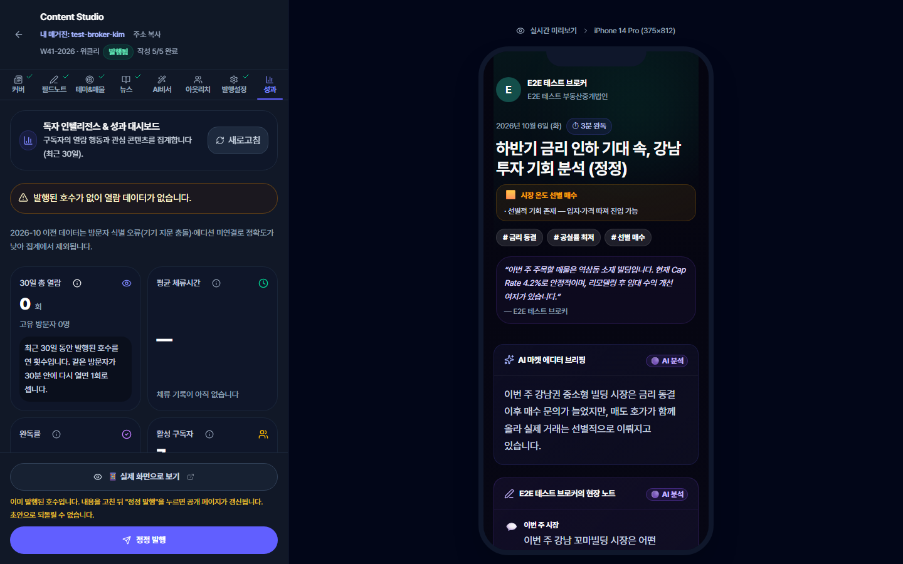
*▲ 성과 탭. 아직 열람 데이터가 없는 계정의 화면입니다(예: 발행 직후).*

---

## 부록. 모바일(휴대폰)에서 편집하기

- 휴대폰(가로 390px)에서도 에디터가 열리며 가로 스크롤은 생기지 않습니다.
- 탭은 아이콘으로 표시되고 **선택한 탭만 이름이 보입니다**(화면 읽기 프로그램에는 모든 탭 이름이 전달됩니다).
- 하단 **"발행하기"/"정정 발행"** 버튼은 가려지지 않습니다.

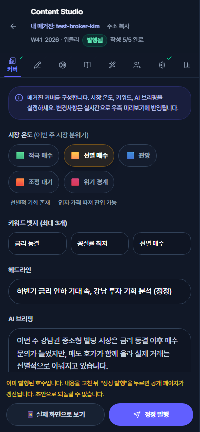
*▲ 390×844 화면의 에디터.*

- 탭 바와 하단 "📱 실제 화면으로 보기"·발행 버튼 사이에 편집 영역이 250px 이상 확보되어 휴대폰에서도 입력칸을 쓸 수 있습니다(자동 검증 항목). 다만 화면이 작아 긴 글은 PC에서 쓰는 편이 편합니다.

---

## ❓ 자주 묻는 질문

**Q. 매거진은 매주 자동으로 만들어지나요?**
> 에디터에 들어가면 **이번 주 호수 초안이 자동으로 준비**됩니다(새 초안에는 매물 3개·뉴스 4개가 미리 선택되고 커버 브리핑은 비어 있음). 주간 자동 초안 생성(월요일 오전 10시, KST)은 관리자가 켠 경우에만 동작하며, 생성돼도 **자동으로 발송되지 않습니다.** 검토 후 직접 발행하세요.

**Q. 작성 중에 브라우저를 닫아도 괜찮나요?**
> 입력을 멈추고 약 3초 뒤 자동 저장되고, 남은 변경은 30초마다 저장됩니다. 헤더 배지가 **"저장됨 · HH:MM"** 인지 확인하고 닫으세요. 저장 안 된 변경이 있으면 브라우저가 닫기 전에 경고합니다.

**Q. 발행 후 내용을 고치고 싶으면?**
> 고친 뒤 **"정정 발행"** 을 누르세요. 공개 페이지만 갱신되고 이메일은 다시 보내지 않습니다. 발행된 호수를 초안으로 되돌릴 수는 없습니다.

**Q. 발행했는데 고객에게 안 갔어요.**
> 발송 기능이 꺼져 있으면 **"발행은 완료, 발송은 중지"** 상태입니다. 발행 완료 창의 링크를 카카오톡 등으로 직접 공유하세요. 무료 플랜은 이메일만 발송됩니다.

**Q. 구독자가 하나도 없는데 발행해도 되나요?**
> 됩니다. 발행한 뒤 QR 코드나 링크를 명함·카톡으로 알려 구독자를 모으세요. QR은 매거진 주소(슬러그)가 바뀌지 않는 한 계속 쓸 수 있습니다.

---

## 🏆 다음 튜토리얼

- 📗 **[Part 2: 구독자 모으기 & 바이럴 확산](./TUTORIAL_PART2_SUBSCRIBE_VIRAL.md)**
- 📙 **[Part 3: 독자 반응 분석 & 마케팅 활용](./TUTORIAL_PART3_VIEWER_ANALYTICS.md)**

---

> **관리자 설정(발송 활성화 전)**: 실제 발송은 관리자가 `MAGAZINE_SEND_ENABLED=true`로 켜고 `MAGAZINE_SEND_DRY_RUN=false`로 바꾼 뒤에만 이뤄집니다(필요하면 `MAGAZINE_SEND_ALLOWLIST`로 일부 번호·주소에만 먼저 보냄). 동의 기록·투표 집계 데이터베이스 업데이트 적용과 주간 자동 생성(`MAGAZINE_CRON_GENERATE_ENABLED`)도 관리자가 따로 확인해야 합니다.

문서 정정 체크리스트 (감사 2026-10-04 대응, 편집자용)

| 감사 ID | 이전 문서 | 정정 내용 |
|---|---|---|
| T1-17 | 매물을 직접 4개 고름 | 새 호수는 최근 매물 3개 기본 선택, 필요 시 해제(실습 4) |
| T1-21 | "전화 준비 → AI가 스크립트 생성" | "통화 브리핑(템플릿)" 고정 문구, AI 생성 아님(실습 10) |
| T1-24 | "카카오 알림 + 이메일 자동 발송" | 무료 플랜은 이메일만, 발송은 관리자 활성화 후(실습 9 NOTE, FAQ) |
| T1-27 | 라벨 13곳 불일치 | "비밀번호를 잊으셨나요?", 온도 이모지 🟩🟨🟦🟧🟥, ☆ 중요도 숫자, "✨ AI 말투 생성하기", "추가" 버튼, KPI 4종 이름 등 실제 UI로 정정 |
| T1-28 | 스크린샷 04~10 오류(동일 이미지, 테마 공백, `&quot;`, AI 결과 없음) | 골든 스펙이 찍은 `p1_*` 이미지로 전면 교체. `&quot;` 노출은 이후 수정되어 5-2 단언으로 검증 |
| T1-04a | "매주 월요일 7시 자동 생성" | 관리자 설정 시에만 월 10:00 KST 생성, 자동 발송 없음(FAQ) |
| T1-09 | "30초마다 자동 저장" | 3초 debounce + 30초 주기, 배지 "저장됨 · HH:MM", 전 필드 복원(실습 9) |
| T1-10 | 발행 후 수정은 관리자 문의 | 발행 확인 창 → 발행 → 정정 발행, 초안 복귀 불가(실습 9) |
| T1-12 | 매수자/매도자 섹션 순서 설명 | 발송 대상 3종 + 섹션 순서·노출 12개(실습 8) |
| T1-16 | 헤드라인이 표지 제목에 안 나옴 | 헤드라인이 표지 큰 제목에 반영됨(실습 2) |
| T1-18a | "300DPI" | 2400×2400px · 300DPI PNG(실습 7) |
| T1-19 | 투표 "매도 관심" 분류 | "판매자 의도" 체크, 투표 집계는 DB 업데이트 필요(실습 8) |
| T1-29 | AI 결과 편집·적용 불가 | 수정 가능 칸 + "복사"/"필드노트에 넣기", 오류 시 메모 보존(실습 6) |
| T1-UX-4 | KPI 기준 설명 없음 | "… 기준 보기" 정의, 매수 온도 점수표(실습 10) |
| T2-26 (L50) | 에디터에서 슬러그 입력 | "내 매거진" 배지 + "주소 복사", 슬러그 읽기 전용(실습 1·8) |
| T1-TEST-1 / T3-DOC-5 | `AUDIT_REPORT_PART1_GENERATION_EDITOR.md` "ALL PASS" | **무효**. soft if-visible 단언·동일 스크린샷 기반이었음. 하드 단언 골든 스펙 결과로 대체 |

