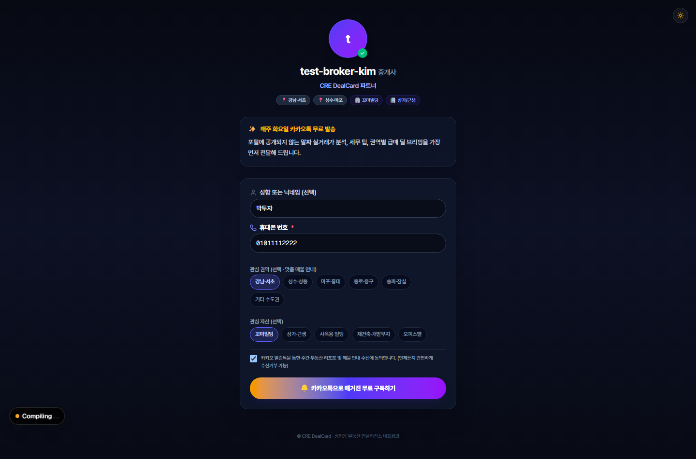
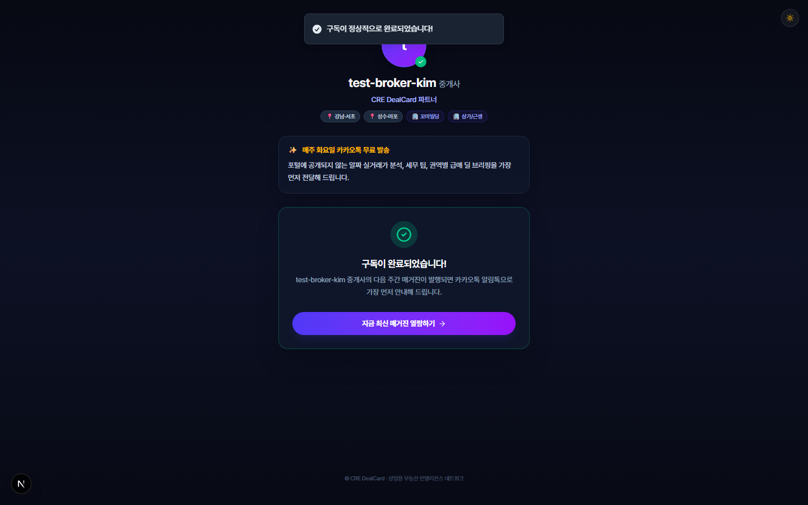
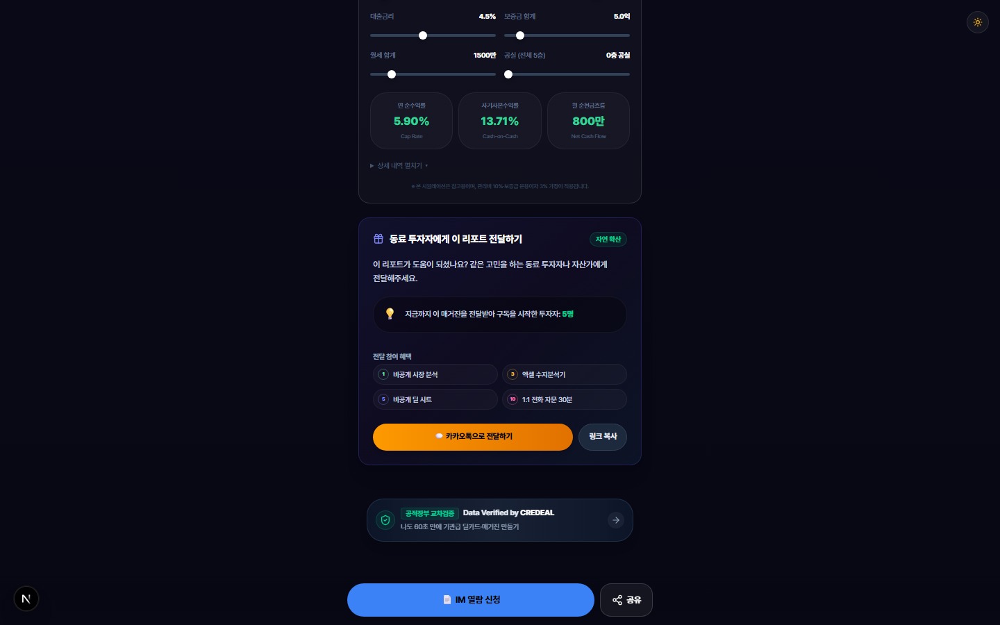
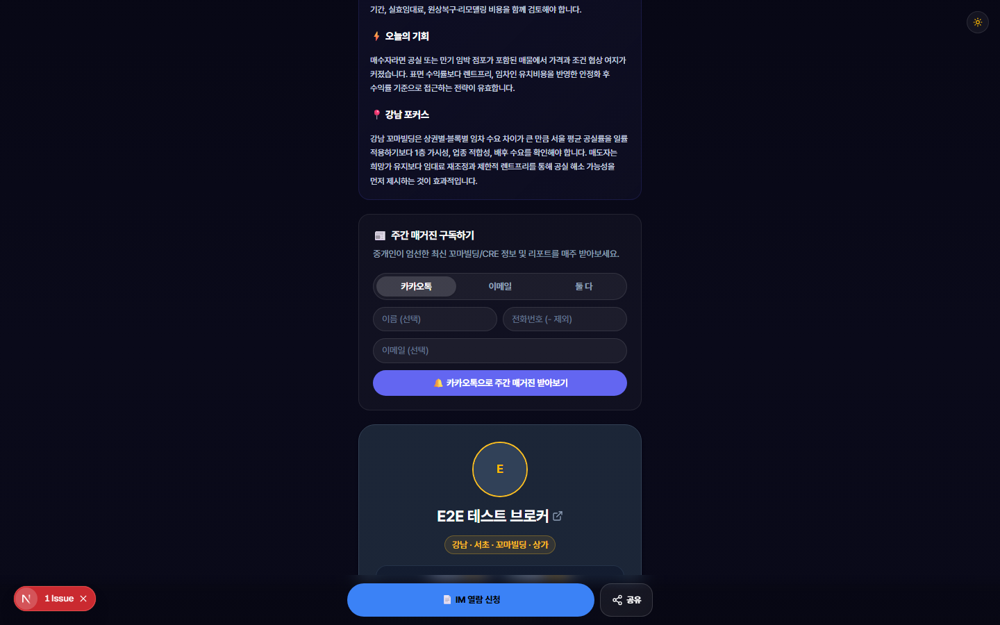

# 📗 따라하기 튜토리얼 Part 2 — 구독자 모으기 & 바이럴 확산

> **대상**: 제이에스부동산중개(주) 소속 꼬마빌딩 중개인님  
> **소요 시간**: 약 25분  
> **준비물**: PC + 스마트폰(QR 테스트용), 인터넷 연결  
> **선행 학습**: [Part 1: 매거진 만들기 & 편집하기](./TUTORIAL_PART1_MAGAZINE_CREATION.md)  
> **접속 주소**: [https://credeal.net](https://credeal.net)

---

## 🎯 이 튜토리얼에서 배우는 것

1. ✅ 구독 페이지가 어떻게 생겼는지 이해하기
2. ✅ 고객이 구독하는 과정 직접 체험하기
3. ✅ QR 코드로 오프라인에서 구독자 모으기
4. ✅ 에디터에서 구독자 직접 추가·관리하기
5. ✅ 레퍼럴(전달) 시스템으로 독자 늘리기
6. ✅ 아카이브(과거 매거진 모음) 페이지 활용하기
7. ✅ 구독 해지 요청 처리 방법 알기
8. ✅ 카카오톡·링크 공유로 매거진 홍보하기

> 💡 **구독자가 많을수록 매거진의 가치가 올라갑니다!** 이 튜토리얼에서 구독자를 늘리는 다양한 방법을 배워보세요.

---

## 📋 핵심 개념 — "구독"이란?

| 용어 | 쉬운 설명 |
|------|----------|
| **구독** | 고객이 "매주 매거진을 보내주세요"라고 신청하는 것 |
| **구독자** | 매거진을 정기적으로 받아보는 고객 |
| **카카오톡 알림** | 매거진이 나올 때 카카오톡으로 알려주는 것 |
| **이메일 발송** | 매거진이 나올 때 이메일로 보내주는 것 |
| **레퍼럴(전달)** | 독자가 다른 사람에게 매거진을 공유하는 것 |

---

## 실습 1. 구독 페이지 둘러보기

### 고객이 보는 구독 페이지란?

고객이 **QR 코드를 찍거나**, **링크를 클릭**하면 열리는 페이지입니다. 여기서 전화번호를 입력하면 매주 매거진을 받아볼 수 있습니다.

### 1단계. 구독 페이지 직접 열어보기

1. 크롬 브라우저의 주소창에 아래 주소를 입력하세요:
   ```
   credeal.net/magazine/내슬러그/subscribe
   ```
   > 💡 **"내슬러그"란?** 회원님의 고유 주소입니다. 예를 들어 `js-broker-park` 같은 영문 이름이에요. 정확한 슬러그는 CREDEAL 프로필 설정에서 확인하실 수 있습니다.

2. 아래와 같은 화면이 나타납니다:


*▲ 구독 페이지 — 브로커 프로필과 전문 분야가 표시되고, 아래에 구독 신청 폼이 있습니다*

### 2단계. 구독 페이지 구성 확인하기

구독 페이지에는 다음 정보가 자동으로 표시됩니다:

| 항목 | 설명 |
|------|------|
| 🧑‍💼 **브로커 프로필** | 사진, 이름, 소속 회사 |
| 🏷️ **전문 권역 태그** | "강남", "서초" 등 전문 지역 |
| 🏢 **전문 자산 태그** | "꼬마빌딩", "상가" 등 전문 자산 |
| 📅 **발송 안내** | "매주 화요일 발송" 등 발송 주기 |
| 📰 **최근 매거진 링크** | 이전에 발행한 매거진 미리보기 |

> 💡 **이 정보들은 자동으로 채워집니다!** 프로필 설정에서 전문 권역과 자산 유형을 미리 설정해두시면 됩니다.

---

## 실습 2. 고객의 구독 과정 직접 체험하기

실제 고객이 구독하는 과정을 직접 따라해 봅시다. (테스트용 정보로 연습합니다)

### 1단계. 구독 폼 입력하기

1. 구독 페이지에서 아래 정보를 입력하세요:

| 입력 칸 | 입력할 내용 | 비고 |
|---------|-----------|------|
| 이름 | `테스트고객` | 선택사항 (안 적어도 됨) |
| 전화번호 | `01012345678` | **필수** — 최소 10자리 |

2. **관심 권역 선택하기**:
   - 화면에 "강남·서초", "마포·홍대", "성수·성동" 같은 **지역 태그 버튼**들이 있습니다.
   - 관심 있는 지역을 **클릭**하면 파란색으로 바뀝니다. (여러 개 선택 가능)
   - **실습**: "강남·서초"를 클릭하세요.

3. **관심 자산 선택하기**:
   - "꼬마빌딩", "상가·근생", "사옥용 빌딩" 같은 **자산 태그 버튼**들이 있습니다.
   - **실습**: "꼬마빌딩"을 클릭하세요.


*▲ 전화번호와 관심 태그를 입력한 상태*

### 2단계. 구독 신청 완료하기

1. **"구독 신청"** 버튼을 클릭하세요.
2. 잠시 로딩 후, ✅ **완료 화면**이 나타납니다!


*▲ 구독 완료! — 체크 표시와 함께 "최근 매거진 보기" 버튼이 나타납니다*

3. **"최근 매거진 보기"** 버튼을 클릭하면 가장 최근에 발행한 매거진을 바로 볼 수 있습니다.

> 💡 **고객이 같은 전화번호로 다시 구독해도 괜찮습니다!** 중복 가입되지 않고, 기존 정보가 업데이트됩니다.

---

## 실습 3. QR 코드 활용하기 (오프라인 구독자 모집)

### QR 코드란?

스마트폰 카메라로 찍으면 **자동으로 구독 페이지가 열리는** 바코드입니다. 명함, 브로슈어, 현장 안내판에 인쇄하시면 됩니다.

### 1단계. QR 코드 만들기 (Part 1에서 배운 내용 복습)

1. 에디터(`credeal.net/broker/magazine-editor`)에 접속하세요.
2. **아웃리치** 탭을 클릭하세요.
3. **QR 아이콘**(격자 모양 버튼)을 클릭하세요.
4. QR 코드 팝업이 열립니다.

### 2단계. QR 코드 다운로드하기

1. **"PNG 다운로드"** 버튼을 클릭하세요.
2. 고화질(300DPI) QR 코드가 PC에 저장됩니다.

### 3단계. QR 코드 활용 아이디어

| 활용처 | 방법 | 기대 효과 |
|--------|------|----------|
| 🪪 **명함** | 명함 뒷면에 QR 코드 인쇄 | 명함 교환 후 즉시 구독 유도 |
| 📋 **임장 안내판** | 현장 사인에 QR 코드 부착 | 임장 방문자 구독 유도 |
| 📄 **브로슈어** | 홍보 자료에 QR 코드 삽입 | 오프라인 홍보 시 구독 유도 |
| 💻 **카카오톡 프로필** | QR 이미지를 프사나 배경에 | 온라인에서도 구독 유도 |

### 4단계. 스마트폰으로 QR 코드 테스트하기

1. PC 화면에 QR 코드 팝업이 열려 있는 상태에서
2. **스마트폰의 카메라 앱**을 열어 PC 화면의 QR 코드를 비추세요
3. 링크가 나타나면 **터치**하세요
4. 구독 페이지가 스마트폰에서 열립니다!

> ⚠️ **QR 코드 스캔이 안 되시나요?** 카메라 앱에서 QR 인식 기능이 꺼져 있을 수 있습니다. 설정에서 "QR 코드 스캔" 기능을 켜주세요. 또는 "네이버 QR" 앱을 설치하시면 됩니다.

---

## 실습 4. 에디터에서 구독자 직접 관리하기

### 1단계. 구독자 목록 확인하기

1. 에디터 → **아웃리치** 탭을 클릭하세요.
2. **구독자 관리** 서브탭을 선택하세요.
3. 현재 구독자 명단이 표시됩니다.

### 2단계. 구독자 수동 추가하기

명함 교환하신 고객, 전화로 문의하신 고객을 직접 추가하실 수 있습니다:

1. **"구독자 추가"** 버튼 클릭
2. 이름: `박건물주` 입력
3. 전화번호: `01099990000` 입력
4. 채널: **"둘다"** 선택 (카카오톡 + 이메일 모두 발송)
5. **"추가"** 클릭

> 💡 **채널이란?** 매거진을 보내는 방법입니다.
> - **카카오톡**: 카카오톡 알림으로 매거진 링크 발송
> - **이메일**: 이메일로 매거진 내용 발송  
> - **둘다**: 카카오톡과 이메일 모두 발송 (권장!)

### 3단계. 구독자 상세 정보 보기

1. 구독자 목록에서 **이름을 클릭**하세요.
2. 상세 패널이 열리며 다음 정보를 확인하실 수 있습니다:
   - 관심 권역/자산 태그
   - 매수 온도 (🔥📈⏸️❄️⚪)
   - 최근 매거진 열람 이력

### 4단계. 구독자 태그 수정하기

고객과 통화 후 관심 분야가 바뀌었다면:

1. 구독자 상세 패널에서 **태그 편집** 클릭
2. 관심 권역 추가: "판교" 태그 추가
3. 관심 자산 추가: "오피스텔" 태그 추가
4. **저장** 클릭

> 💡 **태그를 정확하게 관리하시면**, 긴급 속보(급매) 발행 시 관심사가 맞는 고객에게만 자동으로 보내집니다!

### 5단계. 매수 온도 필터로 핵심 고객 찾기

구독자 목록 상단에 **5개 필터 버튼**이 있습니다:

1. **🔥 적극검토** 클릭 → 매수 의향이 가장 강한 고객만 표시
2. **📈 관심** 클릭 → 관심을 보이고 있는 고객 표시
3. **⏸️ 관망** 클릭 → 지켜보는 중인 고객 표시

> 💡 **🔥 적극검토 고객에게 먼저 전화하세요!** 매거진을 자주 읽고, 매물 링크까지 클릭한 분들이에요. 계약으로 이어질 확률이 가장 높습니다.

---

## 실습 5. 레퍼럴(전달) 시스템 이해하기

### "전달하기"란?

매거진을 읽은 독자가 **동료 투자자에게 매거진을 공유**하는 기능입니다. 이를 통해 구독자가 자연스럽게 늘어납니다!

### 독자가 보는 "전달하기" 화면

매거진 하단에 아래와 같은 섹션이 있습니다:


*▲ 매거진 하단의 "전달하기" 섹션 — 소셜 프루프 카운터와 보상 마일스톤*

### 전달 보상 마일스톤

독자가 매거진을 전달할수록 **보상**을 받습니다:

| 전달 수 | 보상 | 이모지 |
|---------|------|--------|
| **1명** | 비공개 시장 분석 리포트 | 📊 |
| **3명** | 엑셀 수지분석기 다운로드 | 📈 |
| **5명** | 비공개 딜 시트 열람권 | 🏢 |
| **10명** | 브로커 1:1 전화 자문 30분 | 📞 |

> 💡 **독자가 전달하면 무슨 일이 생기나요?**
> 1. 독자A가 "카카오톡으로 전달하기" 클릭 → 친구에게 카카오톡 전송
> 2. 친구(독자B)가 카카오톡의 링크 클릭 → 매거진 열람
> 3. 독자B가 구독 신청 → **자동으로 중개인님의 구독자가 됩니다!**
> 4. 독자A에게 전달 보상 마일스톤 진행

### 전달 통계 확인하기

매거진 하단에 **"지금까지 N명의 투자자가 전달받았습니다"** 카운터가 표시됩니다.  
이 숫자가 높을수록 매거진의 신뢰도가 올라갑니다! (소셜 프루프 효과)

---

## 실습 6. 매거진 인라인 구독 위젯 확인하기

### 매거진 안에서도 구독할 수 있습니다!

독자가 매거진을 읽다가, 중간에 있는 **구독 위젯**에서 바로 구독할 수 있습니다.


*▲ 매거진 본문 중간에 나타나는 간편 구독 위젯*

이 위젯에서는:
- **카카오톡** 클릭 → 전화번호 입력란만 표시
- **이메일** 클릭 → 이메일 입력란만 표시
- **둘다** 클릭 → 전화번호 + 이메일 모두 입력

> 💡 **이 위젯은 자동으로 매거진에 포함됩니다.** 따로 설정하실 필요 없어요!

---

## 실습 7. 아카이브(과거 매거진 목록) 페이지

### 아카이브란?

지금까지 발행한 **모든 매거진을 모아 볼 수 있는 페이지**입니다. 고객에게 "이전 호도 보실 수 있어요"라고 안내할 때 유용합니다.

### 1단계. 아카이브 페이지 열어보기

1. 주소창에 입력:
   ```
   credeal.net/magazine/내슬러그
   ```
   (뒤에 날짜 없이 슬러그만 입력하세요!)

2. 아래와 같은 화면이 나타납니다:


*▲ 매거진 아카이브 — 과거에 발행한 모든 에디션이 카드 형태로 표시됩니다*

### 2단계. 아카이브 활용법

- 각 카드에는 **에디션 라벨**, **제목**, **키워드 태그**, **시장 온도**, **조회수**가 표시됩니다.
- 카드를 **클릭**하면 해당 주의 매거진을 다시 볼 수 있습니다.

> 💡 **아카이브 링크를 명함에 넣으시면**, 고객이 여러 호의 매거진을 한 번에 둘러볼 수 있어서 신뢰감이 올라갑니다!

---

## 실습 8. 구독 해지 이해하기

### 구독 해지란?

고객이 "더 이상 매거진을 안 받겠다"고 할 때의 과정입니다.

### 고객이 해지하는 방법

1. 매거진 이메일 하단의 **"구독 해지"** 링크를 클릭합니다.
2. 해지 확인 페이지가 나타납니다.


*▲ 구독 해지 확인 페이지 — 보안 토큰으로 안전하게 처리됩니다*

3. **"해지 확인"** 버튼을 클릭하면 해지됩니다.

> ⚠️ **해지 보안**: 아무나 다른 사람의 구독을 해지할 수 없습니다. 각 해지 링크에는 **암호화된 보안 토큰**이 포함되어 있어, 본인만 해지할 수 있습니다.

### 중개인님이 해지할 필요는 없습니다

- 고객이 직접 해지 링크를 클릭하면 **자동 처리**됩니다.
- 에디터의 아웃리치 탭에서 해지된 고객은 자동으로 표시가 바뀝니다.
- 필요 시 에디터에서 구독자를 **직접 삭제**하실 수도 있습니다.

---

## 실습 9. 카카오톡 & 링크로 매거진 공유하기

### 방법 1. 매거진에서 직접 공유하기

1. 발행된 매거진 페이지 하단에 **고정 바**가 있습니다.
2. 📤 **공유** 버튼을 클릭하세요.
3. **"카카오톡으로 공유"** → 카카오톡 친구 선택 → 전송!

### 방법 2. 에디터에서 공유하기

1. 매거진 발행 완료 후 나타나는 **공유 팝업**에서
2. **"카카오톡으로 공유"** 클릭 → 고객에게 직접 보내기
3. **"링크 복사"** 클릭 → 복사된 주소를 문자, 밴드, 블로그에 붙여넣기

### 방법 3. 매거진 링크 직접 보내기

매거진 주소는 아래 형식입니다:
```
credeal.net/magazine/내슬러그/2026-09-20
```
이 주소를 **문자 메시지**, **카카오톡**, **밴드** 어디에든 보내실 수 있습니다!

> 💡 **공유할 때 카카오톡에 보이는 미리보기 이미지(OG 이미지)는 자동으로 만들어집니다!** 멋진 카드 형태로 표시되어 클릭률이 높아져요.

---

## 실습 10. 긴급 속보 보내기 (급매 접수 시)

### 긴급 속보란?

급매 물건을 접수하셨을 때, **관심사가 맞는 구독자에게만** 즉시 알림을 보내는 기능입니다.

### 1단계. 긴급 속보 발행하기

1. 에디터에서 **긴급 속보** 버튼을 클릭하세요.
2. 팝업이 열리며 다음 정보가 자동으로 표시됩니다:
   - 매물 정보 (권역, 자산유형, 가격대)
   - 전체 구독자 수
   - **관심 매칭 구독자 수** (이 물건에 관심 있을 법한 분들)
   - **핫리드 수** (매수 의향이 강한 분들)

3. 헤드라인 입력:
   ```
   [단독 속보] 역삼 꼬마빌딩 급매
   ```

4. 메모 입력:
   ```
   소유주 사정으로 시세 대비 10% 할인
   ```

5. **"발행"** 클릭!

### 2단계. 스마트 타겟 배포 확인

긴급 속보는 **모든 구독자**가 아니라, 관심사가 **매칭되는 구독자에게만** 발송됩니다!

예시:
- ✅ "강남·서초 + 꼬마빌딩" 관심 → **발송됨**
- ❌ "마포·홍대 + 사옥" 관심 → **발송 안됨**

> 💡 **구독자 태그를 정확하게 관리하시는 것이 중요합니다!** 관심 권역과 자산 유형이 정확해야 스마트 타겟이 제대로 작동해요.

---

## 🏆 실습 완료! 다음 단계는?

축하드립니다! 🎉 구독자 모으기와 바이럴 확산의 핵심을 모두 배우셨습니다!

### 이번 튜토리얼에서 배우신 것:
- ✅ 구독 페이지 구조 이해 & 구독 과정 체험
- ✅ QR 코드 활용법 (명함, 임장, 브로슈어)
- ✅ 구독자 수동 추가 & 태그 관리
- ✅ 레퍼럴(전달) 시스템의 마일스톤 보상
- ✅ 아카이브 페이지 활용
- ✅ 구독 해지 처리 이해
- ✅ 카카오톡/링크 공유 및 긴급 속보 발행

### 구독자 늘리기 실전 체크리스트:

| # | 할 일 | 난이도 | 기대 효과 |
|---|-------|--------|----------|
| 1 | 명함 뒷면에 QR 코드 인쇄 | ⭐ | 만나는 모든 고객이 잠재 구독자 |
| 2 | 매주 매거진 발행 후 카카오톡 공유 | ⭐ | 기존 연락처의 구독 유도 |
| 3 | 임장 현장에 QR 코드 안내판 비치 | ⭐⭐ | 현장 방문자 구독 유도 |
| 4 | 통화한 고객을 에디터에서 수동 추가 | ⭐ | DB 축적 → 핫리드 자동 발굴 |
| 5 | 레퍼럴 보상 안내하여 전달 유도 | ⭐⭐ | 구독자가 구독자를 모아줌 |

### 다음 튜토리얼:
- 📙 **[Part 3: 독자 반응 분석 & 마케팅 활용](./TUTORIAL_PART3_VIEWER_ANALYTICS.md)** — 독자가 보는 화면, 수지분석 계산기, 세무 클리닉, SNS 마케팅 에셋 활용

---

## ❓ 자주 묻는 질문

**Q. 구독자는 최대 몇 명까지 가능한가요?**
> 제한 없습니다. 구독자가 많을수록 매거진의 영향력이 커집니다!

**Q. 구독자가 매거진을 안 읽는 것 같은데, 계속 보내도 되나요?**
> 네, 계속 보내시되 성과 탭에서 "❄️ 냉각" 고객을 확인하세요. 6개월 이상 미열람 고객은 정리를 고려하셔도 됩니다.

**Q. QR 코드가 변경되나요?**
> 아닙니다. 한번 만든 QR 코드는 영구적입니다. 명함에 인쇄하셔도 안심하세요.

**Q. 레퍼럴 보상은 자동으로 제공되나요?**
> 마일스톤 달성은 자동으로 추적됩니다. 보상 제공은 중개인님이 직접 해주셔야 합니다. (시장 분석 리포트 전달, 엑셀 파일 발송 등)

**Q. 한 사람이 다른 브로커의 매거진도 구독할 수 있나요?**
> 네, 가능합니다. 각 브로커의 매거진은 독립적으로 운영됩니다.
