# 📗 따라하기 튜토리얼 Part 2 — 구독자 모으기 & 확산

> **대상**: 꼬마빌딩·상가 전문 중개인님
> **소요 시간**: 약 25분
> **준비물**: PC(에디터) + 스마트폰(고객 화면 확인용), 인터넷 연결
> **선행 학습**: [Part 1: 매거진 만들기 & 편집하기](./TUTORIAL_PART1_MAGAZINE_CREATION.md)
> **접속 주소**: [https://credeal.net](https://credeal.net)
> **검증**: 이 문서의 실습 1~10은 골든 테스트 [`e2e/magazine-tutorial-part2-golden.auth.spec.ts`](../../e2e/magazine-tutorial-part2-golden.auth.spec.ts)의 `실습1`~`실습10`과 1:1로 대응합니다. 그림은 모두 그 테스트가 찍은 실제 화면입니다(고객 화면은 휴대폰 390×844, 에디터 화면은 PC 1440×900).

---

## ⚠️ 시작 전에 꼭 알아두세요 (현재 운영 상태)

| 항목 | 현재 상태 |
|------|----------|
| **매거진 발송** | 발송 기능이 **꺼져 있습니다**. 에디터에 "현재 발송 기능이 꺼져 있어요…"라는 안내가 보이면, 구독자를 모아도 아직 카카오톡·이메일로 나가지 않습니다. |
| **구독 신청** | 고객이 신청하면 **"접수"(확인 대기)** 상태가 됩니다. 본인 확인(이메일 확인 링크)이 끝나야 발송 대상이 됩니다. 이메일 없이 휴대폰만 입력하면 확인 링크를 보낼 수 없어 수신이 시작되지 않습니다. |
| **서버 업데이트 대기** | 구독 동의 기록용 데이터베이스 업데이트가 아직 적용되지 않았습니다. 그동안 구독 페이지에서 신청하면 **"잠시 후 다시 시도해 주세요"** 가 표시되고 신청이 저장되지 않습니다(가짜 "완료" 화면은 나오지 않습니다). 업데이트 후에는 아래 실습 2의 "접수" 화면이 나옵니다. |
| **추천 보상** | 독자가 구독 링크를 전달해도 **보상·카운터·마일스톤은 없습니다.** 구독 페이지 링크를 전달하는 기능만 있습니다. |

---

## 🎯 이 튜토리얼에서 배우는 것

1. ✅ 내 구독 페이지 둘러보기 (실습 1)
2. ✅ 고객이 되어 구독 신청해 보기 (실습 2)
3. ✅ 명함용 QR 코드 만들기 (실습 3)
4. ✅ 구독자 직접 추가하고 관리하기 (실습 4)
5. ✅ 독자가 동료에게 구독 링크 전달하기 (실습 5)
6. ✅ 매거진 안 구독 카드로 신청하기 (실습 6)
7. ✅ 지난 호 모아보기(아카이브) (실습 7)
8. ✅ 수신거부 흐름 이해하기 (실습 8)
9. ✅ 매거진 카카오톡 공유 (실습 9)
10. ✅ 딜카드에서 속보 매거진 발행 (실습 10)

## 📋 핵심 용어

| 용어 | 쉬운 설명 |
|------|----------|
| **구독** | 고객이 "매주 매거진을 보내 주세요"라고 신청하고 동의하는 것 |
| **접수(확인 대기)** | 신청은 받았지만 본인 확인 전이라 아직 발송 대상이 아닌 상태 |
| **수신 채널** | 매거진을 받는 방법 — 카카오톡 / 이메일 / 둘 다 |
| **수신거부** | 고객이 받기를 중단한 상태. 이후 발송 대상에서 빠집니다 |
| **매수 온도** | 열람 기록과 관심사로 계산한 고객의 관심 정도 (🔥 적극검토 · 📈 관심 · ⏸️ 관망 · ❄️ 냉각 · ⚪ 미확인) |

> 💡 실습에서 쓰는 전화번호는 모두 테스트용 `010-0000-xxxx` 형식입니다. 실제 고객 번호를 넣지 마세요.

---

## 실습 1. 내 구독 페이지 둘러보기

고객이 **QR 코드를 찍거나 링크를 누르면** 열리는 페이지입니다.

### 1단계. 구독 페이지 열기
1. 휴대폰 브라우저 주소창에 입력합니다: `credeal.net/magazine/내슬러그/subscribe`
   > 💡 **내슬러그**는 매거진 고유 주소(영문)입니다. 에디터 상단 **"내 매거진: ○○○"** 에서 확인할 수 있습니다. 예전 주소(회원 ID 형식)로 들어와도 자동으로 슬러그 주소로 바뀝니다.

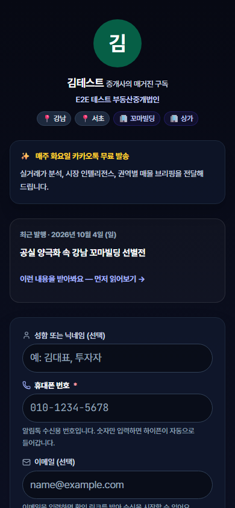
*▲ 구독 페이지 — 제목 "○○○ 중개사의 매거진 구독", 소속, 전문 권역·자산 태그, 발송 안내*

### 2단계. 구성 확인하기
| 항목 | 화면에 보이는 것 | 어디서 오나요? |
|------|-----------------|---------------|
| 제목 | **"○○○ 중개사의 매거진 구독"** | 프로필 이름 |
| 소속 | 회사 이름 | 프로필 소속 |
| 사진 | 사진이 없으면 이름 첫 글자 아바타 | 프로필 사진 |
| 전문 태그 | 📍 권역, 🏢 자산 | 프로필의 전문 권역·자산 |
| 발송 안내 | **"매주 화요일 카카오톡 무료 발송"** | 발송 일정 설정 |
| 최근 발행 카드 | **"최근 발행 · 날짜"** + **"이런 내용을 받아봐요 — 먼저 읽어보기 →"** | 가장 최근 호 |

> ⚠️ 없는 슬러그로 들어가면 "찾을 수 없음" 화면이 나옵니다. 주소를 잘못 인쇄하지 않도록 QR은 반드시 에디터에서 만드세요(실습 3).

---

## 실습 2. 고객이 되어 구독 신청해 보기

### 1단계. 입력하기
| 입력 칸(화면 라벨) | 예시 | 비고 |
|------|------|------|
| **성함 또는 닉네임 (선택)** | `테스트고객` | 비워도 됩니다 |
| **휴대폰 번호 \*** | `010-0000-7101` | 숫자만 입력하면 하이픈이 자동으로 들어갑니다 |
| **이메일 (선택)** | (비움) | 입력하면 확인 링크를 받아 수신을 시작할 수 있어요 |

- **관심 권역**에서 `강남·서초`, **관심 자산**에서 `꼬마빌딩`을 누르세요. 선택하면 앞에 **✓** 가 붙습니다(여러 개 선택 가능).

### 2단계. 필수 동의 3개
- **[필수] 개인정보 수집·이용**, **[필수] 광고성 정보 수신**, **[필수] 만 14세 이상** — 처음에는 모두 꺼져 있습니다.
- 3개를 모두 체크하기 전에는 **"무료 구독하기"** 버튼이 눌리지 않고, 아래에 "필수 동의 3개를 모두 체크하면 신청할 수 있습니다."가 보입니다. 개인정보 처리방침 링크도 함께 있습니다.

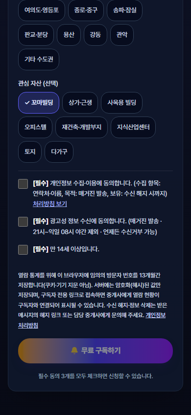
*▲ 관심 칩을 고르고 필수 동의 3개를 확인하는 화면*

### 3단계. "무료 구독하기"
- **지금(서버 업데이트 전)**: "잠시 후 다시 시도해 주세요" 알림이 뜨고 신청은 저장되지 않습니다. 정상입니다.

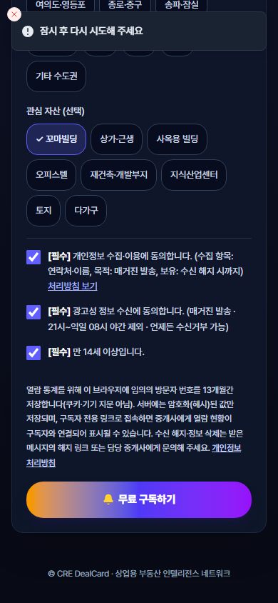
*▲ 서버 업데이트 전에는 신청이 저장되지 않고 다시 시도 안내가 표시됩니다*

- **업데이트 후**: **"구독 신청이 접수되었습니다"** 화면이 나옵니다. 이메일 없이 신청하면 "이메일을 입력하지 않으면 확인 링크를 보낼 수 없어 수신이 시작되지 않습니다." 안내가 함께 나옵니다. **"최근 매거진 열람하기"** 로 최신 호를 바로 볼 수 있습니다.

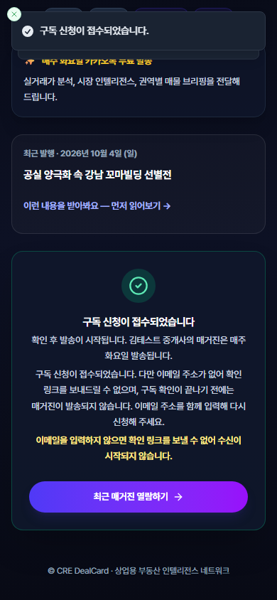
*▲ 접수(확인 대기) 화면 — 이메일이 없으면 수신이 시작되지 않는다는 안내가 함께 표시됩니다*

### 4단계. 이메일 확인 링크
이메일을 입력한 고객은 확인 메일의 링크를 눌러 아래 화면에서 **"구독 확인하기"** 를 눌러야 구독이 완료됩니다. 링크만 열어서는 아무것도 바뀌지 않습니다(메일 보안 검사기가 링크를 미리 열어도 안전).

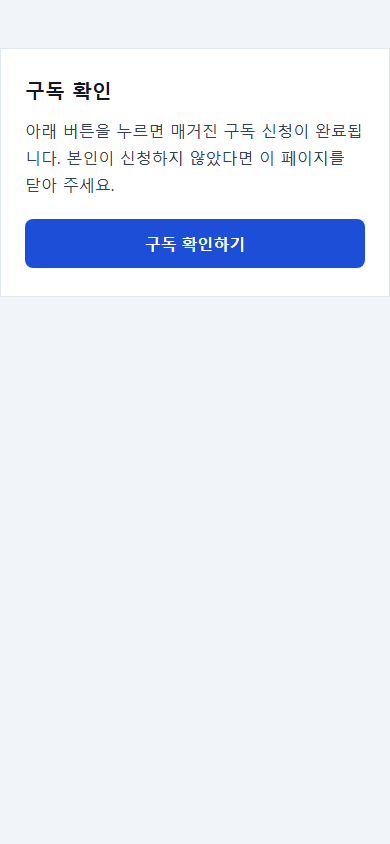
*▲ 이메일 확인 링크를 열면 나오는 "구독 확인" 화면*

---

## 실습 3. 명함용 QR 코드 만들기

1. PC에서 에디터(`credeal.net/broker/magazine-editor`)에 접속 → **아웃리치** 탭 → **구독자 관리**를 엽니다.

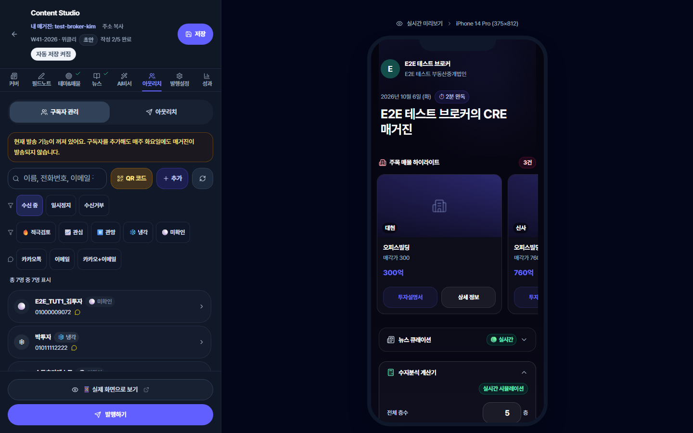
*▲ 아웃리치 > 구독자 관리 — 위쪽에 발송 꺼짐 안내, 검색·"QR 코드"·"+ 추가"·새로고침 버튼 (테스트 계정 화면이라 `E2E_…` 등 테스트용 구독자가 보입니다)*

2. **"QR 코드"** 버튼을 누르면 **"오프라인 구독 QR 코드"** 창이 열립니다. QR이 가리키는 주소가 크게 표시됩니다: `https://credeal.net/magazine/내슬러그/subscribe?source=qr_card`

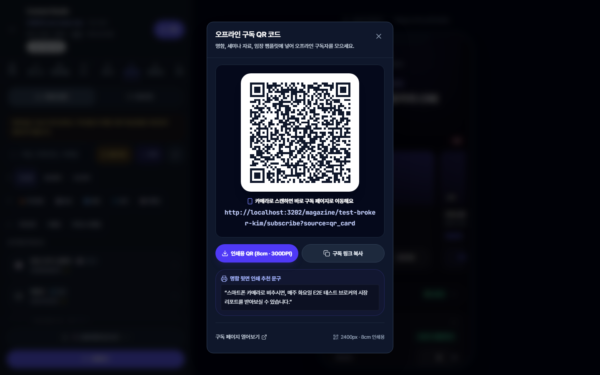
*▲ 오프라인 구독 QR 코드 — 주소 확인, 인쇄용 다운로드, 링크 복사, 인쇄 문구 (그림은 테스트 환경이라 주소가 `localhost`로 보입니다. 실제 서비스에서는 `https://credeal.net/...` 로 표시됩니다)*

3. **"인쇄용 QR (8cm · 300DPI)"** 를 누르면 `CREDEAL_매거진구독_QR_내슬러그_8cm_300dpi.png`(2400×2400px, 300DPI)가 저장됩니다.
4. **"구독 링크 복사"** 로 같은 주소를 문자·카톡에 붙여 넣을 수 있습니다. 창은 **닫기** 또는 Esc 로 닫습니다.

| 활용처 | 방법 |
|--------|------|
| 🪪 명함 | 뒷면에 8cm 이하로 인쇄 |
| 📋 임장 안내판·브로슈어 | QR + 창의 인쇄 문구 함께 사용 |

> ⚠️ **QR은 슬러그(매거진 주소)가 바뀌지 않는 한 계속 유효합니다.** 슬러그를 바꾸면 이미 인쇄한 QR은 열리지 않으니 새로 인쇄하세요.

---

## 실습 4. 구독자 직접 추가하고 관리하기

### 1단계. 목록과 필터
- **구독 상태**: `수신 중` · `일시정지` · `수신거부` (기본 = 수신 중)
- **매수 온도**: `🔥 적극검토` · `📈 관심` · `⏸️ 관망` · `❄️ 냉각` · `⚪ 미확인`
- **수신 채널**: `카카오톡` · `이메일` · `카카오+이메일`
- 목록 위에 **"총 N명 중 M명 표시"** 가 보입니다.

### 2단계. "+ 추가" → 새 구독자 추가
1. **"+ 추가"** 를 누르면 **"새 구독자 추가"** 창이 열립니다("수신 동의를 받은 고객만 추가할 수 있어요.").
2. **이름 \***: `테스트고객` / **휴대폰 번호 \***: `010-0000-7103` (숫자만 입력)
3. **수신 채널**: `카카오톡` · `이메일` · `둘 다` 중 선택 — 이메일·둘 다는 이메일 주소가 필수입니다.
   - 이메일 없이 `둘 다`로 추가를 눌러 "이메일 수신을 선택하면 이메일 주소가 필요해요." 오류가 나더라도, 채널을 `카카오톡`으로 바꾸면 오류 문구가 바로 사라지고 이메일 없이 추가할 수 있습니다.
4. **"고객이 수신에 동의했음을 확인합니다"** 를 체크합니다(체크하지 않으면 추가되지 않습니다. 동의 보증 기록은 서버 업데이트 후 저장됩니다 — 아래 💡 참고).
5. **"구독자 추가"** 를 누릅니다.

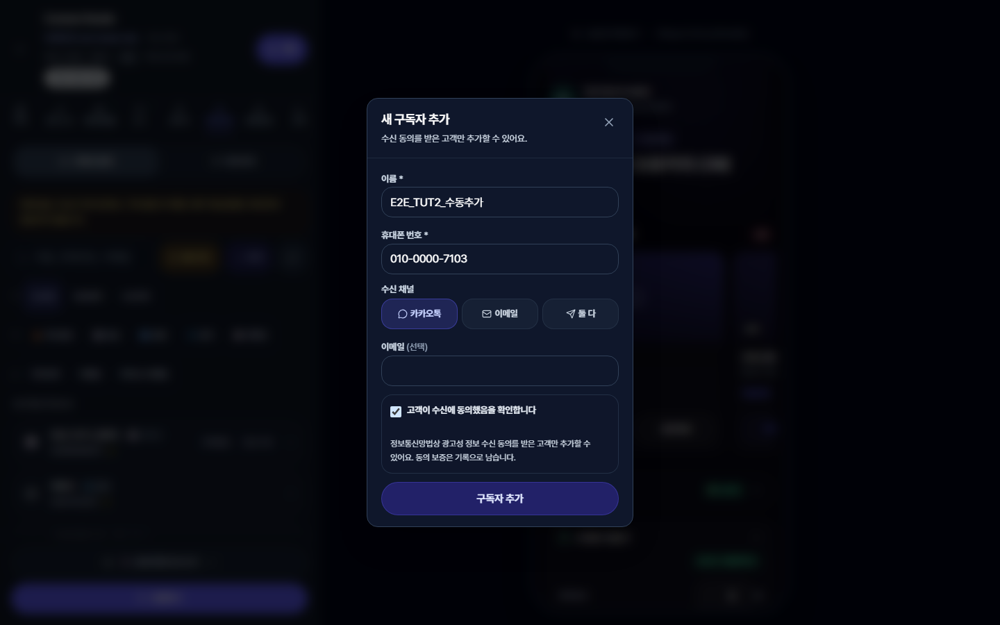
*▲ 새 구독자 추가 — 동의 확인 체크가 필수입니다 (그림의 `E2E_TUT2_…` 이름은 자동 테스트용 식별자이며 테스트 후 삭제됩니다)*

> 💡 서버 업데이트 전에는 "구독자를 추가했어요. 단, 동의 기록 저장 기능이 아직 준비되지 않아 동의 이력은 남지 않았어요."라고 안내됩니다.
> 💡 수신거부한 고객은 다시 추가할 수 없습니다. 고객 본인이 구독 페이지에서 직접 다시 신청해야 합니다.

### 3단계. 검색과 상세
1. 검색창(**"이름, 전화번호, 이메일 검색..."**)에 이름을 입력하면 해당 고객만 남습니다.
2. 이름을 누르면 **"구독자 상세"** 창이 열립니다: 매수 온도, 수신 채널, 관심 태그(관심 권역·자산 유형·관심 토픽·취미), **열람 이력 (최근 30일)**, 매수 의향서 초안 만들기, **구독자 삭제**.
3. 관심 권역 `강남·서초`, 자산 유형 `꼬마빌딩` 을 눌러 추가 → **"변경사항 저장"** → "변경사항을 저장했어요."

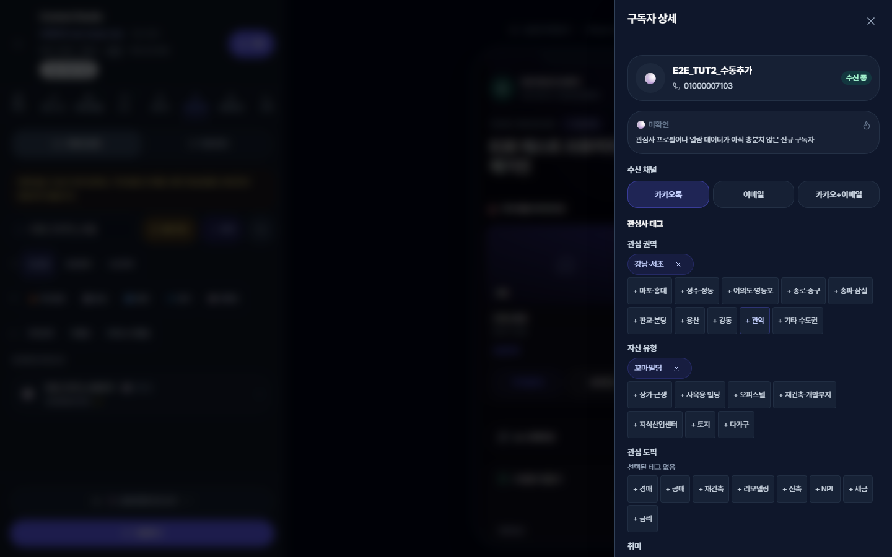
*▲ 구독자 상세 — 관심 태그 편집과 열람 이력*

> 💡 관심 권역·자산 태그가 정확해야 실습 10의 속보 "매칭 대상"에 들어갑니다.

### 매수 온도는 어떻게 정해지나요?
점수 = 관심사 프로필 점수×0.4 + 최근 30일 열람·클릭 점수×0.6 (0~100). **80 이상 🔥 적극검토 · 60 이상 📈 관심 · 40 이상 ⏸️ 관망 · 20 이상 ❄️ 냉각 · 그 외 ⚪ 미확인.**
- 최근 14일 안에 IM 요청·전화 클릭이 있으면 최소 📈 관심입니다.
- 마지막 열람이 약 6개월(183일)을 넘으면 점수와 관계없이 ❄️ 냉각으로 표시됩니다. (자동 삭제·자동 정리는 없습니다.)

---

## 실습 5. 독자가 동료에게 구독 링크 전달하기

매거진 하단에 **"동료에게 구독 링크 전달하기"** 섹션이 있습니다.
- **"💬 전달하기"**: 휴대폰 공유 창을 열고, 지원하지 않으면 링크를 복사합니다.
- **"링크 복사"**: 구독 페이지 주소(`…/magazine/내슬러그/subscribe?ref=forward`)를 복사하고 **"✓ 복사완료"** 로 바뀝니다.

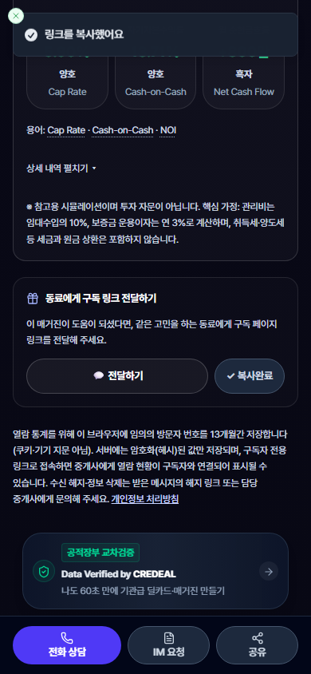
*▲ 동료에게 구독 링크 전달하기 — 보상·카운터 없이 링크만 전달합니다*

> 전달받은 사람이 링크를 열면 구독 페이지가 나오고, 신청하면 "전달 링크로 들어왔음(ref=forward)"이 함께 기록됩니다. **전달 수 보상·마일스톤·"N명이 전달받았습니다" 카운터는 없습니다.**

---

## 실습 6. 매거진 안 구독 카드로 신청하기

매거진 본문 중간의 **"📰 주간 매거진 구독하기"** 카드에서도 신청할 수 있습니다.
- **수신 채널**: `카카오톡`(휴대폰 칸만) · `이메일`(이메일 칸만) · `둘 다`(둘 다 입력)
- 버튼 이름이 채널에 따라 **"카카오톡으로 받기" / "이메일로 받기" / "카톡·이메일로 받기"** 로 바뀝니다.
- 필수 동의 3개를 체크해야 버튼이 눌립니다. 신청하면 "구독 신청이 접수되었습니다. 확인 후 발송이 시작됩니다."가 표시됩니다(서버 업데이트 후).

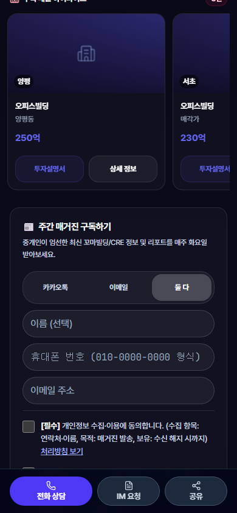
*▲ 채널을 "둘 다"로 고른 구독 카드*

---

## 실습 7. 지난 호 모아보기(아카이브)

1. 주소창에 `credeal.net/magazine/내슬러그` (날짜 없이) 를 입력합니다.
2. **"주간 매거진 아카이브"** 화면에 발행된 호가 카드로 표시되고, 카드를 누르면 그 호를 다시 볼 수 있습니다. 조회수는 표시되지 않습니다.
3. 아직 발행된 호가 없으면 **"아직 발행된 매거진이 없습니다"** 와 **"첫 호 알림 받기"** 버튼이 보입니다.

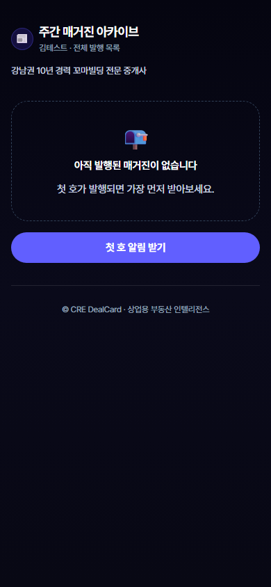
*▲ 주간 매거진 아카이브 (촬영 시점 화면)*

> 💡 에디터의 "매거진 발행"으로 만든 호와 예전 방식으로 발행된 호가 **함께** 날짜순으로 표시됩니다. 구독 페이지의 "최근 발행" 카드에 보이는 호는 아카이브에도 나옵니다.

---

## 실습 8. 수신거부 흐름 이해하기

1. 고객은 받은 메시지 하단의 **수신거부 링크**를 누릅니다.
2. **"매거진 수신 거부"** 확인 화면이 열립니다(위에 "○○○ 매거진" 표시). 이 화면을 여는 것만으로는 해지되지 않습니다.

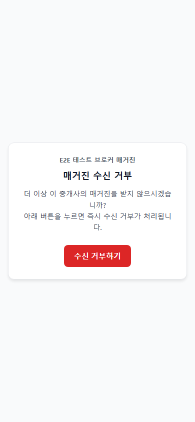
*▲ 수신 거부 확인 화면 — "수신 거부하기"를 눌러야 처리됩니다*

3. **"수신 거부하기"** 를 누르면 **"수신 거부가 완료되었습니다"** 가 표시되고 즉시 발송 대상에서 빠집니다.

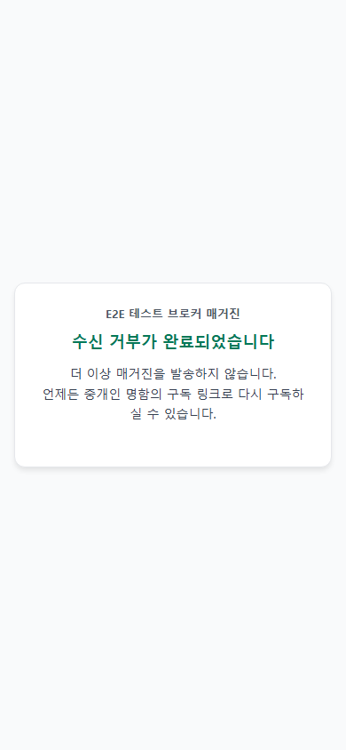
*▲ 수신 거부 완료*

> 🔒 링크마다 서명된 보안 토큰이 들어 있어, 위조·만료된 링크나 다른 중개사의 링크로는 해지되지 않습니다. 메일 앱의 "구독 취소" 버튼(원클릭 수신거부)도 지원합니다.

### 에디터에서는 어떻게 보이나요?
- 해지한 고객은 **"수신 중" 목록에서 사라집니다.**
- 구독 상태 필터에서 **"수신거부"** 를 누르면 해지한 고객이 **"수신거부"** 배지와 함께 보입니다.

*▲ 구독 상태 필터 "수신거부" — 해지한 고객 목록*

> 중개인님이 해지를 대신 처리할 필요는 없습니다. 필요하면 구독자 상세의 **"구독자 삭제"** 로 지울 수 있습니다(되돌릴 수 없음).

> 💡 수신 거부 화면·매거진 상단·카카오톡 공유 제목·구독 페이지는 **모두 같은 공개 이름**을 씁니다. 중개사 프로필 이름이 우선이고, 비어 있으면 계정 표시 이름이 쓰입니다(위 그림의 "E2E 테스트 브로커"는 테스트 계정 이름). 이름을 바꾸고 싶으면 프로필 이름만 고치세요.

---

## 실습 9. 매거진 카카오톡 공유

1. 발행된 매거진 화면 하단 고정 바(**전화 상담 / IM 요청 / 공유**)에서 **"공유"** 를 누릅니다.
2. **선택 단계 없이 바로 카카오톡 공유 창**이 열립니다. 카카오톡을 쓸 수 없으면 휴대폰 공유 창 → 링크 복사 순서로 대신 동작하고 "링크를 복사했어요"가 표시됩니다.

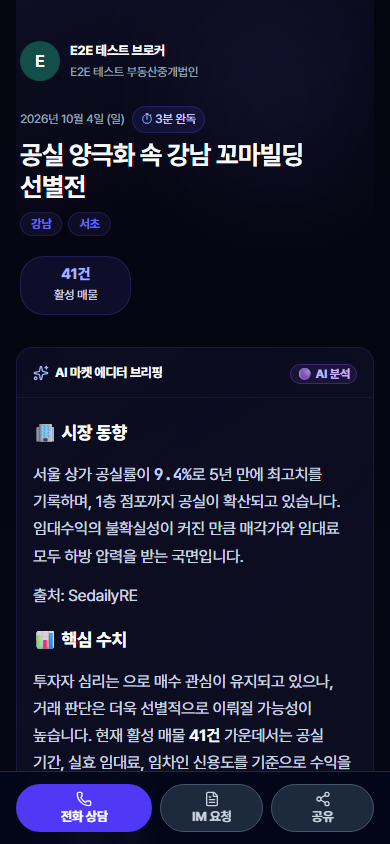
*▲ 매거진 하단 고정 바 — "공유"를 누르면 바로 카카오톡 공유*

- 카카오톡 메시지: 제목 **"[중개사 이름] 주간 부동산 AI 매거진"**, 버튼 **"매거진 열람"**, 미리보기 이미지는 매거진별로 자동 생성됩니다.
- 매거진 주소 형식: `credeal.net/magazine/내슬러그/발행일` (예: `…/2026-10-04`) — 문자·밴드 등에 그대로 보내도 됩니다.

---

## 실습 10. 딜카드에서 속보 매거진 발행

급매 등 새 매물을 빠르게 알리는 기능입니다. **발송은 기본으로 꺼져 있습니다.**

1. **내 딜카드** 화면 오른쪽 위 **⋮(더 보기)** → **"⚡ 속보 매거진 발행"**.
2. **"속보 매거진 발행"** 창에 자동으로 표시됩니다:
   - 매물 요약(권역·자산유형·가격 — 입력된 값만)
   - **발송 대상 미리보기**: `전체 구독자` · `매칭 대상` · `핫리드` · `태그 없음`
   - 매칭 규칙: 권역과 자산유형이 **모두** 일치하는 구독자만 대상, 태그 없는 구독자는 기본 제외("태그 없는 구독자 N명도 대상에 포함"을 직접 체크해야 포함)
3. **속보 헤드라인**(예: `[속보] 역삼 꼬마빌딩 신규 매물 안내`)과 **한줄 코멘트 (선택)** 을 입력합니다. 사실 확인된 내용만 쓰세요.
4. **"발행과 함께 매칭 구독자 N명에게 발송"** 은 **기본 꺼짐**입니다. 끈 채로 **"속보 발행"** 을 누르면 발행만 되고 "속보를 발행했어요 — 독자에게는 발송하지 않았어요."가 표시됩니다. 켜면 버튼이 **"속보 발행 및 발송"** 으로 바뀝니다(현재는 발송 기능이 꺼져 있어 실제로 나가지 않습니다).

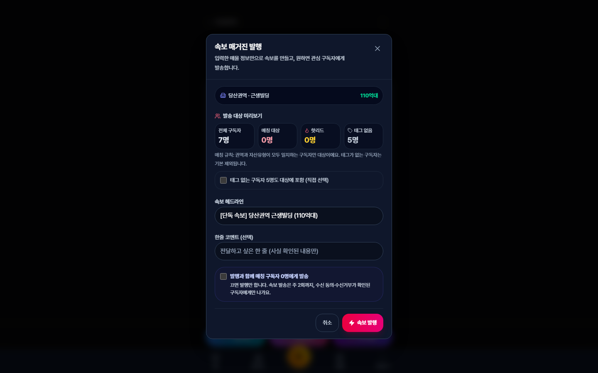
*▲ 속보 매거진 발행 — 대상 4칸 미리보기, 발송은 기본 꺼짐*

---

## 🏆 실습 완료!

### 구독자 늘리기 체크리스트
| # | 할 일 | 비고 |
|---|-------|------|
| 1 | 명함 뒷면에 인쇄용 QR(8cm·300DPI) | 슬러그를 바꾸면 재인쇄 |
| 2 | 발행 후 하단 바 "공유"로 카카오톡 공유 | |
| 3 | 동의받은 고객만 "+ 추가" | 동의 확인 체크 필수 |
| 4 | 구독자 관심 권역·자산 태그 정리 | 속보 매칭 정확도 |
| 5 | 고객에게 이메일도 받아 두기 | 이메일 확인 링크로 수신 시작 |

### 다음 튜토리얼
- 📙 **[Part 3: 독자 반응 분석 & 마케팅 활용](./TUTORIAL_PART3_VIEWER_ANALYTICS.md)**

---

## ❓ 자주 묻는 질문

**Q. 구독 신청했는데 매거진이 안 와요.**
> 지금은 발송 기능이 꺼져 있습니다. 또한 본인 확인(이메일 확인 링크) 전에는 발송되지 않습니다.

**Q. 매거진을 안 읽는 구독자는 어떻게 되나요?**
> 약 6개월(183일) 동안 열람 기록이 없으면 ❄️ 냉각으로 표시됩니다. 자동으로 삭제되지는 않습니다.

**Q. QR 코드가 바뀌나요?**
> 슬러그(매거진 주소)를 바꾸지 않는 한 그대로 유효합니다. 슬러그를 바꾸면 새 QR을 인쇄하세요.

**Q. 전달하면 보상이 있나요?**
> 없습니다. 구독 링크를 전달하는 기능만 있고, 전달 수 카운터·마일스톤·보상은 없습니다.

**Q. 한 사람이 다른 중개사 매거진도 구독할 수 있나요?**
> 네. 중개사별로 따로 운영됩니다.

---

## 📝 DOC_ERROR 정정 체크리스트 (D-01)

| ID | 이전 문서 | 정정 |
|----|----------|------|
| T2-18 | 이미지 21~27 결함(데스크톱 캡처, 가짜 태그·인원, 오버레이, 빈 아카이브, 에러 페이지) | 골든 스펙 스크린샷 `p2_01`~`p2_17`로 교체(고객 390×844, 에디터 1440×900, dev 표시기 없음). 해지 확인 화면은 정상 렌더 화면 |
| T2-19 | "에디터의 긴급 속보 버튼", "발행" 버튼 | 딜카드 ⋮(더 보기) → "⚡ 속보 매거진 발행", 창 제목 "속보 매거진 발행", 버튼 "속보 발행", 대상 4칸(전체 구독자 포함), 발송 기본 꺼짐 |
| T2-24a | "구독자 추가" 버튼, "💾 변경사항 저장" | 버튼 "+ 추가", 창 "새 구독자 추가"·제출 "구독자 추가", 저장 "변경사항 저장", 채널 필터 라벨 "카카오+이메일"(추가 창은 "둘 다") |
| T2-25c | "QR은 영구적" | 슬러그가 바뀌지 않는 동안 유효 |
| T2-30 | 예시 번호 `01012345678`·`01099990000` | `010-0000-xxxx` 테스트 대역 |
| T2-32 | 전달 보상 마일스톤 표 | 삭제 — 보상·카운터·마일스톤 없음 |
| T2-DOC-1 | "구독 신청", "최근 매거진 보기", "PNG 다운로드", "해지 확인", 전달 카운터 문구 | "무료 구독하기", "최근 매거진 열람하기", "인쇄용 QR (8cm · 300DPI)", "수신 거부하기", 카운터 문구 삭제 |
| T2-DOC-2 | "해지자는 표시가 바뀜" | "수신 중" 목록에서 사라지고, 상태 필터 "수신거부"에서 확인 |
| T2-DOC-3 | 공유 → "카카오톡으로 공유" 선택 | 선택 단계 없이 바로 카카오톡 공유(실패 시 공유 창/링크 복사) |
| (추가) | "6개월 미열람 정리 고려", 성과 탭 냉각 | 183일 미열람 → ❄️ 냉각 표시(자동 정리 없음), 아웃리치 매수 온도 필터 |
