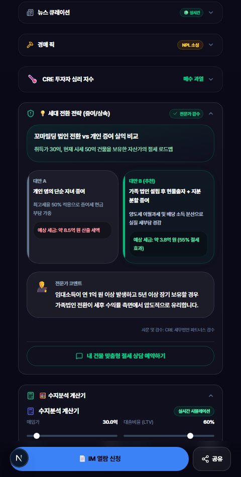
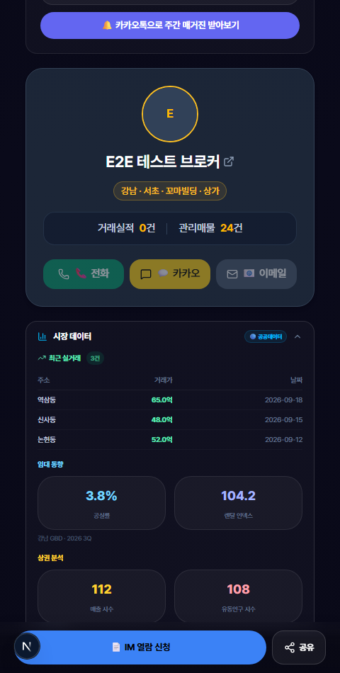
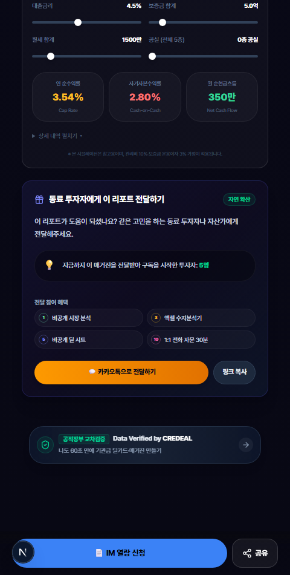
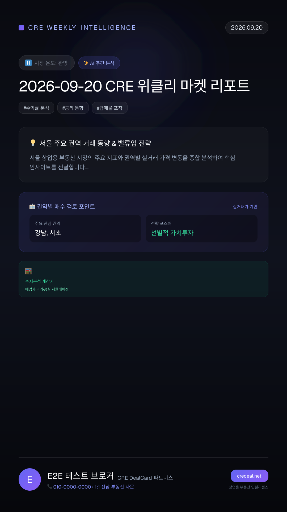
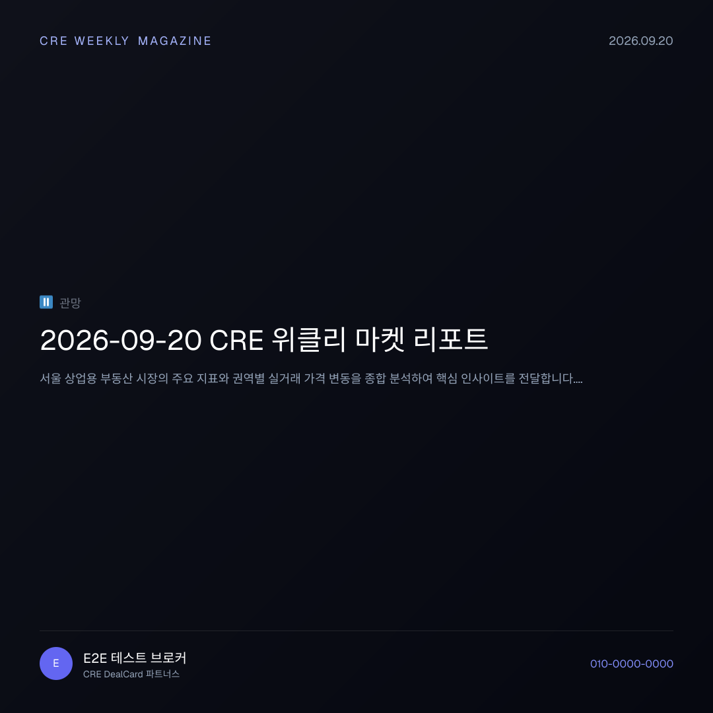

# 📙 따라하기 튜토리얼 Part 3 — 독자 반응 분석 & 마케팅 활용

> **대상**: 제이에스부동산중개(주) 소속 꼬마빌딩 중개인님  
> **소요 시간**: 약 30분  
> **준비물**: PC + 스마트폰(뷰어 확인용), 인터넷 연결  
> **선행 학습**: [Part 1](./TUTORIAL_PART1_MAGAZINE_CREATION.md), [Part 2](./TUTORIAL_PART2_SUBSCRIBE_VIRAL.md)  
> **접속 주소**: [https://credeal.net](https://credeal.net)

---

## 🎯 이 튜토리얼에서 배우는 것

1. ✅ 독자(고객)가 보는 매거진 화면 전체 둘러보기
2. ✅ 인터랙티브 설문 — 독자 반응 수집 방법 이해
3. ✅ 수지분석 계산기 — 투자 수익률 시뮬레이션 체험
4. ✅ 세무 클리닉 — A/B 비교 세무 가이드 확인
5. ✅ 성과 대시보드 — 핫리드 발굴 & 전화 치트시트 활용
6. ✅ SNS 마케팅 에셋 — 인스타그램/카카오톡용 이미지 활용
7. ✅ 매수 온도 5단계 시스템 완전 이해

> 💡 **이 튜토리얼이 가장 실전적입니다!** 독자가 매거진에서 어떤 행동을 하는지 이해하시면, 그 반응을 활용해 계약 확률을 높이실 수 있어요.

---

## 📋 핵심 개념 — 매수 온도란?

매거진을 읽은 독자의 행동을 분석하여, **매수 의향이 얼마나 강한지** 자동으로 분류하는 시스템입니다.

| 온도 | 이모지 | 의미 | 어떻게 분류되나요? |
|------|--------|------|------------------|
| **적극검토** | 🔥 | 매수 의향 매우 강함 | 매거진을 자주 읽고 + 매물 클릭 + 설문 참여 |
| **관심** | 📈 | 관심을 보이고 있음 | 매거진을 종종 읽고 + 설문 참여 |
| **관망** | ⏸️ | 지켜보는 중 | 매거진을 가끔 열어봄 |
| **냉각** | ❄️ | 반응 없음 | 최근 매거진을 잘 안 읽음 |
| **미확인** | ⚪ | 아직 모름 | 구독만 하고 아직 열어보지 않음 |

> 💡 **온도가 올라가는 행동**:
> - 매거진 열어보기 → +5점
> - 설문 투표하기 → +15점 (일반 열람의 3배!)
> - 매물 링크 클릭하기 → +20점
> - 7일 이내 활동 → 추가 +30점 보너스

---

## 실습 1. 독자가 보는 매거진 화면 둘러보기

### 1단계. 매거진 뷰어 페이지 열기

1. 크롬 브라우저 주소창에 입력:
   ```
   credeal.net/magazine/내슬러그/2026-09-20
   ```
   (날짜는 가장 최근 발행한 매거진의 날짜로 바꿔주세요)

2. **스마트폰에서도 열어보세요!** 고객은 주로 스마트폰으로 매거진을 봅니다.

### 2단계. 커버(표지) 영역 확인하기

페이지 최상단에 아래 정보가 표시됩니다:


*▲ 매거진 커버 — 시장 온도, 키워드 태그, 핵심 지표, 완독 시간이 표시됩니다*

| 요소 | 설명 |
|------|------|
| 🧑‍💼 **브로커 프로필** | 중개인님의 사진, 이름, 소속 |
| 📅 **날짜** | "2026년 09월 20일 (토)" 형식 |
| ⏱️ **완독 시간** | "약 2분" — 전체 읽는 데 걸리는 시간 |
| 🌡️ **시장 온도 뱃지** | 이모지 + 라벨 (예: 🟢 선별 매수) |
| 🏷️ **키워드 태그 3개** | 이번 주 핵심 주제 |
| 📊 **핵심 지표 카드** | 투자 심리, 매물 수, 시장 포스처 |

### 3단계. 주요 섹션 스크롤하며 확인하기

아래로 스크롤하시면 다음 섹션들이 순서대로 나타납니다:

| 순서 | 섹션 이름 | 내용 | 독자에게 주는 가치 |
|------|----------|------|-----------------|
| 1️⃣ | **AI 브리핑** | AI가 작성한 주간 시장 분석 | 시장 흐름 한눈에 파악 |
| 2️⃣ | **필드노트** | 중개인님의 현장 이야기 | 전문가의 생생한 인사이트 |
| 3️⃣ | **금주의 테마** | 이번 주 투자 테마 + 관련 매물 | 테마형 투자 아이디어 |
| 4️⃣ | **추천 매물** | 좌우로 넘기는 매물 카드 | 관심 매물 빠르게 탐색 |
| 5️⃣ | **인터랙티브 설문** | 1-클릭 투표 | 시장 참여 & 중개인 소통 |
| 6️⃣ | **구독 위젯** | 매거진 안에서 바로 구독 | 비구독자 구독 유도 |
| 7️⃣ | **브로커 프로필** | 중개인 상세 소개 | 전문성 & 신뢰 전달 |
| 8️⃣ | **시장 데이터** | 실거래, 공실률, 임대 지수 | 데이터 기반 의사결정 |
| 9️⃣ | **뉴스 큐레이션** | AI가 선별한 CRE 뉴스 6건 | 시장 뉴스 한눈에 |
| 🔟 | **경매 매물** | 경매 할인율, 최저입찰가 | NPL 투자 기회 |
| 1️⃣1️⃣ | **리서치 리포트** | 기관 리포트 요약 | 전문 분석 자료 접근 |
| 1️⃣2️⃣ | **투자 심리 지수** | 0~100 게이지 차트 | 시장 심리 정량 파악 |
| 1️⃣3️⃣ | **세무 클리닉** | 세금 A/B 비교 가이드 | 세무 전략 의사결정 |
| 1️⃣4️⃣ | **수지분석 계산기** | 투자 수익률 시뮬레이터 | 직접 계산해보는 재미 |
| 1️⃣5️⃣ | **전달하기** | 카카오톡/링크 공유 | 바이럴 확산 |
| 1️⃣6️⃣ | **Powered By** | "Data Verified by CREDEAL" | 데이터 신뢰성 뱃지 |

> 💡 **모든 섹션을 다 쓸 필요는 없습니다.** 에디터에서 불필요한 섹션은 끄실 수 있어요. 하지만 독자 입장에서 다양한 콘텐츠가 있으면 체류 시간이 길어지고, 매수 온도가 올라갑니다!

---

## 실습 2. 인터랙티브 설문 — 독자 반응 수집하기

### 설문이 왜 중요한가요?

설문은 단순한 질문이 아닙니다. **독자의 매수/매도 의향을 파악하는 도구**입니다!

### 독자가 보는 설문 화면


*▲ 설문 투표 후 결과 화면 — 선택지별 참여 비율과 1:1 상담 버튼*

### 설문 투표 과정 (독자 입장)

1. 매거진 스크롤 → 설문 섹션 도착
2. **질문**: "올해 하반기, 가장 관심 있는 투자 전략은?"
3. **3개 선택지**가 보임:
   - ① "적극적으로 매수 검토 중"
   - ② "좋은 매물이 나오면 검토"
   - ③ "보유 건물 매각을 우선 고려"
4. 선택지 하나를 **터치(클릭)** → 바로 투표!
5. **투표 결과** 퍼센트 바가 애니메이션으로 나타남
6. 아래에 **"1:1 상담 전화 걸기"** 버튼이 나타남

### 💡 설문의 숨은 기능들

| 독자의 행동 | 시스템이 자동으로 하는 일 |
|------------|----------------------|
| 아무 선택지나 투표 | 매수 온도 **+15점** 상승 |
| **3번(매각)** 선택 | 해당 독자를 **"매도자"로 자동 분류** |
| "1:1 상담" 버튼 클릭 | 중개인님에게 **직통 전화** 연결 |

> 💡 **설문 3번의 비밀**: 3번(매각)을 선택한 고객은 자동으로 "매도 관심자"로 분류됩니다. 매도 물건을 찾는 투자자 고객에게 매도자를 연결해드릴 수 있어요!

### 설문 결과 확인하기

에디터 → **성과** 탭에서 설문 결과를 볼 수 있습니다:
- 각 선택지별 **투표 수와 비율**
- 전체 참여자 수
- 시간대별 투표 추이

---

## 실습 3. 수지분석 계산기 — 투자 수익률 시뮬레이션

### 수지분석 계산기란?

독자(투자자)가 **직접 숫자를 바꿔가며** 투자 수익률을 계산해볼 수 있는 도구입니다. 매거진에 자동으로 포함됩니다!

### 계산기 화면


*▲ 수지분석 계산기 — 슬라이더를 움직여 실시간 수익률을 확인*

### 6개 슬라이더 설명

| 슬라이더 | 의미 | 범위 | 실습 예시 |
|---------|------|------|----------|
| **매입가** | 건물 구매 가격 | 5억 ~ 300억 | 50억으로 설정 |
| **LTV** | 대출 비율 | 0% ~ 80% | 50%로 설정 (25억 대출) |
| **금리** | 대출 이자율 | 2% ~ 8% | 4.5%로 설정 |
| **보증금** | 임차인 보증금 총액 | 0 ~ 50억 | 5억으로 설정 |
| **월임대료** | 매달 받는 임대료 | 0 ~ 1억 | 2,500만원으로 설정 |
| **공실 층수** | 비어있는 층 수 | 0 ~ 전체 층수 | 0으로 설정 |

### 실습: 양호한 투자 시나리오 만들어보기

1. 매거진 뷰어에서 **수지분석 계산기** 섹션으로 스크롤하세요.
2. 슬라이더를 아래처럼 설정하세요:
   - 매입가: **50억**
   - LTV: **50%**
   - 금리: **4.5%**
   - 보증금: **5억**
   - 월임대료: **2,500만원**
   - 공실: **0층**

3. **결과 확인**:
   - ✅ Cap Rate(수익률): **초록색** 표시 → 4% 이상으로 양호!
   - ✅ 월 현금흐름: **양수** → 매달 돈이 남음!

### 실습: 위험한 투자 시나리오 만들어보기

1. 슬라이더를 아래처럼 바꿔보세요:
   - LTV: **70%** (대출 많이)
   - 금리: **6.0%** (이자 높음)
   - 보증금: **2억** (보증금 적음)
   - 월임대료: **1,500만원** (임대료 낮음)
   - 공실: **3층** (많이 비어있음)

2. **결과 확인**:
   - ❌ Cap Rate: **빨간색** 표시 → 수익률 낮음!
   - ❌ 월 현금흐름: **마이너스** → ⚠️ 매달 적자!
   - ⚠️ **공실 스트레스 경고** 메시지 표시

> 💡 **이 계산기가 왜 중요한가요?** 독자(투자자)가 직접 숫자를 바꿔보면서 매물의 수익성을 판단합니다. 계산기에서 많은 시간을 보낸 독자는 **매수 의향이 높다**는 뜻이에요! 성과 탭에서 이런 독자를 확인하실 수 있습니다.

### 상세 계산 펼쳐보기

계산 결과 아래의 **"상세 분석 보기"** 를 클릭하시면:
- 대출금, 점유율, 유효 연임대, 유효 보증금
- 보증금 운용수익, 관리비, NOI
- 연이자, 순현금흐름

모든 **중간 계산 과정**을 투명하게 볼 수 있습니다!

---

## 실습 4. 세무 클리닉 — A/B 비교 세무 가이드

### 세무 클리닉이란?

고액 자산가/건물주를 위한 **세금 절감 전략 가이드**입니다. 두 가지 방법을 나란히 비교하여 어떤 것이 유리한지 보여줍니다.

### 세무 클리닉 화면


*▲ 세무 클리닉 — 개인 증여(대안 A) vs 가족 법인 현물출자(대안 B) 비교*

### 화면 구성 요소

| 요소 | 설명 |
|------|------|
| 📋 **시나리오 제목** | 예: "세대 전환 전략: 증여 vs 법인 전환" |
| 📝 **상황 설명** | 어떤 상황에서 적용되는 전략인지 |
| **대안 A 카드** | 첫 번째 방법 (예: 개인 증여) |
| **대안 B 카드** | 두 번째 방법 (예: 가족 법인) + ✅ 추천 뱃지 |
| 💬 **전문가 코멘트** | AI 세무 분석 결론 |
| 📞 **세무 상담 예약** | CTA 버튼 |

### 세무 클리닉의 타겟 필터

> ⚠️ **중요**: 세무 클리닉은 **매도자/건물주 타겟**일 때만 보입니다!
> - `?target=buyer` 접속 → 세무 클리닉 **안 보임**
> - `?target=seller` 접속 → 세무 클리닉 **보임**
> - 기본(쿼리 없음) → 세무 클리닉 **보임**

> 💡 **에디터에서 타겟을 "매도자"로 설정하시면**, 세무 클리닉이 더 앞쪽에 배치됩니다. 매도 고객이 많은 주에 활용해보세요!

---

## 실습 5. 시장 데이터 & 뉴스 큐레이션 확인하기

### 시장 데이터 (접이식)

매거진에서 **시장 데이터** 섹션을 찾아 **펼치기(+)** 버튼을 클릭하세요:


*▲ 실거래 테이블, 공실률, 임대 지수, 뉴스 큐레이션*

펼치면 다음 정보가 나타납니다:

| 데이터 | 내용 | 출처 |
|--------|------|------|
| 📊 **실거래 테이블** | 최근 거래된 건물의 동, 주소, 가격, 날짜 | 국토교통부 실거래 |
| 📉 **임대 트렌드** | 공실률, 임대료 지수 변화 | 부동산 리서치 |
| 🏪 **상권 분석** | 매출 지수, 유동인구 지수 | 상권 분석 데이터 |
| 📋 **월간 요약** | 총 거래 건수, 평균 가격, 변동률 | 자체 집계 |

### 뉴스 큐레이션 (접이식)

뉴스 섹션을 펼치면 최대 **6건의 CRE 뉴스**가 표시됩니다:
- 🟢 **초록 도트**: 시장에 좋은 뉴스 (호재)
- 🔴 **빨강 도트**: 시장에 나쁜 뉴스 (악재)
- ⚪ **회색 도트**: 중립적인 뉴스

> 💡 **접이식(아코디언)인 이유**: 데이터가 많아서 기본적으로 접혀 있습니다. 관심 있는 독자만 펼쳐서 상세히 볼 수 있어요. 누가 데이터 섹션을 펼쳐보는지도 성과 탭에서 추적됩니다!

---

## 실습 6. 하단 고정 바 — 즉각 행동 유도

### 고정 바란?

매거진 화면 **맨 아래에 항상 떠 있는 버튼 모음**입니다. 독자가 어떤 섹션을 보고 있든 바로 행동할 수 있습니다.


*▲ 하단 고정 바 — 전화, IM 요청, 공유 버튼이 항상 떠 있습니다*

| 버튼 | 아이콘 | 동작 |
|------|--------|------|
| **전화** | 📞 | 중개인님 전화번호로 바로 전화 걸기 |
| **IM 요청** | 📋 | 매물 투자분석서(IM) 열람 신청 페이지 이동 |
| **공유** | 📤 | 카카오톡 공유 또는 링크 복사 |

> 💡 **"IM 요청" 버튼이 핵심입니다!** 독자가 이 버튼을 누르면, 특정 매물에 관심 있다는 뜻이에요. 이 클릭은 성과 탭에서 추적되고, 매수 온도가 크게 올라갑니다.

---

## 실습 7. 성과 대시보드 — 핫리드 발굴하기

### 1단계. 성과 탭 열기

1. 에디터(`credeal.net/broker/magazine-editor`)에 접속
2. 상단 마지막 아이콘 **성과** 탭 클릭

### 2단계. 4대 KPI 확인하기

| KPI | 의미 | 보는 방법 |
|-----|------|----------|
| **30일 누적 조회수** | 최근 30일간 매거진을 열어본 총 횟수 | 숫자가 클수록 좋음 |
| **평균 체류 시간** | 독자가 평균적으로 몇 초 머물렀는가 | 120초 이상이면 양호 |
| **완독률** | 끝까지 스크롤한 비율 | 30% 이상이면 양호 |
| **활성 구독자 수** | 현재 매거진을 받아보는 사람 수 | 매주 조금씩 늘면 좋음 |

### 3단계. 매수 온도 분포 확인하기

성과 탭에 **5단계 온도 분포**가 표시됩니다:

```
🔥 적극검토: 2명   ←── 가장 먼저 전화할 분들!
📈 관심:     5명   ←── 지속적으로 관심 유지
⏸️ 관망:     8명
❄️ 냉각:     3명
⚪ 미확인:   12명  ←── 아직 매거진을 안 열어본 분들
```

### 4단계. 핫리드 목록에서 전화할 고객 찾기

1. **🔥 적극검토** 필터를 클릭하세요.
2. 매수 온도가 가장 높은 **상위 10명**이 표시됩니다.
3. 각 고객의 정보가 보입니다:
   - 이름, 전화번호
   - 온도 뱃지 (🔥)
   - 최근 활동 (언제 매거진을 봤는지, 어떤 매물을 클릭했는지)

### 5단계. 전화 오프닝 치트시트 활용하기 ⭐⭐⭐

**이것이 매거진의 가장 강력한 기능입니다!**

1. 핫리드 목록에서 전화하고 싶은 고객의 **"전화 준비"** 버튼을 클릭하세요.
2. 모달(팝업)이 열리며, AI가 만든 **전화 오프닝 스크립트**가 표시됩니다:

> 예시 스크립트:
> *"김 대표님, 안녕하세요. 제이에스부동산중개 박 팀장입니다.*  
> *지난 주 보내드린 매거진에서 역삼동 코너 빌딩 정보를 관심 있게 보셨더라구요.*  
> *마침 이번 주에 매도자와 미팅을 했는데, 가격 협상 여지가 생겼습니다.*  
> *혹시 시간 되시면 상세 투자분석서를 보내드릴까요?"*

3. **"복사"** 버튼을 클릭하여 메모장에 붙여넣기 해두세요.
4. 스크립트를 참고하며 전화하시면 됩니다!

> 💡 **왜 이 스크립트가 효과적인가요?** 고객이 관심 있게 본 매물과 섹션을 AI가 분석하여 대화 소재를 만들어줍니다. "고객님이 관심 보이신 그 물건..." 이라고 시작하면 고객의 주의를 확 끌 수 있어요!

### 6단계. 섹션 히트맵 확인하기

성과 탭 하단에 **섹션별 인기도 차트**가 있습니다:

- 가장 많이 본 섹션이 무엇인지 한눈에 파악
- 체류 시간이 긴 섹션 = 독자의 관심사
- 이 정보를 바탕으로 **다음 주 매거진의 비중을 조절**하세요

예시:
```
AI 브리핑:    ████████████  320건
추천 매물:    ██████████    280건
수지분석기:   ████████      210건  ← 관심 높음!
필드노트:     ███████       180건
세무 클리닉:  ██████        150건
```

### 7단계. 개별 구독자 상세 분석

특정 구독자의 행동을 자세히 보고 싶으시면:

1. 핫리드 목록에서 **고객 이름을 클릭**하세요.
2. 해당 고객의 **상세 분석 페이지**가 열립니다:
   - 총 매거진 열람 횟수
   - 평균 체류 시간
   - 열람한 섹션 목록
   - 최근 30건의 행동 이벤트

> 💡 **이 정보로 무엇을 할 수 있나요?** 고객이 "수지분석 계산기"를 오래 사용했다면 → 투자 수익률에 관심이 많다는 뜻 → 전화할 때 "수익률 분석 자료를 정리해드릴까요?"로 시작하세요!

---

## 실습 8. SNS 마케팅 에셋 활용하기

### 마케팅 에셋이란?

매거진 발행 시 자동으로 만들어지는 **홍보용 이미지**입니다. 인스타그램, 카카오톡, 블로그 등에 올리시면 됩니다!

### 3가지 이미지 에셋

#### 1) 소셜 공유 OG 이미지 (가로형 1200×630)


*▲ 카카오톡이나 페이스북에 링크를 공유하면 자동으로 이 이미지가 미리보기에 표시됩니다*

**용도**: 카카오톡, 페이스북, 밴드에 매거진 링크를 보낼 때 자동으로 표시되는 미리보기 이미지
**크기**: 1200×630 픽셀 (가로형)
**별도 작업 불필요**: 링크를 공유하면 **자동**으로 표시됩니다!

#### 2) 인스타그램 스토리용 (세로형 1080×1920)


*▲ 인스타그램 스토리에 바로 올릴 수 있는 세로형 이미지*

**용도**: 인스타그램 스토리에 올려서 매거진 홍보
**크기**: 1080×1920 픽셀 (9:16 세로형)
**포함 내용**: AI 분석 요약, 설문 티저, 브로커 명함 정보

**다운로드 방법**:
1. 에디터 → **발행설정** 탭
2. **"스토리 이미지 다운로드"** 버튼 클릭
3. PC에 이미지 저장 → 스마트폰으로 전송 → 인스타그램 스토리 업로드!

#### 3) SNS 정사각형 카드 (1080×1080)


*▲ 인스타그램 피드, 카카오톡 프로필에 올릴 수 있는 정사각형 이미지*

**용도**: 인스타그램 피드 게시물, 밴드 게시판
**크기**: 1080×1080 픽셀 (1:1 정사각형)

### SNS 마케팅 실전 활용법

| 채널 | 활용 방법 | 에셋 |
|------|----------|------|
| **인스타그램 스토리** | 매주 매거진 발행 시 스토리에 "이번 주 시장 분석 나왔어요!" + 링크 | 세로형 스토리 |
| **인스타그램 피드** | 핵심 데이터 카드 이미지 + "프로필 링크에서 매거진 구독" | 정사각형 카드 |
| **카카오톡 프로필** | 매거진 링크를 프로필 링크에 등록 | OG 이미지 (자동) |
| **밴드** | 부동산 투자 밴드에 매거진 링크 게시 | OG 이미지 (자동) |
| **블로그** | 매거진 핵심 내용 발췌 + 전체 링크 | OG 이미지 (자동) |

> 💡 **가장 쉬운 방법**: 매주 매거진을 발행한 후, 링크를 카카오톡 친구들에게 보내세요. OG 이미지가 자동으로 예쁘게 표시되어 클릭률이 높습니다!

---

## 실습 9. 독자 행동 추적 원리 이해하기

### 시스템이 자동으로 추적하는 것들

| 독자 행동 | 추적 방법 | 중개인님이 볼 수 있는 곳 |
|----------|----------|----------------------|
| 매거진 열기 | 페이지 열린 즉시 기록 | 성과 탭 → 조회수 |
| 스크롤 깊이 | 25%/50%/75%/100% 마일스톤 | 성과 탭 → 완독률 |
| 섹션 보기 | 각 섹션이 30% 이상 화면에 나타날 때 | 성과 탭 → 섹션 히트맵 |
| 매물 클릭 | 추천 매물 카드 클릭 시 | 성과 탭 → 핫리드 피드 |
| 체류 시간 | 페이지 떠날 때 총 시간 기록 | 성과 탭 → 평균 체류 시간 |
| 설문 투표 | 선택지 클릭 시 | 성과 탭 → 설문 결과 |

> 💡 **독자의 개인정보는 안전합니다.** 전화번호와 이름은 구독 시 동의 받은 정보만 사용하며, 열람 행동은 익명 핑거프린트(디지털 지문)로 추적됩니다.

---

## 실습 10. 미발행 일자 & 타겟별 화면 확인하기

### 미발행 일자 확인

존재하지 않는 미래 날짜로 접속해보세요:
```
credeal.net/magazine/내슬러그/2099-12-31
```

- 📭 "아직 발행되지 않은 매거진입니다" 안내 표시
- "둘러보기" 링크 제공

### 타겟별 섹션 순서 차이

같은 매거진이라도, URL에 `?target=` 파라미터를 붙이면 **섹션 순서가 달라집니다**:

| URL | 특징 |
|-----|------|
| `?target=buyer` | 추천 매물이 앞에, 세무 클리닉 숨김 |
| `?target=seller` | 시장 데이터가 앞에 (확장 상태), 세무 클리닉 표시 |
| (기본) | 표준 순서 |

> 💡 **에디터의 발행설정 탭에서 타겟을 선택하면**, 구독자에게 보내는 링크에 자동으로 적절한 타겟 파라미터가 포함됩니다.

---

## 🏆 전체 튜토리얼 완료! 🎉

### 3개 튜토리얼에서 배우신 모든 것

| 파트 | 주제 | 핵심 기능 |
|------|------|----------|
| [Part 1](./TUTORIAL_PART1_MAGAZINE_CREATION.md) | 매거진 만들기 | 에디터 8개 탭, 커버/필드노트/뉴스/AI비서, 발행 |
| [Part 2](./TUTORIAL_PART2_SUBSCRIBE_VIRAL.md) | 구독자 모으기 | QR 코드, 구독 관리, 레퍼럴, 아카이브, 긴급 속보 |
| **Part 3** (본 문서) | 반응 분석 & 마케팅 | 설문, 수지분석기, 핫리드, 전화 치트시트, SNS 에셋 |

### 매주 반복할 루틴 체크리스트

매주 **30분**이면 충분합니다!

| # | 할 일 | 소요 시간 | 빈도 |
|---|-------|----------|------|
| 1 | 에디터 → 필드노트 작성 (이번 주 현장 이야기) | 10분 | 매주 |
| 2 | 커버 시장 온도 & 키워드 설정 | 3분 | 매주 |
| 3 | 뉴스 큐레이션 토글 확인 | 2분 | 매주 |
| 4 | "발행 & 공유" 클릭 | 1분 | 매주 |
| 5 | 카카오톡으로 매거진 링크 공유 | 2분 | 매주 |
| 6 | 성과 탭 → 핫리드 확인 & 전화 | 10분 | 매주 |
| 7 | 명함 교환한 고객 구독자 추가 | 2분 | 수시 |

### 성공의 비결

> 🔑 **매주 꾸준히 발행하시는 것이 가장 중요합니다!**  
> 처음 한두 달은 구독자가 적어도 괜찮습니다.  
> 3개월이 지나면 구독자가 50명 이상 모이고,  
> 6개월이 지나면 핫리드에서 실제 계약이 나오기 시작합니다.  
> **포기하지 마시고 매주 발행해주세요!** 💪

---

## ❓ 자주 묻는 질문

**Q. 성과 탭에 데이터가 없어요.**
> 매거진을 발행하고 독자가 열어봐야 데이터가 쌓입니다. 첫 발행 후 1~2일 기다려보세요.

**Q. 핫리드 목록이 비어있어요.**
> 핫리드가 되려면 독자가 매거진을 여러 번 읽고 + 매물을 클릭해야 합니다. 구독자가 20명 이상 모이면 자연스럽게 핫리드가 나타납니다.

**Q. 수지분석 계산기의 수치가 정확한가요?**
> 참고용 시뮬레이션입니다. 실제 투자 결정 시에는 세무사·감정평가사와 상담하시기 바랍니다.

**Q. 인스타그램에 스토리를 어떻게 올리나요?**
> 1. PC에서 스토리 이미지를 다운로드 → 2. 카카오톡이나 이메일로 스마트폰에 전송 → 3. 인스타그램 앱 → "스토리 만들기" → 이미지 선택 → 게시

**Q. 매거진 발행 비용이 있나요?**
> 현재 CREDEAL 구독 중이시면 매거진 기능은 **추가 비용 없이** 사용하실 수 있습니다.

**Q. 다른 중개사무소 직원도 매거진을 볼 수 있나요?**
> 매거진 링크는 공개 URL이므로 누구나 볼 수 있습니다. 이것이 바로 매거진의 장점이에요 — 전문성을 널리 알릴 수 있습니다!

---

> 📞 **추가 도움이 필요하시면**: CREDEAL 고객센터 또는 담당 매니저에게 문의해주세요.  
> 📧 **피드백**: 이 튜토리얼에 대한 의견이 있으시면 언제든 알려주세요. 더 쉽게 개선하겠습니다!
