# 📙 따라하기 튜토리얼 Part 3 — 독자 화면 · 반응 분석 · SNS 이미지

> **대상**: 매거진을 발행하는 CRE 중개인
> **소요 시간**: 약 30분
> **준비물**: PC(에디터) + 스마트폰 또는 PC 브라우저 390px 창(독자 화면)
> **선행 학습**: [Part 1](./TUTORIAL_PART1_MAGAZINE_CREATION.md), [Part 2](./TUTORIAL_PART2_SUBSCRIBE_VIRAL.md)
> **검증 스펙**: `e2e/magazine-tutorial-part3-golden.auth.spec.ts`. 아래 **실습 N**은 스펙의 `실습N` 단계와 1:1로 대응합니다.
> **기준일**: 2026-10-06. 화면 캡처는 모두 이 스펙이 실제 브라우저에서 찍은 것입니다(390px 모바일 / 1440px 에디터).

> [!NOTE]
> **실습용 호에 대해.** 캡처 속 `2026년 9월 27일 (일)` 호는 테스트 계정(`test-broker-kim`)의 실제 발행 호(2026-10-04)를 복제한 **실습용 호**입니다. 레거시 가짜 지표(62/100, 시장 상태)는 빼고, 실제로 발행할 때 넣는 투표·세무 클리닉·시장 온도·커버 키워드만 더했습니다. 테스트가 끝나면 이 호는 삭제됩니다. 전화번호 `010-0000-0000`은 테스트 계정의 placeholder이고, 에디터 캡처의 고객 전화번호는 가려져 있습니다.

---

## 🎯 이 튜토리얼에서 배우는 것

| 실습 | 내용 | 스펙 단계 |
|:---:|:---|:---|
| 1 | 독자 화면 열기: 커버와 섹션 구성(전체/매수/매도 순서) | 실습1 |
| 2 | 1-Click 투표: 현재 동작(DB 미적용 안내)과 정상 응답 | 실습2a · 실습2b `@needs-migration` |
| 3 | 수지분석 계산기: 슬라이더 6개, 양호/위험 시나리오 | 실습3 |
| 4 | 세무·법률 클리닉, 타깃별 노출 | 실습4 |
| 5 | 시장 데이터·뉴스·경매 접기/펼치기 | 실습5 |
| 6 | 하단 고정 바: 전화·IM·공유 | 실습6 |
| 7 | 독자 행동이 어떻게 기록되는지 | 실습7 |
| 8 | 성과 대시보드: 매수 온도, 핫리드, 통화 브리핑 | 실습8 |
| 9 | 발행설정과 SNS 이미지 | 실습9 |
| 10 | 아직 발행되지 않은 날짜, 좁은 화면(360px) | 실습10 |

---

## 📋 핵심 개념 — 매수 온도는 어떻게 계산되나요?

매수 온도는 구독자별 **종합 점수(0~100)** 로 정해집니다. 코드: `src/domain/magazine/buyer-temperature.ts`.

```
종합 점수 = round( 관심사 점수 × 0.4 + 행동 점수 × 0.6 )
```

**① 관심사 점수 (최대 100)**: 구독 정보에서 계산합니다.

| 항목 | 점수 |
|:---|:---|
| 열람 횟수 | 1회당 5점 (최대 50) |
| 관심 자산 유형 | 1개당 10점 |
| 관심 지역 | 1개당 5점 |
| 최근성 | 마지막 열람이 7일 이내면 +30, 30일 이내면 +15 |

**② 행동 점수 (최근 30일 독자 행동, 최대 100)**: 행동마다 점수와 상한이 있습니다.

| 행동 | 점수 / 상한 | 행동 | 점수 / 상한 |
|:---|:---:|:---|:---:|
| 매거진 열람(page_view) | 5 / 30 | 설문 투표(poll_vote) | 15 / 15 |
| 섹션 노출(section_view) | 1 / 10 | 계산기 조작(calc_simulate) | 10 / 10 |
| 30초 이상 체류(dwell) | 5 / 10 | 매물 클릭(listing_click) | 20 / 40 |
| 끝까지 스크롤(scroll 100%) | 5 / 5 | IM 요청(im_request) | 30 / 30 |
| 문의(inquiry) | 20 / 20 | 전화 클릭(phone_click) | 25 / 25 |

공유·추천·구독 버튼 클릭은 기록은 되지만 점수는 0점입니다. 아코디언(접기/펼치기)은 기록되지 않습니다.

**③ 5단계 분류**

| 종합 점수 | 단계 |
|:---:|:---|
| 80 이상 | 🔥 적극검토 |
| 60 이상 | 📈 관심 |
| 40 이상 | ⏸️ 관망 |
| 20 이상 | ❄️ 냉각 |
| 20 미만 | ⚪ 미확인 |

보정 규칙:
- 최근 14일 안에 **IM 요청이나 전화 클릭**이 있으면 점수와 상관없이 최소 📈 관심으로 올립니다.
- 183일 동안 열람이 없으면 ❄️ 냉각으로 내립니다.

> 예시(실습 8 캡처): 고객 "박투자"는 관심사 65점, 행동 0점입니다. round(65×0.4 + 0×0.6) = **26점**이므로 ❄️ 냉각입니다.

---

## 실습 1. 독자 화면 열기 — 커버와 섹션 구성

주소 `/magazine/{내 슬러그}/{발행일}`을 엽니다. 예: `/magazine/test-broker-kim/2026-09-27`.

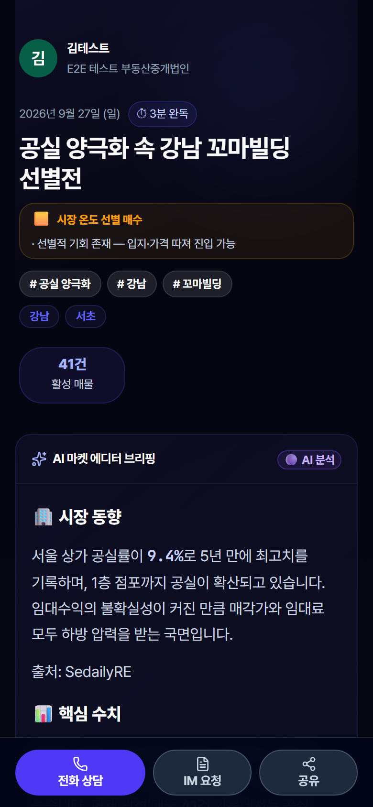

**커버에서 확인할 것**
- **중개사 영역**: 이니셜 아바타(예: 김), 공개 이름(프로필 이름 우선), 소속. 프로필 사진이 아니라 이니셜이 표시됩니다.
- **날짜와 읽는 시간**: `2026년 9월 27일 (일)`, `⏱ 3분 완독`. 읽는 시간은 본문 길이로 계산되므로 호마다 다릅니다.
- **헤드라인**
- **시장 온도 뱃지**: 예 `시장 온도 선별 매수 · 선별적 기회 존재 — 입지·가격 따져 진입 가능`. 에디션에 `market_temp`가 있을 때만 나옵니다. 아이콘과 글자·테두리 색이 같은 색(주황)으로 맞춰져 있습니다.
- **커버 키워드**: `# 공실 양극화 # 강남 # 꼬마빌딩`. 발행 시 입력한 만큼(이 호는 3개) 표시됩니다.
- **핵심 지표**: 예 `41건 활성 매물`.

**섹션 순서.** 섹션은 데이터가 있을 때만 나타나고, 순서는 주소의 `?target=`에 따라 달라집니다. 에디션에 `section_order`가 저장되어 있으면 그 순서가 우선합니다. 코드: `src/lib/magazine/view-helpers.ts` `ORDER_ALL/BUYER/SELLER`.

| # | 전체(기본) | 매수 `?target=buyer` | 매도 `?target=seller` |
|:---:|:---|:---|:---|
| 1 | AI 브리핑 | AI 브리핑 | AI 브리핑 |
| 2 | 현장 노트 | 현장 노트 | 현장 노트 |
| 3 | 금주의 테마 | **주목 매물** | **시장 데이터** |
| 4 | 주목 매물 | **금주의 테마** | **투자자 심리 지수** |
| 5 | 투표 | 투표 | 주목 매물 |
| 6 | 구독 카드 | 구독 카드 | 금주의 테마 |
| 7 | 중개사 프로필 | 중개사 프로필 | 투표 |
| 8 | 시장 데이터 | 시장 데이터 | 구독 카드 |
| 9 | 뉴스 큐레이션 | 뉴스 큐레이션 | 중개사 프로필 |
| 10 | 경매 픽 | 경매 픽 | 뉴스 큐레이션 |
| 11 | 리서치 리포트 | 리서치 리포트 | 경매 픽 |
| 12 | 투자자 심리 지수 | 투자자 심리 지수 | 리서치 리포트 |
| 13 | 수지분석 계산기 | 수지분석 계산기 | **세무·법률 클리닉** |
| 14 | 세무·법률 클리닉 | ~~세무~~ (매수에는 숨김) | **수지분석 계산기** |
| 15 | 레퍼럴 | 레퍼럴 | 레퍼럴 |

실습용 호에서 실제로 렌더링된 순서(스펙 실측)는 다음과 같습니다.
- 전체: `ai_briefing → featured_deals → poll → subscribe_cta → broker_profile → news_curation → auction_picks → roi_calculator → tax_clinic → referral`
- 매도: 같은 순서에서 `tax_clinic`이 `roi_calculator`보다 앞에 옵니다.
- 매수: `tax_clinic`이 없습니다.
- 현장 노트·금주의 테마·시장 데이터·리포트·심리 지수는 이 호에 데이터가 없어 나오지 않습니다.

> [!NOTE]
> 근거 없는 점수 지표는 독자 화면에 나오지 않습니다. 예전에 발행된 호의 합성 지표(예: "62/100 투자자 심리")는 `hasScoreEvidence`(생성 메타·심리 지수 항목·기준일이 모두 있을 때만 true)가 false이면 커버 지표에서 걸러지고, 본문 속 `NN/100` 토큰도 제거됩니다. 실제 발행 호 `2026-09-20` 커버에서도 미노출됨을 스펙 실습1이 확인합니다(PASS).

---

## 실습 2. 1-Click 투표 `@needs-migration`

투표는 독자 반응(매수/관망/매도 의향)을 한 번의 탭으로 모읍니다. 실습용 호의 질문과 선택지는 아래와 같습니다. 각 선택지의 의도(매수/중립/매도)는 발행설정에서 지정합니다.
- 질문: "이번 분기 강남 꼬마빌딩, 어떻게 보시나요?"
- 선택지: 지금이 매수 적기(매수) / 가격 조정 후 매수(중립) / 보유 건물 매각 검토(매도)

### 2-a. 현재 동작 — 투표 저장소 미적용 안내

현재 운영 DB에는 투표 테이블(`magazine_poll_responses`)이 아직 만들어지지 않았습니다. 그래서 선택지를 누르면 서버가 **503 `POLL_UNAVAILABLE`** 을 돌려주고, 화면에 다음 안내가 나옵니다.

> 설문을 일시적으로 사용할 수 없습니다. 잠시 후 다시 시도해주세요. **[다시 시도]**

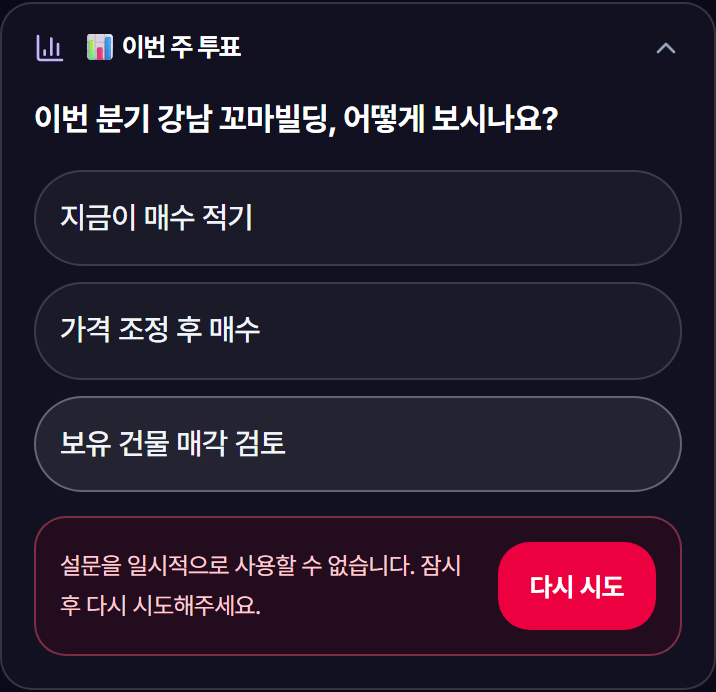

이때 선택지는 잠기지 않고, 투표 기록(poll_vote)도 남지 않습니다. 가짜 결과를 보여 주지 않는 정직한 처리입니다.

### 2-b. DB 업데이트 후 동작 (응답 계약)

마이그레이션이 적용되면 다음과 같이 동작합니다. 스펙은 서버 응답을 흉내 내어(route mock) 이 동작을 검증하며, 이 결과 화면은 실제 데이터가 아니라서 캡처하지 않았습니다.
- 투표하면 선택지별 비율과 `✓ 내 선택`이 표시됩니다. 예: 7명 → 29% / 14% / 57%, "총 7명이 참여했습니다".
- **응답이 5건 미만이면** 비율 대신 "결과는 응답이 5건 이상 모이면 공개됩니다."만 표시합니다.
- 매도 의향 선택지를 고르면 **"매도 상담 문의하기"**(전화) 버튼이 나옵니다. 누르면 문의(inquiry) 행동으로 기록됩니다.
- 같은 방문자가 다시 열면 이전 선택이 복원됩니다.

> [!NOTE]
> 투표 모듈과 열람 기록 모듈은 같은 브라우저 저장 키 `cre_mag_vid`의 방문자 번호를 공유합니다. 투표 후 다시 열어도 방문자 번호가 바뀌지 않아 순방문자 수가 부풀려지지 않습니다(스펙 실습2b PASS).

---

## 실습 3. 수지분석 계산기

독자가 슬라이더로 매입 조건을 바꾸면 결과 카드 3개가 즉시 다시 계산됩니다: **연 순수익률(Cap Rate)**, **자기자본수익률(Cash-on-Cash)**, **월 순현금흐름(Net Cash Flow)**. 섹션 제목은 "수지분석 계산기"이고 뱃지는 `실시간 시뮬레이션`입니다.

| 입력(화면 라벨) | 범위 | 단위(step) |
|:---|:---|:---|
| 전체 층수 (입력칸) | 1 ~ 60층 | 1 |
| 매입가 | 5억 ~ 300억 | 1억 |
| 대출비율 (LTV) | 0 ~ 80% | 5% |
| 대출금리 | 2.0 ~ 8.0% | 0.1% |
| 보증금 합계 | 0 ~ 50억 | 5천만 |
| 월세 합계 | 0 ~ 1억 | 50만 |
| 공실 (전체 N층) | 0 ~ 전체 층수 | 1층 |

- 슬라이더는 키보드(←/→)로도 조작할 수 있습니다. 예: LTV 60 → 65.
- 터치 영역은 44px입니다.
- **"상세 내역 펼치기 ▾"** 를 누르면 5개 항목이 보입니다: 대출금, 자기자본, 연 임대수입(공실 반영), 연 대출이자, NOI(순영업소득).
- 용어(Cap Rate · Cash-on-Cash · NOI)에는 설명이 붙어 있습니다.
- 조작한 슬라이더마다 calc_simulate 행동이 한 번씩 기록됩니다.

### 실습: 양호한 시나리오

매입가 **50억**, LTV **50%**, 금리 **4.5%**, 보증금 **5억**, 월세 **2,500만**, 공실 **0**으로 맞춥니다.

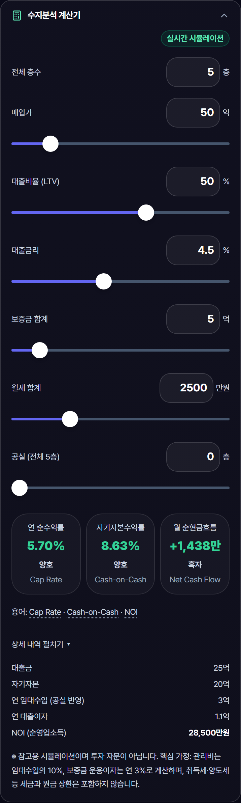

### 실습: 위험한 시나리오

이어서 LTV **70%**, 금리 **6.0%**, 보증금 **2억**, 월세 **1,500만**, 공실 **3개 층**(전체 5층)으로 바꿉니다.

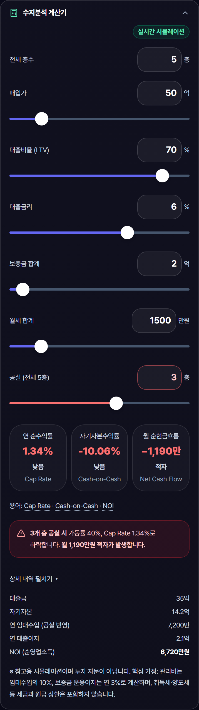

화면 값과 손 계산 값은 일치합니다(스펙 실측).

| 시나리오 | Cap Rate | CoC | 월 현금흐름 | NOI(연) | 대출금 / 자기자본 |
|:---|:---:|:---:|:---:|:---:|:---:|
| 기본값(30억·LTV60·4.5%·5억·1,500만·공실0·5층) | 5.90% | 13.71% | +800만 | — | — |
| 양호 | **5.70%** (녹색 "양호") | 8.63% | +1,438만 | 28,500만원 | 25억 / 20억 |
| 위험 | **1.34%** (적색 "낮음") | −10.06% | **−1,190만 (적자)** | 6,720만원 | 35억 / 14.2억 |

위험 시나리오에서는 다음 경고가 나옵니다.

> 3개 층 공실 시 가동률 40%, Cap Rate 1.34%로 하락합니다. 월 1,190만원 적자가 발생합니다.

계산기 하단에는 면책 문구(12px)가 있습니다.

> [!NOTE]
> "수지분석 계산기" 제목은 섹션 카드 머리글에 한 번만 표시됩니다.

---

## 실습 4. 세무·법률 클리닉 + 타깃별 노출

발행설정에서 Q&A를 입력하면 **"💰 세무·법률 클리닉"** 섹션으로 나옵니다. A/B 비교형 데이터라면 제목이 **"💡 세대 전환 전략 (증여/상속)"** 으로 바뀌고 `일반 정보` 뱃지가 붙습니다.

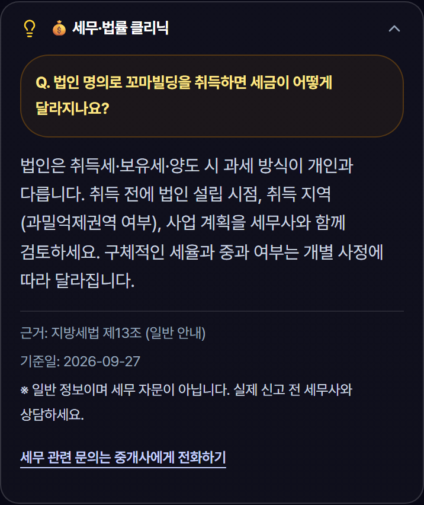

**구성**
- 질문(Q)과 답변
- **근거**(예: "지방세법 제13조 (일반 안내)")
- **기준일**(예: 2026-09-27)
- 면책 문구: "※ 일반 정보이며 세무 자문이 아닙니다. 실제 신고 전 세무사와 상담하세요."
- 상담 링크 **"세무 관련 문의는 중개사에게 전화하기"**. 누르면 문의(inquiry) 행동으로 기록됩니다.

**타깃별 노출**

| 주소 | 세무 섹션 |
|:---|:---|
| `?target=` 없음(전체) | 계산기 다음에 노출 |
| `?target=seller` | 계산기 **앞으로** 이동 |
| `?target=buyer` | 숨김 |

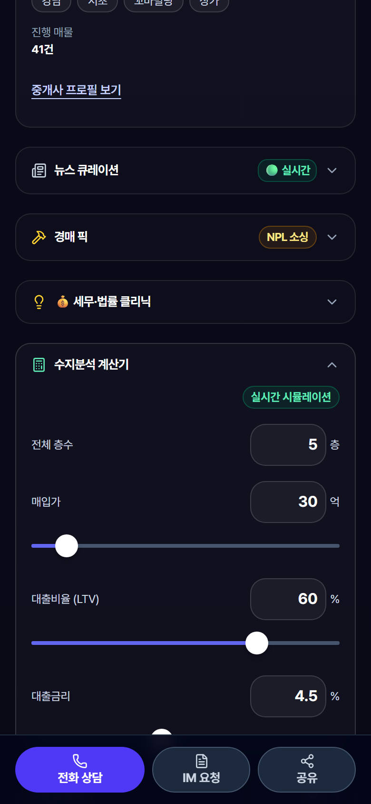

---

## 실습 5. 시장 데이터 · 뉴스 · 경매 (접기/펼치기)

뉴스 큐레이션은 접힌 상태로 시작합니다. 제목 오른쪽의 **꺾쇠(Chevron ⌄)** 를 누르면 펼쳐집니다. 기사마다 `호재/악재/중립` 라벨과 분류 태그가 붙습니다.

> [!NOTE]
> 기사 제목의 `&quot;` 같은 HTML 엔티티는 따옴표로 바뀌어 표시되고, 요약은 `핵심 팩트: …|브로커 임플리케이션: …` 구조에서 핵심 문장만 보입니다. 분류 태그도 모두 한글(예: `임대·공실`, `거래·매물`)입니다(`view-helpers.ts` `cleanNewsSummaryText`).

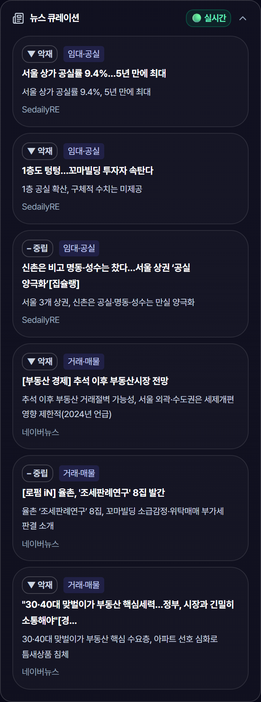

- **경매 픽**: 지역, 할인율(예: −20%), 최저입찰가, 감정가, 기일, 유찰 횟수를 보여 줍니다.
- **시장 데이터**: 실거래·임대·권역 데이터가 있을 때만 나옵니다. 매도 타깃에서는 3번째로 올라오고, 펼친 상태로 시작합니다.

> [!NOTE]
> **시장 데이터는 N/A입니다.** 현재 테스트 계정의 모든 발행 호는 실거래 0건, 임대·권역 데이터가 비어 있습니다. 그래서 시장 데이터 섹션이 나오지 않고 캡처도 없습니다(가짜 숫자를 넣지 않았습니다). 데이터 출처는 "공공데이터"로만 표시됩니다(P3).

---

## 실습 6. 하단 고정 바 — 전화 · IM · 공유

화면 아래에 항상 떠 있는 바로가기 3개입니다.

| 버튼 | 동작 | 기록되는 행동 |
|:---|:---|:---|
| **전화 상담** (주 버튼) | `tel:` 링크. 전화번호가 없으면 "카톡 문의", 그것도 없으면 "문의하기"로 바뀜 | phone_click |
| **IM 요청** | `/broker-profile/{슬러그}?ref=magazine-cta` | im_request |
| **공유** | 공유 시트가 없으면 링크 복사 → 버튼이 "복사됨", 토스트 "링크를 복사했어요" | share |

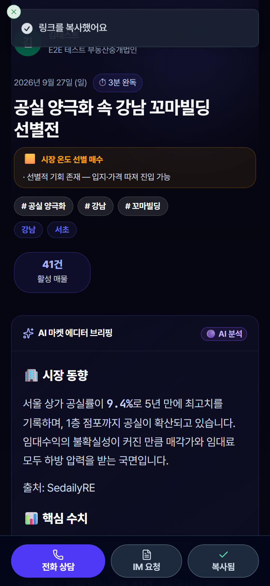

- 복사되는 주소는 `/magazine/{슬러그}/{날짜}`입니다. 매도 타깃으로 열었다면 `?target=seller`가 유지됩니다.
- 고정 바는 페이지 하단 안내문을 가리지 않습니다.

- 390px 폭에서도 라벨("IM 요청", "복사됨")이 잘리지 않도록 아이콘을 위에, 라벨을 아래(최대 2줄)에 둡니다.

---

## 실습 7. 독자 행동은 어떻게 기록되나요?

독자 화면은 다음 행동을 `/api/public/magazine/analytics`로 보냅니다.

| 행동 | 시점 |
|:---|:---|
| page_view | 화면을 열 때 |
| scroll | 25 / 50 / 75 / 100% 지점 |
| section_view | 섹션마다 1회 |
| dwell | 탭을 숨기거나 닫을 때(페이지 전체·섹션별) |
| poll_vote | 투표 |
| calc_simulate | 계산기 조작 |
| phone_click · im_request · share · inquiry | 버튼 클릭 |

- **방문자 번호**는 브라우저가 만든 임의의 UUID(`localStorage` `cre_mag_vid`)이며, 투표 후 다시 열어도 같은 번호가 유지됩니다. 서버에는 원문이 아니라 서버 비밀값 기반 HMAC 해시만 저장됩니다. 다른 기기나 브라우저에서는 다른 번호가 됩니다.
- 미리보기(`?preview=1`)와 미발행 날짜 화면은 **아무것도 보내지 않습니다**.
- 초안 에디션 id로 보내면 `tracked:false (NOT_PUBLISHED)`가 됩니다.
- 형식이 잘못된 방문자 번호는 400으로 거절됩니다.

페이지 하단에 수집 안내가 있습니다: "임의의 방문자 번호를 13개월간… 쿠키·기기 지문 아님", 개인정보처리방침(`/privacy`) 링크.

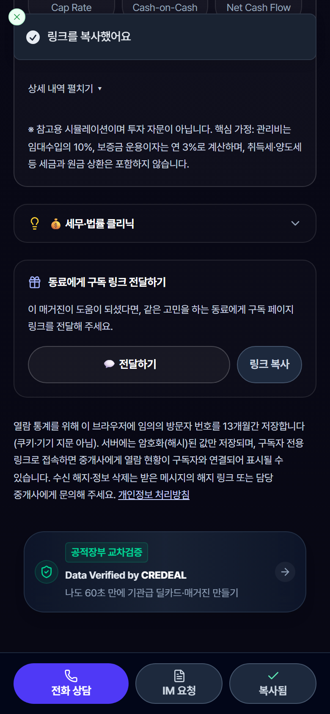

> [!NOTE]
> 독자 화면이 보낸 `edition_id`는 서버(`src/lib/magazine/edition-target.ts`)가 다음 순서로 해석하며, 발행 호 id로 보내도 거절하지 않습니다(`200 tracked:true`, 스펙 실습7 PASS).
> 1. 에디션 id이면 그 에디션에 기록합니다(초안이면 `tracked:false (NOT_PUBLISHED)`).
> 2. 예전 방식 발행 호(`magazine_issues`) id이면 같은 날짜의 발행된 에디션을 찾아 그 에디션에 기록합니다.
> 3. 연결된 에디션이 없는 예전 호는 에디션 없이 보관하며, 에디션 지표(실습 8 대시보드)에는 합산되지 않습니다(P3).
> 4. 둘 다 아니면 404입니다.

---

## 실습 8. 성과 대시보드 — 매수 온도 · 핫리드 · 통화 브리핑

에디터(`/broker/magazine-editor`)의 맨 오른쪽 탭 **성과**를 엽니다. 탭 순서: 커버 | 필드노트 | 테마&매물 | 뉴스 | AI비서 | 아웃리치 | 발행설정 | 성과.

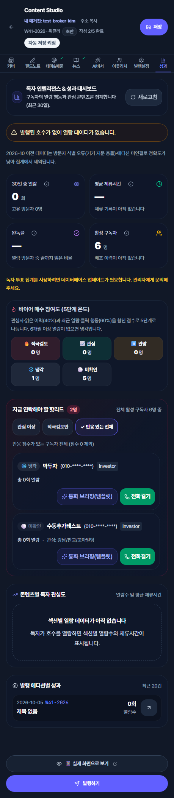

**KPI 4개** — 각 카드의 ⓘ 버튼을 누르면 집계 기준이 나옵니다(`KPI_DEFINITIONS`, `analytics-aggregate.ts` L11-18).
- **30일 총 열람**
- **평균 체류시간**
- **완독률**: 열람 방문자 중 페이지 끝(100%)까지 스크롤한 비율
- **활성 구독자**: DB 실측과 일치(실행 시점마다 다를 수 있음, 스펙은 DB와 대조)

**안내 문구**
- 발행된 에디션이 없으면 "발행된 호수가 없어 열람 데이터가 없습니다."가 나옵니다. 현재 테스트 계정은 발행 에디션이 없고 초안뿐이라 위 그림에도 이 안내가 보이며, 열람 지표는 0·"—"입니다.
- 투표 집계는 `@needs-migration`이라 "독자 투표 집계를 사용하려면 데이터베이스 업데이트가 필요합니다" 안내가 나옵니다.

**투표 시간대 추이** — DB 업데이트 후에 동작합니다.
- 투표 응답을 한국 시간 0~23시 막대로 보여 주고, "가장 많은 시간대 N시"를 표시합니다.
- 응답이 5건 미만이면 "응답이 5건 미만이라 시간대별 추이는 표시하지 않습니다."만 보여 줍니다.
- 응답 시각이 없으면 "응답 시각 기록이 없어…"를 보여 줍니다.

**바이어 매수 참여도 (5단계 온도)** — 표시 전용입니다(누를 수 없음).
- 전체 활성 구독자를 `🔥 적극검토 / 📈 관심 / ⏸️ 관망 / ❄️ 냉각 / ⚪ 미확인`별 인원으로 보여 줍니다.
- 다섯 단계 인원의 합은 활성 구독자 수와 같고, 값은 API 분포와 일치합니다(스펙 실측 2026-10-06 재실행: 활성 6명 = 🔥0 / 📈0 / ⏸️0 / ❄️1 / ⚪5. 핫리드는 관심 이상 0명, 적극검토만 0명, 반응 있는 전체 2명. 숫자는 실행 시점의 DB에 따라 달라집니다).

**지금 연락해야 할 핫리드** — 서버가 점수 기준으로 골라 줍니다. 기준 버튼을 바꾸면 서버에서 다시 조회합니다(`/api/broker/magazine/analytics?tier=`).

| 기준 버튼 | `tier` | 포함되는 구독자 |
|:---|:---:|:---|
| **관심 이상** (기본) | `warm` | 🔥 적극검토 + 📈 관심. 최근 IM 요청·전화 클릭으로 📈가 된 분 포함 |
| 적극검토만 | `hot` | 🔥 적극검토 |
| 반응 있는 전체 | `all` | 반응 점수 1점 이상(점수 0은 제외) |

- 점수 순(같으면 최근 활동 순)으로 최대 10명을 보여 줍니다. 버튼 아래에는 적용된 기준 문구가 표시됩니다.
- 알 수 없는 `tier` 값은 400으로 거절됩니다.
- 조건에 맞는 분이 없으면 "아직 관심 신호가 있는 구독자가 없습니다"와 함께 **[반응 있는 전체 보기]** 가 나옵니다.
- 현재 테스트 계정은 발행된 에디션에 연결된 열람 기록이 없어 기본(관심 이상)은 0명이고, "반응 있는 전체"에서만 관심사 점수가 있는 구독자가 보입니다(위 그림).

### 고객 상세 보기

핫리드 목록에서 고객 이름을 누르면 **"{이름} 열람 이력"** 패널이 열립니다. 열람 횟수, 평균 체류, 마지막 활동이 표시됩니다.

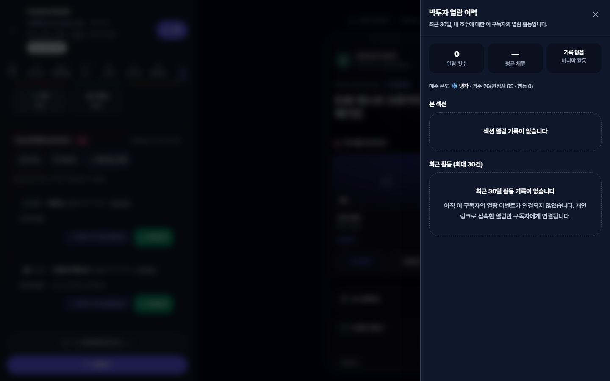

### 통화 브리핑(템플릿)

**"통화 브리핑(템플릿)"** 을 누르면 "{이름} 고객 통화 브리핑" 모달이 열립니다.
- "통화 전 참고용 템플릿입니다 (AI 생성 아님)"이라고 명시되어 있고, 생성 API를 호출하지 않습니다(스펙 실측 0회).
- **[문구 복사]** 로 통화 전 메모를 복사할 수 있습니다.

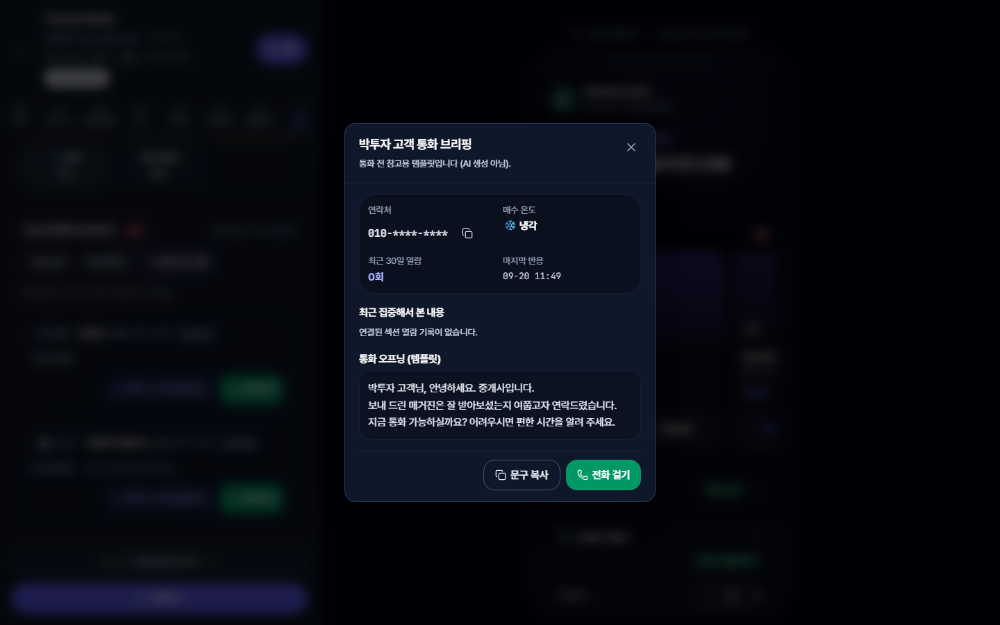

> [!NOTE]
> 통화 브리핑의 "마지막 반응" 날짜(위 그림: 09-20 11:49)가 상세 패널의 "기록 없음"과 다르게 나올 수 있습니다(P3). 통화 전에는 상세 패널의 열람 이력을 함께 확인하세요.

---

## 실습 9. 발행설정과 SNS 이미지

### 발행설정 탭

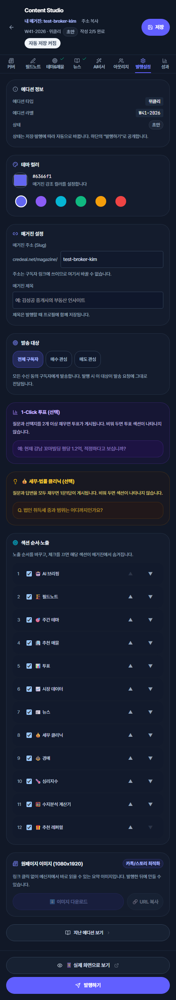

- **에디션 정보 / 테마 컬러 / 매거진 설정(주소·제목)**
- **발송 대상**: 전체 구독자 / 매수 관심 / 매도 관심. 고른 대상이 발송 요청에 그대로 전달됩니다.
- **1-Click 투표 (선택)**: 질문과 선택지를 2개 이상 채우면 투표가 게시되고, 비워 두면 투표 섹션이 나타나지 않습니다.
- **💰 세무·법률 클리닉 (선택)**: 질문과 답변을 모두 채우면 1문1답이 게시되고, 비워 두면 섹션이 나타나지 않습니다.
- **섹션 순서·노출**: 체크로 섹션을 숨기고 ▲▼로 순서를 바꿉니다. 저장하면 `section_order`가 되어 실습 1의 타깃별 기본 순서보다 우선합니다.
  - 이 목록의 초기 순서(…뉴스 → 세무 클리닉 → 경매 → 심리지수 → 수지분석 계산기…)는 독자 화면의 기본 순서와 **다릅니다**.
  - 순서를 저장하면 매도 타깃에서 세무를 앞으로 올리는 기본 규칙도 적용되지 않습니다.
- **원페이지 이미지 (1080x1920)**: **[⬇️ 이미지 다운로드]**(발행 후에만 활성) / **[🔗 URL 복사]**. 정사각형 카드 다운로드 UI는 없고, 카드는 URL로만 받을 수 있습니다.

### SNS 이미지 3종 (실측)

| 이미지 | 주소 | 크기 | 용량 | 캐시 |
|:---|:---|:---:|:---:|:---|
| 링크 미리보기(OG) | `/api/og/magazine?brokerId={슬러그}&date={날짜}` | 1200×630 | 87,877 B | `public, max-age=300, s-maxage=3600, stale-while-revalidate=86400` |
| 스토리 | `/api/magazine/{슬러그}/{날짜}/image?format=story` | 1080×1920 | 224,498 B | 위와 같음 |
| 카드 | `/api/magazine/{슬러그}/{날짜}/image?format=card` | 1080×1080 | 155,200 B | 위와 같음 |
| (호가 없는 날짜) | `…/2020-01-01/image?format=card` | 1080×1080 | 80,294 B | `public, max-age=60, s-maxage=300`, 중립 이미지 |

- **글꼴**: `public/fonts/NotoSansKR-{Regular,Bold}.woff`(OFL)를 사용합니다(`src/lib/magazine/og-fonts.ts`). 폰트가 없으면 라틴 폴백으로 한글이 지워지므로, 스펙 실습9가 폰트 탑재를 단언합니다.
- `format=og`는 OG 주소와 같은 이미지(바이트 동일)를 돌려줍니다.
- 미래 날짜는 400 + `no-store`로 거절됩니다.
- 예전 주소 `/api/og/magazine/{slug}`는 404입니다.
- 하단의 `010-0000-0000`은 테스트 계정 프로필에 저장된 placeholder 번호입니다.

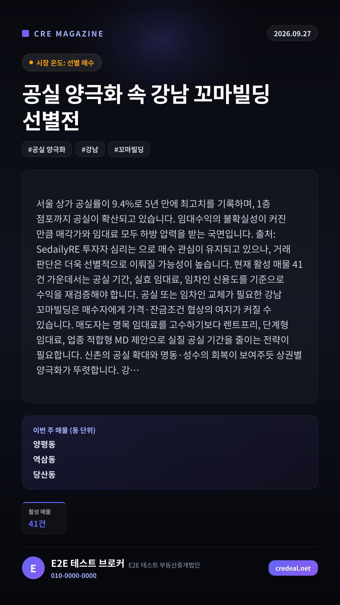

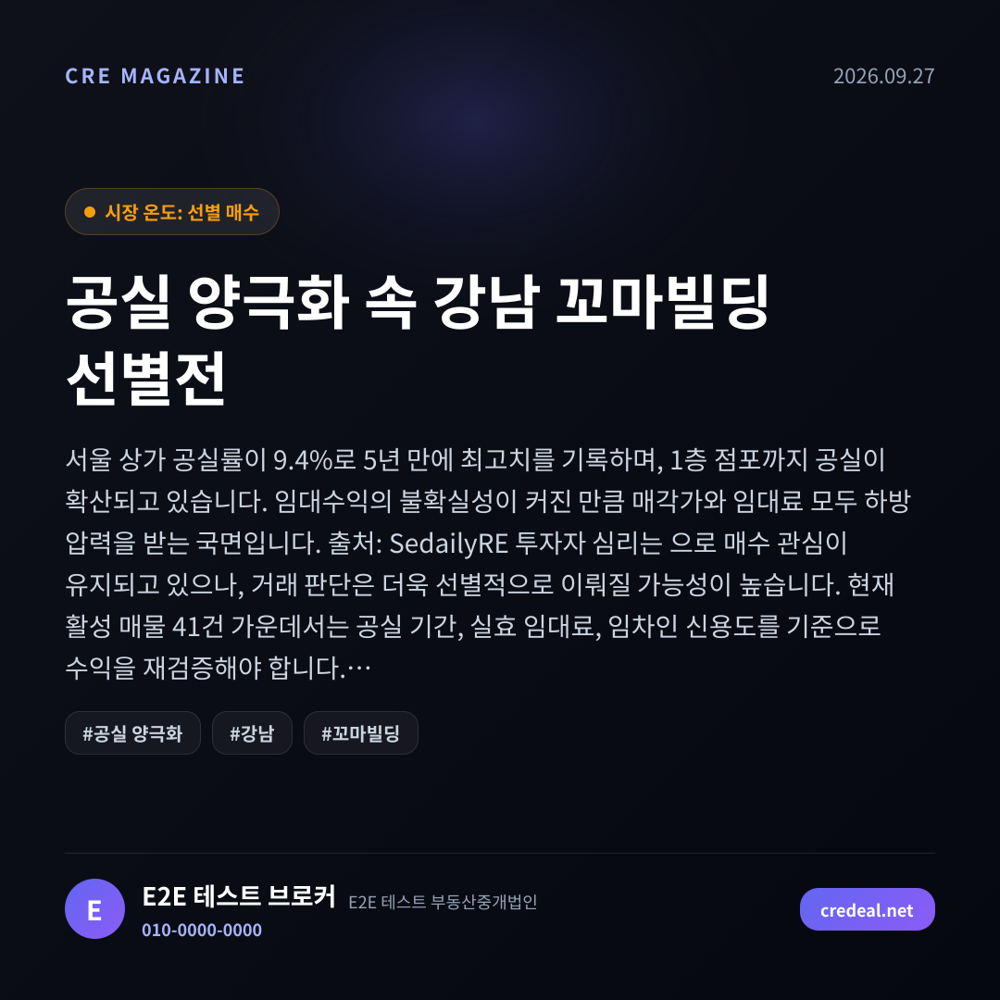

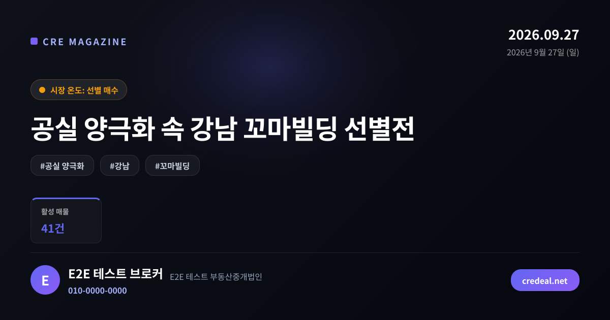

> [!NOTE]
> - 핵심 지표 칸은 `isSuspectStatValue`로, AI 브리핑 본문은 `cleanBriefing`으로 근거 없는 "62/100"을 제거합니다. 다만 숫자만 지우기 때문에 요약에 "투자자 심리는 으로 매수 관심이…"처럼 문장 일부가 어색하게 남을 수 있습니다(P3). 스토리 이미지를 보내기 전에 요약 문장을 한 번 확인하세요.
> - 스토리의 "이번 주 매물 (동 단위)"는 동 이름만 한 줄씩 표시합니다(제목이 없으면 주소를 반복하지 않고, "매각가" 같은 라벨 문구는 걸러냅니다 — `og-image-data.ts` `normalizeDeal`).

---

## 실습 10. 아직 발행되지 않은 날짜 · 360px 화면

**미래 날짜**(예: `/2099-12-31`)를 열면 다음이 표시됩니다.
- "2099년 12월 31일 (목) 호는 아직 발행일이 되지 않았습니다"
- **[가장 최근 호 보기 (2026년 10월 4일 (일))]** → 최신 호로 이동
- 지난 매거진 목록
- 다음 호 구독하기

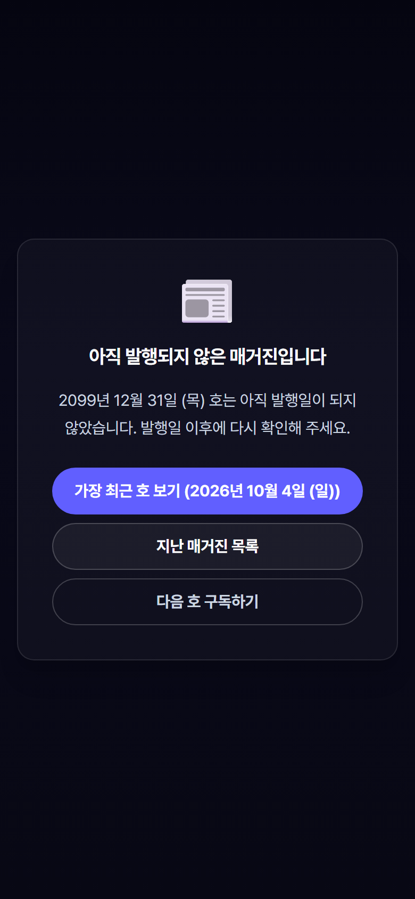

**과거에 발행하지 않은 날짜**(예: 2020-01-01)는 "…(수) 호는 발행되지 않았거나 공개 대기 중입니다"로 안내합니다. 두 경우 모두 검색 제외(noindex)이고 행동 기록을 보내지 않습니다.

**360px 화면**에서도 가로 넘침이 없고 하단 바는 한 줄을 유지하며, 보조 버튼 라벨("IM 요청", "공유")도 잘리지 않습니다. 다만 결과 카드의 "자기자본수익률"·"Cash-on-Cash"는 아직 글자 단위로 줄바꿈됩니다(P3).

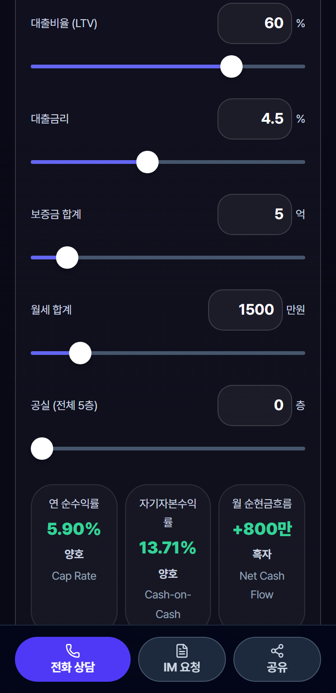

---

## 부록 A. 독자 화면 섹션 명칭 16종 (화면 표기 기준)

| # | 섹션 id | 독자 화면 제목 | 에디터 발행설정 라벨 |
|:---:|:---|:---|:---|
| 1 | ai_briefing | AI 마켓 에디터 브리핑 | 🤖 AI 브리핑 |
| 2 | field_note | {이름}의 현장 노트 | 🏗️ 필드노트 |
| 3 | theme_of_week | 금주의 테마 | 🎯 주간 테마 |
| 4 | featured_deals | 주목 매물 하이라이트 | 🏢 추천 매물 |
| 5 | poll | 📊 이번 주 투표 | 📊 투표 |
| 6 | subscribe_cta | 구독 카드 | — |
| 7 | broker_profile | 중개사 프로필 | — |
| 8 | market_data | 시장 데이터 | 📈 시장 데이터 |
| 9 | news_curation | 뉴스 큐레이션 | 📰 뉴스 |
| 10 | auction_picks | 경매 픽 | ⚖️ 경매 |
| 11 | reports | 전문 리서치 리포트 | — |
| 12 | sentiment_index | CRE 투자자 심리 지수 | 🌡️ 심리지수 |
| 13 | tax_clinic | 💰 세무·법률 클리닉 / 💡 세대 전환 전략 (증여/상속) | 💰 세무 클리닉 |
| 14 | roi_calculator | 수지분석 계산기 | 🧮 수지분석 계산기 |
| 15 | referral | 동료에게 구독 링크 전달하기 | 🎁 추천 레퍼럴 |
| 16 | (하단 뱃지) | Data Verified by CREDEAL | — |

> 에디터 라벨과 독자 화면 제목이 서로 다릅니다(P3). 고객에게 안내할 때는 독자 화면 제목을 쓰세요.

## 부록 B. 남아 있는 제품 한계 (2026-10-06 골든 스펙 재실행 기준)

| 우선순위 | 현상 | 위치 | 스펙 |
|:---:|:---|:---|:---|
| P3 | 에디션이 연결되지 않은 예전 방식 호의 열람은 수집(200)되지만 에디션 지표에는 합산되지 않음 (연결된 발행 에디션이 있으면 그 에디션에 기록) | `lib/magazine/edition-target.ts` | 실습7 |
| P3 | SNS 이미지 AI 브리핑 요약에서 "62/100" 숫자는 제거되지만 앞뒤 문장 일부가 어색하게 남음(예: "투자자 심리는 으로 매수 관심이…") | `lib/magazine/og-image-data.ts` `cleanBriefing` | 실습9 |
| P3 | 계산기 결과 카드 라벨("자기자본수익률", "Cash-on-Cash", "Net Cash Flow")이 좁은 화면에서 줄바꿈됨 | `components/magazine/RoiCalculator.tsx` | 실습3·10 |
| P3 | 통화 브리핑 "마지막 반응" 날짜가 구독자 상세 패널의 "기록 없음"과 다르게 나올 수 있음 | 성과 대시보드 | 실습8 |
| P3 | 시장 데이터 출처가 "공공데이터"로만 표시됨 | 시장 데이터 섹션 | 참고 |
| P3 | 개발 모드에서 `SectionCard`/`AuctionSection` 목록 `key` 경고가 콘솔에 남음(화면 영향 없음) | `components/magazine/` | 실습 전체 |

**해소된 항목 (스펙 PASS로 회귀 방지 중)** — 레거시 "62/100"의 독자 화면 노출(근거 없는 점수는 `hasScoreEvidence`로 숨김) · `cre_mag_vid` 저장 키 충돌 · 발행 호 id 열람 기록 404 · 390px 하단 바 라벨 잘림 · SNS 이미지 한글 폰트 · 스토리 "이번 주 매물" 주소 중복·"매각가" 노출 · 뉴스 `&quot;`·내부 구조 요약·태그 혼재 · 시장 온도 아이콘/색 불일치 · 계산기 제목 중복 · 성과 대시보드 KPI 카드 줄바꿈.

---

## ✅ 문서 오류(DOC_ERROR) 정정 체크리스트

| ID | 이전 문서의 오류 | 이번 문서의 정정 | 위치 |
|:---|:---|:---|:---|
| T3-21 | 점수 모델 "+5 열람 / +15 설문 / +20 매물 / +30 최근" | 실제 산식(관심사×0.4 + 행동×0.6, 행동별 점수/상한, 보정 규칙)으로 교체 | 핵심 개념 |
| T3-22 | 매도 타깃에서 세무가 앞으로 오지 않음 | 실측: 매도에서 세무가 계산기 앞, 매수에서는 숨김 | 실습 1·4 |
| T3-28 | 날짜 "(토)" | "(일)" 실표기 | 실습 1 |
| T3-29 | "약 2분" | "⏱ 3분 완독"(본문 길이 기준, 호마다 다름) | 실습 1 |
| T3-30 | 커버 사진 | 이니셜 아바타 | 실습 1 |
| T3-31 | "1:1 상담 전화 걸기" | "세무 관련 문의는 중개사에게 전화하기" | 실습 4 |
| T3-32 | 계산기 라벨, "상세 분석 보기", 상세 7항목 | 실제 슬라이더 6개 + 상세 5항목 | 실습 3 |
| T3-33 | KPI 라벨, "전화 준비" | 30일 총 열람 / 평균 체류시간 / 완독률 / 활성 구독자, "통화 브리핑(템플릿)" | 실습 8 |
| T3-35 | 카드 다운로드·매수/매도 타깃 서술 | 발송 대상 3종 + "⬇️ 이미지 다운로드"(스토리만), 카드 UI 없음 | 실습 9 |
| T3-37 | 📞/📋 IM 열람 신청 | "전화 상담 / IM 요청 / 공유", 전화번호가 없을 때 대체 규칙 | 실습 6 |
| T3-38 | 폴백 설문 예시 | 발행 poll 기준 질문·선택지·의도 | 실습 2 |
| T3-39 | 키워드·시장 포스처·온도 뱃지 서술 | 커버 키워드(입력한 개수만큼), `market_temp` 뱃지 | 실습 1 |
| T3-44 | 이미지 31/35/36 캡션 불일치, 32·33·35·36 가짜 데이터 | 전부 실측 재촬영(p3_*), 캡션은 스펙 단계와 일치 | 전체 |
| T3-54 | "펼치기(+)" | 꺾쇠(Chevron) | 실습 5 |
| T3-58 | 이미지 31에 Next dev "N" 표시 | 메인 문서와 미리보기 iframe 모두에서 dev 표시를 숨기고 촬영 | 전체 |
| DOC-1 | 이미지 34의 LTV 60 고정 화면 | 실제 슬라이더를 조작한 p3_03/p3_04, 손 계산과 대조 | 실습 3 |
| DOC-2 | 이미지 37~39의 더미 전화번호·키워드 | 실제 이미지 라우트 출력 p3_15~17(한글 폰트 탑재 후 재촬영, 남은 결함 명시) | 실습 9 |
| DOC-3 | 섹션 명칭 5종 오기 | 화면 표기 16종 표 + 에디터 라벨 대조 | 부록 A |
| DOC-4 | "SHA256 지문 검증" 주장 | 삭제. 실측 크기·용량·Cache-Control로 대체 | 실습 9 |
| DOC-5 | 구 감사 보고서 "ALL PASSED" | [`AUDIT_REPORT_PART3_…`](./AUDIT_REPORT_PART3_VIEWER_ANALYTICS_ASSETS.md) 상단에 무효 배너 추가, 구 이미지 31~39 삭제 | 별도 문서 |
| DOC-6 | 수정이 끝난 결함까지 "알려진 결함(스펙 FAIL)" 경고로 남아 있음 (레거시 62/100, `cre_mag_vid` 충돌, 발행 호 id 404, 계산기·뉴스·시장 온도 표시, 하단 바 라벨 잘림, 이미지 주소 중복) | 해결된 항목은 경고를 지우고 현행 동작으로 교체. 남은 한계만 부록 B에 정확한 현상으로 유지 (2026-10-06 골든 스펙 재실행 PASS 기준) | 전체 · 부록 B |
