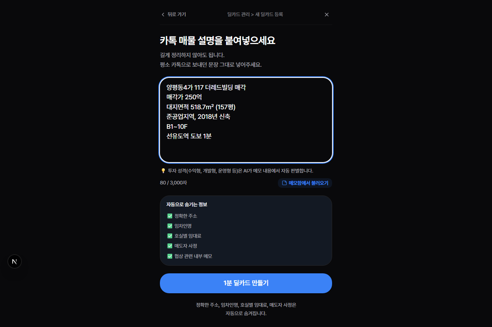
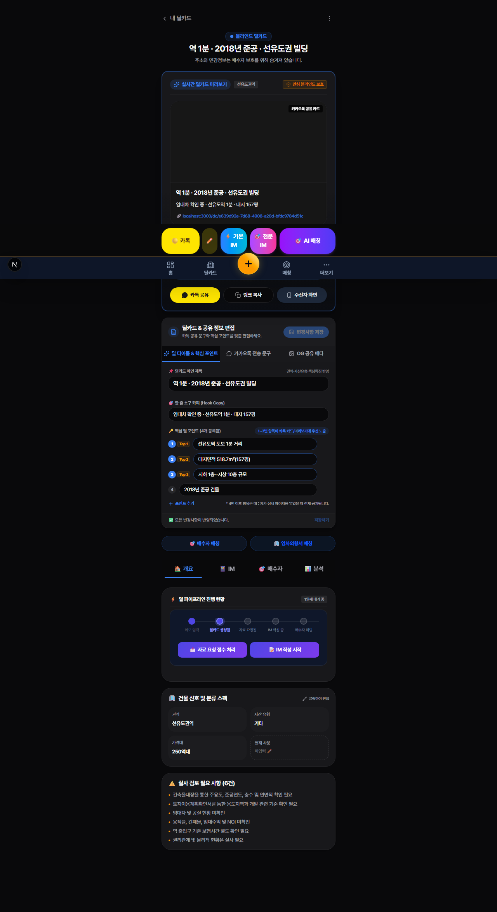
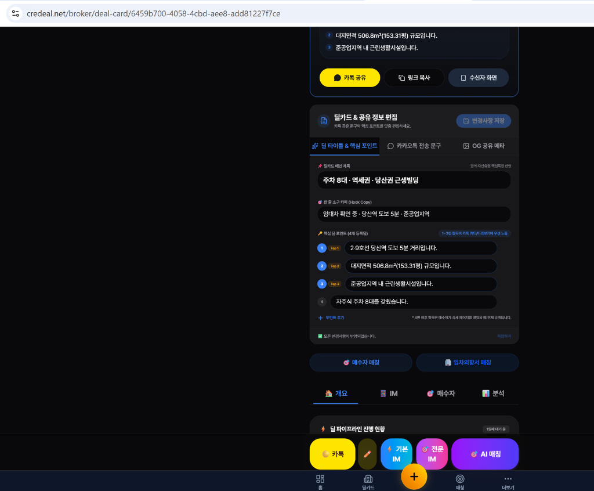
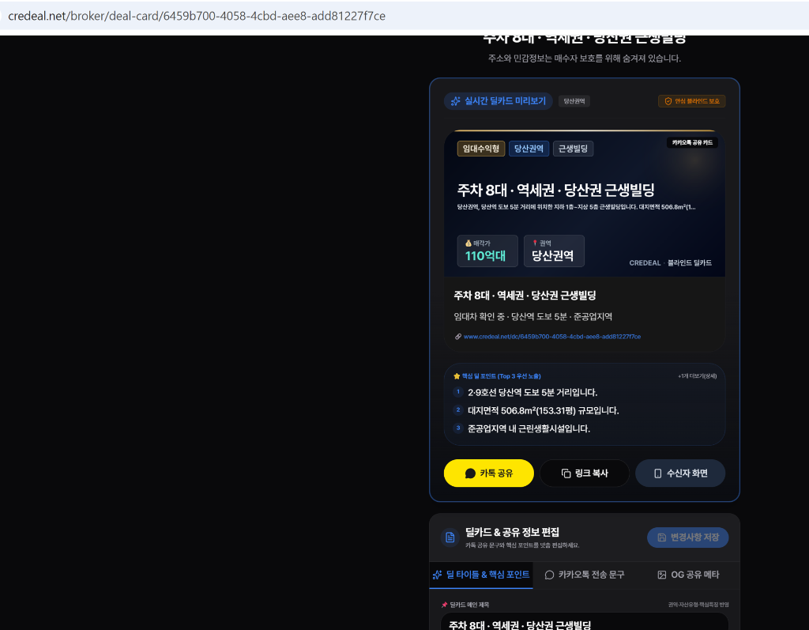
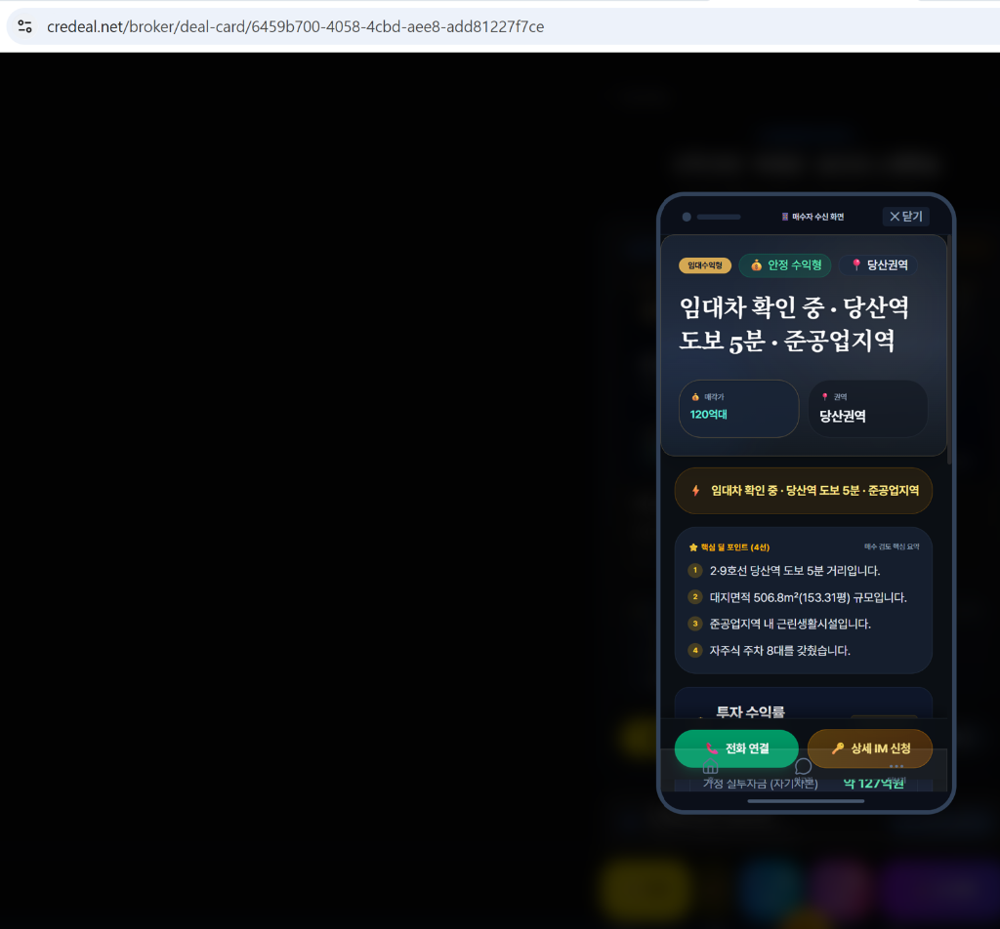
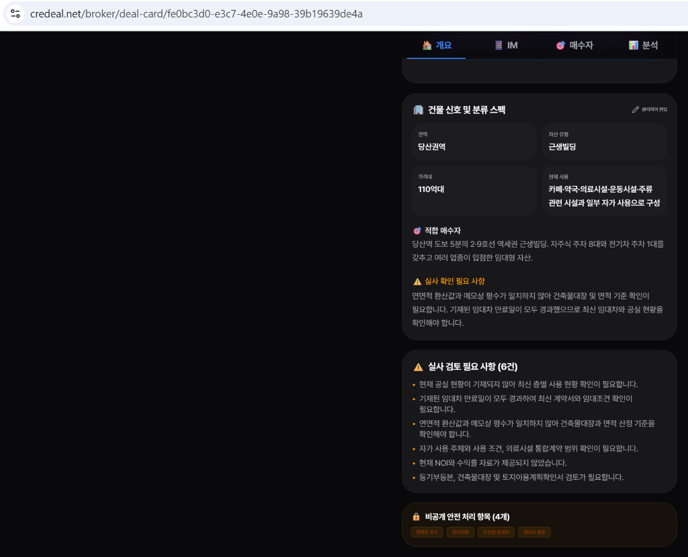
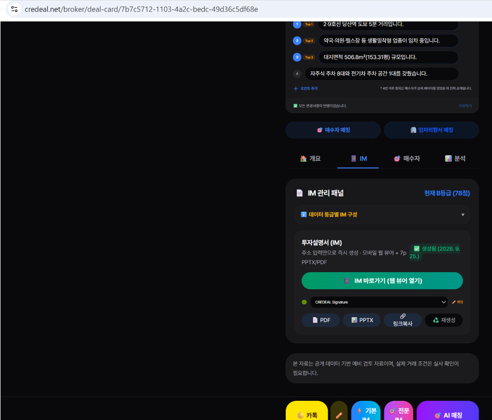

# 📘 CREDEAL 딜카드 사용 가이드

> **대상**: 처음 CREDEAL을 사용하는 상업용 부동산 중개인  
> **범위**: 딜카드 생성 → 편집 → 공유 → 매수자 매칭 (기본 IM 생성 이전까지)  
> **최종 업데이트**: 2026년 9월 25일

---

## 목차

1. [딜카드란 무엇인가?](#1-딜카드란-무엇인가)
2. [딜카드 만들기 (메모 → 1분 생성)](#2-딜카드-만들기)
3. [딜카드 화면 구성 한눈에 보기](#3-딜카드-화면-구성-한눈에-보기)
4. [딜카드 문구 편집하기](#4-딜카드-문구-편집하기)
5. [카카오톡으로 공유하기](#5-카카오톡으로-공유하기)
6. [매수자가 보는 수신 화면 미리보기](#6-매수자가-보는-수신-화면-미리보기)
7. [개요 탭 — 건물 신호 및 실사 포인트](#7-개요-탭--건물-신호-및-실사-포인트)
8. [IM 탭 — 투자설명서 관리](#8-im-탭--투자설명서-관리)
9. [매수자 탭 — AI 페르소나 & 매칭](#9-매수자-탭--ai-페르소나--매칭)
10. [분석 탭 — 가격 예측 & 일정](#10-분석-탭--가격-예측--일정)
11. [딜 파이프라인 관리](#11-딜-파이프라인-관리)
12. [딜카드 삭제하기](#12-딜카드-삭제하기)
13. [자주 묻는 질문 (FAQ)](#13-자주-묻는-질문-faq)

---

## 1. 딜카드란 무엇인가?

**딜카드**는 매도자의 민감 정보를 자동으로 보호하면서, 매물의 핵심 투자 포인트를 매수자에게 전달하기 위한 **블라인드 마케팅 카드**입니다.

### 딜카드의 핵심 가치

| 기능 | 설명 |
|:---|:---|
| 🛡️ **매도자 보호** | 정확한 주소, 임차인명, 호실별 임대료, 매도자 사정 등 9대 민감 정보를 자동 블라인드 처리 |
| ⚡ **1분 생성** | 카톡으로 보내던 메모를 그대로 붙여넣으면 AI가 자동으로 전문 딜카드로 변환 |
| 📊 **AI 분석** | 투자 성격(수익형·개발형·사옥형) 자동 판별, 매수자 페르소나 생성, 자동 매칭 |
| 📱 **카톡 공유** | 한 번 클릭으로 카카오톡 OG 카드 형태 공유 |

### 딜카드 활용 전체 흐름

```
메모 작성 → 딜카드 생성 → 문구 편집 → 카톡 공유 → 매수자 열람 → AI 매칭 → IM 생성
└─ 이 튜토리얼의 범위 ──────────────────────────────────────────────┘
```

---

## 2. 딜카드 만들기

### STEP 1. 새 딜카드 등록 화면 진입

아래 경로 중 아무 곳에서나 새 딜카드 등록 화면으로 이동할 수 있습니다:
- 하단 네비게이션 바 → 가운데 **`+`** 버튼
- 홈(대시보드) → **"+ 새 딜카드 만들기"**
- 매물 관리 → 매물 카드 → **"딜카드 만들기"**


> **화면 안내**
> - 상단 제목: "카톡 매물 설명을 붙여넣으세요"
> - 길게 정리하지 않아도 됩니다. **평소 카톡으로 보내던 문장 그대로** 넣어주세요.
> - 하단에 "자동으로 숨기는 정보" 5가지가 체크되어 있습니다 (정확한 주소, 임차인명, 호실별 임대료, 매도자 사정, 협상 관련 내부 메모)

### STEP 2. 매물 메모 입력

평소 카톡으로 동료에게 보내던 그대로 입력합니다.



**입력 예시:**
```
양평동4가 117 더레드빌딩 매각
매각가 250억
대지면적 518.7m² (157평)
준공업지역, 2018년 신축
B1~10F
선유도역 도보 1분
```

> **💡 팁**
> - **최소 5자** 이상 입력해야 합니다 (최대 3,000자)
> - 투자 성격(수익형, 개발형, 운영형 등)은 AI가 **자동으로 판별**합니다
> - 메모함에 미리 저장해둔 메모가 있다면 **"메모함에서 불러오기"** 버튼을 활용하세요

### STEP 3. "1분 딜카드 만들기" 클릭

파란색 **"1분 딜카드 만들기"** 버튼을 누르면 AI가 7단계 분석을 진행합니다:

```
1️⃣ 메모 퀄리티 검증 (위치·자산유형·숫자·거래유형)
2️⃣ 중복 매물 감지 (PNU/지번 기반)
3️⃣ AI 메모 파서 → 구조화 데이터 추출
4️⃣ 건물 진실 데이터(SSoT) 생성
5️⃣ 블라인드 티저 자동 작성
6️⃣ 매도자 보호 항목 자동 블라인드
7️⃣ 백그라운드 AI 매칭 실행
```

### STEP 4. 딜카드 완성!

생성이 완료되면 딜카드 상세 페이지로 자동 이동합니다.



> **생성 직후 화면 구성:**
> - 상단: **블라인드 딜카드** 뱃지 + 딜카드 제목
> - 카카오톡 공유 카드 미리보기
> - 하단 액션 바: 카톡 · 기본IM · 전문IM · AI매칭
> - 에디터: 딜 문구 편집 영역
> - 4개 탭: 개요 · IM · 매수자 · 분석

---

## 3. 딜카드 화면 구성 한눈에 보기

딜카드 상세 페이지는 위에서 아래로 다음과 같이 구성됩니다:

```
┌─────────────────────────────────────────┐
│  ● 블라인드 딜카드                          │
│  역 1분 · 2018년 준공 · 선유도권 빌딩        │  ← 딜카드 메인 제목
│  주소와 민감정보는 매수자 보호를 위해 숨겨져 있습니다  │
├─────────────────────────────────────────┤
│  ┌─────────────────────────────┐        │
│  │    카카오톡 공유 카드 미리보기     │        │  ← OG 공유 카드
│  │    (800×400 이미지)            │        │
│  └─────────────────────────────┘        │
│  [ 카톡 공유 ] [ 링크 복사 ] [ 수신자 화면 ]   │  ← 공유 버튼 3종
├─────────────────────────────────────────┤
│  📝 딜카드 & 공유 정보 편집                  │
│  ┌──────────────┬──────────┬──────┐     │
│  │ 딜 타이틀 &    │ 카카오톡   │ OG   │     │  ← 에디터 3탭
│  │ 핵심 포인트    │ 전송 문구  │ 공유  │     │
│  │              │          │ 메타  │     │
│  └──────────────┴──────────┴──────┘     │
├─────────────────────────────────────────┤
│ [카톡][  ][기본IM][전문IM][AI매칭]         │  ← 하단 액션 바
├─────────────────────────────────────────┤
│  🏠 개요  │  📋 IM  │  🎯 매수자  │  📊 분석  │  ← 정보 4탭
├─────────────────────────────────────────┤
│  ⚡ 딜 파이프라인 진행 현황                   │  ← 파이프라인
│  ───●──────○──────○──────○──────○─────  │
│  매각 검토 → 딜카드생성 → 자료 요청접수 → ...  │
└─────────────────────────────────────────┘
```

---

## 4. 딜카드 문구 편집하기

AI가 자동 생성한 문구를 수정할 수 있습니다. 모든 변경사항은 **자동 저장**됩니다.



### 4-1. 딜 타이틀 & 핵심 포인트 탭

| 필드 | 설명 | 예시 |
|:---|:---|:---|
| **딜카드 메인 제목** | 매수자가 가장 먼저 보는 한 줄 제목 | "주차 8대 · 역세권 · 당산권역 근생빌딩" |
| **한 줄 소구 카피 (Hook Copy)** | 제목 아래에 표시되는 관심 유발 카피 | "임대차 확인 중 · 당산역 도보 5분 · 준공업지역" |
| **핵심 딜 포인트** | 번호가 매겨진 투자 포인트 (Top 3가 카드에 우선 노출) | "① 2·9호선 당산역 도보 5분 거리입니다" |

> **💡 팁**: 핵심 딜 포인트는 **4번째부터** 는 매수자가 "상세 페이지를 열었을 때"만 공개됩니다. 가장 강력한 포인트를 **Top 1~3에** 배치하세요.

### 4-2. 카카오톡 전송 문구 탭

카톡으로 공유할 때 딜카드 링크와 함께 전송되는 브리핑 텍스트입니다.
- 실시간 **글자 수 카운터**가 표시됩니다
- 너무 길면 카카오톡에서 잘릴 수 있으니 200자 내외가 적당합니다

### 4-3. OG 공유 메타 탭

카카오톡이나 문자로 링크를 보냈을 때 자동으로 표시되는 미리보기 카드의 제목과 설명을 편집합니다.

| 필드 | 어디에 표시되나 |
|:---|:---|
| OG 제목 | 카톡 링크 미리보기의 **굵은 제목** |
| OG 설명 | 카톡 링크 미리보기의 **회색 부제** |

---

## 5. 카카오톡으로 공유하기

딜카드의 가장 중요한 기능입니다. 매수자에게 **블라인드 처리된 매물 카드**를 카카오톡으로 전달할 수 있습니다.



### 공유 방법

1. 딜카드 상세 페이지에서 노란색 **"카톡 공유"** 버튼을 클릭합니다
2. 카카오톡 공유 창이 열립니다
3. 받는 사람(매수자)을 선택하고 전송합니다

### 매수자가 받는 카카오톡 메시지 내용

```
┌──────────────────────────────┐
│  [OG 이미지 - 800×400]         │
│  중개인 이름 포함 자동 생성       │
├──────────────────────────────┤
│  주차 8대 · 역세권 · 당산권역    │  ← OG 제목
│  근생빌딩                      │
│                              │
│  임대차 확인 중 · 당산역 도보    │  ← OG 설명
│  5분 · 준공업지역               │
│                              │
│  🔗 www.credeal.net/dc/...    │  ← 딜카드 링크
├──────────────────────────────┤
│      [ 딜카드 확인하기 ]         │  ← CTA 버튼
└──────────────────────────────┘
```

### 다른 공유 방법

| 방법 | 설명 |
|:---|:---|
| **링크 복사** | 딜카드 URL을 클립보드에 복사 → 문자·이메일 등 어디든 붙여넣기 |
| **수신자 화면** | 매수자가 보는 화면을 스마트폰 프레임 안에서 미리 확인 (아래 참조) |

---

## 6. 매수자가 보는 수신 화면 미리보기

**"수신자 화면"** 버튼을 클릭하면, 매수자가 실제로 보게 될 화면을 스마트폰 모양의 프레임 안에서 미리 확인할 수 있습니다.



### 매수자 수신 화면의 구성 (위→아래)

| 순서 | 영역 | 내용 |
|:---:|:---|:---|
| 1 | **투자 성격 뱃지** | `임대수익형`, `안정 수익형`, `당산권역` 등 자동 태그 |
| 2 | **한 줄 카피** | "임대차 확인 중 · 당산역 도보 5분 · 준공업지역" |
| 3 | **핵심 정보** | 매각가(밴딩 처리됨), 권역 |
| 4 | **핵심 딜 포인트** | ① ② ③ ④ 번호 리스트 |
| 5 | **투자 수익률 시뮬레이터** | 수익형 매물: 슬라이더로 NOI·Cap Rate 조절 |
| 6 | **담당 중개사 프로필** | 이름, 전문 분야, 응답 보장 시간, 공인중개사 뱃지 |
| 7 | **하단 플로팅 바** | 📞 전화 연결 · 📄 상세 IM 신청 |
| 8 | **보안 정책** | 🛡️ 보안 검증 완료 (k=20) — K-익명성 검증 결과 |

> **⚠️ 중요**: 매수자 수신 화면에는 **정확한 주소, 임차인명, 건물주 정보 등이 절대 표시되지 않습니다**. 블라인드 보호가 자동으로 적용됩니다.

---

## 7. 개요 탭 — 건물 신호 및 실사 포인트

딜카드 하단의 **"개요"** 탭에는 AI가 분석한 건물 정보와 중개인이 확인해야 할 사항이 정리되어 있습니다.



### 7-1. 건물 신호 및 분류 스펙

| 항목 | 설명 | 예시 |
|:---|:---|:---|
| 권역 | AI가 추정한 지역 권역 | 당산권역 |
| 자산 유형 | 건물 용도 분류 | 근생빌딩 |
| 가격대 | 밴딩 처리된 가격 범위 | 110억대 |
| 현재 사용 | 현재 임차 용도 | 카페·약국·의료시설·운동시설... |

> **인라인 편집**: 각 항목 옆의 ✏️ 아이콘을 클릭하면 직접 수정할 수 있습니다.

### 7-2. 핵심 투자 포인트 (적합 매수자)

AI가 매물의 특성을 분석하여 자동 생성한 **핵심 투자 매력 요약**입니다.

### 7-3. 실사 확인 필요 사항

AI가 메모에서 빠져 있거나 불확실한 정보를 자동으로 감지하여 목록으로 제시합니다.

**실사 검토 필요 사항 예시:**
- 현재 공실 현황이 기재되지 않아 최신 층별 사용 현황 확인 필요
- 기재된 임대차 만료일이 모두 경과하여 최신 계약서 확인 필요
- 연면적 환산값과 메모상 평수가 일치하지 않아 건축물대장 확인 필요

### 7-4. 비공개 안전 처리 항목

블라인드 처리된 항목이 태그 형태로 표시됩니다:
`정확한 주소` `임차인명` `호실별 임대료` `매도자 만료` 등

---

## 8. IM 탭 — 투자설명서 관리

딜카드의 **"IM"** 탭에서는 투자설명서(Investment Memorandum)를 생성하고 관리할 수 있습니다.



### IM 관리 패널에서 할 수 있는 것

| 기능 | 설명 |
|:---|:---|
| **데이터 등급별 IM 구성** | 현재 데이터 품질 점수 표시 (예: B등급 78점) |
| **IM 바로가기 (웹 뷰어 열기)** | 생성된 IM을 웹에서 바로 확인 |
| **PDF 다운로드** | IM을 PDF 파일로 다운로드 |
| **PPTX 다운로드** | IM을 파워포인트 파일로 다운로드 |
| **링크복사** | IM 웹 뷰어 링크를 클립보드에 복사 |
| **재생성** | IM을 처음부터 다시 생성 |

> **💡 IM이 아직 없는 경우**: "투자보고서가 아직 준비 중입니다"라는 안내가 표시됩니다. 하단 액션 바의 **"기본 IM"** 또는 **"전문 IM"** 버튼을 눌러 생성을 시작하세요.

---

## 9. 매수자 탭 — AI 페르소나 & 매칭

### 9-1. AI 가상 매수자 페르소나 생성

딜카드 **"매수자"** 탭에서 **"✨ AI 매수자 페르소나 도출"** 버튼을 클릭하면, AI가 매물의 SSoT 데이터를 분석하여 **3가지 가상 매수자 프로파일**을 생성합니다.

#### 3대 매수자 유형

| 유형 | 아이콘 | 예시 |
|:---:|:---:|:---|
| **사옥형** | 🏢 | "IT 스타트업의 본사 이전 검토" |
| **투자형** | 📈 | "강남 임대수익 포트폴리오 편입" |
| **증여형** | 🎁 | "가업승계 목적 자산 확보" |

#### 각 페르소나 카드에 포함되는 정보

| 항목 | 내용 |
|:---|:---|
| 매수자 유형 | 법인 / 개인 / 가족 오피스 등 |
| 매칭 적합도 | 85%, 72% 등 점수 |
| 추정 예산 | 80억~100억 |
| 매입 동기 | "본사 이전 검토", "임대수익 포트폴리오 편입" |
| 핵심 요구조건 | 역세권, 주차 10대+, 전용률 55%+ |
| 발굴 경로 | "강남 상업용 중개 네트워크" |
| 접근 전략 | 이 매수자에게 어필하는 구체 화법 |

### 9-2. 가상 의향 등록

페르소나 카드 하단의 **"🎯 이 페르소나 매칭 검토 (가상 의향 등록)"** 버튼을 누르면:
1. 해당 페르소나가 실제 매수 의향으로 등록됩니다
2. AI 매칭 엔진이 즉시 매칭 점수를 계산합니다
3. 아직 실제 매수자를 만나지 않아도 **매칭 시뮬레이션**이 가능합니다

### 9-3. AI 자동 매칭

딜카드 생성 시 자동으로 실행되며, 하단 액션 바의 **"AI매칭"** 버튼으로도 수동 실행할 수 있습니다.

#### 매칭 등급 체계

| 등급 | 점수 | 의미 | 추천 행동 |
|:---:|:---:|:---|:---|
| **S** | 85점+ | 최적 매치 | 즉시 연락 |
| **A** | 70점+ | 우수 매치 | 적극 검토 |
| **B** | 55점+ | 보통 매치 | 선별적 접근 |
| **C** | 55점 미만 | 약한 매치 | 참고용 |

---

## 10. 분석 탭 — 가격 예측 & 일정

딜카드 **"분석"** 탭에서는 AI가 분석한 시장 데이터와 예측 정보를 확인할 수 있습니다.

### 10-1. AI 가격·전환 예측

| 항목 | 설명 |
|:---|:---|
| **예측 거래가 밴드** | 실거래가 기반 AI 추정 저점~고점 + 신뢰도(%) |
| **딜 성사 확률** | 0~100% 게이지 (70%+ 녹색, 40%+ 노란색, 미만 붉은색) |
| **성사 기여 요인** | 긍정적 요인 3가지 |
| **리스크 요인** | 거래 저해 요인 2가지 |

### 10-2. 임장 일정 관리

| 항목 | 설명 |
|:---|:---|
| 오픈 슬롯 수 | 등록된 방문 가능 시간대 수 |
| 예약 대기/확정 건수 | 매수자 방문 예약 현황 |
| 임장 가능 시간 등록하기 | 슬롯이 없으면 즉시 등록 가능 |

### 10-3. 건물주 보고서

**"📊 건물주 보고서 이동"** 버튼을 누르면 매도자에게 제공할 수 있는 시장 분석 보고서 페이지로 이동합니다.

---

## 11. 딜 파이프라인 관리

딜카드 개요 탭 상단에 표시되는 **파이프라인**은 현재 거래 진행 단계를 한눈에 보여줍니다.

### 파이프라인 단계

```
매각 검토 → 딜카드 생성 → 자료 요청 접수 → IM 작성 중 → 매수자 미팅 → LOI → 계약 → 잔금
```

### 단계별 체류 경고

일정 기간 동안 다음 단계로 넘어가지 않으면 시스템이 안내 메시지를 보냅니다:

| 단계 | 경고 기준 | 안내 |
|:---|:---:|:---|
| 딜카드 생성됨 | 7일 | "Gate 요청을 진행해보세요" |
| 자료 요청 접수 | 7일 | "매수자에게 연락해보세요" |
| IM 생성됨 | 14일 | "미팅 일정을 잡아보세요" |
| 매수자 미팅 | 14일 | "LOI 의향을 확인해보세요" |

### 파이프라인 CTA 버튼

현재 단계에 따라 적절한 다음 행동 버튼이 자동 표시됩니다:
- **"📋 자료 요청 접수 처리"** — 매수자의 상세 자료 요청을 처리합니다
- **"📝 IM 작성 시작"** — 투자설명서 생성을 시작합니다

---

## 12. 딜카드 삭제하기

1. 딜카드 상세 페이지 우측 상단의 **⋮ (더보기)** 메뉴를 클릭합니다
2. **"딜카드 삭제"** 를 선택합니다
3. 확인 다이얼로그에서 **"삭제"** 를 클릭합니다

> **⚠️ 주의**: 딜카드를 삭제하면 연관된 **투자설명서(IM)**, **신호 카드**, **매수자 페르소나**, **매칭 결과** 가 모두 함께 삭제되며, **되돌릴 수 없습니다**.

---

## 13. 자주 묻는 질문 (FAQ)

### Q1. 메모를 어떻게 써야 AI가 잘 분석하나요?

**최소 포함 정보**: 위치(동·역), 가격, 자산유형(빌딩·상가·사옥 등)
```
좋은 예: "역삼동 120억대 근생빌딩, 7층, 대지 180평, 임대수익 4.2%, 주차 12대"
부족한 예: "좋은 빌딩 있습니다"  ← 422 에러 발생
```

### Q2. 같은 매물을 두 번 등록하면 어떻게 되나요?

AI가 PNU(지번)를 기준으로 **중복 매물을 자동 감지**합니다.
- "이 물건 업데이트" → 기존 딜카드에 새 정보 반영
- "다른 물건이에요" → 신규 딜카드로 별도 생성

### Q3. 매수자가 정확한 주소를 알 수 있나요?

**아닙니다.** 다음 9가지 항목은 자동 블라인드 처리됩니다:
1. 정확한 주소
2. 임차인명
3. 호실별 임대료
4. 매도자 사정
5. 협상 메모
6. 건물주 정보
7. 매수자 정보
8. 등기 상세
9. 임대차 원문

### Q4. IM(투자설명서)은 언제 만드나요?

딜카드를 먼저 만들고, 매수자의 관심이 확인되면 하단 액션 바의 **"기본 IM"** 버튼을 눌러 생성합니다. 딜카드 생성 → IM 생성은 **별도 단계**입니다.

### Q5. "카톡 공유"가 안 될 때는?

카카오 SDK 로드에 실패하면 자동으로 **"링크 복사"** 모드로 전환됩니다. 복사된 링크를 카톡 채팅에 직접 붙여넣으시면 됩니다.

### Q6. AI 매칭 점수가 낮으면 어떻게 하나요?

| 점수 | 원인 | 해결 방법 |
|:---|:---|:---|
| 전반적으로 낮음 | 매물 정보 부족 | 개요 탭에서 권역·가격·자산유형 보완 |
| 특정 매수자만 낮음 | 지역·예산 불일치 | 정상 — 매칭 대상이 아닌 매수자 |
| 매수자가 아예 없음 | 등록된 매수 의향 없음 | 페르소나 가상 의향 등록 후 시뮬레이션 |

### Q7. 서클(공동중개)에 공유하려면?

⋮ 메뉴 → **"🤝 서클에 공유"** 를 선택합니다. 초기에는 위치·가격 시그널만 공개(`signal_only`)되며, 매칭 발견 시 양측 승인 후 상세 정보가 교환됩니다.

---

## 부록: 화면별 빠른 경로

| 작업 | 경로 |
|:---|:---|
| 새 딜카드 만들기 | 하단 `+` 버튼 → 메모 입력 |
| 딜카드 목록 보기 | 하단 네비 → **딜카드** |
| 카카오톡 공유 | 딜카드 상세 → 노란 **카톡 공유** 버튼 |
| 매수자 수신 화면 확인 | 딜카드 상세 → **수신자 화면** 버튼 |
| 딜 문구 편집 | 딜카드 상세 → 에디터 영역 (자동 저장) |
| AI 페르소나 생성 | 딜카드 상세 → **매수자** 탭 → **✨ AI 매수자 페르소나 도출** |
| 기본 IM 생성 | 딜카드 상세 → 하단 **기본IM** 버튼 |
| 딜카드 삭제 | 딜카드 상세 → ⋮ → **딜카드 삭제** |

---

> 📞 **도움이 필요하신가요?**  
> CREDEAL 고객센터 또는 담당 매니저에게 문의해 주세요.
