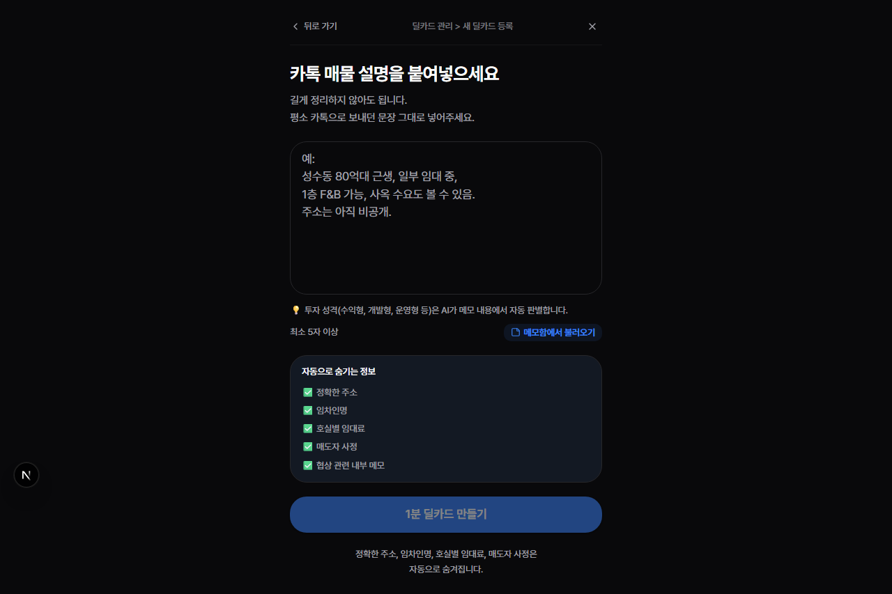
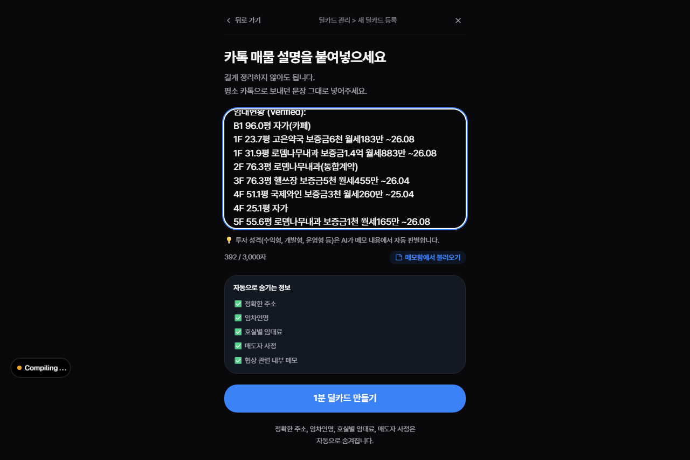
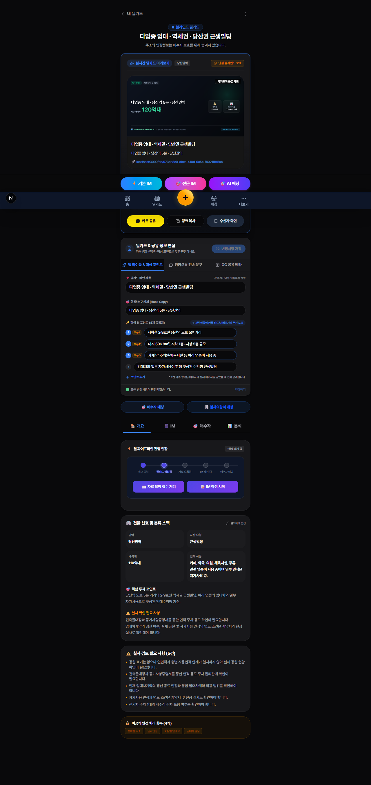
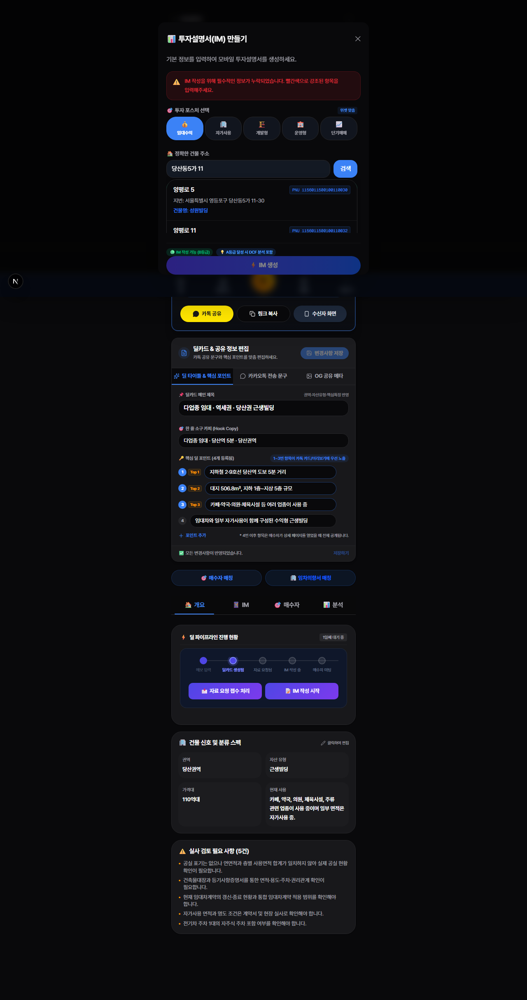
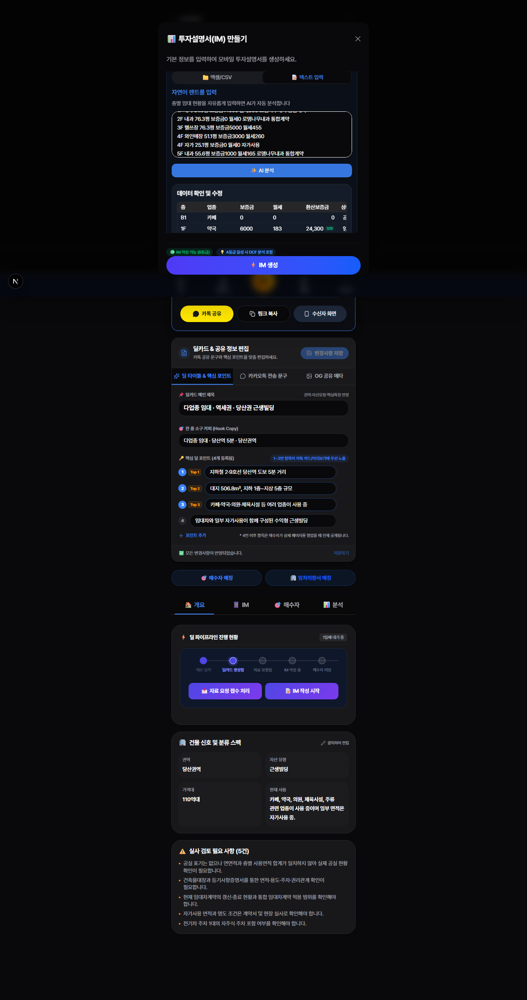
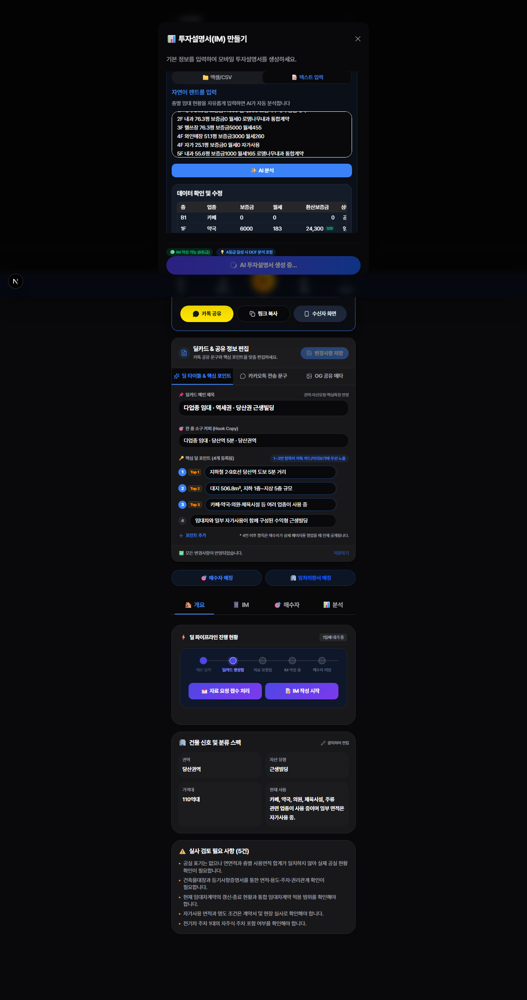
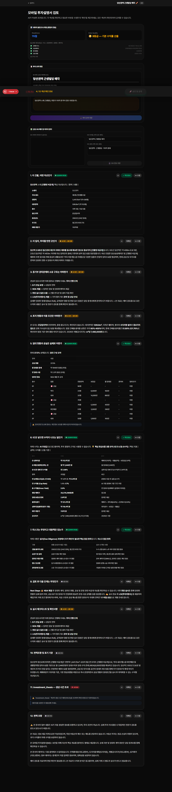

# 📖 메모에서 PPTX 투자보고서(IM)까지 — 초심자 튜토리얼

> **대상 독자**: CRE DealCard 시스템을 처음 사용하는 중개인  
> **소요 시간**: 약 15~20분  
> **최종 산출물**: 전문가 수준의 PPTX 투자보고서(IM) 파일  
> **예시 매물**: 당산동5가 근생빌딩 115억 (수익형)

---

## 📋 목차

1. [로그인](#1-로그인)
2. [메모 입력 — 매물 정보를 텍스트로 기록하기](#2-메모-입력)
3. [딜카드 생성 — AI가 매물 정보를 구조화하기](#3-딜카드-생성)
4. [바텀시트 입력 — 상세 정보 채우기](#4-바텀시트-입력)
5. [기본 IM 생성 — AI 투자보고서 자동 작성](#5-기본-im-생성)
6. [모바일 IM 확인 — 생성된 보고서 육안 검사](#6-모바일-im-확인)
7. [편집 및 승인 — 내용 검토 후 공개하기](#7-편집-및-승인)
8. [PPTX 다운로드 — 전문 투자보고서 파일 받기](#8-pptx-다운로드)
9. [부록 — 예시 메모 원문](#부록--예시-메모-원문)

---

## 1. 로그인

1. 브라우저에서 **https://credeal.co/login** 에 접속합니다.
2. 등록된 이메일과 비밀번호를 입력합니다.
3. **"로그인"** 버튼을 클릭합니다.
4. 로그인 성공 후 `/broker` 대시보드로 이동됩니다.

> **💡 TIP**: 소속 중개법인 관리자가 발급한 계정을 사용하세요.

---

## 2. 메모 입력

매물 정보를 음성 또는 텍스트로 빠르게 메모합니다. AI가 이 메모를 분석하여 구조화된 딜카드를 자동 생성합니다.

### 조작 순서

1. 좌측 메뉴에서 **"메모"** 를 클릭합니다.
2. 텍스트 입력창에 매물 정보를 입력합니다.

### 예시 메모 (당산동 115억 근생빌딩)

```
당산동5가 11-47 근생빌딩 매각
매각가 115억
대지면적 506.8㎡ (153.31평)
연면적 1,141.15㎡ (307.9평)
준공업지역, 2002년 준공, B1~5F
토지평당가 약 75백만원/평
자주식 주차 8대, EV 1대
당산역 도보 5분 (2호선/9호선)

임대현황:
B1 96.0평 자가(카페)
1F 23.7평 고은약국 보증금6천 월세183만 ~26.08
1F 31.9평 로뎀나무내과 보증금1.4억 월세883만 ~26.08
2F 76.3평 로뎀나무내과(통합계약)
3F 76.3평 헬쓰장 보증금5천 월세455만 ~26.04
4F 51.1평 국제와인 보증금3천 월세260만 ~25.04
4F 25.1평 자가
5F 55.6평 로뎀나무내과 보증금1천 월세165만 ~26.08
```

3. **"딜카드 생성"** 버튼을 클릭합니다.

**📸 실제 화면:**

| 단계 | 스크린샷 |
|:---|:---|
| 새 딜카드 화면 |  |
| 메모 입력 완료 |  |

> **💡 TIP**: 메모에 주소, 매각가, 면적, 임대차 정보를 되도록 빠짐없이 적으면 AI 분석 품질이 높아집니다.

---

## 3. 딜카드 생성

AI가 메모를 분석하여 **딜카드**(매물 정보 카드)를 자동으로 만듭니다.

### 확인 사항

| 항목 | 예시값 | 확인 |
|:---|:---|:---:|
| 건물명 | 당산동5가 근생빌딩 | ☐ |
| 주소 | 서울특별시 영등포구 당산동5가 11-47 | ☐ |
| 매각가 | 115억 원 | ☐ |
| 자산 유형 | 근린생활시설 | ☐ |

**📸 실제 화면:**



> **⚠️ 주의**: AI가 파싱한 정보가 틀린 경우, 딜카드 상세 페이지에서 직접 수정할 수 있습니다.

---

## 4. 바텀시트 입력

딜카드 페이지에서 **"기본 IM 만들기"** 버튼을 누르면 **바텀시트**(상세 입력 폼)가 열립니다. 여기에 투자보고서 생성에 필요한 정보를 입력합니다.

### 4-1. 주소 및 필지

| 필드 | 입력 방법 | 예시 |
|:---|:---|:---|
| **주소** | 도로명 또는 지번 입력 | 당산동5가 11-47 |
| **필지(PNU)** | 🔍 주소 검색창에 "당산동5가 11-47" 입력 → 드롭다운에서 선택 | 자동 입력됨 |

> **💡 TIP**: PNU는 직접 입력할 필요 없이, **주소 검색**으로 자동 입력됩니다.

### 4-2. 건물 스펙

| 필드 | 예시값 |
|:---|:---|
| 대지면적 | 506.8 ㎡ |
| 연면적 | 1,141.15 ㎡ |
| 층수 | 지하 1층 ~ 지상 5층 |
| 준공연도 | 2002 |
| 주차 | 8대 |
| 엘리베이터 | 1대 |

### 4-3. 매각 조건

| 필드 | 예시값 |
|:---|:---|
| **매각가** | 1,150,000 (만원 단위) |
| **보증금 합계** | 29,000 (만원 단위) |
| **월 임대수입** | 1,946 (만원 단위) |

> **🧮 보증금 합산 방법**:  
> 고은약국 6,000 + 로뎀나무내과 14,000 + 헬쓰장 5,000 + 국제와인 3,000 + 로뎀나무내과5F 1,000  
> = **29,000만원** (2.9억 원)

> **🧮 월세 합산 방법**:  
> 183 + 883 + 455 + 260 + 165 = **1,946만원**

### 4-4. 임대차 정보 (층별)

각 층의 임차인 정보를 한 줄씩 입력합니다.

| 층 | 면적(평) | 임차인 | 보증금(만원) | 월세(만원) | 비고 |
|:---|:---|:---|:---|:---|:---|
| B1 | 96.0 | 카페 | 0 | 0 | **자가 사용** |
| 1F | 23.7 | 고은약국 | 6,000 | 183 | ~2026.08 |
| 1F | 31.9 | 로뎀나무내과 | 14,000 | 883 | ~2026.08 |
| 2F | 76.3 | 로뎀나무내과 | 0 | 0 | **통합계약** |
| 3F | 76.3 | 헬쓰장 | 5,000 | 455 | ~2026.04 |
| 4F | 51.1 | 국제와인 | 3,000 | 260 | ~2025.04 |
| 4F | 25.1 | (자가) | 0 | 0 | **자가 사용** |
| 5F | 55.6 | 로뎀나무내과 | 1,000 | 165 | ~2026.08 |

### 4-5. 사진 업로드

건물 외관, 내부, 주변환경 사진을 업로드합니다.
- **최소 4장 이상** 업로드를 권장합니다.
- 외관(전면/측면), 로비, 옥상 등 다양한 각도를 포함하세요.

**📸 실제 화면:**

| 단계 | 스크린샷 |
|:---|:---|
| 바텀시트 열림 |  |
| 입력 완료 상태 |  |

---

## 5. 기본 IM 생성

모든 필수 정보를 입력하면 **"⚡ IM 생성"** 버튼이 활성화됩니다.

### 조작 순서

1. **"⚡ IM 생성"** 버튼을 클릭합니다.
2. AI가 투자보고서를 자동으로 작성합니다. (약 1~3분 소요)
3. 진행률이 화면에 표시됩니다.
4. 생성 완료 시 **승인 페이지**로 자동 이동합니다.

**📸 실제 화면:**

| 단계 | 스크린샷 |
|:---|:---|
| IM 생성 시작 |  |
| IM 생성 완료 |  |

> **⏳ 안내**: AI가 여러 섹션(투자논점, 위치분석, 수익분석, 렌트롤 등)을 순차적으로 생성하므로 1~3분 정도 걸립니다. 페이지를 닫지 마세요.

> **❌ "필수 정보 누락" 경고가 뜨나요?**  
> 매각가, 보증금, 월임대료 중 하나라도 비어 있으면 IM을 생성할 수 없습니다.  
> 빨간색으로 강조된 필드를 채운 후 다시 시도하세요.

---

## 6. 모바일 IM 확인

생성된 투자보고서를 모바일 최적화 화면에서 확인합니다.

### 확인 체크리스트

| # | 확인 항목 | 예시 | 확인 |
|:---|:---|:---|:---:|
| 1 | **건물명/주소** 정확성 | "당산동5가 근생빌딩" | ☐ |
| 2 | **매각가** 정확성 | 115억 원 | ☐ |
| 3 | **투자 논점** 서사 품질 | "당산역 도보 5분 역세권..." | ☐ |
| 4 | **건물 스펙** 테이블 정확성 | 506.8㎡, B1~5F, 2002년 | ☐ |
| 5 | **렌트롤** 테이블 정확성 | 8건 전체 표시 | ☐ |
| 6 | **수익 분석** 수치 정확성 | Cap Rate, 연 임대수입 | ☐ |
| 7 | **사진** 정상 표시 | 업로드한 사진들 | ☐ |
| 8 | **면책 조항** 존재 | "AI 추정값 (참고용)" | ☐ |

> **💡 TIP**: 스크롤을 내리면서 각 섹션을 하나씩 확인하세요.  
> 수치가 틀리거나 어색한 문장이 있으면 다음 단계(편집)에서 수정할 수 있습니다.

---

## 7. 편집 및 승인

생성된 보고서 내용을 검토하고, 필요시 수정한 뒤 **공개 승인**합니다.

### 조작 순서

1. **승인 페이지**에서 각 섹션의 내용을 확인합니다.
2. 수정이 필요한 섹션의 텍스트를 직접 편집합니다.
3. 모든 내용이 만족스러우면 **"승인 및 공개"** 버튼을 클릭합니다.
4. 상태가 `published` (공개됨)로 변경됩니다.

> **⚠️ 주의**: 승인 후에는 공개 URL이 생성되어 외부에 공유할 수 있습니다.  
> 투자자에게 보내기 전에 수치와 문구를 한 번 더 꼼꼼히 확인하세요.

### 공개 후 확인

- 공개 URL (예: `https://credeal.co/im-lite/[건물ID]`)에 접속하여 외부에서도 정상적으로 보이는지 확인합니다.

---

## 8. PPTX 다운로드

승인(공개)된 투자보고서를 전문가 수준의 PPTX 파일로 다운로드합니다.

### 조작 순서

1. 모바일 IM 뷰어 화면 하단의 **"📎 PPTX 다운로드"** 버튼을 클릭합니다.
2. PPTX 파일이 자동으로 다운로드됩니다. (약 5~10초)
3. 다운로드된 파일을 PowerPoint에서 열어 확인합니다.

### PPTX 슬라이드 구성 (당산동 115억 기준)

| 슬라이드 | 내용 | 확인 |
|:---:|:---|:---:|
| 1면 | **표지** — 건물명, 매각가, 브로커 정보, 대표 사진 | ☐ |
| 2면 | **투자 요약** — 핵심 투자 포인트, 주요 지표 | ☐ |
| 3면 | **건물 개요** — 면적, 층수, 준공연도, 주차 등 | ☐ |
| 4면 | **입지 분석** — 지도, 교통 접근성, 주변 시설 | ☐ |
| 5면 | **렌트롤** — 8건 임대차 내역 테이블 | ☐ |
| 6면 | **수익률 분석** — 연 임대수입, Cap Rate, 표면수익률 | ☐ |
| 7면 | **건물 사진** — 업로드한 사진 그리드 | ☐ |
| 8면 | **면책/연락처** — 면책 조항 5종, 브로커 연락처 | ☐ |

### PPTX 최종 확인 체크리스트

- [ ] 매각가 **115억**이 표지와 요약에 정확히 표시되는가?
- [ ] 렌트롤 **8건**이 누락 없이 전부 표시되는가?
- [ ] 수익률 수식이 **연임대료 ÷ (매각가 - 보증금)** 으로 올바른가?
- [ ] `{{...}}` 같은 **템플릿 토큰**이 남아있지 않은가?
- [ ] 사진이 **깨지거나 비어있지 않은가**?
- [ ] 타 매물의 정보가 **혼입되지 않았는가**?

> **🎉 축하합니다!** 메모 한 장에서 시작하여 전문가 수준의 투자보고서(IM)를 완성했습니다.

---

## 부록 — 예시 메모 원문

아래는 이 튜토리얼에서 사용한 당산동 115억 근생빌딩의 메모 원문입니다.  
실제 업무에서 이와 유사한 형식으로 메모를 작성하면 됩니다.

```
당산동5가 11-47 근생빌딩 매각
매각가 115억
대지면적 506.8㎡ (153.31평)
연면적 1,141.15㎡ (307.9평)
준공업지역, 2002년 준공, B1~5F
토지평당가 약 75백만원/평
자주식 주차 8대, EV 1대
당산역 도보 5분 (2호선/9호선)

임대현황:
B1 96.0평 자가(카페)
1F 23.7평 고은약국 보증금6천 월세183만 ~26.08
1F 31.9평 로뎀나무내과 보증금1.4억 월세883만 ~26.08
2F 76.3평 로뎀나무내과(통합계약)
3F 76.3평 헬쓰장 보증금5천 월세455만 ~26.04
4F 51.1평 국제와인 보증금3천 월세260만 ~25.04
4F 25.1평 자가
5F 55.6평 로뎀나무내과 보증금1천 월세165만 ~26.08
```

### 포인트 정리

| 항목 | 핵심 |
|:---|:---|
| **주소** | 정확한 지번 또는 도로명 |
| **매각가** | 숫자 + "억" 단위 |
| **면적** | ㎡ 또는 평 단위 |
| **임대차** | 층, 면적, 임차인명, 보증금, 월세, 만기 |
| **특이사항** | 자가 사용, 통합계약, 공실 등 |

---

## 📎 첨부 파일

- [당산동 115억 PPTX 샘플](dangsan-income-r3.pptx) — 이 튜토리얼에서 생성된 실제 PPTX 파일
