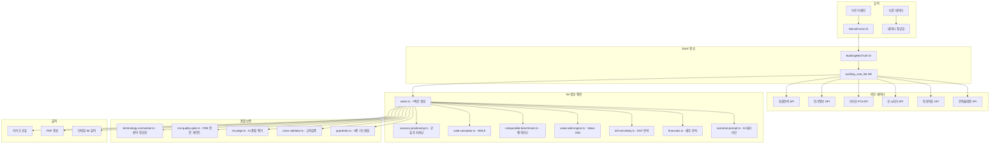

# 🔬 크리딜 모바일 IM — 비교 분석 및 베타 테스터 체크포인트 가이드

> **대상**: 크리딜 초기 베타 테스터 (상업용 부동산 중개인)
> **목적**: 모바일 IM의 차별적 가치를 이해하고, 개선 의견을 체계적으로 제출
> **버전**: v2.0 (2026.07)

---

## 목차

1. [모바일 IM vs 기존 방식 비교 분석](#1-모바일-im-vs-기존-방식-비교-분석)
2. [크리딜 모바일 IM 파이프라인 감사 결과](#2-크리딜-모바일-im-파이프라인-감사-결과)
3. [특장점 심층 분석](#3-특장점-심층-분석)
4. [베타 테스터 체크포인트](#4-베타-테스터-체크포인트)
5. [개선 의견 수집 프레임워크](#5-개선-의견-수집-프레임워크)
6. [향후 로드맵 미리보기](#6-향후-로드맵-미리보기)

---

## 1. 모바일 IM vs 기존 방식 비교 분석

### 1-1. 3가지 IM 작성 방식 종합 비교

| 항목 | 🅰️ Full IM (수동 작성) | 🅱️ AI 도구 활용 개인 작성 | 🅲️ 크리딜 모바일 IM |
|------|---------------------|----------------------|------------------|
| **작성 시간** | 3~7일 | 2~4시간 | **5분** |
| **작성 비용** | 50~200만원 (외주 시) | 무료~5만원 (GPT 비용) | **무료** (베타) |
| **페이지 수** | 30~50페이지 PDF | 5~15페이지 | **7섹션 모바일** |
| **공공데이터 연동** | ❌ 수동 조회/복붙 | ❌ 수동 조회/복붙 | ✅ **자동 연동 7종** |
| **재무 분석** | ⚠️ 엑셀 직접 계산 | ⚠️ AI 계산 (검증 어려움) | ✅ **자동 계산 + 교차검증** |
| **DCF 10년 분석** | ⚠️ 전문가만 가능 | ❌ AI 환각 위험 높음 | ✅ **자동 산출** |
| **리스크 분석** | ⚠️ 주관적 | ⚠️ AI 환각 위험 | ✅ **가드레일 3중 방어** |
| **정보 블라인드** | ❌ 수동 편집 | ❌ 수동 편집 | ✅ **자동 Disclosure Guard** |
| **공유 방식** | 📧 이메일 첨부 | 📧 이메일/카톡 파일 | ✅ **카카오톡 1탭 공유** |
| **모바일 최적화** | ❌ PDF 확대/축소 | ❌ 문서 파일 | ✅ **네이티브 모바일 뷰** |
| **영문 번역** | ❌ 별도 번역 비용 | ⚠️ 품질 불안정 | ✅ **AI 자동 번역** |
| **데이터 갱신** | ❌ 처음부터 재작성 | ❌ 수동 수정 | ✅ **재생성으로 즉시 반영** |
| **환각 방지** | N/A | ❌ **없음** | ✅ **Hallucination Guard** |
| **출처 추적** | ❌ | ❌ | ✅ **Provenance 배지** |
| **품질 일관성** | 작성자 역량 의존 | 프롬프트 의존 | ✅ **CRE Quality Gate** |

### 1-2. 비용 효율성 비교

```
┌────────────────────────────────────────────────────┐
│  IM 1건당 기회비용 (시간 × 시급 40,000원 기준)       │
│                                                    │
│  Full IM (수동):   24시간 × 40,000 = 960,000원     │
│  AI 개인 작성:      3시간 × 40,000 = 120,000원     │
│  크리딜 모바일 IM:   0.08시간(5분) × 40,000 = 3,333원│
│                                                    │
│  🔥 Full IM 대비 288배 효율 개선                     │
│  🔥 AI 개인 대비 36배 효율 개선                      │
└────────────────────────────────────────────────────┘
```

### 1-3. 투자자(매수자) 관점 비교

| 관점 | Full IM | AI 개인 | 크리딜 모바일 IM |
|------|---------|---------|---------------|
| **첫인상** | 전문적 (하지만 읽기 부담) | 보통 | ⭐ 모바일 네이티브, 세련됨 |
| **정보 신뢰도** | 높음 (수기 검증) | 낮음 (AI 환각 우려) | 높음 (출처 명시 + 가드레일) |
| **열람 편의성** | 낮음 (PC 필요, PDF) | 보통 | ⭐ 카카오톡에서 바로 열람 |
| **의사결정 속도** | 느림 (자료 요청 반복) | 보통 | ⭐ 빠름 (7섹션에 필수 정보 집약) |
| **프라이버시** | 주소 노출 위험 | 노출 위험 | ⭐ 자동 블라인드 |

---

## 2. 크리딜 모바일 IM 파이프라인 감사 결과

### 2-1. 핵심 엔진 구성요소 (30개 모듈)



### 2-2. 외부 데이터 소스 연동 현황

| API | 데이터 | 활용 섹션 | 상태 |
|-----|--------|---------|------|
| 국토부 건축물대장 | 면적, 구조, 용도, 층수, 주차 | 1섹션 | ✅ 연동 완료 |
| 토지이음 (토지e음) | 용도지역, 건폐율/용적률 제한 | 2섹션 | ✅ 연동 완료 |
| 공시지가 API | ㎡당 공시지가, 기준연도 | 2섹션 | ✅ 연동 완료 |
| 카카오 POI | 지하철역, 편의시설 카운트 | 2섹션 | ✅ 연동 완료 |
| 등기정보광장 | 등기 요약 | 5섹션 | ⚠️ 부분 연동 |
| SEMAS 상권분석 | 상권 유형, 유동인구 | 2섹션 | ⚠️ 부분 연동 |

### 2-3. AI 모델 및 가드레일

| 구성요소 | 모델 | 역할 |
|---------|------|------|
| MemoParser | GPT-5.4 | 브로커 메모 → 구조화 데이터 |
| BuildingMiniTruth | GPT-5.4 | SSoT Lite 초안 생성 |
| Narrative Writer | GPT-5.4 | 7섹션 내러티브 작성 |
| IM Judge | GPT-5.4 | 생성 품질 채점 (선택적) |
| Translator | GPT-5.4 | 한→영 번역 |

### 2-4. 재무 엔진 상세

| 계산 항목 | 공식/로직 | 입력 필요 |
|----------|---------|---------|
| **NOI** | (월세×12) + (관리비×12) - 공실손실 | 월세, 관리비, 공실률 |
| **Cap Rate** | NOI ÷ 매각가 × 100 | NOI, 매각가 |
| **자기자본 소요** | 매각가 - 대출 - 보증금 | 매각가, 대출, 보증금 |
| **레버리지 수익률** | NOI ÷ 자기자본 × 100 | NOI, 자기자본 |
| **WACC** | (자기자본비중 × 기대수익률) + (부채비중 × 이자율 × (1-세율)) | 대출, 이자율 |
| **10년 DCF NPV** | Σ(연도별 NCF ÷ (1+WACC)^n) | NOI, WACC, 10년 추정 |
| **WALE** | Σ(면적 × 잔여기간) ÷ Σ(면적) | 층별 임대차 데이터 |

---

## 3. 특장점 심층 분석

### 3-1. 정보 보호 자동화 (Disclosure Guard)

기존 IM 작성 시 **가장 위험한 부분**이 정보 유출입니다. 크리딜은 자동으로:

| 블라인드 대상 | 처리 방식 | 예시 |
|-------------|---------|------|
| 정확한 주소 | 자동 제거 | "서울 강남구 ○○동 12-3" → "강남 핵심 상권" |
| 건물명 | 자동 제거 | "XX빌딩" → 블라인드 |
| 소유자명 | 완전 차단 | 노출 불가 |
| 임차인 실명 | 자동 제거 | "스타벅스 XX점" → "프랜차이즈 카페" |
| 매도 동기 | 완전 차단 | 노출 불가 |
| 구체적 계약 조건 | 자동 제거 | 대략적 범위만 표시 |

### 3-2. Hallucination Guard (환각 방지)

AI가 생성한 텍스트에서 **비정상적 수치**를 자동 탐지:
- 매각가 대비 20배 이상 편차 가격 → 차단
- 면적 대비 100배 이상 편차 수치 → 차단
- 수익률이 음수이거나 100% 초과 → 경고

### 3-3. 데이터 출처 추적 (Provenance)

업계 최초로 **모든 데이터 포인트에 출처 배지**를 표시:
- 투자자 신뢰도 대폭 향상
- "이 수치가 어디서 나온 건가요?" 질문에 즉시 답변 가능
- 법적 분쟁 시 근거 자료로 활용 가능

### 3-4. 모바일 네이티브 경험

| 기능 | 설명 |
|------|------|
| 1탭 공유 | 카카오톡/LINE 즉시 공유 |
| 아코디언 UI | 관심 섹션만 펼쳐서 열람 |
| 지도 통합 | OSM 타일 + 카카오맵 연동 |
| 사진 슬라이더 | 스와이프 갤러리 + 라이트박스 |
| PDF 변환 | 오프라인 제출용 즉시 생성 |
| 영문 전환 | 외국인 투자자 대응 |

---

## 4. 베타 테스터 체크포인트

### 4-1. IM 생성 과정 체크포인트

| # | 체크 항목 | 확인 방법 | 평가 |
|---|---------|---------|------|
| 1 | 데이터 보강 바텀시트가 정상 열리는가? | 딜카드 → IM 생성 버튼 | ☐ 정상 / ☐ 오류 |
| 2 | 매각가/대출 입력이 편리한가? | 숫자 입력 | ☐ 편리 / ☐ 불편 |
| 3 | 공실률 선택 UI가 직관적인가? | 4가지 옵션 선택 | ☐ 직관적 / ☐ 헷갈림 |
| 4 | 사진 업로드가 잘 되는가? (모바일) | 갤러리에서 선택 | ☐ 정상 / ☐ 오류 |
| 5 | 데이터 충실도 점수가 실시간 반영되는가? | 데이터 입력 시 | ☐ 즉시 / ☐ 지연 |
| 6 | IM 생성이 60초 이내에 완료되는가? | 생성 버튼 클릭 후 | ☐ 완료 / ☐ 타임아웃 |
| 7 | 생성 진행 상황이 표시되는가? | "AI 분석 중..." 메시지 | ☐ 표시 / ☐ 미표시 |

### 4-2. IM 내용 품질 체크포인트

| # | 체크 항목 | 확인 방법 | 평가 |
|---|---------|---------|------|
| 8 | 히어로 카드의 주요 지표가 정확한가? | 입력값과 비교 | ☐ 정확 / ☐ 오차 있음 |
| 9 | 건축물대장 데이터가 실제와 일치하는가? | 실제 대장과 비교 | ☐ 일치 / ☐ 불일치 |
| 10 | NOI/Cap Rate 계산이 맞는가? | 직접 계산과 비교 | ☐ 정확 / ☐ 오차 있음 |
| 11 | 리스크 분석이 현실적인가? | 전문가 판단 | ☐ 현실적 / ☐ 과도/부족 |
| 12 | 투자 가설이 논리적인가? | 전문가 판단 | ☐ 논리적 / ☐ 비논리적 |
| 13 | 블라인드 처리가 완벽한가? | 주소/이름 확인 | ☐ 완벽 / ☐ 유출 있음 |
| 14 | 한줄 코멘트가 적절히 반영되었는가? | 입력값 확인 | ☐ 반영 / ☐ 미반영 |
| 15 | 히어로 카드 경고문이 적합한가? | 내용 확인 | ☐ 적합 / ☐ 모순/과도 |

### 4-3. IM 뷰어 UX 체크포인트

| # | 체크 항목 | 확인 방법 | 평가 |
|---|---------|---------|------|
| 16 | 모바일에서 아코디언 탐색이 편한가? | 직접 사용 | ☐ 편함 / ☐ 불편 |
| 17 | 지도가 정상 표시되는가? | 2섹션 확인 | ☐ 표시 / ☐ 미표시 |
| 18 | 사진 갤러리가 잘 작동하는가? | 스와이프 테스트 | ☐ 정상 / ☐ 오류 |
| 19 | 카카오톡 공유가 되는가? | 공유 버튼 | ☐ 성공 / ☐ 실패 |
| 20 | 공유된 링크를 열면 IM이 잘 보이는가? | 링크 열기 | ☐ 정상 / ☐ 오류 |
| 21 | 영문 전환이 작동하는가? | English 탭 | ☐ 작동 / ☐ 미작동 |
| 22 | 프라이빗 IM 신청이 되는가? | 신청서 제출 | ☐ 성공 / ☐ 실패 |
| 23 | 중개인 Vibe 명함이 표시되는가? | IM 하단 확인 | ☐ 표시 / ☐ 미표시 |

### 4-4. 매물 유형별 테스트 체크포인트

| 매물 유형 | 테스트 관점 | 핵심 확인 사항 |
|---------|-----------|-------------|
| **근린상가** | 층별 임대차 정확성 | Rent Roll, WALE 자동 계산 |
| **꼬마빌딩** | 재무 분석 정확성 | NOI, Cap Rate, DCF |
| **물류센터** | 물류 전용 필드 | 천장고, 도크, 하중 표시 |
| **오피스** | 공실률 분석 | 권역 벤치마크 비교 |
| **토지** | 기본 분석 적합성 | 용도지역, 공시지가 중심 |

---

## 5. 개선 의견 수집 프레임워크

### 5-1. 의견 분류 체계

개선 의견을 제출할 때 아래 분류를 참고해 주세요:

| 카테고리 | 코드 | 설명 | 예시 |
|---------|------|------|------|
| **UI/UX** | UX | 화면 구성, 사용성 | "입력 순서가 비효율적" |
| **데이터 정확성** | DA | 수치, 계산 오류 | "Cap Rate 계산이 틀림" |
| **AI 품질** | AQ | AI 생성 내용 문제 | "리스크가 과도하게 작성됨" |
| **기능 추가** | FR | 없는 기능 요청 | "비교 물건 추가 기능" |
| **성능** | PF | 속도, 안정성 | "생성 시 타임아웃 발생" |
| **비즈니스** | BZ | 업무 흐름, 가치 | "이 기능이 실제 업무에 도움" |

### 5-2. 효용 극대화를 위한 의견 수집 포인트

#### 📌 데이터 입력 관련
- [ ] 현재 입력 필드 외에 추가로 필요한 항목이 있는가?
- [ ] 층별 임대차 입력 방식이 현업에 맞는가? (엑셀 복붙 지원 필요?)
- [ ] 매각가/대출 입력 시 만원 단위가 편한가, 억원 단위가 편한가?
- [ ] 사진 업로드 시 자동 워터마크가 필요한가?

#### 📌 AI 분석 관련
- [ ] 투자 가설(Investment Thesis) 표현이 적절한가?
- [ ] 리스크 분석이 너무 보수적인가? 공격적인가?
- [ ] 경고문(주의 문구)이 현실적인가? 모순은 없는가?
- [ ] 벤치마크 비교 대상이 적절한가?

#### 📌 공유/배포 관련
- [ ] 카카오톡 공유 시 썸네일과 설명이 매력적인가?
- [ ] 투자자에게 전달했을 때 반응이 어떤가?
- [ ] PDF 품질이 오프라인 제출에 적합한가?
- [ ] NDA(비밀유지계약) 연동이 필요한가?

#### 📌 경쟁 대비 가치 관련
- [ ] 기존 수동 IM 대비 시간 절감 체감이 되는가?
- [ ] 이 IM을 고객에게 보냈을 때 전문성이 느껴지는가?
- [ ] 경쟁 중개인과 차별화에 도움이 되는가?
- [ ] 유료화 시 얼마까지 지불 의향이 있는가?

### 5-3. 의견 제출 템플릿

```markdown
## 개선 의견

**카테고리**: [UX / DA / AQ / FR / PF / BZ]
**심각도**: [상 / 중 / 하]
**매물 유형**: [근린상가 / 꼬마빌딩 / 물류 / 오피스 / 기타]

### 현상
(현재 어떤 문제/불편이 있는지)

### 기대
(어떻게 되면 좋겠는지)

### 업무 영향
(이 개선이 실제 중개 업무에 어떤 영향을 미치는지)

### 스크린샷
(해당 시 첨부)
```

---

## 6. 향후 로드맵 미리보기

### Phase 1 (현재) — 핵심 자동화
- ✅ 7섹션 모바일 IM 자동 생성
- ✅ 공공데이터 7종 자동 연동
- ✅ 히어로 카드 + 재무 분석
- ✅ 카카오톡/LINE 공유
- ✅ 프라이빗 IM 신청 시스템

### Phase 2 (현재 — 이미 구현됨) — 고도화
- ✅ IM 섹션별 수동 편집 기능 (승인 페이지에서 마크다운 인라인 편집)
- ✅ 비교 물건 (Comparable) 벤치마킹 (네이버 부동산 API 기반 시세 비교)
- ✅ 투자자 열람 분석 (섹션별 체류 시간, 60초 이상 시 Hot Lead 알림)
- ✅ 프라이빗 IM 신청 → 인앱 알림 (브로커 대시보드 알림 센터)

### Phase 3 (계획) — 플랫폼화
- 📋 Full IM (18섹션) 자동 업그레이드
- 📋 투자자 매칭 시스템
- 📋 실사 체크리스트 자동 생성
- 📋 거래 파이프라인 관리 (소통 관리함)

---

## 부록: 용어 정리

| 용어 | 의미 |
|------|------|
| **IM** | Investment Memorandum, 투자설명서 |
| **SSoT** | Single Source of Truth, 건물 정보 단일 진실 원본 |
| **NOI** | Net Operating Income, 순영업이익 |
| **Cap Rate** | Capitalization Rate, 자본환원율 (수익률) |
| **DCF** | Discounted Cash Flow, 할인현금흐름 |
| **WALE** | Weighted Average Lease Expiry, 가중평균 잔여 임대기간 |
| **WACC** | Weighted Average Cost of Capital, 가중평균자본비용 |
| **NPV** | Net Present Value, 순현재가치 |
| **Disclosure Guard** | 민감정보 자동 블라인드 처리 시스템 |
| **Hallucination Guard** | AI 환각(비정상 수치) 탐지 시스템 |
| **Provenance** | 데이터 출처 추적 시스템 |
| **Vibe 명함** | 중개인 디지털 프로필 카드 |

---

> **의견 및 피드백**: 크리딜 팀에 직접 전달하거나, 앱 내 피드백 기능을 이용해 주세요.
> **관련 문서**: [모바일 IM 작성 및 활용 가이드](./mobile-im-creation-guide.md) | [초심자 브로커 가이드](./credeal-beginner-guide.md)
