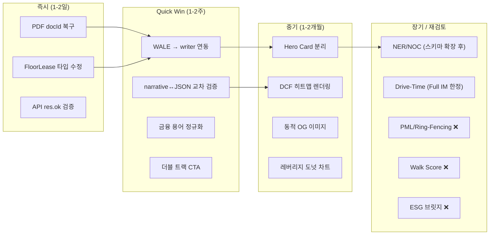

# 모바일 IM 업그레이드 방향 검토 및 개선 전략 보고서

> **작성일**: 2026-07-10  
> **분석 대상**: 모바일 IM 업그레이드 방향 제안서 (§0~§7, AI 파이프라인, 플랫폼 시너지)  
> **분석 방법**: 현재 코드베이스 정밀 감사 → 제안서 대조 → 갭/적절성 분석 → MECE 추가 전략 도출

---

## Part A. 업그레이드 제안서 적절성 검토 (Gap Analysis)

### 평가 기준

각 제안 항목을 아래 5단계로 평가합니다.

| 등급 | 의미 |
|---|---|
| ✅ **이미 구현됨** | 현재 코드베이스에 동작하는 구현이 존재 |
| 🔶 **기반 존재/부분 구현** | 모듈은 있으나 writer.ts에 미연동이거나 불완전 |
| 🆕 **신규 개발 필요** | 코드베이스에 관련 코드가 전무, 신규 설계/개발 필요 |
| ⚠️ **과설계 위험** | 꼬마빌딩 타겟 시장 대비 과도한 복잡도 |
| ❌ **부적절/재검토** | 기술적 또는 사업적으로 현시점에서 부적합 |

---

### §0. Deal Hero Card

| 제안 항목 | 평가 | 근거 |
|---|---|---|
| 자산 분류 라벨 + 매각 희망가 | ✅ | `writer.ts`의 §1 `property_overview`에서 `asset_type`, `price` 이미 렌더링 |
| 핵심 투자 포인트 / 리스크 1개 | 🔶 | `investment_thesis` 섹션에 생성되지만 별도 Hero Card로 분리하여 첫 화면에 노출하는 UI 로직은 미구현 |
| **Stacked Capital Stack 시각화** | 🆕⚠️ | 선순위 대출/스폰서 비율을 시각화하려면 `building_ssot_lite`에 `senior_debt`, `mezzanine`, `equity_split` 등의 **DB 스키마 확장**이 선행되어야 하며, 꼬마빌딩(30~150억)은 대부분 단순 LTV 구조로 Capital Stack이 없어 **실질적 활용 빈도가 낮음** |
| **Walk/Transit Score 계량화** | 🆕⚠️ | 미국 Walk Score API는 한국을 지원하지 않음. 카카오 지도 기반으로 자체 계량 로직을 설계해야 하며 **ROI 대비 공수가 과다** |

> **종합 판정**: Hero Card 자체는 적절하나, Capital Stack과 Walk Score는 **Phase 1에서 제외**하고 장기 로드맵으로 이관 권장. 대안으로 `financials.ts`에 이미 구현된 `equityRequired`, `leveragedYield`를 Hero Card 요약에 노출하는 것이 현실적.

---

### §1. 어떤 건물인가요? (`property_overview`)

| 제안 항목 | 평가 | 근거 |
|---|---|---|
| 건축물대장 API 연동 | ✅ | [writer.ts](file:///c:/Users/User/cre-dealcard/src/domain/building/mobile-im/writer.ts)에서 `externalData?.buildingLedger` 참조 중 |
| **하드코딩 폴백 완전 배제** | ⚠️ | 현재 `writer.ts`에 하드코딩 폴백이 존재하는 것은 **의도적 안전장치**. 완전 배제 시 API 장애 때 빈 섹션이 발생. **폴백을 유지하되 `_isFallback: true` 플래그로 추적**하는 것이 올바른 접근 |
| **NRA Ratio (전용률)** | 🆕 | 건축물대장의 전용면적/연면적 비율 계산은 가능하나, 한국 건축물대장 API가 **전용면적을 층별로 제공하지 않는 경우가 대다수**여서 데이터 가용성 이슈 |

---

### §2. 어디에 있고, 주변은 어떤가요? (`location_access`)

| 제안 항목 | 평가 | 근거 |
|---|---|---|
| 최근접 지하철역 도보 거리 | ✅ | 카카오 지도 API 기반 `nearest_station` 로직 구현 중 |
| **5분·15분·30분 Drive-Time 분석** | 🆕⚠️ | 카카오 네비게이션 API의 경로 탐색(`future/directions`)을 호출하면 기술적으로는 가능하나, **3개 시간대 × 주요 거점 N곳 = 다중 API 콜**로 인한 비용 및 속도 문제. 꼬마빌딩 투자자 의사결정에 Drive-Time이 핵심 변수인지 의문 |

> **종합 판정**: 현재 구현된 "도보 N분" + "반경 POI 요약"이 꼬마빌딩 시장에 충분. Drive-Time은 **200억 이상 대형 자산**에서만 의미가 있으므로, Full IM 18섹션 업그레이드 시 도입 권장.

---

### §3. 현재 임대 상황은 어떤가요? (`lease_status`)

| 제안 항목 | 평가 | 근거 |
|---|---|---|
| Rent Roll + 공실률 | ✅ | `writer.ts`에서 `floor_leases` 데이터 렌더링 |
| **WALE 산출** | ✅ | [wale-calculator.ts](file:///c:/Users/User/cre-dealcard/src/domain/building/mobile-im/wale-calculator.ts) — `calculateWALE()` 함수가 **이미 구현 완료**. Rent 기준 / Area 기준 이중 WALE + 12개월 내 만기 임대료 비중(`atRiskRentPct12m`)까지 산출 |
| **Lease Rollover Risk Flag** | 🔶 | `atRiskRentPct12m`이 산출되지만 writer.ts에서 이 값을 **임대 섹션 마크다운에 삽입하는 로직이 누락**되어 있음. 연결만 하면 즉시 활성화 가능 |
| **Master Lease 구조 검증** | 🆕 | `building_ssot_lite`에 `lease_structure_type` 필드가 없어 마스터리스 여부를 판별할 데이터가 부재 |

> **종합 판정**: WALE 계산기가 이미 구현되어 있다는 점은 큰 강점. **`writer.ts`에 WALE/Risk Flag 연동**만 하면 즉시 고도화가 가능한 'Quick Win'.

---

### §4. 현재 기준 어느 정도 수익이 보이나요? (`income_analysis`)

| 제안 항목 | 평가 | 근거 |
|---|---|---|
| NOI / Cap Rate / IRR 시나리오 분석 | ✅ | [financials.ts](file:///c:/Users/User/cre-dealcard/src/domain/building/mobile-im/financials.ts) — Best/Base/Worst 3-시나리오 NOI, Cap Rate, 5년 IRR 모두 구현 |
| 10년 DCF + 민감도 매트릭스 | ✅ | [dcf-sensitivity.ts](file:///c:/Users/User/cre-dealcard/src/domain/building/mobile-im/dcf-sensitivity.ts) — 3×3 Sensitivity Matrix (Exit Cap Rate ±50bp × Discount Rate ±1%) + WACC 산출 |
| **NER (실질유효임대료)** | 🆕 | Rent-Free, TI 공사지원금 차감 보정 로직 전무. `building_ssot_lite`에 해당 필드(`rent_free_months`, `ti_contribution_krw`)가 없어 **스키마 확장 선행 필요** |
| **NOC 환산 모델** | 🆕 | NER과 동일한 선행 조건. 한국 꼬마빌딩 시장에서 TI가 거의 없어 **실용성 낮음** |
| **CoC/IRR 다차원 감응도 히트맵** | 🔶 | `dcf-sensitivity.ts`의 3×3 매트릭스가 기초이나, "Exit Cap Rate × 조달 금리 등락폭"의 **2차원 히트맵 렌더링 컴포넌트**는 미구현. 계산 엔진은 확장 가능 |

> **종합 판정**: 재무 계산 엔진은 이미 업계 상위 수준. NER/NOC는 **한국 꼬마빌딩에서의 데이터 가용성이 극히 낮아** 장기 과제로 분류. 히트맵 렌더링은 프론트엔드 컴포넌트 추가만으로 가능하여 **중기 과제로 적합**.

---

### §5. 검토 전 무엇을 확인해야 하나요? (`risk_check`)

| 제안 항목 | 평가 | 근거 |
|---|---|---|
| 위반건축물 / 등기부 권리관계 | ✅ | `guardrails.ts`에서 법적 확정 표현 차단, writer.ts에서 리스크 서술 |
| **PML (지진예상손실률)** | 🆕⚠️ | 한국에서 PML 데이터를 제공하는 공개 API가 없음. 보험사 내부 데이터 또는 별도 구조 엔지니어링 보고서가 필요하며, **꼬마빌딩 수준에서 PML 분석은 과도** |
| **Ring-Fencing 체크리스트** | 🆕 | 개념적으로는 적절하나 데이터 소스(소방 등급, 지반 정보)가 공공 API로 제공되지 않아 구현 불가 |

> **종합 판정**: 제안된 PML/Ring-Fencing은 **기관급 대형 자산(500억+)** 실사에 해당. 꼬마빌딩에는 현재의 위반건축물 + 등기부 + 이행강제금 리스크 체크가 적정 수준. **소방시설 완비증명서 API**(국가화재정보시스템)가 개방되면 중기적으로 연동 가능.

---

### §6. 어떤 매수자에게 맞을 수 있나요? (`investment_thesis`)

| 제안 항목 | 평가 | 근거 |
|---|---|---|
| 투자자 프로파일 클러스터별 매칭 | ✅ | `narrative-prompt.ts`의 Golden IM 예시에 매수자 유형별 적합도 테이블 포함 |
| 밸류업 시나리오 | ✅ | [value-add-engine.ts](file:///c:/Users/User/cre-dealcard/src/domain/building/mobile-im/value-add-engine.ts) — 공실해소/임대료인상/리모델링 3시나리오 계산 + 마크다운 테이블 출력 |
| **ESG 비용 저감 브릿지 분석** | 🆕⚠️ | LEED/G-SEED 인증 비용, 에너지 절감액, NOI 상승 연동 모델 모두 신규 개발. 한국 꼬마빌딩에서 ESG 인증 비율은 **1% 미만**으로 실질적 적용 대상이 극히 한정적 |

> **종합 판정**: ESG 브릿지 분석은 **오피스 A급 이상 자산**에서 유의미. 꼬마빌딩에서는 현재의 3-시나리오 밸류업이 최적. 장기적으로 "건물에너지효율등급" 공공 API 연동을 검토할 수 있음.

---

### §7. 다음에 무엇을 하면 되나요? (`next_steps`)

| 제안 항목 | 평가 | 근거 |
|---|---|---|
| Readiness 기반 CTA | ✅ | [readiness.ts](file:///c:/Users/User/cre-dealcard/src/domain/building/mobile-im/readiness.ts)에서 데이터 완성도 점수 산출 |
| **더블 트랙 CTA** | 🔶 | 현재 단일 CTA("브로커에게 문의") 구조. "프라이빗 IM 다운로드 신청 + 카카오 상담" 이중 CTA는 **프론트엔드 UI 변경 + 리드 캡처 폼**으로 구현 가능. 사업적 가치가 높아 **우선 실행 권장** |

---

### AI 파이프라인 고도화 (§2)

| 제안 항목 | 평가 | 근거 |
|---|---|---|
| 금지어 Regex 가드레일 | ✅ | [guardrails.ts](file:///c:/Users/User/cre-dealcard/src/domain/building/mobile-im/guardrails.ts) — P0(즉시차단) 4패턴 + High(경고) 4패턴, 총 8개 FORBIDDEN_PATTERNS 구현 완료 |
| LLM 시맨틱 Quality Gate | ✅ | [cre-quality-gate.ts](file:///c:/Users/User/cre-dealcard/src/domain/building/mobile-im/cre-quality-gate.ts) — 5가지 위반 유형 탐지, fail-open + disclaimer 전략 |
| 디스클로저 가드 (PII 마스킹) | ✅ | `guardrails.ts` — 주소, 임차인명, 호별 월세, 매도자 동기, 네고 메모 5개 필드 자동 마스킹 |
| Few-shot 프롬프트 | ✅ | [narrative-prompt.ts](file:///c:/Users/User/cre-dealcard/src/domain/building/mobile-im/narrative-prompt.ts) — Golden IM 예시 + Bad vs Good 톤 가이드 |
| **금융 언어 레지스트리 표준화** | 🔶 | 제안서의 "구어체→제도권 용어" 매핑(예: "건물 고치는 비용"→"자본적 지출(CAPEX)")은 `guardrails.ts`에 **미포함**. 별도 용어 정규화 맵 추가 필요 |
| **G6 교차 검증 확장 (narrative vs JSON)** | 🔶 | [cross-validator.ts](file:///c:/Users/User/cre-dealcard/src/domain/building/mobile-im/cross-validator.ts)는 **마크다운 간 교차 검증**(Regex 추출)만 수행. 제안서가 요구하는 "AI narrative 텍스트 내 수치 ↔ financials.ts JSON 연산 결과값 대조"는 **미구현**. 이것은 환각 방지의 핵심이므로 **최우선 개발 과제** |

---

### 플랫폼 시너지 (§3)

| 제안 항목 | 평가 | 근거 |
|---|---|---|
| PDF 내보내기 `docId` 복구 | ✅ 기지 이슈 | 기존 스펙 문서에서 Critical 이슈(C-1)로 식별됨. 1줄 수정으로 해결 가능 |
| `FloorLeaseInput` 타입 불일치 해결 | ✅ 기지 이슈 | Critical 이슈(C-2)로 식별됨. 어댑터 레이어 추가로 해결 |
| `_isFallback` 추적 | 🔶 | 현재 폴백 발생 시 로그만 남기고 DB에 플래그를 기록하지 않음 |
| Audience URL 분기 | 🆕 | 매수자/매도자별 섹션 재배치는 매거진 시스템과 연동 필요 |
| Dwell Time 웜콜 시그널 | 🆕 | `analytics.ts` 자체가 미구현. 이벤트 트래킹 인프라(Mixpanel/PostHog 등) 선행 필요 |
| 동적 OG 이미지 | 🔶 | 매거진에 `@vercel/og` 연동 코드 존재. 모바일 IM 뷰어에는 미적용 |

---

## Part B. 현 시스템 개선 전략 (우선순위별 로드맵)

### 🔴 Phase 0: 즉시 수정 (1~2일, 기존 버그 + 신규 발견 Critical)

| # | 작업 | 파일 | 효과 |
|---|---|---|---|
| F-1 | `docId` 뷰어 전달 복구 (PDF 내보내기) | `page.tsx` | PDF 기능 정상화 |
| F-2 | `FloorLeaseInput` 필드명 어댑터 추가 — `types.ts`는 `deposit_manwon/rent_manwon/area_pyeong/lease_end`를 정의하나, `writer.ts:L619`는 `deposit/monthly_rent/area_sqm/contract_end`로 접근 | `writer.ts` + `types.ts` | 층별 Rent Roll 렌더링 오류 해소 |
| F-3 | API 응답 `res.ok` 검증 추가 | `writer.ts` L120~140 | 잘못된 JSON 파싱 크래시 방지 |
| **F-4** 🆕 | **AI 프롬프트에 재무 핵심 데이터 미전달 수정** — `narrative-prompt.ts:L122-127`이 `total_deposit_manwon`, `mgmt_fee_total_manwon`, `loan_amount_manwon`를 프롬프트 컨텍스트에 **전달하지 않음**. AI가 재무 분석 섹션에서 이 데이터 없이 서술하므로 환각 위험이 극히 높음 | `narrative-prompt.ts` | 수익분석 섹션의 AI 환각 원천 차단 |
| **F-5** 🆕 | **`next_steps` 섹션 완전 정적 → Readiness 연동** — 현재 `writer.ts:L777-793`이 6단계 고정 텍스트만 출력하여 자산별 맞춤 안내가 전혀 없음. `readiness.ts`의 점수를 활용하여 데이터 부족 항목별 맞춤 안내로 전환 | `writer.ts` + `readiness.ts` | 매수자별 맞춤형 다음 단계 안내 |

### 🟡 Phase 1: Quick Win (1~2주)

| # | 작업 | 파일 | 효과 |
|---|---|---|---|
| Q-1 | **WALE + Rollover Risk Flag를 writer.ts에 연동** — `wale-calculator.ts`가 구현 완료 + 테스트 존재하지만 `writer.ts`에서 **한 번도 import/호출하지 않는 고아 모듈 상태** | `writer.ts` ← `wale-calculator.ts` | lease_status 섹션에 WALE 수치 + "30% 이상 만기 집중" 경고 자동 삽입 |
| Q-2 | **narrative ↔ financials.ts JSON 교차 검증** 구현 | `cross-validator.ts` 확장 | AI가 서술한 Cap Rate/NOI가 계산 엔진 결과와 일치하는지 자동 대조 |
| Q-3 | **금융 구어체→표준 용어 정규화 맵** 추가 | `guardrails.ts` 또는 별도 `terminology-normalizer.ts` | "건물 고치는 비용"→"CAPEX" 자동 치환 |
| Q-4 | **더블 트랙 CTA** UI 구현 | `next_steps` 뷰어 컴포넌트 | "프라이빗 IM 다운로드 신청" + "카카오 즉시 상담" 이중 전환 유도 |
| Q-5 | `_isFallback` 플래그 DB 캐싱 | `writer.ts` + Supabase 스키마 | 폴백 데이터 대시보드 추적 가능 |
| **Q-6** 🆕 | **Context 전파 범위 확장** — 현재 `narrative-prompt.ts:L192`에서 `property_overview` + 최근 2개 섹션만 컨텍스트로 전달하여, 6~7번째 섹션이 중간 섹션(§3 임대, §4 수익)과 일관성을 잃는 문제 발생. 전체 앵커 수치를 상시 전달하도록 확장 | `narrative-prompt.ts` | 후반 섹션의 수치 일관성 강화 |

### 🟢 Phase 2: 중기 고도화 (1~2개월)

| # | 작업 | 효과 |
|---|---|---|
| M-1 | **Hero Card (§0)** 별도 컴포넌트 분리 및 첫 화면 고정 | 5초 이내 핵심 딜 구조 파악 → 이탈률 감소 |
| M-2 | **DCF 민감도 히트맵** 프론트엔드 렌더링 | 3×3 매트릭스를 색상 코딩된 테이블로 시각화 |
| M-3 | **모바일 IM → 동적 OG 이미지** 연동 | 카카오톡 공유 시 자산 핵심 지표가 포함된 썸네일 생성 |
| M-4 | **매거진 ↔ 모바일 IM 딥링크** 연동 | 매거진의 딜카드 하이라이트 터치 → IM 뷰어 직접 진입 |
| M-5 | **레버리지 분석 시각화** (Equity/Loan/Deposit 도넛 차트) | Capital Stack의 현실적 대안 (단순 LTV 구조 시각화) |

### 🔵 Phase 3: 장기 진화 (3~6개월)

| # | 작업 | 전제조건 |
|---|---|---|
| L-1 | NER/NOC 실질유효임대료 모델 | `rent_free_months`, `ti_contribution_krw` DB 스키마 확장 |
| L-2 | Audience 분기 (`?target=buyer\|seller`) | 매거진 통합 에디터와 연동 설계 |
| L-3 | Dwell Time 기반 웜콜 시그널 | 이벤트 트래킹 인프라(PostHog) 도입 |
| L-4 | Drive-Time 분석 (카카오 네비 API) | Full IM 18섹션 업그레이드 시 도입 |
| L-5 | ESG 비용 저감 브릿지 | 건물에너지효율등급 공공 API 개방 시 |
| L-6 | Walk/Transit Score 한국판 자체 계량 | 카카오 POI + 대중교통 API 조합 알고리즘 설계 |

---

## Part C. MECE 기반 추가 제안

아래 제안은 제안서에서 다루지 않은 영역을 **MECE(Mutually Exclusive, Collectively Exhaustive)** 프레임워크로 분류하여 도출한 것입니다.

### 축 1: 데이터 품질 & 신뢰도 강화

| # | 제안 | 현재 갭 | 기대 효과 |
|---|---|---|---|
| D-1 | **데이터 신선도(Freshness) 배지 시스템** | 건축물대장 조회일, 실거래가 반영일이 표시되지 않음 | "2026-07-01 기준 건축물대장" 식의 타임스탬프로 데이터 신뢰도 즉시 판별 |
| D-2 | **공시지가 자동 갱신 스케줄러** | 공시지가는 1년 1회 갱신되지만 현재는 수동 캐시 | 매년 1월 자동 갱신 배치 잡으로 최신 토지 가격 반영 |
| D-3 | **브로커 입력 vs 공부 데이터 불일치 경고** | 브로커가 입력한 면적과 건축물대장 면적이 다를 때 경고 없음 | cross-validator 확장으로 입력 데이터 ↔ 공부 데이터 즉시 대조 |

### 축 2: 사용자 경험 & 접근성

| # | 제안 | 현재 갭 | 기대 효과 |
|---|---|---|---|
| U-1 | **섹션별 진행 인디케이터(Progress Bar)** | 7섹션을 스크롤하면서 현재 위치를 알 수 없음 | 상단 고정 미니맵으로 현재 섹션 위치 표시 |
| U-2 | **오프라인 뷰잉 (PWA Service Worker)** | 네트워크 끊김 시 IM 열람 불가 | 한 번 본 IM은 로컬 캐시에 저장되어 오프라인에서도 열람 가능 |
| U-3 | **접기/펼치기(Accordion) 디폴트 전략** | 모든 섹션이 펼쳐져 있어 스크롤 부담 | 핵심 3섹션(§0, §4, §6)만 기본 펼침, 나머지는 접힘 |
| U-4 | **다국어 요약 (영문 1-pager)** | 외국인 투자자 대응 불가 | [translator.ts](file:///c:/Users/User/cre-dealcard/src/domain/building/mobile-im/translator.ts)가 이미 존재하므로, Hero Card + Income Analysis만 영문 변환하여 별도 탭 제공 |

### 축 3: 비교 분석 & 시장 컨텍스트

| # | 제안 | 현재 갭 | 기대 효과 |
|---|---|---|---|
| C-1 | **동일 권역 최근 거래 사례 자동 벤치마킹** | [comparable-benchmark.ts](file:///c:/Users/User/cre-dealcard/src/domain/building/mobile-im/comparable-benchmark.ts) 파일 존재하나 연동 상태 불명 | "성수동 최근 3건 평균 평당가 2,800만원 → 본 자산 3,100만원 (10.7% 프리미엄)" 식의 상대 비교 |
| C-2 | **시세 추이 미니 차트 (3년 실거래가 트렌드)** | 정적 스냅샷만 제공, 시계열 데이터 시각화 없음 | 같은 동(洞)의 최근 3년 실거래가 추이를 미니 라인차트로 제공 |
| C-3 | **공실률 권역 벤치마크** | 자산의 공실률을 제시하지만 권역 평균 대비 위치를 알 수 없음 | "본 자산 공실률 5% → 강남 GBD 평균 8.2% 대비 양호" 식의 상대 포지셔닝 |

### 축 4: 안전성 & 컴플라이언스

| # | 제안 | 현재 갭 | 기대 효과 |
|---|---|---|---|
| S-1 | **감사 로그(Audit Trail)** | IM 생성/수정 이력이 추적되지 않음 | 누가 언제 어떤 섹션을 수정했는지 불변 로그 기록 (분쟁 방지) |
| S-2 | **워터마크 + 열람 추적** | 공유된 IM이 무단 재배포될 위험 | 열람자 이름 워터마크 삽입 + 열람 횟수/시간 대시보드 |
| S-3 | **면책 문구 다국어 표준화** | 한국어 면책 문구만 존재 | 영문/중문 면책 문구 자동 부착 (외국인 투자자 대응) |

### 축 5: 전환(Conversion) & 영업 최적화

| # | 제안 | 현재 갭 | 기대 효과 |
|---|---|---|---|
| V-1 | **A/B 테스트 프레임워크 (CTA 문구)** | CTA 전환율을 측정하지 않음 | "상담 문의" vs "프라이빗 IM 신청" 등 문구별 전환율 측정 |
| V-2 | **리마인더 푸시 (72시간 후)** | IM을 본 후 후속 액션 없이 이탈한 잠재 투자자 관리 불가 | 열람 후 72시간 내 미전환 시 브로커에게 팔로업 알림 |
| V-3 | **비교 바구니 (Compare Basket)** | 한 번에 하나의 IM만 볼 수 있음 | 투자자가 2~3개 자산 IM을 나란히 비교하는 테이블 뷰 제공 |

---

## Part D. 종합 권고 요약

### 핵심 메시지

1. **제안서의 방향성은 올바르나, 일부 항목이 꼬마빌딩(30~150억) 시장의 현실과 괴리됨**. Capital Stack, Walk Score, PML, ESG 브릿지는 기관급 대형 자산(500억+) 실사 항목이며, 본 시스템의 핵심 타겟인 꼬마빌딩에는 과설계.

2. **이미 구현된 모듈의 활용도가 낮음**. `wale-calculator.ts`, `value-add-engine.ts`, `dcf-sensitivity.ts`, `comparable-benchmark.ts` 등 강력한 계산 엔진이 존재하지만 `writer.ts`에 **완전 연동되지 않은 상태**. 새로운 기능 추가보다 **기존 자산의 완전 활성화**가 먼저.

3. **가장 높은 ROI를 제공하는 개선은 Q-1(WALE 연동)과 Q-2(narrative↔JSON 교차 검증)**. 둘 다 기존 모듈 위에 연결 코드만 추가하면 되며, 각각 "임대 안정성 정량화"와 "환각 방지"라는 핵심 가치를 제공.
