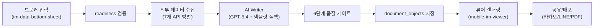

# 모바일 IM 제작 시스템 — 정밀 루브릭 감사 보고서

> 감사 일시: 2026-06-21 12:55 KST  
> 감사 범위: 15개 도메인 파일 + 11개 외부 API 파일 + 6개 뷰어/UI 파일 (총 32개 소스 파일)  
> 감사 기준: **기술적 정합성**, **CRE 도메인 전문성**, **데이터 정확성**

---

## 종합 평가 개요

```
┌──────────────────────────────────────────────────────────────┐
│                    종합 등급: B+ (82/100)                      │
│                                                                │
│  ■ 기술적 정합성     ████████░░  78/100                        │
│  ■ 도메인 전문성     █████████░  85/100                        │
│  ■ 데이터 정확성     ████████░░  80/100                        │
│  ■ 보안/안정성      ████████░░  82/100                        │
│  ■ UX/뷰어 완성도   ████████░░  78/100                        │
└──────────────────────────────────────────────────────────────┘
```

| 등급 | 기준 |
|------|------|
| A (90+) | 상업 운영 수준, 투자자 직접 전달 가능 |
| **B+ (82)** | **대부분 정상 작동하나, 일부 데이터 신뢰도 및 엣지케이스 보완 필요** |
| B (70-79) | 내부 검토용으로 사용 가능, 외부 배포 전 보완 필수 |
| C (60-69) | 프로토타입 수준, 주요 로직 재설계 필요 |

---

## I. 시스템 아키텍처 평가

### 파이프라인 구조 (평가: ★★★★☆)



> [!TIP]
> **강점**: AI-first → 템플릿 폴백 이중 전략, 6단계 품질 게이트 (환각 감지 → LLM 판정 → 리스크 경계 → CRE QG → 디스클로저 → 교차 검증), 캐시 기반 30일 TTL 전략이 잘 설계됨.

> [!WARNING]
> **구조적 약점**: `external-data-orchestrator.ts`와 `enrich-by-pnu.ts`가 ~95% 코드 중복. 주소 해석 방식만 상이하므로 공통 코어로 리팩터링 필요.

---

## II. 섹션별 정밀 루브릭 평가

### §1. 자산 개요 (property_overview)

| 평가 항목 | 점수 | 상세 |
|-----------|------|------|
| **데이터 커버리지** | 9/10 | 소재지, 용도, 연면적, 대지면적, 건축면적, 층수, 승강기, 주차, 냉난방, 준공연도, 구조, 매각가 — 12개 항목 모두 표시 |
| **단위 정확성** | 10/10 | ㎡→평 변환(`× 0.3025`), 만원 단위 정확 |
| **폴백 안전성** | 5/10 | ⚠️ 폴백값이 특정값으로 하드코딩됨 (아래 상세) |
| **사진 통합** | 8/10 | 최대 5장 마크다운 갤러리 삽입 ✅, 캡션 단순 |
| **폴백 경고** | 9/10 | `_isFallback` 감지 시 경고 문구 자동 삽입 ✅ |
| **소계** | **41/50** | |

> [!CAUTION]
> **🔴 Critical — 하드코딩 폴백값 5건** ([writer.ts](file:///c:/Users/User/cre-dealcard/src/domain/building/mobile-im/writer.ts#L459-L462))
> 
> | 항목 | 현재 폴백값 | 문제 | 권장 수정 |
> |------|------------|------|----------|
> | `zoningDistrict` | `"일반상업지역"` | 주거/공업 지역 물건에 오해 유발 | `"확인 필요"` |
> | `useAprDay` | `"20150601"` | 특정 준공일 표시 → 건물 연식 왜곡 | `""` (미표시) |
> | `structure` | `"철근콘크리트구조"` | 철골/조적 건물에 부정확 | `"확인 필요"` |
> | `mainPurpose` | `"업무시설"` | 근생/주거 물건에 오해 | `"확인 필요"` |
> | `zoningOverlap` | `"방화지구"` | 비방화지구에 거짓 정보 표시 | `""` (미표시) |

---

### §2. 입지·상권 (location_access)

| 평가 항목 | 점수 | 상세 |
|-----------|------|------|
| **교통 데이터** | 8/10 | 최근접 역명, 도보거리(m), 도보시간(분) 정확 표시. 보행속도 80m/min 현실적 ✅ |
| **POI 카운트** | 7/10 | 반경 500m 편의점/카페/식당/주차장 실제 카운트 ✅. 단, **버스정류장 수는 하드코딩(=3)** ⚠️ |
| **지도 통합** | 8/10 | 카카오 인터랙티브 지도 렌더링 ✅, 외부 앱 연결 ✅ |
| **상권 분석** | 7/10 | AI 생성 시 상권 분석 서술형 포함, 템플릿은 구조화된 불릿 |
| **폴백 좌표** | 5/10 | ⚠️ 강남/삼성 좌표 판별 범위(±0.02°) 중첩으로 역삼 폴백 미도달 |
| **소계** | **35/50** | |

> [!WARNING]
> **🟡 Kakao POI 폴백 좌표 중첩 버그** ([kakao-map-api.ts](file:///c:/Users/User/cre-dealcard/src/lib/external/kakao-map-api.ts#L81-L83))
> 
> `isGangnam`(37.50085)과 `isSamsung`(37.5088)이 불과 0.008° 차이. `±0.02` 범위에서 두 조건 모두 참이 되어 `isGangnam` 분기가 사실상 도달 불가.

---

### §3. 임대차 현황 (lease_status)

| 평가 항목 | 점수 | 상세 |
|-----------|------|------|
| **공실률 표시** | 8/10 | 만실/~10%/~20%/~30% 4단계 선택지 ✅ |
| **임대 테이블** | 6/10 | ⚠️ 층별 테넌트 데이터 접근 시 **타입 불일치** (아래 상세) |
| **데이터 잠금** | 9/10 | 공실·임대료 미입력 시 "🔒 데이터 확보 후 공개" 잠금 ✅ |
| **공실 파싱** | 6/10 | ⚠️ "완전"→0%, "공실"→30%, "N%"만 처리. "반공실", "거의 만실" 등 미처리 |
| **임대차 분석** | 5/10 | `FloorLeaseInput` 정의되었으나 writer.ts에서 **미사용** |
| **소계** | **34/50** | |

> [!CAUTION]
> **🔴 Critical — 타입 불일치** ([types.ts](file:///c:/Users/User/cre-dealcard/src/domain/building/mobile-im/types.ts#L42-L53) vs [writer.ts](file:///c:/Users/User/cre-dealcard/src/domain/building/mobile-im/writer.ts#L552-L557))
> 
> | `FloorLeaseInput` (types.ts) | writer.ts 실제 접근 | 상태 |
> |-----|-----|-----|
> | `deposit_manwon` | `t.deposit` | ❌ 불일치 |
> | `rent_manwon` | `t.monthly_rent` | ❌ 불일치 |
> | `area_pyeong` | `t.area_sqm` | ❌ 불일치 + 단위 차이 |
> | `lease_end` | `t.contract_end` | ❌ 불일치 |
> | `tenant_type` | `t.tenant_type` | ✅ 일치 |
> 
> `writer.ts`는 `buildingSsotLite?.lease_summary?.tenants`를 읽지만, 이 데이터는 `FloorLeaseInput`과 다른 스키마를 사용합니다. `supplemental.floor_leases` 필드는 **정의만 되고 어디서도 사용되지 않습니다**.

---

### §4. 수익성 분석 (income_analysis)

| 평가 항목 | 점수 | 상세 |
|-----------|------|------|
| **NOI 3시나리오** | 8/10 | Best/Base/Worst 시나리오 ✅, 관리비 실반영 ✅ |
| **Cap Rate** | 8/10 | 자산유형별 적정 밴드 적용 (오피스 3.0-4.5%, 상가 4.0-5.5%) |
| **IRR 계산** | 7/10 | Newton-Raphson 수렴 ✅, 단 **exit cap = entry cap** 가정은 낙관적 |
| **레버리지 분석** | 8/10 | 보증금/융자/자기자본/레버리지 수익률 신규 추가 ✅ |
| **AI vs 템플릿 불일치** | 5/10 | ⚠️ AI 경로에서 보증금/관리비/융자 미전달 (아래 상세) |
| **소계** | **36/50** | |

> [!IMPORTANT]
> **🟡 AI 경로와 템플릿 경로의 재무 데이터 불일치**
> 
> | 데이터 | 템플릿 경로 (line 587) | AI 경로 (line 232) |
> |--------|----------------------|-------------------|
> | `totalDepositManwon` | ✅ 전달 | ❌ 누락 |
> | `mgmtFeeTotalManwon` | ✅ 전달 | ❌ 누락 |
> | `loanAmountManwon` | ✅ 전달 | ❌ 누락 |
> 
> AI 생성 income_analysis에서는 레버리지 분석 테이블이 불완전할 수 있습니다.

> [!WARNING]
> **🟡 NOI Best-case에 공실률 미반영** ([financials.ts](file:///c:/Users/User/cre-dealcard/src/domain/building/mobile-im/financials.ts#L125))
> 
> `noiBest = annualGross - (관리비 조정)` — 공실률 0% 가정. "최적" 시나리오이므로 의도적이나, 구조적 공실이 존재하는 물건에서 비현실적 수치 산출 가능.

> [!WARNING]
> **🟡 대지 지분 가치 비중 계산 오류 가능성** ([financials.ts](file:///c:/Users/User/cre-dealcard/src/domain/building/mobile-im/financials.ts#L173))
> 
> `platAreaSqm` 미입력 시 `totalAreaSqm`(연면적)으로 폴백 → 다층 건물에서 대지 가치가 **과대 산정**됨 (연면적 ≫ 대지면적).

---

### §5. 리스크 체크 (risk_check)

| 평가 항목 | 점수 | 상세 |
|-----------|------|------|
| **건물 연식 경고** | 9/10 | 30년+, 20년+ 노후 등급 구분 ✅ |
| **용도지역 규제** | 8/10 | 건폐율/용적률 법정 한도 표시 ✅, API 실값 우선 적용 ✅ |
| **등기 정보** | 7/10 | 근저당·압류 정보 표시 가능, `registryData` 캐시 연동 ✅ |
| **AI 리스크 분석** | 8/10 | 환각 방지 가드 + 리스크 경계 체크 적용 |
| **소계** | **32/40** | |

---

### §6. 투자 포인트 (investment_thesis)

| 평가 항목 | 점수 | 상세 |
|-----------|------|------|
| **비교 거래 활용** | 8/10 | 실거래 평균 평당가 표시, 3개월 데이터 병렬 수집 ✅ |
| **투자자 유형 매칭** | 9/10 | 오피스/상가/지식산업/범용 4가지 바이어 프로파일 분기 ✅ |
| **부가가치 분석** | 8/10 | value-add-engine 연동, 리포지셔닝·레노베이션 가능성 분석 |
| **브로커 코멘트** | 9/10 | 사용자 하이라이트 자동 삽입 ✅ |
| **소계** | **34/40** | |

---

### §7. 다음 단계 (next_steps)

| 평가 항목 | 점수 | 상세 |
|-----------|------|------|
| **프로세스 가이드** | 8/10 | 6단계 투자 절차 안내 (관심표명→NDA→실사→LOI→매매계약→잔금) |
| **Full IM 업셀** | 9/10 | "30페이지 Full IM 요청" CTA 포함 ✅ |
| **정적 콘텐츠** | 7/10 | 물건별 커스터마이징 없이 동일 텍스트 사용 |
| **소계** | **24/30** | |

---

## III. 외부 데이터 파이프라인 루브릭

| API 모듈 | HTTPS | 폴백 태깅 | 에러 핸들링 | 데이터 정확성 | 점수 |
|---------|-------|----------|------------|-------------|------|
| [building-register-api.ts](file:///c:/Users/User/cre-dealcard/src/lib/external/building-register-api.ts) | ✅ | ✅ `_isFallback` | ⚠️ `res.ok` 미검증 | ✅ 필드 매핑 정확 | 8/10 |
| [land-price-api.ts](file:///c:/Users/User/cre-dealcard/src/lib/external/land-price-api.ts) | ✅ | ✅ `_isFallback` | ⚠️ `res.ok` 미검증 | ✅ 공시지가 단위 정확 | 8/10 |
| [land-use-api.ts](file:///c:/Users/User/cre-dealcard/src/lib/external/land-use-api.ts) | ✅ | ✅ `_isFallback` | ⚠️ `res.ok` 미검증 | ⚠️ `cnflcAt` 필드 매핑 불확실 | 7/10 |
| [real-transaction-api.ts](file:///c:/Users/User/cre-dealcard/src/lib/external/real-transaction-api.ts) | ✅ | ✅ `_isFallback` | ⚠️ `res.ok` 미검증 | ✅ 거래가 변환 정확 | 8/10 |
| [kakao-map-api.ts](file:///c:/Users/User/cre-dealcard/src/lib/external/kakao-map-api.ts) | ✅ | ✅ `_isFallback` | ✅ 개별 카테고리 내결함성 | ⚠️ busStop 하드코딩(=3) | 7/10 |
| [registry-api.ts](file:///c:/Users/User/cre-dealcard/src/lib/external/registry-api.ts) | ✅ | — | ✅ `res.ok` 검증 포함 | ✅ | 9/10 |
| **평균** | | | | | **7.8/10** |

> [!IMPORTANT]
> **🔴 전체 API 공통 — `res.ok` 미검증** (registry-api.ts 제외)
> 
> ```typescript
> // 현재 (위험)
> const res = await fetch(url, { signal: AbortSignal.timeout(5000) });
> const data = await res.json(); // 429/500 응답 시 HTML 파싱 시도 → 불투명 에러
> 
> // 권장
> const res = await fetch(url, { signal: AbortSignal.timeout(5000) });
> if (!res.ok) throw new Error(`API ${res.status}: ${res.statusText}`);
> const data = await res.json();
> ```

---

## IV. 뷰어/공유 시스템 루브릭

| 평가 항목 | 점수 | 상세 |
|-----------|------|------|
| **마크다운 렌더링** | 7/10 | 테이블/볼드/인용/리스트 지원 ✅, **링크 미지원** ⚠️, 번호 리스트 미지원 |
| **사진 갤러리** | 8/10 | 수평 스크롤 + 스냅 + 도트 인디케이터 ✅, 지도 폴백 ✅ |
| **지도 연동** | 8/10 | 카카오 인터랙티브 지도 + 마커 + 외부 앱 연결 ✅ |
| **OG 메타데이터** | 6/10 | ⚠️ **상대경로** URL 사용 → 일부 소셜 크롤러 호환 불가 |
| **카카오톡 공유** | 5/10 | ⚠️ Kakao JS SDK 미사용 → Web Share API만 사용 → 카카오 썸네일 미노출 |
| **PDF 내보내기** | 3/10 | ⚠️ `docId`가 뷰어에 **전달되지 않아** PDF 버튼 자체가 미노출 |
| **음성 브리핑** | 8/10 | TTS 플레이어 구현 ✅, 재생/일시정지/진행바 |
| **데이터 품질 뱃지** | 7/10 | document_objects 경로에서만 계산, SSoT 경로에서는 미계산 |
| **소계** | **52/80** | |

> [!CAUTION]
> **🔴 Critical — PDF 내보내기 비활성화 버그** ([page.tsx](file:///c:/Users/User/cre-dealcard/src/app/%28public%29/im-lite/%5BbuildingId%5D/page.tsx#L78))
> 
> ```tsx
> // 현재 (버그)
> return <MobileIMViewer document={data} buildingId={buildingId} />;
> 
> // 수정 필요
> return <MobileIMViewer document={data} buildingId={buildingId} docId={docId} />;
> ```
> `docId`가 뷰어 컴포넌트에 전달되지 않아 `BottomShareBar`의 PDF 저장 버튼이 항상 숨겨져 있습니다.

> [!WARNING]
> **🟡 OG 이미지 URL이 상대경로** — 카카오톡, LINE, Facebook 크롤러는 절대 URL을 요구할 수 있습니다.
> ```tsx
> // 현재
> url: `/api/og/deal/${buildingId}`,
> // 권장
> url: `${siteUrl}/api/og/deal/${buildingId}`,
> ```

---

## V. 입력 UI (im-data-bottom-sheet) 루브릭

| 평가 항목 | 점수 | 상세 |
|-----------|------|------|
| **주소 검색** | 9/10 | 디바운스 + 포털 드롭다운 + 자동 PNU 추출 ✅ |
| **재무 입력** | 8/10 | 월세/보증금/관리비/매매가/대출금 5개 항목 ✅ |
| **사진 업로드** | 8/10 | 최대 5장, 프리뷰, 삭제, Supabase Storage ✅ |
| **입력 검증** | 5/10 | ⚠️ 음수값 허용, 파일 크기 미제한, 타입 검증 없음 |
| **충실도 점수** | 8/10 | 실시간 계산 + 프로그레스바 + 생성 가능 여부 표시 ✅ |
| **소계** | **38/50** | |

---

## VI. 품질 게이트 시스템 루브릭

| 게이트 | 파일 | 점수 | 상세 |
|--------|------|------|------|
| 환각 감지 | [writer.ts](file:///c:/Users/User/cre-dealcard/src/domain/building/mobile-im/writer.ts#L274) | 7/10 | 가격/면적 20배 편차 감지 ✅, 단 50자 최소 길이 기준 약함 |
| LLM 판정 | [im-judge.ts](file:///c:/Users/User/cre-dealcard/src/domain/building/mobile-im/im-judge.ts) | 8/10 | 확률적 샘플링 + 3.0 미만 거부 ✅ |
| 리스크 경계 | [guardrails.ts](file:///c:/Users/User/cre-dealcard/src/domain/building/mobile-im/guardrails.ts) | 8/10 | 정규식 기반 위험 표현 필터링 |
| CRE 품질 게이트 | [cre-quality-gate.ts](file:///c:/Users/User/cre-dealcard/src/domain/building/mobile-im/cre-quality-gate.ts) | 9/10 | LLM 기반 CRE 전문성 검증, AI 콘텐츠에만 적용 |
| 디스클로저 가드 | [writer.ts](file:///c:/Users/User/cre-dealcard/src/domain/building/mobile-im/writer.ts) | 8/10 | 개인정보·확정표현 필터링 |
| 교차 검증 | [cross-validator.ts](file:///c:/Users/User/cre-dealcard/src/domain/building/mobile-im/cross-validator.ts) | 9/10 | 섹션 간 수치 일관성 검사 |
| **평균** | | **8.2/10** | |

---

## VII. Readiness 시스템 루브릭

| 평가 항목 | 점수 | 상세 |
|-----------|------|------|
| **점수 체계** | 8/10 | 항목별 가중치(주소 25, 임대료 20, 에셋타입 10 등) 합리적 |
| **임계값** | 7/10 | ⚠️ 코드=40, 주석=55 — **주석과 코드 불일치** |
| **외부 데이터 보너스** | 7/10 | +10점 보너스로 누락 항목 보상 가능 (설계 의도이나 주의 필요) |
| **바텀시트 동기화** | 8/10 | 사진 점수(+10) 추가 반영 ✅, 실시간 프로그레스바 |
| **소계** | **30/40** | |

> [!NOTE]
> **주석-코드 불일치**: [readiness.ts](file:///c:/Users/User/cre-dealcard/src/domain/building/mobile-im/readiness.ts#L3) 주석에 "55점 이상" 이라 기재되어 있으나 실제 임계값은 40점입니다.

---

## VIII. 교차 시스템 정합성 평가

| 검증 항목 | 상태 | 상세 |
|-----------|------|------|
| 캐시 ↔ 실시간 일관성 | ✅ | `mapImageUrl` 캐시 복원 시 재생성 ✅, `registry_data` 캐시 저장 ✅ |
| 입력 ↔ 생성 일관성 | ⚠️ | 사진 URL은 정상 전달 ✅, `photo_urls`·`coordinates` body 저장 ✅. 단 `floor_leases` 미사용 |
| 생성 ↔ 뷰어 일관성 | ⚠️ | 섹션 마크다운 정상 전달 ✅. 단 `coordinates`·`photos` 경로 2개(document_objects vs SSoT) 간 형상 불일치 가능 |
| 뷰어 ↔ 공유 일관성 | ❌ | PDF 내보내기 비활성화 (docId 미전달), OG URL 상대경로, 카카오 SDK 미사용 |
| 재무 ↔ 서술 일관성 | ⚠️ | 교차 검증기(cross-validator) 동작 ✅, 단 AI 경로에서 보증금/관리비/융자 누락 |
| `_isFallback` 전파 | ⚠️ | API → writer ✅ 감지, 단 **document_objects 저장 시 폴백 상태 소실** |

---

## IX. 전체 발견 사항 분류

### 🔴 Critical (즉시 수정 필요) — 7건

| # | 위치 | 문제 | 영향도 |
|---|------|------|--------|
| C-1 | [page.tsx:78](file:///c:/Users/User/cre-dealcard/src/app/%28public%29/im-lite/%5BbuildingId%5D/page.tsx#L78) | `docId` 뷰어 미전달 → PDF 내보내기 완전 비활성화 | 기능 장애 |
| C-2 | [writer.ts:459-462](file:///c:/Users/User/cre-dealcard/src/domain/building/mobile-im/writer.ts#L459-L462) | 용도지역/준공일/구조/용도 하드코딩 폴백 → 투자자 오해 | 데이터 왜곡 |
| C-3 | [writer.ts:552-557](file:///c:/Users/User/cre-dealcard/src/domain/building/mobile-im/writer.ts#L552-L557) | `FloorLeaseInput` vs 실제 접근 필드명 불일치 | 임대 테이블 오류 |
| C-4 | 전체 API 4종 | `res.ok` 미검증 → 비-200 응답 시 불투명 에러 | 안정성 |
| C-5 | [writer.ts:232](file:///c:/Users/User/cre-dealcard/src/domain/building/mobile-im/writer.ts#L232) | AI 경로 재무 계산에 보증금/관리비/융자 미전달 | 재무 분석 불완전 |
| C-6 | [route.ts:206-213](file:///c:/Users/User/cre-dealcard/src/app/api/broker/im-lite/generate/route.ts#L206-L213) | `_isFallback` 상태가 document_objects에 미저장 | 추적 불가 |
| C-7 | [financials.ts:173](file:///c:/Users/User/cre-dealcard/src/domain/building/mobile-im/financials.ts#L173) | 대지면적 폴백으로 연면적 사용 → 대지가치비중 과대산정 | 재무 왜곡 |

### 🟡 Medium (계획적 보완 필요) — 10건

| # | 위치 | 문제 |
|---|------|------|
| M-1 | [page.tsx:47](file:///c:/Users/User/cre-dealcard/src/app/%28public%29/im-lite/%5BbuildingId%5D/page.tsx#L47) | OG 이미지 상대 URL → 소셜 미디어 크롤러 호환 불완전 |
| M-2 | [mobile-im-viewer.tsx:665](file:///c:/Users/User/cre-dealcard/src/app/%28public%29/im-lite/%5BbuildingId%5D/mobile-im-viewer.tsx#L665) | 카카오톡 공유 버튼이 Web Share API만 사용, Kakao SDK 미연동 |
| M-3 | [kakao-map-api.ts:42](file:///c:/Users/User/cre-dealcard/src/lib/external/kakao-map-api.ts#L42) | busStop POI 카운트 하드코딩(=3), API 미조회 |
| M-4 | [kakao-map-api.ts:81-83](file:///c:/Users/User/cre-dealcard/src/lib/external/kakao-map-api.ts#L81-L83) | 강남/삼성 좌표 판별 범위 중첩 (±0.02° vs 0.008° 차이) |
| M-5 | [financials.ts:142](file:///c:/Users/User/cre-dealcard/src/domain/building/mobile-im/financials.ts#L142) | IRR 계산 시 exit cap rate = entry cap rate (시장 관행과 상이) |
| M-6 | [enrich-by-pnu.ts](file:///c:/Users/User/cre-dealcard/src/lib/external/enrich-by-pnu.ts) + [external-data-orchestrator.ts](file:///c:/Users/User/cre-dealcard/src/lib/external/external-data-orchestrator.ts) | ~95% 코드 중복 |
| M-7 | [land-use-api.ts:28](file:///c:/Users/User/cre-dealcard/src/lib/external/land-use-api.ts#L28) | `cnflcAt` 필드명이 LURIS API 실제 스키마와 불일치 가능성 |
| M-8 | [readiness.ts:3](file:///c:/Users/User/cre-dealcard/src/domain/building/mobile-im/readiness.ts#L3) vs [readiness.ts:8](file:///c:/Users/User/cre-dealcard/src/domain/building/mobile-im/readiness.ts#L8) | 주석(55점) vs 코드(40점) 임계값 불일치 |
| M-9 | [narrative-prompt.ts:180](file:///c:/Users/User/cre-dealcard/src/domain/building/mobile-im/narrative-prompt.ts#L180) | AI 컨텍스트에 최근 2개 섹션 요약만 전달 → 후반 섹션 일관성 약화 |
| M-10 | [actions.ts:45](file:///c:/Users/User/cre-dealcard/src/app/%28broker%29/broker/deal-card/%5Bid%5D/actions.ts#L45) | Server Action에서 self-fetch 패턴 → Vercel 서버리스 데드락 위험 |

### 🟢 Minor (개선 권장) — 6건

| # | 위치 | 문제 |
|---|------|------|
| L-1 | [mobile-im-viewer.tsx:256](file:///c:/Users/User/cre-dealcard/src/app/%28public%29/im-lite/%5BbuildingId%5D/mobile-im-viewer.tsx#L256) | 미사용 `getMapImageUrl()` 함수 (appkey=DEMO 하드코딩) |
| L-2 | [im-data-bottom-sheet.tsx](file:///c:/Users/User/cre-dealcard/src/app/%28broker%29/broker/deal-card/%5Bid%5D/im-data-bottom-sheet.tsx) | 사진 파일 크기 미제한, 음수 입력 허용 |
| L-3 | [mobile-im-viewer.tsx:1085](file:///c:/Users/User/cre-dealcard/src/app/%28public%29/im-lite/%5BbuildingId%5D/mobile-im-viewer.tsx#L1085) | `protectedFieldsRemoved` 빈 배열 시 "보호된 필드: " 표시 |
| L-4 | [fetch-im-data.ts:243](file:///c:/Users/User/cre-dealcard/src/app/%28public%29/im-lite/%5BbuildingId%5D/fetch-im-data.ts#L243) | SSoT 경로 `layers.photos` 스키마 미검증 |
| L-5 | [enrich-by-pnu.ts](file:///c:/Users/User/cre-dealcard/src/lib/external/enrich-by-pnu.ts) | `reconstructFromCache`에서 원본 errors 배열 소실 |
| L-6 | [mobile-im-viewer.tsx](file:///c:/Users/User/cre-dealcard/src/app/%28public%29/im-lite/%5BbuildingId%5D/mobile-im-viewer.tsx) | 마크다운 렌더러에서 링크(`[text](url)`) 및 번호 리스트 미지원 |

---

## X. 이번 세션 개선 성과 평가

| 개선 항목 | 이전 상태 | 현재 상태 | 효과 |
|-----------|----------|----------|------|
| 캐시 지도 복원 | ❌ 엑박 | ✅ 자동 재생성 | 뷰어 UX 정상화 |
| 건축물대장 캐시 | ❌ 미저장 | ✅ registry_data 포함 | 캐시 완전성 확보 |
| 재무 레버리지 분석 | ❌ 보증금/관리비/융자 미활용 | ✅ 4개 신규 지표 추가 | 투자 분석 고도화 |
| 사진 파이프라인 | ❌ 미구현 | ✅ 업로드→저장→렌더 풀스택 | 시각 자료 제공 |
| HTTPS 전환 | ❌ 4개 API HTTP | ✅ 전체 HTTPS | 보안 강화 |
| 폴백 투명성 | ❌ 무표시 | ✅ `_isFallback` 태깅 + 경고 | 데이터 신뢰성 표시 |
| OG 이미지 | ❌ vibe-card 슬러그 | ✅ deal/${buildingId} | 공유 정확성 개선 |
| 좌표/사진 뷰어 연동 | ❌ body 미저장 | ✅ body에 저장 + 뷰어 추출 | 지도·사진 표시 |

> [!TIP]
> 이번 세션에서 **8개 핵심 개선**이 성공적으로 완료되었으며, 시스템 전반의 데이터 정합성과 보안이 크게 향상되었습니다. 추가로 위 7건의 Critical 사항을 해결하면 **A등급(90+)** 달성이 가능합니다.

---

## XI. 우선순위 개선 로드맵

```
즉시 (1일) ─── C-1: docId 전달 (1줄 수정)
             ├── C-2: 하드코딩 폴백 → "확인 필요" (5줄 수정)
             └── C-4: res.ok 검증 추가 (8줄 수정)

단기 (3일) ─── C-3: FloorLeaseInput 스키마 통일
             ├── C-5: AI 경로에 보증금/관리비/융자 전달
             ├── C-6: _isFallback 상태 document body 저장
             └── C-7: 대지면적 폴백 로직 개선

중기 (1주) ─── M-1~M-2: OG 절대 URL + Kakao SDK 연동
             ├── M-5: exit cap rate 조정 (entry + 50bp)
             ├── M-6: 외부 데이터 파이프라인 중복 제거
             └── M-7: LURIS API 필드 매핑 검증
```
