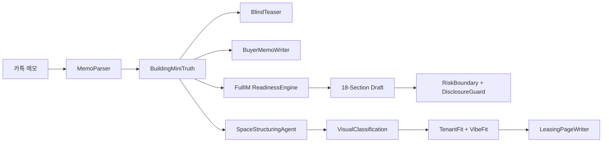
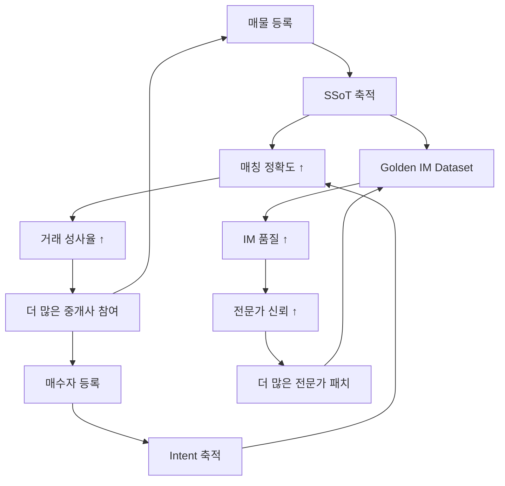

# Part 1. CRE Deal System AI 기술 정밀 분석 & Unfair Advantage

> 분석 대상: `cre-dealcard` · `cre-fullim` · `cre-aipage` 통합 시스템
> 분석 기준일: 2026-05-12 | 코드베이스 정밀 분석 기반

---

## 1. AI 기술 인벤토리 — 시스템별 에이전트 맵

### 1-1. cre-dealcard (4 Agents, 3-Step Chain)

| # | Agent | 파일 | 역할 | AI 모델 | 핵심 기술 |
|---|-------|------|------|---------|-----------|
| 1 | **MemoParser** | `broker-deal-card.ts` (Step 1) | 카톡 비정형 메모 → 구조화 JSON | GPT-4o | Structured Output + Zod 검증 |
| 2 | **BuildingMiniTruth** | `broker-deal-card.ts` (Step 2) | 구조화 데이터 → B-SSoT Lite 초안 | GPT-4o | 민감정보 자동 분류, Confidence 레벨링 |
| 3 | **BlindTeaser** | `broker-deal-card.ts` (Step 3) | SSoT → 블라인드 공유카드 + 카톡텍스트 | GPT-4o | Gate 기반 정보 마스킹, 카카오 포맷 생성 |
| 4 | **BuyerIntentNormalizer** | `buyer-intent-normalizer.ts` | 매수자 조건 메모 → 구조화 Intent | GPT-4o | 예산·지역·업종 정규화 |
| 5 | **BuyerMemoWriter** | `buyer-memo-writer.ts` | SSoT × Intent → 매수자 맞춤 브리핑 | GPT-4o | 크로스 매칭 기반 문서 자동 생성 |
| 6 | **DealCuriosityWriter** | `deal-curiosity-writer.ts` | 주소/메모 → "딜 될까?" 리포트 | GPT-4o | 공개 정보 기반 공공용 리포트 |

> **특징**: 3-Step Chained Pipeline — 한 번의 입력으로 3개 LLM 호출이 순차적으로 연결. 각 단계의 출력이 다음 단계의 입력으로 파이프라인화.

### 1-2. cre-fullim (3 Core Engines + Guardrails)

| # | Engine/Agent | 파일 | 역할 | 핵심 기술 |
|---|-------------|------|------|-----------|
| 7 | **ReadinessEngine** | `readiness-service.ts` | 16개 데이터 포인트 → 0~100 스코어 산출 | 결정론적 스코어링 (non-LLM) |
| 8 | **SectionPlanner** | `section-planner.ts` | 18-섹션 IM 아웃라인 자동 생성 | 규칙 기반 + 데이터 완결성 연동 |
| 9 | **MobileIMWriter** | `mobile-im-writer.ts` | SSoT → 7-섹션 모바일 IM 생성 | 템플릿 + 동적 데이터 바인딩 |
| 10 | **RiskBoundaryAgent** | `draft-guardrails.ts` | 8개 금지 패턴 정규식 검출 | RegEx 가드레일 (P0 자동 차단) |
| 11 | **DisclosureGuardAgent** | `draft-guardrails.ts` | 5개 보호필드 자동 마스킹 | 게이트 레벨(G0~G5) 기반 제어 |
| 12 | **FullIMWriterSchema** | `writer-schema.ts` | AI 초안 출력 Zod 스키마 검증 | 8-필드 강제 (boundary_note 필수) |

> **특징**: AI 출력을 절대로 `buyer_ready`로 자동 승인하지 않음. 모든 AI 초안은 `ai_draft` 상태로 고정 → Gate Review 필수.

### 1-3. cre-aipage (11 Specialized Agents)

| # | Agent | 파일 | 역할 | 핵심 기술 |
|---|-------|------|------|-----------|
| 13 | **SpaceStructuringAgent** | `space-structuring-agent.ts` | 카톡 메모 → Space SSoT 7-레이어 | 구조화 + 시설 상태 unknown 마킹 |
| 14 | **VisualClassificationAgent** | `visual-classification-agent.ts` | 사진 → 공간/설비/동선 자동 분류 | 멀티모달 비전 분류 |
| 15 | **VisualAlbumAgent** | `visual-album-agent.ts` | 분류된 사진 → 업종별 앨범 큐레이션 | 임차인 타입별 최적 사진 선택 |
| 16 | **TenantFitAgent** | `tenant-fit-agent.ts` | SSoT + 사진 → 업종별 적합도 분석 | 시설/법규/비용 다차원 스코어링 |
| 17 | **VibeFitAgent** | `vibe-fit-agent.ts` | 사진 분위기 → 업종 바이브 매칭 | VAD(Valence-Arousal-Dominance) 감성 분석 |
| 18 | **LeasingPageWriterAgent** | `leasing-page-writer-agent.ts` | SSoT + 앨범 → 임대 랜딩페이지 텍스트 | SEO 최적화 + Answer Hero 자동 생성 |
| 19 | **CampaignCopyAgent** | `campaign-copy-agent.ts` | → 카카오/네이버/SMS/인스타 카피 | 채널별 톤앤매너 자동 변환 |
| 20 | **InquiryQualifierAgent** | `inquiry-qualifier-agent.ts` | 문의 → 적합도 판정 + 카톡 답변 초안 | 예산/타이밍/시설 3축 적합도 |
| 21 | **OwnerReportAgent** | `owner-report-agent.ts` | → 건물주 주간 마케팅 리포트 | 조회·문의 데이터 기반 요약 |
| 22 | **DisclosureGuardAgent** | `disclosure-guard-agent.ts` | 공개 전 민감정보 차단 | 중복 게이트 (aipage 전용) |
| 23 | **SafeLanguageAgent** | `safe-language-agent.ts` | 과장 표현 자동 순화 | 부동산 광고법 준수 |

---

## 2. 핵심 AI 아키텍처 패턴 — 차별적 설계 원칙

### 2-1. 🔗 Chained Agent Pipeline (체인형 에이전트)



**차별점**: 단일 LLM 호출이 아닌, **최대 5-단계 에이전트 체인**으로 설계. 각 단계에서 Zod 스키마 검증 → 실패 시 파이프라인 중단. 이는 "환각(hallucination)"을 구조적으로 차단하는 **다단계 진실 정제(Multi-stage Truth Refinement)** 패턴.

### 2-2. 🛡️ Triple Guardrail System (3중 안전장치)

| 계층 | 메커니즘 | 구현 위치 | 대상 |
|------|---------|-----------|------|
| **Layer 1** | Zod Schema Validation | 모든 에이전트 출력 | 구조적 정합성 |
| **Layer 2** | RiskBoundaryCheck (8 RegEx) | `draft-guardrails.ts` | 법적 위험 표현 |
| **Layer 3** | DisclosureGuard (5 Detectors) | `draft-guardrails.ts` | 민감정보 노출 |

**차별점**: 부동산 도메인에서 AI가 "수익률 보장", "대출 가능", "법적 문제 없음" 등 **P0 금지 표현**을 생성하면 즉시 `blocked` 처리. 이는 단순 필터가 아닌 **자동 안전 대체 텍스트 생성**까지 포함.

### 2-3. 🔒 Gate-Based Information Control (게이트 기반 정보 통제)

```
G0: 완전 공개 (area_signal만)
G1: 지역 + 자산유형
G2: + 가격대 + 규모
G3: + 임대 현황 요약
G4: + 상세 임대차 (NDA 후)
G5: 딜룸 (완전 비공개)
```

**차별점**: AI가 생성한 모든 문서에 **Gate Level이 바인딩**되어, 동일한 건물 데이터에서 6종류의 서로 다른 공개 수준 문서를 자동 생성. 경쟁 솔루션에는 이 수준의 정보 계층 제어가 없음.

### 2-4. 📐 Deterministic Readiness Scoring (결정론적 준비도)

ReadinessEngine은 **LLM을 사용하지 않는 순수 결정론적 알고리즘**:
- 16개 데이터 포인트 × 가중치 = 0~100점
- 임대차 현황(rent_roll) 15점 = 최대 가중치
- 50점 미만 → Full IM 생성 불가
- `buyer_ready_full_im`은 코드 레벨에서 **항상 `return true`(blocked)** — AI가 절대 자동 승인 불가

**차별점**: 고의적으로 AI에 의존하지 않는 부분을 명확히 분리. "AI가 판단할 수 없는 영역"을 코드로 강제.

---

## 3. Unfair Advantage — 경쟁 우위 분석

### 3-1. 도메인 특화 Moat (해자)

| Advantage | 설명 | 방어 가능성 |
|-----------|------|------------|
| **한국어 CRE 프롬프트 엔지니어링** | 8개 프롬프트 계약서, 부동산거래신고법/공정거래법 준수 가드레일 내장 | ⭐⭐⭐⭐⭐ |
| **3-Step Chained SSoT Pipeline** | 메모→SSoT→블라인드 티저 체인은 단일 API 호출로 불가능 | ⭐⭐⭐⭐ |
| **Gate-based Disclosure System** | G0~G5 6단계 정보 통제 — 동일 데이터에서 6종 문서 자동 생성 | ⭐⭐⭐⭐⭐ |
| **부동산 금지표현 RegEx Bank** | 투자추천·수익보장·대출확정 등 P0 패턴 자동 차단 + 대체 문구 | ⭐⭐⭐⭐ |
| **Visual Vibe Matching (VAD)** | 사진 감성 분석 → 업종별 공간 바이브 적합도 매칭 | ⭐⭐⭐⭐⭐ |
| **Cross-System Data Bridge** | DealCard→FullIM→AiPage 3개 시스템 간 토큰 기반 핸드오프 | ⭐⭐⭐⭐ |

### 3-2. 기술적 Moat

| 기술 요소 | 구현 수준 | 경쟁사 대비 |
|-----------|----------|------------|
| Zod-enforced AI output | 모든 23개 에이전트에 적용 | 대부분 경쟁사는 raw JSON.parse만 사용 |
| Prompt versioning (`prompt_id`) | 모든 프롬프트에 버전 태깅 | A/B 테스트·회귀 분석 기반 마련 |
| AiRunRecord audit trail | 모든 AI 호출에 대한 감사 로그 | 규제 대응 준비 완료 |
| Expert-in-the-loop | AI 초안 → 전문가 패치 → Golden Dataset | 자체 학습 데이터 플라이휠 |
| Boundary Note 강제 | 모든 출력에 면책문구 필수 (Zod `.min(1)`) | 법적 리스크 원천 차단 |

### 3-3. 데이터 네트워크 효과



---

## 4. 정량적 효과성 추정

### 4-1. 시간 절감 효과

| 업무 | 기존 방식 | AI 시스템 | 절감률 | 근거 |
|------|----------|----------|--------|------|
| 딜카드 작성 | 30~60분 | **30초** | **97%** | 3-Step Chain 자동화 |
| 매수자 매칭 | 2~3일 (인적 네트워크) | **실시간** | **99%** | DB 자동 교차 매칭 |
| Full IM 초안 | 2~3주 / 300~500만원 | **2시간 / 0원** | **95%** | 18-섹션 자동 생성 |
| 공실 마케팅 페이지 | 1~2주 | **15분** | **98%** | 메모+사진→페이지 자동 |
| 모바일 IM 생성 | 3~5일 | **즉시** | **99%** | 7-섹션 템플릿 자동 |
| 임차인 적합도 분석 | 전문가 2~3일 | **실시간** | **99%** | TenantFit + VibeFit |
| 문의 자격 심사 | 30분/건 | **즉시** | **99%** | InquiryQualifier |
| 건물주 리포트 | 2~3시간/주 | **자동** | **100%** | OwnerReportAgent |

### 4-2. 비용 절감 추정 (중개법인 기준, 연간)

| 항목 | 기존 비용 | AI 시스템 비용 | 절감액 |
|------|----------|---------------|--------|
| IM 외주 제작 (연 10건) | 3,000~5,000만원 | API 비용 ~50만원 | **2,950~4,950만원** |
| 매물 마케팅 (연 50건) | 2,500만원 (인건비) | API ~30만원 | **~2,470만원** |
| 매수자 매칭 기회 비용 | 측정 불가 (놓친 딜) | 실시간 매칭 | **거래 성사율 20~30% ↑** |
| 법적 리스크 (과장 광고) | 건당 500~3,000만원 | P0 자동 차단 | **리스크 제거** |

### 4-3. AI API 비용 추정 (건당)

| 파이프라인 | 호출 수 | 토큰 추정 | 비용 (GPT-4o) |
|-----------|---------|----------|---------------|
| 딜카드 생성 | 3회 | ~12,000 | ~₩1,200 |
| 매수자 매칭 메모 | 1회 | ~4,000 | ~₩400 |
| Space SSoT 생성 | 1회 | ~6,000 | ~₩600 |
| Full IM 18-섹션 | 18회 | ~72,000 | ~₩7,200 |
| 임대 페이지 생성 | 3~5회 | ~20,000 | ~₩2,000 |

> **건당 총 AI 비용: ~₩11,400** vs 기존 IM 외주 비용 300~500만원 → **260~440배 비용 효율**

---

## 5. 기술 성숙도 평가 (TRL)

| 시스템 | 현재 TRL | 상태 | 프로덕션 준비도 |
|--------|---------|------|----------------|
| cre-dealcard | **TRL 7** | 프로덕션 배포 완료, 실 데이터 운영 | ✅ Ready |
| cre-fullim | **TRL 6** | 시스템 통합 완료, 데모 준비 | ⚡ Near-Ready |
| cre-aipage | **TRL 6** | 에이전트 체인 구현, DB 연동 완료 | ⚡ Near-Ready |
| 통합 핸드오프 | **TRL 5** | 3개 시스템 간 토큰 기반 브릿지 | 🔧 Integration |

---

> [!IMPORTANT]
> **핵심 결론**: 이 시스템의 진정한 Unfair Advantage는 단일 AI 기술이 아니라,
> **23개 도메인 특화 에이전트 × 3중 가드레일 × Gate 정보 통제 × Expert-in-the-loop**이
> 하나의 통합 파이프라인으로 작동하는 **시스템 복합체(System of Systems)**에 있습니다.
> 개별 에이전트는 복제 가능하지만, 이 체계 전체를 재구축하려면 **최소 12~18개월**이 필요합니다.
