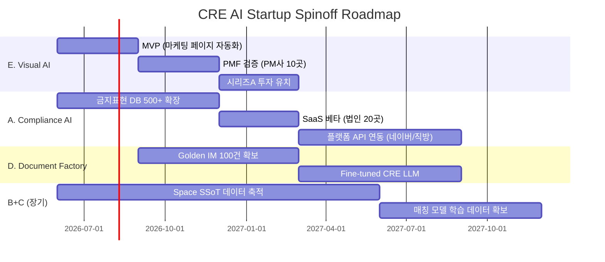

# Part 2. AI R&D 고도화 → 단독 스타트업화 아이템 MECE 분석

> 소스: CRE Deal System (cre-dealcard, cre-fullim, cre-aipage) 23개 AI 에이전트
> 분석 프레임: MECE (Mutually Exclusive, Collectively Exhaustive)

---

## MECE 분류 프레임워크

```mermaid
graph TB
    ROOT["CRE Deal AI<br/>23 Agents"] --> A["A. Compliance AI<br/>(규제·안전)"]
    ROOT --> B["B. Space Intelligence<br/>(공간·시각)"]
    ROOT --> C["C. Deal Matching<br/>(거래·매칭)"]
    ROOT --> D["D. Document AI<br/>(문서·자동화)"]
    ROOT --> E["E. PropTech Visual<br/>(비전·마케팅)"]
    
    A --> A1["RiskBoundary"]
    A --> A2["DisclosureGuard"]
    A --> A3["SafeLanguage"]
    
    B --> B1["SpaceStructuring"]
    B --> B2["TenantFit"]
    B --> B3["VibeFit"]
    B --> B4["RetrofitROI"]
    
    C --> C1["BuyerIntentNormalizer"]
    C --> C2["BuyerMemoWriter"]
    C --> C3["InquiryQualifier"]
    
    D --> D1["MemoParser Chain"]
    D --> D2["FullIM Writer"]
    D --> D3["MobileIM Writer"]
    D --> D4["OwnerReport"]
    
    E --> E1["VisualClassification"]
    E --> E2["VisualAlbum"]
    E --> E3["LeasingPageWriter"]
    E --> E4["CampaignCopy"]
```

---

## 스타트업 아이템 A: **CRE Compliance AI** (부동산 규제 준수 AI)

### 핵심 기술 자산
| 기반 에이전트 | 고도화 방향 |
|-------------|-----------|
| RiskBoundaryAgent (8 RegEx) | → 500+ 패턴 확장, 법령 DB 연동 |
| DisclosureGuardAgent (5 Detector) | → 50+ 보호필드, 다국어 확장 |
| SafeLanguageAgent | → 실시간 광고 심의 자동화 |
| Gate G0~G5 System | → 동적 게이트 정책 엔진 |

### 제품 비전
> **"부동산 광고·문서의 Grammarly — 쓰는 순간 법적 위험이 사라지는 AI"**

### 타겟 시장 (TAM/SAM/SOM)

| 구분 | 규모 | 근거 |
|------|------|------|
| **TAM** | 2.5조원 | 글로벌 RegTech 시장 (부동산 서브셋) |
| **SAM** | 1,200억원 | 한국 부동산 광고·문서 시장 |
| **SOM** | 120억원 (Y3) | 중개법인 500곳 × 월 20만원 |

### 수익 모델
- **SaaS**: 월 20~50만원/법인 (문서 검수 횟수 기반)
- **API**: 건당 500~2,000원 (네이버부동산·직방 등 플랫폼 연동)
- **엔터프라이즈**: 연 1,000~5,000만원 (대형 디벨로퍼·AMC)

### 경쟁 우위
- ✅ **한국어 부동산 금지표현 DB**가 핵심 IP — 구축에 최소 2년
- ✅ 단순 필터가 아닌 **자동 대체 문구 생성**
- ✅ Gate 시스템으로 **정보 공개 범위 자동 관리**
- ❌ 리스크: 법률 변경 시 지속적 업데이트 필요

### R&D 고도화 로드맵
1. **Phase 1 (6M)**: 한국 부동산 관련법 전체 패턴 DB화 (500+)
2. **Phase 2 (12M)**: 실제 행정처분 사례 학습 → 위험도 예측 모델
3. **Phase 3 (18M)**: 다국어 확장 (일본·동남아 부동산 시장)

---

## 스타트업 아이템 B: **Space Intelligence Platform** (공간 지능 플랫폼)

### 핵심 기술 자산
| 기반 에이전트 | 고도화 방향 |
|-------------|-----------|
| SpaceStructuringAgent | → 만능 공간 SSoT 생성기 |
| TenantFitAgent | → AI 부동산 컨설턴트 |
| VibeFitAgent (VAD) | → 공간 감성 매칭 엔진 |
| RetrofitROIAgent | → 투자 시뮬레이션 엔진 |

### 제품 비전
> **"모든 상업 공간의 디지털 트윈 — 메모+사진만으로 공간의 가치를 수치화하는 AI"**

### 타겟 시장

| 구분 | 규모 | 근거 |
|------|------|------|
| **TAM** | 15조원 | 글로벌 상업부동산 데이터 분석 시장 |
| **SAM** | 3,000억원 | 한국 상업부동산 관리·임대 시장 |
| **SOM** | 50억원 (Y3) | PM사 200곳 + 대형 빌딩 500동 |

### 수익 모델
- **SaaS**: 건물당 월 10~30만원 (공간 SSoT + 적합도 분석)
- **데이터 라이선스**: 권역별 적합도 데이터 → 리서치사·디벨로퍼
- **컨설팅 API**: 건당 5~10만원 (신규 임차인 업종 추천)

### 경쟁 우위
- ✅ **VibeFit(VAD 감성 분석)**은 전 세계적으로 유사 제품 없음
- ✅ 7-레이어 Space SSoT 스키마 = 독자적 데이터 모델
- ✅ 사진만으로 시설 상태를 `unknown`/`confirmed` 구분 → 정직한 AI
- ❌ 리스크: 초기 데이터 확보 (Cold Start Problem)

### R&D 고도화 로드맵
1. **Phase 1 (6M)**: VAD 모델 자체 학습 데이터셋 구축 (한국 상업공간 10만장)
2. **Phase 2 (12M)**: 3D 공간 인식 + LiDAR 연동
3. **Phase 3 (18M)**: 실시간 IoT 센서 데이터 → 동적 공간 가치 평가

---

## 스타트업 아이템 C: **Deal Matching Engine** (딜 매칭 엔진)

### 핵심 기술 자산
| 기반 에이전트 | 고도화 방향 |
|-------------|-----------|
| BuyerIntentNormalizer | → 범용 수요자 의도 파서 |
| BuyerMemoWriter | → 자동 브로커 브리핑 생성 |
| InquiryQualifierAgent | → Lead Scoring AI |
| 3-Stage Matching Logic | → 딥러닝 매칭 모델 |

### 제품 비전
> **"부동산의 LinkedIn Recruiter — 매물과 매수자를 자동으로 연결하는 AI"**

### 타겟 시장

| 구분 | 규모 | 근거 |
|------|------|------|
| **TAM** | 8조원 | 글로벌 부동산 중개 기술 시장 |
| **SAM** | 5,000억원 | 한국 상업부동산 중개 시장 |
| **SOM** | 100억원 (Y3) | 성사 수수료 쉐어 모델 |

### 수익 모델
- **기본 SaaS**: 무료 (매물/매수자 등록)
- **매칭 성공 수수료**: 거래 성사 시 중개 수수료의 5~10%
- **프리미엄**: 월 50만원/법인 (실시간 알림 + 우선 매칭)

### 경쟁 우위
- ✅ **비정형 한국어 메모 → 구조화 Intent** 변환 파이프라인
- ✅ 예산·지역·업종·리스크허용도 4축 매칭
- ✅ 매칭 시 자동으로 **법적 안전한 브리핑 문서** 생성
- ❌ 리스크: 네트워크 효과 달성까지의 "닭과 달걀" 문제

### R&D 고도화 로드맵
1. **Phase 1 (6M)**: 임베딩 기반 시맨틱 매칭 (SSoT ↔ Intent 벡터 유사도)
2. **Phase 2 (12M)**: 거래 성사/실패 피드백 루프 → 매칭 모델 자기학습
3. **Phase 3 (18M)**: 크로스보더 매칭 (해외 매수자 ↔ 한국 매물)

---

## 스타트업 아이템 D: **AI Document Factory** (AI 문서 자동화 팩토리)

### 핵심 기술 자산
| 기반 에이전트 | 고도화 방향 |
|-------------|-----------|
| 3-Step DealCard Chain | → 범용 비정형 문서 구조화 |
| 18-Section FullIM Writer | → 부동산 전 문서 유형 자동 생성 |
| MobileIM Writer | → 원클릭 모바일 브로슈어 |
| ReadinessEngine | → 문서 완성도 품질 관리 |
| Expert Patch System | → Human-AI Co-creation |

### 제품 비전
> **"CRE의 Jasper.ai — 모든 부동산 문서를 AI가 초안, 전문가가 검증하는 팩토리"**

### 타겟 시장

| 구분 | 규모 | 근거 |
|------|------|------|
| **TAM** | 5조원 | 글로벌 부동산 문서 제작 시장 |
| **SAM** | 2,000억원 | 한국 IM·티저·브로슈어 제작 시장 |
| **SOM** | 80억원 (Y3) | IM 건당 30만원 × 연 27,000건 |

### 수익 모델
- **건당 과금**: IM 초안 30~50만원 (기존 300~500만원의 1/10)
- **구독**: 월 100만원/법인 (무제한 생성)
- **Golden Dataset 라이선스**: 전문가 검증 IM → 교육/연구 데이터

### 경쟁 우위
- ✅ **Expert Patch → Golden Dataset 플라이휠** = 시간이 갈수록 품질 향상
- ✅ ReadinessScore로 **"문서 생성 가능/불가능"을 객관적으로 판단**
- ✅ `ai_draft` → `buyer_ready` 전환 불가 규칙 = 신뢰성 극대화
- ❌ 리스크: 전문가 네트워크 확보 필요

### R&D 고도화 로드맵
1. **Phase 1 (6M)**: Golden IM 100건 확보 → Fine-tuning 데이터셋
2. **Phase 2 (12M)**: 자체 CRE LLM (7B) Fine-tune → API 비용 90% 절감
3. **Phase 3 (18M)**: 주거·물류·호텔 등 자산 유형별 IM 확장

---

## 스타트업 아이템 E: **PropTech Visual AI** (프롭테크 비주얼 AI)

### 핵심 기술 자산
| 기반 에이전트 | 고도화 방향 |
|-------------|-----------|
| VisualClassificationAgent | → 범용 부동산 사진 분류 엔진 |
| VisualAlbumAgent | → 자동 부동산 사진 편집·큐레이션 |
| LeasingPageWriterAgent | → AI 랜딩페이지 빌더 |
| CampaignCopyAgent | → 멀티채널 마케팅 자동화 |
| OwnerReportAgent | → 자동 리포트 생성기 |

### 제품 비전
> **"부동산 Canva — 사진 올리면 마케팅 페이지·SNS 카피·건물주 리포트가 자동으로 나오는 AI"**

### 타겟 시장

| 구분 | 규모 | 근거 |
|------|------|------|
| **TAM** | 10조원 | 글로벌 부동산 마케팅 기술 시장 |
| **SAM** | 4,000억원 | 한국 부동산 마케팅·광고 시장 |
| **SOM** | 200억원 (Y3) | 공실 50만 호 × 월 4만원 |

### 수익 모델
- **Freemium**: 월 3건 무료, 이후 건당 5만원
- **구독**: 월 30만원/PM사 (무제한 + 건물주 리포트)
- **API**: 건당 3,000~5,000원 (플랫폼 연동)

### 경쟁 우위
- ✅ **사진만으로 15분 만에 마케팅 페이지** 완성 = 경쟁사 대비 100배 빠름
- ✅ 채널별(카카오/네이버/인스타/SMS) **톤앤매너 자동 변환**
- ✅ 문의 접수 → AI 자동 자격 심사 → 카톡 답변 초안 = End-to-End
- ❌ 리스크: 네이버부동산 등 기존 플랫폼과의 경합

### R&D 고도화 로드맵
1. **Phase 1 (6M)**: 부동산 사진 전용 분류 모델 자체 학습 (10만 장)
2. **Phase 2 (12M)**: AI 가상 스테이징 (빈 공간 → 가구 배치 렌더링)
3. **Phase 3 (18M)**: 360° 가상 투어 자동 생성

---

## 우선순위 평가 매트릭스

| 아이템 | TAM | Moat 강도 | 실행 난이도 | 시간(MVP) | 수익성 | **총점** |
|--------|-----|----------|-----------|----------|--------|---------|
| **A. Compliance AI** | ★★★ | ★★★★★ | ★★★★ (쉬움) | 3개월 | ★★★★ | **19** |
| **B. Space Intelligence** | ★★★★ | ★★★★★ | ★★★ | 6개월 | ★★★ | **18** |
| **C. Deal Matching** | ★★★★★ | ★★★ | ★★ | 9개월 | ★★★★★ | **18** |
| **D. Document Factory** | ★★★★ | ★★★★ | ★★★ | 6개월 | ★★★★ | **18** |
| **E. Visual AI** | ★★★★★ | ★★★★ | ★★★★ (쉬움) | 3개월 | ★★★★ | **20** |

> [!TIP]
> **추천 전략**: **E(Visual AI)를 1순위 스핀오프 → A(Compliance AI)를 2순위**로 실행.
> - E는 TAM이 크고 MVP가 3개월이면 가능, 즉각적 수익 창출 가능
> - A는 Moat이 가장 강력하여 장기적 방어벽 구축에 유리
> - C(Deal Matching)는 네트워크 효과가 필요하므로 단독보다 B2B 파트너십으로 접근

---

## 실행 로드맵 종합

---

## 핵심 결론

> [!IMPORTANT]
> **5개 스타트업 아이템 모두 기존 코드베이스에서 80%+ 재사용이 가능합니다.**
>
> 가장 빠르게 스핀오프할 수 있는 아이템은 **E(PropTech Visual AI)**이며,
> 가장 깊은 해자(Moat)를 구축할 수 있는 아이템은 **A(CRE Compliance AI)**입니다.
>
> **추천 전략**:
> 1. E를 먼저 출시하여 **초기 매출(MRR)을 확보**하고,
> 2. A를 병행 R&D하여 **규제 IP를 축적**한 후,
> 3. 시리즈 A 투자 유치 시 D(Document Factory)의 **Golden Dataset 확보**에 투자하여
> 4. 궁극적으로 B+C의 **데이터 네트워크 효과** 플랫폼으로 진화하는 경로가 최적입니다.
>
> 예상 Y3 ARR: **E(200억) + A(120억) + D(80억) = 400억원 규모**
