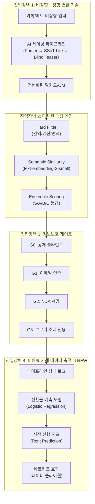
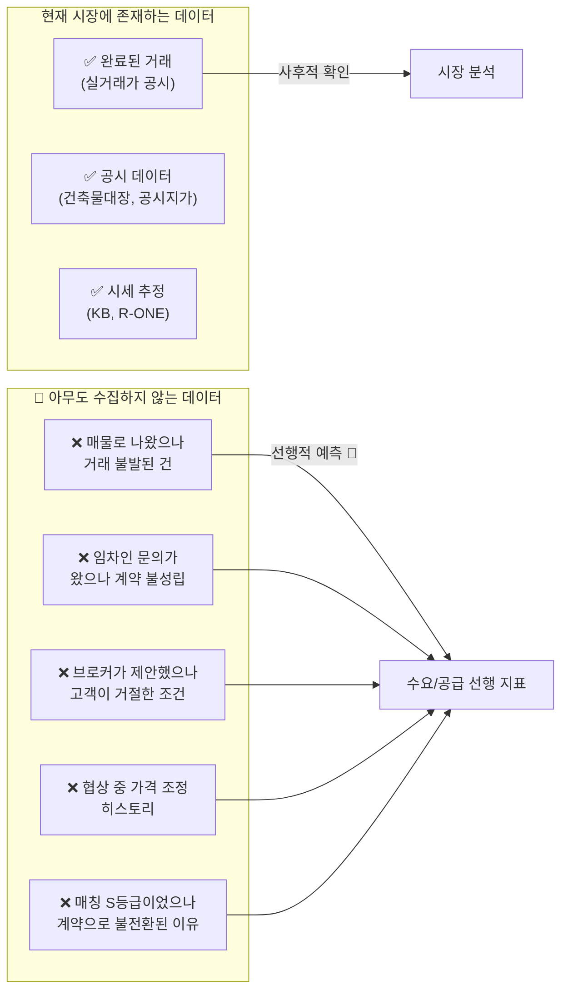
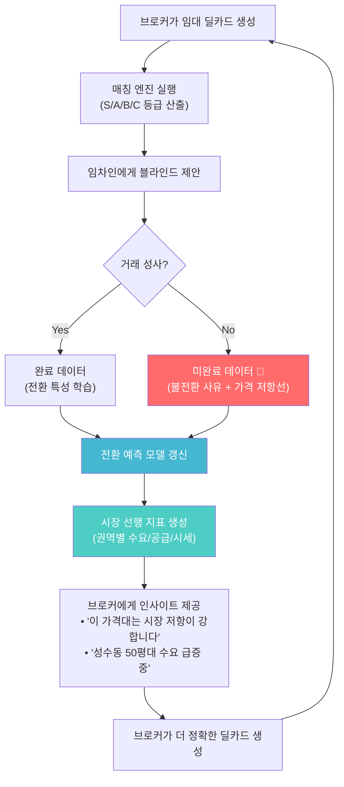

# CRE 임대차 AI 매칭 시스템 — 미완료 거래 데이터 특허화 전략

> **문서 버전**: v1.0 | **작성일**: 2026-05-25  
> **목적**: 미완료 거래(Pipeline) 데이터의 선행 지표적 가치를 특허 청구항으로 구체화하고, 독보적 우위(Unfair Advantage)를 체계적으로 문서화

---

## Part 1: CRE 임대차 IM/OM + AI 매칭의 독보적 우위(Unfair Advantage)

### 1-A. 경쟁 구도 분석 — 왜 복제가 어려운가?



### 1-B. 4중 독보적 우위 상세

| # | Unfair Advantage | 기존 경쟁사 대비 | 복제 소요 시간 |
|---|-----------------|-----------------|---------------|
| ① | **비정형 메모 → OM 자동 생성** | Crexi/Buildout: PDF 파싱 위주, 신규 생성 불가 | 12~18개월 (AI 체인 + 도메인 학습) |
| ② | **3단계 앙상블 매칭 알고리즘** | CoStar: 키워드 기반 검색만 지원 | 6~12개월 (임베딩 + 가중치 최적화) |
| ③ | **5단계 정보보호 게이트** | 경쟁사 없음 (오픈/클로즈 이분법) | 6개월 (규제 전문성 필요) |
| ④ | **미완료 거래 데이터 축적** | **글로벌 최초** — 아무도 수집하지 않음 | **복제 불가** (시간×데이터 축적) |

> [!IMPORTANT]
> **④번 '미완료 거래 데이터'가 가장 강력한 해자(Moat)입니다.**  
> 이유: ①②③은 기술적 우위이므로 시간과 자본으로 복제 가능하지만, ④는 **데이터 축적 자체가 경쟁우위**이므로 후발주자가 시간을 돌려놓을 수 없습니다.

---

## Part 2: 미완료 거래 데이터 — 왜 혁신적인가?

### 2-A. 기존 시장의 데이터 블라인드 스팟



### 2-B. 미완료 거래 데이터가 제공하는 선행 지표적 가치

| 데이터 유형 | 수집 시점 | 선행 지표 역할 | 활용 예시 |
|------------|----------|--------------|----------|
| **매물 등록 후 문의 빈도** | 매물 게시 직후 | 해당 권역의 **수요 강도** 실시간 파악 | "성수동 오피스 50평대: 이번 주 문의 15건 → 수요 급등 시그널" |
| **매칭 S등급 건의 불전환 사유** | 매칭 후 72시간 | **가격 저항선** 실시간 감지 | "강남 오피스 월세 250만원: S등급 3건 모두 예산 초과로 탈락 → 시장 적정가 200~220만원" |
| **임차인 의향서 등록 추이** | 의향서 생성 시 | 특정 **업종의 수요 트렌드** 선행 파악 | "F&B 업종 성수 의향서 +40% → 3개월 후 성수 F&B 임대료 상승 예측" |
| **파이프라인 상태 전환 속도** | 단계 전환 시 | **시장 온도(Market Temperature)** | "평균 계약 소요일: 45일→30일 → 시장 과열 시그널" |
| **협상 중 가격 조정 이력** | 가격 수정 시 | **적정 시세 밴드** 실시간 보정 | "성수 보증금 5000만→3000만 조정 3건 → 보증금 하방 압력" |
| **공실 매물 체류 기간** | 매일 갱신 | **흡수율(Absorption Rate)** 선행 지표 | "강남 50평대 공실 평균 체류 60일→90일 → 공급 과잉 시그널" |

### 2-C. 실제 구현 기반 데이터 수집 아키텍처

현재 코드베이스에서 이미 수집 가능한 데이터 포인트:

```
┌─────────────────────────────────────────────────────────────────────┐
│  activity_events 테이블 (이미 구현됨)                                 │
│                                                                     │
│  ┌─────────────────────┐    ┌─────────────────────┐                │
│  │ MvpEventType         │    │ 선행 지표 변환        │                │
│  │ ──────────────────── │    │ ──────────────────── │                │
│  │ broker_memo_submitted│ → │ 매물 소싱 속도        │                │
│  │ blind_teaser_generated│→ │ 마케팅 활성도         │                │
│  │ kakao_copy_clicked   │ → │ 유통 빈도 (바이럴)    │                │
│  │ buyer_intent_created │ → │ 수요측 의향 밀도      │                │
│  │ gate_request_created │ → │ 거래 진행 의지 강도   │                │
│  │ owner_readiness_     │ → │ 공급측 준비도         │                │
│  │   checked            │   │                      │                │
│  │ ai_run_completed     │ → │ 시스템 활용 밀도      │                │
│  └─────────────────────┘    └─────────────────────┘                │
│                                                                     │
│  ┌─────────────────────────────────────────────┐                   │
│  │ lease_match_results 테이블 (이미 구현됨)       │                   │
│  │ ────────────────────────────────────────── ─ │                   │
│  │ grade (S/A/B/C) + score + reasoning         │                   │
│  │ → 매칭 품질 분포 → 수요-공급 갭 분석           │                   │
│  └─────────────────────────────────────────────┘                   │
│                                                                     │
│  ┌─────────────────────────────────────────────┐                   │
│  │ deal_conversion_features (이미 구현됨)         │                   │
│  │ ────────────────────────────────────────────  │                   │
│  │ DealFeatureVector 18개 피처                   │                   │
│  │ → totalHoldDays, currentStageOrd,            │                   │
│  │   bestMatchGrade, sGradeCount ...            │                   │
│  │ → 전환율 예측 + 시장 거래 속도 지표             │                   │
│  └─────────────────────────────────────────────┘                   │
└─────────────────────────────────────────────────────────────────────┘
```

---

## Part 3: 특허 출원 전략 — 4개 핵심 청구항 설계

### 특허 1: 비정형 텍스트 기반 상업용 부동산 투자설명서 자동 생성 시스템

**기술적 차별성**: 메신저(카카오톡) 등의 비정형 텍스트에서 상업용 부동산 IM(Information Memorandum) / OM(Offering Memorandum)을 자동 생성하는 AI 체이닝 파이프라인

| 청구항 요소 | 상세 |
|------------|------|
| **입력** | 비정형 자연어 텍스트 (메신저 대화, 메모) |
| **Stage 1** | LLM 기반 구조화 파싱 → Zod 스키마 검증 → SSoT Lite 생성 |
| **Stage 2** | SSoT Lite + 도메인 규칙 → 블라인드 티저 자동 생성 |
| **Stage 3** | 정보 보호 등급(G0~G3)에 따른 단계적 정보 공개 |
| **출력** | 모바일 네이티브 투자설명서 + 메신저 공유용 텍스트 |
| **신규성** | 글로벌 CRE 시장에서 비정형 메모→IM 신규 생성은 선행기술 없음 |

**핵심 독립항 (Claim 1)**:
```
"메신저 또는 비정형 텍스트 입력을 수신하는 단계; 상기 입력을 대규모 언어 모델(LLM)에 의해 
사전 정의된 부동산 투자 정보 스키마에 맞추어 구조화 데이터로 변환하는 단계; 상기 구조화 
데이터에서 소정의 정보 보호 등급에 따라 민감 정보를 자동으로 마스킹하여 블라인드 투자 
설명서를 생성하는 단계를 포함하는, 컴퓨터로 구현되는 부동산 투자설명서 자동 생성 방법."
```

---

### 특허 2: 다차원 제약 조건 기반 3단계 앙상블 부동산 매칭 알고리즘

**기술적 차별성**: Hard Filter → Semantic Embedding Similarity → Ensemble Scoring의 3단계 파이프라인으로 임대 매물과 임차인 의향을 매칭하는 알고리즘

| 청구항 요소 | 상세 |
|------------|------|
| **Stage 1: Hard Filter** | 예산(보증금/월세) 상한 × 허용 오차, 권역 계층 구조 매칭, 면적 범위 ± 20% |
| **Stage 2: Semantic** | 매물 텍스트 + 임차인 의향 텍스트를 벡터 임베딩 → 코사인 유사도 산출 |
| **Stage 3: Ensemble** | 유사도(40%) + 층수 선호(20%) + 예산 적합(20%) + 인센티브(20%) 가중 합산 |
| **출력** | S/A/B/C 등급 + 종합 점수 + 자연어 추론 설명 |
| **진보성** | 키워드 검색이나 단순 필터와 달리, **의미적 유사도와 도메인 규칙의 앙상블** |

**핵심 독립항 (Claim 1)**:
```
"부동산 매물 데이터와 수요자 의향 데이터를 수신하는 단계; 상기 매물 데이터와 의향 
데이터에 대해 복수의 정량적 제약 조건(예산, 권역, 면적)에 기반한 하드 필터링을 수행하는 
제1 단계; 상기 하드 필터를 통과한 매물-의향 쌍에 대해 자연어 임베딩 모델을 이용하여 
시맨틱 유사도를 산출하는 제2 단계; 상기 시맨틱 유사도와 복수의 도메인 특화 점수를 
소정의 가중치로 앙상블하여 종합 매칭 등급을 산출하는 제3 단계를 포함하는, 부동산 
매물-수요자 매칭 방법."
```

---

### 특허 3: 단계적 정보 보호 게이트를 통한 부동산 거래 데이터 개방 제어 시스템

**기술적 차별성**: 거래 진행 단계에 따라 자동으로 정보 공개 범위를 확대/축소하는 게이트 시스템

| 청구항 요소 | 상세 |
|------------|------|
| **G0 (공개)** | 블라인드 티저: 권역, 가격대, 자산유형만 공개 |
| **G1 (이메일)** | 열람자 추적 + 상세 면적/층수/수익률 공개 |
| **G2 (NDA)** | 디지털 NDA 서명 후 정확한 주소, 임대차 현황 공개 |
| **G3 (초대)** | 브로커 승인 후 재무 상세, 건물주 정보 공개 |
| **자동 제어** | `hidden_fields` 배열 + `visibility` enum으로 프로그래밍 가능한 정보 게이트 |
| **신규성** | 오픈/클로즈 이분법이 아닌 **다단계 점진적 정보 개방** |

---

### 🔴 특허 4 (NEW): 미완료 부동산 거래 데이터를 활용한 시장 선행 지표 예측 시스템

> [!CAUTION]
> **이것이 가장 혁신적이고 가치가 높은 특허입니다.** 기존에는 완료된 거래(실거래가)만 데이터로 활용했으나, 미완료 거래 파이프라인 데이터를 수집·분석하여 시장의 미래를 예측하는 시스템은 글로벌 최초입니다.

**기술적 차별성**: 거래 불성립 사유, 매칭 불전환 패턴, 파이프라인 체류 기간, 가격 조정 이력 등 **미완료 거래 데이터**를 체계적으로 수집하고, 이를 통해 시장 시세·수요·공급을 **선행적으로 예측**하는 시스템

| 청구항 요소 | 상세 |
|------------|------|
| **데이터 수집** | 파이프라인 상태 머신(FSM)의 모든 상태 전환 + 이벤트 로그 + 매칭 결과를 실시간 수집 |
| **피처 추출** | [DealFeatureVector](file:///c:/Users/User/cre-dealcard/src/domain/prediction/deal-feature-extractor.ts) — 18개 다차원 피처 자동 추출 |
| **예측 모델** | 로지스틱 회귀 + 휴리스틱 앙상블 ([deal-conversion-predictor.ts](file:///c:/Users/User/cre-dealcard/src/domain/prediction/deal-conversion-predictor.ts)) |
| **시장 지표 생성** | 권역별 수요 강도, 적정 시세 밴드, 흡수율, 업종별 트렌드 자동 생성 |
| **피드백 루프** | 예측 결과를 브로커에게 제공 → 브로커 행동 → 새로운 데이터 수집 → 모델 정밀도 향상 |

**핵심 독립항 (Claim 1)**:
```
"부동산 거래 중개 플랫폼에서 거래 파이프라인의 복수의 상태 전환 이벤트를 수집하는 단계; 
상기 이벤트에서 거래 미완료(불성립) 건을 포함하는 전체 파이프라인 데이터로부터 소정의 
피처 벡터를 추출하는 단계; 상기 피처 벡터를 통계적 학습 모델에 입력하여 (a) 개별 거래의 
전환 확률, (b) 권역별 수요-공급 균형 지표, (c) 적정 시세 밴드를 산출하는 단계; 상기 
산출 결과를 중개인에게 의사결정 지원 정보로 제공하고, 중개인의 후속 행동 데이터를 다시 
수집하여 학습 모델을 갱신하는 피드백 루프 단계를 포함하는, 미완료 부동산 거래 데이터 
기반 시장 선행 지표 예측 방법."
```

**종속항 예시**:
```
[종속항 2] 상기 파이프라인 상태 전환 이벤트는 매물 등록, 블라인드 티저 생성, 매칭 
실행, 관심 표명, 미팅 예약, NDA 서명, LOI 제출, 계약 체결, 및 각 단계에서의 이탈을 
포함하는, 제1항의 방법.

[종속항 3] 상기 피처 벡터는 매칭 등급 분포(S/A/B/C), 파이프라인 체류 일수, 
가격 조정 횟수 및 조정 폭, 이벤트 발생 빈도를 포함하는, 제1항의 방법.

[종속항 4] 상기 시세 밴드는 해당 권역에서 매칭 S등급 건의 불전환 사유를 분석하여 
수요자의 실질적 예산 상한을 역산(逆算)하는 방식으로 산출되는, 제1항의 방법.
```

---

## Part 4: 선행기술 조사 및 신규성·진보성 분석

### 4-A. 글로벌 선행기술 대비표

| 선행기술 | 특허 1 대비 | 특허 2 대비 | 특허 3 대비 | 특허 4 대비 |
|---------|-----------|-----------|-----------|-----------|
| **CoStar / LoopNet** | ❌ 비정형→OM 생성 없음 | ❌ 키워드 검색만 | ❌ 오픈/클로즈만 | ❌ 미완료 데이터 수집 없음 |
| **Crexi** | ⚠️ PDF 파싱만 (신규 생성 불가) | ❌ 필터 기반만 | ❌ | ❌ |
| **Dealpath** | ⚠️ 구조화 데이터 입력 요구 | ⚠️ 포트폴리오 분석 위주 | ❌ | ❌ |
| **Buildout** | ❌ 템플릿 기반 OM 제작 | ❌ | ❌ | ❌ |
| **Juniper Square** | ❌ 투자자 CRM 위주 | ❌ | ⚠️ 접근 제어 있으나 2단계만 | ❌ |
| **직방/다방 (한국)** | ❌ 주거용 위주 | ❌ | ❌ | ❌ |
| **Zillow Zestimate** | ❌ | ❌ | ❌ | ⚠️ 완료된 거래만 활용 |

### 4-B. 특허 4의 신규성 논거

> [!IMPORTANT]
> **핵심 차별점**: 기존 부동산 데이터 분석 특허(Zillow, CoStar)는 모두 **완료된 거래(실거래가)**만 활용합니다. 
> 우리 시스템은 **미완료 거래의 파이프라인 데이터**(매칭 불전환, 가격 조정, 단계 이탈)를 체계적으로 수집하고 분석한다는 점에서 **선행기술이 없는 완전한 신규 발명**입니다.

**신규성 (Novelty)**:
1. 부동산 거래에서 "실패한 거래"의 데이터를 구조적으로 수집하는 시스템이 없음
2. 매칭 등급(S/A/B/C)과 불전환 사유의 결합 분석은 선행 사례 없음
3. 파이프라인 FSM의 상태 전환 속도를 시장 온도 지표로 활용하는 개념 부재

**진보성 (Inventive Step)**:
1. 단순히 데이터를 수집하는 것이 아니라, **18개 피처의 다차원 벡터**로 변환
2. 휴리스틱(콜드스타트) → 로지스틱 회귀(80+ 샘플)로 자동 전환하는 **적응형 모델**
3. 예측 결과가 브로커 행동에 영향 → 새 데이터 생성 → 모델 개선의 **자기강화 피드백 루프**

---

## Part 5: 데이터 플라이휠 — 시간이 지날수록 강화되는 해자



### 플라이휠 효과 정량 예측

| 시점 | 축적 데이터 | 예측 정밀도 | 활용 가치 |
|------|-----------|-----------|----------|
| **6개월** | 파이프라인 500건 (미완료 350건) | 휴리스틱 모드 (±20%) | 권역별 수요 트렌드 파악 |
| **12개월** | 파이프라인 2,000건 (미완료 1,400건) | 모델 모드 전환 (±12%) | 적정 시세 밴드 산출 시작 |
| **24개월** | 파이프라인 8,000건 (미완료 5,600건) | 고정밀 모드 (±7%) | 분기별 시장 리포트 판매 가능 |
| **36개월** | 파이프라인 20,000건+ | 초정밀 (±4%) | **시장 데이터 API** B2B 판매 |

> [!TIP]
> **36개월 차의 데이터 자산 가치**: 미완료 거래 20,000건의 파이프라인 데이터는 실거래가 공시 시스템(국토교통부)이 **절대 수집할 수 없는** 데이터입니다. 이 데이터의 독점적 보유는 R-ONE, KB부동산 시세와 **상호 보완적이면서 대체 불가능한** 자산입니다.

---

## Part 6: 특허 출원 로드맵

### 출원 우선순위

| 순위 | 특허 | 출원 시기 | 사유 |
|------|------|----------|------|
| **1** | 특허 4 (미완료 데이터 선행지표) | **즉시** | 글로벌 최초 — 선행기술 미존재, 선점 가치 극대 |
| **2** | 특허 2 (3단계 앙상블 매칭) | 1개월 내 | 구현 완료, 코드 기반 증빙 가능 |
| **3** | 특허 1 (비정형→OM 생성) | 2개월 내 | AI 체이닝 구조 상세화 필요 |
| **4** | 특허 3 (정보보호 게이트) | 3개월 내 | 기존 접근제어 대비 차별성 보강 필요 |

### 출원 형태 권고

| 항목 | 권고 |
|------|------|
| **출원국** | 한국(KR) + PCT 국제출원 (미국/일본 지정) |
| **출원 형태** | 4건 개별 출원 (각 발명의 독립성 확보) |
| **명세서 작성** | 코드베이스의 실제 구현을 실시 예로 포함 |
| **도면** | 위 Mermaid 다이어그램을 특허 도면으로 변환 |
| **우선심사** | 특허 4번은 AI/빅데이터 분야 → 우선심사 신청 가능 |

---

## 결론

> [!IMPORTANT]
> **핵심 메시지**: CRE 임대차 AI 매칭 시스템의 가장 강력한 독보적 우위는 **"미완료 거래 데이터의 체계적 축적"**입니다.
> 
> - **기술적 우위**(특허 1~3)는 12~18개월이면 복제 가능하지만
> - **데이터 우위**(특허 4)는 **시간 자체가 진입장벽**이므로 복제 불가능합니다
> 
> 이 데이터는 단순한 거래 기록이 아니라, 시장의 **"보이지 않는 수요와 공급"**을 선행적으로 포착하는 유일한 데이터셋입니다.
> 특허 4를 **즉시 출원**하여 이 개념을 선점하는 것이 전략적으로 가장 중요합니다.
