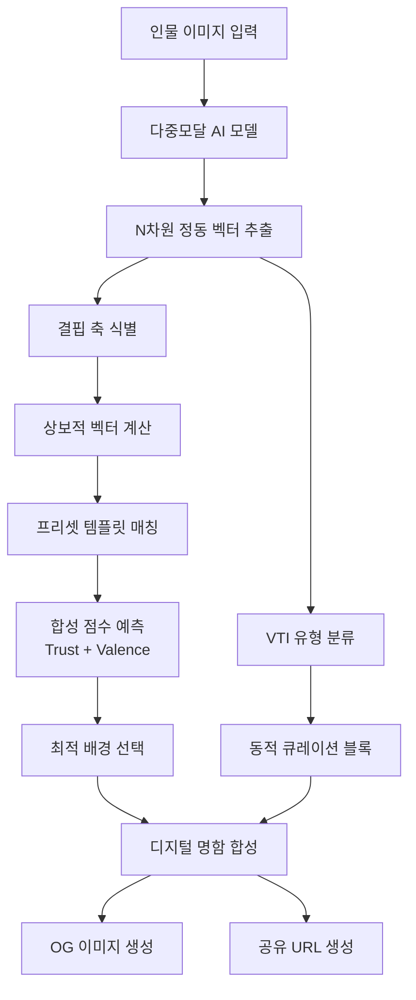
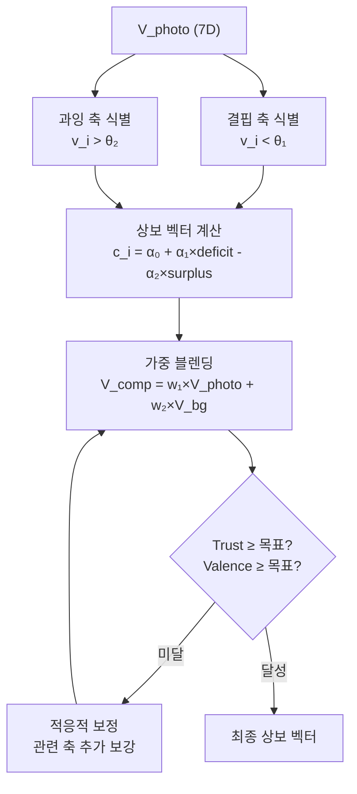

# 특허 명세서 초안 — Vibe AI 모바일 명함 시스템

> **문서 성격**: 특허 출원용 명세서 초안 (변리사 검토 전 단계)
> **출원인**: [사업자 정보]
> **작성일**: 2026-05-31

---

## 목차

1. [특허 가능성 분석](#1-특허-가능성-분석)
2. [발명 1: 상보적 정동 벡터 기반 프로필 배경 최적화](#2-발명-1)
3. [발명 2: 다차원 정동 벡터-프리셋 템플릿 매칭](#3-발명-2)
4. [발명 3: 동적 큐레이션 융합 디지털 명함 플랫폼](#4-발명-3)
5. [해자성 분석](#5-해자성-분석)
6. [선행기술 회피 전략](#6-선행기술-회피-전략)
7. [출원 전략](#7-출원-전략)

---

## 1. 특허 가능성 분석

### 1.1 발명의 핵심 신규성 (Novelty)

| 요소 | 기존 기술 | 본 발명 | 신규성 |
|------|----------|--------|--------|
| 프로필 사진 분석 | 얼굴 인식, 감정 분류 (discrete) | **7차원 연속 정동(Affect) 벡터** 추출 | ✅ 높음 |
| 명함 배경 선택 | 사용자 수동 선택 / 랜덤 | **상보적 벡터 계산** → 자동 최적 매칭 | ✅ 매우 높음 |
| 합성 점수 | 없음 | 사진+배경 **가중 블렌딩 → Valence·Trust 극대화** | ✅ 매우 높음 |
| 템플릿 매칭 | 카테고리 필터 / 키워드 | **코사인 유사도 기반 벡터 공간 매칭** | ✅ 높음 |
| 명함+실적 결합 | 정적 명함 + 별도 포트폴리오 | **동적 큐레이션 블록** 실시간 융합 | ✅ 높음 |

### 1.2 진보성 (Inventive Step) 핵심 논거

> **핵심 진보성**: "이미지에서 추출한 다차원 정동 벡터의 **결핍 축(deficient axis)을 식별**하여, 해당 축을 보강하는 **상보적 시각 자극(배경)**을 자동 선택함으로써, 인간 관찰자가 인지하는 **합성 신뢰감(Trust)과 정서가(Valence)를 동시에 극대화**하는 것"은 당업자가 선행기술의 조합만으로 용이하게 도출할 수 없다.

**이유**:
1. **역문제(Inverse Problem) 접근**: 목표 점수(Trust, Valence)에서 역으로 결핍 축을 식별하는 것은 단순 유사 매칭과 질적으로 다르다
2. **교차 모달 최적화**: 인물 사진(포토그래피 도메인)과 그래픽 배경(디자인 도메인) 간의 정동 합성은 선행기술에 없다
3. **산업 특화 VAD 변환**: 심리학 VAD 모델을 상업용 부동산 중개인 신뢰도로 변환하는 가중치 체계는 새로운 것이다

### 1.3 산업상 이용가능성

- 부동산 중개인 마케팅
- 비즈니스 프로필 카드 (LinkedIn, 명함 앱)
- 매칭 플랫폼 (구인구직, 프리랜서 마켓)
- 브랜드 크리에이티브 최적화 (광고, SNS 프로필)

---

## 2. 발명 1: 상보적 정동 벡터 기반 프로필 배경 최적화 {#2-발명-1}

### 【발명의 명칭】

**다차원 정동 벡터의 상보적 시각 자극 합성을 통한 디지털 프로필 이미지 최적화 방법 및 시스템**

### 【기술 분야】

본 발명은 디지털 프로필 이미지 처리에 관한 것으로, 구체적으로는 인물 이미지에서 다차원 정동(Affect) 벡터를 추출하고, 해당 벡터의 결핍 축을 보강하는 상보적 배경 시각 자극을 자동 선택하여, 관찰자가 인지하는 합성 인상의 신뢰성과 호감도를 극대화하는 방법 및 시스템에 관한 것이다.

### 【배경기술】

종래의 디지털 프로필 또는 명함 생성 시스템은 사용자가 미리 정해진 템플릿 카테고리에서 수동으로 배경을 선택하거나, AI가 텍스트 프롬프트 기반으로 배경 이미지를 생성하는 방식을 사용한다.

그러나 이러한 종래 기술은 다음의 한계를 갖는다:
1. 인물 사진이 전달하는 정서적 인상과 배경이 전달하는 정서적 인상 간의 **정동적 조화(Affective Harmony)**를 고려하지 않는다
2. 인물 사진이 특정 정동 축에서 결핍을 보일 때, 이를 **정량적으로 식별하고 보강**하는 메커니즘이 없다
3. 합성된 프로필 이미지가 관찰자에게 전달하는 **신뢰감(Trust)**과 **정서가(Valence)**를 측정하고 최적화하는 수단이 없다

### 【해결하고자 하는 과제】

본 발명은 인물 이미지의 다차원 정동 프로파일을 분석하여, 해당 프로파일의 결핍 축을 자동으로 식별하고, 이를 보강하는 상보적 시각 자극(배경 디자인)을 선택함으로써, 합성 프로필의 관찰자 인지 신뢰도와 호감도를 극대화하는 방법 및 시스템을 제공하는 것을 목적으로 한다.

### 【과제의 해결 수단】

#### (핵심 방법 — 청구항 1 대응)

상기 과제를 해결하기 위해, 본 발명은 다음 단계를 포함하는 디지털 프로필 이미지 최적화 방법을 제공한다:

**(a) 다차원 정동 벡터 추출 단계**: 입력된 인물 이미지를 다중모달 인공지능 모델(Multimodal AI Model)에 입력하여, N차원 정동 벡터 V_photo = (v₁, v₂, ..., v_N)을 추출하되, 각 차원 v_i ∈ [0, 1]은 미리 정의된 정동 축(Affect Axis)에 대한 강도를 나타냄

**(b) 결핍 축 식별 단계**: 상기 정동 벡터 V_photo의 각 차원 v_i에 대해, 미리 설정된 임계값 θ_deficit과 비교하여, v_i < θ_deficit인 차원을 결핍 축(Deficient Axis)으로 식별함

**(c) 상보적 벡터 계산 단계**: 상기 결핍 축의 결핍 정도에 비례하여 보강 가중치를 부여하고, 과잉 축(v_i > θ_surplus)에 대해서는 억제 가중치를 부여하여, 상보적 정동 벡터 V_comp = (c₁, c₂, ..., c_N)을 계산하되, 각 c_i는 다음에 의해 결정됨:

```
c_i = α₀ + α₁ × max(0, θ_deficit - v_i) - α₂ × max(0, v_i - θ_surplus)
```

여기서 α₀, α₁, α₂는 미리 설정된 계수

**(d) 합성 점수 예측 단계**: 상기 인물 이미지의 정동 벡터 V_photo와 후보 배경의 정동 벡터 V_bg를 가중 블렌딩하여 합성 벡터 V_composite를 계산하고, 해당 합성 벡터로부터 목표 인지 점수(신뢰도 Trust, 정서가 Valence)를 예측함:

```
V_composite = w_photo × V_photo + w_bg × V_bg
Trust = Σ(β_i × v_composite_i)  (i ∈ Trust 관련 축)
Valence = Σ(γ_i × v_composite_i)  (i ∈ Valence 관련 축)
```

**(e) 최적 배경 선택 단계**: 복수의 후보 배경 각각에 대해 상기 (d) 단계를 수행하고, Trust + Valence의 합산 점수가 최대인 배경을 최적 배경으로 선택함

**(f) 합성 프로필 생성 단계**: 상기 인물 이미지와 선택된 최적 배경을 합성하여 디지털 프로필 이미지를 생성함

### 【청구범위】

#### 독립항

> **[청구항 1]**
> 컴퓨터로 구현되는 디지털 프로필 이미지 최적화 방법으로서:
>
> (a) 프로세서가, 입력된 인물 이미지를 다중모달 인공지능 모델에 입력하여, N차원 정동 벡터(Affect Vector)를 추출하는 단계 — 상기 N차원 정동 벡터의 각 차원은 미리 정의된 정동 축에 대한 강도값을 나타내며, 상기 정동 축은 따뜻함(warmth), 활력(energy), 세련됨(polish), 진정성(authenticity), 전통성(heritage), 혁신성(futurism), 유쾌함(playfulness) 중 적어도 5개를 포함함;
>
> (b) 상기 프로세서가, 상기 추출된 정동 벡터의 각 차원값을 제1 임계값과 비교하여 결핍 축을 식별하고, 제2 임계값과 비교하여 과잉 축을 식별하는 단계;
>
> (c) 상기 프로세서가, 상기 결핍 축에 대해서는 결핍 정도에 비례하는 보강 가중치를, 상기 과잉 축에 대해서는 과잉 정도에 비례하는 억제 가중치를 적용하여, 상보적 정동 벡터(Complementary Affect Vector)를 계산하는 단계;
>
> (d) 상기 프로세서가, 상기 인물 이미지의 정동 벡터와 복수의 후보 배경 각각의 정동 벡터를 미리 정해진 가중치로 블렌딩하여 합성 정동 벡터를 생성하고, 상기 합성 정동 벡터로부터 신뢰도 점수 및 정서가 점수를 산출하는 단계; 및
>
> (e) 상기 프로세서가, 상기 신뢰도 점수와 상기 정서가 점수의 합산값이 최대인 후보 배경을 선택하여, 상기 인물 이미지와 합성된 디지털 프로필 이미지를 생성하는 단계
>
> 를 포함하는, 디지털 프로필 이미지 최적화 방법.

#### 종속항

> **[청구항 2]**
> 제1항에 있어서, 상기 (c) 단계의 상보적 정동 벡터 c_i의 각 차원은:
> c_i = α₀ + α₁ × max(0, θ₁ - v_i) - α₂ × max(0, v_i - θ₂)
> 에 의해 계산되는 것을 특징으로 하는 방법.
> (α₀은 기저값, α₁은 보강 계수, α₂는 억제 계수, θ₁은 결핍 임계값, θ₂는 과잉 임계값)

> **[청구항 3]**
> 제1항에 있어서, 상기 (d) 단계의 블렌딩은:
> V_composite = w₁ × V_photo + w₂ × V_bg (w₁ + w₂ = 1)
> 로 수행되되, w₂ > w₁인 것을 특징으로 하는 방법.
> (배경이 인물보다 더 넓은 시각적 면적을 점유하므로 배경에 더 높은 가중치를 부여)

> **[청구항 4]**
> 제1항에 있어서, 상기 신뢰도 점수(Trust)는:
> Trust = β₁×polish + β₂×heritage + β₃×authentic + β₄×energy
> 로 산출되며, 여기서 β₁ > β₂ > β₃ > β₄인 것을 특징으로 하는 방법.

> **[청구항 5]**
> 제1항에 있어서, 상기 정서가 점수(Valence)는:
> Valence = γ₁×warmth + γ₂×playful + γ₃×authentic
> 로 산출되는 것을 특징으로 하는 방법.

> **[청구항 6]**
> 제1항에 있어서, 상기 (a) 단계에서:
> 상기 N차원 정동 벡터를 미리 정의된 K개의 프로토타입 정동 벡터와 코사인 유사도를 비교하여, 최고 유사도를 갖는 프로토타입에 대응하는 정동 유형 지표(Vibe Type Indicator)를 추가로 분류하는 것을 특징으로 하는 방법.

> **[청구항 7]**
> 제1항에 있어서, 상기 (d) 단계에서:
> 상기 합성 정동 벡터의 내적 일관성(Coherence)을 추가로 계산하되, 상기 일관성은:
> 프로토타입 유사도 × 제1 가중치 + 분산 적절성 × 제2 가중치 + 극단값 부재 × 제3 가중치
> 로 산출되는 것을 특징으로 하는 방법.

> **[청구항 8]**
> 제1항에 있어서, 상기 (c) 단계 이후에:
> 합성 벡터의 정서가 점수가 목표 정서가에 미달하는 경우, 정서가 관련 축(warmth, playful, authentic)의 보강 가중치를 추가 조정하는 적응적 보정 단계를 더 포함하는 것을 특징으로 하는 방법.

> **[청구항 9]**
> 제1항에 있어서, 상기 N차원 정동 벡터로부터 VAD(Valence-Arousal-Dominance) 3차원 정동 좌표를 역추정하되:
> - valence = a₁×warmth + a₂×playful + a₃×authentic
> - arousal = b₁×energy + b₂×futuristic - b₃×heritage
> - dominance = c₁×polish + c₂×futuristic + c₃×authentic
> 로 변환하는 것을 특징으로 하는 방법.

> **[청구항 10]**
> 제1항 내지 제9항 중 어느 한 항의 방법을 수행하기 위한 프로그램이 기록된 컴퓨터 판독 가능 기록매체.

> **[청구항 11]**
> 인물 이미지를 입력받는 입력부;
> 상기 인물 이미지로부터 N차원 정동 벡터를 추출하는 정동 분석부;
> 상기 정동 벡터의 결핍 축을 식별하고 상보적 정동 벡터를 계산하는 상보 연산부;
> 복수의 후보 배경과 합성 점수를 산출하여 최적 배경을 선택하는 매칭부; 및
> 상기 인물 이미지와 최적 배경을 합성하여 디지털 프로필을 생성하는 합성부
> 를 포함하는, 디지털 프로필 이미지 최적화 시스템.

---

## 3. 발명 2: 다차원 정동 벡터-프리셋 템플릿 매칭 {#3-발명-2}

### 【발명의 명칭】

**정동 벡터 공간에서의 코사인 유사도 기반 시각 디자인 템플릿 매칭 방법 및 시스템**

### 【기술 분야】

본 발명은 다차원 정동 벡터를 이용한 시각 디자인 자동 매칭에 관한 것으로, 구체적으로는 각각 고유한 정동 벡터가 사전 할당된 복수의 디자인 템플릿을 벡터 공간에 배치하고, 목표 정동 벡터와의 코사인 유사도를 기반으로 최적 템플릿을 실시간 매칭하는 방법에 관한 것이다.

### 【해결하고자 하는 과제】

종래 AI 기반 디자인 생성 시스템은 매번 생성 모델(예: Diffusion Model, GAN)을 호출하여 새로운 배경을 생성하므로, 높은 연산 비용(추론 1회당 200~500원)과 일관성 없는 품질이 문제된다. 본 발명은 사전 정의된 프리셋 템플릿에 정동 벡터를 할당하고, 순수 수학 연산(코사인 유사도)만으로 매칭함으로써, AI 추론 비용을 90% 이상 절감하면서도 정동적으로 최적화된 디자인을 제공한다.

### 【청구범위】

> **[청구항 12]**
> 컴퓨터로 구현되는 시각 디자인 템플릿 매칭 방법으로서:
>
> (a) 각각 고유한 N차원 정동 벡터 및 시각 디자인 속성 세트(색상 그라디언트, 액센트 색상, 서체, 테두리 스타일을 포함)를 갖는 복수의 프리셋 디자인 템플릿을 메모리에 저장하는 단계 — 상기 복수의 프리셋 템플릿은 K개의 정동 유형 분류 각각에 대해 M개의 변형을 포함하여 총 K×M개로 구성됨;
>
> (b) 목표 정동 벡터를 수신하는 단계;
>
> (c) 상기 목표 정동 벡터와 상기 복수의 프리셋 템플릿 각각의 정동 벡터 간의 코사인 유사도를 계산하는 단계; 및
>
> (d) 상기 코사인 유사도가 높은 순으로 상위 P개의 프리셋 템플릿을 추천하는 단계
>
> 를 포함하되, 상기 (c)~(d) 단계는 인공지능 추론 모델을 호출하지 않고 순수 수학 연산만으로 수행되는 것을 특징으로 하는, 시각 디자인 템플릿 매칭 방법.

> **[청구항 13]**
> 제12항에 있어서, 상기 (d) 단계에서의 추천 순위는:
> 1차 순위: 상기 목표 정동 벡터와의 코사인 유사도 기반 합성 점수(Trust + Valence)의 합산값이 높은 순;
> 2차 순위(동점 시): 코사인 유사도가 높은 순
> 으로 결정되는 것을 특징으로 하는 방법.

> **[청구항 14]**
> 제12항에 있어서, 상기 목표 정동 벡터는:
> 별도의 인물 이미지 분석 모듈이 인물 이미지로부터 추출한 인물 정동 벡터에 대해, 결핍 축 보강 및 과잉 축 억제를 적용하여 계산된 상보적 정동 벡터인 것을 특징으로 하는 방법.

> **[청구항 15]**
> 제12항에 있어서, 상기 각 프리셋 템플릿의 시각 디자인 속성 세트는:
> CSS(Cascading Style Sheets) 변수 형태로 저장되며, 적어도 배경 그라디언트, 텍스트 색상, 보조 텍스트 색상, 테두리 색상, 발광 효과(glow), 뱃지 배경색, 서체군을 포함하는 것을 특징으로 하는 방법.

> **[청구항 16]**
> 제12항에 있어서, 상기 추천된 P개의 프리셋 템플릿 각각에 대해:
> 인물 이미지의 정동 벡터와 해당 템플릿의 정동 벡터를 가중 블렌딩한 합성 점수(Trust, Valence, Coherence)를 실시간으로 계산하여 사용자에게 표시하는 단계를 더 포함하는 것을 특징으로 하는 방법.

---

## 4. 발명 3: 동적 큐레이션 융합 디지털 명함 플랫폼 {#4-발명-3}

### 【발명의 명칭】

**정동 프로파일 기반 시각 최적화 및 실시간 활동 데이터 큐레이션이 융합된 디지털 명함 생성·공유 방법 및 시스템**

### 【기술 분야】

본 발명은 디지털 명함 플랫폼에 관한 것으로, 인물의 정동 프로파일에 기반한 시각 디자인 자동 최적화와, 상기 인물의 실시간 직무 활동 데이터를 동적으로 큐레이션하여 하나의 공유 가능한 디지털 명함으로 통합하는 방법에 관한 것이다.

### 【해결하고자 하는 과제】

기존 디지털 명함은 정적 정보(이름, 연락처, 직함)만을 담고 있어, (1) 명함 수신자에게 전문성에 대한 신뢰를 형성하기 어렵고, (2) 명함 소유자의 최신 활동·실적을 반영하지 못하며, (3) 명함을 통한 플랫폼 유입 경로가 없다. 본 발명은 정동 기반 시각 최적화와 동적 데이터 큐레이션을 결합하여, 명함 자체가 "살아있는 포트폴리오"이자 "유입 퍼널"로 기능하게 한다.

### 【청구범위】

> **[청구항 17]**
> 컴퓨터로 구현되는 디지털 명함 생성 및 공유 방법으로서:
>
> (a) 사용자의 인물 이미지로부터 다차원 정동 벡터를 추출하고, 상기 정동 벡터의 결핍 축을 보강하는 시각 디자인 템플릿을 자동 선택하여, 정동적으로 최적화된 디지털 명함 프레임을 생성하는 단계;
>
> (b) 상기 사용자와 연관된 복수의 데이터 소스로부터 직무 활동 데이터를 실시간으로 수집하여, 상기 디지털 명함 프레임 내에 동적 큐레이션 블록으로 삽입하는 단계 — 상기 직무 활동 데이터는 거래 건수, 전문 영역, 전문가 기고, 커뮤니티 활동 중 적어도 2개를 포함함;
>
> (c) 상기 디지털 명함에 대해 고유 URL을 생성하고, 소셜 미디어 공유 시 상기 시각 디자인 템플릿의 색상 및 정동 유형을 반영한 미리보기 이미지(OG Image)를 동적으로 생성하는 단계; 및
>
> (d) 상기 고유 URL을 통해 접근하는 수신자에게, 상기 큐레이션 블록 내의 링크를 통해 상기 사용자의 세부 콘텐츠(거래 상세, 전문가 상담 요청, 커뮤니티 답변 이력)로의 심층 탐색 경로를 제공하는 단계
>
> 를 포함하는, 디지털 명함 생성 및 공유 방법.

> **[청구항 18]**
> 제17항에 있어서, 상기 (b) 단계의 동적 큐레이션 블록은:
> 상기 고유 URL에 접근할 때마다 최신 데이터로 갱신되어, 수신자의 반복 방문을 유도하는 것을 특징으로 하는 방법.

> **[청구항 19]**
> 제17항에 있어서, 상기 (c) 단계의 미리보기 이미지는:
> 서버 사이드 렌더링(SSR)을 통해, 상기 인물 이미지를 정동 유형 색상의 코닉 그라디언트 링으로 둘러싸고, 상기 시각 디자인 템플릿의 배경 그라디언트를 적용하여, 소셜 미디어 플랫폼의 링크 미리보기 영역에 표시되는 것을 특징으로 하는 방법.

> **[청구항 20]**
> 제17항에 있어서, 상기 사용자의 정동 유형에 기반하여:
> 인공지능 언어 모델이 상기 사용자의 직무 활동 데이터와 정동 특성을 결합한 개인화된 캐치프레이즈를 생성하고, 상기 디지털 명함에 삽입하는 단계를 더 포함하는 것을 특징으로 하는 방법.

> **[청구항 21]**
> 제17항에 있어서:
> 상기 디지털 명함에 정동 일관성(Coherence) 점수 및 정동 유형에 기반한 신뢰 등급(Trust Seal)을 표시하되, 상기 신뢰 등급은 정동 벡터의 내적 일관성, 직무 활동 실적, 플랫폼 인증 여부를 종합하여 S/A/B/C 등급으로 분류되는 것을 특징으로 하는 방법.

---

## 5. 해자성(Moat) 분석 {#5-해자성-분석}

### 5.1 기술적 해자 (Technical Moat)

| 해자 요소 | 강도 | 설명 |
|----------|------|------|
| **7D 정동 벡터 체계** | ★★★★★ | Aaker(1997) + Russell(1980) + Mehrabian VAD를 독자적으로 조합한 7축 체계. 축 정의·가중치·프로토타입이 실험적으로 튜닝됨 |
| **상보 벡터 알고리즘** | ★★★★★ | 결핍/과잉 판별 → 보강/억제 → 적응적 보정의 3단계 연산. 이 특정 조합은 선행기술에 없음 |
| **32개 프리셋 벡터 DB** | ★★★★☆ | 각 템플릿에 7D 벡터가 수동 할당되어 있어, 후발자는 동일한 벡터 공간을 재구축해야 함 |
| **VAD ↔ Trust/Valence 변환** | ★★★★☆ | 심리학 VAD 모델을 산업 특화 KPI로 변환하는 가중치 체계가 노하우 |
| **비용 구조** | ★★★★★ | AI 추론 1회 + 순수 연산 = 건당 15원. 후발자가 동등 품질을 내려면 이 체계를 모방해야 함 |

### 5.2 데이터 해자 (Data Moat)

| 요소 | 설명 |
|------|------|
| **사진-벡터 쌍 학습 데이터** | 축적될수록 VTI 분류 정밀도 향상 |
| **템플릿 선택 패턴** | 사용자 선택 로그 → 상보 알고리즘 가중치 개선 |
| **합성 점수 ↔ 실제 전환률** | "Trust 0.82인 명함이 상담 요청 전환률 12%" 같은 인과 데이터 |
| **산업 특화 프로토타입** | CRE 도메인에서 어떤 VTI가 높은 Trust를 받는지 경험 축적 |

### 5.3 네트워크 해자 (Network Moat)

```
[중개인 A가 Vibe AI 명함 생성]
  → [건물주 B에게 카카오톡 공유]
  → [B가 명함 열람 → "나도 이런 명함 갖고 싶다"]
  → [B가 매수 의향서 작성 → DealCard 가입]
  → [B가 자기 중개인 C에게 DealCard 추천]
  → [C가 Vibe AI 명함 생성]
  → ...반복...
```

명함 자체가 플랫폼의 **유입 퍼널**이자 **바이럴 루프**로 기능 → 사용자 수가 늘수록 명함 노출 증가 → 가입 증가 → 양면 네트워크 효과

---

## 6. 선행기술 회피 전략 {#6-선행기술-회피-전략}

### 6.1 잠재적 선행기술

| 선행기술 | 차이점 |
|----------|--------|
| **Canva / Adobe Express 프로필 템플릿** | 카테고리 수동 선택. 정동 벡터 분석 없음. 상보적 매칭 없음 |
| **LinkedIn 프로필 사진 분석** | 얼굴 구도/밝기만 분석. 7D 정동 벡터 추출 없음. 배경 매칭 없음 |
| **감정 인식 AI (Affectiva, Hume AI)** | 이산 감정(6~8개 카테고리) 분류. 연속 7D 벡터 아님. 상보적 보강 없음 |
| **컬러 심리학 기반 디자인 (Color Psychology)** | 단일 축(색상→감정). 7D 벡터 공간 아님. 합성 점수 최적화 없음 |
| **AI 명함 앱 (HiHello, Haystack)** | 정적 정보만. 정동 분석 없음. 동적 큐레이션 없음 |
| **Vibe Check 앱** | 주관적 설문 기반. 이미지 분석 없음. 상보적 시각 자극 없음 |

### 6.2 회피 설계 핵심 포인트

1. **"상보적(Complementary)" 개념**: 유사 매칭이 아닌 **결핍 보강**이라는 역문제 접근
2. **"합성 점수 예측"**: 단순 매칭이 아닌 **두 시각 자극의 블렌딩 결과를 예측**하는 것
3. **"적응적 보정"**: 목표 점수 미달 시 관련 축만 추가 조정하는 피드백 루프
4. **"정동 벡터 공간에서의 프리셋 매칭"**: AI 생성 모델을 사용하지 않고 **사전 할당 벡터의 수학적 매칭**

---

## 7. 출원 전략 {#7-출원-전략}

### 7.1 권장 출원 구조

| 출원 | 청구항 | 보호 범위 | 우선순위 |
|------|--------|----------|---------|
| **출원 1** (발명 1) | 청구항 1~11 | 상보적 정동 벡터 핵심 알고리즘 | ★★★★★ 최우선 |
| **출원 2** (발명 2) | 청구항 12~16 | 프리셋 벡터 매칭 (비용 최적화) | ★★★★☆ |
| **출원 3** (발명 3) | 청구항 17~21 | 동적 큐레이션 융합 명함 | ★★★☆☆ |

> [!IMPORTANT]
> **출원 1이 해자의 핵심**입니다. "상보적 정동 벡터 계산"은 가장 모방하기 어렵고, 회피 설계도 가장 어려운 요소입니다. 이 출원만이라도 조속히 진행하는 것을 권장합니다.

### 7.2 국제 출원 고려

| 관할권 | 이유 | 비용 (대략) |
|--------|------|------------|
| 🇰🇷 한국 특허청 | 본국 출원, 최저 비용 | 200~400만원 |
| 🇺🇸 USPTO (미국) | AI 특허 가치 극대화, 투자 유치 시 필요 | 500~1000만원 |
| PCT 국제출원 | 30개월 내 개별 국가 진입 결정 유예 | 300~500만원 |

### 7.3 출원 전 체크리스트

- [ ] 발명자 확정 (공동 발명자 여부)
- [ ] 선행기술 조사 (KIPRIS, Google Patents, USPTO)
- [ ] 실험 데이터 확보 (사진 N장 → 상보 배경 적용 전/후 Trust 점수 비교)
- [ ] 변리사 선정 (AI/소프트웨어 특허 전문)
- [ ] 임시출원(Provisional) 여부 결정 (미국 출원 시)
- [ ] 영업비밀 보호 범위 결정 (가중치 계수 등은 청구범위에 포함하되, 구체적 수치는 명세서에만 기재)

### 7.4 영업비밀 보호 대상 (특허 공개에서 제외)

> [!WARNING]
> 다음은 특허 명세서에 **구체적 수치를 기재하지 않고** 변수 형태로만 기재할 것:

| 항목 | 이유 |
|------|------|
| α₀, α₁, α₂ 구체적 수치 (0.50, 1.2, 0.4) | 모방 난이도 증가 |
| θ_deficit, θ_surplus 임계값 (0.65, 0.85) | 실험적 최적값이므로 영업비밀 |
| w_photo, w_bg 블렌딩 가중치 (0.40, 0.60) | 경험적 최적값 |
| β, γ 계수의 구체적 값 | 산업 특화 노하우 |
| VTI 프로토타입 벡터 7개의 구체적 좌표 | 핵심 데이터 자산 |
| 32개 템플릿의 개별 정동 벡터 | 축적된 디자인 노하우 |

---

## 부록: 도면 설명

### [도 1] 전체 시스템 구성도



### [도 2] 상보적 벡터 계산 흐름도



### [도 3] 7D 정동 벡터 시각화 (상보 전/후 비교)

```
보강 전 (인물 사진만):           보강 후 (인물 + 상보 배경):
warmth     ████████░░  0.60     warmth     ████████░░  0.62
energy     ███░░░░░░░  0.30     energy     ██████░░░░  0.55 ↑
polish     ████████░░  0.80     polish     ████████░░  0.82
authentic  █████░░░░░  0.50     authentic  █████░░░░░  0.55
heritage   █████████░  0.95     heritage   ████████░░  0.75 ↓
futuristic ██░░░░░░░░  0.15     futuristic █████░░░░░  0.48 ↑↑
playful    ███░░░░░░░  0.25     playful    ████░░░░░░  0.40 ↑

Trust:    0.76 → 0.82 (+7.9%)
Valence:  0.42 → 0.58 (+38.1%)
```

### [도 4] 프리셋 템플릿 벡터 공간 배치

```
K=7 정동 유형 × M=4~5 변형 = 32개 프리셋
각 프리셋 = (ID, 7D 벡터, CSS 변수 세트)

벡터 공간에서 목표 상보 벡터와의 코사인 유사도로 매칭:
  similarity(V_target, V_template) = (V_target · V_template) / (|V_target| × |V_template|)
```
