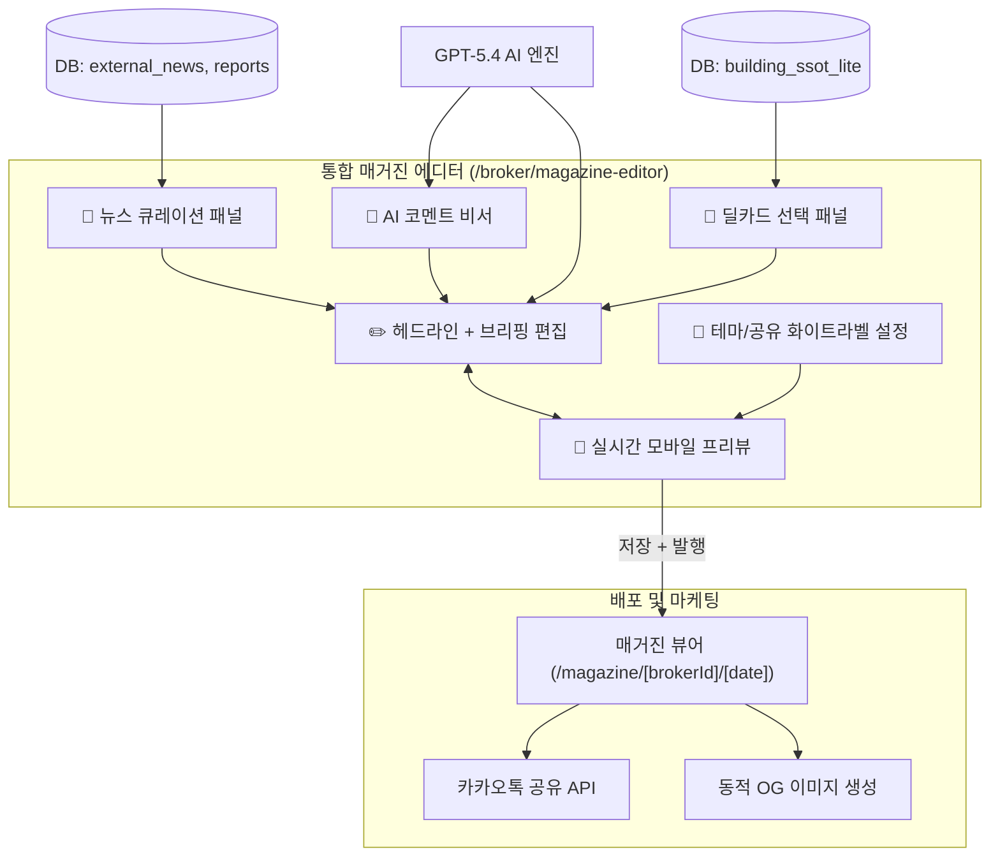

# 📰 개인 맞춤 매거진 (통합 에디터) 표준 스펙 및 작성 방법론

## 1. 시스템 개요 및 목적

**개인 맞춤 매거진(Personalized Magazine)**은 CRE(상업용 부동산) 중개인이 자신의 고객(건물주, 매수자, 임차인)에게 매일/매주 발송할 수 있는 **초개인화된 시장 분석 및 매물 큐레이션 웹 리포트**입니다. 기존 스튜디오 기능이 "매거진 통합 에디터"로 흡수되어, 브로커는 **1분 이내에 자신만의 프리미엄 브랜드가 입혀진 전문 뉴스레터를 발행 및 카카오톡으로 공유**할 수 있습니다.

- **URL 구조**: 
  - 에디터: `/broker/magazine-editor`
  - 퍼블릭 뷰어: `/magazine/[brokerId]/[date]`
- **핵심 가치**: 중개인의 전문성 시각화 (개인 브랜딩), 고객 리텐션 강화, 자동화된 마케팅 콘텐츠 무한 공급 (AI-Driven Marketing).

---

## 2. 매거진 통합 아키텍처

---

## 3. 11개 섹션 구성 및 작성 방법론

매거진 뷰어(`magazine-view.tsx`)는 11개의 주요 모듈식 섹션으로 구성되며, 브로커의 선택 및 데이터 유무에 따라 유연하게 렌더링(SectionVisibility)됩니다.

| 순서 | 섹션 ID | 섹션명 | 구성 데이터 및 작성 방법론 (정보 수집 & AI 증강) |
|---|---|---|---|
| 1 | `hero` | **히어로 헤더** | • **데이터**: 브로커 프로필(이름, 태그라인, 전문분야) + 발행일자 + Key Stats • **작성법**: `broker_profiles`에서 브로커 데이터를 가져오고, AI가 권역에 맞춰 생성한 헤드라인을 표시합니다. 화이트라벨 테마 컬러(Accent)가 적용됩니다. |
| 2 | `ai_briefing` | **AI 마켓 에디터 브리핑** | • **데이터**: 뉴스, 거래동향, 센티먼트를 종합한 LLM 프롬프트의 결과물 • **작성법**: `RichBriefing` 컴포넌트를 통해 생성되며, 숫자/퍼센트는 하이라이트 되도록 정규식(Regex)을 통해 시각적 증강 처리가 적용됩니다. |
| 3 | `broker_comment` | **브로커 인사이트** | • **데이터**: 에디터에서 중개인이 입력하거나 "AI 코멘트 비서"로 확장한 텍스트 • **작성법**: 중개인의 짧은 메모를 AI가 전문적인 톤앤매너로 확장하여 보라색(`violet`) 테마의 박스에 삽입합니다. |
| 4 | `action_list` | **오늘의 추천 액션** | • **데이터**: AI가 제안하는 1~3개의 행동 지침 • **작성법**: 시장 상황(예: 강세장/약세장)에 맞춰 건물주나 매수자가 취해야 할 즉각적인 액션을 넘버링 리스트로 제공합니다. |
| 5 | `market_data` | **시장 데이터** | • **데이터**: 실거래(`external_transactions`), 임대동향(`rental_trend_data`), 상권분석(`commercial_district`) • **작성법**: 공공데이터(MOLIT 등)를 시각화하며 `SectionCard` 컴포넌트를 통해 접기/펼치기 UI로 제공하여 공간 효율을 높입니다. |
| 6 | `deal_highlights` | **관리 매물 하이라이트** | • **데이터**: 브로커의 보유 활성 매물(`building_ssot_lite`) • **작성법**: 가로 스와이프(Snap-x)가 가능한 PhotoGallery 패턴으로 렌더링. 사진이 없으면 그라데이션 폴백을 적용하고, '관심 고객 수' 배지를 통해 매물의 희소성을 강조합니다. |
| 7 | `sentiment_index` | **CRE 투자자 심리 지수** | • **데이터**: `social_sentiment`의 분석 스코어 (0~100) • **작성법**: Fear & Greed 게이지 UI를 사용합니다. 점수에 따라 바 색상(빨강/초록/파랑)이 동적으로 변환되며, 애니메이션 게이지바가 적용됩니다. |
| 8 | `news` | **오늘의 CRE 뉴스** | • **데이터**: 네이버/기타 API 기반의 `external_news` • **작성법**: 최신순/중요도순으로 최대 6개 기사를 노출합니다. AI가 분석한 기사 성격(bullish/bearish)에 따라 🔴🟢 닷(Dot) 배지를 추가해 직관성을 높입니다. |
| 9 | `auction_picks` | **이 주의 경매 픽** | • **데이터**: `auction_listings` NPL 데이터 • **작성법**: 감정가 대비 할인율을 프로그레스 바로 시각화하여 투자 매력도를 즉각적으로 보여줍니다. |
| 10 | `reports` | **전문 리서치 리포트** | • **데이터**: `external_reports` • **작성법**: 외부 기관 리서치의 제목과 요약을 리스팅하고 원본 링크(`url`)로 아웃바운드 라우팅합니다. |
| 11 | `broker_profile` | **브로커 프로필 & 하단 CTA** | • **데이터**: 누적 거래 수, 활성 매물 수, 전문 자산, 연락처 • **작성법**: 매거진 최하단에 브로커의 신뢰도를 입증하는 스탯을 나열하고, 화면을 스크롤해도 항상 고정되는 **하단 네비게이션 바(전화걸기 & 카톡공유)**를 배치합니다. |

---

## 4. 섹션별 예상 문제점 및 개선/고품질화 방안

| 섹션 | 예상 문제점 (Risk / Pain Points) | 보완 및 고품질화 향상 방안 (Action Items) |
|---|---|---|
| **1. 헤더 & 브리핑** | • 데이터가 부족한 권역일 경우 AI 브리핑이 환각(Hallucination)을 일으키거나 모호한 소리만 반복할 수 있음. | • **RAG 기반 프롬프트 강화**: 프롬프트 생성 시 해당 권역의 실거래 건수, 뉴스 팩트를 반드시 Context에 주입하여 "구체적인 수치"가 강제되도록 개선. |
| **2. 브로커 코멘트** | • 중개인이 에디터에서 코멘트 작성 자체를 귀찮아하여 빈칸으로 발행되는 경우가 잦음. | • **AI 넛지(Nudge)**: 에디터 진입 시 AI가 미리 "오늘 강남 꼬마빌딩 문의가 많네요. 이 내용을 코멘트로 쓸까요?" 형태의 3가지 초안 버튼을 선제 제시. |
| **3. 매물 하이라이트** | • 신입 브로커의 경우 본인 보유 활성 매물이 0건이라 이 섹션이 비어버려 매거진의 매력도가 떨어짐. | • **시장 평균 / 공공 데이터 폴백**: 내 매물이 없을 경우, 해당 권역의 "최근 국토부 실거래가 신고 매물" 또는 "매칭 네트워크 공동중개 허용 매물"로 섹션을 자동 대체. |
| **4. 시장 데이터** | • 공공 데이터(상권, 임대동향) 업데이트 주기가 느려(분기별), 데일리 매거진에서 매일 똑같은 데이터가 노출되어 피로감 발생. | • **동적 순환 로테이션**: 매일 같은 데이터를 보여주지 않고, 월요일(상권), 수요일(임대동향), 금요일(실거래) 식으로 날짜별 포커싱 데이터를 순환 노출. |
| **5. 뉴스 & 리포트** | • 뉴스의 중복(같은 사건을 다룬 여러 언론사 기사) 현상 발생. | • **LLM 기반 클러스터링**: 배치 잡(Batch Job)에서 뉴스를 군집화하여 중복 기사를 통폐합하고 하나의 헤드라인으로 요약 큐레이션. |
| **6. 공유 (Kakao/OG)**| • 링크 공유 시 매일 똑같은 OG 이미지가 나가면 스팸으로 인식될 우려가 있음. | • **동적 OG 이미지 최적화**: `@vercel/og`를 활용, 브리핑 헤드라인과 브로커 얼굴, 오늘의 핵심 차트가 포함된 매일매일 다른 1200x630 이미지를 자동 렌더링. |
| **7. 수신자 개인화** | • 동일한 브로커가 매도인(건물주)과 매수인(투자자)에게 똑같은 내용의 매거진을 보내면 타겟팅 효과가 떨어짐. | • **Audience 분기 기능 (장기)**: 매거진 생성 시 타겟을 [매수자용] / [매도자용]으로 분리. 매수자에게는 '투자 수익률 및 매물', 매도자에게는 '최근 최고가 거래 및 매각 준비도 안내'로 동적 변경. |

---

## 5. 데이터 소스 통합 플로우 (API Route)

`/api/magazine/[brokerId]/route.ts`의 데이터 통합 파이프라인은 아래와 같이 6개의 비동기 데이터베이스 패치를 병렬(`Promise.all`) 처리하여 속도를 극대화합니다.

1. **Broker SSOT**: `broker_profiles`, `profiles`, `building_ssot_lite` (중개인 및 매물 정보)
2. **Market Intelligence API**:
   - `external_news` (중요도 `importance_score` DESC 정렬)
   - `social_sentiment` (가장 최근 시장 감성)
   - `auction_listings` (경매, 날짜 임박순)
   - `external_reports` (리포트, 최신순)
   - `external_transactions` (국토부 실거래가)
   - `rental_trend_data` & `commercial_district` (거시 데이터)
3. **AI Generation (LLM Client)**: 취합된 JSON 데이터를 `callLLM` 함수에 전달, AI가 톤앤매너를 입혀 최종 브리핑 본문, 헤드라인, 액션 리스트를 Markdown 구조로 생성.
4. **Caching Strategy**: 매거진은 하루 단위로 캐싱(`magazine_issues` 테이블에 `issue_date` 기준 저장)되어 브라우저/서버 부하를 막고 일관된 뷰를 제공합니다.

---

## 6. 결론 및 향후 목표

본 "개인 맞춤 매거진" 시스템은 정보의 비대칭성을 해소하는 수단을 넘어, **중개인을 지역 내 최고의 '시장 전문가'로 포지셔닝 해주는 핵심 마케팅 무기**입니다. 현재의 11개 스태틱 섹션 구조에서 나아가, 장기적으로는 고객의 클릭 데이터를 수집하여 "고객이 가장 오래 머문 섹션"을 분석해 다음 호 발행 시 섹션의 우선순위를 재배치하는 **초개인화 자동 편성 아키텍처**로 진화해야 합니다.
