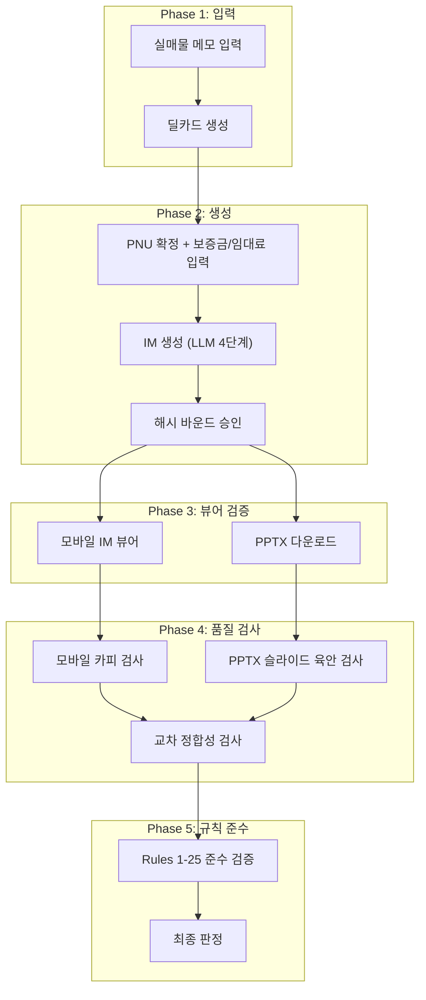

# CRE IM 프로덕션 E2E 테스트 & 카피/육안 검사 체계

> 이 문서는 당산동 115억 전구간 E2E 테스트에서 축적한 교훈을 토대로,
> **실매물 데이터 기반 상용화 수준**의 정밀 워크스루 테스트 프로토콜을 정의합니다.

---

## 1. 테스트 아키텍처 개요



---

## 2. 실매물 테스트 데이터 세트 (5대 포스처 커버리지)

> [!IMPORTANT]
> 각 포스처별 최소 1건의 실매물 데이터로 전구간 E2E를 수행해야 합니다.
> Grade D는 PPTX 생성이 차단되므로 (G30), 최소 Grade C 이상 데이터가 필요합니다.

| # | 포스처 | 테스트 매물 | 메모 핵심 정보 | 예상 Grade |
|---|---|---|---|---|
| TC-01 | **income** (수익형) | 영등포구 당산동 115억 근생빌딩 | 매매가, 월임대료, 보증금, 공실률, 층별 임차인 | B~A |
| TC-02 | **owner_occupied** (사옥형) | 강남구 역삼동 120억 단독사옥 | 매매가, 연면적, 전층 명도 가능, 주차, 엘리베이터 | B~C |
| TC-03 | **development** (개발형) | 서초구 잠원동 242억 2필지 | 토지면적, 용적률, 건폐율, 지목, 용도지역 | B~C |
| TC-04 | **trading** (단기매매형) | 마포구 합정동 45억 근생빌딩 | 매매가, 인근 시세, 감정가, 할인율, 리모델링 이력 | B |
| TC-05 | **operating** (운영형) | 제주시 중문 80억 호텔 | 매매가, 객실수, ADR, OCC, GOP, 운영사 정보 | B |

### 메모 템플릿 (TC-01 예시)
```
영등포구 당산동5가 11-47 호산당빌딩 (근생빌딩)
매매 희망가 115억
지하1층~지상9층 / 1991년 준공 / RC조
대지 476㎡ / 연면적 2,704㎡
공실률 0% / 월 임대료 1,946만원 / 보증금 2.9억
1층 약국+편의점 / 2-3층 학원 / 4-9층 사무실
지하1층 주차장 겸 창고
당산역 2호선·9호선 더블역세권 도보 4분
```

---

## 3. 7단계 E2E 파이프라인 프로토콜

### Phase 1: 메모 → 딜카드 생성

| 단계 | 검증 항목 | 기대 결과 | 타임아웃 |
|---|---|---|---|
| 1.1 | 메모 텍스트 입력 (실매물) | textarea에 정상 입력 | 5s |
| 1.2 | "딜카드 생성" 버튼 클릭 | 로딩 상태 전환 | 2s |
| 1.3 | LLM 3단계 파싱 (MemoParser → MiniTruth → BlindTeaser) | 딜카드 생성 완료 리다이렉트 | 180s |
| 1.4 | 딜카드 페이지 렌더링 | `/broker/deal-card/[id]` URL 확인 | 10s |
| 1.5 | SSoT Lite 검증 | buildingId, posture, askingPrice 존재 | 5s |

**📸 스크린샷**: 메모 입력 전/후, 딜카드 완성 페이지

### Phase 2: IM 생성 + 승인

| 단계 | 검증 항목 | 기대 결과 | 타임아웃 |
|---|---|---|---|
| 2.1 | IM 바텀시트 열기 | 포스처 선택 UI 표시 | 5s |
| 2.2 | PNU 선택 + 재무 데이터 입력 | 필드 정상 채움 | 10s |
| 2.3 | "IM 생성" 버튼 클릭 | 폴링 시작, 진행률 표시 | 5s |
| 2.4 | LLM 4단계 섹션 생성 | "섹션 생성 완료" 텍스트 출현 | 300s |
| 2.5 | im-approval 리다이렉트 | `/broker/im-approval/[id]` | 10s |
| 2.6 | 해시 바운드 승인 (Rule 20) | `computeTargetHash()` 매칭 | 10s |
| 2.7 | 문서 상태 → `published` | Supabase 상태 확인 | 5s |

**📸 스크린샷**: 바텀시트, PNU 선택, 생성 폴링, 승인 페이지

### Phase 3: 모바일 IM 뷰어 검증

| 단계 | 검증 항목 | 기대 결과 |
|---|---|---|
| 3.1 | im-lite 페이지 로드 | 히어로 카드 + 섹션 목록 렌더 |
| 3.2 | 모바일 뷰포트 (390×844) | 반응형 레이아웃 정상 |
| 3.3 | 데스크톱 뷰포트 (1440×900) | 넓은 레이아웃 정상 |
| 3.4 | 전체 스크롤 캡처 | 모든 섹션 가시성 확인 |
| 3.5 | 섹션별 텍스트 추출 | 수치 정합성 기준 데이터 확보 |
| 3.6 | 히어로 카드 지표 확인 | 매매가/수익률/공실률 정상 표시 |
| 3.7 | "생성 시간 초과" 섹션 존재 여부 | 타임아웃 섹션 0건 목표 |

**📸 스크린샷**: 모바일 전체, 데스크톱 전체, 히어로 카드 확대, 각 섹션 개별

### Phase 4: PPTX 다운로드 + 슬라이드 렌더링

| 단계 | 검증 항목 | 기대 결과 |
|---|---|---|
| 4.1 | PPTX 다운로드 버튼 클릭 | 파일 정상 다운로드 (>100KB) |
| 4.2 | LibreOffice → PDF → PNG 변환 | 전매 슬라이드 150 DPI 이미지 생성 |
| 4.3 | OpenXML 무결성 검증 | NaN/undefined/null/[object Object] 0건 |
| 4.4 | 슬라이드 텍스트 JSON 추출 | 전매 텍스트 기계 판독 가능 |
| 4.5 | 슬라이드 매수 확인 | 본문 ≤16매 (부록 제외, Rule 10) |

**📸 스크린샷**: 다운로드 완료, 전체 슬라이드 PNG

### Phase 5: PPTX 슬라이드 육안 검사

| 슬라이드 | 검사 항목 | 합격 기준 |
|---|---|---|
| **Cover** | CREDEAL 로고, 매물 제목, 날짜 | 텍스트 오버플로 없음, 로고 정상 |
| **Summary** | 8칸 그리드 (가격/유형/준공일/규모/구조/대지/연면적) | 모든 필드 값 존재, 면적 중복 없음 |
| **Rent Roll** | 공실률, 월 임대료, 보증금, 연 환산 | 수치 정합, 빈 공간 50% 미만 |
| **Posture 특화** | 포스처별 전용 슬라이드 (DCF/감도분석/GOP/개발계획) | 데이터 바인딩 정상, 플레이스홀더 없음 |
| **Checklist** | 실사 점검 항목 3건 이상 | 마크다운 토큰 누출 없음, 빈 공간 축소 |
| **Closing** | 프로세스 3단계, 데이터 출처 5종, 면책 | 모든 요소 렌더 |
| **Records** | 건축물대장 표제부 | 건물명·용도·구조·면적 정상 |
| **Title** | 등기부등본 요약, 제한물권 | 좌/우 비중복 (Rule 3) |
| **District** | 상권 분석 (SEMAS 데이터) | 상권명 1회만, 지표 정상 |

### Phase 6: 카피 적합성 검사

#### 6.1 수치 정합성 (모바일 IM ↔ PPTX IM)

| 수치 항목 | 검증 방법 |
|---|---|
| 매매가 | 양쪽 일치 확인 |
| 월 임대료 | 양쪽 일치 확인 |
| 보증금 | 양쪽 일치 확인 |
| 연 환산 임대료 | 양쪽 일치 확인 |
| 공실률 | 양쪽 일치 확인 |
| 면적 (대지/연면적) | **중복 표기 없음** (`㎡` 1회만) |
| 준공일 | 양쪽 일치 확인 |
| 건물 규모 | 양쪽 일치 확인 |

#### 6.2 CRE 용어 준수 (Rule 2)

| 금지 패턴 | 올바른 표기 |
|---|---|
| ❌ `네이밍 라이츠` | ✅ `사옥 단독 명칭 표기(간판 설치권)` |
| ❌ `브랜딩 라이츠` | ✅ `기업 단독 브랜딩` |
| ❌ `캡레이트` (단독) | ✅ `연 순수익률 (Cap Rate)` |
| ❌ `GOP` (단독) | ✅ `실질 영업이익 (GOP)` |
| ❌ `TI` / `Rent Free` (단독) | ✅ `인테리어 지원금(TI)` / `렌트프리(무상임대)` |

#### 6.3 페르소나 격리 (Rule 1)

| 금지 패턴 | 검색 정규식 |
|---|---|
| 특정 연령 지칭 | `/(?:60대\|50대\|40대\|70대).*(?:자산가\|투자자)/` |
| 특정 계층 지칭 | `/(?:법인\s*대표\|디벨로퍼\|은퇴).*(?:맞춤\|을 위한)/` |
| 성별 지칭 | `/(?:남성\|여성).*(?:투자자\|매수자)/` |

#### 6.4 비중복 렌더링 (Rule 3)

좌/우 분할 슬라이드(A04, A05)에서 좌측과 우측의 텍스트 항목이 동일하지 않은지 확인.

### Phase 7: 포스처별 특화 검증

| 포스처 | 필수 검증 지표 | 포스처 전용 슬라이드 |
|---|---|---|
| income | 임대수익률, NOI, WALE, 렌트롤 | Rent Roll, Stacking Plan, DCF |
| owner_occupied | 자가 절감액, 손익분기, 점유비용 | Occupancy Plan, Own vs Lease |
| development | 토지 평당가, 용적률, 개발이익률 | Land Details, Pro Forma |
| trading | 평당 매매가, 시세 할인율, HPR | Comps, Market Trend |
| operating | GOP, GOP 마진율, ADR, OCC, RevPAR | Operational KPIs, Revenue |

---

## 4. 8대 금지 패턴 (자동 검출)

PPTX 및 모바일 IM 텍스트에서 아래 패턴이 발견되면 **즉시 실패**:

```typescript
const FORBIDDEN_PATTERNS = [
  /\[building\]/,                    // 내부 dataKey 토큰 누출
  /\[location\]/,                    // 내부 dataKey 토큰 누출
  /\[rentRoll\]/,                    // 내부 dataKey 토큰 누출
  /\*\*[^*]+\*\*/,                   // 마크다운 볼드 raw 누출 (PPTX만)
  /\*\([^)]+\)\*/,                   // 마크다운 이탤릭 raw 누출 (PPTX만)
  /(\d[\d,.]*㎡)\s*\(약\s*\d[\d,.]*평\(약\s*\d[\d,.]*㎡\)\)/, // 면적 중복
  /(상권|권역|입지)\s+\1\s+\1/,      // 3회 이상 단어 반복
  /NaN|undefined|null|\[object Object\]/, // 프로그래밍 오류 토큰
];
```

---

## 5. 점검표 (Checklist)

### A. 파이프라인 무결성

- [ ] Phase 1: 메모 → 딜카드 생성 (buildingId 취득)
- [ ] Phase 2: PNU 확정 → IM 생성 → 승인 (published)
- [ ] Phase 3: 모바일 IM 뷰어 정상 렌더링 (타임아웃 섹션 0건)
- [ ] Phase 4: PPTX 다운로드 (>100KB, OpenXML 무결)
- [ ] Phase 5: PPTX 슬라이드 육안 검사 (8대 금지 패턴 0건)
- [ ] Phase 6: 카피 적합성 검사 (수치 정합, 용어 준수, 페르소나 격리)
- [ ] Phase 7: 포스처별 특화 검증 (필수 지표 존재)

### B. 카피 품질

- [ ] 제목/서브카피 톤 — 전문적, 투자심사 보고서 수준
- [ ] 투자 포인트 3건 이상 (Summary 슬라이드)
- [ ] 체크리스트 3건 이상 (Checklist 슬라이드)
- [ ] 데이터 출처 5종 완비 (Closing 슬라이드)
- [ ] 면책 조항 존재 (Closing 슬라이드)
- [ ] 상권/입지 분석 구체적 (지역명 포함, 플레이스홀더 아님)

### C. Rules 1-25 준수

- [ ] Rule 1: 페르소나 격리 — 외부 문서에 연령/계층 지칭 없음
- [ ] Rule 2: CRE 용어집 — 어색한 외래어 직역 없음
- [ ] Rule 3: 비중복 렌더링 — 좌/우 분할 동일 텍스트 없음
- [ ] Rule 10: 본문 16면 이내 (부록 제외)
- [ ] Rule 17: 포스처별 필수 Claim 분기 정상
- [ ] Rule 19: 사진 에셋에 지도류 미포함
- [ ] Rule 20: 해시 바운드 승인 정상
- [ ] Rule 22: Claim 원장 DB 영속화

---

## 6. 자동화 도구 매핑

| 단계 | 도구 | 파일 |
|---|---|---|
| E2E 파이프라인 | Playwright | `e2e/dangsan-full-pipeline.auth.spec.ts` |
| PPTX 렌더 + 육안 검사 | LibreOffice + PyMuPDF | `scratch/inspect-pptx.py` |
| AI 시각 E2E | vitest + pptx-renderer | `src/tests/e2e/ai-visual-e2e-runner.ts` |
| OpenXML 무결성 | AdmZip | `src/tests/e2e/ai-visual-e2e-runner.ts` |
| 카피 품질 (금지 패턴) | 정규식 grep | 본 문서 §4 패턴 배열 |
| 모바일 IM 뷰어 캡처 | Playwright | `e2e/visual-qa-capture.spec.ts` |
| 게이트 검증 | vitest | `src/tests/e2e/l5-gate-coverage.test.ts` |

---

## 7. 실행 순서 (권장)

```bash
# 1. 테스트 계정 준비
npx tsx e2e/setup/create-test-user.ts

# 2. 개발 서버 시작
npm run dev

# 3. Playwright E2E 전구간 (Phase 1-4)
npx playwright test dangsan-full-pipeline.auth.spec.ts --project=authenticated

# 4. PPTX 슬라이드 캡처 + 텍스트 추출 (Phase 5)
python scratch/inspect-pptx.py <pptx-path> <output-dir>

# 5. AI 시각 E2E (6개 포스처/엣지 케이스)
npx vitest run src/tests/e2e/ai-visual-e2e-runner.ts

# 6. 카피 품질 자동 검사 (8대 금지 패턴 + CRE 용어 + 페르소나 격리)
npx vitest run src/tests/e2e/copy-quality-inspector.test.ts

# 7. 빌드 무결성 확인 → 배포
npm run build
git push origin main
```

---

## Resolved Decisions

> [!NOTE]
> **Q1 (테스트 데이터)**: 사용자가 5대 포스처별 실매물 메모를 직접 제공 → 제공 시 `e2e/fixtures/` 디렉토리에 저장하여 테스트 수행

> [!NOTE]
> **Q2 (카피 품질 자동 검사)**: vitest 스크립트로 구현 완료
> → [`copy-quality-inspector.test.ts`](file:///c:/Users/User/cre-dealcard/src/tests/e2e/copy-quality-inspector.test.ts)
> ```bash
> npx vitest run src/tests/e2e/copy-quality-inspector.test.ts --timeout 60000
> ```

> [!NOTE]
> **Q3 (CI/CD)**: PPTX 슬라이드 이미지 캡처(LibreOffice)는 로컬 실행. vitest 기반 카피 검사(OpenXML 텍스트 추출)는 CI 환경에서도 실행 가능.
