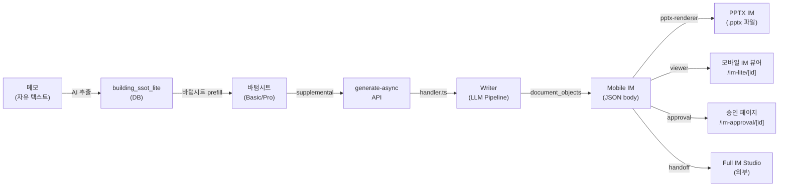

# CRE IM 작성 플로우 — 전체 맵

## 흐름 요약

```mermaid
flowchart TD
    A["① 메모 입력"] --> B["② 딜카드 생성"]
    B --> C["③ 딜카드 상세"]
    C --> D["④ 바텀시트\n(Basic)"]
    D --> E["⑤ 모바일 IM\n생성 + 승인"]
    C --> F["⑥ 바텀시트\n(Pro)"]
    F --> G["⑦ PPTX IM\n생성 + 내보내기"]
    G --> H["⑧ Full IM\nStudio 핸드오프"]

    style A fill:#1e293b,stroke:#3b82f6
    style D fill:#1e293b,stroke:#10b981
    style F fill:#1e293b,stroke:#f59e0b
    style G fill:#1e293b,stroke:#8b5cf6
```



---

## ① 메모 입력 `/broker/deal-card/new`

| 항목 | 내용 |
|------|------|
| **컴포넌트** | [page.tsx](file:///c:/Users/User/cre-dealcard/src/app/(broker)/broker/deal-card/new/page.tsx) (605행) |
| **진입 경로** | 홈 → "매물 등록" 또는 메모 목록에서 → 딜카드 전환 |
| **기능** | 자유 텍스트 메모 입력 (또는 기존 메모 가져오기 `MemoImportModal`) |
| **API** | `POST /api/broker/deal-card` → AI가 메모에서 핵심 정보 추출 |
| **출력** | `building_ssot_lite` 행 생성 (area_signal, asset_type, price_band 등) |

**사용자 경험**: 브로커가 메모를 붙여넣으면 → AI가 자동으로:
- 권역·자산 유형·가격대 추출
- 주소·임차인 등 민감정보 마스킹
- 블라인드 딜카드 + 카카오 공유 문구 생성

---

## ② 딜카드 생성 결과 → ③ 딜카드 상세 `/broker/deal-card/[id]`

| 항목 | 내용 |
|------|------|
| **컴포넌트** | [page.tsx](file:///c:/Users/User/cre-dealcard/src/app/(broker)/broker/deal-card/[id]/page.tsx) (26KB) |
| **주요 섹션** | 딜카드 에디터, IM 관리 패널, 매칭 바이어, AI 시세예측 |
| **핵심 CTA** | 1) "📋 Basic IM 만들기" 2) "📊 Pro IM 만들기" 3) "📄 Full IM Studio" |

딜카드 상세 페이지에서 중개인이 볼 수 있는 주요 영역:

```
┌─────────────────────────────────────────┐
│  📌 딜카드 헤더 (건물명, 등급, 권역)        │
├─────────────────────────────────────────┤
│  📊 IM 관리 패널 (im-management-panel)    │
│  ├── 기존 IM 문서 목록 (basic/pro)        │
│  ├── 데이터 등급 (A/B/C/D)               │
│  ├── [📋 Basic IM 만들기] → 바텀시트(④)   │
│  ├── [📊 Pro IM 만들기]  → 바텀시트(⑥)   │
│  ├── PPTX 프리셋 선택 → [PPTX 내보내기]   │
│  └── [Full IM Studio에서 투자각서 만들기]   │
├─────────────────────────────────────────┤
│  🎯 매칭 바이어 섹션                       │
│  💰 AI 시세 예측 섹션                      │
│  📱 카카오 공유 / 블라인드 티저              │
└─────────────────────────────────────────┘
```

---

## ④ 바텀시트 (Basic) — IM 데이터 입력

| 항목 | 내용 |
|------|------|
| **컴포넌트** | [im-data-bottom-sheet.tsx](file:///c:/Users/User/cre-dealcard/src/app/(broker)/broker/deal-card/[id]/im-data-bottom-sheet.tsx) (1918행) |
| **트리거** | "📋 Basic IM 만들기" 버튼 → `stage = 'basic'` |
| **수집 데이터** | 아래 표 참조 |

### Basic 단계 입력 필드

| 섹션 | 필드 |
|------|------|
| **포스처 선택** | income / owner_occupied / development / trading / operating |
| **주소 확정** | 주소 검색 → 지번 + PNU 자동 확정 |
| **임대 현황** | 월세(만원), 보증금(만원), 공실률(%) |
| **사진** | 최대 12장, hero/exterior 지정, 카테고리 선택 |
| **브로커 코멘트** | 한줄 코멘트 |

→ **제출**: `POST /api/broker/im-lite/generate-async` → 비동기 job 생성 → 폴링

---

## ⑤ 모바일 IM 생성 + 승인

| 항목 | 내용 |
|------|------|
| **생성** | `handler.ts` → `generateMobileIM()` (Writer pipeline) |
| **뷰어** | `/im-lite/[id]` — 모바일 최적화 웹 뷰어 |
| **승인** | `/broker/im-approval/[id]` — 섹션별 편집/승인 |
| **출력** | `document_objects` 테이블에 JSON body 저장 |

생성 후 중개인에게 보이는 흐름:
1. IM 관리 패널에 "Basic IM" 카드 표시
2. "미리보기" → 모바일 IM 뷰어에서 확인
3. "승인하기" → 승인 페이지에서 섹션별 검토·편집

---

## ⑥ 바텀시트 (Pro) — 확장 데이터 입력

| 항목 | 내용 |
|------|------|
| **컴포넌트** | 동일 `im-data-bottom-sheet.tsx` (`stage = 'pro'`) |
| **트리거** | "📊 Pro IM 만들기" 버튼 (데이터 등급 B 이상 필요) |
| **추가 필드** | Basic + 아래 Pro 전용 필드 |

### Pro 단계 추가 입력 필드

| 섹션 | 필드 |
|------|------|
| **관리비** | 관리비 합계(만원) |
| **매매가** | 매매가(만원) + 역산 Cap Rate 계산기 |
| **렌트롤** | 층별 임대 데이터 (`RentRollImporter`) |
| **비교사례** | 유사 건물 실거래가 (최대 5건) |
| **대출** | 융자 상태 (confirmed/no_loan/unknown), 금액 |
| **부가수입** | 통신안테나, 주차, 간판, EV충전 등 |
| **💰 취득비용** (D41) | 취득세율, 중개수수료, 법무사비, 기타 |
| **🏦 대출 시나리오** (D41) | LTV, 금리, 기간, 목표 IRR |
| **포스처별 전용** | 숙박(객실/ADR/OCC/GOP), 개발(용도/규모/공사비), 사옥(인원/평당면적), 구분소유, 주거, 보유이력, 운영실적, 필지 |

→ **제출**: 동일 API → tier: `'pro'` / `'analysis_im'` / `'decision_im'`

---

## ⑦ PPTX IM 생성 + 내보내기

| 항목 | 내용 |
|------|------|
| **컴포넌트** | [im-management-panel.tsx](file:///c:/Users/User/cre-dealcard/src/app/(broker)/broker/deal-card/[id]/im-management-panel.tsx) (472행) |
| **트리거** | IM 관리 패널 "PPTX 내보내기" 버튼 |
| **프리셋** | `credeal_signature`, `golden_institutional`, `executive_gold`, `corporate_clean`, `pro_dark_obsidian` |
| **API** | `GET /api/public/im-lite/[id]/pptx?tier=pro&preset=...` |
| **파이프라인** | `pptx-renderer.ts` → `deck-sequencer.ts` → `data-binder.ts` → archetype들 |
| **출력** | `.pptx` 파일 다운로드 |

### PPTX 슬라이드 구성 (수익형 기준)

```
Cover → Gallery(N) → Summary(A02) → Location(A06) → Land(A04)
→ Building(A04) → RentRoll(조건부) → StackingPlan(조건부)
→ Stability(A04) → Profit(A05) → Comps(A03, 조건부)
→ [Grade A: Capital, DCF, Sensitivity, TotalReturn, Loan, Tax]
→ Appendix → Closing
```

### PPTX 에디터 (실험적)

| 항목 | 내용 |
|------|------|
| **경로** | `/broker/deal-card/[id]/pptx-editor` |
| **컴포넌트** | [page.tsx](file:///c:/Users/User/cre-dealcard/src/app/(broker)/broker/deal-card/[id]/pptx-editor/page.tsx) (19KB) |
| **기능** | 슬라이드 미리보기, 색상/폰트 토큰 편집, 프리셋 스와치 |

---

## ⑧ Full IM Studio 핸드오프 (외부 서비스)

| 항목 | 내용 |
|------|------|
| **컴포넌트** | [full-im-handoff-button.tsx](file:///c:/Users/User/cre-dealcard/src/app/(broker)/broker/deal-card/[id]/full-im-handoff-button.tsx) (73행) |
| **API** | `POST /api/full-im-handoffs` |
| **외부 서비스** | `cre-fullim.vercel.app` |
| **기능** | 딜카드 데이터를 Full IM Studio로 전달 → 전문가 수준 투자각서 작성 |

---

## 전체 데이터 흐름



---

## 주요 URL 라우팅 맵

| 경로 | 용도 | 타입 |
|------|------|------|
| `/broker/memos` | 메모 목록 | 클라이언트 |
| `/broker/deal-card/new` | 메모 → 딜카드 생성 | 클라이언트 |
| `/broker/deal-card/[id]` | 딜카드 상세 + IM 관리 | **서버** |
| `/broker/deal-card/[id]/pptx-editor` | PPTX 에디터 | 클라이언트 |
| `/broker/im-approval/[id]` | IM 승인·편집 | **서버** |
| `/im-lite/[id]` | 모바일 IM 뷰어 (공개) | 클라이언트 |
| `/api/broker/im-lite/generate-async` | IM 비동기 생성 | API |
| `/api/public/im-lite/[id]/pptx` | PPTX 렌더 + 다운로드 | API |
| `/api/public/im-lite/[id]/export` | PDF 내보내기 | API |
