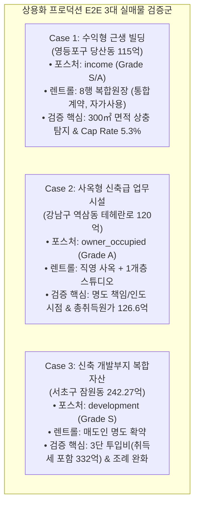
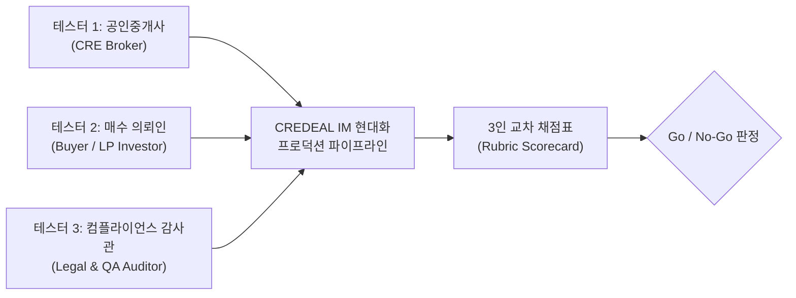
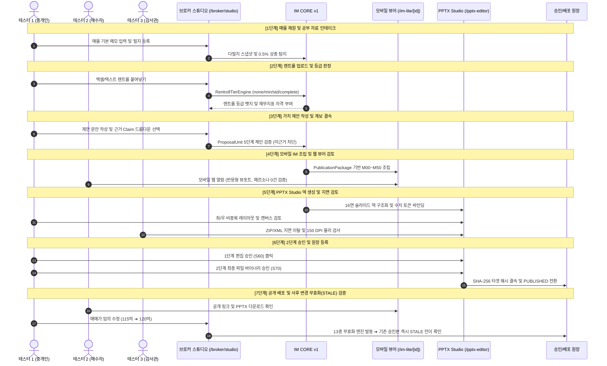

# 상업용 부동산(CRE) 현대화 IM 파이프라인 — 상용화 프로덕션 E2E 인간 테스터 감사 계획서

> **문서 식별자**: `DOC-PROD-E2E-HUMAN-PLAN-v1.0`  
> **프로그램 명칭**: Production E2E Human Tester Commercialization Program (실매물 3건 실전 검증)  
> **대상 파이프라인**: CREDEAL IM CORE v1, Mobile Composer, PPTX Studio, Regeneration Engine, Approval Ledger  
> **저장 위치**: `\docs\product\01_PRODUCTION_E2E_HUMAN_TEST_PLAN.md`  
> **작성 일자**: 2026-09-03  
> **승인 상태**: 프로덕션 실전 롤아웃 전 최종 검증 게이트 (Pre-Go-Live Final Gate)  

---

## 1. 추진 배경 및 감사 목적

### 1.1 추진 배경
신규 현대화 구현된 CREDEAL IM 작성 파이프라인(Sprint B0 ~ B5)은 단위 테스트(21개 스위트, 43개 테스트), Playwright 브라우저 E2E 테스트(5대 여정 100% PASS), 정적 타입 검사(0 errors), 프로덕션 빌드(Exit 0)를 통해 시스템적 무결성을 증명하였습니다.  
그러나 **상업용 부동산 매각안내서(IM)는 수십억~수백억 원대의 자산 거래를 결정짓는 고관여 전문 금융·부동산 문서**입니다. 따라서 기계적 테스트를 넘어, **실제 상업용 부동산 중개인이 현업에서 작성한 진본 IM 및 실측 렌트롤 데이터를 투입하여 현업 전문가(중개인, 매수의뢰인, 감정평가사/변호사)가 직접 브라우저와 PPTX를 조작하고 검증하는 상용화 최종 실전 테스트**가 필수적입니다.

### 1.2 감사 목적
1. **실제 현업 데이터 수용성 검증**: 비정형 중개인 메모, 다필지 공부 자료, 복합 렌트롤(자가사용, 통합계약 등)이 누락이나 왜곡 없이 IM CORE v1에 수용되는지 검증.
2. **수치 산출의 절대 신뢰도 확보**: 4대 면적 분모, Cap Rate, 실질 영업이익(GOP), WALE, 취득세 및 총취득원가의 결정론적 산출이 실제 실무 엑셀 장부와 0.00% 일치하는지 인간 전문가 육안 교차 검증.
3. **인간 사용자 경험(UX) 및 실무 완성도 평가**: 중개인의 작성 피로도 감소, 실시간 CRE 용어 안내 툴팁의 유용성, 모바일 뷰어의 가독성, PPTX 16면 덱의 딜 클로징 설득력 평가.
4. **상용화 Go/No-Go 최종 판정**: 3개 대표 매물 유형 전수 테스트 결과를 바탕으로 정식 상용 서비스 런칭 여부를 최종 판정.

---

## 2. 3대 실매물 테스트 대상 선정 (MECE 포트폴리오)

대한민국 상업용 부동산 시장의 거래 비중 95% 이상을 포괄하는 3대 대표 자산 유형(수익형, 사옥형, 개발형)을 엄선하여 실무 진본 데이터를 기반으로 테스트를 구성합니다.



| 구분 | 매물 개요 | 자산 유형 및 포스처 | 데이터 복잡도 (Data Complexity) | 실무 검증 중점 포인트 |
|---|---|:---:|---|---|
| **Case 1** | **영등포구 당산동 근린생활시설**<br>• 매매가: **115억 원**<br>• 규모: 지하 1층~지상 5층<br>• 연면적: 1,141.15㎡ (공부 합계 1,441.15㎡) | `income`<br>(수익형 꼬마빌딩) | • **실측 렌트롤 8개 구획**<br>• 1F+2F 통합계약 (그룹 B)<br>• 자가사용 2구획 (지하1F, 4F 일부)<br>• 만기도래 계약 1건 | • 300㎡ 면적 자기모순 탐지 및 경고 질의<br>• 자가사용 구획 공실률 제외 (공실률 0.0%)<br>• 통합계약 환산보증금 1회 산출 원칙<br>• Cap Rate(연 순수익률) 5.3% 산출 신뢰성 |
| **Case 2** | **강남구 역삼동 신축급 사옥**<br>• 매매가: **120억 원**<br>• 규모: 지하 1층~지상 6층<br>• 연면적: 785.90㎡ (237.72평) | `owner_occupied`<br>(기업 사옥용 오피스) | • 2023년 준공 준신축 자산<br>• 1~6층 기업 직영 사옥<br>• 지하 1층 스튜디오 단독 임차<br>• 렌트롤 세부 미제공 매물 | • 사옥 직영 시 총취득원가(취득세 4.6% + 중개보수 0.9% = 126.6억) 표기<br>• 매도인 vs 매수인 명도 책임 조건 분기<br>• 사옥 단독 명칭 표기권(간판 설치권) 반영<br>• 임대 vs 사옥매입 비용 비교(vsLease) 슬라이드 |
| **Case 3** | **서초구 잠원동 신축 개발부지**<br>• 매입비: **242.27억 원**<br>• 대지면적: 2,036.7㎡ (616.1평)<br>• 신축규모: 지하 1층~지상 6층 | `development`<br>(신축 부지 개발형) | • 토지이용계획 제2종일반주거<br>• 매도인 전원 명도 확약 조건<br>• 신축 계획안(지상 연면적 614평)<br>• 서울시 한시 완화 조례 적용 | • 3단 투입비 + 취득세 산출 (총 투입비 332.09억)<br>• 개발 후 예상 임대수익률 시뮬레이션<br>• 한시 규제 잔여일 카운트다운 표기<br>• 지적도 및 상권분석 부록 슬라이드 정상 분리 |

---

## 3. 인간 테스터 3인 역할 및 감사 체계

상용화 테스트의 객관성을 확보하기 위해 서로 다른 이해관계를 대표하는 3인의 전문가 테스터가 독립적으로 평가를 수행합니다.



### 3.1 테스터별 페르소나 및 점검 책임

| 테스터 구분 | 역할 및 자격 요건 | 주요 점검 영역 (Scope of Responsibility) |
|---|---|---|
| **테스터 1: 전문 중개인**<br>*(CRE Broker Tester)* | • 경력 5년 이상의 강남/영등포 권역 상업용 부동산 전문 공인중개사<br>• 실무 IM 작성 및 매수의뢰자 피칭 경험 다수 | • **입력 편의성**: 비정형 텍스트 메모 및 엑셀 렌트롤 복사-붙여넣기 편의성<br>• **작성 소요 시간**: 기존 수작업 대비 70% 이상 단축 여부<br>• **제안 계보 편집**: 5단계 가치 제안 작성 시 근거 지표 연결 자연스러움<br>• **피칭 도구 완성도**: 카카오톡 모바일 링크 공유 및 PPTX 파일 발표 적합성 |
| **테스터 2: 매수 의뢰인 / LP**<br>*(Buyer & Investor Tester)* | • 법인 사옥 매입 담당 임원 또는 자산운용사 부동산 투자 심사역<br>• 실거래 검토 및 투자심의위원회 안건 작성 경험자 | • **정보 투명성**: 공부상 수치와 현황 수치의 구분 명확성 (공부확인 뱃지 등)<br>• **수치 신뢰도**: Cap Rate, 대출 승계, 취득세, WALE 계산의 수치적 무결성<br>• **가치 제안 설득력**: 단순 나열이 아닌 자산의 핵심 투자 포인트 부각 여부<br>• **모바일 가독성**: 스마트폰으로 1분 내 자산의 핵심 스펙 파악 가능 여부 |
| **테스터 3: 품질 및 컴플라이언스**<br>*(QA & Legal Auditor)* | • 부동산 전문 변호사 또는 프롭테크 수석 QA 엔지니어<br>• 개인정보보호법 및 공인중개사법 표시·광고 규제 전문가 | • **법적 면책 고지**: 투자 권유 부인(Disclaimer) 및 원자료 출처 표기 무결성<br>• **PII 및 지번 블라인드**: 딜카드 및 공개 링크 내 매도인 PII 및 상세 지번 유출 0건<br>• **Rule 1 & 2 준수**: 외부 노출 페르소나 문구 0건, CRE 표준 용어 준수율 100%<br>• **PPTX 물리 무결성**: 16면 본문 상한(Rule 10), 지면 이탈 0건, 토큰 잔존 0건 |

---

## 4. 프로덕션 E2E 7단계 테스트 라이프사이클

인간 테스터는 실제 운영 환경(Next.js 프로덕션 모드)에서 매물 1건당 다음 7단계를 순차적으로 수행하며 시스템을 검증합니다.



### 단계별 세부 수행 가이드

#### [1단계] 매물 제원 및 공부 자료 인테이크 (Intake & Snapshot)
- **수행 주체**: 테스터 1 (중개인)
- **테스트 환경**: `/broker/studio`, `/broker/deal-card/new`
- **조작 내용**: 준비된 실매물 텍스트 메모를 인테이크 입력창에 입력. 다필지 매물(Case 3)의 경우 필지 2개 지번 및 면적 추가 입력.
- **검증 항목**:
  - 다필지 추가 시 대지면적 자동 합산 및 실시간 카드 갱신 여부.
  - 공부상 연면적과 렌트롤 임대면적 간 0.5% 초과 상충 발생 시(Case 1의 300㎡ 편차), 묵살하지 않고 `확인 필요(질의)` 카드로 표출되는지 확인.

#### [2단계] 렌트롤 업로드 및 등급 판정 (Rent Roll Tiering)
- **수행 주체**: 테스터 1 (중개인), 테스터 3 (감사관)
- **조작 내용**: 준비된 엑셀/텍스트 렌트롤 데이터를 복사하여 렌트롤 입력 폼에 붙여넣기.
- **검증 항목**:
  - Case 1: `standard` 등급 부여 ➔ Cap Rate, NOI, 공실률 지표 자동 활성화 확인.
  - Case 1: 지하 1층, 4층 '자가사용' 구획이 공실로 잡히지 않고 분모/분자에서 정상 배제되는지(공실률 0.0%) 확인.
  - Case 2: 렌트롤 부재 시 `none` 등급 부여 ➔ Cap Rate 요청 차단 및 직영 사옥 모드로 정상 분기하는지 확인.

#### [3단계] 가치 제안 작성 및 계보 결속 (Proposal Lineage)
- **수행 주체**: 테스터 1 (중개인), 테스터 3 (감사관)
- **조작 내용**: 중개인 의견 문안 작성 (예: "당산역세권 병원 입점으로 공실 없는 5.3% 안정적 수익 실현").
- **검증 항목**:
  - "근거 Claim 선택" 모달에서 계산된 수익률 지표(`claim.cap_rate`)를 연결하지 않고 저장 시도시 유효성 차단 확인.
  - 근거 지표 연결 시 `원문 ➔ 근거 ➔ 의미 ➔ 문구 ➔ 반영위치` 5단계 계보 뱃지 생성 확인.
  - "네이밍 라이츠" 등 외래어 직역 투 입력 시 실시간 경고 툴팁 표출 확인.

#### [4단계] 모바일 IM 조립 및 웹 뷰어 검토 (Mobile IM Web Viewer)
- **수행 주체**: 테스터 2 (매수자), 테스터 3 (감사관)
- **테스트 환경**: 실제 모바일 기기(아이폰/갤럭시) 및 데스크톱 브라우저 크롬(`/im-lite/[id]`)
- **검증 항목**:
  - iPhone 14 Pro(393px) 및 Galaxy S23(360px)에서 가로 스크롤 없이 유려한 반응형 렌더링 확인.
  - 사진 수량별 적응형 뷰포트: Case 1(사진 8장 ➔ 캐러셀 스와이프), Case 2(사진 3장 ➔ 3-그리드), Case 3(사진 0장 ➔ 제원 카드 대체) 확인.
  - 외부 DOM 스캔: "60대 자산가" 등 특정 연령/계층 지칭 페르소나 문구 0건 검증.

#### [5단계] PPTX Studio 덱 생성 및 지면 검토 (PPTX Studio Canvas)
- **수행 주체**: 테스터 1 (중개인), 테스터 3 (감사관)
- **테스트 환경**: `/broker/deal-card/[id]/pptx-editor`
- **검증 항목**:
  - 모바일 발행과 무관하게 독립적으로 8단계(S00~S70) PPTX 프로젝트 생성 가능 여부 확인.
  - 16면 본문 상한 가이드라인 준수: Case 1, 2는 12~14면, Case 3은 16면 본문 + 지적도/상권분석 부록 분리 확인.
  - 좌/우 분할 레이아웃(A04, A05)에서 좌측 서사와 우측 카드의 텍스트 중복 0건 확인.
  - 수치 토큰(`{{claim.xxx}}`) 바인딩 완료 및 미치환 텍스트 0건 확인.

#### [6단계] 2단계 승인 및 원장 등록 (2-Stage Approval Protocol)
- **수행 주체**: 테스터 1 (중개인), 테스터 3 (감사관)
- **조작 내용**:
  1. 1단계: 슬라이드 문안 및 순서 편집 승인 (S60 `editorial_approval`) 클릭.
  2. 2단계: 실제 렌더링된 PPTX 파일 바이너리 해시 승인 (S70 `file_approval`) 클릭.
- **검증 항목**:
  - S60을 건너뛰고 S70 파일 승인 단독 호출 시 `PRECONDITION_FAILED` 차단 확인.
  - 승인 이벤트가 `approval_events` 원장에 SHA-256 타겟 해시와 함께 불변 기록되는지 확인.

#### [7단계] 공개 배포 및 사후 변경 무효화 검증 (Distribution & Invalidation)
- **수행 주체**: 테스터 2 (매수자), 테스터 1 (중개인)
- **조작 내용**:
  1. 공개 모바일 링크 및 PPTX 다운로드 파일의 일치성 확인.
  2. 스튜디오에서 매매가를 임의 수정(예: 115억 ➔ 120억)하여 저장.
- **검증 항목**:
  - 13종 무효화 엔진(`invalidation-engine.ts`)이 즉시 가동되어, 기발행된 모바일 및 PPTX 승인 상태가 즉시 `STALE`로 전이되는지 확인.
  - 과거 발행 URL 접근 시 "수정 중(최신 승인 대기 중)" 안내가 표출되는지 확인.

---

## 5. 정밀 평가 채점표 (Rubric Scorecard) 및 판정 기준

각 테스터는 매물 1건당 5대 평가 영역(총 100점 만점)에 대해 정량적 채점을 실시합니다.

### 5.1 5대 영역 평가 기준표 (Rubric)

| 평가 영역 | 배점 | 세부 점검 항목 | 만점 기준 (Pass Standard) |
|---|:---:|---|---|
| **1. 수치 정확성 및 정합성**<br>*(Numeric Integrity)* | 25점 | • 4대 면적 분모 일치성<br>• Cap Rate, NOI, GOP 계산 정확성<br>• 취득세 및 총취득원가 정확성<br>• 상충 데이터 경고 표출 | • 실무 엑셀 산출치와 편차 **0.00%**<br>• NaN, Infinity, [object] 오염 0건<br>• 상충 수치(300㎡ 등) 100% 탐지 표출 |
| **2. 실무 완성도 및 딜 설득력**<br>*(CRE Business Maturity)* | 25점 | • 자산 가치 제안의 설득력<br>• 명도 조건, 권리관계 실무 반영<br>• 12개 골든 케이스 대비 충실도<br>• 매수의뢰인 관점 딜 매력도 | • 자산의 핵심 강점이 명확히 부각됨<br>• 투자심의위원회 기초자료 수준 충족<br>• 실무 중개인 피칭에 즉시 사용 가능 |
| **3. 컴플라이언스 및 거버넌스**<br>*(Compliance & Governance)* | 20점 | • Rule 1: 페르소나 문구 격리<br>• Rule 2: 한국 CRE 표준 용어 준수<br>• PII 개인정보 및 지번 마스킹<br>• 법적 고지문(Disclaimer) 표기 | • 페르소나 단어 노출 **0건**<br>• 외래어 직역 투 노출 **0건**<br>• 지번/소유자 정보 유출 **0건** |
| **4. 지면 물리 및 시각 품질**<br>*(Visual & Physical Layout)* | 15점 | • PPTX 지면 이탈(Bleed) 여부<br>• 좌/우 레이아웃 비중복 원칙<br>• 모바일 반응형 뷰포트 깨짐<br>• 이미지 150 DPI 이상 선명도 | • 캔버스 경계 이탈 좌표 **0건**<br>• 텍스트/카드 중복 나열 **0건**<br>• 모바일 가로 스크롤 및 텍스트 겹침 **0건** |
| **5. 조작 편의성 및 워크플로우**<br>*(UX & Workflow Velocity)* | 15점 | • 데이터 인테이크 입력 편의성<br>• 제안 작성 시 근거 연결 용이성<br>• 2단계 승인 및 다운로드 속도<br>• 작성 소요 시간 단축률 | • 기존 수작업 대비 작성 시간 **70% 이상 단축**<br>• 3회 이내 클릭으로 주요 액션 완료<br>• 시스템 응답 지연 3초 이내 |

### 5.2 상용화 Go / No-Go 판정 기준

```
[GO 판정 (상용화 승인)]
- 3개 매물 케이스 전체 평균 점수: 90점 이상
- 테스터 3인 전원 개별 점수: 85점 이상
- P0 (Blocker) 결함: 0건
- P1 (Critical) 결함: 0건

[NO-GO 판정 (상용화 보류 및 리메디에이션)]
- 3개 매물 케이스 중 1건이라도 85점 미만인 경우
- P0 결함이 1건이라도 발견된 경우 (즉각 롤백 및 파이프라인 수정)
- P1 결함이 미해결 상태인 경우
```

#### 결함 심각도 정의
- **P0 (Blocker - 상용화 절대 불가)**: 수치 계산 오류(단 0.1%라도 편차 발생), PII/지번 유출, 페르소나 문구 노출, PPTX 지면 이탈, 승인 해시 위변조, 시스템 크래시.
- **P1 (Critical - 출시 전 수정 필수)**: 실무 용어집 미치환, 모바일 뷰포트 레이아웃 어색함, 이미지 해상도 저하, 렌트롤 업로드 파싱 오류.
- **P2 (Minor - 출시 후 후속 패치 가능)**: 문안 폰트 미세 조정, 컬러 테마 추가 요청, 안내 툴팁 문구 개선.

---

## 6. 테스트 추진 일정 및 보고서 작성 계획

| 일정 (D-Day 기준) | 주요 활동 및 마일스톤 | 담당자 / 참여자 | 산출물 |
|---|---|:---:|---|
| **D - 3** | 실매물 3건 데이터 정제 및 테스트 런북 배포 | 프로젝트 리드 | `02_CASE_STUDIES_REAL_DATA_SCENARIOS.md` |
| **D - 2** | 테스터 3인 오리엔테이션 및 프로덕션 스테이징 환경 셋업 | DevOps / 리드 | 프로덕션 스테이징 URL 및 계정 발급 |
| **D - 1** | **실전 E2E 테스트 1차 실행 (Case 1 당산동, Case 2 역삼동)** | 테스터 3인 | 1차 채점표 및 결함 로그 |
| **D - DAY (오전)** | **실전 E2E 테스트 2차 실행 (Case 3 잠원동 개발부지)** | 테스터 3인 | 2차 채점표 및 종합 평가서 |
| **D - DAY (오후)** | 결함 분류(P0/P1/P2) 회의 및 최종 Go/No-Go 서명식 | 6대 책임자 | `docs/product/FINAL_E2E_AUDIT_REPORT.md` |

---

## 7. 문서 연계 안내

- **매물별 실데이터 및 시나리오 전문**: [`\docs\product\02_CASE_STUDIES_REAL_DATA_SCENARIOS.md`](file:///c:/Users/User/cre-dealcard/docs/product/02_CASE_STUDIES_REAL_DATA_SCENARIOS.md)
- **테스터용 실전 런북 및 체크리스트**: [`\docs\product\03_HUMAN_TESTER_AUDIT_CHECKLIST_AND_RUNBOOK.md`](file:///c:/Users/User/cre-dealcard/docs/product/03_HUMAN_TESTER_AUDIT_CHECKLIST_AND_RUNBOOK.md)
