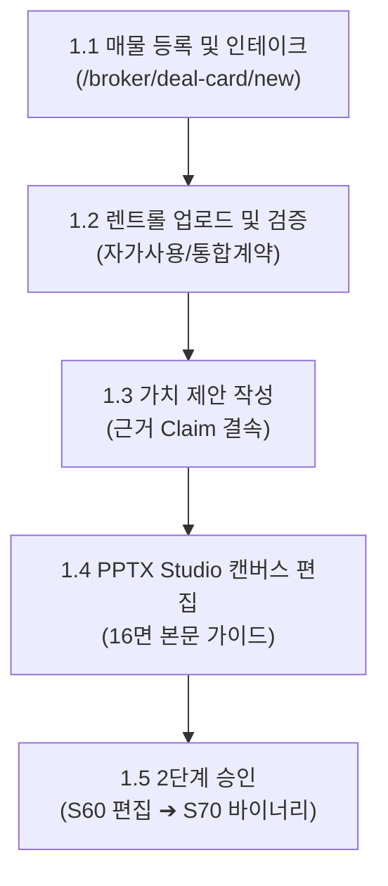
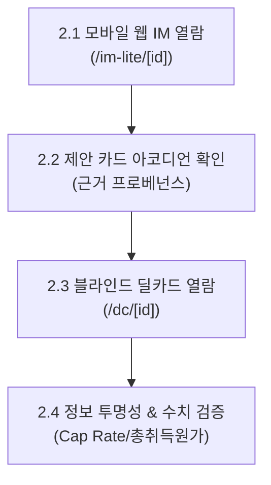
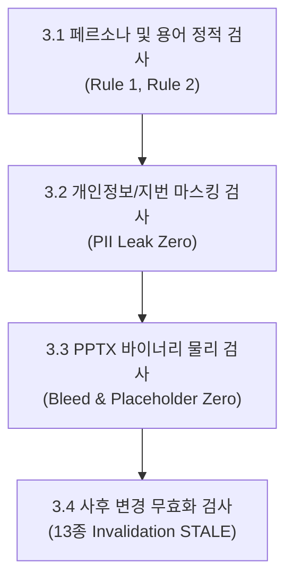

# 상업용 부동산(CRE) 현대화 IM 파이프라인 — 인간 테스터 실전 런북 및 감사 체크리스트

> **문서 식별자**: `DOC-PROD-E2E-RUNBOOK-CHECKLIST-v1.0`  
> **상위 계획서**: [`\docs\product\01_PRODUCTION_E2E_HUMAN_TEST_PLAN.md`](file:///c:/Users/User/cre-dealcard/docs/product/01_PRODUCTION_E2E_HUMAN_TEST_PLAN.md)  
> **참조 데이터**: [`\docs\product\02_CASE_STUDIES_REAL_DATA_SCENARIOS.md`](file:///c:/Users/User/cre-dealcard/docs/product/02_CASE_STUDIES_REAL_DATA_SCENARIOS.md)  
> **저장 위치**: `\docs\product\03_HUMAN_TESTER_AUDIT_CHECKLIST_AND_RUNBOOK.md`  
> **작성 일자**: 2026-09-03  

---

## 1. 테스터 사전 준비 및 환경 설정

### 1.1 접속 환경 및 테스트 계정
- **테스트 대상 서버 URL**: `http://localhost:3000` (또는 지정된 프로덕션 스테이징 URL)
- **권장 브라우저**:
  - 데스크톱: Google Chrome 최신 버전 (권장 해상도 1920×1080)
  - 모바일: Safari (iOS 17+ / iPhone 14 Pro 이상) 또는 Chrome (Android 14+ / Galaxy S23 이상)
- **테스트 계정 준비**:
  - 테스터 1 (중개인): `broker_tester@credeal.test` (인증 세션 쿠키 부여)
  - 테스터 2 (매수의뢰인): 비로그인 일반 사용자 (익명 공개 링크 열람)
  - 테스터 3 (감사관): `admin_auditor@credeal.test` (관리자 감사 권한)

---

## 2. [테스터 1: 공인중개사] 실전 런북 및 체크리스트

중개인 테스터는 3개 매물에 대해 매물 등록부터 2단계 최종 승인까지의 전 과정을 직접 조작하며 사용성과 실무 적합성을 평가합니다.



### 2.1 단계별 조작 및 감사 체크리스트

#### [단계 1.1] 매물 등록 및 인테이크
- [ ] `/broker/deal-card/new` 접속 후 시나리오 문서([02_CASE_STUDIES](file:///c:/Users/User/cre-dealcard/docs/product/02_CASE_STUDIES_REAL_DATA_SCENARIOS.md))의 원문 메모를 복사-붙여넣기 하였을 때 3초 이내 파싱이 완료되는가?
- [ ] **Case 3(다필지)**: 1번 필지(1,200.5㎡)와 2번 필지(836.2㎡)를 추가 입력했을 때 대지면적 합계(2,036.7㎡)가 실시간 자동 계산되는가?
- [ ] **Case 1(면적 모순)**: 공부상 연면적(1,141.15㎡)과 렌트롤 합계(1,441.15㎡)의 300㎡ 차이에 대해 시스템이 묵살하지 않고 "확인 필요: 연면적이 확정되지 않았습니다" 질의 카드를 표출하는가?

#### [단계 1.2] 렌트롤(Rent Roll) 업로드 및 검증
- [ ] 렌트롤 표 데이터를 붙여넣었을 때 행/열이 흐트러짐 없이 프리뷰 테이블로 렌더링되는가?
- [ ] **자가사용 처리**: Case 1의 지하 1층 및 4층 '자가사용' 구획이 공실로 잡히지 않고 정상적으로 공실률 0.0%로 계산되는가?
- [ ] **통합계약 표기**: 1층과 2층(그룹 B 연세의원)이 묶음 표시되며, 2층에 월세가 중복 집계되지 않는가?
- [ ] 렌트롤 검증 완료 후 우측 상단에 `standard` 등급 뱃지가 부여되고 Cap Rate 산출이 활성화되는가?

#### [단계 1.3] 가치 제안(Proposal) 작성 및 계보 결속
- [ ] 제안 문안 작성 후 "근거 Claim 연결" 드롭다운에서 계산된 지표(`Cap Rate 5.3%` 등)를 정상 선택할 수 있는가?
- [ ] 근거 지표를 선택하지 않고 저장 시도 시 "근거 지표를 반드시 연결해야 합니다" 경고가 정상 작동하는가?
- [ ] "네이밍 라이츠" 등 외래어를 입력했을 때 "한국 실무 표준 용어 '사옥 단독 명칭 표기(간판 설치권)' 권장" 툴팁이 즉시 뜨는가?

#### [단계 1.4] PPTX Studio 캔버스 편집
- [ ] `/broker/deal-card/[id]/pptx-editor`로 이동 시 8단계(S00~S70) 프로젝트가 즉시 로딩되는가?
- [ ] 좌/우 분할 슬라이드에서 좌측 리드문 서사와 우측 카드의 내용이 서로 중복되지 않고 상호 보완적인가?
- [ ] 수치 토큰(`{{claim.asking_price}}` 등)이 실제 한글 금액("115억 원")으로 깨짐 없이 치환되어 있는가?
- [ ] Case 3에서 본문 슬라이드가 16면 이하로 유지되고, 지적도와 상권분석이 부록 슬라이드로 깔끔히 분리되었는가?

#### [단계 1.5] 2단계 승인 및 원장 결속
- [ ] 1단계 "슬라이드 편집 승인(S60)" 버튼 클릭 시 브로커 인증 확인 후 편집 승인 뱃지로 전환되는가?
- [ ] 2단계 "최종 PPTX 파일 바이너리 승인(S70)" 버튼 클릭 시 실제 생성된 PPTX 파일이 브라우저로 즉시 다운로드되는가?
- [ ] 다운로드된 PPTX 파일을 파워포인트 프로그램으로 열었을 때 파일 손상 경고 없이 매끄럽게 열리는가?

---

## 3. [테스터 2: 매수의뢰인 / LP] 실전 런북 및 체크리스트

매수자 테스터는 실제 투자 검토자 관점에서 모바일 웹 뷰어와 블라인드 딜카드를 열람하고, 정보 투명성과 딜 소싱 설득력을 평가합니다.



### 3.1 단계별 조작 및 감사 체크리스트

#### [단계 2.1] 모바일 웹 IM 뷰어 열람 (`/im-lite/[id]`)
- [ ] 스마트폰(iOS/Android) 모바일 브라우저로 접속 시 1.5초 이내 상단 헤더 및 첫 화면이 로딩되는가?
- [ ] 모바일 화면에서 좌우로 원치 않는 가로 스크롤(Horizontal Overflow)이 발생하지 않는가?
- [ ] **Case 1(사진 8장)**: 상단 갤러리가 부드러운 터치 스와이프로 넘어가며 고화질로 표시되는가?
- [ ] **Case 3(사진 0장)**: 깨진 이미지 아이콘 없이 깔끔한 자산 제원 카드로 대체되어 노출되는가?

#### [단계 2.2] 가치 제안 카드 및 프로베넌스 뱃지
- [ ] 추천 투자 포인트 카드 탭 터치 시 세부 근거 지표와 함께 아코디언이 부드럽게 펼쳐지는가?
- [ ] 각 수치 옆에 '공부확인', '중개사인증', '전문가검증' 등 데이터 출처(Provenance) 뱃지가 신뢰감 있게 붙어 있는가?
- [ ] 하단 고정 바의 "카카오톡 공유하기" 및 "전화 문의하기" 버튼이 정상 작동하는가?

#### [단계 2.3] 블라인드 딜카드 열람 (`/dc/[id]`)
- [ ] `/dc/[id]` 공개 링크 접근 시 건물명과 상세 지번(번지수)이 완벽히 블라인드 처리되어 있는가?
- [ ] 매매가가 단일 수치가 아닌 밴딩 구간(예: Case 1의 경우 "110억 ~ 120억 원대")으로 안전하게 표기되는가?
- [ ] 역세권 표기가 "당산역 도보 3분 대로변 코너" 등 광역 입지로 일반화되어 매물 특정 위험을 방지하는가?

#### [단계 2.4] 정보 투명성 및 수치 검증
- [ ] **Case 1**: Cap Rate가 5.33%로 명시되고, 공실률이 0.0%인 사유(자가사용 2개소 제외)가 투명하게 설명되어 있는가?
- [ ] **Case 2**: 사옥 매입 시 총취득원가(126.60억 원)와 세금/부대비용 5.5%(6.60억 원)가 명확히 분리 표기되어 자금 계획 수립이 용이한가?
- [ ] **Case 3**: 총 투입비 332.09억 원(매입비 242.27억 + 건축비 73.68억 + 예비비 5억 + 취득세 11.14억)의 3단 투입비 구조가 한눈에 이해되는가?

---

## 4. [테스터 3: 품질 및 컴플라이언스 감사관] 실전 런북 및 체크리스트

감사관 테스터는 법적 규제 준수, 개인정보보호, 페르소나 격리, PPTX 지면 물리 무결성, 그리고 사후 변경 무효화(STALE)를 기계적·법률적으로 정밀 점검합니다.



### 4.1 단계별 정밀 감사 체크리스트

#### [단계 3.1] Rule 1(페르소나 격리) & Rule 2(CRE 실무 표준 용어) 검사
- [ ] **Rule 1 페르소나 완전 격리**: 모바일 웹 뷰어 전체 DOM 및 PPTX 슬라이드 텍스트를 정밀 검색하였을 때 다음 금지 단어가 **0건**인가?
  - `60대 자산가`, `50대 자산가`, `40대 자산가`, `30대 투자자`
  - `법인 대표 맞춤`, `고액 자산가 전용`, `VIP 투자자용`, `초보 매수자를 위한`
- [ ] **Rule 2 CRE 표준 용어 준수**: 다음 외래어 직역 투가 발견되지 않고 표준 용어로 치환되었는가?
  - ❌ `네이밍 라이츠` ➔ ✅ `사옥 단독 명칭 표기(간판 설치권)`
  - ❌ `캡레이트` ➔ ✅ `연 순수익률 (Cap Rate)`
  - ❌ `GOP` ➔ ✅ `실질 영업이익 (GOP)`
  - ❌ `TI / Rent Free` ➔ ✅ `인테리어 지원금(TI) / 렌트프리(무상임대)`

#### [단계 3.2] PII 개인정보 및 지번 블라인드 마스킹 검사
- [ ] 모바일 IM, 딜카드, PPTX 어디에도 소유주의 성명, 주민등록번호, 연락처가 노출되지 않는가?
- [ ] 블라인드 딜카드 본문에 "당산동 123-45"와 같은 상세 번지수 텍스트가 노출되지 않는가?
- [ ] 문서 최하단에 공인중개사법 및 자본시장법에 부합하는 법적 면책 고지문(Disclaimer: "본 문서는 정보 제공을 목적으로 하며...")이 필수 포함되어 있는가?

#### [단계 3.3] PPTX 바이너리 지면 물리 검사 (OpenXML 정밀 계측)
- [ ] 렌더링된 PPTX 파일 내 모든 텍스트 및 도형 박스가 16:9 슬라이드 캔버스 경계(가로 13.333인치, 세로 7.5인치) 내에 완벽히 수용되는가 (Bleed 0건)?
- [ ] 슬라이드 본문에 미치환 템플릿 토큰(`{{claim.xxx}}` 등 중괄호 잔존)이 **단 1개도 없는가**?
- [ ] 삽입된 건물 외관 및 내부 사진의 해상도가 실효 기준 150 DPI 이상으로 선명하게 렌더링되는가?
- [ ] 좌측 서사 영역과 우측 카드 영역 간 불릿 항목의 단순 복사 중복이 없는가?

#### [단계 3.4] 사후 변경 무효화(STALE) 전이 검사
- [ ] 승인이 완료된 Case 1 매물에 대해 브로커 스튜디오에서 매매가를 임의 수정(115억 ➔ 120억)하여 저장했을 때,
- [ ] `approval_events` 원장의 승인 상태가 즉시 `STALE`로 전이되는가?
- [ ] 기존 발행되었던 공개 웹 링크 접속 시 "정보가 수정되어 재승인 진행 중입니다" 안전 안내가 표출되는가?

---

## 5. 테스터 종합 평가표 (Consolidated Scorecard Template)

각 테스터는 3개 매물 테스트를 마친 후 다음 채점표를 작성하여 제출합니다.

### 5.1 케이스별 채점표 양식

| 평가 영역 | 배점 | Case 1 (당산동 근생) | Case 2 (역삼동 사옥) | Case 3 (잠원동 개발) | 가중 평균 |
|---|:---:|:---:|:---:|:---:|:---:|
| **1. 수치 정확성 및 정합성** | 25점 | [  ]점 | [  ]점 | [  ]점 | [  ]점 |
| **2. 실무 완성도 및 딜 설득력** | 25점 | [  ]점 | [  ]점 | [  ]점 | [  ]점 |
| **3. 컴플라이언스 및 거버넌스** | 20점 | [  ]점 | [  ]점 | [  ]점 | [  ]점 |
| **4. 지면 물리 및 시각 품질** | 15점 | [  ]점 | [  ]점 | [  ]점 | [  ]점 |
| **5. 조작 편의성 및 워크플로우** | 15점 | [  ]점 | [  ]점 | [  ]점 | [  ]점 |
| **총점 (100점 만점)** | **100점** | **[  ]점** | **[  ]점** | **[  ]점** | **[  ]점** |

---

## 6. 결함 등록 양식 (Defect Ticket Template)

테스트 중 이상 현상 발견 시 다음 양식에 따라 즉시 결함 티켓을 발행합니다.

```markdown
### [DEFECT-TICKET]
- **티켓 ID**: DEFECT-20260903-01
- **발견 케이스**: Case 1 (당산동) / Case 2 (역삼동) / Case 3 (잠원동)
- **발견 단계**: 1.1 인테이크 / 1.2 렌트롤 / 1.3 제안 / 1.4 PPTX / 1.5 승인 / 2.1 모바일
- **심각도**: [ ] P0 (Blocker)  /  [ ] P1 (Critical)  /  [ ] P2 (Minor)
- **발견자**: 테스터 1 (중개인) / 테스터 2 (매수자) / 테스터 3 (감사관)
- **증상 및 재현 경로**:
  1. ...
  2. ...
- **기대 결과**: (예: 공실률이 0.0%로 산출되어야 함)
- **실제 결과**: (예: 자가사용 구획이 공실로 분류되어 25.0%로 산출됨)
- **첨부 증적**: 스크린샷 파일명 또는 로그 발췌
```

---

## 7. 상용화 서명식 프로토콜 (Go-Live Protocol)

모든 테스트가 완료되고 P0/P1 결함이 0건으로 확인되면, 3인 테스터 및 6대 제품 책임자가 연명하여 상용화 런칭 서명서에 날인함으로써 프로덕션 롤아웃이 최종 확정됩니다.
