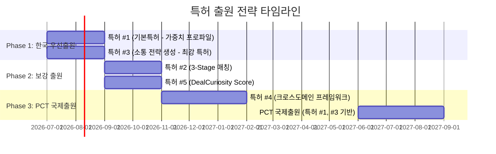

# 🏛️ AI 기반 딜 페르소나 도출 시스템 — 특허 포트폴리오 분석

> **목적**: cre-dealcard(CRE 매수자 페르소나)와 star-deal(스타트업 투자자 페르소나)에서 도출된 혁신을 특허로 보호하기 위한 전략 분석

---

## 1. 왜 "좋은 특허"가 가능한가 — 3대 조건 충족

### ① 신규성 (Novelty) ✅
- "구조화된 자산/사업 데이터(SSoT)로부터 **역방향으로** 이상적 거래 상대방 페르소나를 AI가 도출"하는 시스템은 **선행기술이 없음**
- 기존 매칭 시스템: "투자자가 스타트업을 검색" (정방향)
- 본 발명: "스타트업 데이터가 투자자 페르소나를 생성" (**역방향**)

### ② 진보성 (Non-Obviousness) ✅
- 단순 키워드 매칭이 아닌, **목적별 가중치 프로파일(PURPOSE_WEIGHTS / THESIS_WEIGHTS)**에 따른 다차원 앙상블 스코어링
- 페르소나에 **"어디서 찾을 것인가(whereToFind)"와 "어떻게 접근할 것인가(approachStrategy)"**를 포함하는 것은 기존 추천 시스템과 질적으로 다름
- **소통 미숙 사용자를 위한 대화 대본 생성(pitchStrategy, iceBreaker, followUpTemplate)**은 추천 시스템의 범위를 넘어서는 새로운 카테고리

### ③ 산업상 이용가능성 (Industrial Applicability) ✅
- 부동산 중개, 스타트업 투자 중개, M&A, 인재 채용 등 **다수 도메인에 적용 가능**
- 실제 구현 코드와 작동하는 시스템이 이미 존재

---

## 2. 특허 후보 5건 — 핵심 청구항 초안

---

### 📜 특허 후보 #1: 목적 기반 가중치 프로파일을 활용한 거래 상대방 페르소나 도출 시스템

**발명의 명칭**: 구조화된 자산 데이터로부터 거래 목적별 가중치 프로파일을 적용하여 이상적 거래 상대방 페르소나를 도출하는 방법 및 시스템

**핵심 기술 사상**:
```
[입력] 자산/사업 SSoT → [엔진] 목적별 가중치 프로파일 적용 → [출력] N개 페르소나 + 접근 전략
```

**독립항 초안**:

> **청구항 1.** 컴퓨터로 구현되는 거래 상대방 페르소나 도출 방법으로서,
>
> (a) 대상 자산 또는 사업체의 복수의 구조화된 신호 데이터를 수신하는 단계;
>
> (b) 상기 신호 데이터로부터 거래 목적 유형을 판별하고, 판별된 거래 목적 유형에 대응하는 **사전 정의된 다차원 가중치 프로파일**을 선택하는 단계 — 여기서 상기 가중치 프로파일은 복수의 평가 차원에 대한 가중치 벡터를 포함하며, 거래 목적 유형마다 상이한 가중치 분배를 가짐;
>
> (c) 선택된 가중치 프로파일을 적용하여 대규모 언어 모델에 의해 **복수의 가상 거래 상대방 페르소나**를 생성하는 단계 — 각 페르소나는 상대방 유형, 예산/투자 범위, 거래 동기, 핵심 요구사항, 발굴 채널, 및 접근 전략을 포함함;
>
> (d) 각 페르소나에 대해 상기 대상 자산/사업체와의 **적합도 점수**를 산출하는 단계;
>
> 를 포함하는 방법.

**종속항 후보**:
- 청구항 2: 상기 가중치 프로파일이 부동산 거래에서 사옥형, 투자형, 증여형, 혼합형을 포함하는 것
- 청구항 3: 상기 가중치 프로파일이 스타트업 투자에서 성장중심형, 팀중심형, 임팩트형, 전략적투자형, 딥테크형을 포함하는 것
- 청구항 4: 상기 발굴 채널이 사용자가 즉시 실행 가능한 구체적 행동 지침을 포함하는 것
- 청구항 5: 상기 접근 전략이 거래 상대방 유형별 최초 접촉 메시지 템플릿을 포함하는 것

**보호 범위**: PURPOSE_WEIGHTS / THESIS_WEIGHTS 가중치 엔진의 핵심 메커니즘. 이것이 가장 넓은 보호를 제공하는 **기본 특허(기반 특허)**

---

### 📜 특허 후보 #2: 다층 구조화 데이터(SSoT)로부터의 역방향 거래 매칭 시스템

**발명의 명칭**: 단일 진실 원천(SSoT) 다층 구조화 데이터를 기반으로 역방향 거래 상대방을 도출하는 3단계 매칭 방법 및 시스템

**핵심 기술 사상**:
```
[Stage 1] 하드 필터 (O(1) 조건 탈락) 
    → [Stage 2] 시맨틱 임베딩 유사도 (벡터 공간 매칭) 
    → [Stage 3] 가중치 앙상블 스코어링 (다차원 종합 점수)
```

**독립항 초안**:

> **청구항 1.** 컴퓨터로 구현되는 거래 매칭 방법으로서,
>
> (a) 제1 엔티티의 다층 구조화 데이터 — 상기 다층 구조화 데이터는 복수의 독립적 분석 레이어를 포함하며, 각 레이어는 해당 레이어의 신뢰도 등급을 수반함 — 를 입력받는 단계;
>
> (b) **제1 단계(하드 필터)**에서, 제2 엔티티 프로파일의 필수 조건과 상기 다층 구조화 데이터를 대조하여 불일치 항목이 존재하면 즉시 탈락 처리하는 단계;
>
> (c) **제2 단계(시맨틱 매칭)**에서, 상기 다층 구조화 데이터의 텍스트 표현과 제2 엔티티 프로파일의 텍스트 표현을 각각 벡터 임베딩으로 변환하고 코사인 유사도를 산출하는 단계;
>
> (d) **제3 단계(앙상블 스코어링)**에서, 시맨틱 유사도 점수, 도메인 특화 신호 점수들, 및 상기 가중치 프로파일을 앙상블하여 최종 적합도 점수와 등급을 산출하는 단계;
>
> 를 포함하며, 상기 방법이 **역방향으로** — 즉, 매도/투자유치 측 데이터로부터 매수/투자 측 페르소나를 도출하는 방향으로 — 수행되는 것을 특징으로 하는 방법.

**보호 범위**: 3-Stage 매칭 엔진의 구조와 역방향 매칭이라는 방법론적 혁신

---

### 📜 특허 후보 #3: 소통 역량 보완을 위한 AI 기반 거래 접근 전략 생성 시스템

**발명의 명칭**: 거래 상대방 페르소나 분석에 기반한 맥락 인지형 소통 전략 및 대화 가이드 자동 생성 방법

**핵심 기술 사상 (가장 독창적인 특허)**:
```
[페르소나 분석 결과] + [사용자 소통 역량 프로파일] 
    → [AI 소통 코치 엔진] 
    → 접근 전략 + 첫 메시지 + 주의사항 + 후속 템플릿
```

**독립항 초안**:

> **청구항 1.** 컴퓨터로 구현되는 거래 소통 전략 생성 방법으로서,
>
> (a) 거래 대상의 구조화된 속성 데이터와 도출된 거래 상대방 페르소나를 입력받는 단계;
>
> (b) 상기 페르소나의 유형 분류에 기반하여, 해당 유형의 거래 상대방이 **의사결정 시 중시하는 핵심 요인**을 판별하는 단계;
>
> (c) 판별된 핵심 요인을 강조하는 **최초 접촉 메시지(iceBreaker)**를 자동 생성하는 단계;
>
> (d) 해당 페르소나 유형에게 **회피해야 할 표현 및 주제(dealBreakers)**를 도출하는 단계;
>
> (e) 최초 접촉 후 **후속 소통 시나리오(followUpTemplate)**를 단계별로 생성하는 단계;
>
> (f) 해당 페르소나 유형에 대한 **흔한 소통 실수 패턴(commonMistakes)**을 제시하는 단계;
>
> 를 포함하며, 상기 (c) 내지 (f)의 출력이 사용자가 즉시 복사하여 사용할 수 있는 자연어 텍스트 형태인 것을 특징으로 하는 방법.

> [!IMPORTANT]
> **이 특허가 가장 강력합니다.** "소통 미숙 사용자를 위한 AI 소통 코치"라는 개념은 기존 추천 시스템(RecSys)이나 CRM과 **질적으로 다른 카테고리**이며, 선행기술을 찾기가 매우 어렵습니다.

---

### 📜 특허 후보 #4: 크로스-도메인 페르소나 도출 프레임워크

**발명의 명칭**: 도메인 독립적 다층 구조화 데이터 스키마와 도메인 특화 가중치 프로파일을 조합하여 복수 산업에 적용 가능한 거래 상대방 페르소나 도출 프레임워크

**핵심 기술 사상**:
```
[도메인 독립 코어]
    ├── SSoT 다층 스키마 엔진
    ├── 3-Stage 매칭 파이프라인
    └── 페르소나 생성 + 소통 전략 엔진

[도메인 특화 플러그인]
    ├── CRE: building_ssot_lite + PURPOSE_WEIGHTS + 브로커 컨텍스트
    ├── 스타트업: startup_ssot 7-Layer + THESIS_WEIGHTS + 창업자 컨텍스트
    ├── M&A: company_ssot + SYNERGY_WEIGHTS + 인수자 컨텍스트 (향후)
    └── 인재채용: candidate_ssot + CULTURE_WEIGHTS + 채용자 컨텍스트 (향후)
```

**독립항 초안**:

> **청구항 1.** 복수의 거래 도메인에 적용 가능한 거래 상대방 페르소나 도출 프레임워크로서,
>
> (a) 도메인 독립적인 다층 구조화 데이터 스키마를 정의하는 코어 엔진 — 상기 스키마는 복수의 분석 레이어와 각 레이어의 신뢰도 메타데이터를 포함함;
>
> (b) 상기 코어 엔진에 **도메인 특화 가중치 프로파일 세트**를 플러그인 방식으로 결합하는 구성 — 여기서 각 도메인은 해당 도메인의 거래 목적 분류 체계와 대응하는 가중치 벡터를 독립적으로 정의함;
>
> (c) 상기 코어 엔진과 도메인 특화 플러그인의 조합에 의해, 입력된 자산/사업체 데이터로부터 해당 도메인에 적합한 거래 상대방 페르소나를 도출하는 방법;
>
> 을 포함하는 프레임워크.

**보호 범위**: 플랫폼 아키텍처 자체. CRE → 스타트업 → M&A → 채용 등으로의 **확장을 선제적으로 보호**

---

### 📜 특허 후보 #5: 딜스토리 호기심 점수(DealCuriosity Score) 산출 방법

**발명의 명칭**: 거래 대상의 서사적 풍부성을 정량화하는 딜 호기심 점수 산출 방법 및 이를 매칭 앙상블에 통합하는 시스템

**핵심 기술 사상**:
```
SSoT 데이터의 "이야기로서의 매력도" → 0-100 점수
    → 매칭 앙상블의 한 차원으로 투입
    → "데이터상 적합하지만 이야기가 없는 딜" vs "적합도는 중간이지만 이야기가 풍부한 딜" 구별
```

**독립항 초안**:

> **청구항 1.** 거래 대상의 서사적 풍부성을 정량화하는 방법으로서,
>
> (a) 거래 대상의 구조화된 데이터로부터 서사적 요소 — 시장 타이밍, 밸류업 가능성, 독특한 히스토리, 감정적 소구력 — 의 존재 여부와 풍부성을 평가하는 단계;
>
> (b) 상기 평가 결과를 0-100 범위의 **딜 호기심 점수(Deal Curiosity Score)**로 산출하는 단계;
>
> (c) 산출된 딜 호기심 점수를 거래 매칭 앙상블 스코어링의 한 차원으로 통합하여, 서사적 풍부성이 매칭 결과에 영향을 미치도록 하는 단계;
>
> 를 포함하는 방법.

**보호 범위**: "이야기의 매력도"를 정량화한다는 개념 자체가 매우 독창적

---

## 3. 선행기술(Prior Art) 분석

| 선행기술 영역 | 존재하는 것 | 본 발명과의 차이 |
|---|---|---|
| 추천 시스템 (RecSys) | 협업 필터링, 콘텐츠 기반 필터링 | ❌ "역방향 페르소나 생성"이 아닌 "기존 아이템 추천" |
| 매칭 플랫폼 (LinkedIn, AngelList) | 프로필 기반 검색 | ❌ 검색이지 "이상적 상대방의 가상 프로필 생성"이 아님 |
| LLM 기반 페르소나 (마케팅) | 마케팅용 고객 페르소나 생성 | ❌ 거래 매칭 목적이 아님, 가중치 프로파일 없음 |
| CRM 시스템 (Salesforce) | 리드 스코어링 | ❌ 기존 리드를 점수화할 뿐, 가상 리드를 생성하지 않음 |
| 부동산 AI (Zillow, CoStar) | 가격 예측, 매물 추천 | ❌ "누가 사야 하는가"의 페르소나 도출 없음 |
| 투자 매칭 (PitchBook) | 투자자 DB 검색 | ❌ "이 스타트업에 맞는 투자자 유형" 도출 없음 |

> [!TIP]
> **선행기술 회피 핵심**: 기존 시스템은 모두 **"이미 존재하는 데이터베이스에서 검색/필터링"**하는 반면, 본 발명은 **"존재하지 않는 이상적 상대방의 가상 프로필을 AI가 창조적으로 생성"**하는 점에서 근본적으로 다릅니다.

---

## 4. 특허 전략

### 출원 순서 및 타임라인



### 우선순위

| 순위 | 특허 | 이유 |
|---|---|---|
| 🥇 1순위 | **#1 (가중치 프로파일)** + **#3 (소통 전략)** | 가장 넓은 보호 + 가장 독창적 |
| 🥈 2순위 | **#4 (크로스도메인)** | 플랫폼 확장을 선제 보호 |
| 🥉 3순위 | **#2 (3-Stage)** + **#5 (DealCuriosity)** | 기술적 깊이 보강 |

### 출원 형태

| 항목 | 전략 |
|---|---|
| **최초 출원** | 한국 특허청(KIPO) 우선출원 |
| **우선권 기간** | 12개월 내 PCT 국제출원 |
| **지정국** | 미국(USPTO), 일본(JPO), EU(EPO) |
| **출원인** | 향후 설립 스타트업 법인 (또는 개인 → 법인 양도) |
| **발명자** | 시스템 설계자 (본인) |

---

## 5. 고문 변호사의 역할

| 역할 | 내용 |
|---|---|
| **특허 출원 전략 자문** | 출원 타이밍, 청구항 범위 조정, 선행기술 조사 위임 |
| **법인 설립 시 IP 양도** | 개인 발명 → 법인 특허 양도 구조 설계 |
| **투자 유치 시 IP 밸류에이션** | 특허 포트폴리오가 기업가치 평가에 미치는 영향 |
| **방어 전략** | 경쟁사 진입 시 특허권 행사 또는 라이선싱 전략 |
| **PCT 출원 시 해외 대리인 선임** | 미국/일본/EU 현지 특허 대리인 네트워크 |

> [!IMPORTANT]
> **긴급 권고**: 특허는 **선출원주의**입니다. 코드가 GitHub에 public으로 올라가거나, 데모가 공개되면 **신규성이 상실**될 수 있습니다.
> - 한국: 공개 후 **12개월** 이내 공지예외 적용 가능 (신규성 의제)
> - 미국: 공개 후 **1년** 이내 grace period
> - 유럽: **공개 전 출원 필수** (grace period 없음)
>
> **6/15 제이에스부동산 데모 전에 최소 가출원(임시출원) 또는 명세서 초안 완성을 권고합니다.**

---

## 6. 특허 포트폴리오의 사업적 가치

### 투자 유치 시 효과

| 단계 | IP 없을 때 | IP 5건 포트폴리오 |
|---|---|---|
| 시드 투자 | "코드는 복제 가능" 리스크 | "특허로 보호된 핵심 기술" |
| 시리즈 A | 기술 해자(moat) 불명확 | **특허가 기술 해자의 증거** |
| CVC 투자 | 전략적 가치 평가 어려움 | 라이선싱/인수 대상으로서의 가치 |
| Exit (M&A) | 코드만의 가치 | **특허 포트폴리오가 인수 프리미엄 요인** |

### 방어/공격 가치

- **방어**: 네이버/카카오/직방 등이 유사 기능 출시 시 **특허 침해 주장 가능**
- **라이선싱**: 해외 PropTech/InvestTech 기업에 **기술 라이선스 수익**
- **크로스 라이선스**: 대기업과의 협상에서 **교섭력 확보**

---

## 7. 즉시 실행 액션

| # | 액션 | 담당 | 기한 |
|---|---|---|---|
| 1 | 고문 변호사에게 본 분석 공유, 특허 전문 변리사 소개 요청 | 본인 | 이번 주 |
| 2 | 특허 #1, #3 명세서 초안 작성 (기술 설명서) | 본인 + AI | 6/15 전 |
| 3 | 선행기술 조사 의뢰 (변리사) | 변리사 | 2주 |
| 4 | 한국 가출원 또는 정식출원 | 변리사 | 7월 |
| 5 | cre-dealcard / star-deal 리포지토리를 **private** 유지 확인 | 본인 | 즉시 |

> [!CAUTION]
> **리포지토리 공개 상태 확인이 최우선입니다.** GitHub에 public으로 코드가 올라가 있으면 유럽 출원 시 신규성 문제가 발생할 수 있습니다.
