# E2E Seed Data Plan & Demo Scenarios

## 1. Admin 설정 ✅

| Field | Value |
|---|---|
| Email | kboom8002@gmail.com |
| UUID | `2d48fdba-b4aa-438a-8970-ac2316688fc3` |
| Role | `admin` |
| Display | JS Admin |

---

## 2. 사용자 페르소나 (6명)

> profiles FK는 auth.users를 참조하므로, service_role로 직접 INSERT합니다.

| # | UUID | Role | Display Name | 시나리오 |
|---|---|---|---|---|
| U0 | `2d48fdba-b4aa-438a-8970-ac2316688fc3` | **admin** | JS Admin | 관리자 콘솔, Gate 승인/거절, 전문가 코멘트 |
| U1 | `f5365a14-bfe4-4f67-9b03-846d0163e5bc` | **broker** | 박중개 | 성수 근생 딜카드, 카카오 복사, Gate 검토 |
| U2 | `d0f23ca2-949e-4baf-9b11-ef7b1626e52e` | **broker** | 김강남 | 강남 오피스 딜카드, 매수자 메모 연결 |
| U3 | `0c0c1185-77f6-427e-a543-3d482374feb2` | **public_user** | 이매각 | Building Radar, 매각 준비도, 전문가 코멘트 |
| U4 | `86169258-4b8d-4dfd-a190-9a593517cd81` | **public_user** | 최매수 | 매수자 조건 50~80억, 매수자 메모 |
| U5 | `c5dddc30-bc45-4e06-98bc-ffbbba0cbe7c` | **public_user** | 정투자 | G2/G3 Gate 요청, 스냅샷 관심 |

---

## 3. 건물 SSoT (5건)

| # | Area | Asset Type | Price Band | Owner | 시나리오 |
|---|---|---|---|---|---|
| B1 | 성수권역 | 근생 복합 | 80억대 | U1 (박중개) | 브로커 딜카드 Demo B |
| B2 | 강남권역 | 오피스 | 150억대 | U2 (김강남) | 브로커 딜카드 + 매수자 연결 |
| B3 | 마포권역 | 근생+사옥 | 45억대 | U3 (이매각) | Building Radar Demo A |
| B4 | 서초권역 | 상업 복합 | 200억대 | null | 공개 Building Radar |
| B5 | 용산권역 | 주상 복합 | 120억대 | null | Gate 요청 타겟 |

---

## 4. 시드 데이터 관계도

```mermaid
graph TD
    U1[박중개 broker] -->|creates| B1[성수 80억 근생]
    U1 -->|creates| SC1[Signal Card B1]
    U1 -->|creates| BT1[Blind Teaser B1]
    U2[김강남 broker] -->|creates| B2[강남 150억 오피스]
    U2 -->|creates| SC2[Signal Card B2]
    U2 -->|creates| BT2[Blind Teaser B2]
    U3[이매각 public] -->|creates| B3[마포 45억 근생]
    U3 -->|creates| DCR3[Deal Curiosity Report B3]
    U3 -->|creates| OR3[Owner Readiness 65점]
    U3 -->|requests| EN3[Expert Note B3]
    U4[최매수 public] -->|creates| BI4[Buyer Intent 50~80억]
    U4 -->|generates| BM4[Buyer Memo B1×BI4]
    U5[정투자 public] -->|requests| GR5a[Gate G2 B1]
    U5 -->|requests| GR5b[Gate G3 B2]
    U0[JS Admin] -->|approves| GR5a
    U0 -->|rejects| GR5b
```



---

## 5. 테이블별 시드 행 수

| Table | Rows | 설명 | ✅ |
|---|---|---|---|
| profiles | **6** | U0-U5 | ✅ |
| broker_profiles | **2** | U1, U2 | ✅ |
| building_ssot_lite | **6** | B1-B5 + 기존 1건 | ✅ |
| building_signal_cards | **3** | B1, B2, B5 | ✅ |
| document_objects | **5** | BT1, BT2, DCR3, BuyerMemo4, MissingData3 | ✅ |
| buyer_intent_lite | **2** | U4 (50~80억), U5 (100~200억) | ✅ |
| owner_readiness_checks | **2** | U3 (65점), anonymous (35점) | ✅ |
| gate_requests | **8** | G1×3, G2×3, G3×2 (submitted/approved/rejected) | ✅ |
| expert_note_requests | **4** | requested×2, in_review×1, completed×1 | ✅ |
| ai_runs | **4** | mini_truth, blind_teaser, dcr, buyer_memo | ✅ |
| activity_events | **34** | 전체 플로우 이벤트 | ✅ |

---

## 6. 데모 시나리오 (8개)

### Demo A — Public "이 건물, 딜 될까?" (B3, U3)
```
/building-radar → 마포구 입력 → Deal Curiosity Report 확인
DB: B3 + DCR3 + 3 activity_events
검증: 가격 추천 없음, 투자 조언 없음
```

### Demo B — Broker "카톡 매물 → 1분 딜카드" (B1, U1)
```
/broker/deal-card/[B1.id] → Hidden Fields 카드 확인
DB: B1 + SC1 + BT1 + 4 activity_events
검증: blind teaser에 exact_address, tenant_name, unit_rent 없음
```

### Demo C — Buyer Intent → Buyer Memo (BI4 × B1)
```
/broker/buyer-intents/[BI4.id] → B1과 매칭 → 매수자 메모 생성
DB: BI4 + BM4 + 2 activity_events
검증: 매수 추천 아님, 대출 확정 아님
```

### Demo D — Owner Readiness → Expert Note (OR3, EN3)
```
/owner-readiness → 65점 → 전문가 코멘트 요청
DB: OR3 + EN3 + 2 activity_events
검증: 부족 자료 목록 표시, CTA 작동
```

### Demo E — Disclosure Guard (BT1 vs raw memo)
```
BT1.body에 성수동 000-00, A카페, 월세 800, 빠른 협의 없음 확인
hidden_fields: [exact_address, tenant_name, unit_rent, seller_motivation]
검증: 100개 테스트 중 disclosure-guard.test.ts 25건 pass
```

### Demo F — Gate Request Lifecycle (GR → approve/reject)
```
/admin/gate-requests → G2 submitted → 승인 → G3 submitted → 거절
DB: 5 gate_requests (mixed status)
검증: 승인 후에도 exact_address 자동 노출 없음
```

### Demo G — Admin Expert Note Review
```
/admin/expert-notes → requested 1건 + in_review 1건 + completed 1건
검증: 완료된 코멘트에 expert_note 텍스트 표시
```

### Demo H — Analytics Dashboard
```
/admin/analytics → 모든 이벤트 카운트 > 0
Public Loop: SSoT 5, 딜 리포트 1, 매각 준비도 2, 전문가 2
Broker Loop: 메모 2, 블라인드 티저 2, 매수자 조건 2, 매수자 메모 1
Gate: 요청 5, 검토 2
Funnel: 전환율 표시
```

---

## 7. 실행 순서

1. ✅ Admin profile 설정
2. Supabase Auth에 5명 사용자 생성 (또는 profiles 직접 삽입)
3. SQL seed 스크립트 실행 (building → signal_card → document → buyer_intent → gate → expert_note → activity_events)
4. 브라우저로 8개 데모 시나리오 검증
5. 스크린샷 캡처

> [!IMPORTANT]
> profiles.id는 auth.users(id) FK를 참조합니다. 실제 auth 사용자 없이 seed하려면
> Supabase Auth Admin API로 더미 사용자를 먼저 생성하거나, FK를 nullable로 변경해야 합니다.
> 아래 시드 SQL에서는 Auth Admin API로 5명을 먼저 생성합니다.
