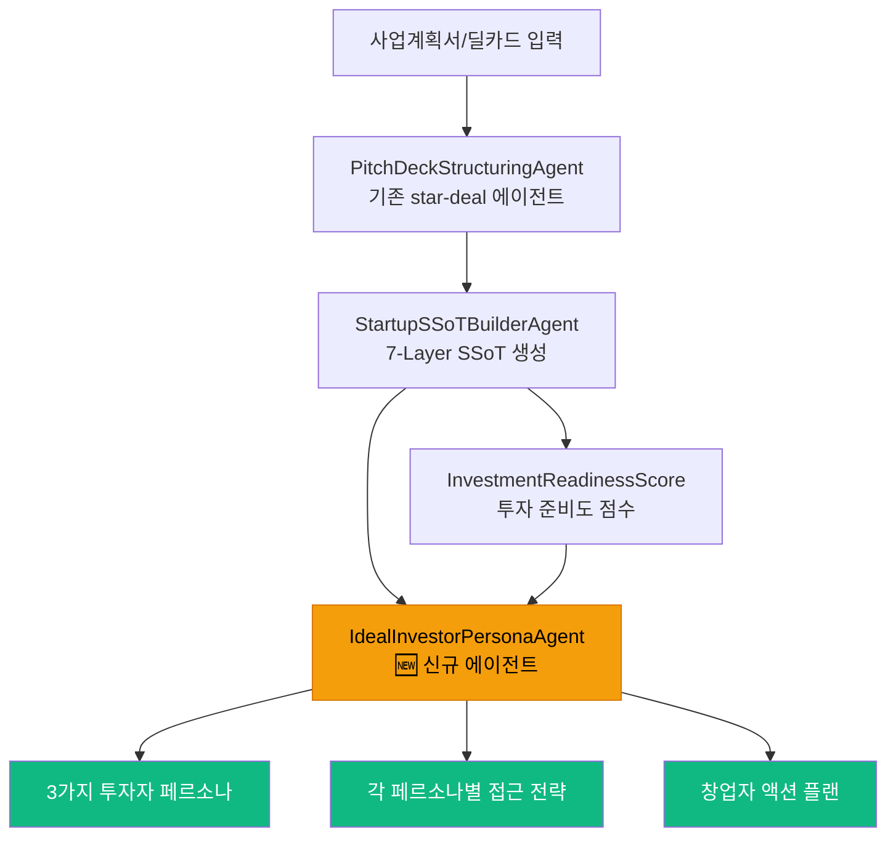

# 🚀 스타트업 이상적 투자자 페르소나 AI — 전략 분석

> **한줄 컨셉**: 사업계획서/딜카드를 넣으면 AI가 "이 스타트업에 가장 적합한 투자자 3명의 가상 프로필과 접근 전략"을 도출해주는 서비스

---

## 1. 결론부터: 히트 가능성이 매우 높다

CRE 매수자 페르소나 엔진보다 **스타트업 투자자 페르소나 엔진이 폭발력이 더 크다**고 판단합니다.  
6가지 구조적 이유가 있습니다.

---

## 2. CRE 엔진 vs 스타트업 엔진 — 아키텍처 대응 관계

| CRE (cre-dealcard) | 스타트업 (star-deal) | 비고 |
|---|---|---|
| `building_ssot_lite` (10+ 신호) | `startup_ssot` (7-Layer, 229줄 스키마) | **star-deal이 더 풍부** |
| `BuyerPersonaSchema` (9 필드) | `InvestorPersonaSchema` (12+ 필드) — 신규 | 확장 설계 |
| `PURPOSE_WEIGHTS` (사옥/투자/증여) | `THESIS_WEIGHTS` (성장/임팩트/절세/전략적) — 신규 | 가중치 프로파일 |
| `DealCuriosity Score` (0-100) | `InvestmentReadiness Score` (0-100) — 신규 | 딜 스토리 점수 |
| 3-Stage 매칭 (필터→임베딩→앙상블) | **이미 구현됨** (`matching-engine.ts`) | ✅ 코드 재사용 가능 |
| 면책문구 (boundaryNote) | 면책문구 + `SafeLanguageGuard` | ✅ star-deal이 더 강력 |

> [!IMPORTANT]
> **핵심 발견**: star-deal에 이미 3-Stage 매칭 엔진(`matching-engine.ts`), 투자자 프로필 정규화기(`investor-profile-normalizer.ts`), Startup SSoT 7-Layer 스키마(`startup-ssot.ts`)가 **완전히 구현**되어 있습니다.  
> 투자자 페르소나 도출 엔진은 **기존 인프라 위에 한 레이어만 추가**하면 됩니다.

---

## 3. 왜 스타트업 버전이 더 폭발적인가? — 6가지 구조적 이유

### 이유 1: 시장 크기 — CRE 브로커 수천 명 vs 스타트업 창업자 수십만 명

| 지표 | CRE 매수자 페르소나 | 스타트업 투자자 페르소나 |
|---|---|---|
| 잠재 사용자 | 한국 CRE 전문 브로커 ~3,000명 | 한국 스타트업 창업자 ~50,000+, 멘토·AC ~5,000 |
| 글로벌 확장 | 한국/일본 CRE 시장 한정 | **글로벌 확장 가능** (Y Combinator, 500Global 동일 Pain) |
| 사용 빈도 | 월 2-5건 (매물 단위) | 월 10-30건 (라운드 준비, 피칭 반복) |
| 지불 의향 | 중간 (CRE 거래수수료의 부가가치) | **높음** (투자 유치 = 생존의 문제) |

### 이유 2: "누구에게 투자받아야 하나?"는 모든 창업자의 #1 질문

CRE에서 "이 건물은 누가 사야 하나?"는 **브로커의 전문 영역**에 해당하지만,  
스타트업에서 "이 사업에 어떤 투자자가 적합한가?"는 **창업자가 전혀 모르는 영역**입니다.

- CRE 브로커: 네트워크가 이미 있고, 페르소나는 보조 도구
- 스타트업 창업자: **네트워크가 없고**, 페르소나가 유일한 나침반

→ **정보 비대칭이 훨씬 크기 때문에 서비스 가치가 극대화됨**

### 이유 3: 데이터 풍부성 — 7-Layer SSoT가 CRE보다 구조화가 잘 되어 있음

CRE `building_ssot_lite`:
```
area_signal, asset_type, price_band, size_signal, vacancy_signal, 
fit_summary, caution_summary (7개 핵심 신호)
```

스타트업 `startup_ssot` 7-Layer:
```
① identity (기업 정체성, 섹터, 단계)
② problem_customer (문제, 고객, Pain Point, Why Now)
③ product_technology (솔루션, 기술 우위, 로드맵)
④ market_competition (시장 규모, 경쟁사, 차별화)
⑤ traction_business (매출, 사용자, 비즈니스 모델, 유닛 이코노믹스)
⑥ team_execution (팀, 도메인 전문성, Founder-Market Fit)
⑦ risk_evidence_ask (리스크, 투자 유치 금액, Use of Funds)
```

→ **입력 데이터가 7배 더 풍부**하므로 AI 페르소나 도출의 정확도와 구체성이 비교할 수 없이 높아짐

### 이유 4: 투자자 분류 체계가 CRE 매수자보다 세분화 가능

CRE 매수자 유형: `법인 / 개인 / 펀드 / 외국법인` (4가지)

스타트업 투자자 유형:
| 유형 | 특성 | 접근 전략 |
|---|---|---|
| 엔젤 투자자 | 도메인 전문성, 직접 경험 | 멘토 커뮤니티, TIPS |
| 시드 전문 VC | 초기 단계, 팀 중심 | KDB넥스트라운드, 매쉬업엔젤스 |
| 시리즈A VC | 트랙션 중심, PMF 검증 | 한투파, DSC, 소프트뱅크벤처스 |
| CVC (기업 전략투자) | 시너지/전략적 합목적성 | 삼성넥스트, 현대, 네이버 |
| 액셀러레이터 | 프로그램+투자 병행 | 스파크랩, 프라이머, 블루포인트 |
| 임팩트 투자자 | 사회적 가치 + 재무 수익 | MYSC, D3쥬빌리 |
| 패밀리 오피스 | 장기 보유, 세금 효율 | PB 센터, 가업승계 네트워크 |
| 해외 VC | 글로벌 확장성 검증 | 500Global, Altos, Y Combinator |

→ **8가지 유형 × 섹터별 세분화 = 수십 가지 고유 페르소나** 도출 가능

### 이유 5: PURPOSE_WEIGHTS의 스타트업 버전이 더 정교할 수 있음

CRE `PURPOSE_WEIGHTS`:
```
사옥형: { market: 0.2, financial: 0.15, vacancy: 0.1, semantic: 0.35, tax: 0.2 }
투자형: { market: 0.25, financial: 0.35, vacancy: 0.2, semantic: 0.1, tax: 0.1 }
증여형: { market: 0.1, financial: 0.1, vacancy: 0.05, semantic: 0.15, tax: 0.6 }
```

스타트업 `THESIS_WEIGHTS` (신규 설계):
```typescript
// 투자자 투자 철학별 가중치 프로파일
THESIS_WEIGHTS = {
  growth_focused: {     // 성장 중심 VC
    traction: 0.35, market: 0.25, team: 0.20, product: 0.15, risk: 0.05
  },
  team_first: {         // 팀 중심 시드 VC / 엔젤
    team: 0.40, product: 0.25, market: 0.15, traction: 0.10, risk: 0.10
  },
  impact_driven: {      // 임팩트 투자
    market: 0.30, problem: 0.30, team: 0.15, traction: 0.15, risk: 0.10
  },
  strategic_synergy: {  // CVC (전략적 투자)
    product: 0.35, market: 0.25, traction: 0.20, team: 0.10, risk: 0.10
  },
  deep_tech: {          // 딥테크/기술 중심
    product: 0.40, team: 0.30, market: 0.15, traction: 0.10, risk: 0.05
  }
}
```

→ **CRE의 3가지 프로파일 대비 5+ 프로파일로 확장**, 이는 TCO 이론의 스타트업 적용판

### 이유 6: "whereToFind"가 창업자에게 **진짜 돈이 되는 정보**

CRE 브로커의 "어디서 찾을까":
> "강남 PB센터 네트워크", "세무사 동문회", "KOTRA 외국법인 리스트"

스타트업 창업자의 "어디서 찾을까":
> "매쉬업엔젤스 서류 심사 마감일 7/15 → 지금 제출해야 함"  
> "한국투자파트너스 헬스케어 전담 심사역 김OO 파트너 → LinkedIn DM"  
> "TIPS 운영사 중 바이오 전문 3곳 → 직접 IR 가능"  
> "삼성넥스트 Open Innovation Portal에서 RFP 진행 중"

→ **구체적이고 즉시 실행 가능한 행동 가이드** = 유료 가치

---

## 4. 설계: 7-Layer SSoT → 투자자 페르소나 매핑



### 입력-출력 스키마 (신규)

```typescript
// IdealInvestorPersonaSchema (star-deal용)
{
  label: string,              // "헬스케어 전문 시드 VC"
  investorType: InvestorType, // angel | vc | cvc | accelerator | family_office | impact
  thesisProfile: ThesisType,  // growth_focused | team_first | impact_driven | strategic_synergy | deep_tech
  ticketRange: string,        // "3억~10억"
  motivation: string,         // 왜 이 스타트업에 투자하려 하는가
  coreThesisMatch: string[],  // 투자 Thesis와 일치하는 핵심 포인트 3-5개
  whereToFind: string[],      // 구체적 채널 + 담당자급 정보
  pitchStrategy: string,      // 첫 IR 메일/콜드 메시지로 쓸 수 있는 전략
  dealBreakers: string[],     // 이 유형의 투자자가 싫어할 수 있는 요소
  fitScore: number,           // 0-100
  portfolioReferences: string[] // 유사 포트폴리오 사례 (참고용)
}
```

---

## 5. 코드 재사용 전략 — 이미 80%가 준비되어 있음

| 구성 요소 | cre-dealcard 상태 | star-deal 상태 | 재사용/신규 |
|---|---|---|---|
| SSoT 스키마 | `building_ssot_lite` (10 필드) | `startup_ssot` (7-Layer, 229줄) ✅ | star-deal 그대로 사용 |
| 입력 파싱 에이전트 | `broker-deal-card.ts` | `pitch-deck-structuring.ts` ✅ | star-deal 그대로 사용 |
| SSoT 빌더 | `broker-deal-card.ts` | `startup-ssot-builder.ts` ✅ | star-deal 그대로 사용 |
| 3-Stage 매칭 엔진 | `auto-matcher.ts` (CRE 매수자) | `matching-engine.ts` (투자자) ✅ | star-deal 그대로 사용 |
| 투자자 프로필 정규화 | — | `investor-profile-normalizer.ts` ✅ | star-deal 그대로 사용 |
| 임베딩 생성 | OpenAI `text-embedding-3-small` | Gemini `text-embedding-004` ✅ | star-deal 그대로 사용 |
| 페르소나 도출 에이전트 | `ideal-buyer-persona.ts` ✅ | 🆕 **신규 개발 필요** | CRE 코드 참고하여 신규 |
| 페르소나 UI | `ideal-buyer-persona-section.tsx` ✅ | 🆕 **신규 개발 필요** | CRE UI 포크하여 적용 |
| 면책 가드레일 | `boundaryNote` (간단) | `SafeLanguageGuard` ✅ | star-deal이 더 강력 |

> [!TIP]
> **실질적으로 신규 개발이 필요한 것은 2개 파일뿐입니다:**
> 1. `ideal-investor-persona.ts` — AI 에이전트 (프롬프트 + 스키마)
> 2. `ideal-investor-persona-section.tsx` — UI 컴포넌트
> 
> 나머지는 이미 star-deal에 구현된 인프라를 그대로 활용합니다.

---

## 6. 경쟁 환경 분석 — 현재 이 서비스가 없다

| 기존 서비스 | 하는 것 | 안 하는 것 |
|---|---|---|
| **TIPS** (정부) | 운영사 매칭 | ❌ 투자자 페르소나 분석 없음 |
| **the VC** | 투자자 DB 열람 | ❌ "이 스타트업에 적합한 투자자" 추천 없음 |
| **AngelList / Crunchbase** | 투자자 프로필 검색 | ❌ AI 기반 역방향 매칭(스타트업→투자자) 없음 |
| **PitchBook** | 데이터 분석 | ❌ 페르소나 + 접근 전략 없음 (유료 $20K+/년) |
| **Visible.vc** | IR CRM | ❌ "누구에게 IR하라"는 알려주지 않음 |

> [!IMPORTANT]
> **Blue Ocean**: "사업계획서를 넣으면 → 이상적 투자자 페르소나 3명 + 접근법을 AI가 도출" 해주는 서비스는  
> 한국에도, 글로벌에도 **정확히 이 형태로는 존재하지 않습니다.**

---

## 7. 수익 모델 시나리오

| 모델 | 가격 | 대상 |
|---|---|---|
| **Freemium** | 무료 1회 + 유료 | 초기 창업자 유입 |
| **월정액** | 9.9만원/월 | 시리즈 A 이전 스타트업 |
| **AC/프로그램 B2B** | 300만원/코호트 | 액셀러레이터 (배치 단위) |
| **유료 상세분석** | 49만원/1회 | IR 준비 완료 스타트업 |
| **투자자 연결 수수료** | 성사 시 1-2% | 실제 투자 매칭 성사 후 |

> 특히 **AC/프로그램 B2B**가 핵심입니다:  
> 고문 변호사의 네트워크(벤처대학원 교수들, 스타트업 AC) → 프로그램 단위 라이선스 판매

---

## 8. 고문 변호사 네트워크와의 시너지

```
[변호사 네트워크]
    ├── 벤처대학원 교수 → 코호트 운영 → star-deal 도입 (B2B)
    ├── AC (액셀러레이터) → 배치 스타트업에 투자자 페르소나 제공
    ├── 스타트업 법무 클라이언트 → IR 준비 시 페르소나 서비스 연결
    └── 투자자 측 법률자문 → 역방향 스타트업 서칭 (향후 확장)
```

---

## 9. 구현 로드맵 (star-deal 기준)

### Phase 0: MVP (1-2주)
- [ ] `IdealInvestorPersonaAgent` — 프롬프트/스키마/에이전트 신규
- [ ] `POST /api/startup/ideal-investor-persona` — API 라우트
- [ ] `IdealInvestorPersonaSection` — UI 컴포넌트 (CRE 버전 포크)
- [ ] 데모 3개 스타트업 SSoT 생성 → 페르소나 도출 시연

### Phase 1: 고도화 (2-4주)
- [ ] `THESIS_WEIGHTS` 5-프로파일 가중치 엔진
- [ ] `InvestmentReadinessScore` (투자 준비도 0-100)
- [ ] 투자자 DB 연동 (the VC / TIPS 데이터)
- [ ] 실제 투자자 이름 매칭 (가상 페르소나 → 실존 후보 연결)

### Phase 2: 글로벌 확장 (4-8주)
- [ ] 영어 프롬프트 + 글로벌 투자자 컨텍스트
- [ ] Y Combinator / Techstars 포맷 지원
- [ ] Crunchbase API 연동 → 실존 투자자 프로필 매칭

---

## 10. 최종 판단

| 평가 항목 | CRE 매수자 페르소나 | 스타트업 투자자 페르소나 |
|---|---|---|
| 시장 크기 | ⭐⭐⭐ | ⭐⭐⭐⭐⭐ |
| 정보 비대칭 (서비스 가치) | ⭐⭐⭐ | ⭐⭐⭐⭐⭐ |
| 기술적 구현 난이도 | ⭐⭐⭐ | ⭐⭐ (인프라 이미 있음) |
| 경쟁 서비스 존재 여부 | 일부 존재 | **Blue Ocean** |
| 글로벌 확장성 | ⭐⭐ | ⭐⭐⭐⭐⭐ |
| 고문 변호사 네트워크 시너지 | ⭐⭐⭐ | ⭐⭐⭐⭐⭐ |
| 반복 사용 빈도 | 낮음 | **높음** |

> [!CAUTION]
> **한 가지 주의**: 투자 자문(Investment Advisory)으로 오해받지 않도록  
> `SafeLanguageGuard` + `boundaryNote`의 면책 체계가 CRE보다 **더 엄격해야** 합니다.  
> star-deal에 이미 구현된 `detectSafeLanguageViolations()` 가드레일이 이 역할을 합니다.

---

### 핵심 결론

**CRE에서 검증한 "이상적 매수자 페르소나" 엔진의 스타트업 확장판은 히트할 가능성이 매우 높습니다.**

그 이유는:
1. **시장이 10배 이상 크고** (CRE 브로커 ~3,000명 vs 스타트업 창업자 ~50,000+)
2. **정보 비대칭이 더 심각하며** (창업자는 투자자를 모른다)
3. **경쟁 서비스가 정확히 이 형태로는 존재하지 않고** (Blue Ocean)
4. **이미 구현된 star-deal 인프라를 활용하면 2주 내 MVP 가능하며**
5. **고문 변호사의 AC/벤처대학원 네트워크를 통한 B2B 유통이 명확하고**
6. **글로벌 확장이 가능한 구조**입니다.

CRE PoC(6/15 시범)를 통해 검증한 후, star-deal에 이 기능을 추가하는 것이  
스타트업 사업화의 **킬러 피처**가 될 수 있습니다.
