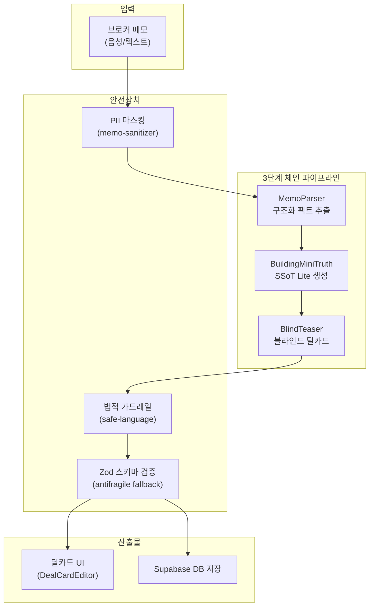

# 딜카드 시스템 정밀 감사 보고서

> **감사 일자**: 2026-08-10  
> **감사 범위**: 매각 딜카드 · 임대 딜카드 · 펀딩 프로젝트 카드 파이프라인 전체  
> **타깃 소비자**: 50대 CRE 중개인, 40대 대기업 건물자산관리 담당자, 60대 전문 매수자

---

## 1. 전체 아키텍처 요약



---

## 2. 감사 결과 요약 대시보드

| 심각도 | 건수 | 상용화 영향 |
|:---:|:---:|:---|
| 🔴 **CRITICAL** | **2건** | 법적 리스크 + 파이프라인 크래시 가능 |
| 🟠 **HIGH** | **2건** | UI 품질 저하 + 타깃 사용자 경험 손상 |
| 🟡 **MEDIUM** | **2건** | 부분적 데이터 노출 + 포맷 불일치 |
| 🟢 **LOW** | **1건** | 미세한 UX 불편 |

---

## 3. CRITICAL 이슈 상세

### 🔴 C-1: 임대·펀딩 파이프라인 법적 가드레일 미적용

| 항목 | 상세 |
|:---|:---|
| **파일** | `lease-deal-card.ts`, `funding-project-card.ts` |
| **현상** | `rewriteUnsafeText()` (safe-language.ts) 미호출 |
| **영향** | LLM이 "수익률 보장", "원금 보장" 등 금지 문구 생성 시 **자본시장법 위반** 가능 |
| **비교** | `broker-deal-card.ts`는 정상 적용 중 |

**위험 시나리오**: 
```
브로커 메모: "연 8% 확정 수익, 원금 보장 상품"
→ LLM이 그대로 펀딩 블라인드 티저에 반영
→ 60대 매수자가 확인 → 법적 분쟁 발생
```

**개선 방안**:
```diff
// funding-project-card.ts
+ import { rewriteUnsafeText } from "../safe-language";
  const teaser = await callLLM(...);
+ const safeTeaser = rewriteUnsafeText(teaser.content);
```

---

### 🔴 C-2: 임대·펀딩 파이프라인 JSON 파싱 취약점

| 항목 | 상세 |
|:---|:---|
| **파일** | `lease-deal-card.ts`, `funding-project-card.ts` |
| **현상** | `JSON.parse(content)` 직접 호출 + Zod `.parse()` 사용 |
| **영향** | LLM이 ` ```json ``` ` 마크다운 래핑 시 **전체 파이프라인 크래시 (500 에러)** |
| **비교** | `broker-deal-card.ts`는 `extractJsonString()` + `.safeParse()` + 수동 복구 로직 |

**위험 시나리오**:
```
LLM 응답: "```json\n{...}\n```"
→ JSON.parse() 실패 → uncaught exception
→ 브로커 화면에 "서버 오류" 표시
→ 50대 브로커: "이 시스템 못 쓰겠다"
```

**개선 방안**:
- `extractJsonString()` + `.safeParse()` + 수동 복구 로직을 **공통 유틸리티**로 추출
- 임대·펀딩 파이프라인에 일괄 적용

---

## 4. HIGH 이슈 상세

### 🟠 H-1: v3 마케팅 필드 파리티 누락 (임대·펀딩)

| 항목 | 상세 |
|:---|:---|
| **현상** | `BlindTeaserOutputSchema`에는 `hookCopy`, `structureChips`, `vacancyLabel`, `curiosityHook` 존재 |
| **문제** | `LeaseBlindTeaserOutputSchema`, `FundingBlindTeaserOutputSchema`에는 미포함 |
| **영향** | DealCardEditor UI에서 임대·펀딩 카드가 **핵심 마케팅 칩이 비어있는 상태**로 렌더링 |

**타깃 영향**: 60대 매수자는 한눈에 스캔 가능한 정보 칩(`structureChips`)에 크게 의존. 이 정보가 없으면 카드 자체의 매력도가 급감.

### 🟠 H-2: 딜카드 타입별 UI 렌더링 불일치

| 딜카드 유형 | hookCopy | structureChips | vacancyLabel | 상태 |
|:---|:---:|:---:|:---:|:---|
| 매각 | ✅ | ✅ | ✅ | 정상 |
| 임대 | ❌ | ❌ | ❌ | 빈 칸 렌더링 |
| 펀딩 | ❌ | ❌ | ❌ | 빈 칸 렌더링 |

---

## 5. MEDIUM 이슈 상세

### 🟡 M-1: PII 마스킹 커버리지 부족

| 패턴 | 현재 마스킹 | 누락 |
|:---|:---:|:---:|
| `123-4` (일반 지번) | ✅ | — |
| `산 15번지` | ❌ | 🟡 누락 |
| `역삼동 123번지` | ❌ | 🟡 누락 |
| `123번지 일대` | ❌ | 🟡 누락 |

**영향**: 블라인드 딜카드에 정확한 주소가 노출될 가능성

### 🟡 M-2: 금액 포맷 일관성

| 필드 | AI 출력 | UI 기대 | 불일치 |
|:---|:---|:---|:---:|
| `askingPriceManwon` | 숫자 (만원) | "XX억 XX만원" | 🟡 변환 필요 |

---

## 6. LOW 이슈

### 🟢 L-1: 가격 미입력 시 폴백 텍스트

- `TeaserHeroHeader`에서 가격이 없을 때 `"가격 확인 중"` 표시
- 60대 매수자에게는 "미정" 또는 "협의" 표현이 더 친숙

---

## 7. 상용화 품질 판정

| 파이프라인 | 상용화 가능? | 근거 |
|:---|:---:|:---|
| **매각 딜카드** | ✅ 가능 (조건부) | 가드레일·폴백 완비. 마이너 포맷 이슈만 잔존 |
| **임대 딜카드** | ⚠️ 조건부 | C-1, C-2 해결 필수. v3 필드 추가 권장 |
| **펀딩 카드** | ❌ 불가 | C-1 미해결 시 **법적 리스크**. C-2도 필수 |

---

## 8. 오류 발생 가능 체크포인트

| # | 체크포인트 | 발생 조건 | 예상 빈도 | 심각도 |
|:---:|:---|:---|:---:|:---:|
| 1 | LLM 응답 마크다운 래핑 | 프롬프트 무시 시 | 5~10% | 🔴 |
| 2 | Zod 필수 필드 누락 | 메모가 2~3줄일 때 | 15~20% | 🔴 |
| 3 | 금지 문구 LLM 생성 | 투자형 매물 메모 | 3~5% | 🔴 |
| 4 | PII 주소 노출 | "번지" 패턴 포함 메모 | 10~15% | 🟡 |
| 5 | 수치 파싱 실패 | "약 50억" 등 비정형 입력 | 5~10% | 🟡 |
| 6 | 캐시 폴백 반환 | OpenAI 장애 시 | 1% 미만 | 🟢 |
| 7 | 타임아웃 (30초) | 복잡한 메모 + 네트워크 지연 | 2~3% | 🟢 |

---

## 9. 우선순위별 개선 로드맵

| 순서 | 작업 | 소요 시간 | 효과 |
|:---:|:---|:---:|:---|
| 1 | C-1: 임대·펀딩 가드레일 추가 | 1시간 | 법적 리스크 제거 |
| 2 | C-2: JSON 파싱 공통 유틸 추출·적용 | 2시간 | 파이프라인 안정성 확보 |
| 3 | H-1: v3 스키마·프롬프트 확장 | 3시간 | 임대·펀딩 UI 품질 동등화 |
| 4 | M-1: 번지 패턴 마스킹 보강 | 30분 | PII 보호 강화 |
| 5 | M-2: 금액 포맷 헬퍼 통합 | 1시간 | 숫자 표시 일관성 |
