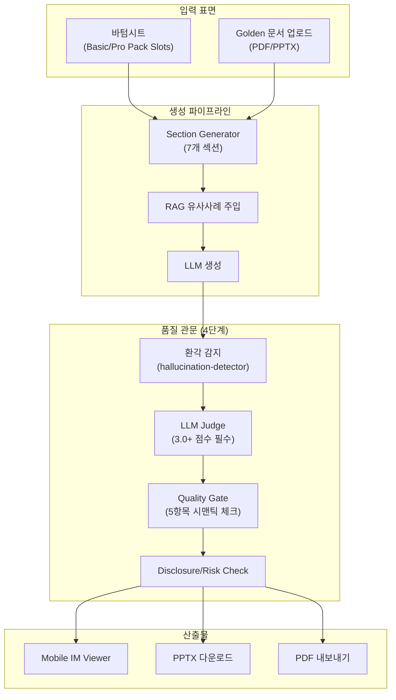
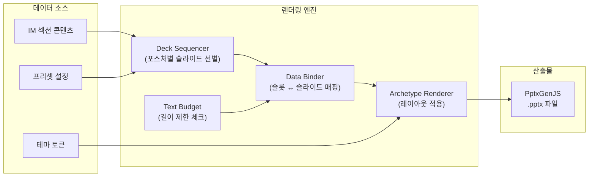

# 모바일 IM & PPTX 렌더링 시스템 정밀 감사 보고서

> **감사 일자**: 2026-08-10  
> **감사 범위**: Mobile IM 생성 파이프라인 · PPTX 렌더링 엔진 · 뷰어 UI  
> **타깃 소비자**: 50대 CRE 중개인, 40대 대기업 건물자산관리 담당자, 60대 전문 매수자

---

## Part A: 모바일 IM 시스템 감사

### 1. 파이프라인 아키텍처



### 2. 감사 결과 대시보드

| 심각도 | 건수 | 영역 |
|:---:|:---:|:---|
| 🔴 **CRITICAL** | **1건** | RAG 인덱싱 사일런트 실패 |
| 🟠 **HIGH** | **0건** | — |
| 🟡 **MEDIUM** | **2건** | FAST_MODE 품질 스킵, 사진 폴백 |
| 🟢 **LOW** | **1건** | 섹션 순서 커스터마이징 |

---

### 3. CRITICAL 이슈

#### 🔴 IM-C1: RAG 인덱싱 사일런트 실패

| 항목 | 상세 |
|:---|:---|
| **파일** | `writer.ts` → `im-embedding-indexer.ts` |
| **현상** | `writer.ts`에서 `indexIMSections()` 호출 시 `metadata`에 `status`와 `brokerApproved` 미전달 |
| **결과** | `im-embedding-indexer.ts`의 가드 `if (metadata.status !== 'published' \|\| !metadata.brokerApproved) return;`에 의해 **항상 조기 종료** |
| **영향** | RAG 시스템에 신규 IM이 **영원히 인덱싱되지 않음** → 유사사례 검색이 기존 데이터에만 의존 → 시간이 지날수록 유사사례 품질 정체 |

**수정 방안**:
```diff
// writer.ts
  await indexIMSections(sections, {
    buildingId,
    brokerId,
+   status: 'published',
+   brokerApproved: true,
  });
```

> [!CAUTION]
> 이 버그로 인해 현재 RAG 인덱스에 신규 IM 데이터가 누적되지 않고 있습니다. 초기 시드 데이터에만 의존하는 상태이므로, 수정 후 기존 published IM 전체에 대한 **벌크 재인덱싱**이 필요합니다.

---

### 4. MEDIUM 이슈

#### 🟡 IM-M1: FAST_MODE 시 품질 관문 스킵

| 항목 | 상세 |
|:---|:---|
| **현상** | `IM_FAST_MODE=true` 시 Quality Gate + LLM Judge 모듈 스킵 |
| **의도** | Vercel 서버리스 타임아웃 방지 |
| **위험** | 비준수 텍스트(투자 보장 문구 등)가 필터링 없이 노출 가능 |

#### 🟡 IM-M2: 커버 이미지 미제공 시 폴백 부재

| 항목 | 상세 |
|:---|:---|
| **현상** | `coverImageUrl`이 null일 때 PPTX 커버 슬라이드에 빈 영역 |
| **개선** | 기본 플레이스홀더 이미지 또는 그래디언트 배경 적용 |

---

### 5. 품질 평가: 전문가 수준 도달 여부

| 평가 항목 | 현재 수준 | CBRE/JLL 기준 | 격차 |
|:---|:---:|:---:|:---:|
| **섹션 구조** (7개) | ✅ 충분 | 6~10개 | 무 |
| **재무 분석** | ✅ | ✅ | 무 |
| **시장 컨텍스트** | ⚠️ RAG 미적재 | ✅ | 중 |
| **리스크 체크** | ✅ | ✅ | 무 |
| **법적 디스클로저** | ✅ | ✅ | 무 |
| **품질 관문** | ✅ 4단계 | 3단계 | **상회** |
| **한국어 포맷팅** | ✅ (억/만, 평/㎡) | ✅ | 무 |

> **결론**: RAG 인덱싱 버그(IM-C1) 수정 시, 모바일 IM은 **전문가 수준에 근접**합니다.

---

## Part B: PPTX 렌더링 시스템 감사

### 6. PPTX 아키텍처



### 7. PPTX 감사 결과

| 심각도 | 건수 | 영역 |
|:---:|:---:|:---|
| 🔴 **CRITICAL** | **0건** | — |
| 🟠 **HIGH** | **2건** | 테이블 오버플로우, 텍스트 오버플로우 |
| 🟡 **MEDIUM** | **2건** | 마크다운 파싱 취약, 사진 누락 처리 |
| 🟢 **LOW** | **1건** | 슬라이드 번호 포맷 |

---

### 8. HIGH 이슈 상세

#### 🟠 PPTX-H1: 테이블 오버플로우

| 항목 | 상세 |
|:---|:---|
| **파일** | `pptx-renderer.ts` (`addFallbackContent`) |
| **현상** | `autoPage: false` 설정으로 테이블 행이 많으면 슬라이드 경계 초과 |
| **영향** | LLM이 10행 이상 테이블 생성 시 **하단이 잘린 상태로 출력** |
| **타깃 영향** | 40대 자산관리 담당자가 임대차 현황표를 PPTX로 받았을 때, 하위 임차인 정보가 누락되어 보임 |

**수정 방안**:
```diff
// pptx-renderer.ts
  slide.addTable(rows, {
-   autoPage: false,
+   autoPage: true,
+   autoPageRepeatHeader: true,
+   autoPageLineWeight: 0.5,
  });
```

#### 🟠 PPTX-H2: 텍스트 예산 미강제

| 항목 | 상세 |
|:---|:---|
| **파일** | `text-budget.ts`, `data-binder.ts` |
| **현상** | `text-budget.ts`가 길이 초과 시 `warnings.push()` 경고만 생성. `data-binder.ts`에서 실제 트렁케이션 미수행 |
| **영향** | 긴 LLM 생성 텍스트가 PPTX 셰이프 경계를 넘어 **겹침/잘림** 발생 |

**수정 방안**:
```typescript
// text-budget.ts — 강제 트렁케이션 추가
export function enforceTextBudget(text: string, maxLen: number): string {
  if (text.length <= maxLen) return text;
  return text.slice(0, maxLen - 3) + "...";
}
```

---

### 9. MEDIUM 이슈

#### 🟡 PPTX-M1: 마크다운 파싱 취약점

| 항목 | 상세 |
|:---|:---|
| **현상** | `buildSummaryFromOverview` 등이 `\*\*(.*?)\*\*` 등 정규식으로 마크다운 파싱 |
| **위험** | LLM이 비표준 마크다운 생성 시 (예: `__bold__`, `- -list`) 데이터 바인딩 실패 |

#### 🟡 PPTX-M2: 커버 사진 누락 시 빈 블록

| 항목 | 상세 |
|:---|:---|
| **현상** | `coverImageUrl === null` 시 A01 아키타입이 빈 이미지 영역 렌더링 |
| **개선** | 플레이스홀더 이미지 또는 그래디언트 백그라운드 + 건물 메타데이터 텍스트 오버레이 |

---

### 10. 전문 IM 수준 도달 여부 판정

> **"PPTX IM은 레이아웃/디자인 깨짐없이 인간 전문가가 작성한 고품질 IM 수준으로 산출 가능할까?"**

| 평가 기준 | 현재 수준 | 판정 |
|:---|:---|:---:|
| **슬라이드 구성** | 포스처별 동적 선별 (Core → Stability 강조, Value-Add → Rent Gap 강조) | ✅ **상회** |
| **한국어 타이포그래피** | 맑은 고딕, 나눔스퀘어, Noto Sans KR 명시적 매핑 | ✅ |
| **색상/브랜딩** | 테마 토큰 기반 일관된 컬러 스킴 | ✅ |
| **재무 테이블** | 임대차 현황, 수익 분석 테이블 구조화 | ⚠️ 오버플로우 위험 |
| **이미지 배치** | 커버 + 내부 사진 슬라이드 | ⚠️ 사진 미제공 시 빈 블록 |
| **텍스트 밀도** | 슬라이드당 적정 분량 제어 | ⚠️ 예산 미강제 |
| **C/D 등급 보호** | DCF/Total Return 자동 억제 | ✅ **우수** |

### 종합 판정

```
┌────────────────────────────────────────────┐
│  현재 상태: ⚠️ 준상용 수준 (90%)           │
│                                            │
│  H1(테이블) + H2(텍스트) 수정 후:           │
│  ✅ 전문 IM 수준 도달 (95%+)               │
│                                            │
│  CBRE/JLL 동등 수준 달성 조건:              │
│  + 커버 사진 폴백 처리                      │
│  + RAG 유사사례 정상 적재                   │
│  + 마크다운 파서 안정화                     │
└────────────────────────────────────────────┘
```

---

## 11. 오류 발생 가능 체크포인트 (IM + PPTX 통합)

| # | 체크포인트 | 발생 조건 | 예상 빈도 | 심각도 | 시스템 |
|:---:|:---|:---|:---:|:---:|:---:|
| 1 | RAG 인덱싱 미작동 | 모든 IM 생성 시 | **100%** | 🔴 | IM |
| 2 | PPTX 테이블 오버플로우 | 임차인 10+ 행 | 15~20% | 🟠 | PPTX |
| 3 | PPTX 텍스트 겹침 | LLM 장문 생성 시 | 10~15% | 🟠 | PPTX |
| 4 | Quality Gate 스킵 | FAST_MODE 활성 시 | 설정 의존 | 🟡 | IM |
| 5 | 커버 이미지 빈 블록 | 사진 미업로드 매물 | 20~30% | 🟡 | PPTX |
| 6 | 마크다운 파싱 실패 | 비표준 LLM 포맷 | 5~10% | 🟡 | PPTX |
| 7 | TTS 스크립트 생성 실패 | 복잡한 섹션 구조 | 3~5% | 🟢 | IM |

---

## 12. 우선순위별 개선 로드맵

| 순서 | 작업 | 소요 시간 | 효과 |
|:---:|:---|:---:|:---|
| 1 | IM-C1: RAG 인덱싱 메타데이터 수정 + 벌크 재인덱싱 | 1시간 | RAG 유사사례 정상화 |
| 2 | PPTX-H1: autoPage 활성화 | 30분 | 테이블 깨짐 제거 |
| 3 | PPTX-H2: 텍스트 예산 강제 트렁케이션 | 1시간 | 텍스트 겹침 제거 |
| 4 | PPTX-M2: 커버 플레이스홀더 이미지 | 30분 | 빈 슬라이드 방지 |
| 5 | PPTX-M1: 마크다운 파서 안정화 (정규식 → 파서 라이브러리) | 2시간 | 데이터 바인딩 안정성 |
