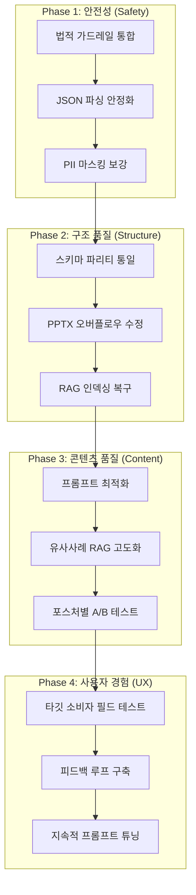
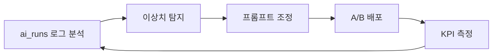

# AI-Pair 코딩 단계별 점검·개선 절차

> **목적**: 딜카드 · 모바일 IM · PPTX 산출물의 상용화 품질 달성을 위한 체계적 점검·개선 워크플로우  
> **대상**: AI 에이전트 + 인간 개발자 협업 (AI-Pair Coding)

---

## 1. 전체 개선 프레임워크



---

## 2. Phase 1: 안전성 (즉시 실행 — 4시간)

### Step 1-1: 법적 가드레일 통합

**작업 내용**:
- `rewriteUnsafeText()` (safe-language.ts) 를 임대·펀딩 파이프라인에 적용
- 펀딩 전용 `FUNDING_FORBIDDEN_PHRASES` 스캔 추가

**AI-Pair 절차**:
```
1. AI: safe-language.ts의 현재 금지 문구 리스트 분석
2. 인간: 한국 자본시장법 추가 금지 표현 검토·보완
3. AI: lease-deal-card.ts, funding-project-card.ts에 가드레일 코드 삽입
4. 인간: 테스트 메모 5건으로 E2E 확인 (금지 문구 포함 메모)
5. AI: 단위 테스트 작성
```

**검증 기준**: 금지 문구가 포함된 메모 입력 시 100% 차단 또는 안전 대체어로 변환

---

### Step 1-2: JSON 파싱 안정화

**작업 내용**:
- `extractJsonString()` + `.safeParse()` + 수동 복구 로직을 **공통 유틸** (`ai-response-parser.ts`)로 추출
- 임대·펀딩 파이프라인에 일괄 적용

**AI-Pair 절차**:
```
1. AI: broker-deal-card.ts의 JSON 복구 로직 분석·추출
2. AI: ai-response-parser.ts 공통 유틸 생성
3. AI: lease-deal-card.ts, funding-project-card.ts 리팩터링
4. 인간: edge case 메모(2줄, 비정형, 영문 혼합) 5건 테스트
5. AI: 마크다운 래핑 응답 시뮬레이션 테스트 작성
```

**검증 기준**: ```` ```json ``` ```` 래핑된 LLM 응답도 100% 정상 파싱

---

### Step 1-3: PII 마스킹 보강

**작업 내용**:
- `memo-sanitizer.ts` 정규식에 "번지", "산 N번지" 패턴 추가
- 블라인드 딜카드 출력 후 주소 패턴 2차 스캔 추가

**AI-Pair 절차**:
```
1. AI: 현재 정규식 패턴 분석 + 한국 CRE 주소 패턴 연구
2. 인간: 실제 브로커 메모 샘플에서 누락 패턴 추출
3. AI: 정규식 확장 + 테스트 케이스 20건 작성
4. 인간: 실전 메모로 false positive/negative 검증
```

---

## 3. Phase 2: 구조 품질 (3일)

### Step 2-1: 스키마 파리티 통일

**작업 내용**:
- `LeaseBlindTeaserOutputSchema`, `FundingBlindTeaserOutputSchema`에 v3 마케팅 필드 추가
- 해당 프롬프트에 v3 필드 생성 지시 추가

**AI-Pair 절차**:
```
1. AI: BlindTeaserOutputSchema의 v3 필드 전체 목록 추출
2. AI: 임대/펀딩 스키마에 동일 필드 추가 (optional)
3. AI: 임대/펀딩 프롬프트에 v3 필드 생성 지시 추가
4. 인간: 생성된 카드의 UI 렌더링 품질 시각 확인
5. AI: 스냅샷 테스트 업데이트
```

### Step 2-2: PPTX 오버플로우 수정

**작업 내용**:
- 테이블 `autoPage: true` 활성화 + 헤더 반복
- `text-budget.ts`에 강제 트렁케이션 로직 추가
- `data-binder.ts`에서 바인딩 시 예산 강제

**AI-Pair 절차**:
```
1. AI: pptx-renderer.ts 테이블 설정 수정
2. AI: text-budget.ts에 enforceTextBudget() 구현
3. AI: data-binder.ts에서 모든 텍스트 바인딩에 적용
4. 인간: 10행+ 테이블, 2000자+ 텍스트로 PPTX 생성 테스트
5. 인간: 실제 PPTX 파일 열어서 레이아웃 깨짐 확인
```

### Step 2-3: RAG 인덱싱 복구

**작업 내용**:
- `writer.ts`에서 `indexIMSections()` 호출 시 올바른 메타데이터 전달
- 기존 published IM 전체 벌크 재인덱싱 스크립트 작성

**AI-Pair 절차**:
```
1. AI: writer.ts 메타데이터 전달 코드 수정
2. AI: 벌크 재인덱싱 마이그레이션 스크립트 작성
3. 인간: 스테이징 환경에서 재인덱싱 실행
4. AI: 인덱싱 후 RAG 검색 결과 비교 (before/after)
```

---

## 4. Phase 3: 콘텐츠 품질 (1주)

### Step 3-1: 프롬프트 최적화

**AI-Pair 절차**:
```
1. AI: 현재 프롬프트 버전별 ai_runs 성공률/점수 분석
2. 인간: 타깃 소비자(60대 매수자) 입장에서 생성 결과 평가
3. AI: 프롬프트 A/B 변형 3개 생성 (문체·정보밀도·길이)
4. 인간: 각 변형의 산출물을 실제 부동산 전문가에게 블라인드 평가 요청
5. AI: 승리 변형을 새 프롬프트 버전으로 승격 (v2 → v3)
```

### Step 3-2: RAG 유사사례 고도화

**AI-Pair 절차**:
```
1. AI: 현재 RAG 쿼리 분석 (topK=2, 지역+자산유형 필터)
2. AI: 거래 시점 필터, 규모 범위 필터, 포스처 필터 추가 구현
3. AI: 유사사례 주입 전후 IM 품질 비교 테스트
4. 인간: 실제 브로커에게 유사사례 적절성 피드백 수집
```

### Step 3-3: 포스처별 A/B 테스트

**AI-Pair 절차**:
```
1. AI: 8개 포스처별 테스트 메모 세트 준비 (포스처당 3건)
2. AI: 전체 24건 E2E 실행 → 딜카드 + IM + PPTX 생성
3. 인간: 각 산출물을 포스처 전문가에게 평가 요청
4. AI: 평가 결과 기반 프롬프트/스키마 조정
```

---

## 5. Phase 4: 사용자 경험 (2주)

### Step 4-1: 타깃 소비자 필드 테스트

```
1. 50대 CRE 중개인 3명에게 딜카드 생성 워크플로우 테스트
2. 40대 자산관리 담당자 2명에게 PPTX IM 품질 평가
3. 60대 전문 매수자 2명에게 블라인드 딜카드 가독성 평가
4. 피드백 수집 → 이슈 분류 → Phase 1~3 반복
```

### Step 4-2: 지속적 개선 루프



**KPI 목표**:
| 지표 | 현재 추정 | 목표 |
|:---|:---:|:---:|
| 딜카드 생성 성공률 | ~85% | 99%+ |
| IM Judge 평균 점수 | ~3.5/5 | 4.0+/5 |
| PPTX 레이아웃 정상률 | ~80% | 98%+ |
| 브로커 재사용률 | 미측정 | 70%+ |
| 매수자 피드백 만족도 | 미측정 | 4.0+/5 |

---

## 6. 효율적 AI-Pair 세션 운영 가이드

### 세션 구조 (2시간 단위)

| 시간 | 활동 | 주체 |
|:---|:---|:---|
| 0~10분 | 이전 세션 결과 리뷰 + 오늘 목표 설정 | 인간 |
| 10~50분 | AI 코드 작성 + 인간 실시간 리뷰 | 공동 |
| 50~70분 | 자동 테스트 실행 + 결과 분석 | AI |
| 70~90분 | 수동 검증 (UI/PPTX 육안 확인) | 인간 |
| 90~110분 | 이슈 기록 + 다음 세션 계획 | 공동 |
| 110~120분 | 스테이징 배포 + 정리 | AI |

### 세션별 산출물 체크리스트

```markdown
- [ ] 코드 변경사항 커밋 완료
- [ ] 단위 테스트 통과
- [ ] npm run build 성공
- [ ] 변경 영향 범위 문서화
- [ ] 다음 세션 TODO 기록
```

---

## 7. 전체 개선 소요 시간 추정

| Phase | 소요 시간 | AI-Pair 세션 수 |
|:---:|:---|:---:|
| 1: 안전성 | 4시간 | 2회 |
| 2: 구조 품질 | 12시간 | 6회 |
| 3: 콘텐츠 품질 | 20시간 | 10회 |
| 4: 사용자 경험 | 40시간 | 20회 |
| **합계** | **76시간** | **38회** |

> [!TIP]
> Phase 1~2 (16시간, 8회 세션)만 완료해도 **상용 배포 최소 기준**에 도달합니다. Phase 3~4는 지속적 품질 개선을 위한 반복 과정입니다.
