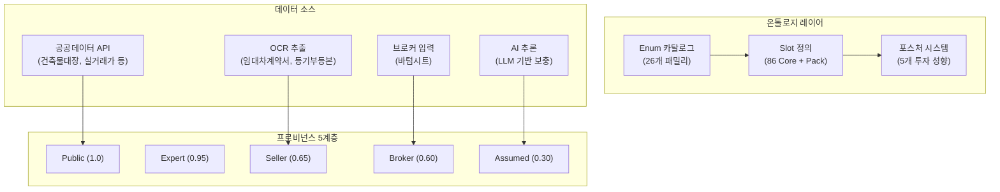
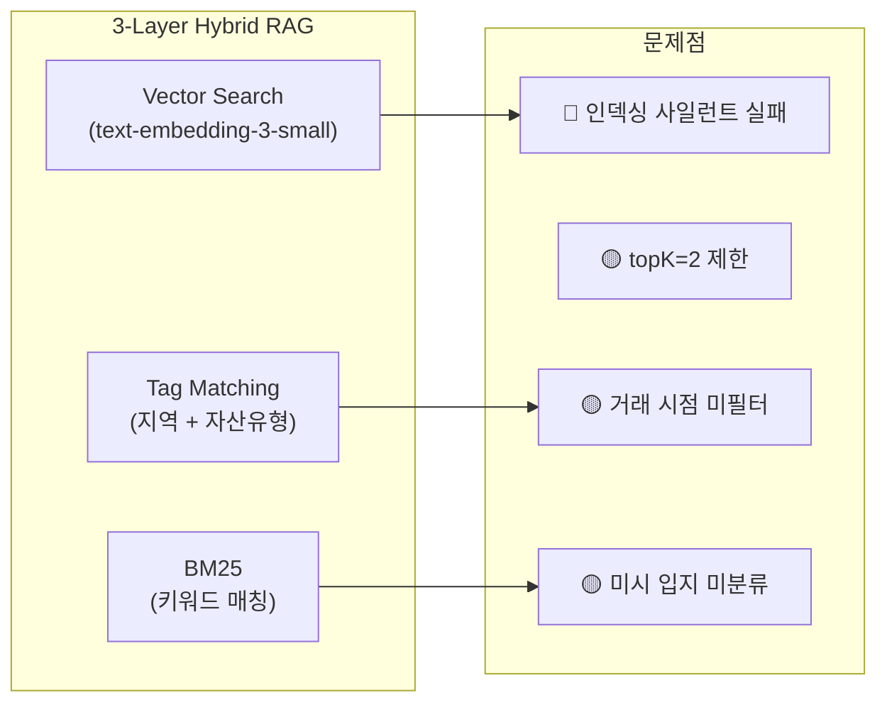
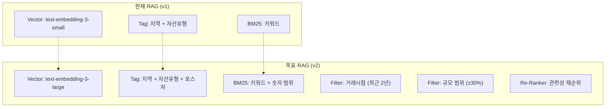
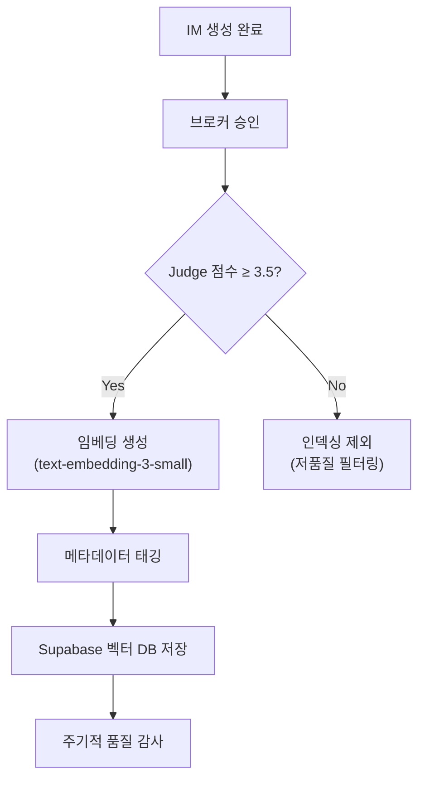

# 온톨로지 SSoT & RAG 시스템 관리 방안

> **목적**: 한국 CRE 실정에 정합하는 상용급 문서(딜카드·IM·PPTX) 생성을 위한 온톨로지 SSoT 및 RAG 시스템의 체계적 관리 방안  
> **타깃**: 50대 CRE 중개인, 40대 대기업 건물자산관리 담당자, 60대 전문 매수자

---

## 1. 현재 아키텍처 진단

### 1.1 온톨로지 SSoT 현황



| 항목 | 현재 수준 | 상용화 기준 | 격차 |
|:---|:---:|:---:|:---:|
| Enum 커버리지 | 26개 패밀리 | ✅ 충분 | 무 |
| Slot 수 | 163개 | ✅ 충분 | 무 |
| 자산유형 | 17종 | ✅ 충분 | 무 |
| 포스처 분류 | 5종 | ✅ 충분 | 무 |
| 임대 구조 모델링 | 기본 3필드 | ⚠️ 부족 | 중 |
| 세금/부채 모델 | 기본 취득세만 | ⚠️ 부족 | 중 |
| 데이터 신선도 검증 | 미구현 | ❌ 필요 | 고 |
| 프로비넌스 추적 | 5계층 | ✅ 우수 | 무 |

### 1.2 RAG 시스템 현황



---

## 2. 온톨로지 SSoT 관리 방안

### 2.1 Slot 확장 로드맵

#### Phase 1: 임대 구조 고도화 (우선)

현재 3개 필드(`grossAnnualIncomeKrw`, `monthlyRentKrw`, `totalDepositKrw`)로는 한국 CRE 실무의 복잡한 임대차 구조를 정확히 표현할 수 없습니다.

**추가 필요 Slot**:

| Slot | 타입 | 용도 | 대상 소비자 |
|:---|:---|:---|:---|
| `leaseStructureType` | Enum | 전세/월세/보증금+월세/순수월세 | 전체 |
| `rentFreeMonths` | number | 렌트프리 기간 (개월) | 자산관리 담당자 |
| `stepRentSchedule` | JSON | 연차별 증액 스케줄 | 자산관리 담당자 |
| `tiAllowanceKrw` | number | TI(Tenant Improvement) 보조금 | 자산관리 담당자 |
| `commonAreaRatio` | number | 전용률(%) | 전체 |
| `maintenanceFeeKrw` | number | 관리비 (원/㎡/월) | 전체 |
| `parkingFeeKrw` | number | 주차비 (원/대/월) | 중개인 |

#### Phase 2: 세금·부채 모델 확장

| Slot | 타입 | 용도 | 대상 소비자 |
|:---|:---|:---|:---|
| `acquisitionTaxRate` | number | 취득세율 (법인/개인 구분) | 전문 매수자 |
| `comprehensiveRealEstateTaxKrw` | number | 종합부동산세 | 전문 매수자 |
| `propertyTaxKrw` | number | 재산세 | 전문 매수자 |
| `existingLoanBalance` | number | 기존 담보대출 잔액 | 전문 매수자 |
| `loanToValueRatio` | number | LTV(%) | 전문 매수자 |
| `debtServiceCoverageRatio` | number | DSCR | 자산관리 담당자 |

#### Phase 3: 규제·인허가 확장

| Slot | 타입 | 용도 |
|:---|:---|:---|
| `rezoningPossibility` | Enum | 용도변경 가능성 (확정/추진중/불가) |
| `developmentRightsTransfer` | boolean | 개발권 이전 여부 |
| `historicPreservation` | boolean | 역사·문화재 보존 지구 |
| `greenBuildingCert` | Enum | 녹색건축인증 등급 |
| `energyEfficiencyGrade` | Enum | 에너지효율등급 (1++~7) |

---

### 2.2 데이터 신선도(Freshness) 관리

> [!WARNING]
> 현재 Grade Engine은 문서의 **존재 여부**만 체크합니다. 5년 전 임대차 현황표도 25점을 부여합니다. 상용화를 위해서는 데이터 신선도 검증이 필수입니다.

**구현 방안**:

```typescript
// 신선도 검증 로직 (제안)
interface FreshnessPolicy {
  documentType: string;
  maxAgeMonths: number;
  warningAgeMonths: number;
  scoreDecay: (ageMonths: number) => number;
}

const FRESHNESS_POLICIES: FreshnessPolicy[] = [
  {
    documentType: "rent_roll",
    maxAgeMonths: 6,      // 6개월 이상 시 무효
    warningAgeMonths: 3,  // 3개월 경고
    scoreDecay: (age) => Math.max(0, 1 - (age / 6) * 0.5),
  },
  {
    documentType: "building_register",
    maxAgeMonths: 12,
    warningAgeMonths: 6,
    scoreDecay: (age) => Math.max(0, 1 - (age / 12) * 0.3),
  },
  {
    documentType: "registry_docs",
    maxAgeMonths: 3,      // 등기부등본은 3개월 이상 시 무효
    warningAgeMonths: 1,
    scoreDecay: (age) => Math.max(0, 1 - (age / 3) * 0.7),
  },
];
```

**적용 방법**:
1. Layer Score Engine에 `lastUpdated` 날짜 필드 추가
2. 각 문서 유형별 감쇠 함수 적용
3. UI에 "⚠️ 3개월 전 자료" 경고 배지 표시
4. 등기부등본 3개월 초과 시 "갱신 필요" 잠금

---

### 2.3 포스처 오버레이 관리 체계

현재 5개 포스처별 특화 프롬프트가 잘 구현되어 있으나, **관리 체계**가 필요합니다:

```
포스처 프롬프트 버전 관리 체계
├── 임대수익형 (Income) ─── v3.2 (2026-08)
│   ├── 강조: Cap Rate, NOI, 임차인 신용도
│   └── 억제: 개발 잠재력, 철거 가능성
├── 자가사용형 (Owner-Use) ─── v2.1 (2026-07)
│   ├── 강조: 교통 접근성, 주차, 층별 레이아웃
│   └── 억제: 수익률, 임차인 현황
├── 개발형 (Development) ─── v3.0 (2026-08)
│   ├── 강조: 용도지역, 건폐율/용적률, 인근 시세
│   └── 억제: 현 수익, 기존 임차인
├── 운영형 (Operational) ─── v2.0 (2026-06)
│   ├── 강조: OPEX, 관리비, 에너지효율
│   └── 억제: 매각가, 시세 차익
└── 단기매매형 (Flip) ─── v2.5 (2026-07)
    ├── 강조: 매입가 대비 시세, 급매 사유, 권리관계
    └── 억제: 장기 수익률, DCF
```

**관리 원칙**:
1. 각 포스처 프롬프트에 **버전 번호** 명시
2. 변경 시 `CHANGELOG.md`에 변경 사유 기록
3. A/B 테스트 후 승격 (v2 → v3)
4. 분기별 CRE 전문가 리뷰

---

## 3. RAG 시스템 관리 방안

### 3.1 긴급 수정: 인덱싱 복구

> [!CAUTION]
> 현재 RAG 인덱싱이 **100% 실패** 상태입니다. `writer.ts` → `im-embedding-indexer.ts` 메타데이터 전달 누락.

**즉시 조치**:
```diff
// writer.ts
  await indexIMSections(sections, {
    buildingId,
    brokerId,
+   status: 'published',
+   brokerApproved: true,
  });
```

**후속 조치**: 기존 published IM 전체 벌크 재인덱싱

---

### 3.2 RAG 검색 품질 고도화

#### 현재 문제점

| 문제 | 영향 | 심각도 |
|:---|:---|:---:|
| topK=2 고정 | 유사사례 다양성 부족 | 🟡 |
| 거래 시점 미필터 | 5년 전 사례가 추천됨 | 🟠 |
| 지역 RegEx 매칭 | 미시 입지 구분 불가 (이면도로 vs 대로변) | 🟡 |
| 규모 미필터 | 50억 빌딩에 500억 사례 추천 | 🟠 |

#### 개선 방안



**RAG v2 구현 계획**:

```typescript
// 제안: 향상된 RAG 쿼리 인터페이스
interface EnhancedRAGQuery {
  // 기존
  embedding: number[];
  region: string;        // "강남구 역삼동"
  assetType: string;
  
  // 신규 필터
  transactionDateAfter?: string;  // "2024-01-01"
  priceRangeKrw?: {
    min: number;         // 대상 매물의 70%
    max: number;         // 대상 매물의 130%
  };
  grossAreaRange?: {
    min: number;         // 대상 매물의 70%
    max: number;         // 대상 매물의 130%
  };
  posture?: string;      // "임대수익형"
  
  // 검색 설정
  topK: number;          // 2 → 5로 확대
  reRankTopK: number;    // 최종 2~3건 선별
}
```

---

### 3.3 RAG 데이터 품질 관리

#### 인덱싱 파이프라인



#### 데이터 유지보수 정책

| 정책 | 주기 | 내용 |
|:---|:---|:---|
| **신선도 감사** | 월 1회 | 2년 이상 경과 유사사례 비활성화 |
| **품질 감사** | 분기 1회 | Judge 점수 3.0 미만 인덱스 삭제 |
| **임베딩 재생성** | 반기 1회 | 모델 업그레이드 시 전체 재임베딩 |
| **거래 데이터 갱신** | 월 1회 | 공공데이터 실거래가 자동 업데이트 |

---

### 3.4 Golden Document 관리

Golden Document는 인간 전문가가 작성한 최고 품질 IM으로, RAG의 **기준점(Anchor)**이 됩니다.

**관리 체계**:

```
Golden Document 관리 프로토콜
├── 수집 기준
│   ├── CBRE/JLL/Cushman 등 글로벌 브로커리지 IM
│   ├── 국내 대형 중개법인 IM (교보리얼코, 메이트플러스 등)
│   └── 실제 거래 완료 + 만족도 확인된 IM
├── 분류 체계
│   ├── 자산유형별 (오피스, 근생, 물류, 지산 등)
│   ├── 포스처별 (임대수익형, 개발형 등)
│   └── 규모별 (50억 미만, 50~200억, 200억 이상)
├── 품질 등급
│   ├── A급: 전문가 3인 이상 검증, 거래 완료
│   ├── B급: 전문가 1인 검증
│   └── C급: AI 생성 후 브로커 승인
└── 갱신 정책
    ├── A급: 영구 보존
    ├── B급: 2년마다 재검증
    └── C급: 1년마다 재검증 또는 자동 강등
```

**목표 Golden Document 수**:

| 자산유형 | 현재 | 목표 (1년) | 목표 (2년) |
|:---|:---:|:---:|:---:|
| 오피스 | ? | 20건 | 50건 |
| 근생빌딩 | ? | 15건 | 40건 |
| 물류센터 | ? | 10건 | 25건 |
| 지식산업센터 | ? | 10건 | 25건 |
| 기타 (주거 등) | ? | 5건 | 15건 |
| **합계** | ? | **60건** | **155건** |

---

## 4. 한국 CRE 실정 정합성 체크리스트

### 4.1 법적·규제 정합성

| 항목 | 현재 상태 | 필요 조치 |
|:---|:---:|:---|
| 용도지역 (21종) | ✅ 충분 | — |
| 지목 (28종) | ✅ 충분 | — |
| 인허가 (12종) | ✅ 충분 | — |
| 건폐율/용적률 | ✅ SSoT 포함 | — |
| 취득세 중과세 구분 | ⚠️ 단일 필드 | 법인/개인/다주택 구분 필요 |
| 종합부동산세 | ❌ 미포함 | Slot 추가 필요 |
| 양도소득세 시뮬레이션 | ❌ 미포함 | Phase 3 검토 |
| 임대사업자 등록 여부 | ❌ 미포함 | Slot 추가 권장 |

### 4.2 시장 데이터 정합성

| 데이터 소스 | 연동 상태 | AI 프롬프트 주입 | 개선 필요 |
|:---|:---:|:---:|:---|
| 건축물대장 | ✅ API 연동 | ✅ | — |
| 실거래가 | ✅ API 연동 | ⚠️ 일부 | 프롬프트 자동 주입 강화 |
| 공시지가 | ✅ API 연동 | ✅ | — |
| LURIS 토지이용계획 | ✅ API 연동 | ✅ | — |
| SEMAS 상권분석 | ✅ API 연동 | ❌ 미주입 | 근생빌딩 IM에 자동 주입 |
| 네이버 부동산 호가 | ⚠️ 크롤링 | ❌ 미주입 | 시세 비교 데이터로 활용 |
| 에너지효율등급 | ✅ API 연동 | ❌ 미주입 | ESG 섹션에 자동 주입 |

### 4.3 문서 포맷 정합성

| 포맷 항목 | 현재 | 한국 CRE 표준 | 일치 |
|:---|:---|:---|:---:|
| 면적 단위 | 평/㎡ 병기 | ✅ 병기 관행 | ✅ |
| 금액 단위 | 억/만원 | ✅ | ✅ |
| 수익률 표기 | % (연) | ✅ | ✅ |
| 임대료 단위 | 원/㎡/월 | ✅ 관행 | ✅ |
| 층별 표기 | B1F, 1F~10F | ✅ | ✅ |
| 날짜 형식 | YYYY.MM.DD | ✅ 관행 | ✅ |
| 주소 체계 | 도로명+지번 병기 | ⚠️ 도로명만 | 지번 병기 권장 |

---

## 5. 종합 관리 대시보드 (제안)

| KPI | 현재 | 목표 (3개월) | 목표 (1년) |
|:---|:---:|:---:|:---:|
| Slot 커버리지 | 163 | 185 (+22) | 210 (+47) |
| RAG 인덱스 건수 | 0 (🔴 버그) | 50+ | 200+ |
| Golden Document | ? | 30 | 60 |
| 데이터 신선도 검증 | ❌ 없음 | ✅ 구현 | ✅ 자동화 |
| 프로비넌스 정확도 | 95% | 98% | 99% |
| 공공데이터 자동 주입률 | 40% | 70% | 90% |
| IM Judge 평균 점수 | ~3.5/5 | 4.0/5 | 4.5/5 |

---

## 6. 실행 우선순위

| 순서 | 작업 | 소요 시간 | 영향도 |
|:---:|:---|:---:|:---|
| **1** | RAG 인덱싱 버그 수정 + 벌크 재인덱싱 | 1시간 | 🔴 RAG 전체 기능 복구 |
| **2** | 데이터 신선도 검증 로직 추가 | 3시간 | 🟠 문서 신뢰도 확보 |
| **3** | 임대 구조 Slot 확장 (7개) | 4시간 | 🟠 자산관리 담당자 만족도 |
| **4** | RAG 거래시점·규모 필터 추가 | 3시간 | 🟡 유사사례 적절성 향상 |
| **5** | SEMAS/에너지효율 프롬프트 자동 주입 | 2시간 | 🟡 IM 콘텐츠 풍부화 |
| **6** | Golden Document 수집 프로토콜 수립 | 2시간 | 🟡 장기 품질 기반 구축 |
| **7** | 세금/부채 Slot 확장 (6개) | 4시간 | 🟡 전문 매수자 NPV 분석 |
| **8** | 포스처 프롬프트 버전 관리 체계 도입 | 2시간 | 🟢 유지보수 효율화 |
