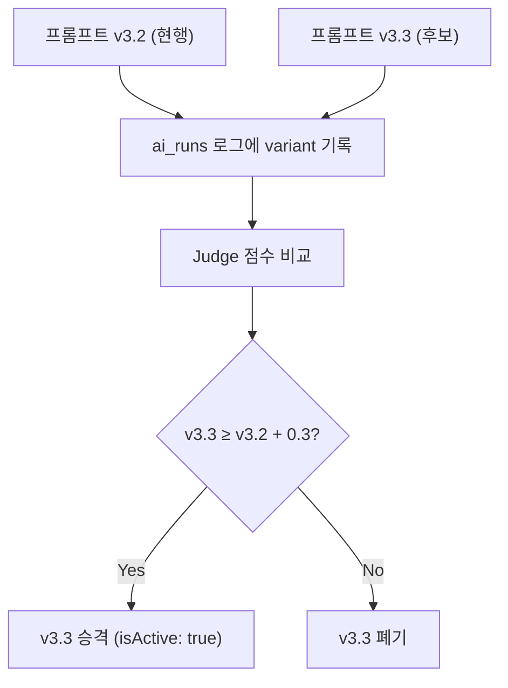
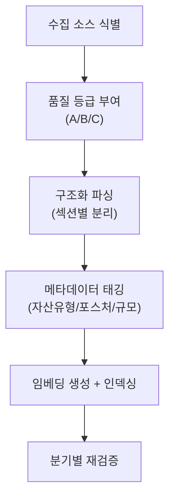
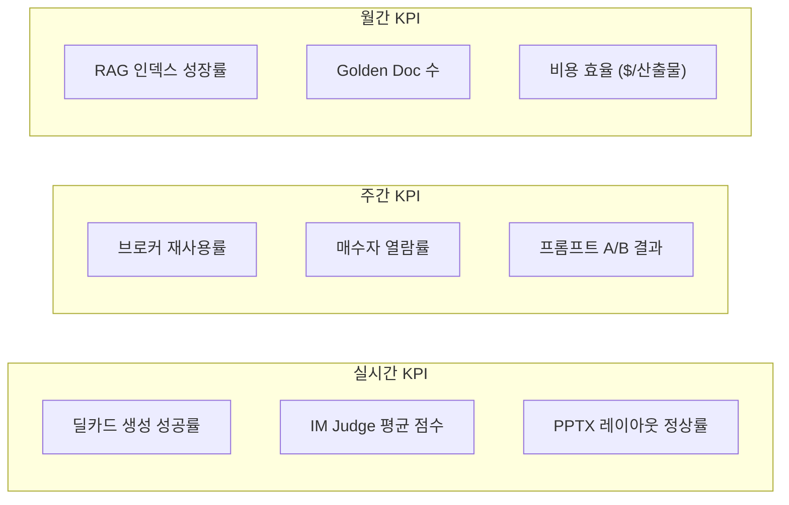
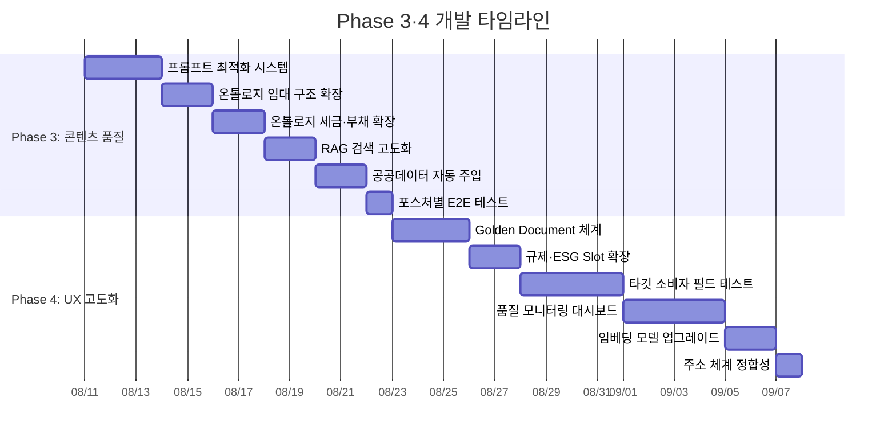

# 멀티페이즈 개발 계획 — Phase 3·4 (콘텐츠 품질 + UX·온톨로지·RAG 고도화)

> **범위**: Phase 1·2 완료 후 실행. 프롬프트 최적화, 온톨로지 확장, RAG 고도화, 타깃 소비자 검증  
> **예상 소요**: Phase 3 (24시간) + Phase 4 (40시간) = **총 64시간 / 32회 AI-Pair 세션**  
> **전제 조건**: Phase 1·2 완료 (CRITICAL·HIGH 이슈 0건)

---

## Phase 3: 콘텐츠 품질 고도화 (24시간 / 12회 세션)

> [!IMPORTANT]
> Phase 3은 "동작하는 시스템"을 "전문가 수준 시스템"으로 끌어올리는 단계입니다. 프롬프트, 온톨로지, RAG 세 축을 동시에 개선합니다.

---

### 3.1 프롬프트 최적화 시스템 구축

**감사 출처**: `03-ai-pair-improvement-procedure.md` Step 3-1, `04-ontology-ssot-rag-management.md` 2.3  
**예상 소요**: 6시간 (3회 세션)

#### 3.1.1 프롬프트 버전 관리 체계 도입

##### 신규 파일: `src/ai/prompts/prompt-registry.ts`

```typescript
/**
 * 프롬프트 레지스트리 — 버전 관리 + A/B 테스트 인프라
 */
export interface PromptVersion {
  id: string;           // "broker-deal-card.blind-teaser"
  version: string;      // "v3.2"
  createdAt: string;    // ISO date
  description: string;
  isActive: boolean;
  abTestWeight?: number; // 0.0 ~ 1.0 (A/B 테스트 시)
}

export const PROMPT_REGISTRY: Record<string, PromptVersion[]> = {
  "broker-deal-card.memo-parser": [
    { id: "broker-deal-card.memo-parser", version: "v3.0", createdAt: "2026-08-10", description: "GPT-5.6-Sol 최적화", isActive: true },
  ],
  "broker-deal-card.blind-teaser": [
    { id: "broker-deal-card.blind-teaser", version: "v3.2", createdAt: "2026-08-10", description: "v3 마케팅 필드 + 60대 타깃 문체", isActive: true },
  ],
  "lease-deal-card.blind-teaser": [
    { id: "lease-deal-card.blind-teaser", version: "v2.0", createdAt: "2026-08-10", description: "v3 마케팅 필드 추가", isActive: true },
  ],
  // ... 전체 프롬프트
};

/**
 * 활성 프롬프트 버전을 반환합니다.
 * A/B 테스트 가중치가 설정된 경우 확률적으로 선택합니다.
 */
export function getActivePrompt(promptId: string): PromptVersion {
  const versions = PROMPT_REGISTRY[promptId]?.filter(v => v.isActive) ?? [];
  if (versions.length === 0) throw new Error(`No active prompt: ${promptId}`);
  if (versions.length === 1) return versions[0];
  
  // A/B 테스트: 가중치 기반 선택
  const totalWeight = versions.reduce((sum, v) => sum + (v.abTestWeight ?? 1), 0);
  let random = Math.random() * totalWeight;
  for (const v of versions) {
    random -= (v.abTestWeight ?? 1);
    if (random <= 0) return v;
  }
  return versions[0];
}
```

##### 프롬프트 변경 이력: `src/ai/prompts/CHANGELOG.md`

```markdown
# 프롬프트 변경 이력

## 2026-08-10 — GPT-5.6 마이그레이션
- **broker-deal-card** v3.0 → v3.2: Sol 모델 최적화, 구조 칩 5개 → 8개
- **lease-deal-card** v1.0 → v2.0: v3 마케팅 필드 추가
- **funding-project** v1.0 → v2.0: v3 마케팅 필드 추가, 자본시장법 금지 문구 강화
```

#### 3.1.2 포스처별 프롬프트 최적화

각 포스처(투자 성향)별 프롬프트를 타깃 소비자에 맞게 최적화:

| 포스처 | 타깃 1차 | 프롬프트 최적화 방향 |
|:---|:---|:---|
| **임대수익형** | 60대 전문 매수자 | Cap Rate 강조, NOI 상세, 임차인 신용 스코어링 |
| **자가사용형** | 40대 자산관리 담당자 | 교통 접근성, 주차 대수, 층별 레이아웃 상세 |
| **개발형** | 60대 전문 매수자 | 용적률 잔여 분석, 인근 개발 사례 비교 |
| **운영형** | 40대 자산관리 담당자 | OPEX 분석, 에너지효율, PM 비용 구조 |
| **단기매매형** | 50대 CRE 중개인 | 급매 사유, 시세 대비 할인율, 권리 분석 |

##### 수정 대상: `src/ai/prompts/broker-deal-card.ts` — 포스처 오버레이 강화

```typescript
// 포스처별 프롬프트 오버레이 (현재 존재, 고도화 필요)
const POSTURE_OVERLAY: Record<string, string> = {
  income: `
    [60대 전문 매수자 최적화]
    - Cap Rate를 소수점 2자리까지 명시 (예: 4.75%)
    - NOI를 월별 → 연간 기준으로 정리
    - 핵심 임차인 업종·신용 등급 명시 (예: "1층 스타벅스(AA+)")
    - WAL(가중평균잔여임대기간) 산출
    - 공실 리스크를 "현재 공실률 X% + 자연공실률 대비" 형태로
  `,
  owner_use: `
    [40대 자산관리 담당자 최적화]
    - 대중교통 접근성: 역세권 도보 분, 버스 노선 수
    - 주차: 법정 대수 vs 실제 대수, 기계식/자주식 구분
    - 층별 전용면적·전용률 표 형태로
    - 사옥 이전 시 비교 포인트 (현재 사옥 대비 개선점)
  `,
  development: `
    [60대 전문 매수자 최적화]
    - 현재 용적률 vs 법적 허용 용적률 차이 (잔여 개발 용적)
    - 인근 500m 내 최근 3년 개발 사례 (용적률 인센티브 실적)
    - 철거비 + 신축비 개략 추정 (평당 기준)
    - 인허가 리스크 레벨 (확정/추진중/미확인)
  `,
  operational: `
    [40대 자산관리 담당자 최적화]
    - 관리비 구조: 항목별 단가 (전기, 수도, 냉난방, 경비, 청소)
    - 에너지효율등급 및 연간 에너지 비용
    - PM(자산관리) 위탁 현황 및 비용
    - 5년 수선 계획 및 예산
  `,
  flip: `
    [50대 CRE 중개인 최적화]
    - 급매 사유 (경매 임박, 상속, 법인 구조조정 등)
    - 호가 vs 실거래가 vs 공시가 3중 비교
    - 권리관계 요약 (근저당, 가압류, 전세권)
    - 예상 보유 기간 및 매각 시나리오
  `,
};
```

#### 3.1.3 프롬프트 A/B 테스트 파이프라인



##### 구현: `ai_runs` 테이블에 프롬프트 버전 기록

```diff
// src/ai/llm-client.ts — ai_runs INSERT 시
  await supabase.from("ai_runs").insert({
    agent_name: agentName,
    model: model,
+   prompt_version: promptVersion,
+   prompt_variant: abVariant,
    input_tokens: usage.inputTokens,
    output_tokens: usage.outputTokens,
    duration_ms: duration,
    success: true,
  });
```

#### 완료 기준
- [ ] `prompt-registry.ts` 생성 — 전체 프롬프트 버전 등록
- [ ] `CHANGELOG.md` 생성 — 변경 이력 체계화
- [ ] 포스처별 프롬프트 오버레이 5개 고도화
- [ ] ai_runs에 prompt_version/variant 컬럼 추가
- [ ] A/B 테스트 가중치 로직 구현
- [ ] 테스트 메모 5건으로 기존 vs 신규 프롬프트 품질 비교

---

### 3.2 온톨로지 Slot 확장 — 임대 구조 고도화

**감사 출처**: `04-ontology-ssot-rag-management.md` 2.1 Phase 1  
**예상 소요**: 4시간 (2회 세션)

#### 3.2.1 Slot 확장

##### 수정 대상: [`slots.ts`](file:///c:/Users/User/cre-dealcard/src/domain/ontology/slots.ts)

```diff
  // SLOT_CATALOG에 임대 구조 상세 Slot 추가 (Lines 109~118 영역)
+ // ── 임대 구조 상세 ──
+ leaseStructureType:   { type: "enum",   category: "lease",     enumFamily: "lease_structure_type" },
+ rentFreeMonths:       { type: "number", category: "lease",     unit: "개월" },
+ stepRentScheduleJson: { type: "json",   category: "lease",     description: "연차별 임대료 증액 스케줄" },
+ tiAllowanceKrw:       { type: "number", category: "financial", unit: "원" },
+ commonAreaRatio:      { type: "number", category: "physical",  unit: "%" },
+ maintenanceFeePerSqm: { type: "number", category: "financial", unit: "원/㎡/월" },
+ parkingFeePerUnit:    { type: "number", category: "financial", unit: "원/대/월" },
```

##### 수정 대상: [`enums.ts`](file:///c:/Users/User/cre-dealcard/src/domain/ontology/enums.ts)

```diff
+ // ── 임대 구조 유형 ──
+ export const LEASE_STRUCTURE_TYPE = [
+   "jeonse",           // 전세
+   "wolse",            // 보증금 + 월세
+   "pure_wolse",       // 순수 월세
+   "gross_lease",      // Gross Lease (관리비 포함)
+   "net_lease",        // Net Lease (관리비 별도)
+   "triple_net",       // Triple Net (세금+보험+관리비 임차인 부담)
+   "turnkey",          // 턴키 (인테리어 포함)
+   "percentage_lease",  // 매출연동 임대 (근생/리테일)
+ ] as const;

  // ENUM_REGISTRY에 등록
  export const ENUM_REGISTRY = {
    // ... 기존 ...
+   lease_structure_type: LEASE_STRUCTURE_TYPE,
  };
```

#### 3.2.2 SSoT ↔ AI 프롬프트 매핑 확장

##### 수정 대상: [`im-section-generator.ts`](file:///c:/Users/User/cre-dealcard/src/domain/building/mobile-im/im-section-generator.ts)

```diff
  // normalizedForProvenance에 신규 Slot 데이터 주입
  const leaseContext = {
    ...existingLeaseContext,
+   leaseStructure: ctx.leaseIdentity?.leaseStructureType ?? "unknown",
+   rentFreeMonths: ctx.leaseIdentity?.rentFreeMonths ?? null,
+   stepRentSchedule: ctx.leaseIdentity?.stepRentScheduleJson ?? null,
+   tiAllowance: ctx.leaseIdentity?.tiAllowanceKrw ?? null,
+   commonAreaRatio: ctx.physicalFact?.commonAreaRatio ?? null,
+   maintenanceFee: ctx.financialFact?.maintenanceFeePerSqm ?? null,
  };
```

#### 완료 기준
- [ ] 7개 신규 Slot 추가 (`slots.ts`)
- [ ] `LEASE_STRUCTURE_TYPE` Enum 8종 추가 (`enums.ts`)
- [ ] `im-section-generator.ts`에 신규 Slot 프롬프트 주입
- [ ] 바텀시트 UI에 신규 입력 필드 추가
- [ ] 타입 체크 + 빌드 통과

---

### 3.3 온톨로지 Slot 확장 — 세금·부채 모델

**감사 출처**: `04-ontology-ssot-rag-management.md` 2.1 Phase 2  
**예상 소요**: 4시간 (2회 세션)

#### 3.3.1 Slot 확장

##### 수정 대상: [`slots.ts`](file:///c:/Users/User/cre-dealcard/src/domain/ontology/slots.ts)

```diff
+ // ── 세금·부채 모델 ──
+ acquisitionTaxRate:     { type: "number", category: "financial", unit: "%", description: "취득세율 (법인/개인/다주택 구분)" },
+ comprehensiveRealEstateTaxKrw: { type: "number", category: "financial", unit: "원", description: "종합부동산세" },
+ propertyTaxKrw:         { type: "number", category: "financial", unit: "원", description: "재산세" },
+ existingLoanBalanceKrw: { type: "number", category: "financial", unit: "원", description: "기존 담보대출 잔액" },
+ ltvRatio:               { type: "number", category: "financial", unit: "%", description: "LTV(담보인정비율)" },
+ dscrRatio:              { type: "number", category: "financial", unit: "배", description: "DSCR(부채상환비율)" },
```

#### 3.3.2 IM 재무분석 섹션 연동

```typescript
// income_analysis 섹션 프롬프트에 세금·부채 데이터 자동 주입
const taxContext = {
  acquisitionTaxRate: ssot.acquisitionTaxRate ?? "미확인",
  comprehensiveRealEstateTax: ssot.comprehensiveRealEstateTaxKrw 
    ? formatKrwManwon(ssot.comprehensiveRealEstateTaxKrw / 10000)
    : "미확인",
  propertyTax: ssot.propertyTaxKrw
    ? formatKrwManwon(ssot.propertyTaxKrw / 10000)
    : "미확인",
  existingLoan: ssot.existingLoanBalanceKrw
    ? `${formatKrwManwon(ssot.existingLoanBalanceKrw / 10000)} (LTV ${ssot.ltvRatio ?? "미확인"}%)`
    : "없음",
  dscr: ssot.dscrRatio ?? "미산출",
};
```

#### 완료 기준
- [ ] 6개 세금·부채 Slot 추가
- [ ] IM income_analysis 프롬프트에 세금 컨텍스트 주입
- [ ] PPTX 재무분석 슬라이드에 세금 행 추가
- [ ] 전문 매수자 시나리오 테스트 (세금 포함/미포함)

---

### 3.4 RAG 검색 품질 고도화

**감사 출처**: `04-ontology-ssot-rag-management.md` 3.2  
**예상 소요**: 4시간 (2회 세션)

#### 3.4.1 Supabase RPC 확장

##### 수정 대상: Supabase Migration — `match_im_documents` 함수

```sql
-- 기존 RPC 파라미터 확장
CREATE OR REPLACE FUNCTION match_im_documents(
  query_embedding vector(1536),
  query_text text,
  match_count int,
  filter_asset_type text DEFAULT NULL,
  filter_region text DEFAULT NULL,
  -- ── 신규 필터 ──
  filter_min_price bigint DEFAULT NULL,
  filter_max_price bigint DEFAULT NULL,
  filter_min_area float DEFAULT NULL,
  filter_max_area float DEFAULT NULL,
  filter_posture text DEFAULT NULL,
  filter_after_date date DEFAULT NULL
)
RETURNS TABLE (
  id uuid,
  building_id text,
  content text,
  similarity float
)
LANGUAGE plpgsql AS $$
BEGIN
  RETURN QUERY
  SELECT
    d.id,
    d.building_id,
    d.content,
    1 - (d.embedding <=> query_embedding) AS similarity
  FROM im_documents d
  WHERE
    (filter_asset_type IS NULL OR d.asset_type = filter_asset_type)
    AND (filter_region IS NULL OR d.region ILIKE '%' || filter_region || '%')
    AND (filter_min_price IS NULL OR d.asking_price >= filter_min_price)
    AND (filter_max_price IS NULL OR d.asking_price <= filter_max_price)
    AND (filter_min_area IS NULL OR d.gross_area >= filter_min_area)
    AND (filter_max_area IS NULL OR d.gross_area <= filter_max_area)
    AND (filter_posture IS NULL OR d.posture = filter_posture)
    AND (filter_after_date IS NULL OR d.generated_at >= filter_after_date)
  ORDER BY d.embedding <=> query_embedding
  LIMIT match_count;
END;
$$;
```

#### 3.4.2 TypeScript 클라이언트 확장

##### 수정 대상: [`cre-rag-service.ts`](file:///c:/Users/User/cre-dealcard/src/domain/building/mobile-im/cre-rag-service.ts)

```diff
  export interface RAGQueryOptions {
    topK?: number;
    filterByAssetType?: string;
    filterByRegion?: string;
+   filterByPriceRange?: { min: number; max: number };
+   filterByAreaRange?: { min: number; max: number };
+   filterByPosture?: string;
+   filterAfterDate?: string; // ISO date
  }

  // generateRAGContext 개선
  export async function generateRAGContext(
    supabase: any,
    assetType: string | undefined,
    address: string | undefined,
    buildingName: string | undefined,
+   askingPrice?: number,
+   grossArea?: number,
+   posture?: string,
  ): Promise<string> {
    const query = [buildingName, address, assetType].filter(Boolean).join(" ");
    const docs = await searchSimilarIMs(supabase, query, {
-     topK: 2,
+     topK: 5,  // 확대하여 더 많은 후보 확보
      filterByAssetType: assetType,
+     filterByPriceRange: askingPrice
+       ? { min: askingPrice * 0.7, max: askingPrice * 1.3 }
+       : undefined,
+     filterByAreaRange: grossArea
+       ? { min: grossArea * 0.7, max: grossArea * 1.3 }
+       : undefined,
+     filterByPosture: posture,
+     filterAfterDate: new Date(Date.now() - 2 * 365.25 * 24 * 60 * 60 * 1000).toISOString().split("T")[0],
    });

-   return docs.slice(0, 2).map((d, i) => `[유사사례 ${i+1}]\n${d.content}`).join("\n\n");
+   // Re-rank: 상위 5건 중 최종 3건 선별 (similarity score 기반)
+   const topDocs = docs
+     .sort((a, b) => b.similarity - a.similarity)
+     .slice(0, 3);
+   return topDocs.map((d, i) => `[유사사례 ${i+1}]\n${d.content}`).join("\n\n");
  }
```

#### 완료 기준
- [ ] `match_im_documents` RPC 확장 (6개 필터 추가)
- [ ] `RAGQueryOptions` 인터페이스 확장
- [ ] topK: 2 → 5 확대 + Re-rank top 3 선별
- [ ] 가격 범위 ±30% 필터 적용
- [ ] 거래 시점 최근 2년 필터 적용
- [ ] 포스처 필터 적용
- [ ] A/B 비교: 기존 RAG vs 신규 RAG 유사사례 적절성

---

### 3.5 공공데이터 프롬프트 자동 주입 확대

**감사 출처**: `04-ontology-ssot-rag-management.md` 4.2  
**예상 소요**: 3시간 (2회 세션)

#### 현재 미활용 데이터 소스

| API | 활용 상태 | 적용 대상 | 효과 |
|:---|:---:|:---|:---|
| SEMAS 상권분석 | ✅ 연동 / ❌ 프롬프트 미주입 | 근생빌딩 IM `location_access` 섹션 | 유동인구, 매출 추이 |
| 에너지효율등급 | ✅ 연동 / ❌ 프롬프트 미주입 | 전 자산유형 `risk_check` 섹션 | ESG 적합성 |
| 네이버 부동산 호가 | ⚠️ 크롤링 / ❌ 프롬프트 미주입 | 전 자산유형 `investment_thesis` 섹션 | 시세 비교 |

#### 구현 방향

```typescript
// im-section-generator.ts — 섹션별 외부 데이터 자동 주입
async function enrichSectionContext(
  sectionType: string,
  ctx: NormalizedContext,
): Promise<string> {
  const enrichments: string[] = [];

  // 근생빌딩 + location_access 시 SEMAS 상권 데이터 주입
  if (sectionType === "location_access" && ctx.assetIdentity.asset_type === "근생빌딩") {
    const semas = await fetchSemasCommercialData(ctx.marketLocation.address);
    if (semas) {
      enrichments.push(`[상권 데이터 (SEMAS)]
- 유동인구: ${semas.footTraffic}명/일
- 주요 업종: ${semas.topCategories.join(", ")}
- 월 평균 매출: ${formatKrwManwon(semas.avgMonthlySales)}`);
    }
  }

  // 전 자산유형 + risk_check 시 에너지효율등급 주입
  if (sectionType === "risk_check") {
    const energy = await fetchEnergyEfficiency(ctx.physicalFact.buildingRegisterNumber);
    if (energy) {
      enrichments.push(`[에너지효율등급]
- 등급: ${energy.grade}
- 연간 에너지 비용 추정: ${formatKrwManwon(energy.annualCostKrw / 10000)}`);
    }
  }

  return enrichments.join("\n\n");
}
```

#### 완료 기준
- [ ] SEMAS 상권 데이터 → 근생빌딩 `location_access` 섹션 자동 주입
- [ ] 에너지효율등급 → 전 자산유형 `risk_check` 섹션 자동 주입
- [ ] 실거래가 → `investment_thesis` 섹션 시세 비교 자동 주입
- [ ] 데이터 미확보 시 graceful fallback (주입 생략, 에러 없음)

---

### 3.6 포스처별 E2E 품질 테스트

**감사 출처**: `03-ai-pair-improvement-procedure.md` Step 3-3  
**예상 소요**: 3시간 (1회 세션)

#### 테스트 매트릭스

| 포스처 | 테스트 메모 | 딜카드 | IM | PPTX | 총 산출물 |
|:---|:---:|:---:|:---:|:---:|:---:|
| 임대수익형 | 3건 | 3 | 3 | 3 | 9 |
| 자가사용형 | 3건 | 3 | 3 | 3 | 9 |
| 개발형 | 3건 | 3 | 3 | 3 | 9 |
| 운영형 | 2건 | 2 | 2 | 2 | 6 |
| 단기매매형 | 2건 | 2 | 2 | 2 | 6 |
| **합계** | **13건** | 13 | 13 | 13 | **39** |

#### 평가 기준 (각 산출물 5점 만점)

| 항목 | 가중치 | 기준 |
|:---|:---:|:---|
| 정보 정확성 | 30% | SSoT 데이터와 일치 여부 |
| 전문성 | 25% | 업계 용어·분석 프레임 적절성 |
| 가독성 | 20% | 타깃 소비자 연령대 적합 문체 |
| 완성도 | 15% | 누락 섹션·빈 필드 없음 |
| 법적 안전성 | 10% | 금지 문구 0건 |

---

## Phase 4: UX·장기 고도화 (40시간 / 20회 세션)

---

### 4.1 Golden Document 수집·관리 체계

**감사 출처**: `04-ontology-ssot-rag-management.md` 3.4  
**예상 소요**: 6시간 (3회 세션)

#### 4.1.1 Golden Document 수집 프로토콜



#### 4.1.2 관리 도구 — Golden Document Admin

##### 신규 파일: `src/app/(broker)/broker/golden-admin/` (기존 경로 활용)

```typescript
// Golden Document 관리 API
// POST /api/broker/golden-admin/upload
// - PDF/PPTX 업로드 → 섹션 자동 파싱
// - 품질 등급 부여 (A/B/C)
// - 메타데이터 태깅 (자산유형, 포스처, 규모대)
// - 임베딩 생성 + im_documents 테이블 삽입
```

#### 4.1.3 목표 Golden Document 수

| 자산유형 | 3개월 목표 | 1년 목표 | 수집 경로 |
|:---|:---:|:---:|:---|
| 오피스 | 10 | 50 | CBRE/JLL 공개 IM, 브로커 제출 |
| 근생빌딩 | 8 | 40 | 교보리얼코, 메이트플러스 |
| 물류센터 | 5 | 25 | CBRE Industrial 리포트 |
| 지식산업센터 | 5 | 25 | 전문 중개법인 |
| 기타 | 2 | 15 | 다양 |
| **합계** | **30** | **155** | |

---

### 4.2 규제·인허가 Slot 확장

**감사 출처**: `04-ontology-ssot-rag-management.md` 2.1 Phase 3  
**예상 소요**: 4시간 (2회 세션)

```diff
// slots.ts
+ // ── 규제·ESG ──
+ rezoningPossibility:      { type: "enum",    category: "legal",    enumFamily: "rezoning_possibility" },
+ developmentRightsTransfer: { type: "boolean", category: "legal" },
+ historicPreservation:      { type: "boolean", category: "legal" },
+ greenBuildingCertGrade:    { type: "enum",    category: "physical", enumFamily: "green_building_cert" },
+ energyEfficiencyGrade:     { type: "enum",    category: "physical", enumFamily: "energy_efficiency" },
+ rentalBusinessRegistered:  { type: "boolean", category: "legal",    description: "임대사업자 등록 여부" },
```

```diff
// enums.ts
+ export const REZONING_POSSIBILITY = ["confirmed", "in_progress", "impossible", "unknown"] as const;
+ export const GREEN_BUILDING_CERT = ["platinum", "gold", "silver", "bronze", "none"] as const;
+ export const ENERGY_EFFICIENCY = ["1++", "1+", "1", "2", "3", "4", "5", "6", "7"] as const;
```

---

### 4.3 타깃 소비자 필드 테스트

**감사 출처**: `03-ai-pair-improvement-procedure.md` Step 4-1  
**예상 소요**: 8시간 (4회 세션)

#### 테스트 프로토콜

| 세션 | 대상 | 인원 | 평가 항목 | 산출물 |
|:---|:---|:---:|:---|:---|
| 1 | 50대 CRE 중개인 | 3명 | 딜카드 생성 워크플로우 | 메모 입력 → 딜카드 완성 UX |
| 2 | 40대 자산관리 담당자 | 2명 | PPTX IM 전문성 | PPTX 파일 품질, 레이아웃 |
| 3 | 60대 전문 매수자 | 2명 | 블라인드 딜카드 가독성 | 카드 스캔 속도, 정보 충분성 |
| 4 | 혼합 그룹 | 3명 | 통합 워크플로우 | 전체 파이프라인 |

#### 피드백 수집 템플릿

```markdown
## 피드백 양식
- 이름/직함: ___
- 평가 대상: [딜카드 / IM / PPTX]

### 5점 척도 평가
1. 정보 충분성: ☐1 ☐2 ☐3 ☐4 ☐5
2. 전문성 (업계 표준 부합): ☐1 ☐2 ☐3 ☐4 ☐5
3. 가독성 (글씨 크기, 레이아웃): ☐1 ☐2 ☐3 ☐4 ☐5
4. 신뢰도 (데이터 출처 명시): ☐1 ☐2 ☐3 ☐4 ☐5
5. 실무 활용 가능성: ☐1 ☐2 ☐3 ☐4 ☐5

### 자유 의견
- 추가하면 좋을 정보: ___
- 불필요한 정보: ___
- 개선 필요 사항: ___
```

---

### 4.4 지속적 품질 모니터링 대시보드

**예상 소요**: 8시간 (4회 세션)

#### 모니터링 KPI



#### 구현: `src/app/(broker)/broker/studio/` 대시보드 확장

```typescript
// AI 품질 대시보드 컴포넌트
interface AIQualityDashboard {
  dealCardSuccessRate: number;    // 목표: 99%+
  imJudgeAvgScore: number;        // 목표: 4.0+/5
  pptxLayoutPassRate: number;     // 목표: 98%+
  ragIndexCount: number;           // 목표: 200+
  goldenDocCount: number;          // 목표: 60+
  avgCostPerOutput: number;        // $/산출물 (Sol+Terra+Luna 합산)
  brokerRetentionRate: number;     // 목표: 70%+
}
```

---

### 4.5 임베딩 모델 업그레이드 + 전체 재임베딩

**예상 소요**: 4시간 (2회 세션)

```diff
// cre-rag-service.ts
- const EMBEDDING_MODEL = "text-embedding-3-small";
+ const EMBEDDING_MODEL = "text-embedding-3-large"; // 차원: 1536 → 3072
```

> [!WARNING]
> 임베딩 모델 변경 시 `im_documents` 테이블의 `embedding` 컬럼 차원도 변경 필요 (`vector(1536)` → `vector(3072)`). 전체 재임베딩 마이그레이션 필수.

---

### 4.6 주소 체계 정합성 — 도로명+지번 병기

**감사 출처**: `04-ontology-ssot-rag-management.md` 4.3  
**예상 소요**: 2시간 (1회 세션)

```diff
// 주소 표시 헬퍼
+ export function formatDualAddress(
+   roadAddress?: string,
+   lotAddress?: string,
+ ): string {
+   if (roadAddress && lotAddress) {
+     return `${roadAddress} (${lotAddress})`;
+   }
+   return roadAddress || lotAddress || "주소 미확인";
+ }
```

---

## Phase 3·4 전체 마일스톤 타임라인



---

## 전체 4-Phase 통합 요약

| Phase | 소요 | 세션 | 핵심 성과 | 품질 수준 |
|:---:|:---|:---:|:---|:---:|
| **1** | 4시간 | 2회 | CRITICAL 이슈 제거, 법적 안전성 확보 | 70% → 85% |
| **2** | 16시간 | 8회 | HIGH 이슈 제거, PPTX 안정화, 스키마 통일 | 85% → 95% |
| **3** | 24시간 | 12회 | 프롬프트 최적화, 온톨로지 확장, RAG 고도화 | 95% → 98% |
| **4** | 40시간 | 20회 | 필드 테스트, 모니터링, 지속적 개선 | 98% → 99%+ |
| **합계** | **84시간** | **42회** | | |

> [!TIP]
> **Phase 1·2 (20시간)만 완료해도 상용 배포 가능** 수준에 도달합니다. Phase 3·4는 "좋은 시스템"을 "최고의 시스템"으로 만드는 지속적 투자입니다.
