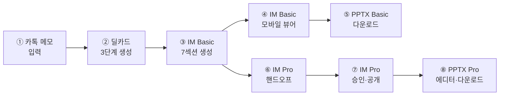

# 06. 포스처별 딜카드→IM→PPTX 풀 파이프라인 — 프로덕션 E2E 테스트

> 문서 버전: v1.0 | 최종 수정: 2026-08-10  
> 대상 환경: Production (https://cre-dealcard.vercel.app)  
> 테스터 요구사항: 브로커 계정 (Pro 티어), PowerPoint 뷰어, 모바일 디바이스  
> 대상 조직: 제이에스부동산중개(주)

---

## 1. 테스트 목적 및 범위

본 문서는 CREDEAL 플랫폼의 **핵심 기능 체인**인 **딜카드 → 모바일 IM (Basic/Pro) → PPTX IM (Basic/Pro)** 파이프라인을 **5개 투자 포스처**별로 완전하게 검증합니다.

제이에스부동산중개(주) 중개인이 실제 업무에서 마주하는 5가지 투자 관점의 매물을 각각 입력하여, 딜카드 생성부터 최종 PPTX 다운로드까지 전 과정이 **상용화 수준**으로 동작하는지 확인합니다.

### 5대 투자 포스처 (INVESTMENT_POSTURE)

| 코드 | 한국어명 | 핵심 특성 | 주요 아키타입 |
|:---|:---|:---|:---|
| `income` | 임대수익형 | 만실, 안정 캐시플로우 | STABLE_INCOME |
| `owner_occupied` | 자가사용형(사옥) | 자가 입주 목적 매입 | OWNER_OCCUPIED |
| `development` | 개발형 | 용적률 여유, 재개발 | DEVELOPMENT_SITE |
| `operating` | 운영형 | 호텔·물류 자가운영 | INSTITUTIONAL_LOGI |
| `trading` | 단기매매형 | 밸류애드, 공실 활용 | VALUE_ADD / DISTRESSED |

### 파이프라인 체인 (각 포스처별 동일 구조)



---

## 2. 포스처별 가상 테스트 데이터 (Fixtures)

---

### P1. 임대수익형 (income) — 당산동 근생빌딩

> 제이에스부동산중개(주) 주력 물건 유형

```json
{
  "posture": "income",
  "expected_archetype": "STABLE_INCOME",
  "memo": "당산동5가 근생빌딩 대지 120평 연면적 450평 6층 엘리베이터 있음 2005년 준공\n공실 1층만 비어있고 나머지 만실 월 수입 3200만원\n1층 카페 보증금 3000만 월 180만, 2층 학원 보증금 5000만 월 250만\n3-4층 사무실 보증금 각 3000만 월 200만, 5-6층 주거 보증금 각 2000만 월 150만\n매도 호가 80억 협의 가능 급매\n건물주 해외이민 계획으로 급매",
  "identity": {
    "assetType": "nbhd_building",
    "investmentPosture": "income",
    "buildingUse": "nbhd_2"
  },
  "supplemental": {
    "monthly_rent_total_krw": 32000000,
    "vacancy_pct": 16.7,
    "photo_urls": [],
    "asking_price_manwon": 800000,
    "total_deposit_manwon": 18000,
    "floor_leases": [
      { "floor": "1F", "tenant_type": "공실", "is_vacant": true, "area_pyeong": 20 },
      { "floor": "2F", "tenant_type": "학원", "deposit_manwon": 5000, "rent_manwon": 250, "area_pyeong": 20 },
      { "floor": "3F", "tenant_type": "사무실", "deposit_manwon": 3000, "rent_manwon": 200, "area_pyeong": 20 },
      { "floor": "4F", "tenant_type": "사무실", "deposit_manwon": 3000, "rent_manwon": 200, "area_pyeong": 20 },
      { "floor": "5F", "tenant_type": "주거", "deposit_manwon": 2000, "rent_manwon": 150, "area_pyeong": 20 },
      { "floor": "6F", "tenant_type": "주거", "deposit_manwon": 2000, "rent_manwon": 150, "area_pyeong": 20 }
    ]
  },
  "expected_im_highlights": ["캡레이트", "NOI", "공실률", "렌트롤", "수익률"],
  "expected_pptx_slides": ["A01-커버", "A02-핵심지표", "A03-렌트롤테이블", "A04-입지분석", "A10-클로징"]
}
```

---

### P2. 자가사용형 (owner_occupied) — 서초동 사옥 빌딩

> 대기업 건물자산관리 담당자 매입 시나리오

```json
{
  "posture": "owner_occupied",
  "expected_archetype": "OWNER_OCCUPIED",
  "memo": "서초구 서초동 사옥용 빌딩 매물\n대지 300평 연면적 1200평 지하1층 지상7층 2015년 준공\n현재 전층 단일 임차인(IT기업) 사용 중이나 2027년 3월 계약만료 예정\n매도 호가 200억 네고 가능\n역삼역 도보 5분 강남대로 접면\n주차 25대 EV 2대\n매수자가 직접 사옥으로 사용하길 원함\n전층 인테리어 리모델링 필요",
  "identity": {
    "assetType": "office_building",
    "investmentPosture": "owner_occupied",
    "buildingUse": "office"
  },
  "supplemental": {
    "monthly_rent_total_krw": 0,
    "vacancy_pct": 0,
    "asking_price_manwon": 2000000,
    "floor_leases": [
      { "floor": "B1-7F", "tenant_type": "IT기업(계약만료예정)", "deposit_manwon": 100000, "rent_manwon": 5000, "area_pyeong": 170, "lease_end": "2027-03-31" }
    ],
    "investmentPosture": "owner_occupied"
  },
  "expected_im_highlights": ["사옥 적합성", "리모델링 비용", "교통 접근성", "주차 충분성", "계약만료 일정"],
  "expected_pptx_slides": ["A01-커버", "A02-핵심지표", "A04-입지분석", "A11-호실스펙", "A12-소유구조", "A10-클로징"]
}
```

---

### P3. 개발형 (development) — 합정동 개발용지

> 디벨로퍼·시행사 대상 매물

```json
{
  "posture": "development",
  "expected_archetype": "DEVELOPMENT_SITE",
  "memo": "마포구 합정동 개발용지 대지 250평 현재 노후 근생 2층 건물\n1978년 준공 건물 노후 심각 철거 예정\n용적률 법정 350% 현재 사용 120% 여유분 230%p\n준주거지역 역세권(합정역 도보 3분)\n매도 호가 150억\n명도 완료 상태 즉시 착공 가능\n인근 재개발 호재 마포로 일대 정비사업 진행 중",
  "identity": {
    "assetType": "bare_land",
    "investmentPosture": "development",
    "buildingUse": "nbhd_1"
  },
  "supplemental": {
    "monthly_rent_total_krw": 0,
    "vacancy_pct": 100,
    "asking_price_manwon": 1500000,
    "investmentPosture": "development"
  },
  "expected_im_highlights": ["용적률 여유", "건폐율", "개발 가능 연면적", "인허가 리스크", "철거·명도 상태"],
  "expected_pptx_slides": ["A01-커버", "A02-핵심지표", "A06-다이어그램(개발구조)", "A04-입지분석", "A09-프로세스(인허가)", "A10-클로징"]
}
```

---

### P4. 운영형 (operating) — 이천 물류센터

> 기관투자자·3PL 대상 대형 물류자산

```json
{
  "posture": "operating",
  "expected_archetype": "INSTITUTIONAL_LOGI",
  "memo": "경기도 이천시 마장면 물류센터 매물\n대지 3000평 연면적 5500평 지하없음 지상3층 2020년 준공\n냉동·냉장 겸용 복합온도 물류센터\n도크 12개 레벨러 8개 천장고 12m\n현재 CJ대한통운 10년 장기계약 만실\n월 임대수입 1억2000만원\n매도 호가 450억\n영동고속도로 이천IC 3km",
  "identity": {
    "assetType": "logistics",
    "investmentPosture": "operating",
    "buildingUse": "warehouse"
  },
  "supplemental": {
    "monthly_rent_total_krw": 120000000,
    "vacancy_pct": 0,
    "asking_price_manwon": 4500000,
    "total_deposit_manwon": 500000,
    "investmentPosture": "operating",
    "logistics": {
      "ceiling_height_m": 12,
      "dock_count": 12,
      "dock_leveler_count": 8,
      "max_vehicle_ton": 25,
      "floor_load_ton_m2": 3.5,
      "cold_storage_type": "both",
      "cold_storage_area_pyeong": 1500,
      "loading_area_pyeong": 800,
      "vehicle_access_type": "both",
      "fire_rating": "1급",
      "sprinkler": true,
      "column_span_m": "10x10",
      "power_capacity_kw": 2500,
      "has_office_space": true,
      "office_area_pyeong": 200,
      "distance_to_ic_km": 3,
      "ic_name": "이천IC"
    }
  },
  "expected_im_highlights": ["도크수", "천장고", "냉동냉장", "3PL 임차인", "IC 접근성"],
  "expected_pptx_slides": ["A01-커버", "A02-핵심지표", "A03-렌트롤", "A11-호실스펙(물류)", "A13-운영성과", "A10-클로징"]
}
```

---

### P5. 단기매매형 (trading) — 영등포 공실빌딩

> 밸류애드 투자자 대상 디스카운트 매물

```json
{
  "posture": "trading",
  "expected_archetype": "VALUE_ADD",
  "memo": "영등포구 영등포동 구 사무용빌딩 대지 180평 연면적 700평\n지하1층 지상6층 1998년 준공 건물 노후\n현재 공실률 40% 임대 관리 부실\n2-3층 사무실 임차 중 나머지 공실\n월 수입 1500만원 불과\n매도 호가 55억 급매 (감정가 대비 70% 수준)\n용적률 법정 400% 현재 사용 280% 여유 120%p\n리모델링 또는 밸류애드 후 재임대 가능\n역세권 영등포역 도보 7분",
  "identity": {
    "assetType": "office_building",
    "investmentPosture": "trading",
    "buildingUse": "office"
  },
  "supplemental": {
    "monthly_rent_total_krw": 15000000,
    "vacancy_pct": 40,
    "asking_price_manwon": 550000,
    "total_deposit_manwon": 5000,
    "floor_leases": [
      { "floor": "B1", "tenant_type": "공실", "is_vacant": true, "area_pyeong": 30 },
      { "floor": "1F", "tenant_type": "공실", "is_vacant": true, "area_pyeong": 30 },
      { "floor": "2F", "tenant_type": "사무실", "deposit_manwon": 3000, "rent_manwon": 800, "area_pyeong": 30 },
      { "floor": "3F", "tenant_type": "사무실", "deposit_manwon": 2000, "rent_manwon": 700, "area_pyeong": 30 },
      { "floor": "4F", "tenant_type": "공실", "is_vacant": true, "area_pyeong": 30 },
      { "floor": "5F", "tenant_type": "공실", "is_vacant": true, "area_pyeong": 30 },
      { "floor": "6F", "tenant_type": "공실", "is_vacant": true, "area_pyeong": 30 }
    ],
    "investmentPosture": "trading"
  },
  "expected_im_highlights": ["공실률", "밸류애드 시나리오", "감정가 대비 할인율", "리모델링 비용", "목표 임대료"],
  "expected_pptx_slides": ["A01-커버", "A02-핵심지표", "A03-렌트롤", "A07-3블록(시나리오)", "A04-입지분석", "A10-클로징"]
}
```

---

## 3. 포스처별 E2E 테스트 시나리오 (5개 × 8단계)

각 포스처(P1~P5)에 대해 동일한 8단계 파이프라인을 실행합니다.

---

### 공통 사전 조건

1. 제이에스부동산중개(주) 브로커 계정으로 로그인
2. Pro 티어 이상 활성화 확인
3. API 인증 토큰 확보 (Supabase Auth)
4. 모바일 디바이스(iPhone 15 또는 Galaxy S24) 준비
5. PowerPoint 뷰어(MS Office 또는 Google Slides) 준비

### 공통 API 헤더

```bash
AUTH_TOKEN="Bearer {your_access_token}"
BASE_URL="https://cre-dealcard.vercel.app"
```

---

### Stage ①: 딜카드 생성 (from-memo)

**API**: `POST /api/broker/deal-card/from-memo`

```bash
curl -X POST "$BASE_URL/api/broker/deal-card/from-memo" \
  -H "Authorization: $AUTH_TOKEN" \
  -H "Content-Type: application/json" \
  -d '{
    "memo": "{포스처별 Fixture의 memo 값}",
    "visibilityPreference": "blind"
  }'
```

#### 검증 체크리스트

| ID | 레벨 | 검증 항목 | P1 income | P2 owner | P3 dev | P4 oper | P5 trading |
|:---|:---:|:---|:---:|:---:|:---:|:---:|:---:|
| S1-L1-01 | L1 | HTTP 200 + `blindTeaser` 존재 | □ | □ | □ | □ | □ |
| S1-L1-02 | L1 | `buildingMiniTruth` 필수 필드 존재 | □ | □ | □ | □ | □ |
| S1-L2-01 | L2 | 아키타입 분류 정확 (`expected_archetype` 일치) | □ | □ | □ | □ | □ |
| S1-L2-02 | L2 | 자산유형 분류 정확 (`assetType` 일치) | □ | □ | □ | □ | □ |
| S1-L2-03 | L2 | 가격 파싱 정확 (±5% 이내) | □ | □ | □ | □ | □ |
| S1-L2-04 | L2 | 면적 파싱 정확 (평/㎡ 변환) | □ | □ | □ | □ | □ |
| S1-L3-01 | L3 | 법적 가드레일 적용 (금지어 치환) | □ | □ | □ | □ | □ |
| S1-L3-02 | L3 | PII 주소 블라인딩 | □ | □ | □ | □ | □ |
| S1-L4-01 | L4 | 블라인드 티저 한국어 자연스러움 | □ | □ | □ | □ | □ |
| S1-L4-02 | L4 | 카카오 공유 텍스트 200자 이내 | □ | □ | □ | □ | □ |

**기대 응답 구조**:
```json
{
  "ok": true,
  "dealCard": {
    "id": "uuid",
    "building_ssot_lite_id": "uuid",
    "blindTeaser": { "title": "...", "dealPoints": [...], "cautionPoints": [...] },
    "buildingMiniTruth": { "assetType": "...", "askingPriceKrw": ... },
    "archetype": { "primaryArchetype": "STABLE_INCOME", "confidenceScore": 0.85 },
    "kakaoText": "..."
  }
}
```

---

### Stage ②: IM Basic 생성 (7섹션)

**API**: `POST /api/broker/im-lite/generate`

```bash
curl -X POST "$BASE_URL/api/broker/im-lite/generate" \
  -H "Authorization: $AUTH_TOKEN" \
  -H "Content-Type: application/json" \
  -d '{
    "building_id": "{Stage ①에서 받은 building_ssot_lite_id}",
    "identity": {포스처별 Fixture의 identity},
    "tier": "basic",
    "monthly_rent_total_krw": {포스처별 값},
    "vacancy_pct": {포스처별 값},
    "asking_price_manwon": {포스처별 값}
  }'
```

#### 검증 체크리스트

| ID | 레벨 | 검증 항목 | P1 | P2 | P3 | P4 | P5 |
|:---|:---:|:---|:---:|:---:|:---:|:---:|:---:|
| S2-L1-01 | L1 | HTTP 200 + `im_lite_id` 반환 | □ | □ | □ | □ | □ |
| S2-L1-02 | L1 | 7섹션 전수 생성 확인 | □ | □ | □ | □ | □ |
| S2-L1-03 | L1 | 응답 시간 120초 이내 | □ | □ | □ | □ | □ |
| S2-L2-01 | L2 | **포스처별 프롬프트 오버레이** 적용 확인 | □ | □ | □ | □ | □ |
| S2-L2-02 | L2 | `property_overview` 섹션: 핵심 지표 포함 | □ | □ | □ | □ | □ |
| S2-L2-03 | L2 | `income_analysis` 섹션: 포스처별 분석 관점 | □ | □ | □ | □ | □ |
| S2-L2-04 | L2 | `investment_thesis` 섹션: 포스처별 투자 논리 | □ | □ | □ | □ | □ |
| S2-L2-05 | L2 | `risk_check` 섹션: 포스처별 리스크 항목 | □ | □ | □ | □ | □ |
| S2-L3-01 | L3 | Risk Boundary 전수 통과 | □ | □ | □ | □ | □ |
| S2-L3-02 | L3 | Disclosure Guard 면책 고지 포함 | □ | □ | □ | □ | □ |
| S2-L3-03 | L3 | 크로스 벨리데이션 통과 (수치 일관성) | □ | □ | □ | □ | □ |
| S2-L4-01 | L4 | 한국어 전문 용어 정확도 | □ | □ | □ | □ | □ |
| S2-L4-02 | L4 | 섹션별 `confidence` 필드 존재 | □ | □ | □ | □ | □ |

**포스처별 `income_analysis` 기대 내용**:

| 포스처 | income_analysis 핵심 분석 내용 |
|:---|:---|
| P1 income | NOI, 캡레이트, 환산보증금, 레버리지 수익률 |
| P2 owner_occupied | 사옥 전환 비용, 리모델링 예산, 자가사용 가치 |
| P3 development | 개발 가능 연면적, 사업비 추정, 분양 수익 시나리오 |
| P4 operating | GOP, ADR/OCC/RevPAR(해당시), 운영비용, EBITDA |
| P5 trading | 밸류애드 전후 NOI 비교, 목표 캡레이트, Exit 시나리오 |

---

### Stage ③: IM Basic 모바일 뷰어

**URL**: `{BASE_URL}/im-lite/{building_id}`

#### 검증 체크리스트

| ID | 레벨 | 검증 항목 | P1 | P2 | P3 | P4 | P5 |
|:---|:---:|:---|:---:|:---:|:---:|:---:|:---:|
| S3-L1-01 | L1 | 페이지 정상 로드 (200) | □ | □ | □ | □ | □ |
| S3-L2-01 | L2 | 히어로 카드 핵심 지표 정확 | □ | □ | □ | □ | □ |
| S3-L2-02 | L2 | 7섹션 순차 표시 | □ | □ | □ | □ | □ |
| S3-L2-03 | L2 | Provenance 배지 표시 | □ | □ | □ | □ | □ |
| S3-L4-01 | L4 | 모바일 375px 반응형 정상 | □ | □ | □ | □ | □ |
| S3-L4-02 | L4 | 테이블 가로 스크롤 없음 | □ | □ | □ | □ | □ |
| S3-L4-03 | L4 | 이미지/차트 렌더링 정상 | □ | □ | □ | □ | □ |

**스크린샷 캡처 가이드**: 각 포스처별 히어로 카드 + 첫 3섹션 모바일 스크린샷 캡처

---

### Stage ④: PPTX Basic 다운로드

**API**: `GET /api/public/im-lite/{building_id}/pptx`

```bash
curl -o "P{N}_{posture}_basic.pptx" \
  "$BASE_URL/api/public/im-lite/{building_id}/pptx"
```

#### 검증 체크리스트

| ID | 레벨 | 검증 항목 | P1 | P2 | P3 | P4 | P5 |
|:---|:---:|:---|:---:|:---:|:---:|:---:|:---:|
| S4-L1-01 | L1 | HTTP 200 + PPTX MIME 타입 | □ | □ | □ | □ | □ |
| S4-L1-02 | L1 | 파일 크기 > 100KB | □ | □ | □ | □ | □ |
| S4-L2-01 | L2 | A01 커버 슬라이드 존재 | □ | □ | □ | □ | □ |
| S4-L2-02 | L2 | A02 핵심 지표 그리드 존재 | □ | □ | □ | □ | □ |
| S4-L2-03 | L2 | A10 클로징 슬라이드 존재 | □ | □ | □ | □ | □ |
| S4-L2-04 | L2 | **포스처별 특화 슬라이드 존재** | □ | □ | □ | □ | □ |
| S4-L3-01 | L3 | 클로징에 Provenance 배지 표시 | □ | □ | □ | □ | □ |
| S4-L3-02 | L3 | 면책 고지 포함 | □ | □ | □ | □ | □ |
| S4-L4-01 | L4 | 커버 이미지 렌더링 (또는 폴백 그래픽) | □ | □ | □ | □ | □ |
| S4-L4-02 | L4 | 테이블 autoPage 페이지 분할 정상 | □ | □ | □ | □ | □ |
| S4-L4-03 | L4 | 한국어 텍스트 트렁케이션 정상 (문장 경계) | □ | □ | □ | □ | □ |
| S4-L4-04 | L4 | 폰트/색상 일관성 | □ | □ | □ | □ | □ |
| S4-L4-05 | L4 | 텍스트 오버플로우 없음 | □ | □ | □ | □ | □ |

**포스처별 특화 슬라이드 기대값**:

| 포스처 | 기대 특화 슬라이드 |
|:---|:---|
| P1 income | A03 렌트롤 대형 테이블, A08 수익 비교 듀얼테이블 |
| P2 owner_occupied | A11 호실 스펙, A12 소유구조 |
| P3 development | A06 개발 구조 다이어그램, A09 인허가 프로세스 |
| P4 operating | A11 물류 스펙, A13 운영 성과 (도크/천장고/온도대) |
| P5 trading | A07 밸류애드 3블록 비교, A03 공실 분석 테이블 |

---

### Stage ⑤: IM Pro 핸드오프

**API**: `POST /api/full-im-handoffs`

```bash
curl -X POST "$BASE_URL/api/full-im-handoffs" \
  -H "Authorization: $AUTH_TOKEN" \
  -H "Content-Type: application/json" \
  -d '{
    "source_building_ssot_lite_id": "{building_ssot_lite_id}",
    "requested_output": "buyer_ready_full_im",
    "package_intent": "ai_self_authoring"
  }'
```

#### 검증 체크리스트

| ID | 레벨 | 검증 항목 | P1 | P2 | P3 | P4 | P5 |
|:---|:---:|:---|:---:|:---:|:---:|:---:|:---:|
| S5-L1-01 | L1 | HTTP 200 + `handoff_token` 반환 | □ | □ | □ | □ | □ |
| S5-L2-01 | L2 | 핸드오프 상태 `pending` | □ | □ | □ | □ | □ |
| S5-L2-02 | L2 | SSoT 데이터 완전 전달 확인 | □ | □ | □ | □ | □ |

---

### Stage ⑥: IM Pro 승인 & 공개

**API**: `POST /api/broker/pro-grants/{id}/approve`

```bash
curl -X POST "$BASE_URL/api/broker/pro-grants/{grant_id}/approve" \
  -H "Authorization: $AUTH_TOKEN"
```

#### 검증 체크리스트

| ID | 레벨 | 검증 항목 | P1 | P2 | P3 | P4 | P5 |
|:---|:---:|:---|:---:|:---:|:---:|:---:|:---:|
| S6-L1-01 | L1 | HTTP 200 + `status: approved` | □ | □ | □ | □ | □ |
| S6-L2-01 | L2 | RAG 인덱싱 트리거 확인 | □ | □ | □ | □ | □ |
| S6-L2-02 | L2 | 품질 게이트 v0.2 통과 확인 | □ | □ | □ | □ | □ |
| S6-L3-01 | L3 | NDA 게이트 활성화 확인 | □ | □ | □ | □ | □ |

---

### Stage ⑦: IM Pro 뷰어

**URL**: `{BASE_URL}/im-pro/{grant_id}`

#### 검증 체크리스트

| ID | 레벨 | 검증 항목 | P1 | P2 | P3 | P4 | P5 |
|:---|:---:|:---|:---:|:---:|:---:|:---:|:---:|
| S7-L1-01 | L1 | 페이지 정상 로드 | □ | □ | □ | □ | □ |
| S7-L2-01 | L2 | NDA 동의 게이트 표시 | □ | □ | □ | □ | □ |
| S7-L2-02 | L2 | NDA 동의 후 전체 콘텐츠 표시 | □ | □ | □ | □ | □ |
| S7-L2-03 | L2 | Basic 대비 추가 섹션/상세 데이터 표시 | □ | □ | □ | □ | □ |
| S7-L4-01 | L4 | 모바일 반응형 정상 | □ | □ | □ | □ | □ |
| S7-L4-02 | L4 | DCF 히트맵 표시 (Grade A 해당 시) | □ | □ | □ | □ | □ |

---

### Stage ⑧: PPTX Pro 에디터 & 다운로드

**URL**: `{BASE_URL}/broker/deal-card/{id}/pptx-editor`

#### 검증 체크리스트

| ID | 레벨 | 검증 항목 | P1 | P2 | P3 | P4 | P5 |
|:---|:---:|:---|:---:|:---:|:---:|:---:|:---:|
| S8-L1-01 | L1 | PPTX 에디터 페이지 로드 | □ | □ | □ | □ | □ |
| S8-L2-01 | L2 | 슬라이드 프리뷰 SVG 표시 | □ | □ | □ | □ | □ |
| S8-L2-02 | L2 | 테마 토큰 커스터마이징 가능 | □ | □ | □ | □ | □ |
| S8-L2-03 | L2 | 프리셋 저장/로드 동작 | □ | □ | □ | □ | □ |
| S8-L4-01 | L4 | 커스텀 색상 적용 후 PPTX 다운로드 정상 | □ | □ | □ | □ | □ |
| S8-L4-02 | L4 | 다운로드 PPTX에 커스텀 설정 반영 확인 | □ | □ | □ | □ | □ |

---

## 4. 포스처별 종합 결과 기록표

### P1. 임대수익형 (income) — 당산동 근생빌딩

| Stage | 테스트명 | L1 (5) | L2 (10) | L3 (15) | L4 (10) | 소계 | 판정 | 비고 |
|:---:|:---|:---:|:---:|:---:|:---:|:---:|:---:|:---|
| ① | 딜카드 생성 | /5 | /10 | /15 | /10 | /40 | | |
| ② | IM Basic 생성 | /5 | /10 | /15 | /10 | /40 | | |
| ③ | IM Basic 뷰어 | /5 | /10 | — | /10 | /25 | | |
| ④ | PPTX Basic | /5 | /10 | /15 | /10 | /40 | | |
| ⑤ | IM Pro 핸드오프 | /5 | /10 | — | — | /15 | | |
| ⑥ | IM Pro 승인 | /5 | /10 | /15 | — | /30 | | |
| ⑦ | IM Pro 뷰어 | /5 | /10 | — | /10 | /25 | | |
| ⑧ | PPTX Pro 에디터 | /5 | /10 | — | /10 | /25 | | |
| | **합계** | | | | | **/240** | | |

### P2. 자가사용형 (owner_occupied) — 서초동 사옥

| Stage | 테스트명 | L1 (5) | L2 (10) | L3 (15) | L4 (10) | 소계 | 판정 | 비고 |
|:---:|:---|:---:|:---:|:---:|:---:|:---:|:---:|:---|
| ① | 딜카드 생성 | /5 | /10 | /15 | /10 | /40 | | |
| ② | IM Basic 생성 | /5 | /10 | /15 | /10 | /40 | | |
| ③ | IM Basic 뷰어 | /5 | /10 | — | /10 | /25 | | |
| ④ | PPTX Basic | /5 | /10 | /15 | /10 | /40 | | |
| ⑤ | IM Pro 핸드오프 | /5 | /10 | — | — | /15 | | |
| ⑥ | IM Pro 승인 | /5 | /10 | /15 | — | /30 | | |
| ⑦ | IM Pro 뷰어 | /5 | /10 | — | /10 | /25 | | |
| ⑧ | PPTX Pro 에디터 | /5 | /10 | — | /10 | /25 | | |
| | **합계** | | | | | **/240** | | |

### P3. 개발형 (development) — 합정동 개발용지

| Stage | 테스트명 | L1 (5) | L2 (10) | L3 (15) | L4 (10) | 소계 | 판정 | 비고 |
|:---:|:---|:---:|:---:|:---:|:---:|:---:|:---:|:---|
| ① | 딜카드 생성 | /5 | /10 | /15 | /10 | /40 | | |
| ② | IM Basic 생성 | /5 | /10 | /15 | /10 | /40 | | |
| ③ | IM Basic 뷰어 | /5 | /10 | — | /10 | /25 | | |
| ④ | PPTX Basic | /5 | /10 | /15 | /10 | /40 | | |
| ⑤ | IM Pro 핸드오프 | /5 | /10 | — | — | /15 | | |
| ⑥ | IM Pro 승인 | /5 | /10 | /15 | — | /30 | | |
| ⑦ | IM Pro 뷰어 | /5 | /10 | — | /10 | /25 | | |
| ⑧ | PPTX Pro 에디터 | /5 | /10 | — | /10 | /25 | | |
| | **합계** | | | | | **/240** | | |

### P4. 운영형 (operating) — 이천 물류센터

| Stage | 테스트명 | L1 (5) | L2 (10) | L3 (15) | L4 (10) | 소계 | 판정 | 비고 |
|:---:|:---|:---:|:---:|:---:|:---:|:---:|:---:|:---|
| ① | 딜카드 생성 | /5 | /10 | /15 | /10 | /40 | | |
| ② | IM Basic 생성 | /5 | /10 | /15 | /10 | /40 | | |
| ③ | IM Basic 뷰어 | /5 | /10 | — | /10 | /25 | | |
| ④ | PPTX Basic | /5 | /10 | /15 | /10 | /40 | | |
| ⑤ | IM Pro 핸드오프 | /5 | /10 | — | — | /15 | | |
| ⑥ | IM Pro 승인 | /5 | /10 | /15 | — | /30 | | |
| ⑦ | IM Pro 뷰어 | /5 | /10 | — | /10 | /25 | | |
| ⑧ | PPTX Pro 에디터 | /5 | /10 | — | /10 | /25 | | |
| | **합계** | | | | | **/240** | | |

### P5. 단기매매형 (trading) — 영등포 공실빌딩

| Stage | 테스트명 | L1 (5) | L2 (10) | L3 (15) | L4 (10) | 소계 | 판정 | 비고 |
|:---:|:---|:---:|:---:|:---:|:---:|:---:|:---:|:---|
| ① | 딜카드 생성 | /5 | /10 | /15 | /10 | /40 | | |
| ② | IM Basic 생성 | /5 | /10 | /15 | /10 | /40 | | |
| ③ | IM Basic 뷰어 | /5 | /10 | — | /10 | /25 | | |
| ④ | PPTX Basic | /5 | /10 | /15 | /10 | /40 | | |
| ⑤ | IM Pro 핸드오프 | /5 | /10 | — | — | /15 | | |
| ⑥ | IM Pro 승인 | /5 | /10 | /15 | — | /30 | | |
| ⑦ | IM Pro 뷰어 | /5 | /10 | — | /10 | /25 | | |
| ⑧ | PPTX Pro 에디터 | /5 | /10 | — | /10 | /25 | | |
| | **합계** | | | | | **/240** | | |

---

## 5. 전체 포스처 종합 결과 매트릭스

| # | 포스처 | 아키타입 | 딜카드 | IM Basic | 뷰어 | PPTX Basic | Pro 핸드오프 | Pro 승인 | Pro 뷰어 | PPTX Pro | 총점 | 판정 |
|:---:|:---|:---|:---:|:---:|:---:|:---:|:---:|:---:|:---:|:---:|:---:|:---:|
| P1 | 임대수익형 | STABLE_INCOME | /40 | /40 | /25 | /40 | /15 | /30 | /25 | /25 | /240 | |
| P2 | 자가사용형 | OWNER_OCCUPIED | /40 | /40 | /25 | /40 | /15 | /30 | /25 | /25 | /240 | |
| P3 | 개발형 | DEVELOPMENT_SITE | /40 | /40 | /25 | /40 | /15 | /30 | /25 | /25 | /240 | |
| P4 | 운영형 | INSTITUTIONAL_LOGI | /40 | /40 | /25 | /40 | /15 | /30 | /25 | /25 | /240 | |
| P5 | 단기매매형 | VALUE_ADD | /40 | /40 | /25 | /40 | /15 | /30 | /25 | /25 | /240 | |
| | **합계** | | | | | | | | | | **/1200** | |

---

## 6. 합격 기준

| 기준 | 임계값 | 설명 |
|:---|:---:|:---|
| **포스처별 합격** | ≥ 168/240 (70%) | 각 포스처 총점의 70% 이상 |
| **Stage별 합격** | ≥ 70% | 각 Stage(①~⑧)의 체크리스트 70% 이상 |
| **L3 필수 합격** | 100% | 가드레일/안전성 항목은 전수 합격 필수 |
| **전체 합격** | 5/5 포스처 합격 | 모든 포스처에서 개별 합격 달성 |
| **상용화 판정** | ≥ 960/1200 (80%) | 전체 총점 80% 이상 + P0 결함 0건 |

---

## 7. 포스처별 특이사항 및 중점 확인 항목

### P1. 임대수익형 (income) — 중점 확인

- [ ] 렌트롤 6개 층의 보증금/월세 정확 파싱 여부
- [ ] 캡레이트 계산 정확도 (NOI ÷ 매매가)
- [ ] 공실 1층에 대한 "공실 리스크" 언급 여부
- [ ] PPTX A03 렌트롤 테이블에서 6개 층 전수 표시
- [ ] 환산보증금 자동 계산 정합성

### P2. 자가사용형 (owner_occupied) — 중점 확인

- [ ] 임대수익 분석 대신 "사옥 전환 비용 분석" 관점 여부
- [ ] 계약만료(2027.03) 일정 정확 표시
- [ ] 리모델링 비용 추정 항목 존재
- [ ] PPTX A11 호실 스펙에 전층 활용 계획 포함
- [ ] "주차 25대" 사옥 적합성 판단 포함

### P3. 개발형 (development) — 중점 확인

- [ ] 용적률 여유(230%p) 정확 계산 및 표시
- [ ] 개발 가능 연면적 추정 (250평 × 350% ≒ 875평)
- [ ] 명도 완료 상태 정확 반영
- [ ] 인허가 리스크 체크리스트 포함
- [ ] PPTX A06 다이어그램에 개발 구조도 포함

### P4. 운영형 (operating) — 중점 확인

- [ ] 물류 특화 필드(도크, 천장고, 냉동·냉장) 전수 파싱
- [ ] CJ대한통운 10년 장기계약 안정성 분석
- [ ] IC 접근성(이천IC 3km) 물류 적합도 평가
- [ ] PPTX A13 운영 성과 슬라이드 물류 지표 표시
- [ ] PPTX A11에 물류 스펙(도크수/레벨러/천장고) 표시

### P5. 단기매매형 (trading) — 중점 확인

- [ ] 공실률 40% → DISTRESSED 또는 VALUE_ADD 분류
- [ ] 감정가 대비 할인율(70%) 분석 포함
- [ ] 밸류애드 전/후 NOI 비교 시나리오
- [ ] 리모델링 후 목표 임대료 추정
- [ ] PPTX A07 3블록에 현재/밸류애드/최적 시나리오 비교

---

## 8. 결함 보고 템플릿

```markdown
## 결함 보고서 #[번호]

| 항목 | 내용 |
|:---|:---|
| 포스처 | P[1-5] [포스처명] |
| Stage | ①~⑧ |
| 레벨 | L1/L2/L3/L4 |
| 결함 등급 | P0/P1/P2/P3 |
| 발견 일시 | YYYY-MM-DD HH:MM |
| 테스터 | [이름] |
| 재현 절차 | 1. ... 2. ... 3. ... |
| 기대 결과 | ... |
| 실제 결과 | ... |
| 스크린샷 | [첨부] |
| API 응답 | ```json ... ``` |
| PPTX 파일 | [첨부] |
```

---

## 9. 테스트 일정 (제이에스부동산중개(주))

| 일차 | 포스처 | 테스트 범위 | 예상 소요 |
|:---:|:---|:---|:---:|
| Day 1 | P1 임대수익형 | Stage ①~⑧ 전체 | 4시간 |
| Day 2 | P2 자가사용형 | Stage ①~⑧ 전체 | 4시간 |
| Day 3 | P3 개발형 | Stage ①~⑧ 전체 | 4시간 |
| Day 4 | P4 운영형(물류) | Stage ①~⑧ 전체 | 4시간 |
| Day 5 | P5 단기매매형 | Stage ①~⑧ 전체 | 4시간 |
| Day 6 | 전체 | 결함 재테스트 + 최종 보고서 | 3시간 |
