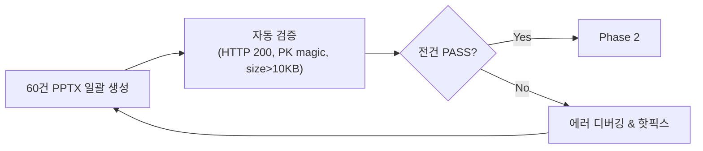

# PPTX 프리셋 템플릿 품질 테스트 & 상용화 보완 계획

> **Version**: v1.0 | **작성일**: 2026-08-13  
> **목적**: 5종 빌트인 프리셋 템플릿별 PPTX IM Basic/Pro 산출물을 체계적으로 테스트하고, 품질 평가 루브릭에 따라 상용화 수준으로 보완하기 위한 테스트-개선 사이클 계획

---

## 1. 테스트 범위 & 전략

### 1.1 테스트 매트릭스

> **조합 = 5 프리셋 × 2 티어 × 6 테스트 물건 = 60건 PPTX**

| 프리셋 ID | 커버 스타일 | 레이아웃 스타일 | 특이점 |
|---|---|---|---|
| `credeal_signature` | `split` | `modern` | 네온그린 액센트, 현 기본값 |
| `golden_institutional` | `institutional_masses` | `classic` | brass 원형 번호, 골드 톤 |
| `executive_gold` | `hero_dark` | `executive` | Noto Serif KR, 중앙 정렬 |
| `corporate_clean` | `corporate_card` | `minimal` | 에메랄드 무장식, Noto Sans KR |
| `pro_dark_obsidian` | `obsidian_glow` | `dramatic` | 시안 글로우, 나눔스퀘어, 전폭 다크 |

| 티어 | 슬라이드 수 | 핵심 검증 |
|---|---|---|
| **Basic** | 7~8p | 핵심 정보 전달력, 레이아웃 안정성 |
| **Pro** | 12~24p | 재무 슬라이드 정합성, 전체 덱 일관성, 워터마크 |

### 1.2 테스트 물건 (기존 E2E 데이터셋 활용)

| # | 물건 | 관점 | 등급 | 검증 초점 |
|---|---|---|---|---|
| 1 | 잠원동 두원빌딩 | 개발형 | B | 개발 포스처 슬라이드, 다필지 |
| 2 | 당산동 근생빌딩 | 임대수익형 | C | 구분등기, 공동담보, 렌트롤 |
| 3 | 수택동 나대지 | 개발형 | C | 나대지 특수 케이스, 사진 없음 |
| 4 | 양평동 더레드빌딩 | 임대수익형 | C | 기존 출력 비교 기준 |
| 5 | 이대 호텔 | 운영형 | D→B | D등급 차단, 운영 KPI |
| 6 | 연남동 상가주택 | 임대수익형 | B | 골든 데이터, 주택임대차 |

---

## 2. 품질 평가 루브릭

### 2.1 카테고리별 평가 항목 (100점 만점)

| 카테고리 | 배점 | 세부 항목 |
|---|---|---|
| **Q1. 레이아웃 안정성** | 25 | 텍스트 잘림 없음(5), 요소 겹침 없음(5), 여백 일관(5), 컬럼 정렬(5), 슬라이드간 위치 통일(5) |
| **Q2. 색상 & 테마 일관성** | 20 | 액센트 색상 정확 적용(5), 라이트/다크 대비 가독성(5), 의미색 구분 명확(5), 그라디언트/투명도 이상 없음(5) |
| **Q3. 타이포그래피** | 15 | 폰트 렌더링 정상(5), 한글/숫자 폰트 분리 적용(5), 크기 위계 준수(5) |
| **Q4. 데이터 정합성** | 20 | 수치 정확(5), 출처 배지 매칭(5), 플레이스홀더 최소화(5), 테이블 헤더-데이터 일치(5) |
| **Q5. 이미지 & 미디어** | 10 | 커버 이미지/폴백 품질(4), 지도 이미지 렌더링(3), 갤러리 배치(3) |
| **Q6. 전체 인상** | 10 | 프로페셔널 느낌(4), 가독성(3), 인쇄 적합성(3) |

### 2.2 등급 체계

| 등급 | 점수 범위 | 의미 | 조치 |
|---|---|---|---|
| **S** | 90~100 | 상용화 가능 | 출시 승인 |
| **A** | 80~89 | 경미한 보완 | 마이너 패치 후 출시 |
| **B** | 65~79 | 중요 보완 필요 | 개선 사이클 1회 |
| **C** | 50~64 | 심각한 문제 | 개선 사이클 2회 이상 |
| **D** | 0~49 | 출시 불가 | 근본 원인 분석 후 재설계 |

### 2.3 슬라이드별 세부 체크리스트

#### S1. 표지 (A01)

| # | 검사 항목 | Pass/Fail 기준 |
|---|---|---|
| 1-1 | coverStyle별 레이아웃이 정확하게 렌더링되는가 | 기대 레이아웃과 일치 |
| 1-2 | 제목 40pt, kicker 10pt 크기 위계 준수 | ±1pt 이내 |
| 1-3 | 커버 이미지 없을 때 폴백 도형이 해당 스타일에 맞는가 | 네온그린 없음, 웜톤 도형 표시 |
| 1-4 | 가격대(priceBand) 22pt bold 표시 | 가독 가능 |
| 1-5 | 태그 뱃지 텍스트 잘림 없음 | 글자 잘림 X |
| 1-6 | 브로커 정보 y=6.60에 정렬 | 하단 정보 바 보임 |
| 1-7 | 로고 이미지 최적화 성공 또는 graceful 생략 | 에러 없음 |

#### S2. 핵심요약 (A02)

| # | 검사 항목 | Pass/Fail |
|---|---|---|
| 2-1 | leadSentence 15pt bold 렌더링 | 정상 표시 |
| 2-2 | Stat 카드 4열 그리드 정렬 | 균등 간격, 겹침 없음 |
| 2-3 | heroCard.stats 자동 구성 동작 (SSoT 폴백) | 대시(—) 없이 실제 값 |
| 2-4 | 메트릭 없을 때 플레이스홀더 4장 표시 | 깨끗한 폴백 |

#### S3. 입지 (A06)

| # | 검사 항목 | Pass/Fail |
|---|---|---|
| 3-1 | 지도 이미지 렌더링 (카카오/OSM/SVG) | 실제 지도 or 깨끗한 플레이스홀더 |
| 3-2 | 우측 K-V rows 텍스트 잘림 없음 | 45자 이내 절삭 동작 |
| 3-3 | callout 박스 영역 내 수용 | y + calloutH ≤ 6.3 |

#### S4~S14. 기타 아키타입

각 아키타입별로 동일 구조의 체크리스트 적용:
- 레이아웃 좌표 정확성
- 텍스트 절삭/오버플로
- 빈 데이터 폴백 품질
- 색상 팔레트 적용 정확성

---

## 3. 테스트 실행 방법

### 3.1 로컬 PPTX 일괄 생성 스크립트

```bash
# 1. 개발 서버 시작
npm run dev

# 2. 프리셋별 PPTX 생성 (Basic)
PRESETS=("credeal_signature" "golden_institutional" "executive_gold" "corporate_clean" "pro_dark_obsidian")
BUILDINGS=("잠원" "당산" "수택" "양평" "이대호텔" "연남")
BUILD_IDS=("<jamwon_uuid>" "<dangsan_uuid>" "<sutaek_uuid>" "<yangpyeong_uuid>" "<hotel_uuid>" "<yeonnam_uuid>")

for preset in "${PRESETS[@]}"; do
  for i in "${!BUILD_IDS[@]}"; do
    curl -s -o "docs/test/pptx-results/${preset}_${BUILDINGS[$i]}_basic.pptx" \
      "http://localhost:3000/api/public/im-lite/${BUILD_IDS[$i]}/pptx?tier=basic&preset=${preset}"
    curl -s -o "docs/test/pptx-results/${preset}_${BUILDINGS[$i]}_pro.pptx" \
      "http://localhost:3000/api/public/im-lite/${BUILD_IDS[$i]}/pptx?tier=pro&preset=${preset}"
  done
done
```

### 3.2 자동화 검증 스크립트 (Node.js)

```javascript
// docs/test/pptx-preset-test-runner.js
const fs = require('fs');
const path = require('path');

const PRESETS = ['credeal_signature', 'golden_institutional', 'executive_gold', 'corporate_clean', 'pro_dark_obsidian'];
const TIERS = ['basic', 'pro'];
const BASE_URL = 'http://localhost:3000';
const RESULT_DIR = path.join(__dirname, 'pptx-results');

// buildingIds — 실제 UUID로 교체 필요
const BUILDINGS = {
  jamwon:    '<UUID>',
  dangsan:   '<UUID>',
  sutaek:    '<UUID>',
  yangpyeong:'<UUID>',
  hotel:     '<UUID>',
  yeonnam:   '<UUID>',
};

async function runTests() {
  if (!fs.existsSync(RESULT_DIR)) fs.mkdirSync(RESULT_DIR, { recursive: true });
  
  const results = [];
  
  for (const preset of PRESETS) {
    for (const tier of TIERS) {
      for (const [name, id] of Object.entries(BUILDINGS)) {
        const url = `${BASE_URL}/api/public/im-lite/${id}/pptx?tier=${tier}&preset=${preset}`;
        const filename = `${preset}_${name}_${tier}.pptx`;
        const filepath = path.join(RESULT_DIR, filename);
        
        try {
          const res = await fetch(url);
          const status = res.status;
          const buffer = Buffer.from(await res.arrayBuffer());
          
          // PK magic byte check
          const isPptx = buffer[0] === 0x50 && buffer[1] === 0x4B;
          
          fs.writeFileSync(filepath, buffer);
          
          results.push({
            preset, tier, building: name,
            status,
            sizeBytes: buffer.length,
            isPptx,
            filename,
            pass: status === 200 && isPptx && buffer.length > 10000,
          });
        } catch (err) {
          results.push({
            preset, tier, building: name,
            status: 'ERROR',
            error: err.message,
            pass: false,
          });
        }
      }
    }
  }
  
  // 결과 리포트 출력
  console.table(results.map(r => ({
    preset: r.preset.substring(0, 12),
    tier: r.tier,
    building: r.building,
    status: r.status,
    size: r.sizeBytes ? `${(r.sizeBytes/1024).toFixed(0)}KB` : '-',
    pass: r.pass ? '✅' : '❌',
  })));
  
  // CSV 저장
  const csv = ['preset,tier,building,status,sizeBytes,isPptx,pass']
    .concat(results.map(r => `${r.preset},${r.tier},${r.building},${r.status},${r.sizeBytes||0},${r.isPptx||false},${r.pass}`))
    .join('\n');
  fs.writeFileSync(path.join(RESULT_DIR, 'test_results.csv'), csv);
  
  const passed = results.filter(r => r.pass).length;
  console.log(`\n총 ${results.length}건 중 ${passed}건 PASS (${(passed/results.length*100).toFixed(1)}%)`);
}

runTests().catch(console.error);
```

### 3.3 육안 검사 워크플로

```
1. PPTX 파일 열기 (PowerPoint / LibreOffice / Google Slides)
2. 슬라이드별 체크리스트(§2.3) 순회
3. 스크린샷 캡처 → docs/test/pptx-results/screenshots/{preset}/{slide}.png
4. 평가 시트에 점수 기입 (§2.1 루브릭)
5. 이슈 발견 시 GitHub Issue 또는 개선 계획서에 등록
```

---

## 4. 품질 평가 시트 템플릿

### 4.1 프리셋별 평가 기록

```markdown
## [preset_id] × [tier] × [building_name]

### 생성 결과
- 파일: `{preset}_{building}_{tier}.pptx`
- 크기: XX KB
- 슬라이드 수: XX장
- 생성 시간: XX초

### Q1. 레이아웃 안정성 (25점)
| 항목 | 점수 | 비고 |
|---|---|---|
| 텍스트 잘림 없음 | /5 | |
| 요소 겹침 없음 | /5 | |
| 여백 일관성 | /5 | |
| 컬럼 정렬 | /5 | |
| 슬라이드간 통일 | /5 | |

### Q2. 색상 & 테마 일관성 (20점)
... (동일 구조)

### Q3~Q6. (동일 구조)

### 총점: __/100 → 등급: __

### 발견 이슈
| # | 슬라이드 | 카테고리 | 심각도 | 설명 | 스크린샷 |
|---|---|---|---|---|---|
| 1 | S1 표지 | Q2 색상 | P1 | ... |  |
```

---

## 5. 테스트-보완 사이클 (Sprint Plan)

### Phase 1: 일괄 생성 & 자동 검증 (Day 1)



**수행 항목:**
- [ ] 개발 서버 기동 + 테스트 러너 실행
- [ ] 60건 중 HTTP 에러 / 0바이트 / 비정상 파일 식별
- [ ] 크래시/타임아웃 원인 분석 & 핫픽스
- [ ] 전건 PASS 달성

### Phase 2: 육안 품질 평가 (Day 2~3)

**수행 항목:**
- [ ] 프리셋별 대표 1건(Basic) + 1건(Pro) = 10건 우선 육안 검사
- [ ] 루브릭 §2.1 기준 점수 기입
- [ ] 프리셋별 공통 이슈 vs 프리셋 고유 이슈 분류
- [ ] P0(출시 차단) / P1(주요) / P2(경미) 우선순위 부여

### Phase 3: P0~P1 보완 구현 (Day 4~5)

**예상 보완 영역:**

| 영역 | 예상 이슈 | 수정 대상 |
|---|---|---|
| `coverStyle` 분기 | obsidian_glow 글로우 효과 미구현 | `a01-cover.ts` |
| `layoutStyle` 분기 | dramatic/minimal 헤더 미세조정 | `imlib.ts head()` |
| 폰트 폴백 | Noto Serif KR / 나눔스퀘어 미설치 환경 | `imlib.ts KR/TITLE_KR` |
| 다크 슬라이드 대비 | pro_dark_obsidian 가독성 | `CD` 팔레트 조정 |
| 재무 슬라이드 | DCF/감응도 데이터 바인딩 미연결 | `data-binder.ts` |
| 이미지 | 카카오맵 API 키 부재 시 OSM 폴백 | `image-optimizer.ts` |

### Phase 4: 재테스트 & 등급 재평가 (Day 6)

- [ ] Phase 3 수정 후 60건 재생성
- [ ] 이전 이슈 해결 여부 검증 (회귀 테스트)
- [ ] 루브릭 재채점
- [ ] S/A 등급 달성 여부 확인

### Phase 5: 상용화 승인 & 문서화 (Day 7)

- [ ] 전 프리셋 A등급 이상 달성 확인
- [ ] 품질 게이트 기준 레포 문서 반영
- [ ] PPTX_TEMPLATE_SPEC.md 업데이트
- [ ] 릴리즈 노트 작성

---

## 6. 프리셋별 예상 위험도 사전 분석

| 프리셋 | 위험 수준 | 핵심 리스크 | 사전 대비 |
|---|---|---|---|
| `credeal_signature` | 🟢 Low | 이미 기본 테스트 완료 | 기존 결과 재활용 |
| `golden_institutional` | 🟡 Medium | classic 레이아웃 brass 원형 렌더링 미검증 | `head()` classic 분기 집중 검증 |
| `executive_gold` | 🟡 Medium | Noto Serif KR 폰트 호환, 중앙 정렬 계산 | 폰트 미설치 환경 폴백 확인 |
| `corporate_clean` | 🟡 Medium | minimal 레이아웃 극단적 단순화 시 정보 손실 | 불필요 요소 숨김 vs 정보 전달 균형 |
| `pro_dark_obsidian` | 🔴 High | dramatic 전폭 다크 strip, 글로우 효과, 나눔스퀘어 폰트, 시안 액센트 가독성 | 다크/라이트 혼합 슬라이드 대비 검증 |

---

## 7. 성공 기준 (Exit Criteria)

| 기준 | 조건 |
|---|---|
| **자동 검증** | 60건 전건 HTTP 200, PK magic, size > 10KB |
| **육안 품질** | 전 프리셋 평균 A등급(80점) 이상, D등급 0건 |
| **P0 이슈** | 0건 잔여 |
| **P1 이슈** | 3건 이하 잔여 (Known Issue 문서화) |
| **회귀 방지** | credeal_signature 기존 테스트 결과 유지 |
| **문서화** | 평가 시트 60건 + PPTX_TEMPLATE_SPEC.md 갱신 |

---

## 8. 산출물 관리

### 8.1 디렉토리 구조

```
docs/test/
├── pptx-results/                    # PPTX 파일 저장소
│   ├── credeal_signature/
│   │   ├── credeal_signature_jamwon_basic.pptx
│   │   ├── credeal_signature_jamwon_pro.pptx
│   │   └── ...
│   ├── golden_institutional/
│   ├── executive_gold/
│   ├── corporate_clean/
│   ├── pro_dark_obsidian/
│   ├── screenshots/                 # 육안 검사 스크린샷
│   │   ├── credeal_signature/
│   │   └── ...
│   ├── test_results.csv             # 자동 검증 결과
│   └── quality_report.md            # 최종 품질 평가 보고서
├── pptx-preset-test-runner.js       # 자동화 테스트 스크립트
└── 08_pptx_preset_quality_test.md   # (본 문서)
```

### 8.2 .gitignore 설정

```gitignore
# PPTX 테스트 산출물 (대용량, CI에서 제외)
docs/test/pptx-results/*.pptx
docs/test/pptx-results/screenshots/
```

---

## 9. LLM 에이전트 활용 방안

### 9.1 자동화 가능 영역

| 단계 | LLM 에이전트 역할 |
|---|---|
| 일괄 생성 | 테스트 스크립트 실행 + 결과 수집 |
| 자동 검증 | HTTP 상태, 파일 크기, 슬라이드 수, PK magic 검증 |
| 코드 수정 | 발견 이슈에 대한 아키타입/imlib 코드 수정 |
| 빌드 검증 | `npm run build` 통과 확인 |
| 문서 갱신 | 테스트 결과 → 평가 보고서 자동 작성 |

### 9.2 사람 개입 필수 영역

| 단계 | 사유 |
|---|---|
| 육안 품질 평가 | 시각적 판단, 디자인 감각 필요 |
| 인쇄 적합성 | 실물 프린트 확인 |
| 클라이언트 피드백 | 실사용자 관점 반영 |
| 최종 출시 승인 | 비즈니스 판단 |

---

## 10. 참조 문서

| 문서 | 경로 | 용도 |
|---|---|---|
| PPTX 렌더링 스펙 | [`docs/PPTX_TEMPLATE_SPEC.md`](../PPTX_TEMPLATE_SPEC.md) | 아키타입/프리셋 기술 명세 |
| E2E 테스트 데이터셋 | [`docs/test/CREDEAL_E2E_테스트데이터셋.md`](CREDEAL_E2E_테스트데이터셋.md) | 6건 테스트 물건 입력 데이터 |
| IM PPTX 렌더링 테스트 | [`docs/test/02_im_pptx_rendering_test.md`](02_im_pptx_rendering_test.md) | 기존 IM/PPTX E2E 테스트 |
| UAT-02 에이전트 테스트 | [`docs/uat02/UAT-02-Agent_에이전트_E2E_테스트.md`](../uat02/UAT-02-Agent_에이전트_E2E_테스트.md) | curl 기반 자동 검증 |
| 기존 테스트 결과 | [`docs/uat02/results/`](../uat02/results/) | credeal_signature basic 산출물 |
