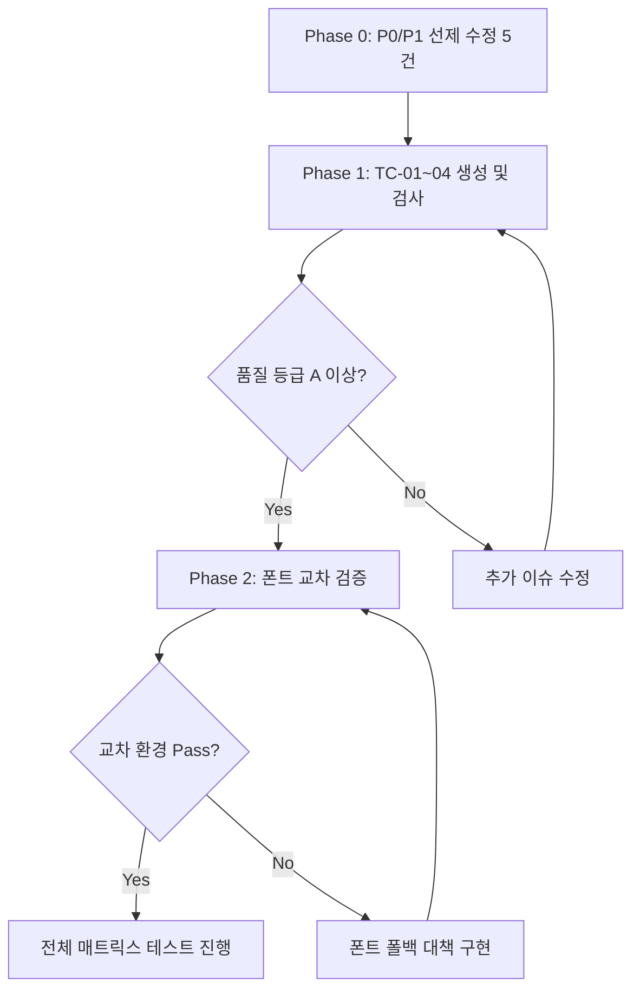

# PPTX 고위험 프리셋 정밀 테스트-보완 계획

> **Version**: v1.0 | **작성일**: 2026-08-13  
> **대상 프리셋**: `pro_dark_obsidian` (🔴 High Risk) · `golden_institutional` (🟡 Medium Risk)  
> **목적**: 전체 60건 매트릭스 테스트 이전에, 렌더링 분기·폰트·색상·폴백 등 고위험 코드 경로를 사전 식별하고 선제적으로 보완

---

## 1. 코드 분석 기반 위험 요인 종합

### 1.1 `pro_dark_obsidian` 🔴 — 발견된 위험 요인 7건

| # | 위험 요인 | 위치 | 심각도 | 설명 |
|---|---|---|---|---|
| OB-01 | **obsidian_glow 글로우 효과에 `transparency` 사용** | `a01-cover.ts` L136~159 | 🔴 P0 | 3개 동심 타원에 `transparency: 90/85/78` 적용. PptxGenJS transparency 버그로 시안(`06B6D4`)이 예기치 않은 색으로 변환될 위험 |
| OB-02 | **obsidian_glow 이미지 없을 때 폴백 없음** | `a01-cover.ts` L276~309 | 🟡 P1 | `split`/`institutional_masses`/`hero_dark`는 폴백 도형이 있지만, `obsidian_glow`는 글로우 타원만으로 구성. 시각적 빈약함 우려 |
| OB-03 | **dramatic 레이아웃 + three-block 이중 액센트** | `a07-three-block.ts` L46,49 + `imlib.ts card()` | 🟡 P1 | `dramatic` card()가 좌측 accent bar 추가 + three-block이 상단 accent bar 수동 추가 → 카드마다 L자형 이중 시안 bar 발생 |
| OB-04 | **나눔스퀘어/나눔고딕 폰트 미설치 환경** | `imlib.ts` L161~162 | 🟡 P1 | 뷰어 환경에 폰트 미설치 시 시스템 기본 폰트로 대체 → 글자 폭 변동 → 텍스트 오버플로/잘림 |
| OB-05 | **dramatic foot() 전폭 다크 bar 높이** | `imlib.ts` L514~533 | 🟢 P2 | `y: 7.08, h: 0.42` 다크 strip이 콘텐츠 영역과 겹칠 가능성 (6.98 근처까지 내용 있는 슬라이드) |
| OB-06 | **시안 액센트 + 의미색 blue 구분 약화** | 전체 | 🟢 P2 | `C.brass`=`06B6D4`(시안), `C.blue`=`2563EB`(블루) → 중개인 배지와 액센트 색상 혼동 가능 |
| OB-07 | **dramatic head() 다크 strip + 라이트 슬라이드** | `imlib.ts` L327~363 | 🟢 P2 | A02~A09 라이트 슬라이드에 전폭 다크 strip 삽입 → 시각적 단절감 의도적이나 전환 어색할 수 있음 |

### 1.2 `golden_institutional` 🟡 — 발견된 위험 요인 5건

| # | 위험 요인 | 위치 | 심각도 | 설명 |
|---|---|---|---|---|
| GI-01 | **institutional_masses 매스에 `transparency` 사용** | `a01-cover.ts` L31~39 | 🔴 P0 | 상단 3개 사각형에 `transparency: 93/95/80` → 의도한 반투명 효과 대신 PptxGenJS 버그로 색상 변환 위험 |
| GI-02 | **a12-ownership 하드코딩 색상** | `a12-ownership.ts` L31,39 | 🟡 P1 | `'888888'`, `'F0F0F0'` 직접 사용 → 테마 교체 시 디자인 불일치 |
| GI-03 | **a13-operating 하드코딩 색상** | `a13-operating.ts` L43~45 | 🟡 P1 | `'F9F9F9'`, `'F0F0F0'` 직접 사용 → 테마 교체 시 디자인 불일치 |
| GI-04 | **classic head() 번호 원형 크기** | `imlib.ts` head() classic | 🟢 P2 | brass 원형(w:0.42, h:0.42)에 2자리 숫자(>9) 삽입 시 fs:13pt에서 잘림 가능 |
| GI-05 | **classic foot() 고정 텍스트** | `imlib.ts` foot() classic | 🟢 P2 | `'CREDEAL · 제이에스부동산중개(주)'` 하드코딩 → 커스텀 companyName 미반영 |

---

## 2. 정밀 테스트 계획

### 2.1 Phase 0: 사전 코드 보완 (테스트 전 선제 수정)

> 테스트 진행 전에 확실한 결함을 먼저 수정하여 테스트 효율을 극대화합니다.

#### P0 수정 대상 (3건)

| ID | 수정 내용 | 대상 파일 |
|---|---|---|
| **FIX-01** | `obsidian_glow` 글로우 타원 3개의 `transparency` 제거 → 불투명 어두운 시안 계열 색상으로 대체 | `a01-cover.ts` |
| **FIX-02** | `institutional_masses` 상단 매스 3개의 `transparency` 제거 → 불투명 어두운 톤으로 대체 | `a01-cover.ts` |
| **FIX-03** | `a12-ownership.ts`, `a13-operating.ts` 하드코딩 색상 → `C.tint`/`C.mute` 팔레트 참조로 교체 | `a12-ownership.ts`, `a13-operating.ts` |

#### P1 수정 대상 (2건)

| ID | 수정 내용 | 대상 파일 |
|---|---|---|
| **FIX-04** | `a07-three-block.ts` — `dramatic` layoutStyle일 때 수동 상단 accent bar 생략 (card()가 이미 좌측 bar 생성) | `a07-three-block.ts` |
| **FIX-05** | `classic` foot() — `THEME_META.companyName` 동적 반영 | `imlib.ts` |

### 2.2 Phase 1: 프리셋별 단위 슬라이드 렌더링 검증

> 각 프리셋으로 **대표 물건 1건** (양평동 더레드빌딩 / 임대수익형 / Grade C)의 Basic + Pro를 생성하여 슬라이드별 정밀 검사

#### 테스트 케이스 매트릭스

| TC# | 프리셋 | 티어 | 물건 | 검증 초점 |
|---|---|---|---|---|
| TC-01 | `pro_dark_obsidian` | Basic | 양평동 | 7슬라이드 dramatic 레이아웃, 시안 액센트, 글로우 표지 |
| TC-02 | `pro_dark_obsidian` | Pro | 양평동 | 24슬라이드 전체 일관성, 재무 슬라이드, 워터마크 |
| TC-03 | `golden_institutional` | Basic | 양평동 | 7슬라이드 classic 레이아웃, 골드 액센트, 매스 표지 |
| TC-04 | `golden_institutional` | Pro | 양평동 | 24슬라이드 전체 일관성, 번호 원형, 폰트 |

#### 슬라이드별 정밀 체크리스트

##### A01 표지 — obsidian_glow 전용 체크

| # | 검사 항목 | 예상 리스크 | Pass 기준 |
|---|---|---|---|
| OB-C1 | 글로우 타원 3개 색상 정확성 | FIX-01 적용 후 | 시안 계열 동심원, 색상 왜곡 없음 |
| OB-C2 | 이미지 없을 때 시각적 완성도 | OB-02 | 다크 배경 + 글로우만으로 프로페셔널함 유지 |
| OB-C3 | 제목 40pt `나눔스퀘어` 렌더링 | OB-04 | 글자 잘림/오버플로 없음 |
| OB-C4 | 가격대 박스 시안 배경 대비 | - | `CFFAFE` 텍스트 on `0891B2` 배경 가독 |
| OB-C5 | 태그 뱃지 다크 배경 가독성 | - | `FFFFFF` on `27272A` 충분한 대비 |

##### A01 표지 — institutional_masses 전용 체크

| # | 검사 항목 | 예상 리스크 | Pass 기준 |
|---|---|---|---|
| GI-C1 | 상단 매스 3개 색상 정확성 | FIX-02 적용 후 | 골드/화이트 톤, 색상 왜곡 없음 |
| GI-C2 | 워드마크 "CRE"+"DEAL" 렌더링 | - | 흰색+골드 분리 표시 |
| GI-C3 | 이미지 없을 때 웜톤 폴백 | 기존 FIX 적용 | `2A2118` 등 웜톤 도형 |
| GI-C4 | 가격대 박스 골드 배경 대비 | - | `F3EBDA` on `977024` 가독 |

##### A02~A09 본문 슬라이드 — layoutStyle 교차 체크

| # | 검사 대상 | obsidian (dramatic) | golden (classic) |
|---|---|---|---|
| H-1 | head() 헤더 | 전폭 다크 strip + 좌측 시안 bar | brass 원형 번호 + 우측 텍스트 |
| H-2 | foot() 푸터 | 전폭 다크 bar, 시안 페이지번호 | 좌측 텍스트, 골드 페이지번호 |
| H-3 | card() 카드 | rect + 좌측 시안 bar | roundRect (r:0.06) |
| H-4 | 텍스트-배경 대비 | 라이트 bg(`FAFAFA`)에 다크 strip 전환 | 순백 bg에 일관된 라이트 톤 |
| H-5 | callout kind:brass | 시안 바/텍스트 | 골드 바/텍스트 |

##### A07 3블록 — dramatic 이중 accent 체크

| # | 검사 항목 | 예상 리스크 | Pass 기준 |
|---|---|---|---|
| TB-1 | 카드 accent bar 형태 | OB-03 (FIX-04) | 좌측 bar만 or 상단 bar만 (이중 X) |
| TB-2 | 한글 value 18pt 렌더링 | - | `나눔고딕` 18pt 잘림 없음 |
| TB-3 | 빈 데이터 callout | - | 시안 callout 가독 |

##### A10 면책 — 다크 슬라이드 대비 체크

| # | 검사 항목 | obsidian | golden |
|---|---|---|---|
| CL-1 | 배지 라벨 가독 | `FFFFFF` on `27272A` | `FFFFFF` on `2D3748` |
| CL-2 | 면책 텍스트 가독 | `A1A1AA` on `18181B` | `A0AEC0` on `1C2433` |
| CL-3 | 푸터 바 액센트 | `CFFAFE` on `0891B2` (시안) | `F3EBDA` on `977024` (골드) |

### 2.3 Phase 2: 폰트 호환성 교차 검증

| 환경 | 나눔스퀘어/나눔고딕 | 맑은 고딕 | 검증 방법 |
|---|---|---|---|
| Windows + 나눔 설치 | ✅ | ✅ | 정상 렌더링 확인 |
| Windows + 나눔 미설치 | ❌ 폴백 | ✅ | PowerPoint 폰트 대체 확인 |
| macOS | ❌ 미설치 기본 | ❌ 미설치 기본 | 기본 폰트 대체 시 레이아웃 유지 확인 |
| Google Slides | 웹 폰트 폴백 | 웹 폰트 폴백 | 업로드 후 렌더링 확인 |
| LibreOffice | 시스템 폰트 폴백 | 시스템 폰트 폴백 | 열기 후 렌더링 확인 |

### 2.4 Phase 3: 보완 구현 & 회귀 테스트



---

## 3. FIX 상세 스펙

### FIX-01: obsidian_glow 글로우 타원 transparency 제거

**현재 코드** (`a01-cover.ts` L136~155):
```typescript
slide.addShape('ellipse', { fill: { color: C.brass, transparency: 90 } }); // 외곽
slide.addShape('ellipse', { fill: { color: C.brass, transparency: 85 } }); // 중간
slide.addShape('ellipse', { fill: { color: C.brass, transparency: 78 } }); // 내부
```

**수정 방안**: 시안의 불투명 어두운 변형 3단계
```typescript
slide.addShape('ellipse', { fill: { color: '0C2A30' } }); // 외곽: 극암 시안
slide.addShape('ellipse', { fill: { color: '0E3640' } }); // 중간: 암 시안
slide.addShape('ellipse', { fill: { color: '134E5E' } }); // 내부: 중암 시안
```

### FIX-02: institutional_masses 매스 transparency 제거

**현재 코드** (`a01-cover.ts` L31~39):
```typescript
slide.addShape('rect', { fill: { color: 'FFFFFF', transparency: 93 } });
slide.addShape('rect', { fill: { color: 'FFFFFF', transparency: 95 } });
slide.addShape('rect', { fill: { color: C.brass, transparency: 80 } });
```

**수정 방안**: 다크 배경(`10161F`) 위의 반투명 효과를 불투명으로 시뮬레이션
```typescript
slide.addShape('rect', { fill: { color: '1A2030' } }); // FFFFFF@93% on 10161F ≈ 1A2030
slide.addShape('rect', { fill: { color: '161D2B' } }); // FFFFFF@95% on 10161F ≈ 161D2B
slide.addShape('rect', { fill: { color: '2E2718' } }); // brass@80% on 10161F ≈ 2E2718
```

### FIX-03: 하드코딩 색상 → 팔레트 참조

```diff
// a12-ownership.ts
- color: '888888'
+ color: C.mute

- fill: { color: 'F0F0F0' }
+ fill: { color: C.tint }

// a13-operating.ts
- fill: { color: 'F9F9F9' }
+ fill: { color: C.tint }

- fill: { color: 'F0F0F0' }
+ fill: { color: C.line2 }
```

### FIX-04: dramatic three-block 이중 accent 방지

```diff
// a07-three-block.ts L49
+ const isCardWithLeftBar = THEME_META.layoutStyle === 'dramatic';
  // brass 상단 accent line
- slide.addShape('rect' as any, {
-   x, y: bY, w: bW, h: 0.04,
-   fill: { color: C.brass },
- });
+ if (!isCardWithLeftBar) {
+   slide.addShape('rect' as any, {
+     x, y: bY, w: bW, h: 0.04,
+     fill: { color: C.brass },
+   });
+ }
```

### FIX-05: classic foot() companyName 동적 반영

```diff
// imlib.ts foot() classic 분기
- s.addText(`CREDEAL · 제이에스부동산중개(주)   |   ${docno}`, {
+ s.addText(`${THEME_META.companyName || 'CREDEAL'}   |   ${docno}`, {
```

---

## 4. 성공 기준 (Phase 2 완료 시)

| 기준 | 조건 |
|---|---|
| **P0 이슈** | FIX-01, FIX-02 적용 후 transparency 색상 왜곡 0건 |
| **P1 이슈** | FIX-03~05 적용 후 하드코딩/이중 accent/고정 텍스트 0건 |
| **TC-01~04 품질** | 4건 모두 루브릭 A등급(80점) 이상 |
| **폰트 호환** | 나눔 미설치 환경에서 레이아웃 붕괴 없음 |
| **회귀** | `credeal_signature` 기존 테스트 결과 유지 |

이 기준 충족 후 → 전체 60건 매트릭스 테스트(08_pptx_preset_quality_test.md) 진행

---

## 5. 참조

| 문서 | 용도 |
|---|---|
| [`docs/PPTX_TEMPLATE_SPEC.md`](../PPTX_TEMPLATE_SPEC.md) | 렌더링 파이프라인 기술 명세 |
| [`docs/test/08_pptx_preset_quality_test.md`](08_pptx_preset_quality_test.md) | 전체 매트릭스 테스트 계획 |
| [`a01-cover.ts`](../../src/domain/building/mobile-im/pptx/archetypes/a01-cover.ts) | 표지 5개 coverStyle 구현 |
| [`imlib.ts`](../../src/domain/building/mobile-im/pptx/imlib.ts) | 5개 layoutStyle 분기 |
